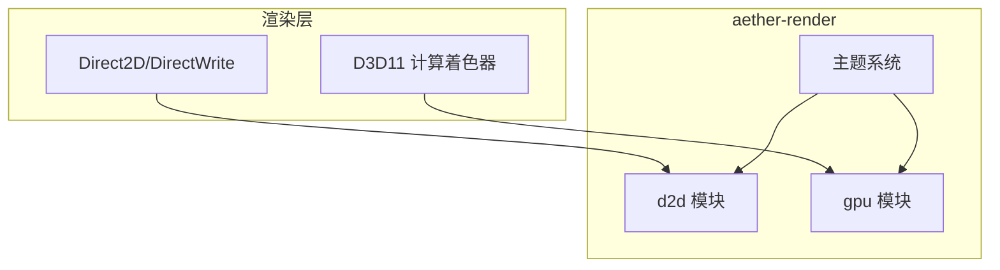
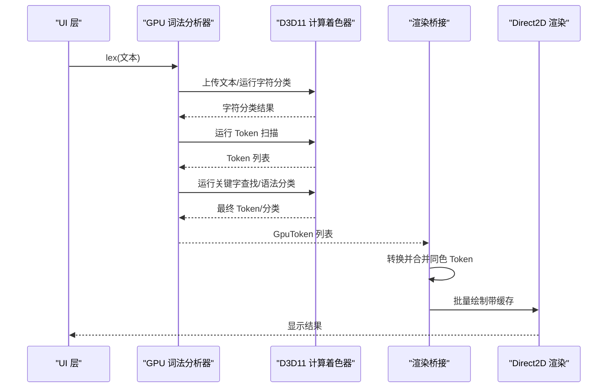
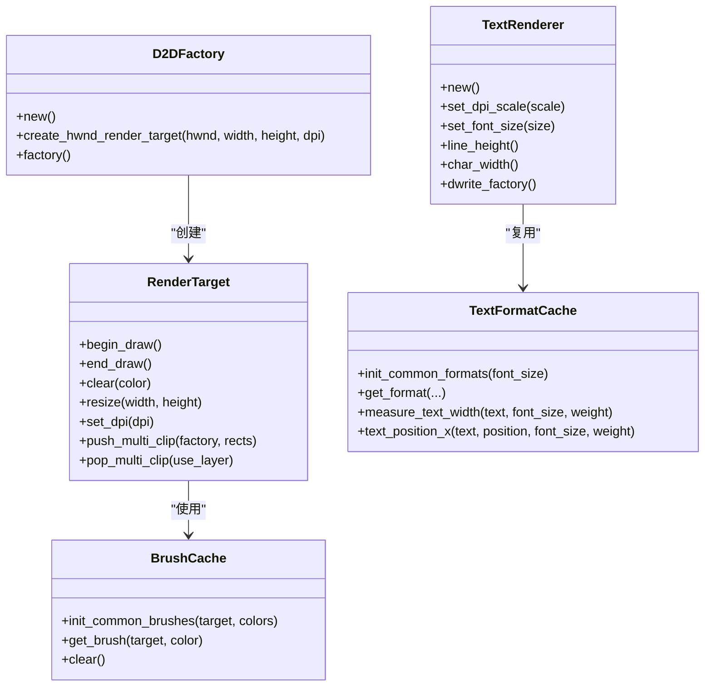
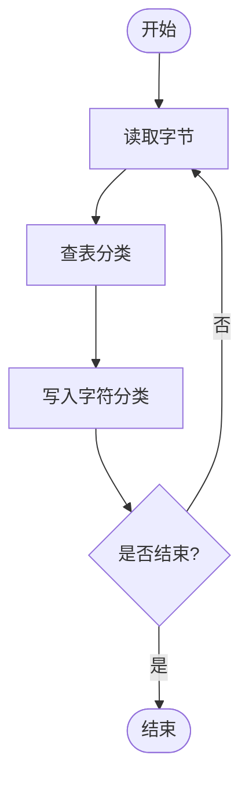
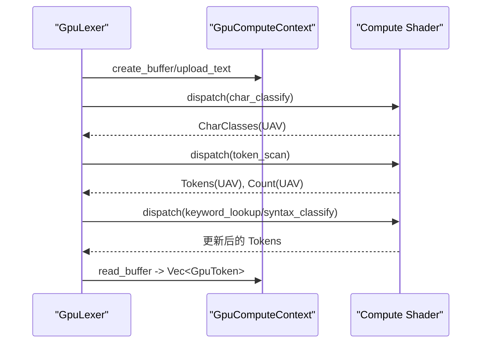
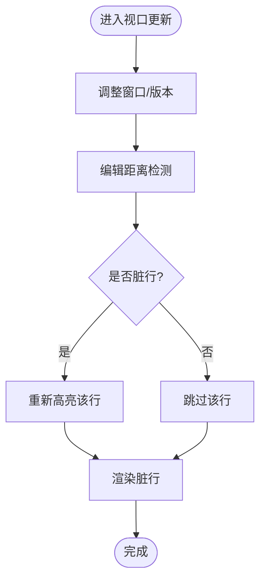
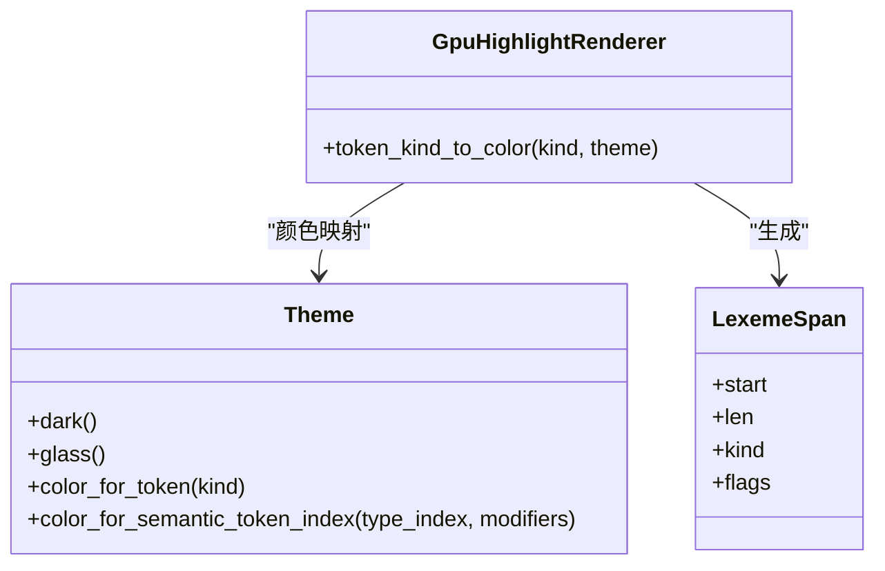
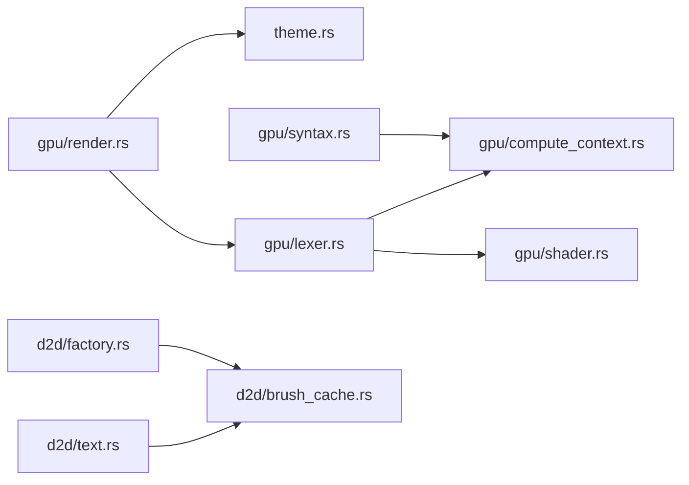

# 硬件加速

<cite>
**本文引用的文件**
- [crates/aether-render/src/lib.rs](file://crates/aether-render/src/lib.rs)
- [crates/aether-render/src/gpu/mod.rs](file://crates/aether-render/src/gpu/mod.rs)
- [crates/aether-render/src/d2d/mod.rs](file://crates/aether-render/src/d2d/mod.rs)
- [crates/aether-render/src/gpu/render.rs](file://crates/aether-render/src/gpu/render.rs)
- [crates/aether-render/src/gpu/compute_context.rs](file://crates/aether-render/src/gpu/compute_context.rs)
- [crates/aether-render/src/gpu/shader.rs](file://crates/aether-render/src/gpu/shader.rs)
- [crates/aether-render/src/gpu/lexer.rs](file://crates/aether-render/src/gpu/lexer.rs)
- [crates/aether-render/src/gpu/syntax.rs](file://crates/aether-render/src/gpu/syntax.rs)
- [crates/aether-render/src/gpu/buffer.rs](file://crates/aether-render/src/gpu/buffer.rs)
- [crates/aether-render/src/gpu/viewport.rs](file://crates/aether-render/src/gpu/viewport.rs)
- [crates/aether-render/src/d2d/factory.rs](file://crates/aether-render/src/d2d/factory.rs)
- [crates/aether-render/src/d2d/text.rs](file://crates/aether-render/src/d2d/text.rs)
- [crates/aether-render/src/d2d/brush_cache.rs](file://crates/aether-render/src/d2d/brush_cache.rs)
- [crates/aether-render/src/theme.rs](file://crates/aether-render/src/theme.rs)
- [crates/aether-render/src/gpu/shaders/char_classify.hlsl](file://crates/aether-render/src/gpu/shaders/char_classify.hlsl)
- [crates/aether-render/src/gpu/shaders/token_scan.hlsl](file://crates/aether-render/src/gpu/shaders/token_scan.hlsl)
- [crates/aether-render/src/gpu/shaders/syntax_classify.hlsl](file://crates/aether-render/src/gpu/shaders/syntax_classify.hlsl)
</cite>

## 目录
1. [简介](#简介)
2. [项目结构](#项目结构)
3. [核心组件](#核心组件)
4. [架构总览](#架构总览)
5. [详细组件分析](#详细组件分析)
6. [依赖关系分析](#依赖关系分析)
7. [性能考量](#性能考量)
8. [故障排除指南](#故障排除指南)
9. [结论](#结论)
10. [附录](#附录)

## 简介
本技术文档围绕硬件加速渲染展开，聚焦于 Direct2D/DirectWrite 的高效使用模式、GPU 着色器（HLSL）实现与优化、计算着色器的并行处理场景（文本词法分析、字符分类、语法分类等）、视口管理与渲染目标优化策略，以及 GPU 性能分析与调试、硬件兼容性检查与回退机制。目标是帮助开发者在 Windows 平台上构建高性能、可维护的编辑器渲染管线。

## 项目结构
渲染子系统位于 aether-render 模块中，分为两大子域：
- d2d：Direct2D/DirectWrite 相关资源管理、画刷缓存、文本格式缓存、多矩形裁剪与 DPI 适配。
- gpu：基于 D3D11 Compute Shader 的词法分析、语法分类、缓冲区管理、视口增量高亮缓存与渲染桥接。

**图表来源**
- [crates/aether-render/src/d2d/mod.rs:1-5](file://crates/aether-render/src/d2d/mod.rs#L1-L5)
- [crates/aether-render/src/gpu/mod.rs:1-10](file://crates/aether-render/src/gpu/mod.rs#L1-L10)
- [crates/aether-render/src/theme.rs:1-86](file://crates/aether-render/src/theme.rs#L1-L86)

**章节来源**
- [crates/aether-render/src/lib.rs:1-5](file://crates/aether-render/src/lib.rs#L1-L5)
- [crates/aether-render/src/d2d/mod.rs:1-5](file://crates/aether-render/src/d2d/mod.rs#L1-L5)
- [crates/aether-render/src/gpu/mod.rs:1-10](file://crates/aether-render/src/gpu/mod.rs#L1-L10)

## 核心组件
- Direct2D/DirectWrite 工厂与渲染目标：创建 HWND 渲染目标、支持 DPI 缩放、多矩形脏区域裁剪。
- 文本渲染器：DirectWrite 字体格式、行高与字符宽度测量、DPI 自适应。
- GPU 计算上下文：封装 D3D11 设备/上下文、Compute Shader 生命周期、缓冲区的创建与读写。
- 着色器编译与加载：HLSL 源码到 CSO 字节码的编译、预编译着色器加载、常量缓冲区。
- GPU 词法分析器：三阶段并行流水线（字符分类、Token 扫描、关键字查找），输出 CPU 可用的 Token 列表。
- GPU 语法分类器：基于 Token 流与语言模式的并行语法识别，输出语义分类结果。
- 视口高亮缓存：按可见窗口增量更新，编辑距离检测减少重算。
- 渲染桥接：将 GPU Token 转换为 LexemeSpan，合并同色 Token 以减少 DrawText 调用。
- 资源缓存：画刷缓存、文本格式缓存、文本布局缓存，避免每帧 COM 对象分配。

**章节来源**
- [crates/aether-render/src/d2d/factory.rs:14-125](file://crates/aether-render/src/d2d/factory.rs#L14-L125)
- [crates/aether-render/src/d2d/text.rs:9-151](file://crates/aether-render/src/d2d/text.rs#L9-L151)
- [crates/aether-render/src/gpu/compute_context.rs:17-94](file://crates/aether-render/src/gpu/compute_context.rs#L17-L94)
- [crates/aether-render/src/gpu/shader.rs:7-149](file://crates/aether-render/src/gpu/shader.rs#L7-L149)
- [crates/aether-render/src/gpu/lexer.rs:48-221](file://crates/aether-render/src/gpu/lexer.rs#L48-L221)
- [crates/aether-render/src/gpu/syntax.rs:39-124](file://crates/aether-render/src/gpu/syntax.rs#L39-L124)
- [crates/aether-render/src/gpu/viewport.rs:3-195](file://crates/aether-render/src/gpu/viewport.rs#L3-L195)
- [crates/aether-render/src/gpu/render.rs:7-126](file://crates/aether-render/src/gpu/render.rs#L7-L126)
- [crates/aether-render/src/d2d/brush_cache.rs:24-105](file://crates/aether-render/src/d2d/brush_cache.rs#L24-L105)

## 架构总览
整体渲染管线由“GPU 并行预处理 + CPU 轻量后处理 + Direct2D 高效绘制”构成：
- GPU 阶段：字符分类 → Token 扫描 → 关键字查找 → 语法分类（可选）。
- CPU 阶段：Token 转 LexemeSpan、合并同色 Token、主题颜色映射。
- 渲染阶段：Direct2D 批量绘制，结合画刷/文本布局缓存与多矩形裁剪。

**图表来源**
- [crates/aether-render/src/gpu/lexer.rs:187-221](file://crates/aether-render/src/gpu/lexer.rs#L187-L221)
- [crates/aether-render/src/gpu/render.rs:7-126](file://crates/aether-render/src/gpu/render.rs#L7-L126)
- [crates/aether-render/src/d2d/factory.rs:33-125](file://crates/aether-render/src/d2d/factory.rs#L33-L125)

## 详细组件分析

### Direct2D/DirectWrite 高效使用模式
- 渲染目标与 DPI：通过工厂创建 HWND 渲染目标，设置物理像素尺寸与 DPI；支持运行时 DPI 变更。
- 多矩形裁剪：使用几何组与图层实现真正的多矩形裁剪，避免包围盒膨胀导致的过度重绘。
- 文本测量与格式：使用 DirectWrite TextLayout 精确测量单字符推进宽度与文本宽度；提供文本格式缓存与布局缓存，避免每帧创建 COM 对象。
- 画刷缓存：预存常用颜色画笔，未命中时回退到 HashMap，限制最大条目数防止无界增长。

**图表来源**
- [crates/aether-render/src/d2d/factory.rs:14-281](file://crates/aether-render/src/d2d/factory.rs#L14-L281)
- [crates/aether-render/src/d2d/text.rs:9-151](file://crates/aether-render/src/d2d/text.rs#L9-L151)
- [crates/aether-render/src/d2d/brush_cache.rs:24-105](file://crates/aether-render/src/d2d/brush_cache.rs#L24-L105)
- [crates/aether-render/src/d2d/brush_cache.rs:107-379](file://crates/aether-render/src/d2d/brush_cache.rs#L107-L379)

**章节来源**
- [crates/aether-render/src/d2d/factory.rs:33-125](file://crates/aether-render/src/d2d/factory.rs#L33-L125)
- [crates/aether-render/src/d2d/factory.rs:164-281](file://crates/aether-render/src/d2d/factory.rs#L164-L281)
- [crates/aether-render/src/d2d/text.rs:19-151](file://crates/aether-render/src/d2d/text.rs#L19-L151)
- [crates/aether-render/src/d2d/brush_cache.rs:24-105](file://crates/aether-render/src/d2d/brush_cache.rs#L24-L105)
- [crates/aether-render/src/d2d/brush_cache.rs:107-379](file://crates/aether-render/src/d2d/brush_cache.rs#L107-L379)

### GPU 着色器实现与优化（HLSL）
- 字符分类（Phase 1）：每个线程处理一个字符，使用 256 项查找表快速分类，写入 UAV。
- Token 扫描（Phase 2）：基于字符分类识别 Token 边界，使用共享内存与原子计数器生成 Token 列表。
- 语法分类（Phase 3）：根据 Token 序列匹配语言模式，输出语法分类与置信度。
- 优化要点：
  - 使用 groupshared 减少全局内存访问。
  - 控制线程组大小（256）以平衡占用率与同步开销。
  - 避免分支发散，尽量向量化操作。
  - 对字符串/注释/数字等复杂 Token 采用局部循环扩展长度。

**图表来源**
- [crates/aether-render/src/gpu/shaders/char_classify.hlsl:61-88](file://crates/aether-render/src/gpu/shaders/char_classify.hlsl#L61-L88)

**章节来源**
- [crates/aether-render/src/gpu/shaders/char_classify.hlsl:1-88](file://crates/aether-render/src/gpu/shaders/char_classify.hlsl#L1-L88)
- [crates/aether-render/src/gpu/shaders/token_scan.hlsl:1-313](file://crates/aether-render/src/gpu/shaders/token_scan.hlsl#L1-L313)
- [crates/aether-render/src/gpu/shaders/syntax_classify.hlsl:1-142](file://crates/aether-render/src/gpu/shaders/syntax_classify.hlsl#L1-L142)

### 计算着色器使用场景
- 文本词法分析：并行字符分类与 Token 扫描，显著降低大文件解析延迟。
- 字符分类：利用查找表与 SIMD 友好的数据结构，适合大规模字符流。
- 语法分类：基于 Token 流的模式匹配，为语义高亮提供快速近似。

**图表来源**
- [crates/aether-render/src/gpu/lexer.rs:187-221](file://crates/aether-render/src/gpu/lexer.rs#L187-L221)
- [crates/aether-render/src/gpu/compute_context.rs:232-272](file://crates/aether-render/src/gpu/compute_context.rs#L232-L272)

**章节来源**
- [crates/aether-render/src/gpu/lexer.rs:48-221](file://crates/aether-render/src/gpu/lexer.rs#L48-L221)
- [crates/aether-render/src/gpu/compute_context.rs:17-94](file://crates/aether-render/src/gpu/compute_context.rs#L17-L94)

### 视口管理与渲染目标优化
- 视口高亮缓存：仅缓存可见窗口内的 Token，支持窗口移动与大小调整时的增量更新。
- 编辑距离检测：比较新旧行文本，跨越 Token 边界或显著变化才标记脏行。
- 渲染目标裁剪：使用多矩形裁剪减少重绘面积，避免包围盒膨胀。
- 双缓冲与池化：DoubleBuffer 用于 CPU/GPU 并行；GpuBufferPool 复用 D3D11 Buffer 降低分配开销。

**图表来源**
- [crates/aether-render/src/gpu/viewport.rs:63-195](file://crates/aether-render/src/gpu/viewport.rs#L63-L195)
- [crates/aether-render/src/gpu/render.rs:128-220](file://crates/aether-render/src/gpu/render.rs#L128-L220)

**章节来源**
- [crates/aether-render/src/gpu/viewport.rs:3-195](file://crates/aether-render/src/gpu/viewport.rs#L3-L195)
- [crates/aether-render/src/gpu/render.rs:128-220](file://crates/aether-render/src/gpu/render.rs#L128-L220)
- [crates/aether-render/src/d2d/factory.rs:164-281](file://crates/aether-render/src/d2d/factory.rs#L164-L281)

### 渲染桥接与主题映射
- GPU Token 转 LexemeSpan：保留起始位置与长度，结合语法分类提升 TokenKind 精度。
- 合并同色 Token：相邻且类型相同的 Token 合并，减少 DrawText 调用次数。
- 主题颜色映射：根据 TokenKind 或语义索引获取 D2D1_COLOR_F，支持深色与毛玻璃主题。

**图表来源**
- [crates/aether-render/src/gpu/render.rs:7-126](file://crates/aether-render/src/gpu/render.rs#L7-L126)
- [crates/aether-render/src/theme.rs:148-279](file://crates/aether-render/src/theme.rs#L148-L279)

**章节来源**
- [crates/aether-render/src/gpu/render.rs:7-126](file://crates/aether-render/src/gpu/render.rs#L7-L126)
- [crates/aether-render/src/theme.rs:148-279](file://crates/aether-render/src/theme.rs#L148-L279)

## 依赖关系分析
- 模块耦合：
  - gpu/lexer 依赖 compute_context、shader、buffer。
  - gpu/syntax 依赖 compute_context、shader。
  - d2d/factory 与 brush_cache 提供渲染资源与缓存。
  - render 桥接 gpu 与 d2d，theme 提供颜色映射。
- 外部依赖：
  - Windows API：Direct2D、DirectWrite、D3D11、DXGI。
  - HLSL 编译器：d3dcompiler_47.dll。

**图表来源**
- [crates/aether-render/src/gpu/lexer.rs:1-10](file://crates/aether-render/src/gpu/lexer.rs#L1-L10)
- [crates/aether-render/src/gpu/syntax.rs:1-9](file://crates/aether-render/src/gpu/syntax.rs#L1-L9)
- [crates/aether-render/src/gpu/render.rs:1-6](file://crates/aether-render/src/gpu/render.rs#L1-L6)
- [crates/aether-render/src/d2d/factory.rs:1-13](file://crates/aether-render/src/d2d/factory.rs#L1-L13)
- [crates/aether-render/src/d2d/brush_cache.rs:1-14](file://crates/aether-render/src/d2d/brush_cache.rs#L1-L14)

**章节来源**
- [crates/aether-render/src/gpu/lexer.rs:1-10](file://crates/aether-render/src/gpu/lexer.rs#L1-L10)
- [crates/aether-render/src/gpu/syntax.rs:1-9](file://crates/aether-render/src/gpu/syntax.rs#L1-L9)
- [crates/aether-render/src/gpu/render.rs:1-6](file://crates/aether-render/src/gpu/render.rs#L1-L6)
- [crates/aether-render/src/d2d/factory.rs:1-13](file://crates/aether-render/src/d2d/factory.rs#L1-L13)
- [crates/aether-render/src/d2d/brush_cache.rs:1-14](file://crates/aether-render/src/d2d/brush_cache.rs#L1-L14)

## 性能考量
- 计算着色器优化：
  - 合理划分线程组（256 线程/组），避免跨组同步瓶颈。
  - 使用共享内存缓存热点数据（如本地起始标记）。
  - 最小化分支与条件判断，提高指令吞吐。
- 内存与带宽：
  - 结构化缓冲区对齐（GpuToken/SyntaxPattern）减少填充浪费。
  - 使用 Staging Buffer 进行 CPU-GPU 数据传输，避免阻塞。
- 渲染优化：
  - 合并同色 Token 减少 DrawText 调用。
  - 多矩形裁剪避免全屏重绘。
  - 画刷/文本格式/布局缓存降低 COM 对象分配。
- 视口增量更新：
  - 编辑距离阈值控制重算频率。
  - 仅对脏行执行高亮与绘制。

[本节为通用指导，不直接分析具体文件]

## 故障排除指南
- 着色器编译失败：
  - 检查 HLSL 源码与入口点、目标模型（cs_5_0）。
  - 捕获编译错误信息并打印诊断日志。
- GPU 不可用或设备丢失：
  - 初始化 D3D11 设备失败时回退到 CPU 路径。
  - 重置渲染目标与缓存（画刷、布局）。
- 渲染异常：
  - 验证 DPI 缩放与字体大小一致性。
  - 检查多矩形裁剪参数与图层弹出配对。
- 性能退化：
  - 监控 GPU 利用率与带宽（使用 PIX 等工具）。
  - 减少频繁缓冲区分配，复用池化对象。

**章节来源**
- [crates/aether-render/src/gpu/shader.rs:22-80](file://crates/aether-render/src/gpu/shader.rs#L22-L80)
- [crates/aether-render/src/gpu/compute_context.rs:47-84](file://crates/aether-render/src/gpu/compute_context.rs#L47-L84)
- [crates/aether-render/src/d2d/factory.rs:119-125](file://crates/aether-render/src/d2d/factory.rs#L119-L125)
- [crates/aether-render/src/d2d/brush_cache.rs:100-105](file://crates/aether-render/src/d2d/brush_cache.rs#L100-L105)

## 结论
本项目通过 GPU 并行词法分析与 Direct2D 高效渲染相结合，实现了高性能的代码编辑器高亮与文本渲染。关键优化包括：
- 三阶段计算着色器流水线，充分利用 GPU 并行能力。
- Direct2D/DirectWrite 资源缓存与多矩形裁剪，降低 CPU/GPU 开销。
- 视口增量更新与编辑距离检测，减少不必要的重算。
- 主题系统与颜色映射，支持多种视觉风格。
建议在生产环境中启用预编译着色器、配置合理的视口阈值，并使用性能分析工具持续优化。

[本节为总结性内容，不直接分析具体文件]

## 附录
- 最佳实践：
  - 优先使用预编译 CSO 着色器，避免运行时编译开销。
  - 合理设置 min_file_size，小文件走 CPU 路径更经济。
  - 保持 D2D 与 D3D11 资源生命周期一致，避免悬挂引用。
- 调试工具：
  - 使用 PIX 分析 GPU 时间线、着色器执行与内存带宽。
  - 启用日志输出，记录着色器编译错误与设备状态。
- 兼容性检查：
  - 检测 D3D11 特性级别，必要时降级至软件渲染。
  - 验证 DXGI 格式与缓冲区绑定标志。

[本节为补充说明，不直接分析具体文件]