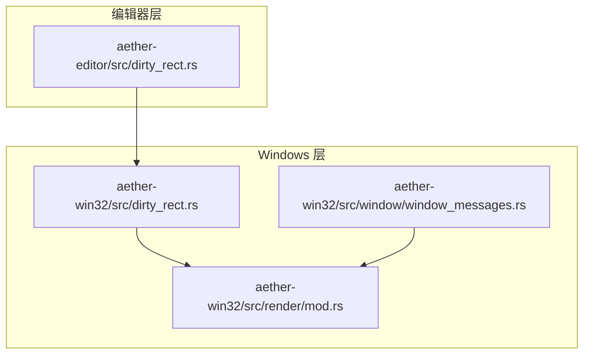
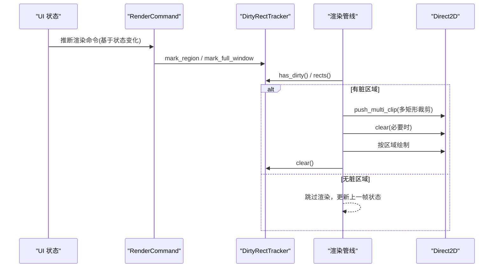
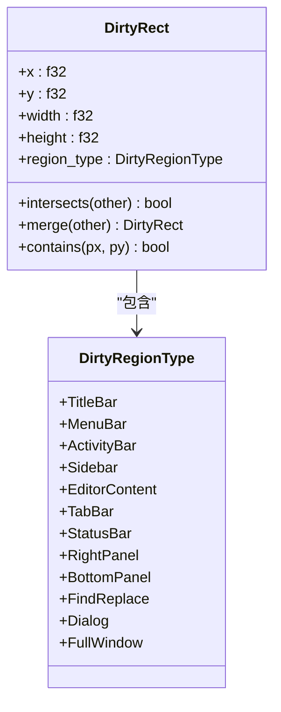
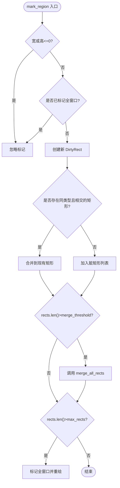
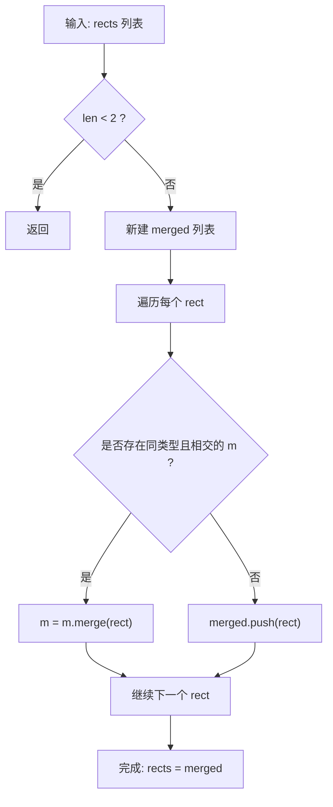
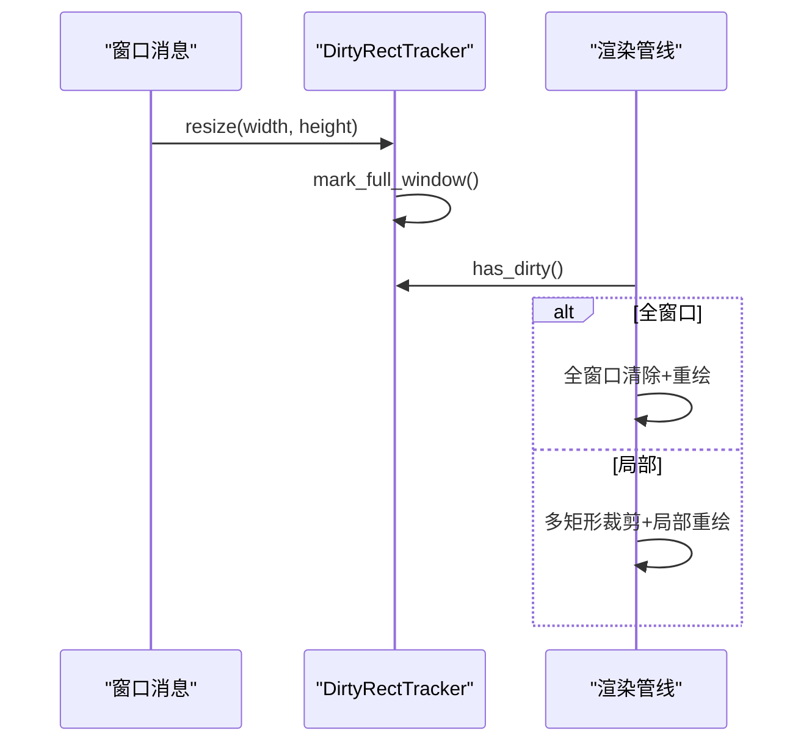
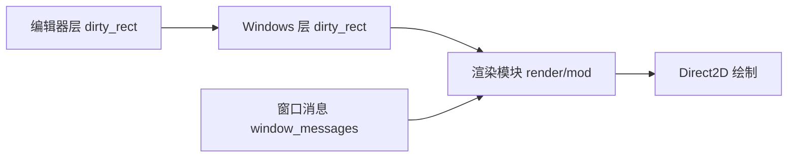

# 脏区域计算

<cite>
**本文引用的文件**
- [crates/aether-editor/src/dirty_rect.rs](file://crates/aether-editor/src/dirty_rect.rs)
- [crates/aether-win32/src/dirty_rect.rs](file://crates/aether-win32/src/dirty_rect.rs)
- [crates/aether-win32/src/render/mod.rs](file://crates/aether-win32/src/render/mod.rs)
- [crates/aether-win32/src/window/window_messages.rs](file://crates/aether-win32/src/window/window_messages.rs)
</cite>

## 目录
1. [简介](#简介)
2. [项目结构](#项目结构)
3. [核心组件](#核心组件)
4. [架构总览](#架构总览)
5. [详细组件分析](#详细组件分析)
6. [依赖关系分析](#依赖关系分析)
7. [性能考量](#性能考量)
8. [故障排查指南](#故障排查指南)
9. [结论](#结论)
10. [附录](#附录)

## 简介
本技术文档围绕“脏区域计算系统”展开，聚焦于 DirtyRectTracker 的实现原理、增量更新机制、最小重绘范围确定算法、脏矩形合并策略（重叠检测、区域类型分类与智能合并）、各类区域的标记方法、全窗口重绘触发条件与降级机制，以及脏区域监控与调试工具的使用。同时提供性能优化技巧、常见问题解决方案与最佳实践建议，帮助开发者高效调优渲染管线。

## 项目结构
脏区域计算的核心逻辑位于编辑器层与 Windows 平台层的两个同名文件中：
- 编辑器层：定义脏区域类型、DirtyRect、DirtyRectTracker 及渲染命令推断逻辑
- Windows 层：实现与渲染管线的集成，将状态变化映射为脏区域标记，并在绘制阶段应用多矩形裁剪

图表来源
- [crates/aether-editor/src/dirty_rect.rs:1-707](file://crates/aether-editor/src/dirty_rect.rs#L1-L707)
- [crates/aether-win32/src/dirty_rect.rs:1-707](file://crates/aether-win32/src/dirty_rect.rs#L1-L707)
- [crates/aether-win32/src/render/mod.rs:500-699](file://crates/aether-win32/src/render/mod.rs#L500-L699)
- [crates/aether-win32/src/window/window_messages.rs:837-878](file://crates/aether-win32/src/window/window_messages.rs#L837-L878)

章节来源
- [crates/aether-editor/src/dirty_rect.rs:1-707](file://crates/aether-editor/src/dirty_rect.rs#L1-L707)
- [crates/aether-win32/src/dirty_rect.rs:1-707](file://crates/aether-win32/src/dirty_rect.rs#L1-L707)
- [crates/aether-win32/src/render/mod.rs:500-699](file://crates/aether-win32/src/render/mod.rs#L500-L699)
- [crates/aether-win32/src/window/window_messages.rs:837-878](file://crates/aether-win32/src/window/window_messages.rs#L837-L878)

## 核心组件
- 脏区域类型枚举：用于区分标题栏、菜单栏、活动栏、侧边栏、编辑器内容区、标签栏、状态栏、右侧面板、底部面板、查找替换面板、对话框、全窗口等
- 脏矩形结构体：包含坐标、宽高与区域类型，支持相交判断、合并与点包含测试
- 脏矩形追踪器：维护当前帧的脏矩形列表、全窗口标志、窗口尺寸、合并阈值与最大矩形数量；提供标记、查询、合并、清除等方法
- 渲染命令推断：根据状态变化（光标移动、选择变化、文本编辑、滚动变化、侧边栏/右侧面板/底部面板/状态栏变化、对话框可见性）推断最优渲染命令，避免无变化时的全量重绘

章节来源
- [crates/aether-editor/src/dirty_rect.rs:8-35](file://crates/aether-editor/src/dirty_rect.rs#L8-L35)
- [crates/aether-editor/src/dirty_rect.rs:37-85](file://crates/aether-editor/src/dirty_rect.rs#L37-L85)
- [crates/aether-editor/src/dirty_rect.rs:87-366](file://crates/aether-editor/src/dirty_rect.rs#L87-L366)
- [crates/aether-editor/src/dirty_rect.rs:368-426](file://crates/aether-editor/src/dirty_rect.rs#L368-L426)
- [crates/aether-win32/src/dirty_rect.rs:8-35](file://crates/aether-win32/src/dirty_rect.rs#L8-L35)
- [crates/aether-win32/src/dirty_rect.rs:37-85](file://crates/aether-win32/src/dirty_rect.rs#L37-L85)
- [crates/aether-win32/src/dirty_rect.rs:87-366](file://crates/aether-win32/src/dirty_rect.rs#L87-L366)
- [crates/aether-win32/src/dirty_rect.rs:368-426](file://crates/aether-win32/src/dirty_rect.rs#L368-L426)

## 架构总览
脏区域计算贯穿“状态变化 → 脏区域标记 → 渲染裁剪 → 绘制执行”的完整流程。渲染管线在收到 RenderCommand 后，将对应区域标记为脏；若存在脏区域则进入绘制阶段，使用多矩形并集裁剪减少无效绘制；若无脏区域则跳过渲染，仅更新上一帧状态快照以避免下一帧误判。

图表来源
- [crates/aether-win32/src/render/mod.rs:500-699](file://crates/aether-win32/src/render/mod.rs#L500-L699)
- [crates/aether-editor/src/dirty_rect.rs:368-426](file://crates/aether-editor/src/dirty_rect.rs#L368-L426)

章节来源
- [crates/aether-win32/src/render/mod.rs:500-699](file://crates/aether-win32/src/render/mod.rs#L500-L699)
- [crates/aether-editor/src/dirty_rect.rs:368-426](file://crates/aether-editor/src/dirty_rect.rs#L368-L426)

## 详细组件分析

### DirtyRect 与 DirtyRegionType
- DirtyRegionType：对界面各区域进行语义化分类，便于后续按区域类型进行合并与查询
- DirtyRect：提供 intersects、merge、contains 等基础几何操作，确保合并时保留区域类型信息

图表来源
- [crates/aether-editor/src/dirty_rect.rs:8-35](file://crates/aether-editor/src/dirty_rect.rs#L8-L35)
- [crates/aether-editor/src/dirty_rect.rs:37-85](file://crates/aether-editor/src/dirty_rect.rs#L37-L85)
- [crates/aether-win32/src/dirty_rect.rs:8-35](file://crates/aether-win32/src/dirty_rect.rs#L8-L35)
- [crates/aether-win32/src/dirty_rect.rs:37-85](file://crates/aether-win32/src/dirty_rect.rs#L37-L85)

章节来源
- [crates/aether-editor/src/dirty_rect.rs:8-85](file://crates/aether-editor/src/dirty_rect.rs#L8-L85)
- [crates/aether-win32/src/dirty_rect.rs:8-85](file://crates/aether-win32/src/dirty_rect.rs#L8-L85)

### DirtyRectTracker：增量更新与最小重绘范围确定
- 增量更新机制：每次 mark_region 时检查是否与已有同类型矩形相交，若相交则合并；否则新增一个矩形
- 最小重绘范围确定：通过 is_editor_dirty、is_sidebar_dirty、is_status_bar_dirty 等方法，结合 full_window_dirty 标志，精确判定哪些区域需要重绘
- 自动合并与降级：当脏矩形数量超过 merge_threshold 时触发 merge_all_rects；超过 max_rects 时降级为全窗口重绘

图表来源
- [crates/aether-editor/src/dirty_rect.rs:120-162](file://crates/aether-editor/src/dirty_rect.rs#L120-L162)
- [crates/aether-editor/src/dirty_rect.rs:336-356](file://crates/aether-editor/src/dirty_rect.rs#L336-L356)
- [crates/aether-win32/src/dirty_rect.rs:120-162](file://crates/aether-win32/src/dirty_rect.rs#L120-L162)
- [crates/aether-win32/src/dirty_rect.rs:336-356](file://crates/aether-win32/src/dirty_rect.rs#L336-L356)

章节来源
- [crates/aether-editor/src/dirty_rect.rs:120-162](file://crates/aether-editor/src/dirty_rect.rs#L120-L162)
- [crates/aether-editor/src/dirty_rect.rs:336-356](file://crates/aether-editor/src/dirty_rect.rs#L336-L356)
- [crates/aether-win32/src/dirty_rect.rs:120-162](file://crates/aether-win32/src/dirty_rect.rs#L120-L162)
- [crates/aether-win32/src/dirty_rect.rs:336-356](file://crates/aether-win32/src/dirty_rect.rs#L336-L356)

### 脏矩形合并策略：重叠检测、区域类型分类与智能合并
- 重叠检测：基于 AABB 相交判断，严格边界（相切不算相交）
- 区域类型分类：仅在相同 region_type 之间进行合并，避免跨区域错误合并
- 智能合并：merge_all_rects 遍历所有矩形，按类型分组并逐步合并相交矩形，最终得到最简集合

图表来源
- [crates/aether-editor/src/dirty_rect.rs:336-356](file://crates/aether-editor/src/dirty_rect.rs#L336-L356)
- [crates/aether-win32/src/dirty_rect.rs:336-356](file://crates/aether-win32/src/dirty_rect.rs#L336-L356)

章节来源
- [crates/aether-editor/src/dirty_rect.rs:336-356](file://crates/aether-editor/src/dirty_rect.rs#L336-L356)
- [crates/aether-win32/src/dirty_rect.rs:336-356](file://crates/aether-win32/src/dirty_rect.rs#L336-L356)

### 区域类型标记方法
- 编辑器内容：mark_editor_line、mark_cursor
- 状态栏：mark_status_bar
- 侧边栏/活动栏：通过布局区域获取并标记
- 右侧面板/底部面板：通过布局区域获取并标记
- 对话框：菜单 hover 快速路径中单独标记 Dialog 类型，以启用特殊渲染优化

章节来源
- [crates/aether-editor/src/dirty_rect.rs:164-203](file://crates/aether-editor/src/dirty_rect.rs#L164-L203)
- [crates/aether-win32/src/render/mod.rs:500-529](file://crates/aether-win32/src/render/mod.rs#L500-L529)

### 全窗口重绘触发条件与降级机制
- 触发条件：
  - resize：调用 resize 方法更新窗口尺寸并标记全窗口
  - DPI 变化：处理 WM_DPICHANGED 消息后重建渲染目标并标记全窗口
  - 脏矩形过多：超过 max_rects 时自动降级为全窗口重绘
- 降级机制：当局部标记过多导致管理成本上升时，退化为全窗口重绘，保证整体性能稳定

图表来源
- [crates/aether-editor/src/dirty_rect.rs:323-328](file://crates/aether-editor/src/dirty_rect.rs#L323-L328)
- [crates/aether-win32/src/window/window_messages.rs:837-878](file://crates/aether-win32/src/window/window_messages.rs#L837-L878)
- [crates/aether-win32/src/render/mod.rs:524-537](file://crates/aether-win32/src/render/mod.rs#L524-L537)

章节来源
- [crates/aether-editor/src/dirty_rect.rs:323-328](file://crates/aether-editor/src/dirty_rect.rs#L323-L328)
- [crates/aether-win32/src/window/window_messages.rs:837-878](file://crates/aether-win32/src/window/window_messages.rs#L837-L878)
- [crates/aether-win32/src/render/mod.rs:524-537](file://crates/aether-win32/src/render/mod.rs#L524-L537)

### 渲染命令推断与无变化跳过
- 根据状态变化推断最优渲染命令，避免无变化时的 FullRedraw
- 若推断结果为 None，则不标记任何脏区域，渲染管线直接跳过绘制，仅更新上一帧状态快照

章节来源
- [crates/aether-editor/src/dirty_rect.rs:368-426](file://crates/aether-editor/src/dirty_rect.rs#L368-L426)
- [crates/aether-win32/src/render/mod.rs:524-537](file://crates/aether-win32/src/render/mod.rs#L524-L537)

## 依赖关系分析
- 编辑器层与 Windows 层共享相同的脏区域数据结构与追踪器接口，确保跨平台一致性
- 渲染管线依赖 DirtyRectTracker 提供的 has_dirty、rects、is_full_window 等方法决定裁剪策略
- 窗口消息处理在 DPI 变化时触发全窗口重绘，确保渲染目标与字体缓存的一致性

图表来源
- [crates/aether-editor/src/dirty_rect.rs:1-707](file://crates/aether-editor/src/dirty_rect.rs#L1-L707)
- [crates/aether-win32/src/dirty_rect.rs:1-707](file://crates/aether-win32/src/dirty_rect.rs#L1-L707)
- [crates/aether-win32/src/render/mod.rs:500-699](file://crates/aether-win32/src/render/mod.rs#L500-L699)
- [crates/aether-win32/src/window/window_messages.rs:837-878](file://crates/aether-win32/src/window/window_messages.rs#L837-L878)

章节来源
- [crates/aether-editor/src/dirty_rect.rs:1-707](file://crates/aether-editor/src/dirty_rect.rs#L1-L707)
- [crates/aether-win32/src/dirty_rect.rs:1-707](file://crates/aether-win32/src/dirty_rect.rs#L1-L707)
- [crates/aether-win32/src/render/mod.rs:500-699](file://crates/aether-win32/src/render/mod.rs#L500-L699)
- [crates/aether-win32/src/window/window_messages.rs:837-878](file://crates/aether-win32/src/window/window_messages.rs#L837-L878)

## 性能考量
- 合并阈值与最大矩形数：合理设置 merge_threshold 与 max_rects 平衡合并成本与降级频率
- 多矩形裁剪：使用 push_multi_clip 避免单一包围盒导致的重绘面积膨胀
- 无变化跳过：RenderCommand::None 避免不必要的渲染开销
- 菜单快速路径：Dialog 类型脏区域配合上下文菜单展开时，仅重绘菜单本体，显著降低交互卡顿

[本节为通用性能讨论，无需特定文件引用]

## 故障排查指南
- 菜单快速路径 EndDraw 失败：记录错误码并恢复至全窗口重绘，避免菜单高亮丢失
- DPI 切换后字体不一致：重建 text_format_cache 与 brush_cache，确保字体尺寸与新 DPI 匹配
- 脏区域过多导致性能下降：检查是否频繁标记大量不相交矩形，考虑调整阈值或合并策略

章节来源
- [crates/aether-win32/src/render/mod.rs:617-631](file://crates/aether-win32/src/render/mod.rs#L617-L631)
- [crates/aether-win32/src/window/window_messages.rs:861-878](file://crates/aether-win32/src/window/window_messages.rs#L861-L878)

## 结论
脏区域计算系统通过精细的区域类型分类、智能合并策略与多级降级机制，实现了高效的增量更新与最小重绘范围确定。结合渲染命令推断与多矩形裁剪，系统在保持流畅交互的同时显著降低了渲染开销。开发者可依据本文档的最佳实践与调优建议，进一步优化脏区域管理与渲染性能。

[本节为总结性内容，无需特定文件引用]

## 附录
- 调试工具：使用 dirty_count、rects 等方法统计脏区域数量与具体矩形，辅助定位性能瓶颈
- 最佳实践：
  - 尽量使用细粒度区域标记，避免不必要的全窗口重绘
  - 合理设置合并阈值与最大矩形数，适应不同场景的性能需求
  - 在无状态变化时利用 RenderCommand::None 跳过渲染
  - 关注菜单快速路径与 DPI 变化的特殊处理

[本节为补充说明，无需特定文件引用]