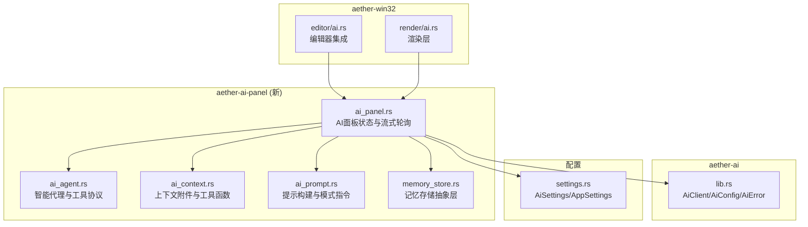
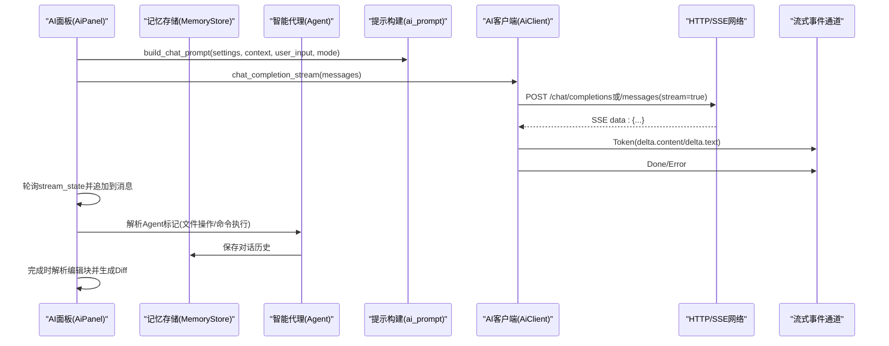
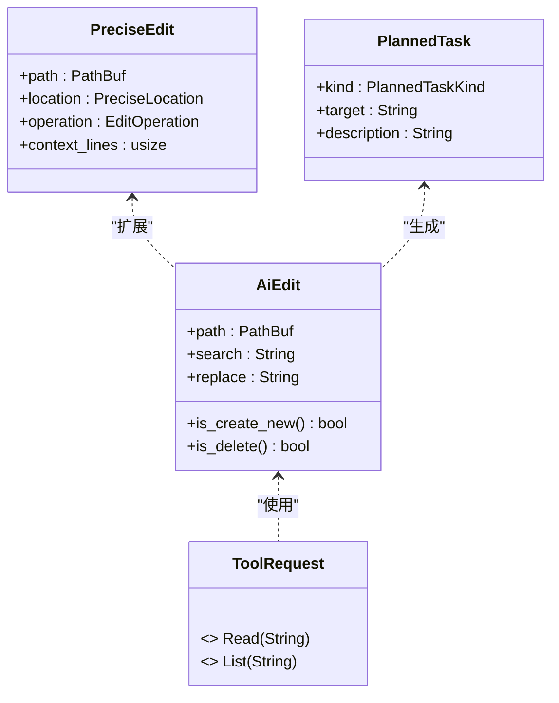
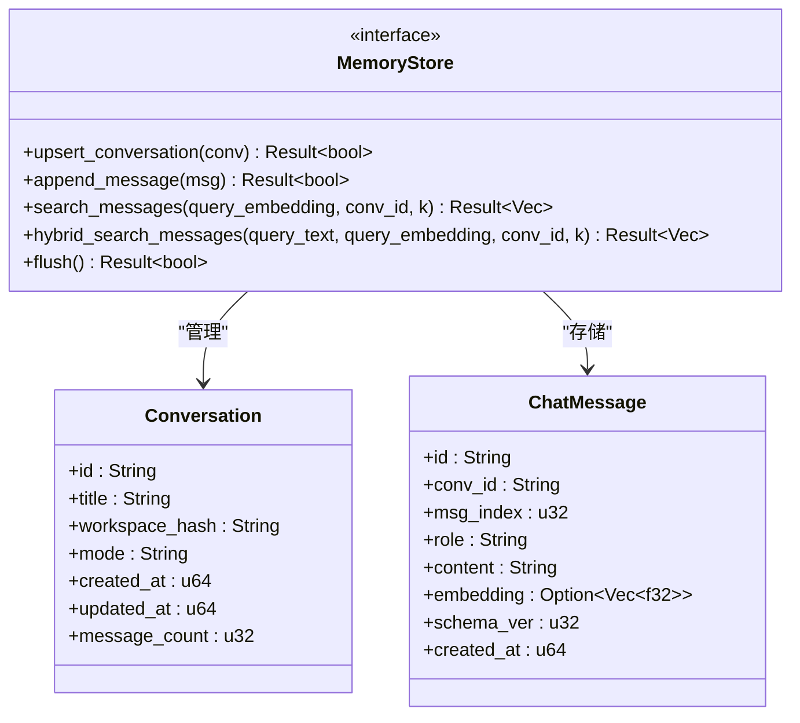

# AI 助手集成

<cite>
**本文引用的文件**
- [aether-ai-panel/src/lib.rs](file://crates/aether-ai-panel/src/lib.rs)
- [aether-ai-panel/src/ai_agent.rs](file://crates/aether-ai-panel/src/ai_agent.rs)
- [aether-ai-panel/src/ai_panel.rs](file://crates/aether-ai-panel/src/ai_panel.rs)
- [aether-ai-panel/src/ai_context.rs](file://crates/aether-ai-panel/src/ai_context.rs)
- [aether-ai-panel/src/ai_prompt.rs](file://crates/aether-ai-panel/src/ai_prompt.rs)
- [aether-ai-panel/src/memory_store.rs](file://crates/aether-ai-panel/src/memory_store.rs)
- [aether-ai/src/lib.rs](file://crates/aether-ai/src/lib.rs)
- [aether-shared/src/settings.rs](file://crates/aether-shared/src/settings.rs)
</cite>

## 更新摘要
**变更内容**
- **重大重构**：AI相关组件已从win32 crate完全迁移到独立的aether-ai-panel crate，实现了更好的模块化和职责分离
- **功能增强**：新增了智能代理系统、记忆存储、嵌入向量搜索等高级功能
- **架构优化**：通过MemoryStore抽象层实现了可插拔的持久化存储方案
- **协议升级**：增强了Agent工具标记协议，支持更精确的文件编辑和命令执行
- **性能改进**：引入了sqlite-vec向量数据库支持语义检索和混合搜索

## 目录
1. [简介](#简介)
2. [项目结构](#项目结构)
3. [核心组件](#核心组件)
4. [架构总览](#架构总览)
5. [详细组件分析](#详细组件分析)
6. [依赖关系分析](#依赖关系分析)
7. [性能与可扩展性](#性能与可扩展性)
8. [故障排查指南](#故障排查指南)
9. [结论](#结论)
10. [附录：配置与集成示例](#附录配置与集成示例)

## 简介
本技术文档面向"牧羊人编辑器"的 AI 助手集成，覆盖以下关键主题：
- 大模型通信协议：HTTP API 调用、SSE 流式响应处理
- 上下文管理：上下文收集、过滤与长度限制策略
- 内联代码建议系统：基于前缀匹配的智能提示算法与交互流程
- AI 面板 UI：消息历史、输入处理、结果展示与 Diff 预览
- AI 服务配置：模型选择、参数调优与安全设置
- **新增** 智能代理系统：支持文件操作、终端命令执行和只读探查
- **新增** 记忆存储系统：基于SQLite的会话持久化和语义检索
- **新增** 嵌入向量搜索：支持语义相似性查询和混合检索

**更新** AI相关组件已完全重构到独立的aether-ai-panel crate，提供了更清晰的模块边界和更强的功能扩展能力。

## 项目结构
AI 相关能力现在分布在新的模块化结构中：
- aether-ai-panel：核心AI面板功能，包括对话管理、Agent系统、记忆存储、上下文处理
- aether-ai：统一的AI客户端，封装对多家大模型的HTTP调用
- aether-win32：UI层与业务编排，负责与新的AI面板集成
- aether-core：核心功能模块，包含基础数据结构
- aether-shared：跨模块的配置结构体与持久化

**图表来源**
- [aether-ai-panel/src/lib.rs:1-13](file://crates/aether-ai-panel/src/lib.rs#L1-L13)
- [aether-ai-panel/src/ai_panel.rs:1-20](file://crates/aether-ai-panel/src/ai_panel.rs#L1-L20)
- [aether-ai-panel/src/ai_agent.rs:1-50](file://crates/aether-ai-panel/src/ai_agent.rs#L1-L50)
- [aether-ai-panel/src/ai_context.rs:1-20](file://crates/aether-ai-panel/src/ai_context.rs#L1-L20)
- [aether-ai-panel/src/ai_prompt.rs:1-15](file://crates/aether-ai-panel/src/ai_prompt.rs#L1-L15)
- [aether-ai-panel/src/memory_store.rs:1-20](file://crates/aether-ai-panel/src/memory_store.rs#L1-L20)

## 核心组件
- **AiPanel**：维护聊天会话、消息历史、输入框、流式状态，现位于aether-ai-panel crate中，提供更好的模块化设计
- **智能代理系统**：全新的Agent功能，支持文件创建/修改/删除、终端命令执行、只读探查等高级操作
- **记忆存储系统**：基于SQLite的持久化存储，支持会话管理、消息存储、语义检索和混合搜索
- **上下文管理**：增强的上下文附件类型，包括当前文件、选区、打开文件、诊断、文件树、自定义文本
- **提示构建器**：支持多种模式的提示构建，包括问答、Agent模式和智能规划
- **AI客户端**：统一的HTTP客户端，支持OpenAI、Claude、Kimi、DeepSeek等多种提供商
- **配置系统**：安全的API密钥管理和多模型配置支持

**章节来源**
- [aether-ai-panel/src/ai_panel.rs:102-200](file://crates/aether-ai-panel/src/ai_panel.rs#L102-L200)
- [aether-ai-panel/src/ai_agent.rs:52-157](file://crates/aether-ai-panel/src/ai_agent.rs#L52-L157)
- [aether-ai-panel/src/memory_store.rs:32-81](file://crates/aether-ai-panel/src/memory_store.rs#L32-L81)
- [aether-ai-panel/src/ai_context.rs:5-19](file://crates/aether-ai-panel/src/ai_context.rs#L5-L19)
- [aether-ai-panel/src/ai_prompt.rs:4-23](file://crates/aether-ai-panel/src/ai_prompt.rs#L4-L23)

## 架构总览
整体数据与控制流经过重构后更加清晰：
- UI触发发送消息 → 构造ChatMessages（含system、模式指令、上下文、用户输入）→ 后台线程通过AiClient发起请求 → 解析Token/Done/Error → 写入共享流状态 → UI轮询合并到消息列表 → Agent模式下解析编辑块并生成Diff预览 → 自动保存到记忆存储

**图表来源**
- [aether-ai-panel/src/ai_panel.rs:1-20](file://crates/aether-ai-panel/src/ai_panel.rs#L1-L20)
- [aether-ai-panel/src/ai_prompt.rs:34-69](file://crates/aether-ai-panel/src/ai_prompt.rs#L34-L69)
- [aether-ai-panel/src/ai_agent.rs:174-236](file://crates/aether-ai-panel/src/ai_agent.rs#L174-L236)
- [aether-ai-panel/src/memory_store.rs:81-145](file://crates/aether-ai-panel/src/memory_store.rs#L81-L145)

## 详细组件分析

### 智能代理系统（ai_agent.rs）
**新增** 全新的智能代理系统提供了强大的文件操作和命令执行能力：
- **文件操作协议**：使用独特的AETHER_前缀标记，支持创建、修改、删除文件
- **终端命令执行**：安全地执行系统命令，支持Windows PowerShell和POSIX shell
- **只读探查工具**：READ和LIST命令用于读取文件和列出目录内容
- **精准编辑**：支持关键词搜索、行号范围定位、代码片段匹配的精确编辑
- **任务规划**：多步骤任务的自动规划和分派机制

**图表来源**
- [aether-ai-panel/src/ai_agent.rs:84-157](file://crates/aether-ai-panel/src/ai_agent.rs#L84-L157)
- [aether-ai-panel/src/ai_agent.rs:54-59](file://crates/aether-ai-panel/src/ai_agent.rs#L54-L59)
- [aether-ai-panel/src/ai_agent.rs:550-558](file://crates/aether-ai-panel/src/ai_agent.rs#L550-L558)

**章节来源**
- [aether-ai-panel/src/ai_agent.rs:1-800](file://crates/aether-ai-panel/src/ai_agent.rs#L1-L800)

### 记忆存储系统（memory_store.rs）
**新增** 基于SQLite的记忆存储系统提供了完整的会话持久化能力：
- **会话管理**：支持会话的创建、更新、删除和重命名
- **消息存储**：Cursor风格的bubble模式，每条消息一行，带schema版本控制
- **语义检索**：基于sqlite-vec的向量搜索，支持语义相似性查询
- **混合搜索**：结合FTS5关键词搜索和向量搜索的RRF融合算法
- **Playbook条目**：ACE论文风格的权重沉淀机制，支持helpful/harmful计数

**图表来源**
- [aether-ai-panel/src/memory_store.rs:81-145](file://crates/aether-ai-panel/src/memory_store.rs#L81-L145)
- [aether-ai-panel/src/memory_store.rs:32-58](file://crates/aether-ai-panel/src/memory_store.rs#L32-L58)

**章节来源**
- [aether-ai-panel/src/memory_store.rs:1-200](file://crates/aether-ai-panel/src/memory_store.rs#L1-L200)

### 上下文管理机制（ai_context.rs）
- **附件类型**：当前文件、选区、打开文件、诊断、文件树、自定义文本
- **工具函数**：
  - wrap_code_block：将片段包装为带路径与语言标记的代码块
  - truncate_middle：超长内容首尾保留、中间省略，避免上下文过大
- **使用方式**：
  - AiPanel根据attachments从EditorState收集上下文
  - 在构建提示时作为一次性的user消息插入

**章节来源**
- [aether-ai-panel/src/ai_context.rs:1-117](file://crates/aether-ai-panel/src/ai_context.rs#L1-L117)

### 提示构建与模式指令（ai_prompt.rs）
- **build_chat_prompt**：组装system、模式指令、上下文与用户输入
- **AiMode**：Ask（问答）、Agent（智能代理模式，替代了原来的Edit模式）
- **模式指令**：
  - Agent：允许规划多步骤任务，支持创建/删除文件的标记
  - 智能规划：多文件/多步骤需求的自动任务分派
- **工作器提示**：针对单个文件生成的聚焦提示构建

**章节来源**
- [aether-ai-panel/src/ai_prompt.rs:1-204](file://crates/aether-ai-panel/src/ai_prompt.rs#L1-L204)

### AI面板UI组件设计（ai_panel.rs）
- **数据结构**：
  - AiMessage：role(content)、reasoning（深度思考内容）、reasoning_ms（思考耗时）
  - AiRole：User/Assistant/System/Tool/PendingConfirmation
  - AiStreamState：partial、reasoning、done、error、truncated、start_time
- **主要方法**：
  - send_message/send_message_with_context：非阻塞提交请求，后台线程执行
  - check_background_result：每帧轮询流状态，增量追加token，处理错误与完成
  - parse_pending_edits/rebuild_diff_view：解析编辑块并生成Diff预览
  - apply_accepted_changes/reject_all_changes：应用或拒绝编辑
- **安全与健壮性**：
  - sanitize_error：脱敏错误信息（Bearer/x-api-key/authorization等）
  - 并发控制：is_generating防止重复提交
  - 历史滑动窗口：保留最近N条消息

**章节来源**
- [aether-ai-panel/src/ai_panel.rs:102-200](file://crates/aether-ai-panel/src/ai_panel.rs#L102-L200)

### 大模型通信协议（HTTP + SSE 流式）
- **统一入口**：AiClient.chat_completion_stream按provider分发到OpenAI兼容或Claude分支
- **安全校验**：
  - 强制HTTPS
  - 禁止访问私有/保留地址与云元数据端点
  - DNS解析后二次校验（TOCTOU防护）
  - 禁用自动重定向
- **请求体**：
  - OpenAI兼容：/chat/completions，Authorization: Bearer {api_key}
  - Claude：/messages，x-api-key头，anthropic-version
  - 支持temperature、max_tokens、system_prompt
- **流式解析**：
  - 读取行，拼接data:行，遇到空行解析JSON
  - 提取delta.content（OpenAI）或delta.text（Claude）
  - 发送Token/Done/Error事件
- **错误处理**：
  - 非200状态码返回Api错误，响应体被限制至10MB，并在UI侧使用safe_display脱敏展示

**章节来源**
- [aether-ai/src/lib.rs:710-916](file://crates/aether-ai/src/lib.rs#L710-L916)
- [aether-ai/src/lib.rs:260-400](file://crates/aether-ai/src/lib.rs#L260-L400)

## 依赖关系分析
- **aether-ai-panel依赖**：
  - aether_ai::AiClient、AiStreamEvent、ChatMessage
  - aether_shared::settings::AiSettings
  - rusqlite（SQLite数据库）
  - sqlite-vec（向量搜索）
  - serde_json（JSON序列化）
- **aether-ai依赖**：
  - ureq（HTTP客户端）
  - serde_json（JSON序列化/反序列化）
  - url（URL解析）
  - std::sync::mpsc（流式事件通道）
- **配置依赖**：
  - serde（序列化/反序列化）
  - Windows DPAPI（加密/解密API Key）

**章节来源**
- [aether-ai-panel/Cargo.toml:6-22](file://crates/aether-ai-panel/Cargo.toml#L6-L22)
- [aether-ai/src/lib.rs:1-6](file://crates/aether-ai/src/lib.rs#L1-L6)
- [aether-shared/src/settings.rs:1-4](file://crates/aether-shared/src/settings.rs#L1-L4)

## 性能与可扩展性
- **流式渲染**：后台线程接收SSE事件并通过mpsc通道推送，UI每帧轮询并增量更新，降低阻塞与延迟
- **并发控制**：is_generating防止重复提交，避免线程爆炸
- **上下文裁剪**：wrap_code_block与truncate_middle控制上下文体积，减少token消耗
- **历史滑动窗口**：保留最近N条消息，平衡上下文与内存占用
- **记忆存储优化**：SQLite WAL模式保证崩溃安全，sqlite-vec提供高效的向量搜索
- **可扩展点**：
  - inline_completion可替换为异步AI请求（当前为本地前缀匹配）
  - 新增Provider：在AiProvider枚举与AiClient分支中添加适配
  - MemoryStore接口支持替换不同的存储后端（如Qdrant Edge、LanceDB等）

## 故障排查指南
- **连接失败**：
  - 检查base_url是否为HTTPS
  - 检查DNS解析是否指向公网地址（私有/保留地址会被拒绝）
  - 检查API Key是否为空
- **流式异常**：
  - 关注stream_state.error字段
  - 查看AiError.safe_display的安全描述
- **敏感信息泄露风险**：
  - 使用AiError.safe_display而非Display
  - 使用sanitize_error对原始字符串进行脱敏（如日志）
- **配置问题**：
  - 确认settings.json不包含明文api_key
  - 确认api_keys.enc存在且可解密
- **记忆存储问题**：
  - 检查SQLite数据库文件权限
  - 验证向量索引是否正常构建
  - 确认磁盘空间充足

**章节来源**
- [aether-ai/src/lib.rs:113-136](file://crates/aether-ai/src/lib.rs#L113-L136)
- [aether-ai-panel/src/ai_panel.rs:17-100](file://crates/aether-ai-panel/src/ai_panel.rs#L17-L100)
- [aether-shared/src/settings.rs:340-417](file://crates/aether-shared/src/settings.rs#L340-L417)

## 结论
本项目已完成AI助手集成的重大重构：
- **模块化架构**：AI相关组件成功迁移到独立的aether-ai-panel crate，实现了更好的职责分离
- **智能代理系统**：全新的Agent功能提供了强大的文件操作和命令执行能力
- **记忆存储**：基于SQLite的持久化系统支持会话管理和语义检索
- **协议增强**：增强的Agent工具标记协议支持更精确的操作控制
- **性能优化**：引入向量搜索和混合检索，提升了AI助手的智能化水平
- **安全性提升**：完善的安全校验和敏感信息脱敏机制

## 附录：配置与集成示例

### 配置项说明（AiSettings）
- provider：服务提供商标识（openai/claude/kimi/deepseek/azure/custom）
- api_key：API密钥（DPAPI加密存储，不在settings.json中明文出现）
- base_url：服务端基础URL（留空时使用默认）
- model：模型名称（留空时使用默认）
- temperature：采样温度（可选）
- max_tokens：最大生成长度（可选）
- system_prompt：系统提示词（可选）
- display_name：显示名称（可选）
- context_window_input/output：上下文窗口大小（可选）
- tool_call_rounds：工具调用轮次上限（可选）

**章节来源**
- [aether-shared/src/settings.rs:75-122](file://crates/aether-shared/src/settings.rs#L75-L122)

### 接入不同AI服务
- **OpenAI兼容**：
  - provider=openai，base_url=https://api.openai.com/v1，model=gpt-4
  - 请求路径：/chat/completions，Authorization: Bearer {api_key}
- **Claude**：
  - provider=claude，base_url=https://api.anthropic.com/v1，model=claude-3-sonnet-20240229
  - 请求路径：/messages，x-api-key={api_key}，anthropic-version=2023-06-01
- **Kimi**：
  - provider=kimi，base_url=https://api.moonshot.cn/v1，model=moonshot-v1-8k
- **DeepSeek**：
  - provider=deepseek，base_url=https://api.deepseek.com/v1，model=deepseek-chat
- **Azure**：
  - provider=azure，需设置base_url与model
- **Custom**：
  - provider=custom，需设置base_url与model

**章节来源**
- [aether-ai/src/lib.rs:40-85](file://crates/aether-ai/src/lib.rs#L40-L85)
- [aether-ai/src/lib.rs:460-571](file://crates/aether-ai/src/lib.rs#L460-L571)
- [aether-ai/src/lib.rs:573-704](file://crates/aether-ai/src/lib.rs#L573-L704)

### 智能代理使用示例
**新增** 智能代理系统的使用方式：
- **文件操作**：使用AETHER_FILE标记创建、修改、删除文件
- **命令执行**：使用AETHER_RUN标记执行终端命令
- **只读探查**：使用AETHER_READ和AETHER_LIST进行文件读取和目录浏览
- **精准编辑**：使用AETHER_LOCATE和AETHER_EDIT进行精确的代码编辑

**章节来源**
- [aether-ai-panel/src/ai_agent.rs:174-236](file://crates/aether-ai-panel/src/ai_agent.rs#L174-L236)
- [aether-ai-panel/src/ai_agent.rs:466-498](file://crates/aether-ai-panel/src/ai_agent.rs#L466-L498)
- [aether-ai-panel/src/ai_agent.rs:500-541](file://crates/aether-ai-panel/src/ai_agent.rs#L500-L541)

### 记忆存储使用示例
**新增** 记忆存储系统的使用方式：
- **会话管理**：创建、更新、删除和重命名会话
- **消息存储**：追加消息到会话，支持语义检索
- **混合搜索**：结合关键词和语义的混合检索
- **Playbook管理**：管理AI学习到的最佳实践和经验

**章节来源**
- [aether-ai-panel/src/memory_store.rs:81-145](file://crates/aether-ai-panel/src/memory_store.rs#L81-L145)
- [aether-ai-panel/src/memory_store.rs:153-184](file://crates/aether-ai-panel/src/memory_store.rs#L153-L184)

### 流式响应处理示例（概念流程）
- 调用AiClient.chat_completion_stream(messages)
- 在后台线程中接收AiStreamEvent.Token/Done/Error
- UI轮询AiPanel.stream_state，增量追加token到消息列表
- 完成时根据模式解析编辑块并生成Diff预览
- 自动保存到记忆存储系统

**章节来源**
- [aether-ai-panel/src/ai_panel.rs:102-200](file://crates/aether-ai-panel/src/ai_panel.rs#L102-L200)
- [aether-ai/src/lib.rs:710-916](file://crates/aether-ai/src/lib.rs#L710-L916)
- [aether-ai-panel/src/memory_store.rs:122-145](file://crates/aether-ai-panel/src/memory_store.rs#L122-L145)