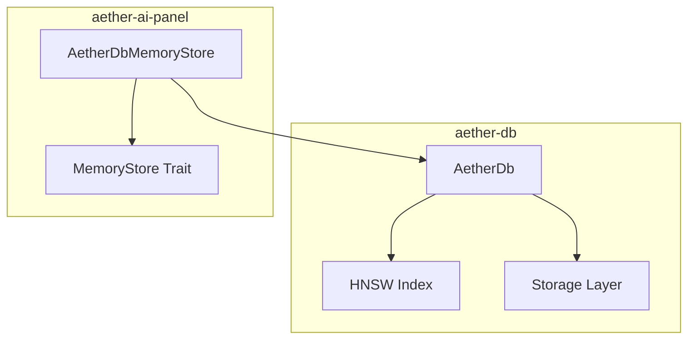
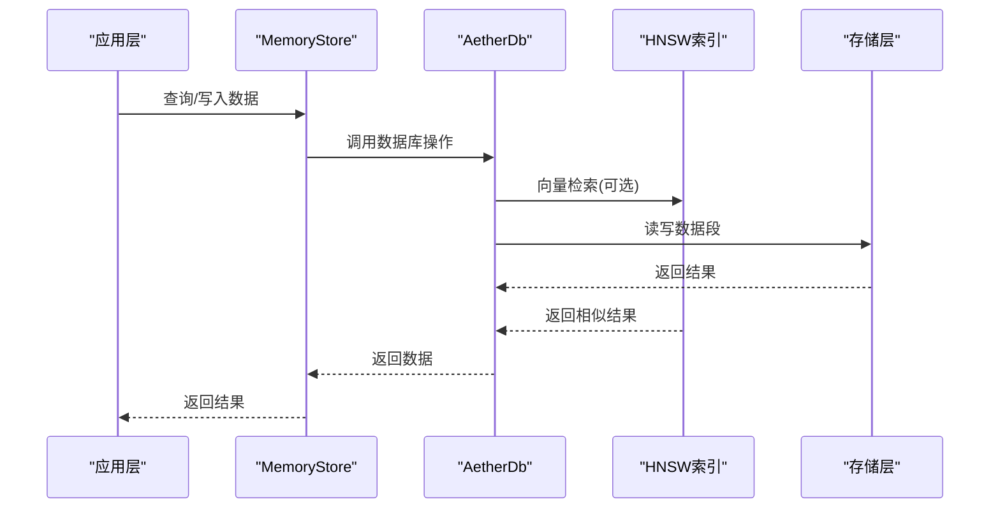
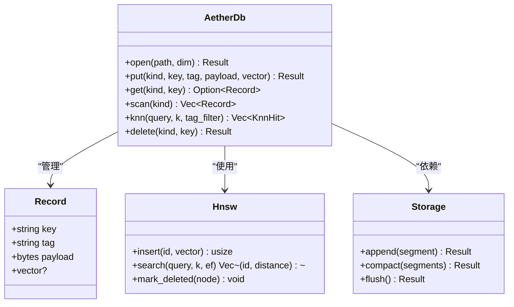
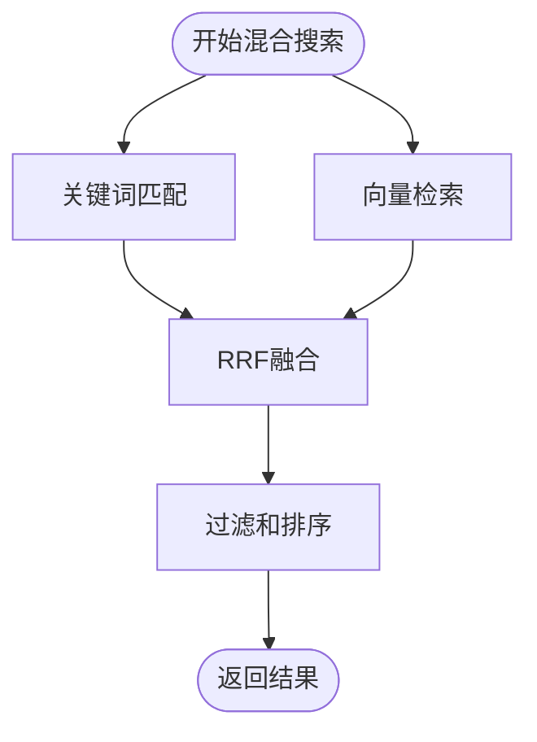
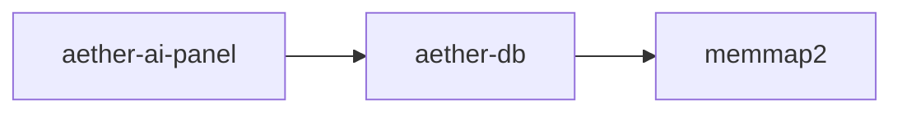

# AI对话历史持久化系统

<cite>
**本文引用的文件**   
- [aether_db_store.rs](file://crates/aether-ai-panel/src/aether_db_store.rs)
- [memory_store.rs](file://crates/aether-ai-panel/src/memory_store.rs)
- [db.rs](file://crates/aether-db/src/db.rs)
- [hnsw.rs](file://crates/aether-db/src/hnsw.rs)
- [storage.rs](file://crates/aether-db/src/storage.rs)
- [Cargo.toml](file://crates/aether-ai-panel/Cargo.toml)
- [Cargo.toml](file://crates/aether-db/Cargo.toml)
</cite>

## 更新摘要
**变更内容**   
- 将AI对话历史持久化系统从SQLite迁移到自研的AetherDB嵌入式数据库
- 实现零依赖的纯Rust持久化解决方案，仅依赖memmap2进行内存映射
- 集成HNSW向量索引支持语义检索和相似性搜索
- 提供混合搜索功能，结合关键词匹配和向量相似度（RRF融合）
- 优化存储格式和崩溃恢复机制，支持原子写入和数据完整性校验

## 目录
1. [简介](#简介)
2. [项目结构](#项目结构)
3. [核心组件](#核心组件)
4. [架构总览](#架构总览)
5. [详细组件分析](#详细组件分析)
6. [依赖分析](#依赖分析)
7. [性能考虑](#性能考虑)
8. [故障排查指南](#故障排查指南)
9. [结论](#结论)
10. [附录](#附录)

## 简介
本文件面向"AI对话历史持久化系统"，聚焦于在编辑器中记录、存储与恢复用户与AI的对话历史，确保跨会话一致性与可检索性。系统现已完成重大架构升级，从SQLite迁移到自研的AetherDB嵌入式数据库，实现了零依赖的持久化解决方案。

**更新** 系统现已采用AetherDB作为底层存储引擎，提供高性能的向量检索、混合搜索能力和增强的数据完整性保障。

## 项目结构
围绕AI对话历史的代码主要分布在两个crate中：
- aether-db：提供自研的嵌入式数据库引擎，包含HNSW向量索引和存储层
- aether-ai-panel：提供MemoryStore抽象层和AetherDbMemoryStore具体实现

**图表来源**
- [aether_db_store.rs:1-100](file://crates/aether-ai-panel/src/aether_db_store.rs#L1-L100)
- [memory_store.rs:1-100](file://crates/aether-ai-panel/src/memory_store.rs#L1-L100)
- [db.rs:1-100](file://crates/aether-db/src/db.rs#L1-L100)

**章节来源**
- [Cargo.toml:1-21](file://crates/aether-ai-panel/Cargo.toml#L1-L21)
- [Cargo.toml:1-7](file://crates/aether-db/Cargo.toml#L1-L7)

## 核心组件
- AetherDB嵌入式数据库（aether-db）
  - 职责：提供单文件嵌入式数据库，支持CRUD操作、向量检索和自动压缩
  - 关键特性：HNSW向量索引、CRC32数据校验、崩溃恢复、原子写入
- MemoryStore抽象层（aether-ai-panel）
  - 职责：定义统一的记忆存储接口，支持会话管理、消息持久化和语义检索
  - 关键特性：插件化存储后端、混合搜索、剪枝审计日志
- AetherDbMemoryStore实现
  - 职责：基于AetherDB的具体实现，提供完整的持久化功能
  - 关键特性：零C依赖、纯Rust实现、高性能向量检索

**更新** 现已完全迁移到AetherDB，移除了对SQLite的外部依赖，实现了更轻量级的解决方案。

**章节来源**
- [aether_db_store.rs:1-150](file://crates/aether-ai-panel/src/aether_db_store.rs#L1-L150)
- [memory_store.rs:1-200](file://crates/aether-ai-panel/src/memory_store.rs#L1-L200)
- [db.rs:1-150](file://crates/aether-db/src/db.rs#L1-L150)

## 架构总览
整体采用"抽象层—实现层—存储层"的分层架构。MemoryStore trait提供统一接口；AetherDbMemoryStore实现具体逻辑；AetherDB提供底层存储能力。

**图表来源**
- [aether_db_store.rs:100-200](file://crates/aether-ai-panel/src/aether_db_store.rs#L100-L200)
- [db.rs:100-200](file://crates/aether-db/src/db.rs#L100-L200)
- [storage.rs:150-250](file://crates/aether-db/src/storage.rs#L150-L250)

## 详细组件分析

### AetherDB嵌入式数据库（aether-db）
- 数据模型
  - Record：包含key、tag、payload和可选的vector字段
  - KnnHit：KNN检索结果，包含key和距离信息
  - Segment：存储层的原始数据段，支持追加写和垃圾回收
- 存储格式
  - 单文件格式，包含4KB头部和可变长度数据段
  - 每个段包含magic、kind、flags、tag、key、payload和可选vector
  - CRC32校验确保数据完整性
- 向量索引
  - HNSW算法实现，支持余弦距离计算
  - 增量插入和墓碑删除，支持大规模向量检索
  - 小规模数据自动退化到暴力搜索保证准确性
- 崩溃恢复
  - 启动时全量扫描重建内存索引
  - 损坏段自动截断，保证数据一致性
  - 原子compaction操作避免部分写入

**图表来源**
- [db.rs:1-200](file://crates/aether-db/src/db.rs#L1-L200)
- [hnsw.rs:1-150](file://crates/aether-db/src/hnsw.rs#L1-L150)
- [storage.rs:150-300](file://crates/aether-db/src/storage.rs#L150-L300)

**章节来源**
- [db.rs:1-350](file://crates/aether-db/src/db.rs#L1-L350)
- [hnsw.rs:1-200](file://crates/aether-db/src/hnsw.rs#L1-L200)
- [storage.rs:1-200](file://crates/aether-db/src/storage.rs#L1-L200)

### MemoryStore抽象层（aether-ai-panel）
- 数据结构
  - Conversation：会话元数据，包含标题、工作区哈希、时间戳等
  - ChatMessage：对话消息，支持角色、内容和可选的embedding向量
  - PlaybookBullet：ACE playbook条目，支持helpful/harmful计数器
- 核心接口
  - 会话管理：upsert_conversation、list_conversations、delete_conversation
  - 消息操作：append_message、get_messages、search_messages
  - 语义检索：hybrid_search_messages支持关键词+向量融合
  - 剪枝审计：prune_bullets和审计日志记录
- 混合搜索实现
  - 关键词匹配：子串搜索，≥3字符启用
  - 向量检索：HNSW近似最近邻搜索
  - RRF融合：Reciprocal Rank Fusion算法融合两种结果

**图表来源**
- [aether_db_store.rs:300-400](file://crates/aether-ai-panel/src/aether_db_store.rs#L300-L400)

**章节来源**
- [memory_store.rs:1-250](file://crates/aether-ai-panel/src/memory_store.rs#L1-L250)
- [aether_db_store.rs:250-450](file://crates/aether-ai-panel/src/aether_db_store.rs#L250-L450)

### AetherDbMemoryStore实现
- 会话持久化
  - 会话元数据和消息分别存储，通过conv_id关联
  - 支持按工作区哈希分组和级联删除
- 向量检索
  - 消息embedding存储在AetherDB的vector字段
  - 支持按会话过滤的语义检索
- 剪枝审计
  - 高harmful计数条目自动剪枝
  - 审计日志记录剪枝原因和时间戳

**更新** 现已完全基于AetherDB实现，移除了所有外部数据库依赖。

**章节来源**
- [aether_db_store.rs:1-200](file://crates/aether-ai-panel/src/aether_db_store.rs#L1-L200)

## 依赖分析
- crate间依赖
  - aether-ai-panel 依赖 aether-db 提供的数据库引擎
  - aether-db 仅依赖 memmap2 用于内存映射文件
- 外部依赖
  - 移除了SQLite依赖，实现真正的零外部依赖
  - 仅保留必要的Rust标准库和memmap2库

**图表来源**
- [Cargo.toml:1-21](file://crates/aether-ai-panel/Cargo.toml#L1-L21)
- [Cargo.toml:1-7](file://crates/aether-db/Cargo.toml#L1-L7)

**章节来源**
- [Cargo.toml:1-21](file://crates/aether-ai-panel/Cargo.toml#L1-L21)
- [Cargo.toml:1-7](file://crates/aether-db/Cargo.toml#L1-L7)

## 性能考虑
- 存储优化
  - 单文件设计减少文件系统开销
  - 追加写模式避免随机I/O
  - 自动compaction回收垃圾空间
- 检索优化
  - HNSW索引支持大规模向量检索
  - 小数据集自动退化到精确搜索
  - 标签过滤减少检索范围
- 内存管理
  - 内存映射文件减少内存占用
  - 惰性加载避免一次性加载全部数据
  - 定期flush平衡性能和持久性

## 故障排查指南
- 常见问题
  - 向量维度不匹配：检查embedding维度配置
  - 数据库损坏：利用CRC32校验和崩溃恢复机制
  - 检索结果为空：确认向量索引是否已构建
- 诊断步骤
  - 检查数据库文件大小和段数量
  - 验证HNSW索引的节点数量和连接数
  - 监控compaction触发频率和效果

**章节来源**
- [aether_db_store.rs:450-675](file://crates/aether-ai-panel/src/aether_db_store.rs#L450-L675)
- [db.rs:350-466](file://crates/aether-db/src/db.rs#L350-L466)

## 结论
本系统已成功从SQLite迁移到自研的AetherDB嵌入式数据库，实现了零依赖的持久化解决方案。新的架构提供了更好的性能、更强的向量检索能力和更简洁的依赖关系。通过HNSW索引和混合搜索功能，系统能够高效处理大规模的对话历史和语义检索需求。建议在后续迭代中继续优化索引参数和检索算法，以满足更大规模的数据处理场景。

## 附录
- 术语
  - AetherDB：自研的嵌入式向量数据库
  - HNSW：分层导航小世界图算法，用于近似最近邻搜索
  - RRF：倒数排名融合算法，用于融合多种检索结果
  - 剪枝：根据反馈统计移除低质量playbook条目
- 最佳实践
  - 合理设置向量维度以匹配嵌入模型
  - 定期执行compaction保持数据库健康
  - 使用标签过滤提高检索效率