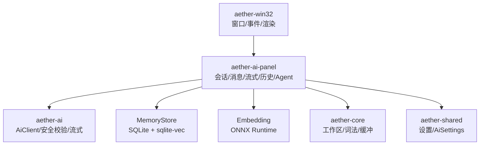
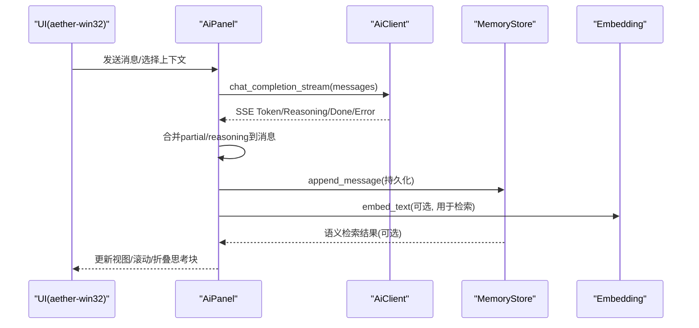
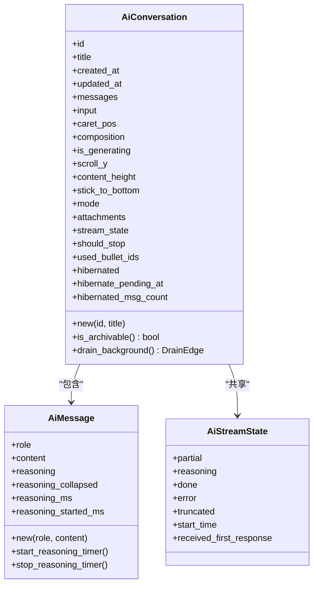
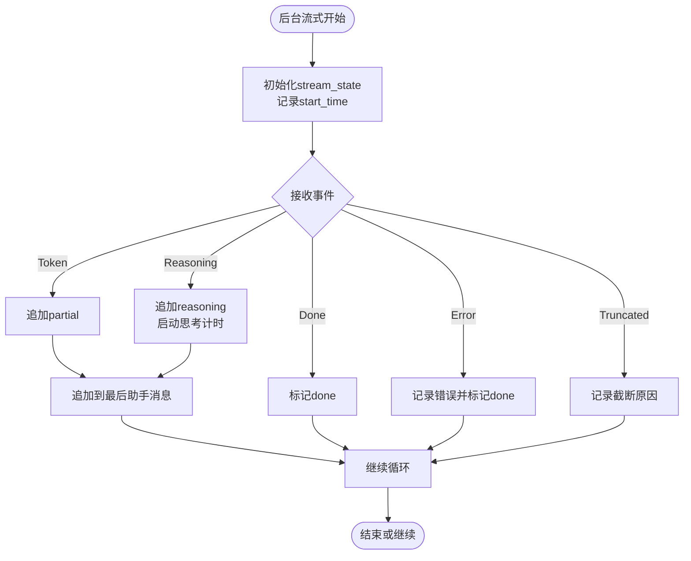
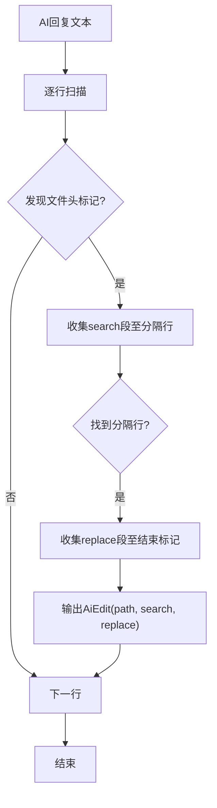
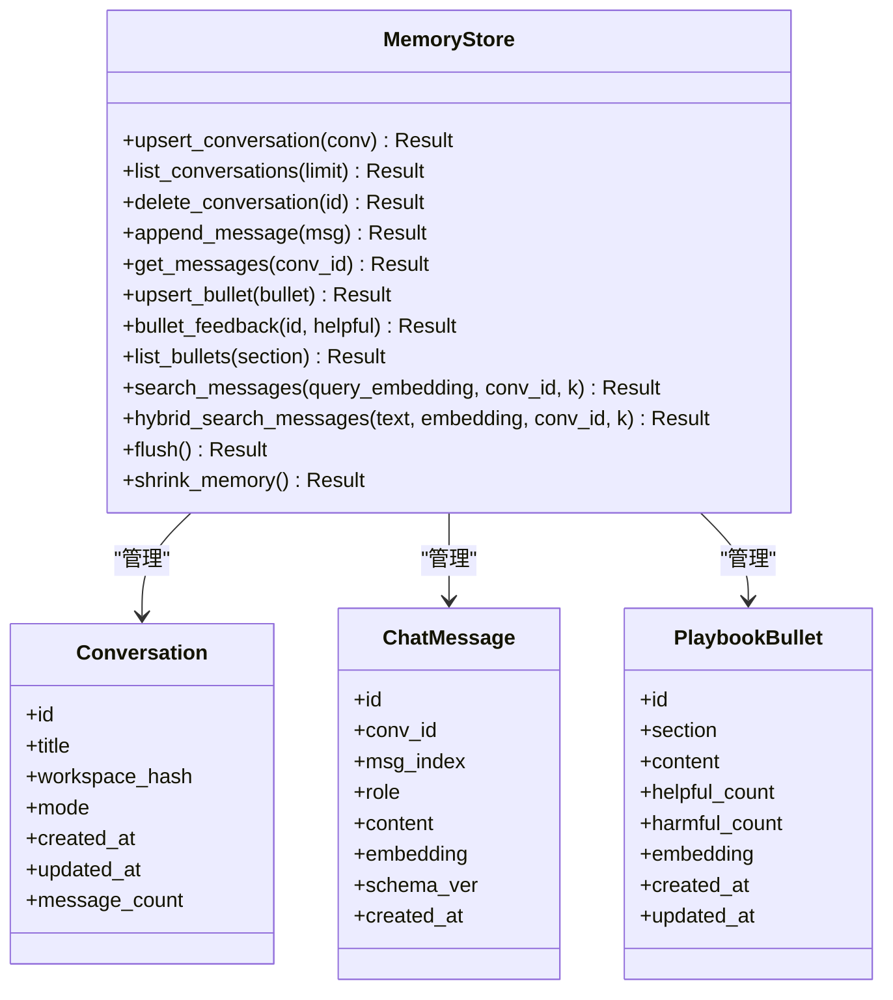
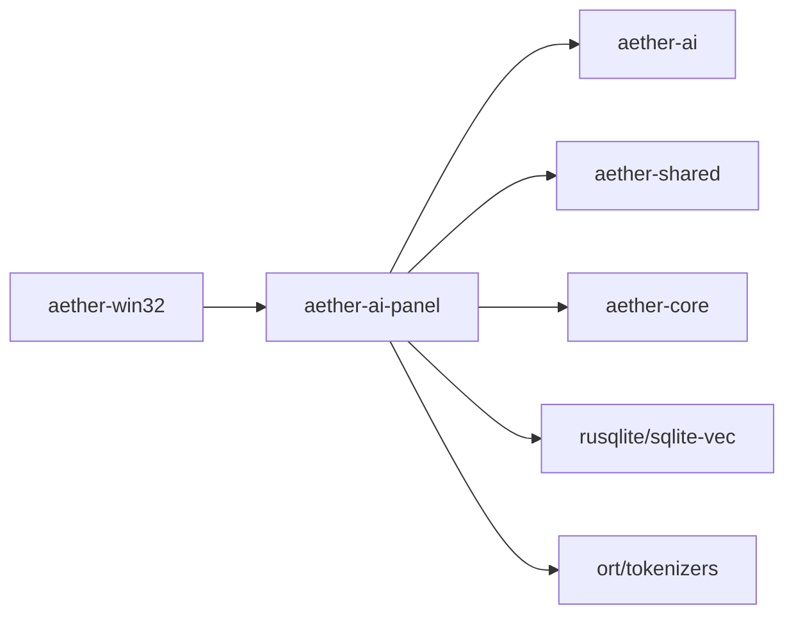

# AI面板系统

<cite>
**本文引用的文件**
- [aether-ai-panel/src/lib.rs](file://crates/aether-ai-panel/src/lib.rs)
- [aether-ai-panel/Cargo.toml](file://crates/aether-ai-panel/Cargo.toml)
- [aether-ai-panel/src/ai_panel.rs](file://crates/aether-ai-panel/src/ai_panel.rs)
- [aether-ai-panel/src/ai_agent.rs](file://crates/aether-ai-panel/src/ai_agent.rs)
- [aether-ai-panel/src/ai_context.rs](file://crates/aether-ai-panel/src/ai_context.rs)
- [aether-ai-panel/src/memory_store.rs](file://crates/aether-ai-panel/src/memory_store.rs)
- [aether-ai-panel/src/embedding.rs](file://crates/aether-ai-panel/src/embedding.rs)
- [aether-ai/src/lib.rs](file://crates/aether-ai/src/lib.rs)
- [aether-win32/src/ai_panel.rs](file://crates/aether-win32/src/ai_panel.rs)
- [README.md](file://README.md)
</cite>

## 目录
1. [简介](#简介)
2. [项目结构](#项目结构)
3. [核心组件](#核心组件)
4. [架构总览](#架构总览)
5. [详细组件分析](#详细组件分析)
6. [依赖关系分析](#依赖关系分析)
7. [性能考量](#性能考量)
8. [故障排查指南](#故障排查指南)
9. [结论](#结论)
10. [附录](#附录)

## 简介
AI面板系统是 Aether Studio（牧羊人编辑器）中负责“对话式AI助手”的核心模块，提供多会话管理、流式生成、历史记录与持久化、Agent工具协议解析、上下文附件收集、语义检索等能力。它通过 aether-ai 提供的 OpenAI 兼容接口与后端大模型交互，并通过 MemoryStore + sqlite-vec 实现本地记忆与向量检索，结合嵌入模型完成语义搜索。UI层由 aether-win32 集成渲染与交互。

## 项目结构
- aether-ai-panel：AI面板业务逻辑与状态管理（会话、消息、流式、历史、Agent、嵌入、存储适配）。
- aether-ai：AI客户端封装（配置、安全校验、HTTP/SSE流式请求、错误处理、Token计数）。
- aether-win32：Windows原生UI层，重新导出并集成AI面板类型。
- 其他crate（core/render/shared等）提供编辑器基础能力与共享设置。

图表来源
- [aether-win32/src/ai_panel.rs:1-14](file://crates/aether-win32/src/ai_panel.rs#L1-L14)
- [aether-ai-panel/src/lib.rs:1-13](file://crates/aether-ai-panel/src/lib.rs#L1-L13)
- [aether-ai/src/lib.rs:273-334](file://crates/aether-ai/src/lib.rs#L273-L334)
- [aether-ai-panel/src/memory_store.rs:1-20](file://crates/aether-ai-panel/src/memory_store.rs#L1-L20)
- [aether-ai-panel/src/embedding.rs:18-41](file://crates/aether-ai-panel/src/embedding.rs#L18-L41)

章节来源
- [README.md:162-179](file://README.md#L162-L179)
- [aether-ai-panel/Cargo.toml:1-22](file://crates/aether-ai-panel/Cargo.toml#L1-L22)

## 核心组件
- AiPanel：活动会话的实时状态、输入、滚动、模式切换、附件、标签页、历史浮窗、Playbook、Agent流水线等。
- AiConversation：单条对话会话（消息、输入、光标、流状态、休眠/唤醒、归档判定）。
- AiStreamState：流式响应共享状态（partial/reasoning/done/error/truncated/start_time）。
- Agent工具协议：行锚定标记解析（文件块、命令、读取/列出目录、规划任务、精准编辑）。
- MemoryStore：会话/消息/Playbook条目CRUD、语义检索、混合检索、剪枝策略。
- Embedding：ONNX Runtime嵌入模型（bge-small-zh-v1.5），全局单例懒加载，回退n-gram哈希。
- AiClient：OpenAI兼容聊天/补全/流式，严格HTTPS、私有IP/DNS重绑定防护、错误脱敏与安全展示。

章节来源
- [aether-ai-panel/src/ai_panel.rs:554-719](file://crates/aether-ai-panel/src/ai_panel.rs#L554-L719)
- [aether-ai-panel/src/ai_panel.rs:258-460](file://crates/aether-ai-panel/src/ai_panel.rs#L258-L460)
- [aether-ai-panel/src/ai_agent.rs:1-200](file://crates/aether-ai-panel/src/ai_agent.rs#L1-L200)
- [aether-ai-panel/src/memory_store.rs:32-145](file://crates/aether-ai-panel/src/memory_store.rs#L32-L145)
- [aether-ai-panel/src/embedding.rs:18-121](file://crates/aether-ai-panel/src/embedding.rs#L18-L121)
- [aether-ai/src/lib.rs:273-334](file://crates/aether-ai/src/lib.rs#L273-L334)

## 架构总览
AI面板采用分层设计：
- UI层（aether-win32）：窗口、事件、渲染，调用AI面板暴露的类型与方法。
- 业务层（aether-ai-panel）：会话管理、消息组织、流式聚合、历史持久化、Agent工具执行、嵌入检索。
- 服务层（aether-ai）：网络请求、SSE流式、安全校验、错误处理。
- 数据层（sqlite-vec + ONNX）：本地持久化与语义检索。

图表来源
- [aether-ai/src/lib.rs:726-800](file://crates/aether-ai/src/lib.rs#L726-L800)
- [aether-ai-panel/src/ai_panel.rs:721-800](file://crates/aether-ai-panel/src/ai_panel.rs#L721-L800)
- [aether-ai-panel/src/memory_store.rs:122-145](file://crates/aether-ai-panel/src/memory_store.rs#L122-L145)
- [aether-ai-panel/src/embedding.rs:187-200](file://crates/aether-ai-panel/src/embedding.rs#L187-L200)

## 详细组件分析

### 会话与消息模型
- AiMessage：角色（用户/助手/系统/工具/待确认）、内容、深度思考内容与计时、折叠状态。
- AiConversation：会话元信息、消息列表、输入、光标、流状态、是否休眠、归档价值判断。
- AiStreamState：流式增量、结束标志、错误、截断原因、开始时间、首响应标记。

图表来源
- [aether-ai-panel/src/ai_panel.rs:102-168](file://crates/aether-ai-panel/src/ai_panel.rs#L102-L168)
- [aether-ai-panel/src/ai_panel.rs:170-201](file://crates/aether-ai-panel/src/ai_panel.rs#L170-L201)
- [aether-ai-panel/src/ai_panel.rs:258-460](file://crates/aether-ai-panel/src/ai_panel.rs#L258-L460)

章节来源
- [aether-ai-panel/src/ai_panel.rs:102-201](file://crates/aether-ai-panel/src/ai_panel.rs#L102-L201)
- [aether-ai-panel/src/ai_panel.rs:258-460](file://crates/aether-ai-panel/src/ai_panel.rs#L258-L460)

### 流式生成与后台轮询
- spawn_ai_stream：后台线程发起流式请求，将Token/Reasoning/Done/Truncated/Error写入共享状态。
- drain_background：非活动会话的后台轮询，将增量追加到消息，处理思考计时、错误中断、截断提示。

图表来源
- [aether-ai/src/lib.rs:726-800](file://crates/aether-ai/src/lib.rs#L726-L800)
- [aether-ai-panel/src/ai_panel.rs:721-800](file://crates/aether-ai-panel/src/ai_panel.rs#L721-L800)
- [aether-ai-panel/src/ai_panel.rs:364-460](file://crates/aether-ai-panel/src/ai_panel.rs#L364-L460)

章节来源
- [aether-ai/src/lib.rs:726-800](file://crates/aether-ai/src/lib.rs#L726-L800)
- [aether-ai-panel/src/ai_panel.rs:721-800](file://crates/aether-ai-panel/src/ai_panel.rs#L721-L800)
- [aether-ai-panel/src/ai_panel.rs:364-460](file://crates/aether-ai-panel/src/ai_panel.rs#L364-L460)

### Agent工具协议与解析
- 行锚定标记：文件块（AETHER_FILE/SEP/END_FILE）、运行命令（AETHER_RUN/END_RUN）、读取/列出（AETHER_READ/LIST）、规划（AETHER_PLAN/END_PLAN）、精准定位/编辑（AETHER_LOCATE/EDIT/END_EDIT）。
- parse_edits：从AI回复中解析出AiEdit列表（路径、search/replace、创建/删除判断）。
- has_agent_markers：快速检测是否包含工具标记，用于前置校验。

图表来源
- [aether-ai-panel/src/ai_agent.rs:1-200](file://crates/aether-ai-panel/src/ai_agent.rs#L1-L200)

章节来源
- [aether-ai-panel/src/ai_agent.rs:1-200](file://crates/aether-ai-panel/src/ai_agent.rs#L1-L200)

### 上下文附件与提示构建
- AiContextAttachment：当前文件、选区、打开文件、诊断、文件树、自定义文本。
- wrap_code_block：将代码片段包装为带路径/语言标记的代码块。
- truncate_middle：限制长度并保留首尾，避免超长上下文。

章节来源
- [aether-ai-panel/src/ai_context.rs:1-117](file://crates/aether-ai-panel/src/ai_context.rs#L1-L117)

### 记忆存储与语义检索
- MemoryStore trait：会话/消息/Playbook条目CRUD、语义检索、混合检索、剪枝、收缩内存。
- SqliteMemoryStore（默认实现）：WAL模式崩溃安全、sqlite-vec向量索引、JSONL日志。
- 数据结构：Conversation、ChatMessage、PlaybookBullet（含权重计数）。

图表来源
- [aether-ai-panel/src/memory_store.rs:32-145](file://crates/aether-ai-panel/src/memory_store.rs#L32-L145)

章节来源
- [aether-ai-panel/src/memory_store.rs:1-200](file://crates/aether-ai-panel/src/memory_store.rs#L1-L200)

### 嵌入模型与向量检索
- EmbeddingModel：基于ONNX Runtime的文本编码，支持pooler_output或last_hidden_state均值池化，L2归一化。
- 全局单例：init_embedding_model、try_init_default_model、embed_text（未初始化时回退n-gram哈希）。
- 默认模型目录：%CONFIG%/Aether/models/bge-small-zh-v1.5。

章节来源
- [aether-ai-panel/src/embedding.rs:18-121](file://crates/aether-ai-panel/src/embedding.rs#L18-L121)
- [aether-ai-panel/src/embedding.rs:127-200](file://crates/aether-ai-panel/src/embedding.rs#L127-L200)

### AI客户端与安全
- AiConfig：提供商、API Key、Base URL、模型、采样参数、思考模式、频率/存在惩罚、停止序列、响应格式、用量统计、logprobs、用户标识。
- AiClient：连接超时/读空闲超时、禁用自动重定向、HTTPS强制、私有IP/DNS重绑定防护、云元数据黑名单、错误脱敏与安全展示。
- 流式接口：chat_completion_stream返回Receiver，事件包括Token/Reasoning/Done/Truncated/Error。

章节来源
- [aether-ai/src/lib.rs:167-271](file://crates/aether-ai/src/lib.rs#L167-L271)
- [aether-ai/src/lib.rs:273-334](file://crates/aether-ai/src/lib.rs#L273-L334)
- [aether-ai/src/lib.rs:408-548](file://crates/aether-ai/src/lib.rs#L408-L548)
- [aether-ai/src/lib.rs:726-800](file://crates/aether-ai/src/lib.rs#L726-L800)

## 依赖关系分析
- aether-ai-panel 依赖 aether-ai（流式请求）、aether-shared（设置）、aether-core（工作区/词法）。
- aether-win32 重新导出 aether-ai-panel 的类型以兼容上层调用。
- 存储层使用 rusqlite + sqlite-vec；嵌入层使用 ort + tokenizers。

图表来源
- [aether-win32/src/ai_panel.rs:1-14](file://crates/aether-win32/src/ai_panel.rs#L1-L14)
- [aether-ai-panel/Cargo.toml:6-22](file://crates/aether-ai-panel/Cargo.toml#L6-L22)

章节来源
- [aether-ai-panel/Cargo.toml:6-22](file://crates/aether-ai-panel/Cargo.toml#L6-L22)

## 性能考量
- 流式生成：后台线程+共享状态，UI轮询增量，避免阻塞主线程。
- 会话休眠：非活动会话卸载消息体至温数据层，降低内存占用。
- 向量检索：sqlite-vec + ONNX嵌入，默认维度512，支持混合检索（FTS5+向量RRF融合）。
- 网络优化：连接超时15s、读空闲300s，禁用自动重定向，限制响应体大小10MB。
- 错误脱敏：safe_display与sanitize_error防止敏感信息泄露。

[本节为通用指导，不直接分析具体文件]

## 故障排查指南
- 网络连接失败：检查Base URL是否为HTTPS、API Key是否设置、DNS解析是否被拦截。
- API返回错误：查看safe_display描述，区分4xx/5xx并给出重试建议。
- 流式无响应：确认received_first_response与start_time，检查should_stop是否被设置。
- 嵌入模型未加载：检查默认模型目录是否存在model.onnx与tokenizer.json，否则回退n-gram。
- 历史为空：确认MemoryStore flush与append_message是否成功，检查workspace_hash绑定。

章节来源
- [aether-ai/src/lib.rs:112-165](file://crates/aether-ai/src/lib.rs#L112-L165)
- [aether-ai/src/lib.rs:336-347](file://crates/aether-ai/src/lib.rs#L336-L347)
- [aether-ai-panel/src/ai_panel.rs:25-100](file://crates/aether-ai-panel/src/ai_panel.rs#L25-L100)
- [aether-ai-panel/src/embedding.rs:154-185](file://crates/aether-ai-panel/src/embedding.rs#L154-L185)

## 结论
AI面板系统通过清晰的分层与模块化设计，实现了高效的对话式AI助手功能。其流式生成、会话休眠、Agent工具协议、语义检索与安全校验共同构成了一个健壮且可扩展的AI集成方案。未来可进一步扩展云端同步、更多提供商支持与更精细的权限控制。

[本节为总结性内容，不直接分析具体文件]

## 附录
- 构建与运行：参考README中的构建命令与运行方式。
- 测试：单元测试、覆盖率、GUI冒烟测试脚本。
- 贡献：遵循CONTRIBUTING.md的流程与规范。

章节来源
- [README.md:85-118](file://README.md#L85-L118)
- [README.md:127-159](file://README.md#L127-L159)
- [README.md:258-298](file://README.md#L258-L298)
- [README.md:300-333](file://README.md#L300-L333)