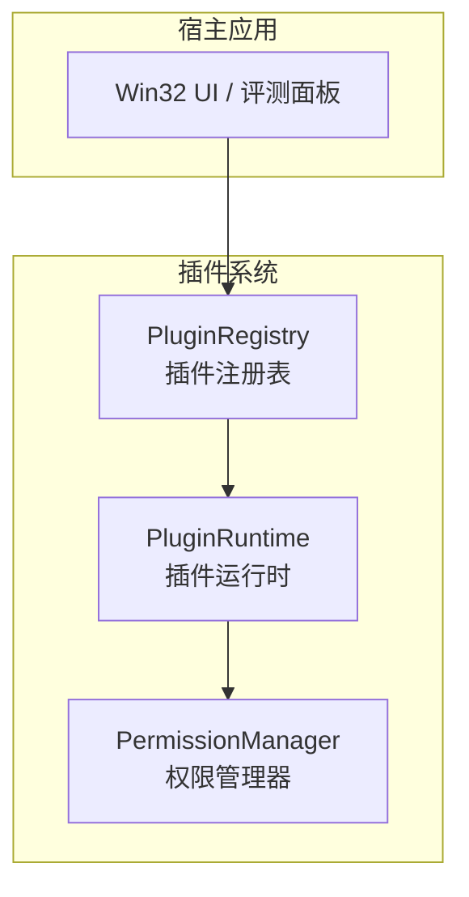
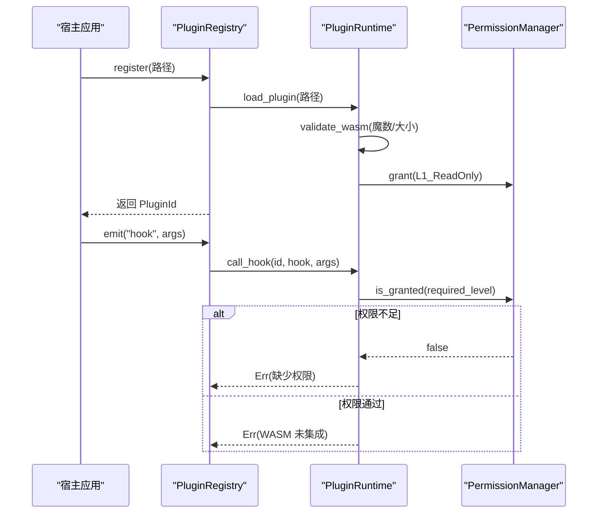
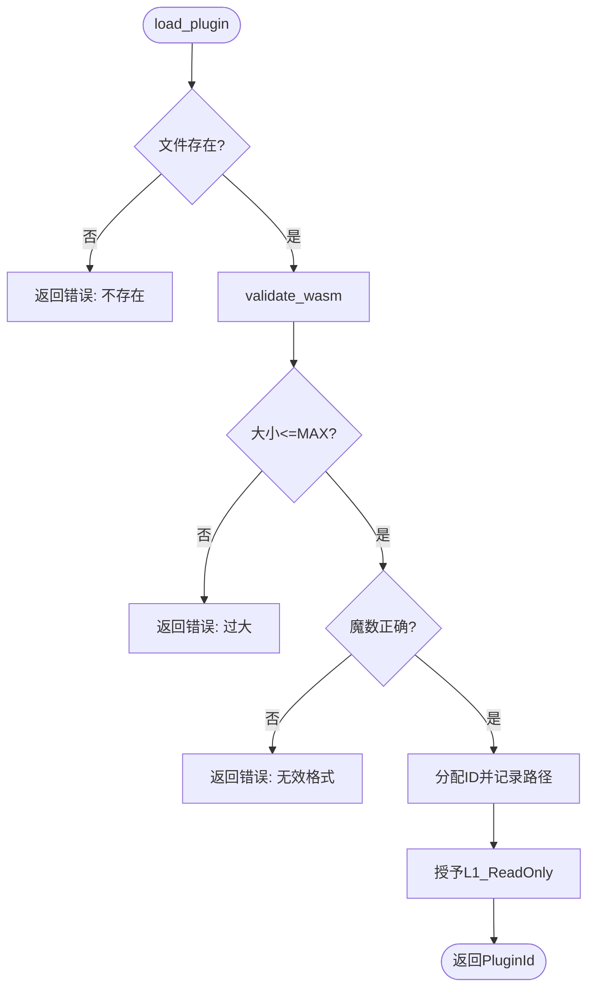
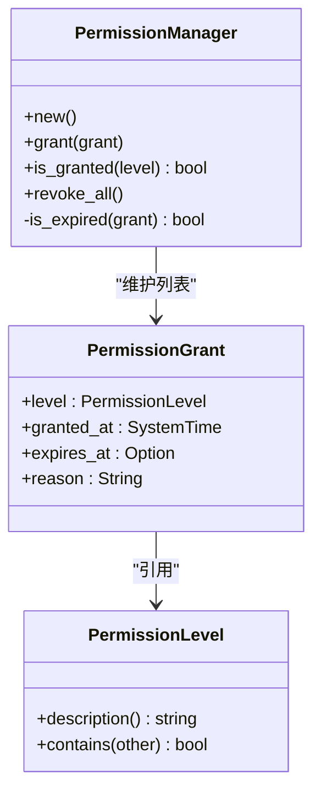
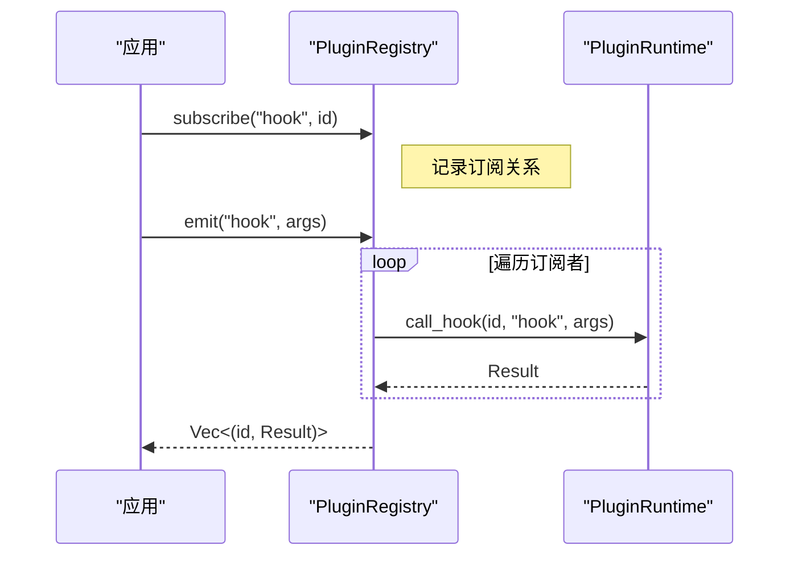
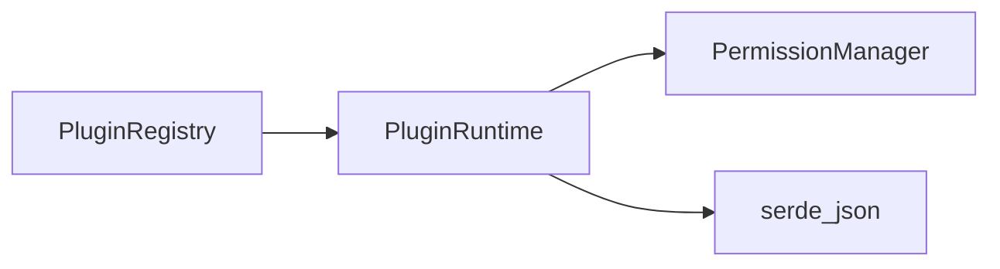

# WASM 运行时

<cite>
**本文引用的文件**
- [crates/aether-plugin/src/lib.rs](file://crates/aether-plugin/src/lib.rs)
- [crates/aether-plugin/src/runtime.rs](file://crates/aether-plugin/src/runtime.rs)
- [crates/aether-plugin/src/permissions.rs](file://crates/aether-plugin/src/permissions.rs)
- [crates/aether-plugin/src/registry.rs](file://crates/aether-plugin/src/registry.rs)
- [crates/aether-win32/src/sandbox_eval.rs](file://crates/aether-win32/src/sandbox_eval.rs)
</cite>

## 目录
1. [简介](#简介)
2. [项目结构](#项目结构)
3. [核心组件](#核心组件)
4. [架构总览](#架构总览)
5. [详细组件分析](#详细组件分析)
6. [依赖关系分析](#依赖关系分析)
7. [性能考量](#性能考量)
8. [故障排查指南](#故障排查指南)
9. [结论](#结论)
10. [附录](#附录)

## 简介
本技术文档围绕“WASM 运行时”展开，聚焦于插件加载、沙箱执行边界、权限模型与事件分发机制。当前仓库实现了插件系统的骨架：插件元数据管理、基于级别的权限控制、钩子订阅与触发、以及 WASM 模块的加载校验流程。实际的 WASM 引擎集成（如 wasmtime）在运行时中预留了接口与占位实现，待后续接入后启用真正的内存隔离与执行限制。

## 项目结构
- aether-plugin：插件系统核心，包含运行时、权限管理与注册表
- aether-win32：Windows 端 UI 与评测面板，提供沙盒评测工作流（非 WASM 插件运行时的执行环境）

图表来源
- [crates/aether-plugin/src/runtime.rs:16-21](file://crates/aether-plugin/src/runtime.rs#L16-L21)
- [crates/aether-plugin/src/permissions.rs:57-60](file://crates/aether-plugin/src/permissions.rs#L57-L60)
- [crates/aether-plugin/src/registry.rs:17-23](file://crates/aether-plugin/src/registry.rs#L17-L23)

章节来源
- [crates/aether-plugin/src/lib.rs:1-8](file://crates/aether-plugin/src/lib.rs#L1-L8)
- [crates/aether-plugin/src/runtime.rs:16-21](file://crates/aether-plugin/src/runtime.rs#L16-L21)
- [crates/aether-plugin/src/permissions.rs:1-13](file://crates/aether-plugin/src/permissions.rs#L1-L13)
- [crates/aether-plugin/src/registry.rs:17-23](file://crates/aether-plugin/src/registry.rs#L17-L23)

## 核心组件
- 插件标识与运行时
  - PluginId：唯一标识每个已加载插件
  - PluginRuntime：负责插件生命周期管理、权限分配、钩子调用入口
- 权限模型
  - PermissionLevel：四级权限（只读 UI、文件 IO、网络、系统命令）
  - PermissionManager：维护授予记录、过期检查、包含关系判断
- 插件注册表
  - PluginMetadata：插件元信息（名称、版本、描述、作者、权限）
  - PluginRegistry：注册/卸载插件、订阅/触发钩子、列出插件

章节来源
- [crates/aether-plugin/src/runtime.rs:9-21](file://crates/aether-plugin/src/runtime.rs#L9-L21)
- [crates/aether-plugin/src/permissions.rs:1-13](file://crates/aether-plugin/src/permissions.rs#L1-L13)
- [crates/aether-plugin/src/registry.rs:6-23](file://crates/aether-plugin/src/registry.rs#L6-L23)

## 架构总览
插件系统采用“注册表 + 运行时 + 权限管理器”的分层设计：
- 注册表负责插件发现、元数据与事件路由
- 运行时负责加载校验、权限绑定与钩子调用
- 权限管理器确保每次调用前进行细粒度授权检查

图表来源
- [crates/aether-plugin/src/registry.rs:34-53](file://crates/aether-plugin/src/registry.rs#L34-L53)
- [crates/aether-plugin/src/runtime.rs:33-87](file://crates/aether-plugin/src/runtime.rs#L33-L87)
- [crates/aether-plugin/src/runtime.rs:127-157](file://crates/aether-plugin/src/runtime.rs#L127-L157)
- [crates/aether-plugin/src/permissions.rs:67-72](file://crates/aether-plugin/src/permissions.rs#L67-L72)

## 详细组件分析

### 插件运行时（PluginRuntime）
- 功能要点
  - 加载插件：校验文件存在性、魔数、大小上限；分配唯一 ID；默认授予 L1_ReadOnly 权限
  - 卸载插件：移除插件与权限记录
  - 权限授予/撤销：支持设置过期时间，拒绝过去时间
  - 钩子调用：根据 hook 名称映射所需权限级别，执行前检查；当前为占位实现，提示 WASM 未集成
- 安全边界
  - 文件大小限制（MAX_PLUGIN_SIZE）
  - 权限最小化原则（默认仅只读）
  - 未知 hook 默认要求 L1（最保守）

图表来源
- [crates/aether-plugin/src/runtime.rs:33-87](file://crates/aether-plugin/src/runtime.rs#L33-L87)

章节来源
- [crates/aether-plugin/src/runtime.rs:33-87](file://crates/aether-plugin/src/runtime.rs#L33-L87)
- [crates/aether-plugin/src/runtime.rs:127-175](file://crates/aether-plugin/src/runtime.rs#L127-L175)

### 权限模型（PermissionLevel & PermissionManager）
- 权限级别
  - L1_ReadOnly：只读 UI 访问
  - L2_FileIO：文件读写
  - L3_Network：网络访问
  - L4_System：系统命令执行
- 包含关系
  - 高权限包含低权限（L4 > L3 > L2 > L1）
- 授予与过期
  - 支持设置 granted_at 与 expires_at
  - 过期检查：若 expires_at 为过去时间或 granted_at 为未来时间，视为无效

图表来源
- [crates/aether-plugin/src/permissions.rs:1-13](file://crates/aether-plugin/src/permissions.rs#L1-L13)
- [crates/aether-plugin/src/permissions.rs:47-60](file://crates/aether-plugin/src/permissions.rs#L47-L60)
- [crates/aether-plugin/src/permissions.rs:62-94](file://crates/aether-plugin/src/permissions.rs#L62-L94)

章节来源
- [crates/aether-plugin/src/permissions.rs:1-13](file://crates/aether-plugin/src/permissions.rs#L1-L13)
- [crates/aether-plugin/src/permissions.rs:47-94](file://crates/aether-plugin/src/permissions.rs#L47-L94)

### 插件注册表（PluginRegistry）
- 功能要点
  - 注册插件：调用运行时加载，创建默认元数据
  - 卸载插件：清理运行时与钩子订阅
  - 订阅/触发：按 hook 名维护订阅者列表，批量调用
  - 列出插件：返回所有已加载插件的元数据
- 事件分发
  - emit 会遍历订阅者，调用运行时 call_hook，收集结果

图表来源
- [crates/aether-plugin/src/registry.rs:67-91](file://crates/aether-plugin/src/registry.rs#L67-L91)
- [crates/aether-plugin/src/runtime.rs:127-157](file://crates/aether-plugin/src/runtime.rs#L127-L157)

章节来源
- [crates/aether-plugin/src/registry.rs:34-101](file://crates/aether-plugin/src/registry.rs#L34-L101)

### 沙箱评测面板（非 WASM 插件运行时的执行环境）
- 作用
  - 提供智能体评测工作流：规划、执行、打分、导出
  - 严格限制文件操作到沙盒目录，拦截终端命令，允许联网搜索
- 与 WASM 的关系
  - 该模块用于评测 AI 智能体行为，并非直接运行 WASM 插件
  - 可作为理解“沙箱”概念的实现参考（目录隔离、命令拦截、资源限制）

章节来源
- [crates/aether-win32/src/sandbox_eval.rs:1-12](file://crates/aether-win32/src/sandbox_eval.rs#L1-L12)
- [crates/aether-win32/src/sandbox_eval.rs:414-496](file://crates/aether-win32/src/sandbox_eval.rs#L414-L496)

## 依赖关系分析
- 模块耦合
  - registry 依赖 runtime 与 permissions
  - runtime 依赖 permissions
  - 三者形成清晰分层，便于扩展与测试
- 外部依赖
  - serde_json：用于钩子参数与返回值序列化
  - 计划集成 wasmtime：当前为占位，需引入以启用真实 WASM 执行

图表来源
- [crates/aether-plugin/src/registry.rs:1-4](file://crates/aether-plugin/src/registry.rs#L1-L4)
- [crates/aether-plugin/src/runtime.rs:1-4](file://crates/aether-plugin/src/runtime.rs#L1-L4)

章节来源
- [crates/aether-plugin/src/registry.rs:1-4](file://crates/aether-plugin/src/registry.rs#L1-L4)
- [crates/aether-plugin/src/runtime.rs:1-4](file://crates/aether-plugin/src/runtime.rs#L1-L4)

## 性能考量
- 插件加载
  - 文件大小限制避免大文件导致的内存压力
  - 魔数校验快速失败，减少无效解析
- 权限检查
  - 使用向量存储授予记录，查询复杂度 O(n)，适合小规模场景
  - 可考虑哈希索引优化高频权限检查
- 钩子分发
  - 批量调用订阅者，注意避免阻塞主线程
  - 建议异步化长耗时钩子执行

[本节为通用指导，不直接分析具体文件]

## 故障排查指南
- 常见错误
  - 插件文件不存在：检查路径与权限
  - 无效 WASM 格式：确认魔数与前缀
  - 插件文件过大：调整 MAX_PLUGIN_SIZE 或压缩插件
  - 权限不足：为插件授予对应级别权限
  - WASM 未集成：当前为占位实现，需引入 wasmtime
- 定位方法
  - 查看错误消息中的关键信息（如“缺少执行”、“WASM 运行时尚未集成”）
  - 使用单元测试验证加载、权限与钩子流程

章节来源
- [crates/aether-plugin/src/runtime.rs:256-320](file://crates/aether-plugin/src/runtime.rs#L256-L320)
- [crates/aether-plugin/src/runtime.rs:414-459](file://crates/aether-plugin/src/runtime.rs#L414-L459)

## 结论
当前仓库实现了插件系统的核心骨架：插件加载校验、权限模型与事件分发。实际 WASM 执行环境尚未集成，但已预留清晰的接口与安全检查点。后续接入 wasmtime 后，可实现真正的内存隔离、执行限制与安全边界。建议在集成时重点关注：
- 内存配额与超时控制
- 文件系统与网络访问的沙箱化
- 插件间通信与共享状态的安全隔离

[本节为总结性内容，不直接分析具体文件]

## 附录

### API 接口定义（钩子与权限映射）
- 钩子与所需权限
  - on_activate/on_deactivate/get_theme/get_language → L1_ReadOnly
  - on_save/on_open/read_file/write_file → L2_FileIO
  - fetch/http_request/websocket → L3_Network
  - exec/spawn/shell/run_command → L4_System
  - 未知钩子 → L1_ReadOnly（默认最安全）

章节来源
- [crates/aether-plugin/src/runtime.rs:159-175](file://crates/aether-plugin/src/runtime.rs#L159-L175)

### 代码示例路径（无具体代码内容）
- 插件加载与校验
  - [crates/aether-plugin/src/runtime.rs:33-87](file://crates/aether-plugin/src/runtime.rs#L33-L87)
- 权限授予与检查
  - [crates/aether-plugin/src/permissions.rs:67-94](file://crates/aether-plugin/src/permissions.rs#L67-L94)
- 钩子订阅与触发
  - [crates/aether-plugin/src/registry.rs:67-91](file://crates/aether-plugin/src/registry.rs#L67-L91)
- 沙箱评测面板（参考沙箱理念）
  - [crates/aether-win32/src/sandbox_eval.rs:414-496](file://crates/aether-win32/src/sandbox_eval.rs#L414-L496)