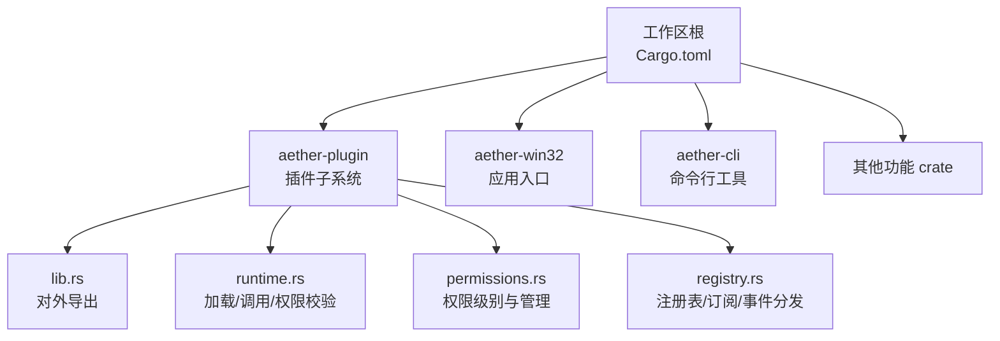
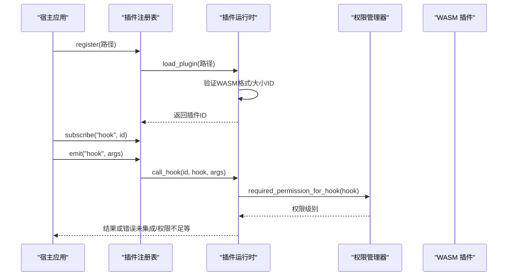
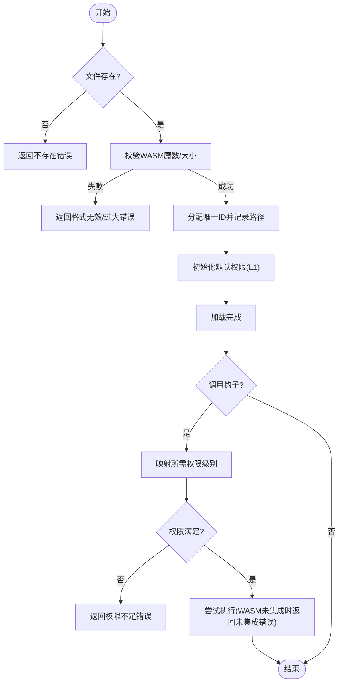
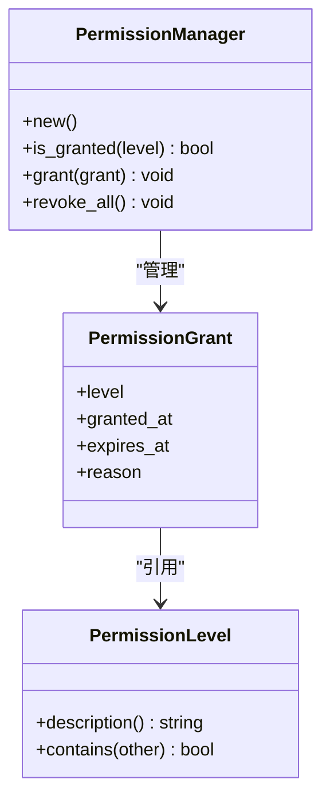
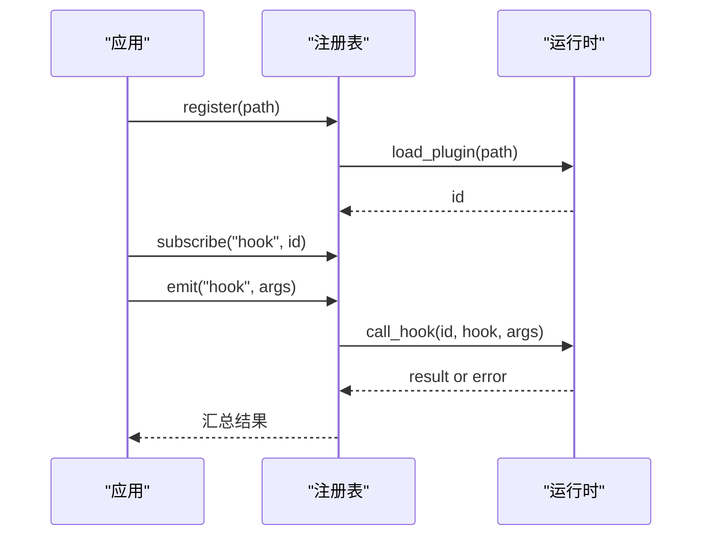
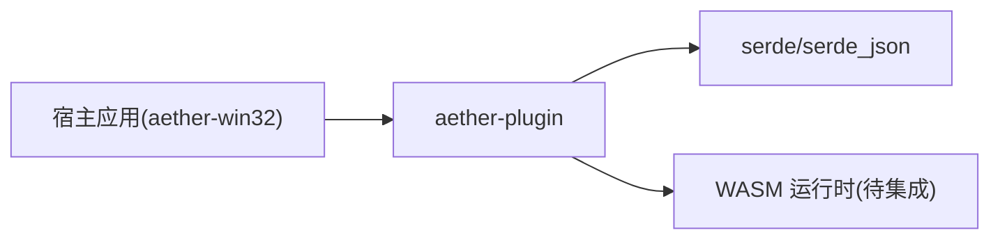

# 插件开发指南

<cite>
**本文引用的文件**
- [README.md](file://README.md)
- [Cargo.toml](file://Cargo.toml)
- [aether-plugin/lib.rs](file://crates/aether-plugin/src/lib.rs)
- [aether-plugin/permissions.rs](file://crates/aether-plugin/src/permissions.rs)
- [aether-plugin/runtime.rs](file://crates/aether-plugin/src/runtime.rs)
- [aether-plugin/registry.rs](file://crates/aether-plugin/src/registry.rs)
- [CONTRIBUTING.md](file://CONTRIBUTING.md)
- [build-release.ps1](file://scripts/build-release.ps1)
- [release-main.yml](file://.github/workflows/release-main.yml)
- [coverage.ps1](file://tests/tools/coverage.ps1)
- [AI_TESTING.md](file://tests/ai/AI_TESTING.md)
</cite>

## 目录
1. [简介](#简介)
2. [项目结构](#项目结构)
3. [核心组件](#核心组件)
4. [架构总览](#架构总览)
5. [详细组件分析](#详细组件分析)
6. [依赖分析](#依赖分析)
7. [性能与兼容性](#性能与兼容性)
8. [调试与故障排查](#调试与故障排查)
9. [测试与自动化](#测试与自动化)
10. [打包、签名与分发](#打包签名与分发)
11. [版本管理与兼容性策略](#版本管理与兼容性策略)
12. [结论](#结论)

## 简介
本指南面向插件开发者，基于仓库中的插件子系统（aether-plugin）提供从环境搭建、项目组织、API 使用到打包分发、调试与测试的完整流程。该插件系统以 WASM 为插件载体，提供注册表、运行时与权限控制，支持钩子机制进行事件驱动扩展。

## 项目结构
仓库采用 Cargo Workspace 组织，插件相关代码位于 crates/aether-plugin。顶层 README 提供了构建与运行说明；工作区配置集中管理 crate 列表与发布配置；贡献指南规范了提交与检查流程；脚本与工作流覆盖构建、安装与发布。

**图示来源**
- [Cargo.toml:1-37](file://Cargo.toml#L1-L37)
- [aether-plugin/lib.rs:1-8](file://crates/aether-plugin/src/lib.rs#L1-L8)
- [aether-plugin/runtime.rs:59-175](file://crates/aether-plugin/src/runtime.rs#L59-L175)
- [aether-plugin/permissions.rs:1-45](file://crates/aether-plugin/src/permissions.rs#L1-L45)
- [aether-plugin/registry.rs:17-102](file://crates/aether-plugin/src/registry.rs#L17-L102)

**章节来源**
- [README.md:85-125](file://README.md#L85-L125)
- [Cargo.toml:1-37](file://Cargo.toml#L1-L37)

## 核心组件
- 插件运行时（PluginRuntime）：负责加载/卸载 WASM 插件、分配唯一 ID、执行钩子调用、权限校验。
- 权限系统（PermissionLevel / PermissionManager）：定义 L1-L4 四级权限，支持过期时间与层级包含关系。
- 插件注册表（PluginRegistry）：维护已加载插件元数据、订阅关系与事件分发。

这些组件共同构成插件生命周期与能力边界控制的基础设施。

**章节来源**
- [aether-plugin/runtime.rs:59-175](file://crates/aether-plugin/src/runtime.rs#L59-L175)
- [aether-plugin/permissions.rs:1-94](file://crates/aether-plugin/src/permissions.rs#L1-L94)
- [aether-plugin/registry.rs:17-102](file://crates/aether-plugin/src/registry.rs#L17-L102)

## 架构总览
插件系统通过“注册表 + 运行时 + 权限”三层协作完成插件加载、能力授权与事件分发。宿主应用通过注册表订阅钩子并触发事件，运行时根据钩子名称映射所需权限，校验通过后尝试调用插件实现（当前阶段返回未集成提示）。

**图示来源**
- [aether-plugin/registry.rs:34-91](file://crates/aether-plugin/src/registry.rs#L34-L91)
- [aether-plugin/runtime.rs:59-175](file://crates/aether-plugin/src/runtime.rs#L59-L175)
- [aether-plugin/permissions.rs:15-45](file://crates/aether-plugin/src/permissions.rs#L15-L45)

## 详细组件分析

### 插件运行时（PluginRuntime）
- 加载流程：检查文件存在性 → 读取并校验 WASM 魔数 → 限制文件大小 → 分配唯一 ID → 初始化默认权限（仅 L1_ReadOnly）。
- 钩子调用：根据钩子名映射所需权限级别，若权限不足则拒绝；若权限通过但 WASM 运行时尚未集成，返回明确错误。
- 卸载流程：移除插件记录与权限记录，释放资源。

**图示来源**
- [aether-plugin/runtime.rs:59-175](file://crates/aether-plugin/src/runtime.rs#L59-L175)

**章节来源**
- [aether-plugin/runtime.rs:59-175](file://crates/aether-plugin/src/runtime.rs#L59-L175)

### 权限系统（PermissionLevel / PermissionManager）
- 权限级别：L1_ReadOnly（只读 UI）、L2_FileIO（文件读写）、L3_Network（网络访问）、L4_System（系统命令执行）。
- 包含关系：高权限包含低权限（如 L4 包含所有），用于简化授权判断。
- 授予与撤销：支持带过期时间的授予，自动检测过期与非法时间范围；可一次性撤销全部权限。

**图示来源**
- [aether-plugin/permissions.rs:1-94](file://crates/aether-plugin/src/permissions.rs#L1-L94)

**章节来源**
- [aether-plugin/permissions.rs:1-94](file://crates/aether-plugin/src/permissions.rs#L1-L94)

### 插件注册表（PluginRegistry）
- 注册：加载插件并创建默认元数据（名称、版本、描述、作者、权限管理器）。
- 订阅：将插件 ID 加入指定钩子的订阅列表。
- 事件分发：遍历订阅者，逐个调用运行时执行钩子，收集结果。
- 卸载：移除插件、清理订阅关系。

**图示来源**
- [aether-plugin/registry.rs:34-91](file://crates/aether-plugin/src/registry.rs#L34-L91)
- [aether-plugin/runtime.rs:59-175](file://crates/aether-plugin/src/runtime.rs#L59-L175)

**章节来源**
- [aether-plugin/registry.rs:17-102](file://crates/aether-plugin/src/registry.rs#L17-L102)

## 依赖分析
- 工作区依赖：aether-plugin 依赖 serde/serde_json 用于序列化；与其他 crate 无直接耦合，便于独立演进。
- 外部依赖：WASM 运行时尚未集成（当前阶段返回未集成错误），后续可通过引入 wasmtime 等运行时实现实际调用。
- 宿主集成点：应用通过注册表暴露 register/subscribe/emit/unregister 接口，统一管控插件生命周期与事件流。

**图示来源**
- [aether-plugin/Cargo.toml:1-9](file://crates/aether-plugin/Cargo.toml#L1-L9)
- [aether-plugin/runtime.rs:151-156](file://crates/aether-plugin/src/runtime.rs#L151-L156)

**章节来源**
- [aether-plugin/Cargo.toml:1-9](file://crates/aether-plugin/Cargo.toml#L1-L9)
- [aether-plugin/runtime.rs:151-156](file://crates/aether-plugin/src/runtime.rs#L151-L156)

## 性能与兼容性
- 插件体积限制：加载前校验文件大小，避免异常大文件影响内存与启动性能。
- 权限最小化：新加载插件默认仅 L1 权限，遵循最小权限原则，降低风险面。
- 兼容策略：钩子权限映射固定且可扩展，新增钩子需显式声明所需权限级别，保持向后兼容。
- 运行时集成：当前阶段未集成 WASM 运行时，调用钩子会返回明确错误，便于渐进式集成与回退。

**章节来源**
- [aether-plugin/runtime.rs:38-56](file://crates/aether-plugin/src/runtime.rs#L38-L56)
- [aether-plugin/runtime.rs:159-175](file://crates/aether-plugin/src/runtime.rs#L159-L175)

## 调试与故障排查
常见错误与定位方法：
- 插件文件不存在：检查路径是否正确，确保 WASM 文件已生成并放置于预期位置。
- 非有效 WASM 格式：确认编译产物为合法 WASM，魔数校验失败通常由损坏或非 WASM 文件导致。
- 插件文件过大：调整构建优化或拆分模块，避免超过限制。
- 权限不足：根据钩子所需权限级别（L1-L4）在宿主侧授予相应权限后再调用。
- WASM 运行时尚未集成：当前阶段调用钩子会返回未集成错误，需等待运行时集成或改用宿主逻辑替代。

建议调试步骤：
- 启用日志输出（宿主侧），记录加载、订阅、事件分发与错误信息。
- 使用单元测试复现问题（参考 runtime/registry/permissions 的测试用例模式）。
- 逐步缩小范围：先验证文件与权限，再验证钩子映射与调用链。

**章节来源**
- [aether-plugin/runtime.rs:59-175](file://crates/aether-plugin/src/runtime.rs#L59-L175)
- [aether-plugin/registry.rs:140-252](file://crates/aether-plugin/src/registry.rs#L140-L252)
- [aether-plugin/permissions.rs:62-94](file://crates/aether-plugin/src/permissions.rs#L62-L94)

## 测试与自动化
- 单元测试：使用 Rust 内置测试框架，针对运行时、权限与注册表编写用例，覆盖加载、权限、订阅与事件分发场景。
- GUI 自动化：基于 tests/framework 提供的 PowerShell 框架，编写 GUI 用例并生成报告与截图。
- 覆盖率收集：通过 llvm-tools 收集插桩测试覆盖率，生成文本与 LCOV 报告。
- CI/CD：工作流在合并至 main 时执行构建、安装包制作与发布资产上传。

推荐实践：
- 每次提交前执行格式化、检查与测试（参考贡献指南）。
- 对插件相关改动补充单测与 GUI 用例，确保行为稳定。
- 使用诊断包与截图辅助定位 GUI 问题。

**章节来源**
- [CONTRIBUTING.md:99-107](file://CONTRIBUTING.md#L99-L107)
- [AI_TESTING.md:1-29](file://tests/ai/AI_TESTING.md#L1-L29)
- [coverage.ps1:30-55](file://tests/tools/coverage.ps1#L30-L55)
- [release-main.yml:78-184](file://.github/workflows/release-main.yml#L78-L184)

## 打包、签名与分发
- 构建产物：GUI 二进制位于 target/x86_64-pc-windows-msvc/{debug|release}/aether-app.exe；CLI 位于 aether.exe。
- 一键构建：使用 scripts/build-release.ps1 快速构建并可选择运行。
- 安装包：CI 工作流使用 NSIS 构建安装器，并将 EXE 与安装器上传至 GitHub Release。
- 签名建议：在生产环境中对最终可执行文件进行代码签名，确保用户信任与完整性校验（可在 CI 中集成签名步骤）。

**章节来源**
- [README.md:85-125](file://README.md#L85-L125)
- [build-release.ps1:1-42](file://scripts/build-release.ps1#L1-L42)
- [release-main.yml:78-184](file://.github/workflows/release-main.yml#L78-L184)

## 版本管理与兼容性策略
- 工作区版本：通过 workspace.package 统一管理版本号、发行版信息与 Rust 版本要求。
- 分支策略：日常开发在临时分支进行，PR 合并至 dev；修复类分支命名 fix/*；禁止直接修改 dev/main。
- 兼容性：权限级别与钩子映射为稳定契约，新增钩子需显式声明权限；运行时集成应保证向后兼容，避免破坏现有插件调用。
- 发布节奏：结合 CI 工作流进行版本化发布，产出可安装程序与发布说明。

**章节来源**
- [Cargo.toml:22-37](file://Cargo.toml#L22-L37)
- [CONTRIBUTING.md:84-96](file://CONTRIBUTING.md#L84-L96)
- [release-main.yml:78-184](file://.github/workflows/release-main.yml#L78-L184)

## 结论
本指南基于仓库内插件子系统与实际工程实践，提供了插件开发的完整路径：从环境搭建、项目组织、API 使用到测试、打包与发布。当前阶段插件运行时尚未集成 WASM 引擎，但权限模型与事件分发已就绪，便于后续无缝接入。建议在开发过程中严格遵循权限最小化、单测覆盖与 CI 检查，确保插件质量与稳定性。