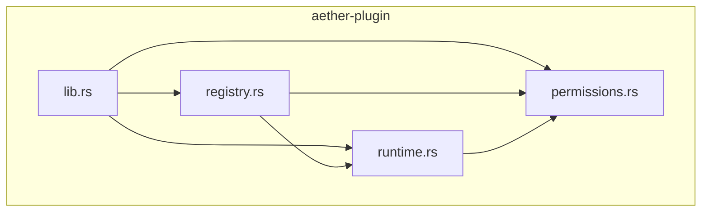
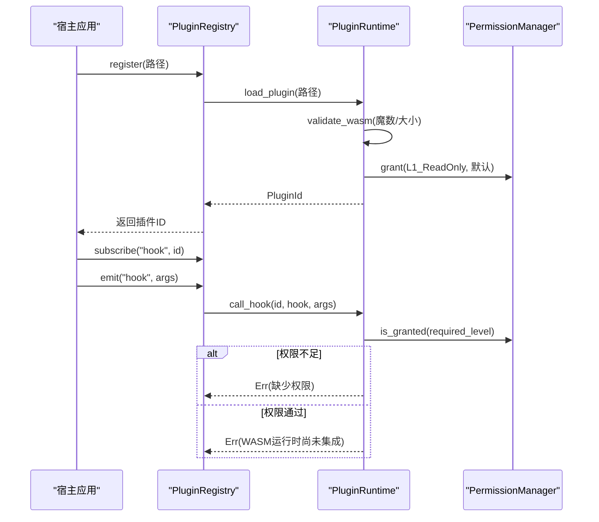
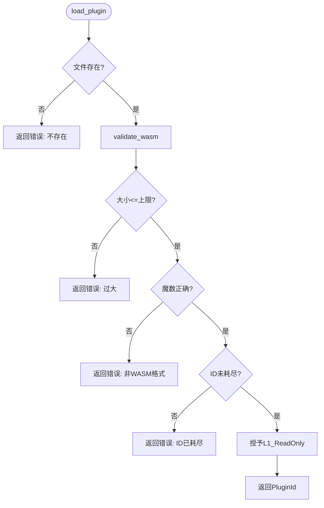
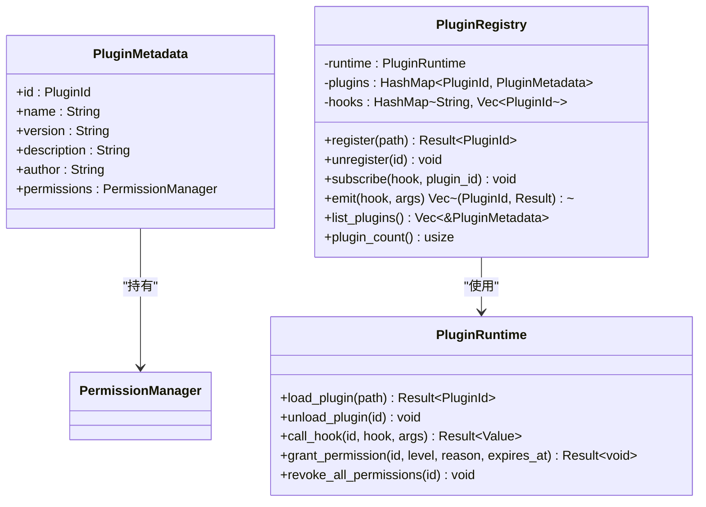
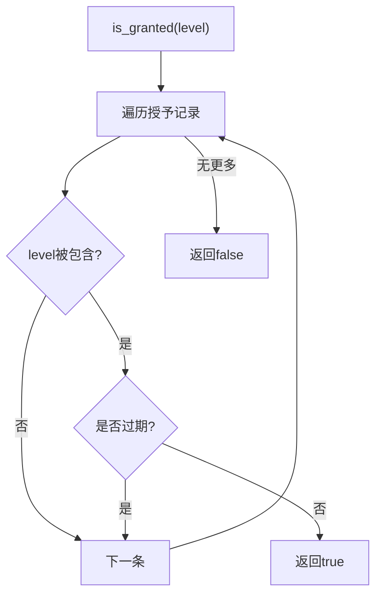
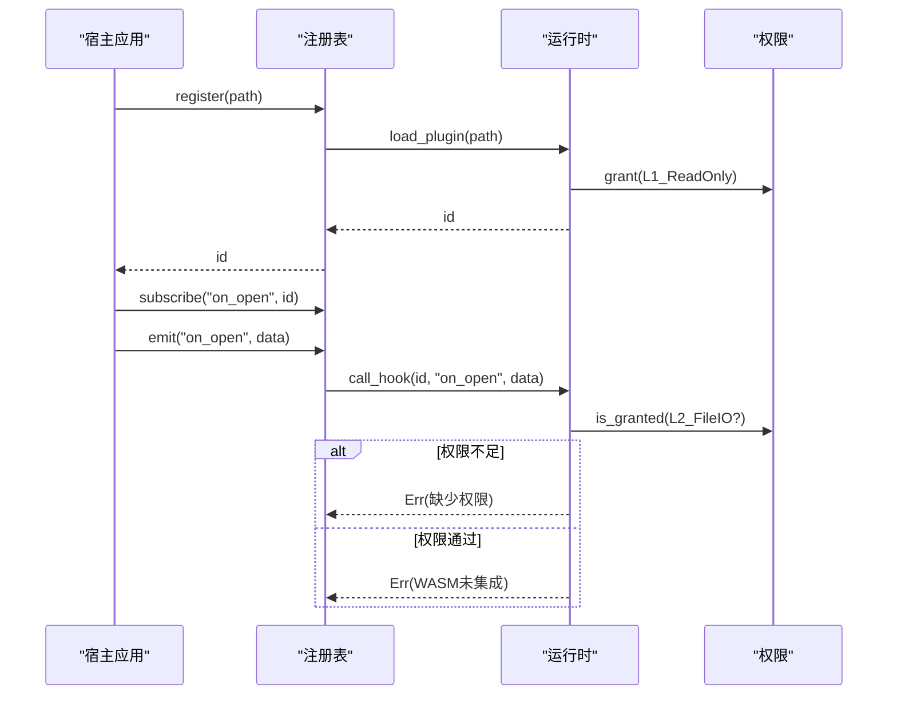

# 插件架构设计

<cite>
**本文引用的文件**
- [crates/aether-plugin/src/lib.rs](file://crates/aether-plugin/src/lib.rs)
- [crates/aether-plugin/src/registry.rs](file://crates/aether-plugin/src/registry.rs)
- [crates/aether-plugin/src/runtime.rs](file://crates/aether-plugin/src/runtime.rs)
- [crates/aether-plugin/src/permissions.rs](file://crates/aether-plugin/src/permissions.rs)
- [README.md](file://README.md)
</cite>

## 目录
1. [简介](#简介)
2. [项目结构](#项目结构)
3. [核心组件](#核心组件)
4. [架构总览](#架构总览)
5. [详细组件分析](#详细组件分析)
6. [依赖关系分析](#依赖关系分析)
7. [性能考量](#性能考量)
8. [故障排查指南](#故障排查指南)
9. [结论](#结论)
10. [附录](#附录)

## 简介
本文件面向 Aether Studio 的插件系统，系统化阐述其整体架构、组件职责与数据流向，覆盖插件从加载到卸载的生命周期、宿主与应用间的通信机制（事件与状态）、模块化设计与接口抽象、扩展点与设计原则，并提供架构图、流程图、最佳实践与性能建议。当前实现为基于 WASM 的插件运行时基础框架：注册表负责生命周期与事件分发，运行时负责安全沙箱与权限控制，权限模块提供细粒度能力授权。

## 项目结构
插件系统位于 crates/aether-plugin 中，采用分层组织：
- 顶层 lib.rs 暴露公共类型与模块
- registry.rs 管理插件注册、元数据、钩子订阅与事件发射
- runtime.rs 维护插件实例、WASM 校验、ID 分配、权限授予与钩子调用入口
- permissions.rs 定义权限级别、授予记录与检查逻辑

图表来源
- [crates/aether-plugin/src/lib.rs:1-8](file://crates/aether-plugin/src/lib.rs#L1-L8)
- [crates/aether-plugin/src/registry.rs:1-30](file://crates/aether-plugin/src/registry.rs#L1-L30)
- [crates/aether-plugin/src/runtime.rs:1-22](file://crates/aether-plugin/src/runtime.rs#L1-L22)
- [crates/aether-plugin/src/permissions.rs:1-13](file://crates/aether-plugin/src/permissions.rs#L1-L13)

章节来源
- [crates/aether-plugin/src/lib.rs:1-8](file://crates/aether-plugin/src/lib.rs#L1-L8)
- [README.md:162-179](file://README.md#L162-L179)

## 核心组件
- 插件标识与运行时
  - PluginId：唯一标识每个已加载插件
  - PluginRuntime：负责 WASM 文件校验、大小限制、ID 分配、权限管理与钩子调用入口
- 插件注册表
  - PluginRegistry：维护插件元数据、钩子订阅表、事件发射与生命周期协调
- 权限系统
  - PermissionLevel：四级权限模型（只读 UI、文件 IO、网络、系统命令）
  - PermissionManager：授予、撤销、过期检查与包含关系判断

章节来源
- [crates/aether-plugin/src/runtime.rs:9-21](file://crates/aether-plugin/src/runtime.rs#L9-L21)
- [crates/aether-plugin/src/registry.rs:6-23](file://crates/aether-plugin/src/registry.rs#L6-L23)
- [crates/aether-plugin/src/permissions.rs:1-13](file://crates/aether-plugin/src/permissions.rs#L1-L13)

## 架构总览
插件系统由“注册表 + 运行时 + 权限”三层组成，遵循最小权限与安全沙箱原则：
- 注册表对外暴露注册、卸载、订阅、发射等 API，屏蔽底层运行时细节
- 运行时负责安全边界：WASM 魔数校验、文件大小限制、ID 防溢出、权限判定
- 权限系统以层级化授权为核心，支持过期时间与原因记录

图表来源
- [crates/aether-plugin/src/registry.rs:34-91](file://crates/aether-plugin/src/registry.rs#L34-L91)
- [crates/aether-plugin/src/runtime.rs:33-87](file://crates/aether-plugin/src/runtime.rs#L33-L87)
- [crates/aether-plugin/src/runtime.rs:127-175](file://crates/aether-plugin/src/runtime.rs#L127-L175)
- [crates/aether-plugin/src/permissions.rs:67-93](file://crates/aether-plugin/src/permissions.rs#L67-L93)

## 详细组件分析

### 插件运行时（PluginRuntime）
- 职责
  - 验证 WASM 文件头与大小，防止恶意或异常文件
  - 分配并管理插件 ID，避免溢出
  - 为每个插件维护独立的权限管理器
  - 根据钩子名称映射所需权限级别，并在调用前执行权限检查
- 关键流程
  - 加载：存在性检查 → 魔数校验 → 大小限制 → ID 分配 → 默认权限授予
  - 卸载：清理插件与权限
  - 钩子调用：权限判定 → 若通过则提示 WASM 尚未集成（占位实现）

图表来源
- [crates/aether-plugin/src/runtime.rs:33-87](file://crates/aether-plugin/src/runtime.rs#L33-L87)

章节来源
- [crates/aether-plugin/src/runtime.rs:33-87](file://crates/aether-plugin/src/runtime.rs#L33-L87)
- [crates/aether-plugin/src/runtime.rs:127-175](file://crates/aether-plugin/src/runtime.rs#L127-L175)

### 插件注册表（PluginRegistry）
- 职责
  - 管理插件元数据（id、name、version、description、author、permissions）
  - 维护钩子订阅表，支持多插件订阅同一钩子
  - 统一触发钩子，收集各插件的执行结果
- 关键流程
  - 注册：委托运行时加载，创建默认元数据
  - 卸载：从运行时移除，清理所有钩子中的订阅
  - 订阅/发射：维护订阅关系，遍历调用运行时钩子

图表来源
- [crates/aether-plugin/src/registry.rs:6-23](file://crates/aether-plugin/src/registry.rs#L6-L23)
- [crates/aether-plugin/src/registry.rs:34-102](file://crates/aether-plugin/src/registry.rs#L34-L102)
- [crates/aether-plugin/src/runtime.rs:23-181](file://crates/aether-plugin/src/runtime.rs#L23-L181)

章节来源
- [crates/aether-plugin/src/registry.rs:34-102](file://crates/aether-plugin/src/registry.rs#L34-L102)

### 权限系统（PermissionLevel / PermissionManager）
- 权限级别
  - L1_ReadOnly：只读 UI 访问
  - L2_FileIO：文件读写
  - L3_Network：网络访问
  - L4_System：系统命令执行
- 包含关系
  - 高权限包含低权限（如 L4 包含 L3/L2/L1），通过显式匹配确保稳健
- 授予与检查
  - 支持授予时间、过期时间与原因记录
  - 检查时过滤过期与无效时间戳的授予记录

图表来源
- [crates/aether-plugin/src/permissions.rs:26-44](file://crates/aether-plugin/src/permissions.rs#L26-L44)
- [crates/aether-plugin/src/permissions.rs:67-93](file://crates/aether-plugin/src/permissions.rs#L67-L93)

章节来源
- [crates/aether-plugin/src/permissions.rs:1-93](file://crates/aether-plugin/src/permissions.rs#L1-L93)

### 插件生命周期与事件流
- 生命周期
  - 加载：注册表委托运行时进行文件校验与权限初始化
  - 运行：注册表维护订阅关系；宿主通过 emit 触发钩子
  - 卸载：注册表清理元数据与订阅，运行时释放资源
- 事件传递
  - 宿主调用 emit(hook, args)，注册表查找订阅者，逐个调用运行时 call_hook
  - 运行时依据钩子名确定所需权限，检查通过后进入实际执行（当前为占位）

图表来源
- [crates/aether-plugin/src/registry.rs:34-91](file://crates/aether-plugin/src/registry.rs#L34-L91)
- [crates/aether-plugin/src/runtime.rs:127-175](file://crates/aether-plugin/src/runtime.rs#L127-L175)
- [crates/aether-plugin/src/permissions.rs:67-93](file://crates/aether-plugin/src/permissions.rs#L67-L93)

章节来源
- [crates/aether-plugin/src/registry.rs:34-91](file://crates/aether-plugin/src/registry.rs#L34-L91)
- [crates/aether-plugin/src/runtime.rs:127-175](file://crates/aether-plugin/src/runtime.rs#L127-L175)

## 依赖关系分析
- 模块耦合
  - registry 依赖 runtime 与 permissions，承担编排与分发
  - runtime 依赖 permissions，承担安全边界与执行入口
  - permissions 独立，提供可复用的授权能力
- 外部依赖
  - 当前为占位实现，未来将引入 wasmtime 作为 WASM 引擎
  - 使用 serde_json 在钩子参数间传递结构化数据

图表来源
- [crates/aether-plugin/src/registry.rs:1-5](file://crates/aether-plugin/src/registry.rs#L1-L5)
- [crates/aether-plugin/src/runtime.rs:1-5](file://crates/aether-plugin/src/runtime.rs#L1-L5)
- [crates/aether-plugin/src/lib.rs:1-8](file://crates/aether-plugin/src/lib.rs#L1-L8)

章节来源
- [crates/aether-plugin/src/lib.rs:1-8](file://crates/aether-plugin/src/lib.rs#L1-L8)

## 性能考量
- 插件体积限制
  - 最大插件大小限制为 50MB，防止内存占用过高
- 权限检查开销
  - 每次钩子调用均进行权限判定，建议在高频路径上缓存必要上下文
- 事件广播成本
  - 同一钩子多订阅者会顺序调用，注意避免阻塞主循环
- 资源释放
  - 卸载时需同步清理插件与权限，避免泄漏

[本节为通用指导，不直接分析具体文件]

## 故障排查指南
- 常见错误与定位
  - 插件文件不存在：检查路径与部署位置
  - 非有效 WASM 格式：确认构建产物是否为标准 WASM
  - 插件文件过大：优化插件体积或调整限制策略
  - 权限不足：为插件授予对应级别的权限（如 write_file 需要 L2_FileIO）
  - WASM 运行时尚未集成：当前为占位实现，需后续接入 wasmtime
- 调试建议
  - 使用日志记录权限授予与撤销
  - 对高频钩子进行性能剖析，减少不必要的数据拷贝
  - 在测试环境中模拟多种权限组合，覆盖边界情况

章节来源
- [crates/aether-plugin/src/runtime.rs:33-87](file://crates/aether-plugin/src/runtime.rs#L33-L87)
- [crates/aether-plugin/src/runtime.rs:127-175](file://crates/aether-plugin/src/runtime.rs#L127-L175)
- [crates/aether-plugin/src/permissions.rs:67-93](file://crates/aether-plugin/src/permissions.rs#L67-L93)

## 结论
该插件架构以“注册表 + 运行时 + 权限”的分层设计实现了安全的插件加载与事件驱动通信。通过严格的 WASM 校验、大小限制与层级化权限模型，系统在可扩展性与安全性之间取得平衡。当前运行时处于占位阶段，后续接入 wasmtime 后即可实现完整的插件执行环境。建议在生产环境中结合监控与审计，持续优化性能与稳定性。

[本节为总结，不直接分析具体文件]

## 附录
- 设计原则
  - 最小权限：默认仅授予只读权限，按需提升
  - 安全沙箱：WASM 隔离执行，严格输入输出
  - 可扩展：钩子系统解耦宿主与插件，便于新增能力
  - 可观测：权限授予记录包含时间、原因，便于审计
- 扩展点
  - 钩子映射：在运行时中扩展 required_permission_for_hook，为新钩子绑定权限
  - 权限策略：在权限管理器中增加更细粒度的资源级授权
  - 事件总线：在注册表中引入优先级与超时控制，增强可靠性
- 最佳实践
  - 插件开发：仅请求必要权限，避免过度授权
  - 宿主集成：对高频事件做节流与批处理
  - 运维监控：统计插件调用次数与失败率，及时告警

[本节为概念性内容，不直接分析具体文件]