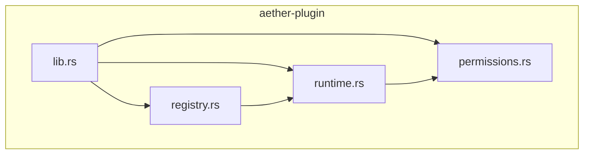
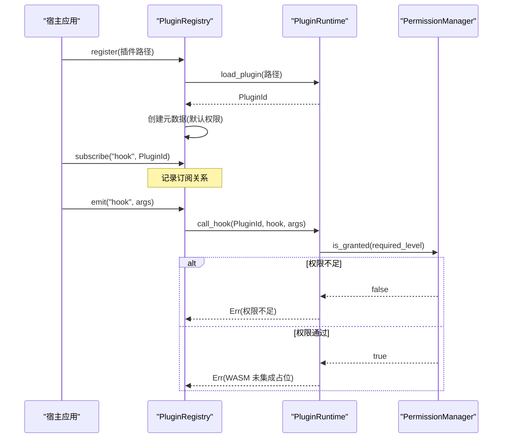
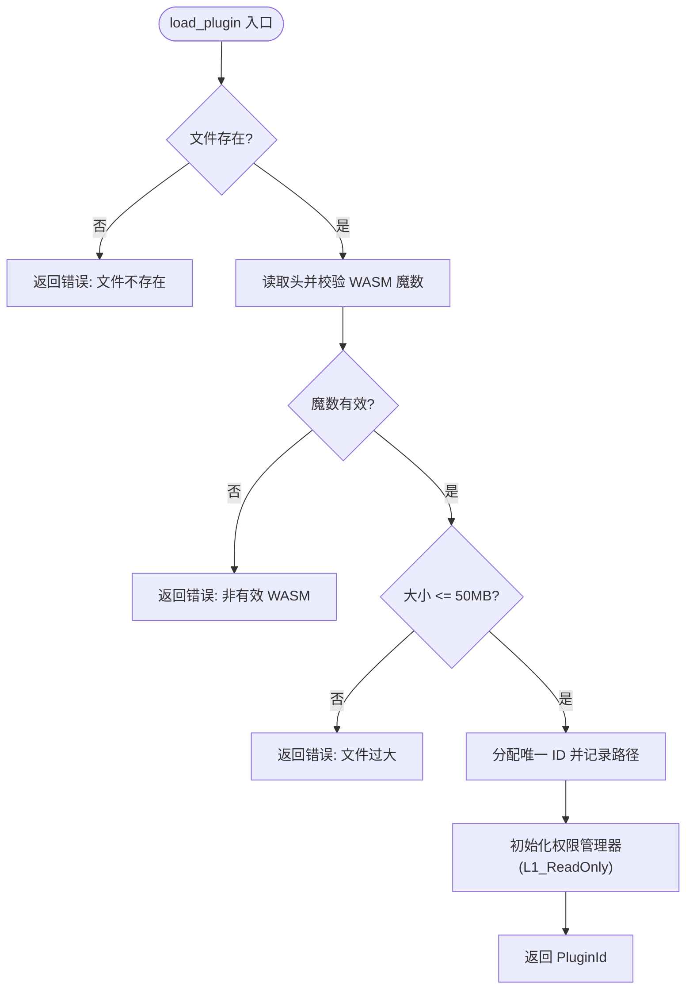
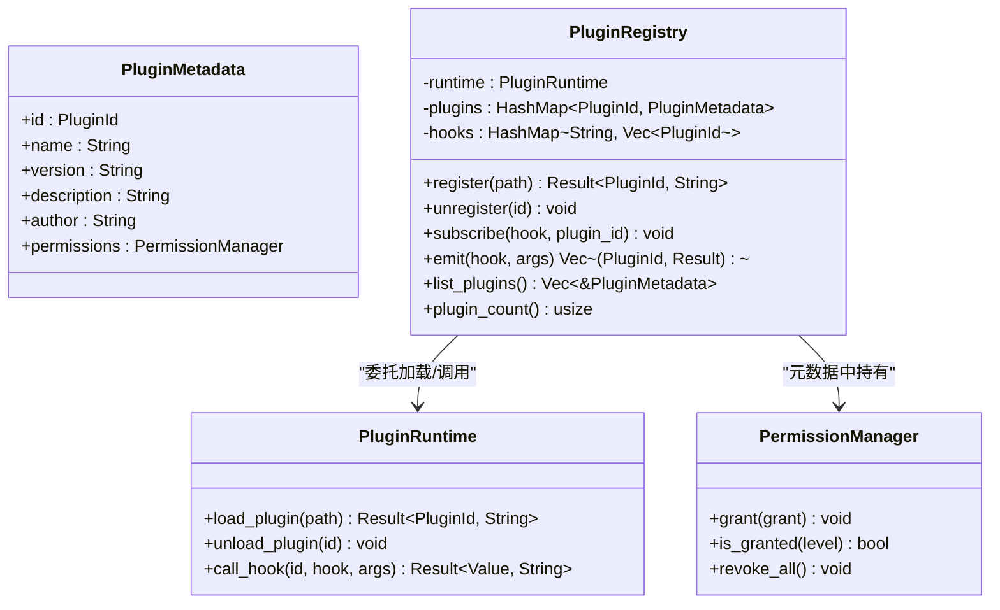
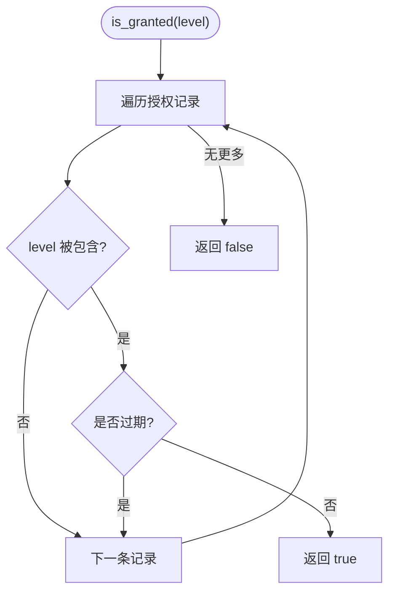
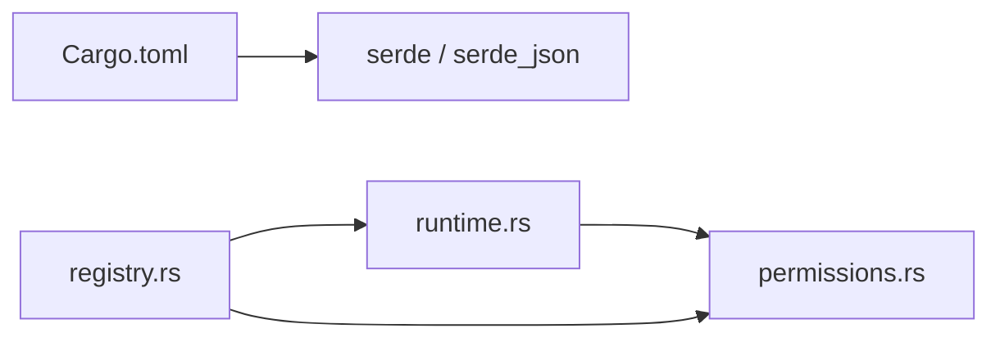

# 插件系统

<cite>
**本文引用的文件**
- [crates/aether-plugin/src/lib.rs](file://crates/aether-plugin/src/lib.rs)
- [crates/aether-plugin/src/runtime.rs](file://crates/aether-plugin/src/runtime.rs)
- [crates/aether-plugin/src/registry.rs](file://crates/aether-plugin/src/registry.rs)
- [crates/aether-plugin/src/permissions.rs](file://crates/aether-plugin/src/permissions.rs)
- [crates/aether-plugin/Cargo.toml](file://crates/aether-plugin/Cargo.toml)
- [README.md](file://README.md)
</cite>

## 目录
1. [简介](#简介)
2. [项目结构](#项目结构)
3. [核心组件](#核心组件)
4. [架构总览](#架构总览)
5. [详细组件分析](#详细组件分析)
6. [依赖关系分析](#依赖关系分析)
7. [性能与资源管理](#性能与资源管理)
8. [故障排查指南](#故障排查指南)
9. [结论](#结论)
10. [附录：开发指南、SDK、示例与最佳实践](#附录开发指南sdk示例与最佳实践)

## 简介
本文件为 Aether Studio 的插件系统提供面向开发者的完整技术文档。当前实现聚焦于“插件运行时基础能力”和“权限控制”，并预留了 WASM 运行时的集成点。文档涵盖：
- 沙箱环境与内存管理（基于 WASM 的安全边界与大小限制）
- 生命周期控制（加载、卸载、钩子调用）
- 插件注册机制（发现、加载、卸载、事件分发）
- 权限控制系统（细粒度权限级别、有效期、撤销）
- 插件 API 设计（钩子系统、事件处理、数据结构交换）
- 环境搭建与 SDK 使用说明
- 打包、分发与版本管理建议
- 调试与测试方法
- 具体插件示例与最佳实践

## 项目结构
插件系统位于 crates/aether-plugin，采用模块化组织：
- lib.rs：对外暴露模块与类型
- runtime.rs：插件运行时（WASM 验证、加载、卸载、钩子调用入口、权限检查）
- registry.rs：插件注册表（元数据、订阅、事件发射）
- permissions.rs：权限模型与管理器（L1-L4 权限层级、有效期、授予/撤销）

图表来源
- [crates/aether-plugin/src/lib.rs:1-8](file://crates/aether-plugin/src/lib.rs#L1-L8)
- [crates/aether-plugin/src/runtime.rs:1-22](file://crates/aether-plugin/src/runtime.rs#L1-L22)
- [crates/aether-plugin/src/registry.rs:1-23](file://crates/aether-plugin/src/registry.rs#L1-L23)
- [crates/aether-plugin/src/permissions.rs:1-13](file://crates/aether-plugin/src/permissions.rs#L1-L13)

章节来源
- [crates/aether-plugin/src/lib.rs:1-8](file://crates/aether-plugin/src/lib.rs#L1-L8)
- [crates/aether-plugin/Cargo.toml:1-9](file://crates/aether-plugin/Cargo.toml#L1-L9)

## 核心组件
- 插件标识与运行时
  - PluginId：唯一标识已加载插件
  - PluginRuntime：负责 WASM 文件校验、加载、卸载、钩子调用、权限检查
- 插件注册表
  - PluginMetadata：插件元信息（名称、版本、描述、作者、权限管理器）
  - PluginRegistry：管理插件生命周期、钩子订阅与事件分发
- 权限系统
  - PermissionLevel：L1_ReadOnly、L2_FileIO、L3_Network、L4_System
  - PermissionManager：授予/撤销权限、过期检查、包含关系判断

章节来源
- [crates/aether-plugin/src/runtime.rs:9-21](file://crates/aether-plugin/src/runtime.rs#L9-L21)
- [crates/aether-plugin/src/registry.rs:6-23](file://crates/aether-plugin/src/registry.rs#L6-L23)
- [crates/aether-plugin/src/permissions.rs:1-13](file://crates/aether-plugin/src/permissions.rs#L1-L13)

## 架构总览
插件系统由“注册表 + 运行时 + 权限管理器”构成。注册表负责插件发现与事件分发；运行时负责 WASM 文件校验、加载与钩子调用；权限管理器确保每次钩子调用前进行细粒度权限检查。

图表来源
- [crates/aether-plugin/src/registry.rs:34-91](file://crates/aether-plugin/src/registry.rs#L34-L91)
- [crates/aether-plugin/src/runtime.rs:60-175](file://crates/aether-plugin/src/runtime.rs#L60-L175)
- [crates/aether-plugin/src/permissions.rs:67-93](file://crates/aether-plugin/src/permissions.rs#L67-L93)

## 详细组件分析

### 运行时（WASM 沙箱与生命周期）
- 安全校验
  - 魔数校验：仅接受以 WASM 魔数开头的二进制文件
  - 大小限制：最大 50MB，防止恶意或异常大文件
- 生命周期
  - load_plugin：校验文件、分配 ID、初始化权限（默认 L1_ReadOnly）、记录路径
  - unload_plugin：移除插件与权限记录
  - call_hook：根据钩子名映射所需权限级别，执行权限检查后调用（当前为占位，返回未集成错误）
- 权限映射
  - 只读 UI：on_activate、on_deactivate、get_theme、get_language → L1
  - 文件 IO：on_save、on_open、read_file、write_file → L2
  - 网络：fetch、http_request、websocket → L3
  - 系统：exec、spawn、shell、run_command → L4
  - 未知钩子默认 L1（最小权限原则）

图表来源
- [crates/aether-plugin/src/runtime.rs:33-87](file://crates/aether-plugin/src/runtime.rs#L33-L87)

章节来源
- [crates/aether-plugin/src/runtime.rs:33-175](file://crates/aether-plugin/src/runtime.rs#L33-L175)

### 注册表（插件发现、加载、卸载与事件分发）
- 注册流程
  - register：调用运行时加载插件，创建默认元数据（名称来自文件名，版本固定），插入到内部映射
- 卸载流程
  - unregister：从运行时卸载，并从所有钩子订阅列表中移除该插件
- 事件分发
  - subscribe：将插件 ID 加入指定钩子的订阅列表
  - emit：遍历订阅者，逐个调用运行时 call_hook，收集结果（含权限拒绝或未集成错误）

图表来源
- [crates/aether-plugin/src/registry.rs:6-101](file://crates/aether-plugin/src/registry.rs#L6-L101)
- [crates/aether-plugin/src/runtime.rs:16-187](file://crates/aether-plugin/src/runtime.rs#L16-L187)
- [crates/aether-plugin/src/permissions.rs:56-93](file://crates/aether-plugin/src/permissions.rs#L56-L93)

章节来源
- [crates/aether-plugin/src/registry.rs:34-101](file://crates/aether-plugin/src/registry.rs#L34-L101)

### 权限控制系统（细粒度权限与安全边界）
- 权限级别
  - L1_ReadOnly：只读 UI 访问
  - L2_FileIO：文件读写
  - L3_Network：网络访问
  - L4_System：系统命令执行
- 包含关系
  - L4 包含所有权限；L3 包含 L3/L2/L1；L2 包含 L2/L1；L1 仅包含自身
- 授予与撤销
  - grant：追加一条授权记录（可带有效期）
  - revoke_all：清空所有授权
- 过期策略
  - 若 grants.expires_at 存在且早于当前时间，视为过期
  - granted_at 不能晚于当前时间（防止未来生效的权限）
- 运行时权限检查
  - call_hook 在调用前根据钩子名确定所需权限级别，并通过 PermissionManager.is_granted 检查

图表来源
- [crates/aether-plugin/src/permissions.rs:67-93](file://crates/aether-plugin/src/permissions.rs#L67-L93)

章节来源
- [crates/aether-plugin/src/permissions.rs:1-93](file://crates/aether-plugin/src/permissions.rs#L1-L93)
- [crates/aether-plugin/src/runtime.rs:159-175](file://crates/aether-plugin/src/runtime.rs#L159-L175)

### 插件 API 设计（钩子系统、事件处理、数据结构交换）
- 钩子命名约定
  - 只读 UI：on_activate、on_deactivate、get_theme、get_language
  - 文件 IO：on_save、on_open、read_file、write_file
  - 网络：fetch、http_request、websocket
  - 系统：exec、spawn、shell、run_command
- 事件参数与返回值
  - 使用 JSON Value 作为统一的数据交换格式，便于跨语言与跨进程通信
- 事件分发语义
  - 同一钩子可被多个插件订阅；emit 会按订阅顺序依次调用，并收集每个插件的执行结果（成功或错误）

章节来源
- [crates/aether-plugin/src/runtime.rs:159-175](file://crates/aether-plugin/src/runtime.rs#L159-L175)
- [crates/aether-plugin/src/registry.rs:67-91](file://crates/aether-plugin/src/registry.rs#L67-L91)

## 依赖关系分析
- 外部依赖
  - serde、serde_json：用于序列化/反序列化 JSON 数据
- 内部依赖
  - runtime 依赖 permissions（权限检查）
  - registry 依赖 runtime（加载/调用）与 permissions（元数据中的权限管理器）

图表来源
- [crates/aether-plugin/Cargo.toml:6-9](file://crates/aether-plugin/Cargo.toml#L6-L9)
- [crates/aether-plugin/src/runtime.rs:1-5](file://crates/aether-plugin/src/runtime.rs#L1-L5)
- [crates/aether-plugin/src/registry.rs:1-5](file://crates/aether-plugin/src/registry.rs#L1-L5)

章节来源
- [crates/aether-plugin/Cargo.toml:1-9](file://crates/aether-plugin/Cargo.toml#L1-L9)

## 性能与资源管理
- 文件大小限制：50MB，避免内存占用过高
- ID 溢出保护：u32 上限时拒绝新插件加载
- 权限检查开销：O(n) 遍历授权记录，n 通常为较小值
- 事件分发：线性遍历订阅者，注意在高并发场景下合并或批处理
- 内存管理：当前为占位实现，实际 WASM 引擎集成时需关注实例隔离与内存回收

[本节为通用指导，不直接分析具体代码]

## 故障排查指南
- 常见错误
  - 文件不存在：检查插件路径是否正确
  - 非有效 WASM：确认二进制文件头是否为 WASM 魔数
  - 文件过大：压缩或拆分插件逻辑
  - 权限不足：为插件授予对应级别的权限
  - WASM 未集成：当前为占位实现，需后续集成 wasmtime
- 定位方法
  - 查看 emit 返回的错误信息，确认是哪个插件、哪个钩子失败
  - 使用 list_plugins 与 plugin_count 核对状态
  - 对权限问题，检查 grant_permission 的有效期与级别

章节来源
- [crates/aether-plugin/src/runtime.rs:60-175](file://crates/aether-plugin/src/runtime.rs#L60-L175)
- [crates/aether-plugin/src/registry.rs:34-101](file://crates/aether-plugin/src/registry.rs#L34-L101)

## 结论
当前插件系统提供了完整的权限控制与生命周期管理框架，并以 JSON 作为统一的 API 数据交换格式。WASM 运行时的实际执行尚未集成，但权限检查与事件分发已就绪。后续工作应聚焦于：
- 集成 wasmtime 或其他 WASM 引擎以实现真正的沙箱执行
- 完善插件元数据解析与版本管理
- 扩展钩子集与权限映射
- 提供 SDK 与示例插件，简化开发者接入

[本节为总结性内容，不直接分析具体代码]

## 附录：开发指南、SDK、示例与最佳实践

### 环境搭建
- 构建要求
  - Windows 10 1809+ 或 Windows 11
  - Rust stable 工具链（见 rust-toolchain.toml）
  - Visual Studio 2022 或 Windows SDK 构建工具
  - 目标平台：x86_64-pc-windows-msvc
- 构建与运行
  - 构建 GUI：cargo build -p aether-win32 --bin aether-app
  - 构建 CLI：cargo build -p aether-cli --bin aether
  - 运行 GUI：cargo run -p aether-win32 --bin aether-app
  - 打开文件：cargo run -p aether-cli --bin aether -- path/to/file.rs

章节来源
- [README.md:85-118](file://README.md#L85-L118)
- [README.md:258-291](file://README.md#L258-L291)

### SDK 使用说明
- 基本步骤
  - 准备一个有效的 WASM 文件（以 WASM 魔数开头）
  - 通过注册表 register 加载插件，获取 PluginId
  - 使用 subscribe 订阅需要的钩子
  - 触发事件 emit，传入 JSON 参数
  - 根据需要 grant_permission 授予相应权限
- 注意事项
  - 钩子调用前会进行权限检查，未满足则返回错误
  - 当前 call_hook 为占位实现，返回“WASM 未集成”错误

章节来源
- [crates/aether-plugin/src/registry.rs:34-91](file://crates/aether-plugin/src/registry.rs#L34-L91)
- [crates/aether-plugin/src/runtime.rs:60-175](file://crates/aether-plugin/src/runtime.rs#L60-L175)

### 插件示例（概念流程）
- 示例：文件监听插件
  - 订阅 on_open 与 on_save 钩子
  - 需要 L2_FileIO 权限
  - 接收 JSON 参数（如文件路径、内容摘要）
  - 返回 JSON 结果（如处理状态、变更标记）

[本节为概念性说明，不直接分析具体代码]

### 打包、分发与版本管理
- 打包
  - 输出标准 WASM 二进制，确保魔数正确
  - 建议附带清单文件（名称、版本、描述、作者、权限需求）
- 分发
  - 可通过仓库或包管理器分发
  - 安装时进行魔数与大小校验
- 版本管理
  - 建议在元数据中声明版本
  - 升级时注意权限变更与钩子兼容性

[本节为通用指导，不直接分析具体代码]

### 调试与测试
- 单元测试
  - 运行全工作区测试：cargo test --workspace --no-fail-fast
  - 针对插件模块的测试覆盖加载、权限、事件等场景
- 覆盖率
  - 使用 coverage.ps1 收集覆盖率
- 调试技巧
  - 打印 emit 返回的错误信息
  - 使用 list_plugins 与 plugin_count 核对状态
  - 逐步授予权限并观察行为变化

章节来源
- [README.md:127-146](file://README.md#L127-L146)
- [README.md:300-319](file://README.md#L300-L319)

### 最佳实践
- 最小权限原则：仅申请必要的权限级别
- 明确钩子契约：定义清晰的输入输出 JSON 结构
- 健壮的错误处理：区分权限拒绝、未集成、参数错误等
- 资源控制：避免在钩子中进行耗时操作，必要时异步化
- 版本兼容：保持向后兼容，谨慎变更钩子签名

[本节为通用指导，不直接分析具体代码]