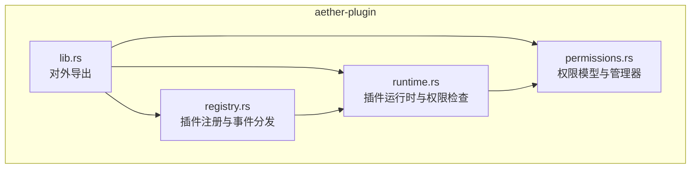
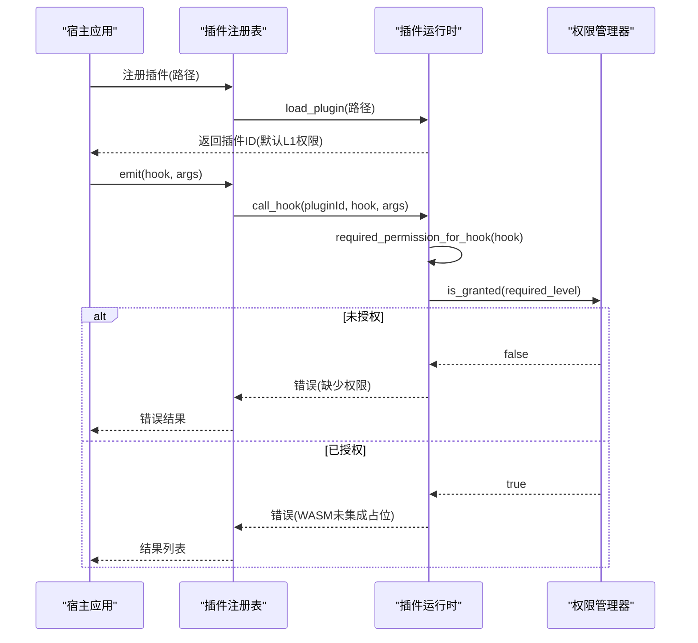
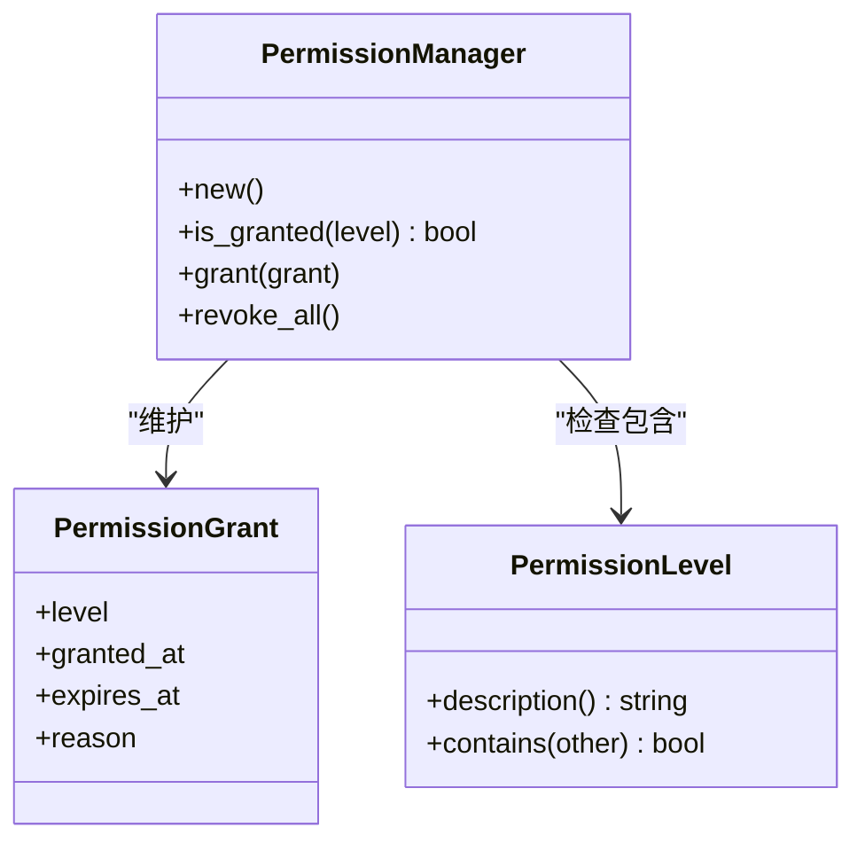
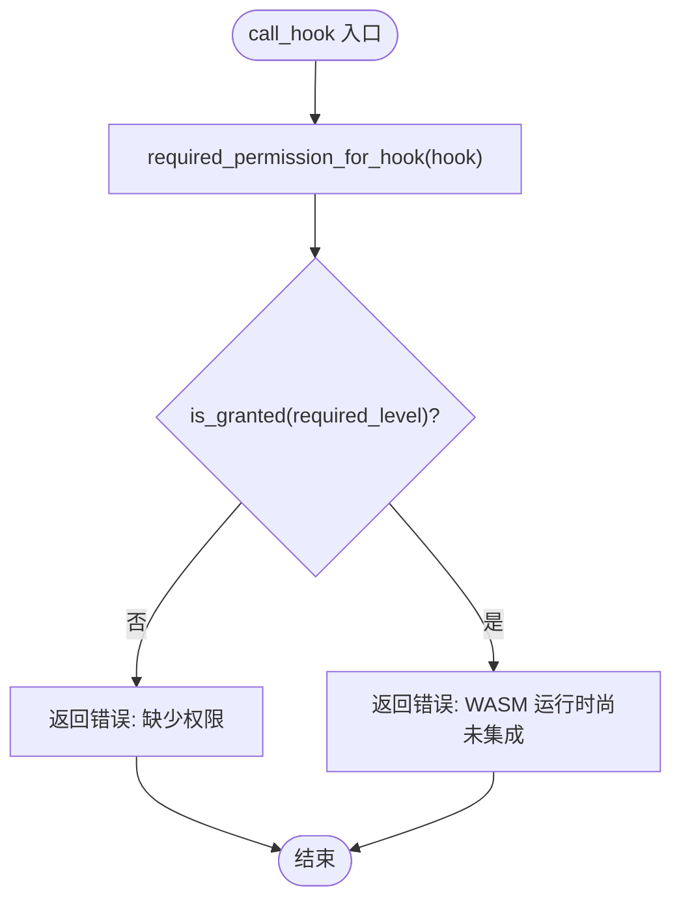
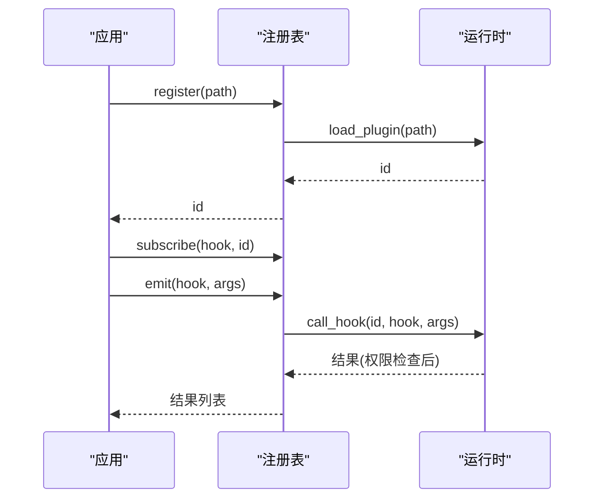
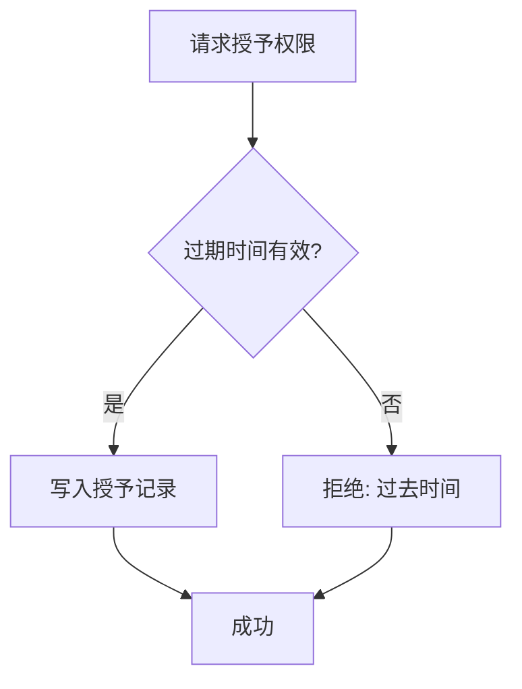
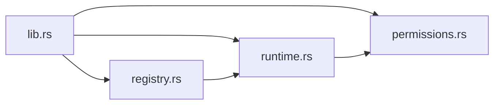

# 权限控制系统

<cite>
**本文引用的文件**
- [permissions.rs](file://crates/aether-plugin/src/permissions.rs)
- [runtime.rs](file://crates/aether-plugin/src/runtime.rs)
- [registry.rs](file://crates/aether-plugin/src/registry.rs)
- [lib.rs](file://crates/aether-plugin/src/lib.rs)
- [Cargo.toml](file://crates/aether-plugin/Cargo.toml)
</cite>

## 目录
1. [简介](#简介)
2. [项目结构](#项目结构)
3. [核心组件](#核心组件)
4. [架构总览](#架构总览)
5. [详细组件分析](#详细组件分析)
6. [依赖关系分析](#依赖关系分析)
7. [性能与安全特性](#性能与安全特性)
8. [故障排查指南](#故障排查指南)
9. [结论](#结论)
10. [附录：最佳实践与安全建议](#附录最佳实践与安全建议)

## 简介
本文件系统性地文档化了插件系统的细粒度权限控制模型，涵盖以下方面：
- 权限级别与继承关系（L1-L4）
- 静态分析与动态验证机制
- 权限声明与配置方式（运行时授予、默认最小权限）
- 安全边界实现（WASM 沙箱、资源访问限制）
- 权限授予与撤销流程
- 审计与日志记录现状与建议
- 最佳实践与安全建议

该权限系统围绕 aether-plugin 模块构建，通过分层权限、运行时校验和严格的加载策略，确保插件在受限环境中安全执行。

## 项目结构
aether-plugin 模块由三个核心文件组成：
- permissions.rs：定义权限级别、授予记录与权限管理器
- runtime.rs：实现插件生命周期、权限检查与钩子调用入口
- registry.rs：管理插件注册、事件分发与元数据

图表来源
- [lib.rs:1-7](file://crates/aether-plugin/src/lib.rs#L1-L7)
- [permissions.rs:1-100](file://crates/aether-plugin/src/permissions.rs#L1-L100)
- [runtime.rs:1-180](file://crates/aether-plugin/src/runtime.rs#L1-L180)
- [registry.rs:1-100](file://crates/aether-plugin/src/registry.rs#L1-L100)

章节来源
- [lib.rs:1-7](file://crates/aether-plugin/src/lib.rs#L1-L7)
- [Cargo.toml:1-9](file://crates/aether-plugin/Cargo.toml#L1-L9)

## 核心组件
- 权限级别与继承：定义了 L1_ReadOnly、L2_FileIO、L3_Network、L4_System 四级权限，并实现了显式包含关系，避免枚举重排导致的静默破坏。
- 权限授予记录：记录每次授予的级别、授予时间、过期时间与原因，支持过期校验。
- 权限管理器：维护一组授予记录，提供“是否已授予”、“授予”、“撤销全部”等能力。
- 插件运行时：负责插件加载、默认权限分配、权限授予/撤销、钩子调用前的权限检查。
- 插件注册表：统一管理插件生命周期、订阅与事件触发，并在触发时委托运行时进行权限检查。

章节来源
- [permissions.rs:1-100](file://crates/aether-plugin/src/permissions.rs#L1-L100)
- [runtime.rs:1-180](file://crates/aether-plugin/src/runtime.rs#L1-L180)
- [registry.rs:1-100](file://crates/aether-plugin/src/registry.rs#L1-L100)

## 架构总览
权限控制贯穿插件加载、运行与事件分发的全过程。运行时在加载插件时赋予最小权限（L1），并在每次钩子调用前根据操作类型判定所需权限级别，结合当前授予状态进行动态校验。注册表作为统一入口，屏蔽底层细节并提供事件分发。

图表来源
- [runtime.rs:59-180](file://crates/aether-plugin/src/runtime.rs#L59-L180)
- [registry.rs:34-91](file://crates/aether-plugin/src/registry.rs#L34-L91)
- [permissions.rs:56-100](file://crates/aether-plugin/src/permissions.rs#L56-L100)

## 详细组件分析

### 权限级别与继承关系
- 级别定义：L1_ReadOnly（只读 UI 访问）、L2_FileIO（文件读写）、L3_Network（网络访问）、L4_System（系统命令执行）。
- 继承规则：L4 包含所有；L3 包含 L3/L2/L1；L2 包含 L2/L1；L1 仅包含自身。
- 设计要点：使用显式匹配实现 contains，避免枚举变体顺序变化导致的安全回归。

图表来源
- [permissions.rs:1-100](file://crates/aether-plugin/src/permissions.rs#L1-L100)

章节来源
- [permissions.rs:1-100](file://crates/aether-plugin/src/permissions.rs#L1-L100)

### 插件运行时与权限检查
- 加载插件：校验 WASM 魔数与大小，分配唯一 ID，并默认授予 L1_ReadOnly 权限。
- 权限授予：支持设置过期时间，拒绝过去时间的过期时间，防止“已过期但永久有效”的漏洞。
- 钩子调用：根据 hook 名称映射到所需权限级别，若未满足则直接拒绝；当前为占位实现，实际 WASM 调用尚未集成。
- 撤销权限：支持一次性撤销某插件的所有权限。

图表来源
- [runtime.rs:127-180](file://crates/aether-plugin/src/runtime.rs#L127-L180)
- [runtime.rs:159-175](file://crates/aether-plugin/src/runtime.rs#L159-L175)

章节来源
- [runtime.rs:59-180](file://crates/aether-plugin/src/runtime.rs#L59-L180)

### 插件注册表与事件分发
- 注册/卸载：封装插件生命周期，维护插件元数据与权限管理器。
- 订阅/触发：将插件订阅到特定 hook，触发时遍历订阅者并调用运行时进行权限检查与执行。
- 清理：卸载插件时同步移除其订阅关系，避免悬挂引用。

图表来源
- [registry.rs:34-91](file://crates/aether-plugin/src/registry.rs#L34-L91)
- [runtime.rs:127-180](file://crates/aether-plugin/src/runtime.rs#L127-L180)

章节来源
- [registry.rs:1-100](file://crates/aether-plugin/src/registry.rs#L1-L100)

### 权限授予与撤销流程
- 授予流程：宿主调用 grant_permission，传入目标级别、原因与可选过期时间；运行时校验过期时间有效性并写入授予记录。
- 撤销流程：调用 revoke_all_permissions 清空指定插件的所有授予记录。
- 默认策略：新加载插件仅拥有 L1_ReadOnly，遵循最小权限原则。

图表来源
- [runtime.rs:95-118](file://crates/aether-plugin/src/runtime.rs#L95-L118)
- [permissions.rs:67-93](file://crates/aether-plugin/src/permissions.rs#L67-L93)

章节来源
- [runtime.rs:95-125](file://crates/aether-plugin/src/runtime.rs#L95-L125)
- [permissions.rs:67-93](file://crates/aether-plugin/src/permissions.rs#L67-L93)

### 安全边界与资源隔离
- 沙箱环境：注释表明基于 Wasmtime 引擎提供安全的插件执行环境；当前为架构占位，实际 WASM 调用未集成。
- 资源限制：加载时校验文件大小上限（50MB）与 WASM 魔数，防止恶意或异常文件进入运行时。
- 权限边界：通过运行时在每个钩子调用前强制进行权限检查，越权访问将被拒绝。
- 撤销与清理：卸载插件时同时移除权限管理器，避免残留权限。

章节来源
- [runtime.rs:33-87](file://crates/aether-plugin/src/runtime.rs#L33-L87)
- [runtime.rs:89-125](file://crates/aether-plugin/src/runtime.rs#L89-L125)

### 权限审计与日志记录
- 当前实现：权限授予记录包含 granted_at、expires_at、reason，可用于审计追踪；但未见统一的日志输出或持久化存储。
- 建议扩展：
  - 在 grant/revoke 处增加结构化日志（如 JSON 格式），便于集中采集与分析。
  - 对权限检查失败（拒绝）进行告警与审计记录，便于事后复盘。
  - 可引入外部日志服务或本地文件落盘，保留长期审计轨迹。

章节来源
- [permissions.rs:47-93](file://crates/aether-plugin/src/permissions.rs#L47-L93)
- [runtime.rs:95-125](file://crates/aether-plugin/src/runtime.rs#L95-L125)

## 依赖关系分析
- 模块内依赖：
  - runtime.rs 依赖 permissions.rs 的权限模型与管理器。
  - registry.rs 依赖 runtime.rs 进行插件生命周期管理与权限检查。
  - lib.rs 统一导出公共类型与接口。
- 外部依赖：
  - serde、serde_json 用于序列化参数与结果。

图表来源
- [lib.rs:1-7](file://crates/aether-plugin/src/lib.rs#L1-L7)
- [runtime.rs:1-5](file://crates/aether-plugin/src/runtime.rs#L1-L5)
- [registry.rs:1-5](file://crates/aether-plugin/src/registry.rs#L1-L5)

章节来源
- [Cargo.toml:1-9](file://crates/aether-plugin/Cargo.toml#L1-L9)
- [lib.rs:1-7](file://crates/aether-plugin/src/lib.rs#L1-L7)

## 性能与安全特性
- 性能考量：
  - 权限检查为 O(n) 遍历授予记录，n 通常为较小值；可通过索引优化提升高频检查场景的性能。
  - 插件加载时的文件校验与魔数检查为一次性成本，影响有限。
- 安全特性：
  - 最小权限默认策略（L1_ReadOnly）。
  - 显式包含关系避免枚举重排带来的权限泄漏。
  - 过期时间校验防止“已过期但永久有效”的漏洞。
  - 文件大小与格式校验降低恶意载荷风险。
  - 钩子调用前强制权限检查，阻断越权访问。

[本节为通用指导，不直接分析具体文件]

## 故障排查指南
- 常见错误与定位：
  - “插件未加载”：检查是否正确注册并获取有效插件 ID。
  - “缺少执行所需的权限”：确认是否已通过 grant_permission 授予对应级别权限。
  - “WASM 运行时尚未集成”：当前为占位实现，需集成 wasmtime 后才能真正执行钩子。
  - “插件文件不存在/无效/过大”：检查插件路径、文件格式与大小限制。
- 调试建议：
  - 打印 required_permission_for_hook 的映射结果，确认 hook 与权限级别的对应关系。
  - 检查授予记录的 granted_at 与 expires_at，确保时间逻辑正确。
  - 在 emit 前后记录订阅者与结果，定位具体失败的插件。

章节来源
- [runtime.rs:127-180](file://crates/aether-plugin/src/runtime.rs#L127-L180)
- [runtime.rs:33-87](file://crates/aether-plugin/src/runtime.rs#L33-L87)
- [registry.rs:75-91](file://crates/aether-plugin/src/registry.rs#L75-L91)

## 结论
本权限控制系统通过分层权限、严格的最小权限默认策略与运行时权限检查，构建了插件执行的安全边界。尽管当前 WASM 运行尚未集成，但权限模型与检查流程已具备可扩展性。建议后续完善审计日志、持久化存储与更细粒度的资源访问控制，以进一步提升安全性与可观测性。

[本节为总结，不直接分析具体文件]

## 附录：最佳实践与安全建议
- 权限最小化：
  - 始终从 L1_ReadOnly 开始，按需逐步授予更高权限。
  - 为敏感操作（如网络、系统命令）设置短期过期时间。
- 配置与声明：
  - 在宿主侧集中管理权限授予策略，避免插件自授权。
  - 记录授予原因与有效期，便于审计与回溯。
- 安全边界：
  - 保持 WASM 沙箱隔离，禁止直接访问宿主内存与系统资源。
  - 对输入参数进行严格校验，防止注入与越界访问。
- 审计与日志：
  - 对所有权限变更与拒绝事件进行结构化记录。
  - 定期审查权限分布，及时撤销不再需要的权限。
- 测试与验证：
  - 覆盖权限拒绝与授予场景的单元测试。
  - 模拟越权访问，验证拦截效果。

[本节为通用指导，不直接分析具体文件]