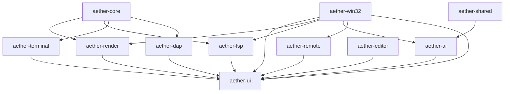
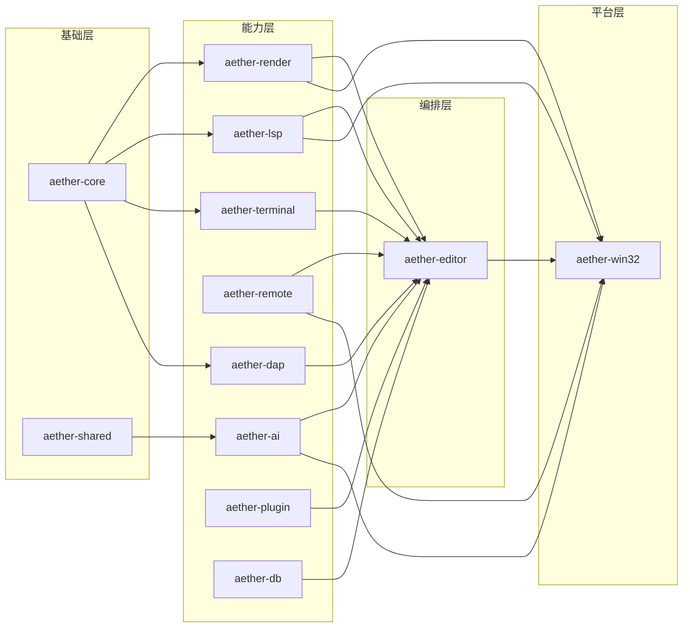
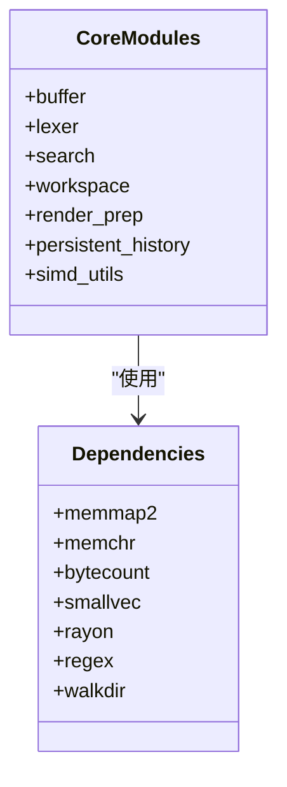
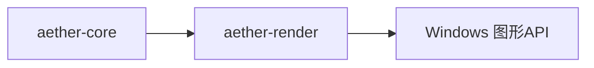
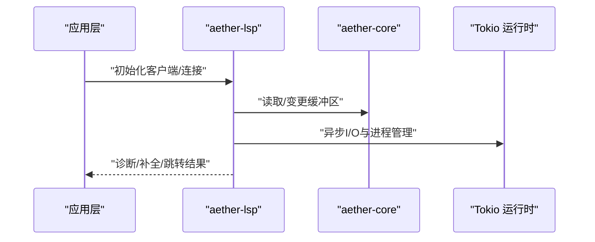
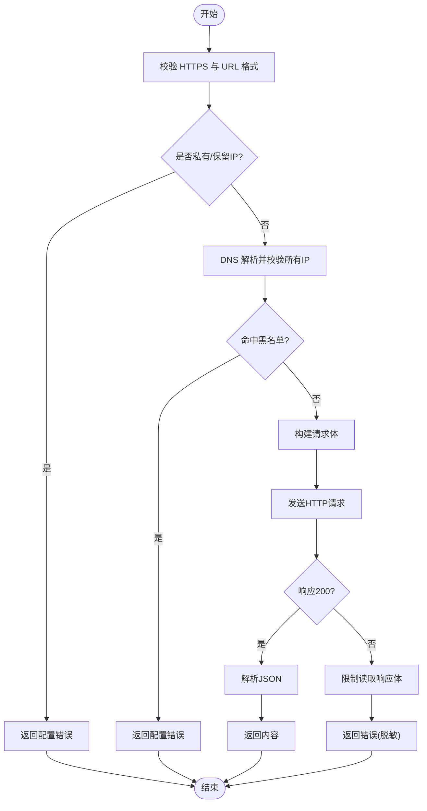

# Crate 依赖关系

<cite>
**本文引用的文件**
- [Cargo.toml](file://Cargo.toml)
- [aether-core/Cargo.toml](file://crates/aether-core/Cargo.toml)
- [aether-core/src/lib.rs](file://crates/aether-core/src/lib.rs)
- [aether-render/Cargo.toml](file://crates/aether-render/Cargo.toml)
- [aether-render/src/lib.rs](file://crates/aether-render/src/lib.rs)
- [aether-win32/Cargo.toml](file://crates/aether-win32/Cargo.toml)
- [aether-lsp/Cargo.toml](file://crates/aether-lsp/Cargo.toml)
- [aether-lsp/src/lib.rs](file://crates/aether-lsp/src/lib.rs)
- [aether-ai/Cargo.toml](file://crates/aether-ai/Cargo.toml)
- [aether-ai/src/lib.rs](file://crates/aether-ai/src/lib.rs)
- [aether-remote/Cargo.toml](file://crates/aether-remote/Cargo.toml)
- [aether-editor/Cargo.toml](file://crates/aether-editor/Cargo.toml)
- [aether-ui/Cargo.toml](file://crates/aether-ui/Cargo.toml)
- [aether-shared/Cargo.toml](file://crates/aether-shared/Cargo.toml)
- [aether-terminal/Cargo.toml](file://crates/aether-terminal/Cargo.toml)
- [aether-dap/Cargo.toml](file://crates/aether-dap/Cargo.toml)
- [aether-plugin/Cargo.toml](file://crates/aether-plugin/Cargo.toml)
- [aether-db/Cargo.toml](file://crates/aether-db/Cargo.toml)
</cite>

## 目录
1. [简介](#简介)
2. [项目结构](#项目结构)
3. [核心组件](#核心组件)
4. [架构总览](#架构总览)
5. [详细组件分析](#详细组件分析)
6. [依赖分析](#依赖分析)
7. [性能考虑](#性能考虑)
8. [故障排查指南](#故障排查指南)
9. [结论](#结论)
10. [附录](#附录)

## 简介
本文件为“牧羊人编辑器”的 Cargo Workspace 依赖关系文档。基于工作区配置与各 crate 的 Cargo.toml，系统梳理各 crate 的职责、依赖边界与公共 API 暴露策略，重点说明基础库 aether-core 的作用，以及上层应用层（如 aether-win32、aether-render）如何依赖它；同时绘制功能模块（aether-lsp、aether-ai、aether-remote 等）之间的依赖图，确保无循环依赖与合理的抽象边界，并给出第三方依赖的使用情况与选择理由、版本兼容性矩阵及优化建议。

## 项目结构
工作区由多个 crate 组成，采用分层组织：底层能力（文本缓冲、词法分析、搜索、工作区）集中在 aether-core；渲染子系统在 aether-render；平台/窗口集成在 aether-win32；语言服务在 aether-lsp；AI 能力在 aether-ai；远程能力在 aether-remote；UI 组件在 aether-ui；终端在 aether-terminal；调试器在 aether-dap；插件框架在 aether-plugin；共享设置在 aether-shared；数据库在 aether-db；编辑器编排在 aether-editor。

图表来源
- [Cargo.toml:1-19](file://Cargo.toml#L1-L19)
- [aether-core/Cargo.toml:6-13](file://crates/aether-core/Cargo.toml#L6-L13)
- [aether-render/Cargo.toml:6-11](file://crates/aether-render/Cargo.toml#L6-L11)
- [aether-lsp/Cargo.toml:6-16](file://crates/aether-lsp/Cargo.toml#L6-L16)
- [aether-ai/Cargo.toml:6-11](file://crates/aether-ai/Cargo.toml#L6-L11)
- [aether-remote/Cargo.toml:6-10](file://crates/aether-remote/Cargo.toml#L6-L10)
- [aether-editor/Cargo.toml:6-14](file://crates/aether-editor/Cargo.toml#L6-L14)
- [aether-ui/Cargo.toml:6-22](file://crates/aether-ui/Cargo.toml#L6-L22)
- [aether-win32/Cargo.toml:14-23](file://crates/aether-win32/Cargo.toml#L14-L23)

章节来源
- [Cargo.toml:1-37](file://Cargo.toml#L1-L37)

## 核心组件
- aether-core：提供文本缓冲（PieceTable）、增量词法分析、多语言词法器、搜索、工作区遍历、持久化历史、SIMD 工具等。是其他 crate 的基础能力来源。
- aether-render：基于 Direct2D/DirectWrite/Direct3D11 的高性能渲染管线，包含 GPU 加速的词法着色、主题、VSCode 主题适配等。
- aether-lsp：实现 LSP 客户端/服务端通信、增量同步、语义高亮 token 处理，重导出 lsp-types 供下游使用。
- aether-ai：封装 AI 提供商（DeepSeek/Kimi/自定义），提供安全校验（HTTPS、私有 IP 阻断、DNS 二次校验）、流式补全、模型列表获取等。
- aether-remote：提供远程文件系统、SSH、Git 等远程能力。
- aether-terminal：Windows 控制台与 ConPTY 终端集成。
- aether-dap：调试适配器协议客户端/会话/传输。
- aether-plugin：插件注册、权限、运行时。
- aether-shared：跨 crate 共享设置与启动参数。
- aether-db：本地存储与向量检索（HNSW）。
- aether-ui：Windows UI 组件集合（菜单、对话框、状态栏、活动栏、搜索面板等）。
- aether-editor：编辑器编排层，组合 core/render/lsp/ai-panel/terminal/ui/remote 等。
- aether-win32：Windows 应用入口与窗口消息、键盘/鼠标事件、渲染上下文、主界面组装。

章节来源
- [aether-core/src/lib.rs:1-12](file://crates/aether-core/src/lib.rs#L1-L12)
- [aether-render/src/lib.rs:1-5](file://crates/aether-render/src/lib.rs#L1-L5)
- [aether-lsp/src/lib.rs:1-16](file://crates/aether-lsp/src/lib.rs#L1-L16)
- [aether-ai/src/lib.rs:1-800](file://crates/aether-ai/src/lib.rs#L1-L800)

## 架构总览
整体采用“基础库 → 能力模块 → 编排层 → 平台入口”的分层架构：
- 基础层：aether-core 提供文本与词法能力；aether-shared 提供共享数据。
- 能力层：aether-render、aether-lsp、aether-ai、aether-remote、aether-terminal、aether-dap、aether-plugin、aether-db。
- 编排层：aether-editor 将能力组合为编辑器体验。
- 平台层：aether-win32 负责 Windows 窗口、事件、渲染上下文与应用装配。

图表来源
- [Cargo.toml:1-19](file://Cargo.toml#L1-L19)
- [aether-core/Cargo.toml:6-13](file://crates/aether-core/Cargo.toml#L6-L13)
- [aether-render/Cargo.toml:6-11](file://crates/aether-render/Cargo.toml#L6-L11)
- [aether-lsp/Cargo.toml:6-16](file://crates/aether-lsp/Cargo.toml#L6-L16)
- [aether-ai/Cargo.toml:6-11](file://crates/aether-ai/Cargo.toml#L6-L11)
- [aether-remote/Cargo.toml:6-10](file://crates/aether-remote/Cargo.toml#L6-L10)
- [aether-terminal/Cargo.toml:6-9](file://crates/aether-terminal/Cargo.toml#L6-L9)
- [aether-dap/Cargo.toml:6-15](file://crates/aether-dap/Cargo.toml#L6-L15)
- [aether-plugin/Cargo.toml:6-8](file://crates/aether-plugin/Cargo.toml#L6-L8)
- [aether-db/Cargo.toml:6-7](file://crates/aether-db/Cargo.toml#L6-L7)
- [aether-editor/Cargo.toml:6-14](file://crates/aether-editor/Cargo.toml#L6-L14)
- [aether-win32/Cargo.toml:14-23](file://crates/aether-win32/Cargo.toml#L14-L23)

## 详细组件分析

### aether-core（基础库）
- 职责：文本缓冲（PieceTable）、增量词法分析、多语言词法器、搜索、工作区遍历、持久化历史、SIMD 工具、基准测试。
- 依赖：memmap2、memchr、bytecount、smallvec、rayon、regex、walkdir。
- 公共 API：通过 lib.rs 暴露 buffer、lexer、search、workspace、render_prep、persistent_history、simd_utils 等模块。
- 复杂度与性能：使用 rayon 并行、memchr/regex 高效匹配、piece table 支持 O(1) 插入/删除；benchmarks 用于持续性能回归检测。

图表来源
- [aether-core/src/lib.rs:1-12](file://crates/aether-core/src/lib.rs#L1-L12)
- [aether-core/Cargo.toml:6-13](file://crates/aether-core/Cargo.toml#L6-L13)

章节来源
- [aether-core/src/lib.rs:1-12](file://crates/aether-core/src/lib.rs#L1-L12)
- [aether-core/Cargo.toml:6-13](file://crates/aether-core/Cargo.toml#L6-L13)

### aether-render（渲染子系统）
- 职责：Direct2D/DirectWrite/Direct3D11 渲染、GPU 加速词法着色、主题与 VSCode 主题适配。
- 依赖：aether-core、rustc-hash、serde/serde_json、windows（图形相关特性）。
- 公共 API：d2d、gpu、theme、vscode_theme 模块。

图表来源
- [aether-render/Cargo.toml:6-11](file://crates/aether-render/Cargo.toml#L6-L11)
- [aether-render/src/lib.rs:1-5](file://crates/aether-render/src/lib.rs#L1-L5)

章节来源
- [aether-render/Cargo.toml:6-11](file://crates/aether-render/Cargo.toml#L6-L11)
- [aether-render/src/lib.rs:1-5](file://crates/aether-render/src/lib.rs#L1-L5)

### aether-lsp（语言服务协议）
- 职责：LSP 客户端/服务端、增量同步、语义 token、类型定义与重导出 lsp-types。
- 依赖：aether-core、lsp-types、serde/serde_json、tokio/tokio-util、futures、bytes、tracing、thiserror。
- 公共 API：LspClient、增量同步、语义 token、types 等。

图表来源
- [aether-lsp/src/lib.rs:1-16](file://crates/aether-lsp/src/lib.rs#L1-L16)
- [aether-lsp/Cargo.toml:6-16](file://crates/aether-lsp/Cargo.toml#L6-L16)

章节来源
- [aether-lsp/src/lib.rs:1-16](file://crates/aether-lsp/src/lib.rs#L1-L16)
- [aether-lsp/Cargo.toml:6-16](file://crates/aether-lsp/Cargo.toml#L6-L16)

### aether-ai（AI 能力）
- 职责：对接 OpenAI 兼容接口（DeepSeek/Kimi/自定义），提供安全校验（HTTPS、私有 IP 阻断、DNS 二次校验）、流式补全、模型列表获取、错误脱敏与重试策略。
- 依赖：serde/serde_json、ureq、url、aether-shared。
- 公共 API：AiProvider、AiConfig、AiClient、ChatMessage、AiStreamEvent 等。

图表来源
- [aether-ai/src/lib.rs:1-800](file://crates/aether-ai/src/lib.rs#L1-L800)
- [aether-ai/Cargo.toml:6-11](file://crates/aether-ai/Cargo.toml#L6-L11)

章节来源
- [aether-ai/src/lib.rs:1-800](file://crates/aether-ai/src/lib.rs#L1-L800)
- [aether-ai/Cargo.toml:6-11](file://crates/aether-ai/Cargo.toml#L6-L11)

### aether-remote（远程能力）
- 职责：远程文件系统、SSH、Git 操作。
- 依赖：serde/serde_json、shell-escape。
- 公共 API：容器、远程FS、SSH、工作区等。

章节来源
- [aether-remote/Cargo.toml:6-10](file://crates/aether-remote/Cargo.toml#L6-L10)

### aether-terminal（终端）
- 职责：ConPTY 终端集成、控制台交互。
- 依赖：aether-core、tracing、windows（控制台/进程/IO）。

章节来源
- [aether-terminal/Cargo.toml:6-9](file://crates/aether-terminal/Cargo.toml#L6-L9)

### aether-dap（调试适配器协议）
- 职责：调试客户端/会话/传输。
- 依赖：aether-core、serde/serde_json、tokio/tokio-util、futures、bytes、tracing、thiserror。

章节来源
- [aether-dap/Cargo.toml:6-15](file://crates/aether-dap/Cargo.toml#L6-L15)

### aether-plugin（插件框架）
- 职责：插件注册、权限控制、运行时。
- 依赖：serde/serde_json。

章节来源
- [aether-plugin/Cargo.toml:6-8](file://crates/aether-plugin/Cargo.toml#L6-L8)

### aether-shared（共享设置）
- 职责：跨 crate 共享设置与启动参数。
- 依赖：serde/serde_json、dirs；Windows 目标特定依赖（安全加密等）。

章节来源
- [aether-shared/Cargo.toml:6-12](file://crates/aether-shared/Cargo.toml#L6-L12)

### aether-db（数据库）
- 职责：本地存储与向量检索（HNSW）。
- 依赖：memmap2。

章节来源
- [aether-db/Cargo.toml:6-7](file://crates/aether-db/Cargo.toml#L6-L7)

### aether-ui（用户界面）
- 职责：Windows UI 组件（菜单、对话框、状态栏、活动栏、搜索面板等）。
- 依赖：aether-core、aether-render、aether-shared、aether-remote、serde/serde_json、tracing、time、ureq、sha2、dirs、image、windows（大量 UI/Shell/GDI/D2D/DWrite 特性）。

章节来源
- [aether-ui/Cargo.toml:6-22](file://crates/aether-ui/Cargo.toml#L6-L22)

### aether-editor（编辑器编排）
- 职责：组合 core/render/lsp/ai-panel/terminal/ui/remote 等，提供编辑器统一入口。
- 依赖：aether-core、aether-shared、aether-lsp、aether-ai-panel、aether-terminal、aether-ui、aether-remote、aether-render、tokio、lsp-types、url、serde/serde_json、tracing、dirs、windows。

章节来源
- [aether-editor/Cargo.toml:6-14](file://crates/aether-editor/Cargo.toml#L6-L14)

### aether-win32（Windows 应用入口）
- 职责：Windows 应用主程序、窗口消息、键盘/鼠标事件、渲染上下文、主界面组装。
- 依赖：aether-core、aether-render、aether-ai、aether-shared、aether-remote、aether-lsp、aether-ai-panel、aether-terminal、aether-ui、tokio、lsp-types、url、dirs、tracing、time、serde/serde_json、ureq、sha2、image、memmap2、flate2、ort、tokenizers、windows（大量 Win32 特性）、webview2-com。

章节来源
- [aether-win32/Cargo.toml:14-44](file://crates/aether-win32/Cargo.toml#L14-L44)

## 依赖分析
- 层次结构与抽象边界
  - aether-core 作为基础库，不依赖任何业务 crate，仅依赖通用 Rust 生态库，保证稳定与可复用性。
  - aether-render、aether-lsp、aether-terminal、aether-dap、aether-remote、aether-ai 等能力模块仅依赖 aether-core 或 aether-shared，避免反向依赖。
  - aether-editor 作为编排层，聚合能力模块，向上不向基础层引入额外耦合。
  - aether-win32 作为平台入口，依赖所有能力模块以组装应用。
- 循环依赖检查
  - 从 Cargo.toml 可见，依赖方向自下而上，未发现循环引用。
- 公共 API 暴露策略
  - aether-core：按模块 pub mod 暴露 buffer、lexer、search、workspace、render_prep、persistent_history、simd_utils 等。
  - aether-lsp：重新导出 lsp-types 与关键类型，便于下游直接使用。
  - aether-ai：暴露 AiProvider、AiConfig、AiClient、ChatMessage、AiStreamEvent 等。
  - aether-render：暴露 d2d、gpu、theme、vscode_theme 模块。
- 第三方依赖使用情况与选择理由
  - tokio：异步运行时，广泛用于 LSP、AI、终端、调试器等需要并发与 I/O 的场景。
  - serde/serde_json：序列化/反序列化，贯穿设置、LSP、AI、UI 等。
  - windows：Win32 绑定，覆盖 UI、渲染、终端、窗口消息等。
  - ureq：轻量 HTTP 客户端，用于 AI 请求。
  - tracing/tracing-subscriber：结构化日志与追踪。
  - memmap2：内存映射文件，用于高性能 IO（core、db）。
  - regex/memchr/bytecount：高效文本处理（core）。
  - rayons：并行计算（core）。
  - image：图片加载（UI、win32）。
  - ort/tokenizers：AI 推理与分词（win32）。
  - lsp-types：LSP 类型定义（lsp、win32、editor）。
  - dirs：路径与配置目录访问（shared、ui、win32、editor）。
  - time：时间格式化（ui、win32）。
  - sha2：哈希（ui、win32）。
  - flate2：压缩（win32）。
  - webview2-com：WebView2 集成（win32）。
- 版本兼容性矩阵
  - Rust 工具链：edition 2021，rust-version 1.70（工作区配置）。
  - tokio：1.35（LSP、AI、Editor、Win32）。
  - lsp-types：0.95（LSP、Editor、Win32）。
  - windows：0.58（Render、UI、Terminal、DAP、Editor、Win32）。
  - serde：1.0（广泛使用）。
  - serde_json：1.0（广泛使用）。
  - ureq：2.9（AI、UI、Win32）。
  - memmap2：0.9（Core、DB、Win32）。
  - tracing：0.1（LSP、UI、Win32、Terminal、DAP）。
  - time：0.3（UI、Win32）。
  - image：0.24（UI、Win32）。
  - ort：2.0.0-rc.9（Win32）。
  - tokenizers：0.23（Win32）。
  - thiserror：1.0（LSP、DAP）。
  - bytes：1.5（LSP、DAP）。
  - futures：0.3（LSP、DAP）。
  - walkdir：2.5（Core）。
  - smallvec：1.13（Core）。
  - regex：1.10（Core）。
  - memchr：2（Core）。
  - bytecount：0.6（Core）。
  - dirs：5.0（Shared、UI、Win32、Editor）。
  - url：2（AI、Editor、Win32）。
  - shell-escape：0.1（Remote）。
  - tempfile：3.10（Remote dev-dependencies）。
  - criterion：0.5（Core benchmarks）。
  - rand：0.8（Core dev-dependencies）。

章节来源
- [Cargo.toml:22-27](file://Cargo.toml#L22-L27)
- [aether-core/Cargo.toml:6-13](file://crates/aether-core/Cargo.toml#L6-L13)
- [aether-lsp/Cargo.toml:6-16](file://crates/aether-lsp/Cargo.toml#L6-L16)
- [aether-ai/Cargo.toml:6-11](file://crates/aether-ai/Cargo.toml#L6-L11)
- [aether-render/Cargo.toml:6-11](file://crates/aether-render/Cargo.toml#L6-L11)
- [aether-terminal/Cargo.toml:6-9](file://crates/aether-terminal/Cargo.toml#L6-L9)
- [aether-dap/Cargo.toml:6-15](file://crates/aether-dap/Cargo.toml#L6-L15)
- [aether-ui/Cargo.toml:6-22](file://crates/aether-ui/Cargo.toml#L6-L22)
- [aether-editor/Cargo.toml:6-14](file://crates/aether-editor/Cargo.toml#L6-L14)
- [aether-win32/Cargo.toml:14-44](file://crates/aether-win32/Cargo.toml#L14-L44)
- [aether-shared/Cargo.toml:6-12](file://crates/aether-shared/Cargo.toml#L6-L12)
- [aether-remote/Cargo.toml:6-10](file://crates/aether-remote/Cargo.toml#L6-L10)
- [aether-db/Cargo.toml:6-7](file://crates/aether-db/Cargo.toml#L6-L7)

## 性能考虑
- 文本处理：aether-core 使用 PieceTable、memchr、regex、bytecount 提升匹配与编辑性能；rayon 并行加速。
- 渲染性能：aether-render 使用 GPU 加速与 Direct2D/DirectWrite/Direct3D11，减少 CPU 负担。
- 网络与 I/O：aether-ai 使用 ureq 并限制响应体大小，避免大响应阻塞；tokio 异步 I/O 提高吞吐。
- 日志与追踪：tracing 提供细粒度性能观测点。
- 构建优化：release profile 启用 LTO、单 codegen unit、opt-level 3、panic=abort、strip，减小体积并提升运行性能。

[本节为通用指导，无需具体文件分析]

## 故障排查指南
- AI 请求失败
  - 检查 HTTPS 与 Base URL 配置；确认未指向私有/保留 IP；查看 DNS 解析结果；核对 API Key。
  - 参考错误脱敏与安全显示方法，避免泄露敏感信息。
- LSP 连接问题
  - 检查 tokio 运行时与进程管理；确认增量同步与传输层配置；查看 tracing 日志定位。
- 渲染异常
  - 检查 Direct2D/DirectWrite/Direct3D11 特性启用；确认主题与 GPU 上下文初始化。
- 终端不可用
  - 检查 ConPTY 与控制台权限；确认进程与管道创建成功。
- 插件加载失败
  - 检查权限与注册表；查看插件运行时日志。

章节来源
- [aether-ai/src/lib.rs:1-800](file://crates/aether-ai/src/lib.rs#L1-L800)
- [aether-lsp/Cargo.toml:6-16](file://crates/aether-lsp/Cargo.toml#L6-L16)
- [aether-render/Cargo.toml:6-11](file://crates/aether-render/Cargo.toml#L6-L11)
- [aether-terminal/Cargo.toml:6-9](file://crates/aether-terminal/Cargo.toml#L6-L9)
- [aether-plugin/Cargo.toml:6-8](file://crates/aether-plugin/Cargo.toml#L6-L8)

## 结论
本项目采用清晰的分层架构，aether-core 作为基础库提供稳定的文本与词法能力；上层能力模块围绕核心扩展，编排层整合能力形成编辑器体验；平台层负责 Windows 集成。依赖方向明确，无循环依赖，公共 API 暴露合理。第三方依赖选择兼顾性能与易用性，版本矩阵统一在工作区中管理。建议在后续迭代中继续维护清晰的抽象边界，关注性能回归与安全性加固。

[本节为总结，无需具体文件分析]

## 附录
- 工作区成员清单与版本：见工作区配置。
- 构建与发布：release profile 已优化。
- 测试与基准：core 提供基准测试，便于性能回归检测。

章节来源
- [Cargo.toml:1-37](file://Cargo.toml#L1-L37)