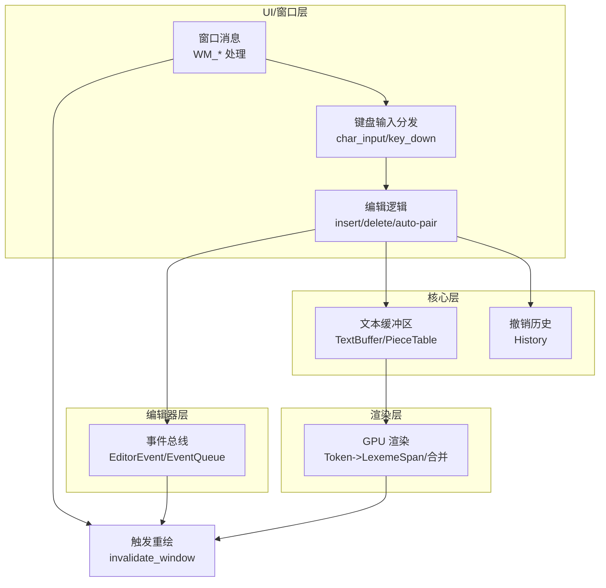
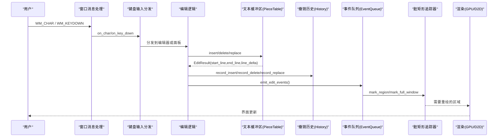
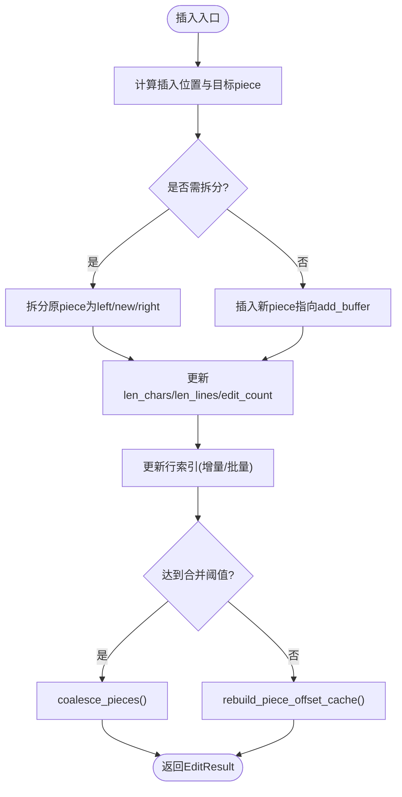
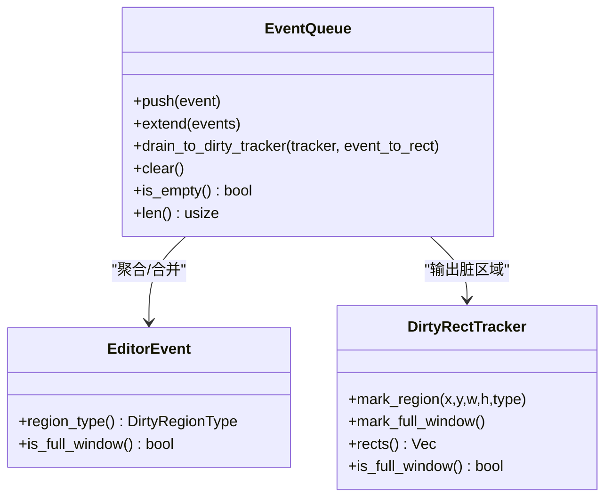
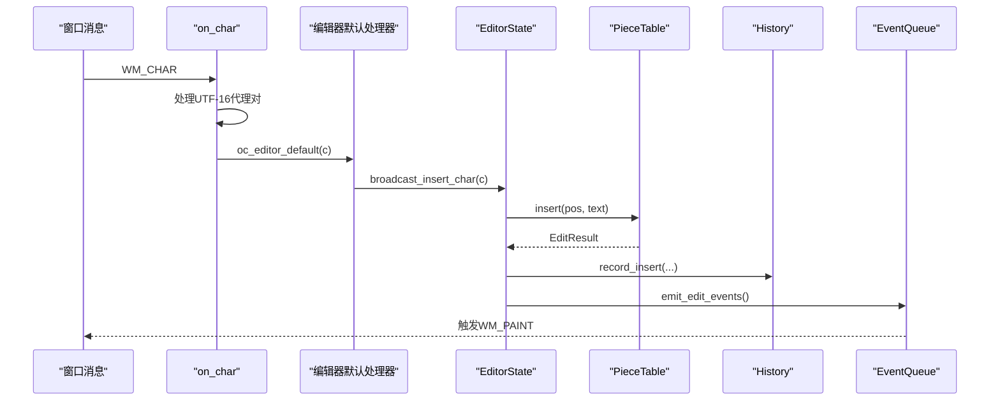
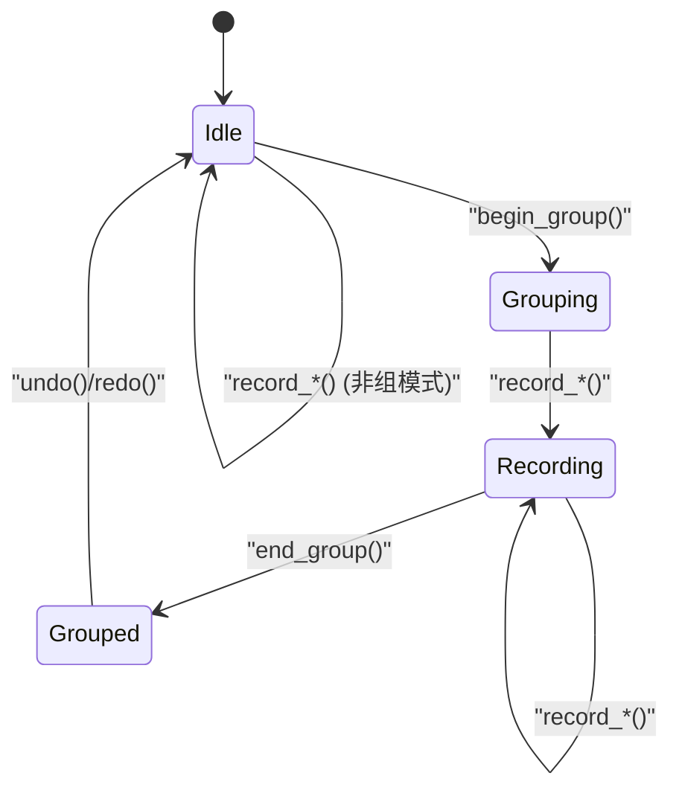
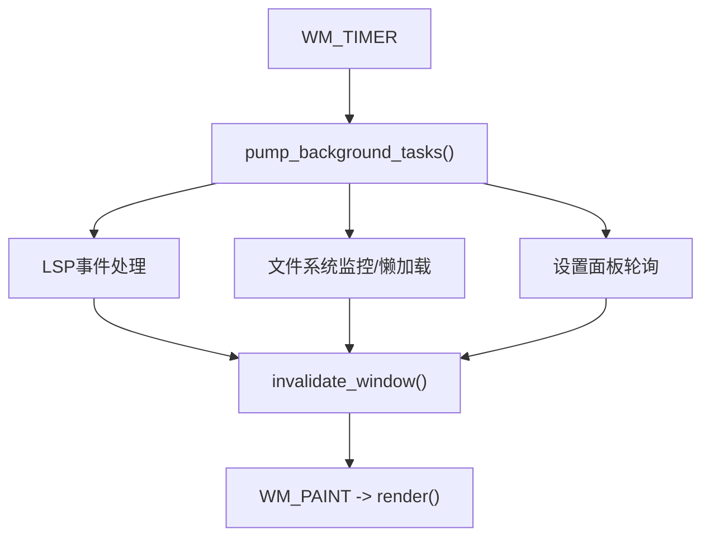
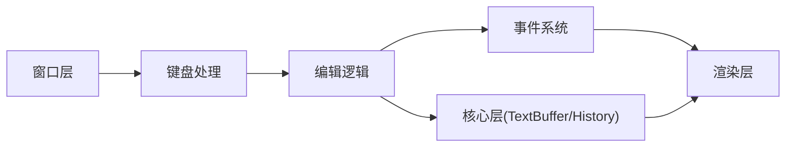

# 数据流设计

<cite>
**本文引用的文件**
- [crates/aether-core/src/buffer/mod.rs](file://crates/aether-core/src/buffer/mod.rs)
- [crates/aether-core/src/buffer/piece_table.rs](file://crates/aether-core/src/buffer/piece_table.rs)
- [crates/aether-core/src/buffer/text_buffer.rs](file://crates/aether-core/src/buffer/text_buffer.rs)
- [crates/aether-core/src/buffer/history.rs](file://crates/aether-core/src/buffer/history.rs)
- [crates/aether-editor/src/events.rs](file://crates/aether-editor/src/events.rs)
- [crates/aether-win32/src/window/keyboard_handler.rs](file://crates/aether-win32/src/window/keyboard_handler.rs)
- [crates/aether-win32/src/window/keyboard_handler/char_input.rs](file://crates/aether-win32/src/window/keyboard_handler/char_input.rs)
- [crates/aether-win32/src/editor/editing.rs](file://crates/aether-win32/src/editor/editing.rs)
- [crates/aether-render/src/gpu/render.rs](file://crates/aether-render/src/gpu/render.rs)
- [crates/aether-win32/src/window/window_messages.rs](file://crates/aether-win32/src/window/window_messages.rs)
</cite>

## 目录
1. [简介](#简介)
2. [项目结构](#项目结构)
3. [核心组件](#核心组件)
4. [架构总览](#架构总览)
5. [详细组件分析](#详细组件分析)
6. [依赖关系分析](#依赖关系分析)
7. [性能考量](#性能考量)
8. [故障排查指南](#故障排查指南)
9. [结论](#结论)
10. [附录](#附录)

## 简介
本设计文档聚焦牧羊人编辑器的数据流：从用户输入到界面更新的完整路径，文本缓冲区（Piece Table）的数据结构与变更流向，事件系统的数据传递机制，状态管理（全局/局部/持久化）的同步策略，以及异步数据处理（网络、I/O、渲染）的协调方式。文档同时给出数据流图与状态转换图，帮助读者理解系统的整体行为与关键优化点。

## 项目结构
编辑器采用分层与模块化组织：
- 核心层（aether-core）：提供文本缓冲区抽象（TextBuffer）、高性能 Piece Table 实现、撤销历史（History）。
- 编辑器层（aether-editor）：定义编辑器事件总线与脏区域合并策略。
- UI/窗口层（aether-win32）：处理 Windows 消息、键盘输入分发、编辑操作、定时器驱动后台任务与刷新。
- 渲染层（aether-render）：GPU 词法/语法高亮、Token 合并、双缓冲与 GPU 缓冲区池。

图表来源
- [crates/aether-core/src/buffer/mod.rs:1-9](file://crates/aether-core/src/buffer/mod.rs#L1-L9)
- [crates/aether-core/src/buffer/piece_table.rs:11-35](file://crates/aether-core/src/buffer/piece_table.rs#L11-L35)
- [crates/aether-editor/src/events.rs:9-64](file://crates/aether-editor/src/events.rs#L9-L64)
- [crates/aether-win32/src/window/keyboard_handler.rs:1-13](file://crates/aether-win32/src/window/keyboard_handler.rs#L1-L13)
- [crates/aether-win32/src/window/window_messages.rs:21-60](file://crates/aether-win32/src/window/window_messages.rs#L21-L60)
- [crates/aether-render/src/gpu/render.rs:7-32](file://crates/aether-render/src/gpu/render.rs#L7-L32)

章节来源
- [crates/aether-core/src/buffer/mod.rs:1-9](file://crates/aether-core/src/buffer/mod.rs#L1-L9)
- [crates/aether-core/src/buffer/piece_table.rs:11-35](file://crates/aether-core/src/buffer/piece_table.rs#L11-L35)
- [crates/aether-editor/src/events.rs:9-64](file://crates/aether-editor/src/events.rs#L9-L64)
- [crates/aether-win32/src/window/keyboard_handler.rs:1-13](file://crates/aether-win32/src/window/keyboard_handler.rs#L1-L13)
- [crates/aether-win32/src/window/window_messages.rs:21-60](file://crates/aether-win32/src/window/window_messages.rs#L21-L60)
- [crates/aether-render/src/gpu/render.rs:7-32](file://crates/aether-render/src/gpu/render.rs#L7-L32)

## 核心组件
- 文本缓冲区抽象与实现：
  - TextBuffer trait 统一插入、删除、切片、行号/字节偏移转换、快照创建等接口，屏蔽底层数据结构差异。
  - PieceTable 基于内存映射原始文件与只追加缓冲区，维护有序片段表、行索引、偏移缓存，支持 O(1) 插入/删除与大文件零拷贝打开。
- 撤销历史：
  - 以差分记录（Insert/Delete/Replace）为核心，支持连续输入合并、撤销组、光标位置保存与恢复。
- 事件系统：
  - EditorEvent 枚举描述内容变化、光标移动、选择变化、滚动、面板变化等；EventQueue 收集并合并同类事件，输出到脏矩形追踪器。
- 渲染管线：
  - GPU Token 转 LexemeSpan，按主题颜色绘制；相邻同色 Token 合并减少 DrawText 调用；双缓冲与 GPU 缓冲区池提升吞吐。

章节来源
- [crates/aether-core/src/buffer/text_buffer.rs:1-49](file://crates/aether-core/src/buffer/text_buffer.rs#L1-L49)
- [crates/aether-core/src/buffer/piece_table.rs:11-35](file://crates/aether-core/src/buffer/piece_table.rs#L11-L35)
- [crates/aether-core/src/buffer/history.rs:6-28](file://crates/aether-core/src/buffer/history.rs#L6-L28)
- [crates/aether-editor/src/events.rs:9-64](file://crates/aether-editor/src/events.rs#L9-L64)
- [crates/aether-render/src/gpu/render.rs:7-32](file://crates/aether-render/src/gpu/render.rs#L7-L32)

## 架构总览
下图展示从用户输入到界面更新的端到端数据流：

图表来源
- [crates/aether-win32/src/window/keyboard_handler/char_input.rs:11-104](file://crates/aether-win32/src/window/keyboard_handler/char_input.rs#L11-L104)
- [crates/aether-win32/src/editor/editing.rs:230-267](file://crates/aether-win32/src/editor/editing.rs#L230-L267)
- [crates/aether-core/src/buffer/piece_table.rs:450-562](file://crates/aether-core/src/buffer/piece_table.rs#L450-L562)
- [crates/aether-core/src/buffer/history.rs:140-196](file://crates/aether-core/src/buffer/history.rs#L140-L196)
- [crates/aether-editor/src/events.rs:84-165](file://crates/aether-editor/src/events.rs#L84-L165)
- [crates/aether-render/src/gpu/render.rs:7-32](file://crates/aether-render/src/gpu/render.rs#L7-L32)

## 详细组件分析

### 文本缓冲区与 Piece Table 数据流
- 数据结构：
  - PieceTable 包含 original（内存映射只读）、add_buffer（只追加）、pieces（有序片段）、line_index（行起始偏移分块索引）、piece_offset_cache（前缀和缓存）、len_chars/len_lines（缓存）、edit_count/coalesce_threshold（自动合并阈值）。
  - LineIndex 使用两级分块结构，支持高效平移、分裂与重建，避免全量 O(N) 调整。
- 插入流程：
  - 计算插入位置所在 piece，必要时拆分已有 piece，将新文本写入 add_buffer 并新增/插入新 piece；更新行索引与缓存；达到阈值时合并碎片。
- 删除流程：
  - 定位起止 piece 与偏移，裁剪或拼接剩余片段；更新行数与行索引；必要时合并碎片。
- 读取优化：
  - get_line_bytes 优先零拷贝单 piece 命中；跨 piece 回退到拼接；write_to 直接写出 pieces 避免中间 String。

图表来源
- [crates/aether-core/src/buffer/piece_table.rs:450-562](file://crates/aether-core/src/buffer/piece_table.rs#L450-L562)
- [crates/aether-core/src/buffer/piece_table.rs:569-688](file://crates/aether-core/src/buffer/piece_table.rs#L569-L688)
- [crates/aether-core/src/buffer/piece_table.rs:700-794](file://crates/aether-core/src/buffer/piece_table.rs#L700-L794)

章节来源
- [crates/aether-core/src/buffer/piece_table.rs:11-35](file://crates/aether-core/src/buffer/piece_table.rs#L11-L35)
- [crates/aether-core/src/buffer/piece_table.rs:450-562](file://crates/aether-core/src/buffer/piece_table.rs#L450-L562)
- [crates/aether-core/src/buffer/piece_table.rs:569-688](file://crates/aether-core/src/buffer/piece_table.rs#L569-L688)
- [crates/aether-core/src/buffer/piece_table.rs:700-794](file://crates/aether-core/src/buffer/piece_table.rs#L700-L794)

### 事件系统与数据传递
- 事件类型：
  - TextChanged/CursorMoved/SelectionChanged/Scrolled/TabChanged/SidebarChanged/RightPanelChanged/BottomPanelChanged/StatusBarChanged/WindowResized/FindReplaceChanged/DialogVisibilityChanged。
- 事件队列：
  - EventQueue 收集一帧内事件，合并同类事件（如连续 Scrolled/CursorMoved/SelectionChanged），对 TextChanged 合并行范围；遇到全窗口事件则清空局部事件并标记全窗口重绘。
- 脏区域映射：
  - 通过 region_type() 将事件映射到 DirtyRegionType；drain_to_dirty_tracker 将事件转换为矩形并标记。

图表来源
- [crates/aether-editor/src/events.rs:9-64](file://crates/aether-editor/src/events.rs#L9-L64)
- [crates/aether-editor/src/events.rs:66-186](file://crates/aether-editor/src/events.rs#L66-L186)

章节来源
- [crates/aether-editor/src/events.rs:9-64](file://crates/aether-editor/src/events.rs#L9-L64)
- [crates/aether-editor/src/events.rs:66-186](file://crates/aether-editor/src/events.rs#L66-L186)

### 键盘输入到编辑操作的完整数据流
- 输入分发：
  - WM_CHAR 进入后，先处理 UTF-16 代理对，再按优先级路由到各面板/对话框/终端/编辑器；IME 合成期间跳过重复插入。
- 编辑器默认插入：
  - 广播插入到多光标；Markdown 预览模式忽略字符输入；插入后标记 dirty、更新 buffer_version、记录历史、发送编辑事件、通知 LSP。

图表来源
- [crates/aether-win32/src/window/keyboard_handler/char_input.rs:11-104](file://crates/aether-win32/src/window/keyboard_handler/char_input.rs#L11-L104)
- [crates/aether-win32/src/window/keyboard_handler/char_input.rs:511-528](file://crates/aether-win32/src/window/keyboard_handler/char_input.rs#L511-L528)
- [crates/aether-win32/src/editor/editing.rs:661-714](file://crates/aether-win32/src/editor/editing.rs#L661-L714)
- [crates/aether-core/src/buffer/piece_table.rs:450-562](file://crates/aether-core/src/buffer/piece_table.rs#L450-L562)
- [crates/aether-core/src/buffer/history.rs:140-196](file://crates/aether-core/src/buffer/history.rs#L140-L196)

章节来源
- [crates/aether-win32/src/window/keyboard_handler/char_input.rs:11-104](file://crates/aether-win32/src/window/keyboard_handler/char_input.rs#L11-L104)
- [crates/aether-win32/src/window/keyboard_handler/char_input.rs:511-528](file://crates/aether-win32/src/window/keyboard_handler/char_input.rs#L511-L528)
- [crates/aether-win32/src/editor/editing.rs:661-714](file://crates/aether-win32/src/editor/editing.rs#L661-L714)

### 撤销/重做与状态同步
- 历史记录：
  - 记录 Insert/Delete/Replace 差分，支持连续输入合并（时间窗口与位置匹配）；撤销组 begin_group/end_group 将多条记录归为一个步骤；撤销/重做返回逆/正向差分列表与光标位置。
- 状态同步：
  - 编辑完成后更新 is_dirty、buffer_version、tab 脏标记；历史记录前后保存光标位置；撤销/重做应用差分并恢复光标。

图表来源
- [crates/aether-core/src/buffer/history.rs:124-138](file://crates/aether-core/src/buffer/history.rs#L124-L138)
- [crates/aether-core/src/buffer/history.rs:140-196](file://crates/aether-core/src/buffer/history.rs#L140-L196)
- [crates/aether-core/src/buffer/history.rs:303-323](file://crates/aether-core/src/buffer/history.rs#L303-L323)

章节来源
- [crates/aether-core/src/buffer/history.rs:6-28](file://crates/aether-core/src/buffer/history.rs#L6-L28)
- [crates/aether-core/src/buffer/history.rs:124-138](file://crates/aether-core/src/buffer/history.rs#L124-L138)
- [crates/aether-core/src/buffer/history.rs:140-196](file://crates/aether-core/src/buffer/history.rs#L140-L196)
- [crates/aether-core/src/buffer/history.rs:303-323](file://crates/aether-core/src/buffer/history.rs#L303-L323)

### 异步数据处理流程（网络/I/O/渲染）
- 定时器驱动：
  - 终端刷新、AI 刷新、悬停提示、自动保存、电源管理等通过 WM_TIMER 周期执行；在冻结态下转为无头泵继续消费后台任务但不触发重绘。
- 消息转发：
  - LSP 事件、文件夹扫描批次、SSH/Git 异步结果、浏览器事件等通过 PostMessageW 投递到 UI 线程，统一在对应 on_wm_app_* 中处理并触发重绘。
- 渲染协调：
  - 渲染路径零 IO 阻塞；后台任务在独立定时器中轮询；设置面板测试连接/模型拉取完成后标记全窗口脏区；失败帧保留全窗口脏标记并立即重绘恢复。

图表来源
- [crates/aether-win32/src/window/window_messages.rs:21-60](file://crates/aether-win32/src/window/window_messages.rs#L21-L60)
- [crates/aether-win32/src/window/window_messages.rs:167-236](file://crates/aether-win32/src/window/window_messages.rs#L167-L236)
- [crates/aether-win32/src/window/window_messages.rs:438-467](file://crates/aether-win32/src/window/window_messages.rs#L438-L467)
- [crates/aether-win32/src/window/window_messages.rs:476-512](file://crates/aether-win32/src/window/window_messages.rs#L476-L512)

章节来源
- [crates/aether-win32/src/window/window_messages.rs:21-60](file://crates/aether-win32/src/window/window_messages.rs#L21-L60)
- [crates/aether-win32/src/window/window_messages.rs:167-236](file://crates/aether-win32/src/window/window_messages.rs#L167-L236)
- [crates/aether-win32/src/window/window_messages.rs:438-467](file://crates/aether-win32/src/window/window_messages.rs#L438-L467)
- [crates/aether-win32/src/window/window_messages.rs:476-512](file://crates/aether-win32/src/window/window_messages.rs#L476-L512)

### 数据验证、转换与缓存策略
- 数据验证：
  - 删除边界钳位防止越界；get_text_bytes 跨 piece 返回 None 避免静默空数据；剪贴板读写限制扫描范围防止越界。
- 数据转换：
  - GPU Token 转 LexemeSpan 并按主题颜色映射；相邻同色 Token 合并减少绘制调用；行号/列号与字节偏移互转。
- 缓存策略：
  - PieceTable 使用 piece_offset_cache 前缀和缓存 O(1) 获取总长度；LineIndex 分块索引降低平移成本；渲染层双缓冲与 GPU 缓冲区池复用资源。

章节来源
- [crates/aether-core/src/buffer/piece_table.rs:569-688](file://crates/aether-core/src/buffer/piece_table.rs#L569-L688)
- [crates/aether-core/src/buffer/piece_table.rs:700-794](file://crates/aether-core/src/buffer/piece_table.rs#L700-L794)
- [crates/aether-render/src/gpu/render.rs:7-32](file://crates/aether-render/src/gpu/render.rs#L7-L32)
- [crates/aether-render/src/gpu/render.rs:74-106](file://crates/aether-render/src/gpu/render.rs#L74-L106)
- [crates/aether-render/src/gpu/render.rs:128-159](file://crates/aether-render/src/gpu/render.rs#L128-L159)
- [crates/aether-render/src/gpu/render.rs:161-219](file://crates/aether-render/src/gpu/render.rs#L161-L219)

## 依赖关系分析
- 模块耦合：
  - 窗口层依赖键盘处理与编辑逻辑；编辑逻辑依赖核心层的 TextBuffer 与 History；事件系统解耦模型与渲染；渲染层依赖核心层 Lexer 与主题。
- 外部依赖：
  - Windows API（消息、GDI/D2D、WebView2）、Direct3D11（GPU 缓冲区）、memmap2（内存映射）。
- 潜在循环依赖：
  - 通过事件与消息解耦，避免直接回调导致的循环；渲染层仅消费数据不反向修改编辑状态。

图表来源
- [crates/aether-win32/src/window/keyboard_handler.rs:1-13](file://crates/aether-win32/src/window/keyboard_handler.rs#L1-L13)
- [crates/aether-win32/src/editor/editing.rs:230-267](file://crates/aether-win32/src/editor/editing.rs#L230-L267)
- [crates/aether-core/src/buffer/mod.rs:1-9](file://crates/aether-core/src/buffer/mod.rs#L1-L9)
- [crates/aether-editor/src/events.rs:9-64](file://crates/aether-editor/src/events.rs#L9-L64)
- [crates/aether-render/src/gpu/render.rs:7-32](file://crates/aether-render/src/gpu/render.rs#L7-L32)

章节来源
- [crates/aether-win32/src/window/keyboard_handler.rs:1-13](file://crates/aether-win32/src/window/keyboard_handler.rs#L1-L13)
- [crates/aether-win32/src/editor/editing.rs:230-267](file://crates/aether-win32/src/editor/editing.rs#L230-L267)
- [crates/aether-core/src/buffer/mod.rs:1-9](file://crates/aether-core/src/buffer/mod.rs#L1-L9)
- [crates/aether-editor/src/events.rs:9-64](file://crates/aether-editor/src/events.rs#L9-L64)
- [crates/aether-render/src/gpu/render.rs:7-32](file://crates/aether-render/src/gpu/render.rs#L7-L32)

## 性能考量
- 文本编辑：
  - PieceTable 支持 O(1) 插入/删除，大文件零拷贝打开；行索引分块降低平移成本；自动合并碎片控制内存与性能平衡。
- 渲染优化：
  - 相邻同色 Token 合并减少绘制调用；双缓冲与 GPU 缓冲区池复用资源；定时后台任务避免渲染路径阻塞。
- 事件合并：
  - 连续光标移动/滚动/选择变化合并为一次；全窗口事件覆盖局部事件，减少无效重绘。

[本节提供通用指导，无需特定文件引用]

## 故障排查指南
- 常见问题：
  - 插入/删除越界：检查 delete_with_result 边界钳位与 get_text_bytes 跨 piece 回退逻辑。
  - 事件未触发重绘：确认 EventQueue 是否正确合并与 drain_to_dirty_tracker；检查全窗口事件是否覆盖局部事件。
  - 异步任务未更新 UI：确认 WM_TIMER 与 on_wm_app_* 是否正确调用 invalidate_window；冻结态下无头泵是否持续运行。
- 调试建议：
  - 打印 EditResult 的行范围与 line_delta；观察 EventQueue 的事件数量与合并情况；检查 PieceTable 的 edit_count 与 coalesce_threshold。

章节来源
- [crates/aether-core/src/buffer/piece_table.rs:569-688](file://crates/aether-core/src/buffer/piece_table.rs#L569-L688)
- [crates/aether-editor/src/events.rs:84-186](file://crates/aether-editor/src/events.rs#L84-L186)
- [crates/aether-win32/src/window/window_messages.rs:167-236](file://crates/aether-win32/src/window/window_messages.rs#L167-L236)

## 结论
牧羊人编辑器通过 Piece Table 实现高性能文本缓冲区，结合事件系统与脏区域追踪，确保用户输入到界面更新的低延迟与高吞吐。撤销历史以差分记录与撤销组优化内存与体验；异步任务通过定时器与消息机制解耦渲染路径，保障流畅性。整体架构清晰、模块化良好，便于扩展与维护。

[本节总结性内容，无需特定文件引用]

## 附录
- 术语：
  - Piece Table：一种高效的文本数据结构，通过片段表与追加缓冲区支持快速编辑。
  - 脏区域：需要重绘的屏幕区域，由事件系统计算并传递给渲染层。
  - 无头泵：在冻结态下继续处理后台任务但不触发 UI 更新的机制。

[本节为概念说明，无需特定文件引用]