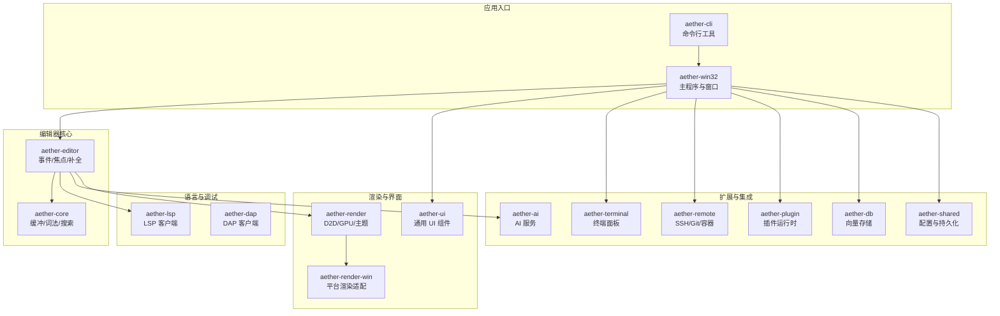
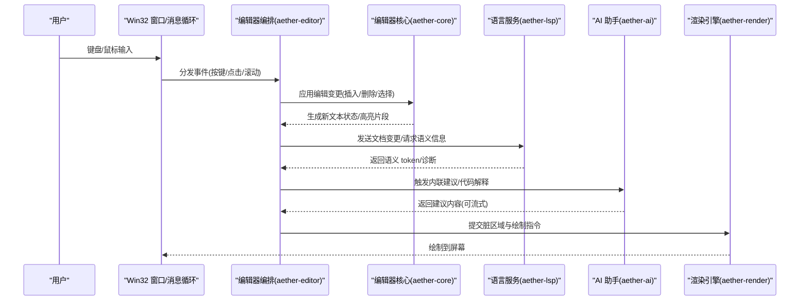
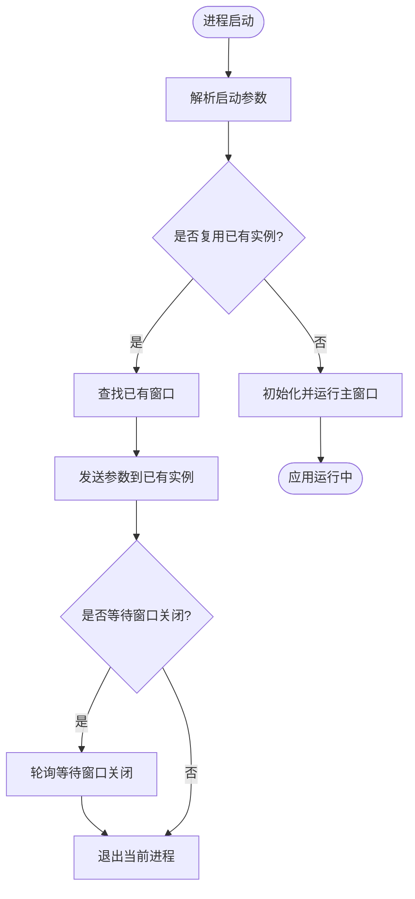
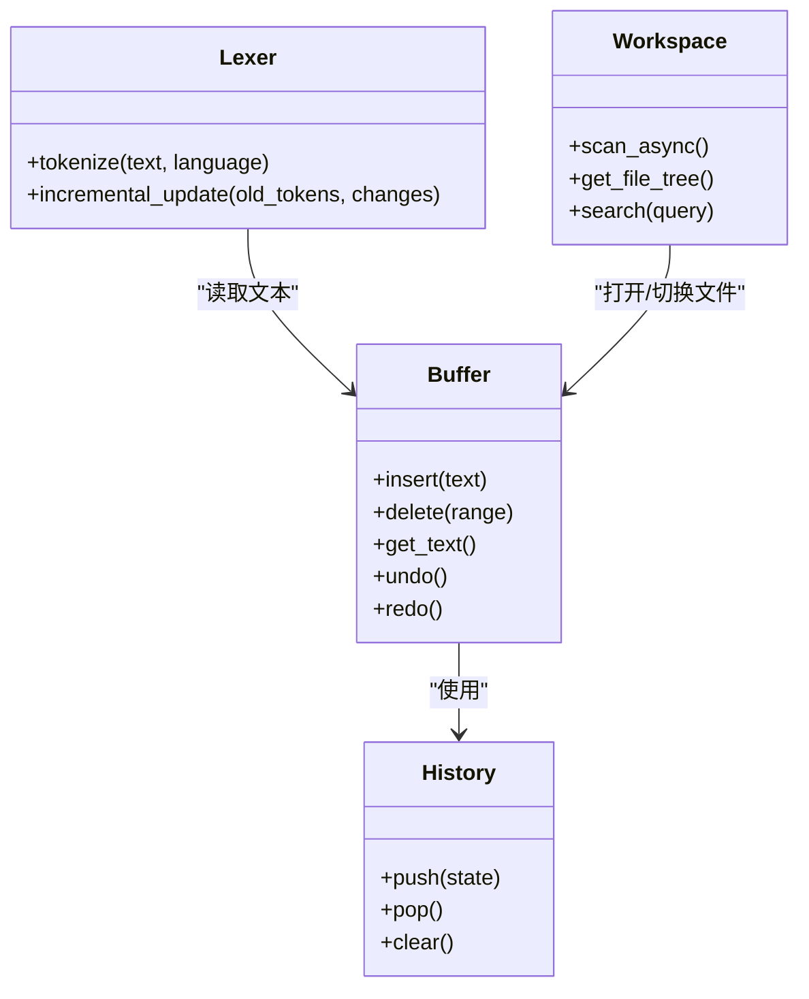
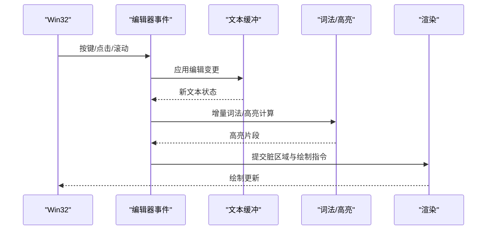
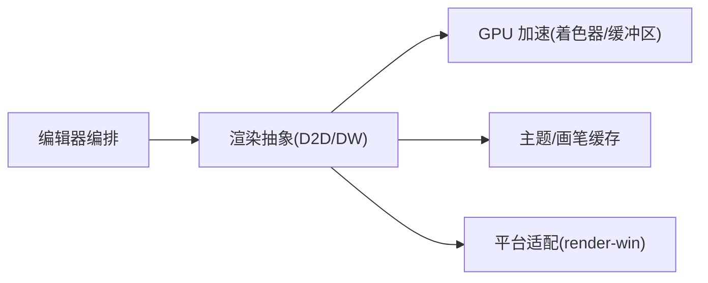
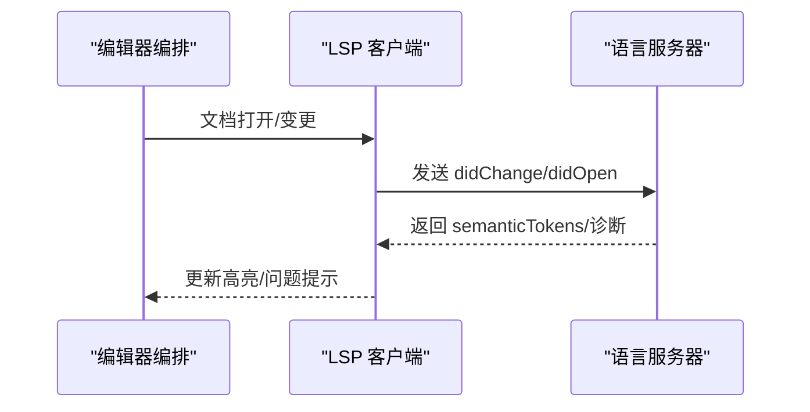
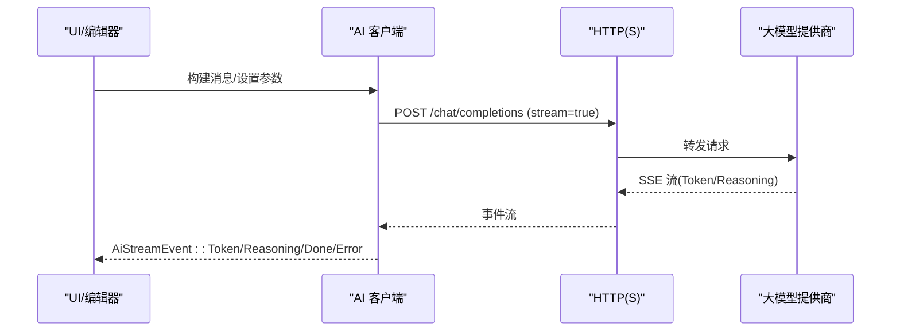
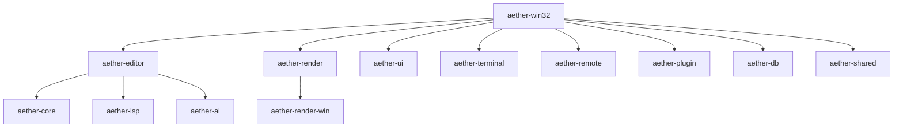

# 整体架构概览

<cite>
**本文引用的文件**
- [Cargo.toml](file://Cargo.toml)
- [README.md](file://README.md)
- [aether-win32/src/main.rs](file://crates/aether-win32/src/main.rs)
- [aether-win32/src/lib.rs](file://crates/aether-win32/src/lib.rs)
- [aether-core/src/lib.rs](file://crates/aether-core/src/lib.rs)
- [aether-editor/src/lib.rs](file://crates/aether-editor/src/lib.rs)
- [aether-render/src/lib.rs](file://crates/aether-render/src/lib.rs)
- [aether-lsp/src/lib.rs](file://crates/aether-lsp/src/lib.rs)
- [aether-shared/src/lib.rs](file://crates/aether-shared/src/lib.rs)
- [aether-ai/src/lib.rs](file://crates/aether-ai/src/lib.rs)
</cite>

## 目录
1. [简介](#简介)
2. [项目结构](#项目结构)
3. [核心组件](#核心组件)
4. [架构总览](#架构总览)
5. [详细组件分析](#详细组件分析)
6. [依赖关系分析](#依赖关系分析)
7. [性能考量](#性能考量)
8. [故障排查指南](#故障排查指南)
9. [结论](#结论)
10. [附录](#附录)

## 简介
本文件为牧羊人编辑器（Aether Studio）的整体架构概览，面向希望快速理解系统设计与运行方式的读者。文档从 Cargo Workspace 的组织方式入手，说明各 crate 的职责边界与协作关系；随后描述应用启动流程、数据与控制流，以及事件驱动模式在 UI 与编辑管线中的体现；最后给出架构图表、关键路径的时序图与流程图，帮助读者建立对系统的整体认知。

## 项目结构
仓库采用 Cargo Workspace 组织，按职责拆分为多个 crate：
- aether-core：文本缓冲、历史栈、词法分析器、工作区数据结构、搜索等编辑器核心能力。
- aether-editor：编辑器核心编排（事件、焦点管理、内联补全、脏矩形等）。
- aether-render：Direct2D/DirectWrite 渲染抽象、主题系统与 GPU 加速相关模块。
- aether-win32：Windows 原生 UI 层（窗口、消息循环、菜单、布局、事件、应用入口）。
- aether-lsp：语言服务器协议客户端（同步、增量同步、语义 token）。
- aether-dap：调试适配器协议客户端基础。
- aether-remote：SSH/Git/容器远程操作抽象。
- aether-ai：AI 服务接口与请求处理（OpenAI 兼容 HTTP 调用、流式响应、安全校验）。
- aether-shared：共享配置与持久化（UI、AI、最近项目、窗口状态等）。
- aether-cli：命令行工具，负责启动 GUI、打开路径、定位行列等。
- aether-terminal：终端面板（ConPTY 子进程）。
- aether-plugin：插件注册、权限控制与运行时基础。
- aether-db：向量数据库与存储（如 HNSW）。
- aether-ui：通用 UI 组件库（活动栏、命令面板、对话框、主题等）。
- aether-render-win：Win32 平台特定的渲染上下文与布局适配。

图表来源
- [Cargo.toml:1-19](file://Cargo.toml#L1-L19)
- [README.md:162-179](file://README.md#L162-L179)

章节来源
- [Cargo.toml:1-19](file://Cargo.toml#L1-L19)
- [README.md:162-179](file://README.md#L162-L179)

## 核心组件
- 编辑器核心（aether-core）：提供 Piece Table 文本缓冲、撤销/重做历史、多语言词法分析、工作区数据结构与搜索能力。
- 编辑器编排（aether-editor）：封装编辑事件、焦点管理、内联补全、脏矩形优化等，协调核心与 UI 交互。
- 渲染引擎（aether-render / aether-render-win）：基于 Direct2D/DirectWrite 的自绘渲染管线，支持主题、画笔缓存与 GPU 加速；平台适配层负责 Win32 渲染上下文。
- 语言服务（aether-lsp / aether-dap）：LSP 客户端实现文档同步、增量同步与语义 token；DAP 客户端提供调试会话基础。
- AI 助手（aether-ai）：OpenAI 兼容 HTTP 调用，支持流式响应、模型列表获取与安全校验（HTTPS、私有 IP 拦截、DNS 二次校验、响应体大小限制）。
- 共享配置（aether-shared）：统一配置与持久化，贯穿 UI、AI、最近项目、窗口状态等。
- 其他：远程开发（aether-remote）、终端面板（aether-terminal）、插件系统（aether-plugin）、向量存储（aether-db）、通用 UI 组件（aether-ui）。

章节来源
- [aether-core/src/lib.rs:1-12](file://crates/aether-core/src/lib.rs#L1-L12)
- [aether-editor/src/lib.rs:1-9](file://crates/aether-editor/src/lib.rs#L1-L9)
- [aether-render/src/lib.rs:1-5](file://crates/aether-render/src/lib.rs#L1-L5)
- [aether-lsp/src/lib.rs:1-16](file://crates/aether-lsp/src/lib.rs#L1-L16)
- [aether-ai/src/lib.rs:1-800](file://crates/aether-ai/src/lib.rs#L1-L800)
- [aether-shared/src/lib.rs:1-3](file://crates/aether-shared/src/lib.rs#L1-L3)

## 架构总览
系统遵循模块化设计、分层架构与事件驱动模式：
- 模块化：每个 crate 聚焦单一职责，通过清晰的公共接口协作。
- 分层：UI 层（Win32 + UI 组件）→ 编辑器编排（事件/焦点/补全）→ 核心能力（缓冲/词法/搜索）→ 外部服务（LSP/DAP/AI/远程/终端/插件/存储）。
- 事件驱动：用户输入经 Win32 消息循环进入编辑器事件系统，触发编辑、语法高亮、LSP 语义更新、AI 建议与渲染刷新。

图表来源
- [aether-win32/src/lib.rs:1-58](file://crates/aether-win32/src/lib.rs#L1-L58)
- [aether-editor/src/lib.rs:1-9](file://crates/aether-editor/src/lib.rs#L1-L9)
- [aether-core/src/lib.rs:1-12](file://crates/aether-core/src/lib.rs#L1-L12)
- [aether-lsp/src/lib.rs:1-16](file://crates/aether-lsp/src/lib.rs#L1-L16)
- [aether-ai/src/lib.rs:1-800](file://crates/aether-ai/src/lib.rs#L1-L800)
- [aether-render/src/lib.rs:1-5](file://crates/aether-render/src/lib.rs#L1-L5)

## 详细组件分析

### 应用启动流程（main.rs → run）
- 解析启动参数，执行单实例控制：若已有实例运行，将参数转发给现有实例并退出或等待窗口关闭。
- 首次实例继续初始化主窗口，进入运行循环。

图表来源
- [aether-win32/src/main.rs:1-52](file://crates/aether-win32/src/main.rs#L1-L52)

章节来源
- [aether-win32/src/main.rs:1-52](file://crates/aether-win32/src/main.rs#L1-L52)

### 编辑器核心（aether-core）
- 文本缓冲与历史：Piece Table 高效编辑，配合历史栈支持撤销/重做。
- 词法分析：多语言 lexer，支持 C/Rust/JS/Python/JSON/TOML/HTML/Markdown 等。
- 工作区与搜索：异步文件扫描、Git 状态标记、全文搜索。
- 渲染准备：为渲染层提供高亮片段与预处理数据。

图表来源
- [aether-core/src/lib.rs:1-12](file://crates/aether-core/src/lib.rs#L1-L12)

章节来源
- [aether-core/src/lib.rs:1-12](file://crates/aether-core/src/lib.rs#L1-L12)

### 编辑器编排（aether-editor）
- 事件系统：统一接收来自 Win32 的输入事件，分发给对应组件。
- 焦点管理：在多视图/面板间维护焦点状态。
- 内联补全：与 LSP/AI 协作，提供行内建议。
- 脏矩形：仅重绘受影响区域，提升渲染效率。

图表来源
- [aether-editor/src/lib.rs:1-9](file://crates/aether-editor/src/lib.rs#L1-L9)
- [aether-core/src/lib.rs:1-12](file://crates/aether-core/src/lib.rs#L1-L12)
- [aether-render/src/lib.rs:1-5](file://crates/aether-render/src/lib.rs#L1-L5)

章节来源
- [aether-editor/src/lib.rs:1-9](file://crates/aether-editor/src/lib.rs#L1-L9)

### 渲染引擎（aether-render / aether-render-win）
- 渲染抽象：Direct2D/DirectWrite 绘制、主题系统、画笔缓存。
- GPU 加速：着色器、缓冲区、视口管理与语言表格。
- 平台适配：Win32 渲染上下文与布局适配。

图表来源
- [aether-render/src/lib.rs:1-5](file://crates/aether-render/src/lib.rs#L1-L5)

章节来源
- [aether-render/src/lib.rs:1-5](file://crates/aether-render/src/lib.rs#L1-L5)

### 语言服务（aether-lsp）
- 客户端：文档同步、增量同步、语义 token 处理。
- 传输与类型：跨进程通信与 LSP 类型定义。
- 重新导出：供下游 crate 直接使用 lsp-types。

图表来源
- [aether-lsp/src/lib.rs:1-16](file://crates/aether-lsp/src/lib.rs#L1-L16)

章节来源
- [aether-lsp/src/lib.rs:1-16](file://crates/aether-lsp/src/lib.rs#L1-L16)

### AI 助手（aether-ai）
- 配置与提供者：DeepSeek/Kimi/自定义，默认 Base URL 与模型清单。
- 安全校验：HTTPS 强制、私有 IP 拦截、DNS 二次校验、响应体大小限制。
- 流式响应：SSE 流式事件，支持 Token/Reasoning/Done/Truncated/Error。
- 错误处理：安全显示错误信息，区分可重试与永久错误。

图表来源
- [aether-ai/src/lib.rs:1-800](file://crates/aether-ai/src/lib.rs#L1-L800)

章节来源
- [aether-ai/src/lib.rs:1-800](file://crates/aether-ai/src/lib.rs#L1-L800)

### 共享配置（aether-shared）
- 启动参数与设置：集中管理 UI、AI、最近项目、窗口状态等配置。
- 持久化：跨进程/重启后恢复用户偏好。

章节来源
- [aether-shared/src/lib.rs:1-3](file://crates/aether-shared/src/lib.rs#L1-L3)

## 依赖关系分析
- 入口与 UI：aether-win32 作为 Windows 原生 UI 层，依赖 aether-editor 进行编辑编排，依赖 aether-render 进行绘制，依赖 aether-ui 提供通用组件。
- 核心能力：aether-editor 依赖 aether-core 提供缓冲/词法/搜索；依赖 aether-lsp 与 aether-ai 提供语言与智能建议。
- 外部服务：aether-remote、aether-terminal、aether-plugin、aether-db 由 UI 层或编辑器编排按需调用。
- 配置：aether-shared 被多处引用以统一配置与持久化。

图表来源
- [Cargo.toml:1-19](file://Cargo.toml#L1-L19)
- [aether-win32/src/lib.rs:1-58](file://crates/aether-win32/src/lib.rs#L1-L58)

章节来源
- [Cargo.toml:1-19](file://Cargo.toml#L1-L19)
- [aether-win32/src/lib.rs:1-58](file://crates/aether-win32/src/lib.rs#L1-L58)

## 性能考量
- 文本编辑：Piece Table 保证 O(1) 插入/删除，适合大规模编辑场景。
- 词法分析：增量更新与 SIMD 优化，减少重复计算。
- 渲染优化：脏矩形与 GPU 加速，降低重绘开销。
- 网络与 I/O：AI 请求限制响应体大小，避免内存膨胀；连接与读超时合理配置，保障长时流式生成稳定性。
- 构建优化：发布构建启用 fat LTO、单代码生成单元与 strip，减小体积并提升性能。

[本节为通用指导，不直接分析具体文件]

## 故障排查指南
- AI 连接失败：检查 HTTPS、API Key、Base URL 与模型名；查看安全错误信息（safe_display），确认是否为可重试错误（429/500/503）。
- 词法/高亮异常：确认语言识别与增量更新是否正确；检查 lexer 配置与主题映射。
- 渲染卡顿：关注脏矩形范围与 GPU 缓冲区使用；必要时降低特效或关闭部分动画。
- LSP 无响应：检查文档同步与增量同步是否正常；查看传输日志与服务器状态。
- 单实例冲突：确认已有实例窗口是否存在；必要时清理残留进程或调整 --wait 行为。

章节来源
- [aether-ai/src/lib.rs:1-800](file://crates/aether-ai/src/lib.rs#L1-L800)
- [aether-win32/src/main.rs:1-52](file://crates/aether-win32/src/main.rs#L1-L52)

## 结论
牧羊人编辑器通过 Cargo Workspace 的多 crate 拆分实现了清晰的职责边界与松耦合协作。以 Win32 为入口、编辑器编排为核心、渲染引擎为输出、语言与 AI 服务为增强，形成稳定的分层架构与事件驱动的数据流。该设计兼顾高性能编辑体验与可扩展性，便于持续迭代与生态集成。

## 附录
- 构建与运行：参考 README 中的构建与运行命令，分别构建 GUI 与 CLI。
- 测试：使用 workspace 单元测试、静态分析与覆盖率收集脚本。
- 文档：内部文档系统覆盖架构、UI、性能、扩展与语言支持等主题。

章节来源
- [README.md:85-159](file://README.md#L85-L159)
- [README.md:258-333](file://README.md#L258-L333)
- [README.md:335-366](file://README.md#L335-L366)