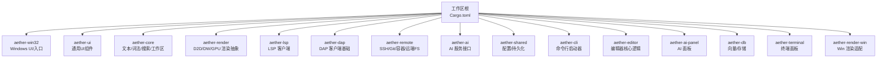
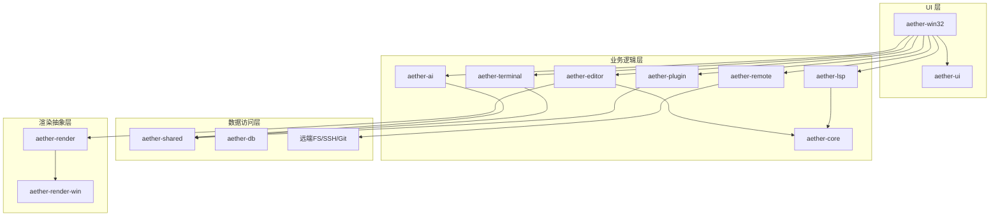
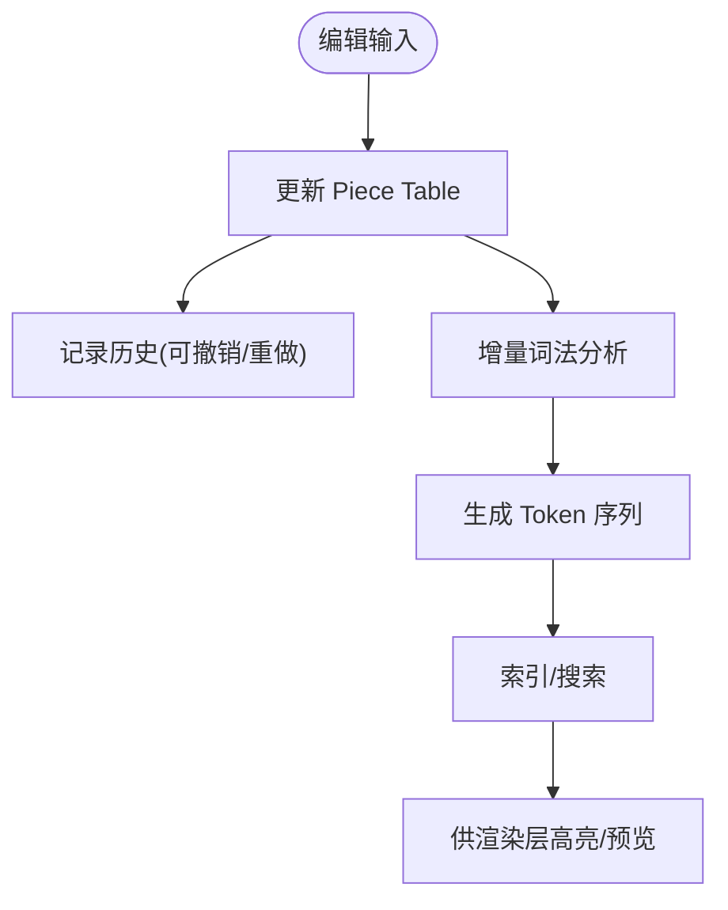
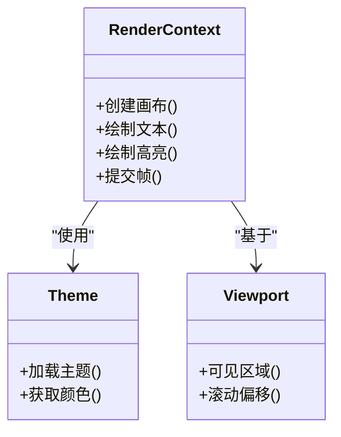
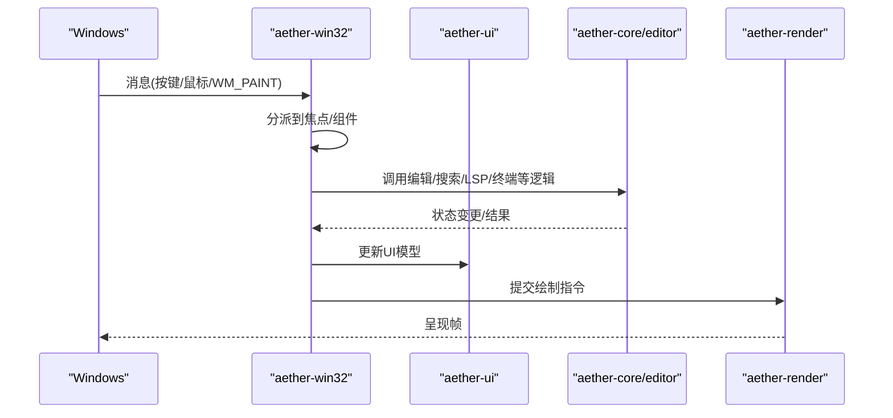
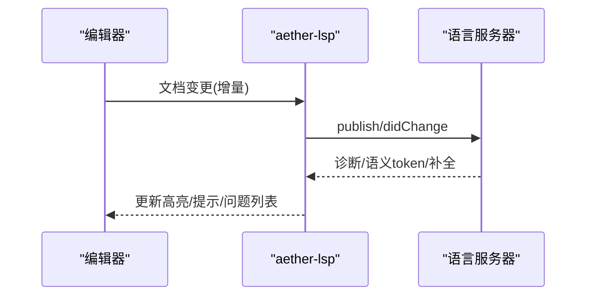
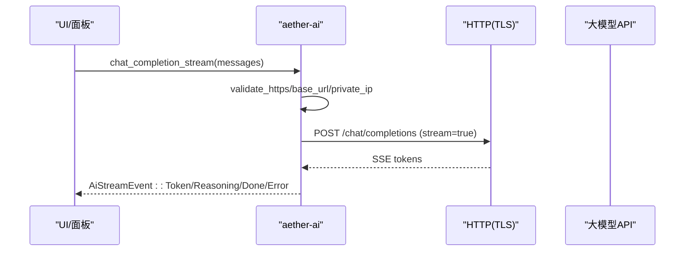
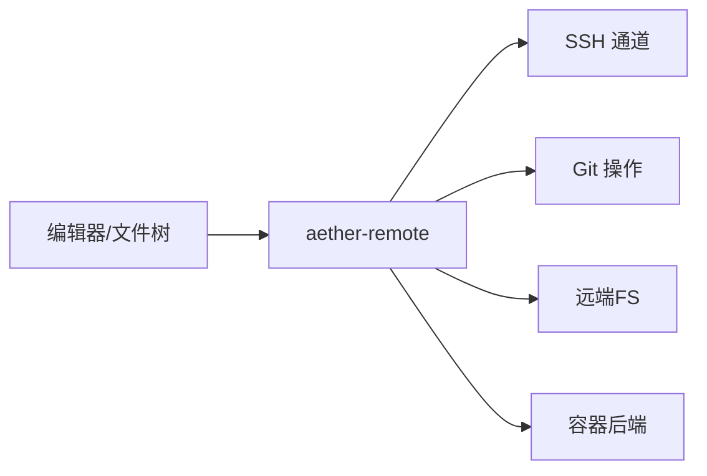
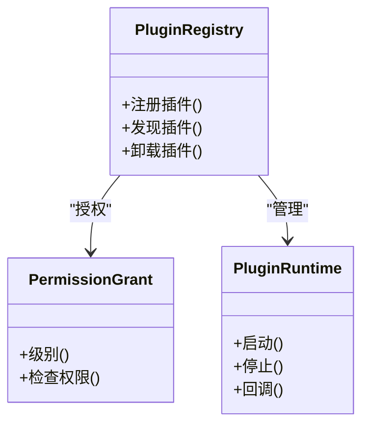
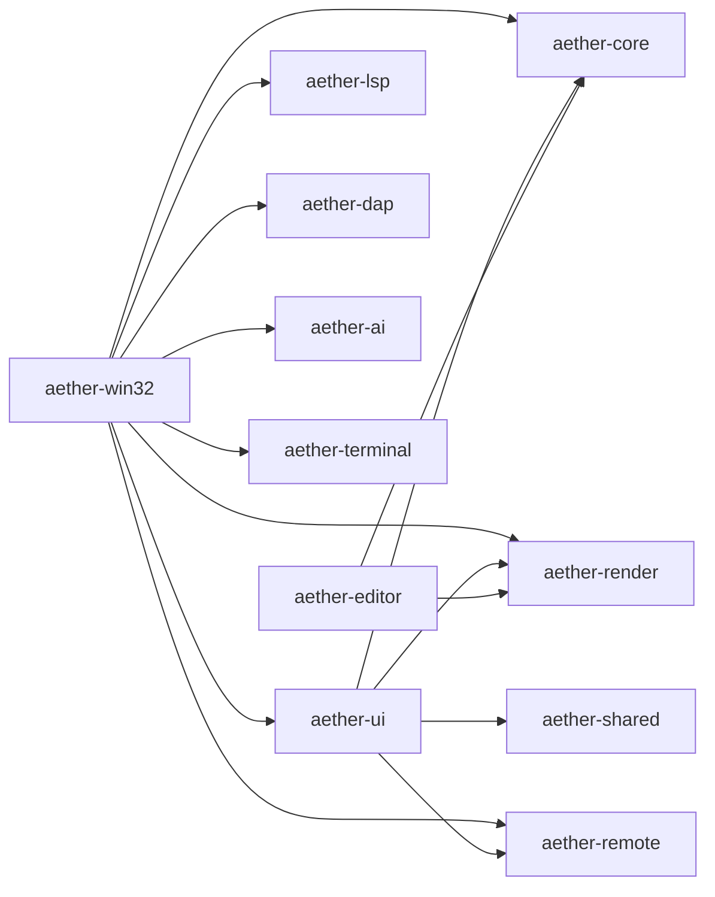

# 架构设计

<cite>
**本文引用的文件**
- [Cargo.toml](file://Cargo.toml)
- [README.md](file://README.md)
- [aether-core/Cargo.toml](file://crates/aether-core/Cargo.toml)
- [aether-core/src/lib.rs](file://crates/aether-core/src/lib.rs)
- [aether-ui/Cargo.toml](file://crates/aether-ui/Cargo.toml)
- [aether-win32/Cargo.toml](file://crates/aether-win32/Cargo.toml)
- [aether-win32/src/lib.rs](file://crates/aether-win32/src/lib.rs)
- [aether-shared/src/lib.rs](file://crates/aether-shared/src/lib.rs)
- [aether-render/src/lib.rs](file://crates/aether-render/src/lib.rs)
- [aether-editor/src/lib.rs](file://crates/aether-editor/src/lib.rs)
- [aether-lsp/src/lib.rs](file://crates/aether-lsp/src/lib.rs)
- [aether-terminal/src/lib.rs](file://crates/aether-terminal/src/lib.rs)
- [aether-remote/src/lib.rs](file://crates/aether-remote/src/lib.rs)
- [aether-plugin/src/lib.rs](file://crates/aether-plugin/src/lib.rs)
- [aether-ai/src/lib.rs](file://crates/aether-ai/src/lib.rs)
</cite>

## 目录
1. [简介](#简介)
2. [项目结构](#项目结构)
3. [核心组件](#核心组件)
4. [架构总览](#架构总览)
5. [详细组件分析](#详细组件分析)
6. [依赖关系分析](#依赖关系分析)
7. [性能考量](#性能考量)
8. [故障排查指南](#故障排查指南)
9. [结论](#结论)
10. [附录](#附录)

## 简介
本架构设计文档面向牧羊人编辑器（Aether Studio）的 Cargo Workspace 多 crate 工程，系统性阐述高层设计、分层职责、事件驱动与消息传递、数据流向、技术决策与权衡、基础设施要求、可扩展性与部署拓扑，以及安全性、监控与灾难恢复等横切关注点。目标是帮助读者快速理解系统边界与扩展点，并为后续演进提供清晰指引。

## 项目结构
仓库采用 Cargo Workspace 组织，按职责拆分为多个 crate：UI 层、渲染抽象层、核心编辑能力、语言服务、调试协议、远程开发、AI 集成、插件运行时、共享配置与 CLI 工具等。顶层 workspace 统一版本、Rust 版本与发布优化策略。



图表来源
- [Cargo.toml:1-19](file://Cargo.toml#L1-L19)

章节来源
- [Cargo.toml:1-37](file://Cargo.toml#L1-L37)
- [README.md:162-179](file://README.md#L162-L179)

## 核心组件
- aether-core：文本缓冲（Piece Table）、历史栈、增量词法分析、多语言词法、工作区数据结构、搜索、SIMD 工具。
- aether-render：Direct2D/DirectWrite/GPU 渲染抽象、主题、画笔缓存、视口与着色器。
- aether-win32：Windows 原生窗口、消息循环、菜单、布局、事件分发、应用入口。
- aether-ui：跨平台 UI 组件集合（活动栏、命令面板、对话框、主题、图标、搜索面板等）。
- aether-editor：编辑器核心逻辑（光标、选择、查找替换、自动保存、事件系统）。
- aether-lsp：语言服务器协议客户端（同步/增量同步、语义 token）。
- aether-dap：调试适配器协议客户端基础（类型、传输、会话、客户端）。
- aether-remote：SSH、Git、容器、远端文件系统与工作区抽象。
- aether-ai：AI 服务接口与请求处理（OpenAI 兼容流式/非流式），含安全校验与错误脱敏。
- aether-shared：共享配置与持久化（设置、启动参数）。
- aether-cli：命令行启动器，解析参数并启动 GUI。
- aether-terminal：终端面板（ConPTY、输出缓冲、Agent 命令回环）。
- aether-plugin：插件注册、权限控制与运行时。
- aether-db：向量索引与存储（HNSW、持久化）。
- aether-render-win：Win 平台渲染适配。

章节来源
- [aether-core/src/lib.rs:1-12](file://crates/aether-core/src/lib.rs#L1-L12)
- [aether-render/src/lib.rs:1-5](file://crates/aether-render/src/lib.rs#L1-L5)
- [aether-win32/src/lib.rs:1-58](file://crates/aether-win32/src/lib.rs#L1-L58)
- [aether-editor/src/lib.rs:1-9](file://crates/aether-editor/src/lib.rs#L1-L9)
- [aether-lsp/src/lib.rs:1-16](file://crates/aether-lsp/src/lib.rs#L1-L16)
- [aether-terminal/src/lib.rs:1-8](file://crates/aether-terminal/src/lib.rs#L1-L8)
- [aether-remote/src/lib.rs:1-18](file://crates/aether-remote/src/lib.rs#L1-L18)
- [aether-ai/src/lib.rs:1-800](file://crates/aether-ai/src/lib.rs#L1-L800)
- [aether-shared/src/lib.rs:1-3](file://crates/aether-shared/src/lib.rs#L1-L3)
- [aether-plugin/src/lib.rs:1-8](file://crates/aether-plugin/src/lib.rs#L1-L8)

## 架构总览
系统采用分层与模块化结合的设计：
- UI 层：aether-win32 + aether-ui，负责窗口、消息、布局、交互与展示。
- 业务逻辑层：aether-editor + aether-core + aether-lsp + aether-remote + aether-ai + aether-terminal + aether-plugin，封装编辑、语言服务、远程、AI、终端与插件能力。
- 数据访问层：aether-core（本地文件/内存）、aether-remote（远端 FS/Git/容器）、aether-db（向量/持久化）、aether-shared（配置持久化）。
- 渲染抽象层：aether-render + aether-render-win，屏蔽平台差异，提供主题与绘制原语。



图表来源
- [aether-win32/Cargo.toml:14-23](file://crates/aether-win32/Cargo.toml#L14-L23)
- [aether-ui/Cargo.toml:6-10](file://crates/aether-ui/Cargo.toml#L6-L10)
- [aether-editor/src/lib.rs:1-9](file://crates/aether-editor/src/lib.rs#L1-L9)
- [aether-core/src/lib.rs:1-12](file://crates/aether-core/src/lib.rs#L1-L12)
- [aether-lsp/src/lib.rs:1-16](file://crates/aether-lsp/src/lib.rs#L1-L16)
- [aether-remote/src/lib.rs:1-18](file://crates/aether-remote/src/lib.rs#L1-L18)
- [aether-ai/src/lib.rs:1-800](file://crates/aether-ai/src/lib.rs#L1-L800)
- [aether-terminal/src/lib.rs:1-8](file://crates/aether-terminal/src/lib.rs#L1-L8)
- [aether-plugin/src/lib.rs:1-8](file://crates/aether-plugin/src/lib.rs#L1-L8)
- [aether-shared/src/lib.rs:1-3](file://crates/aether-shared/src/lib.rs#L1-L3)
- [aether-render/src/lib.rs:1-5](file://crates/aether-render/src/lib.rs#L1-L5)

## 详细组件分析

### 文本与词法引擎（aether-core）
- 职责：维护高性能文本缓冲（Piece Table）、撤销/重做历史、增量词法分析、多语言词法、工作区数据结构与搜索。
- 关键模块：buffer、lexer、incremental_lexer、workspace、search、persistent_history、simd_utils。
- 复杂度与优化：使用 SIMD 加速扫描；增量更新减少重算；并行遍历（rayon）提升大目录扫描效率。
- 依赖：memmap2、memchr、bytecount、smallvec、regex、walkdir。



图表来源
- [aether-core/src/lib.rs:1-12](file://crates/aether-core/src/lib.rs#L1-L12)
- [aether-core/Cargo.toml:6-17](file://crates/aether-core/Cargo.toml#L6-L17)

章节来源
- [aether-core/src/lib.rs:1-12](file://crates/aether-core/src/lib.rs#L1-L12)
- [aether-core/Cargo.toml:1-22](file://crates/aether-core/Cargo.toml#L1-L22)

### 渲染子系统（aether-render / aether-render-win）
- 职责：提供 Direct2D/DirectWrite/GPU 渲染抽象、主题系统、画笔缓存、视口管理、着色器与语法高亮管线。
- Win 适配：aether-render-win 将渲染上下文与布局映射到 Win32 窗口。
- 优化：脏矩形、GPU 加速、缓存重用。



图表来源
- [aether-render/src/lib.rs:1-5](file://crates/aether-render/src/lib.rs#L1-L5)

章节来源
- [aether-render/src/lib.rs:1-5](file://crates/aether-render/src/lib.rs#L1-L5)

### Windows UI 与事件分发（aether-win32）
- 职责：窗口生命周期、消息循环、菜单、布局、事件分发、应用入口。
- 子模块：editor、tabs、terminal、ai_panel、command_palette、dialogs、status_bar、menu_bar、theme、window 等。
- 事件流：捕获键盘/鼠标/IME 事件，路由至焦点管理器与对应组件，触发业务逻辑并刷新渲染。



图表来源
- [aether-win32/src/lib.rs:1-58](file://crates/aether-win32/src/lib.rs#L1-L58)
- [aether-win32/Cargo.toml:14-23](file://crates/aether-win32/Cargo.toml#L14-L23)

章节来源
- [aether-win32/src/lib.rs:1-58](file://crates/aether-win32/src/lib.rs#L1-L58)
- [aether-win32/Cargo.toml:1-44](file://crates/aether-win32/Cargo.toml#L1-L44)

### 语言服务（aether-lsp）
- 职责：LSP 客户端实现，包括文档同步、增量同步、语义 token 处理、传输与类型定义。
- 与编辑器协作：接收编辑变更，转换为 LSP 文档事件，上报语言服务器，并将诊断/高亮/补全等信息回写 UI。



图表来源
- [aether-lsp/src/lib.rs:1-16](file://crates/aether-lsp/src/lib.rs#L1-L16)

章节来源
- [aether-lsp/src/lib.rs:1-16](file://crates/aether-lsp/src/lib.rs#L1-L16)

### AI 服务与安全（aether-ai）
- 职责：AI 提供商抽象（DeepSeek/Kimi/Custom）、OpenAI 兼容接口、流式与非流式响应、模型列表查询、连接测试。
- 安全机制：HTTPS 强制、禁用自动重定向、私有/保留 IP 黑名单、DNS 解析后二次校验（TOCTOU 防护）、云元数据端点拦截、响应体大小限制、错误信息脱敏。
- 错误分类：可重试（429/500/503）与永久错误（4xx/422），便于 UI 提示与重试策略。



图表来源
- [aether-ai/src/lib.rs:1-800](file://crates/aether-ai/src/lib.rs#L1-L800)

章节来源
- [aether-ai/src/lib.rs:1-800](file://crates/aether-ai/src/lib.rs#L1-L800)

### 终端面板（aether-terminal）
- 职责：通过 ConPTY 与 PowerShell/CMD 子进程通信，维护输出缓冲、滚动与 Agent 命令回环。
- 与 UI 协作：接收用户输入，转发至 PTY，渲染输出并支持交互。

```mermaid
flowchart TD
Input["用户输入"] --> Term["TerminalPanel"]
Term --> PTY["ConPTY"]
PTY --> Shell["PowerShell/CMD"]
Shell --> > Term["输出流"]
Term --> > UI["渲染到界面"]
```

图表来源
- [aether-terminal/src/lib.rs:1-8](file://crates/aether-terminal/src/lib.rs#L1-L8)

章节来源
- [aether-terminal/src/lib.rs:1-8](file://crates/aether-terminal/src/lib.rs#L1-L8)

### 远程开发与工作区（aether-remote）
- 职责：SSH 连接、远端文件系统、Git 操作、容器后端、远端工作区抽象。
- 与编辑器协作：透明地读写远端文件，同步 Git 状态，支持克隆与浏览。



图表来源
- [aether-remote/src/lib.rs:1-18](file://crates/aether-remote/src/lib.rs#L1-L18)

章节来源
- [aether-remote/src/lib.rs:1-18](file://crates/aether-remote/src/lib.rs#L1-L18)

### 插件系统（aether-plugin）
- 职责：插件注册表、权限模型、运行时沙箱与生命周期管理。
- 与 UI/核心协作：在权限约束下暴露有限 API 给插件，隔离执行环境。



图表来源
- [aether-plugin/src/lib.rs:1-8](file://crates/aether-plugin/src/lib.rs#L1-L8)

章节来源
- [aether-plugin/src/lib.rs:1-8](file://crates/aether-plugin/src/lib.rs#L1-L8)

### 共享配置与持久化（aether-shared）
- 职责：应用设置、启动参数、最近项目、窗口状态等配置的序列化与读取。
- 被多模块消费：UI、AI、CLI、终端、远程等。

章节来源
- [aether-shared/src/lib.rs:1-3](file://crates/aether-shared/src/lib.rs#L1-L3)

## 依赖关系分析
- 顶层 workspace 声明所有成员 crate，统一版本与发布优化（fat LTO、单代码生成单元、strip）。
- aether-win32 作为 GUI 二进制入口，依赖 UI、核心、渲染、LSP、DAP、AI、远程、终端、共享等。
- aether-ui 依赖 core、render、shared、remote，提供通用 UI 组件。
- aether-editor 聚焦编辑器逻辑，依赖 core 与 render。
- aether-lsp、aether-terminal、aether-remote、aether-ai、aether-plugin 为横向能力，被 UI 或 win32 组合使用。
- aether-shared 为纯配置库，无平台绑定。



图表来源
- [aether-win32/Cargo.toml:14-23](file://crates/aether-win32/Cargo.toml#L14-L23)
- [aether-ui/Cargo.toml:6-10](file://crates/aether-ui/Cargo.toml#L6-L10)
- [aether-editor/src/lib.rs:1-9](file://crates/aether-editor/src/lib.rs#L1-L9)

章节来源
- [Cargo.toml:1-37](file://Cargo.toml#L1-L37)
- [aether-win32/Cargo.toml:1-44](file://crates/aether-win32/Cargo.toml#L1-L44)
- [aether-ui/Cargo.toml:1-23](file://crates/aether-ui/Cargo.toml#L1-L23)

## 性能考量
- 文本编辑：Piece Table 保证高效插入/删除；增量词法避免全量重算；SIMD 加速扫描。
- 渲染：脏矩形、GPU 加速、主题与画笔缓存、视口裁剪。
- 并发：rayon 并行遍历目录；异步 I/O（tokio）用于网络与子进程；流式 AI 响应降低首字节延迟。
- 构建优化：release 配置启用 fat LTO、单代码生成单元、strip，减小体积并提升运行性能。

[本节为通用性能讨论，不直接分析具体文件]

## 故障排查指南
- AI 连接失败：检查 HTTPS、Base URL、API Key 是否设置；查看错误码分类（4xx/5xx）；使用 test_connection_safe 获取脱敏错误信息。
- 词法/高亮异常：确认增量词法与 buffer 更新路径；检查 lexer 配置与语言检测。
- 渲染卡顿：关注脏矩形与 GPU 缓冲区；检查主题资源加载与缓存命中。
- 终端无输出：验证 ConPTY 初始化与子进程存活；检查权限与 PATH。
- 远程连接失败：确认 SSH 配置、密钥与网络可达；检查 Git 可用性与代理设置。

章节来源
- [aether-ai/src/lib.rs:1-800](file://crates/aether-ai/src/lib.rs#L1-L800)

## 结论
牧羊人编辑器通过清晰的层次划分与模块化 crate 设计，实现了高性能文本编辑、自绘渲染、语言服务、远程开发、AI 集成与插件扩展。事件驱动与消息传递贯穿 UI 与业务层，确保低延迟与可维护性。安全与性能在关键路径（AI 网络、渲染、词法）得到重点保障。未来可在插件生态、多语言支持与分布式协作方面继续演进。

## 附录

### 技术栈与第三方依赖
- 语言与工具链：Rust（edition 2021，rust-version 1.70+），MSVC 目标 x86_64-pc-windows-msvc。
- 平台与 UI：Win32、Direct2D/DirectWrite、DWM 深色模式、Webview2（可选）。
- 网络与 AI：ureq（TLS/rustls）、OpenAI 兼容接口、流式 SSE。
- 语言服务：lsp-types、增量同步、语义 token。
- 调试：DAP 客户端基础。
- 远程：SSH、Git、容器后端抽象。
- 终端：ConPTY。
- 构建优化：fat LTO、单代码生成单元、strip。

章节来源
- [Cargo.toml:22-37](file://Cargo.toml#L22-L37)
- [aether-win32/Cargo.toml:24-44](file://crates/aether-win32/Cargo.toml#L24-L44)
- [aether-ui/Cargo.toml:11-23](file://crates/aether-ui/Cargo.toml#L11-L23)
- [aether-core/Cargo.toml:6-17](file://crates/aether-core/Cargo.toml#L6-L17)

### 基础设施要求与部署拓扑
- 操作系统：Windows 10 1809+（推荐 Windows 11）。
- 构建环境：Visual Studio 2022 或 Windows SDK 构建工具；Rust stable 工具链。
- 运行依赖：系统字体与图形驱动；可选 Webview2 运行时。
- 部署形态：桌面应用（aether-app.exe）；CLI（aether.exe）用于快捷启动与参数传递。

章节来源
- [README.md:85-125](file://README.md#L85-L125)
- [aether-win32/Cargo.toml:6-12](file://crates/aether-win32/Cargo.toml#L6-L12)

### 可扩展性考虑
- 插件体系：通过 aether-plugin 提供权限与运行时，逐步开放更多 API。
- 语言支持：新增 lexer 与 LSP 配置即可扩展新语言。
- 渲染后端：aether-render 抽象允许未来引入其他 GPU/2D 后端。
- 远程能力：容器与远端 FS 抽象便于接入多种后端。

[本节为概念性内容，不直接分析具体文件]

### 安全性、监控与灾难恢复
- 安全性：
  - AI 请求强制 HTTPS、禁用自动重定向、私有/保留 IP 与云元数据端点拦截、DNS 解析后二次校验、响应体大小限制、错误信息脱敏。
  - 插件权限模型与沙箱隔离。
- 监控：
  - 使用 tracing/tracing-subscriber 进行结构化日志；可按环境过滤与时间戳。
- 灾难恢复：
  - 历史栈与持久化配置支持崩溃恢复；自动保存与最近项目恢复；远程连接失败重试与降级策略。

章节来源
- [aether-ai/src/lib.rs:1-800](file://crates/aether-ai/src/lib.rs#L1-L800)
- [aether-ui/Cargo.toml:13-15](file://crates/aether-ui/Cargo.toml#L13-L15)
- [aether-win32/Cargo.toml:28-30](file://crates/aether-win32/Cargo.toml#L28-L30)