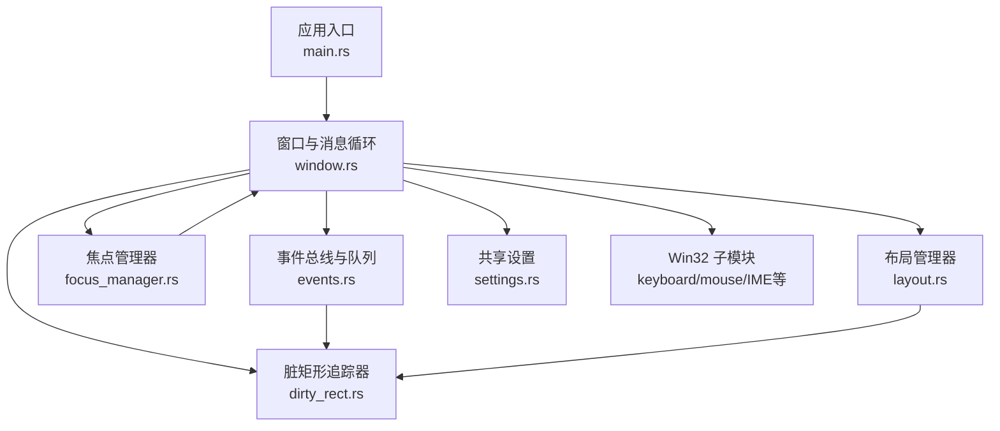
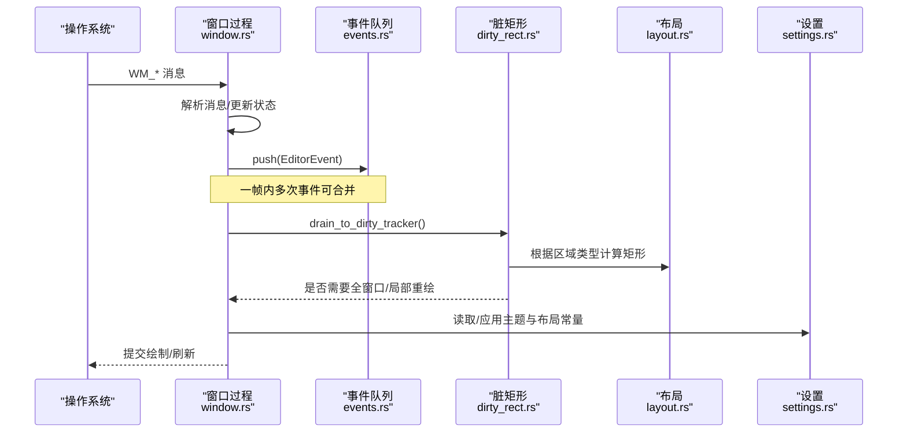
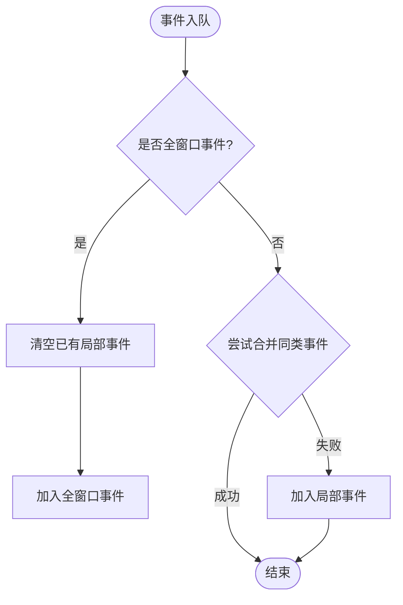
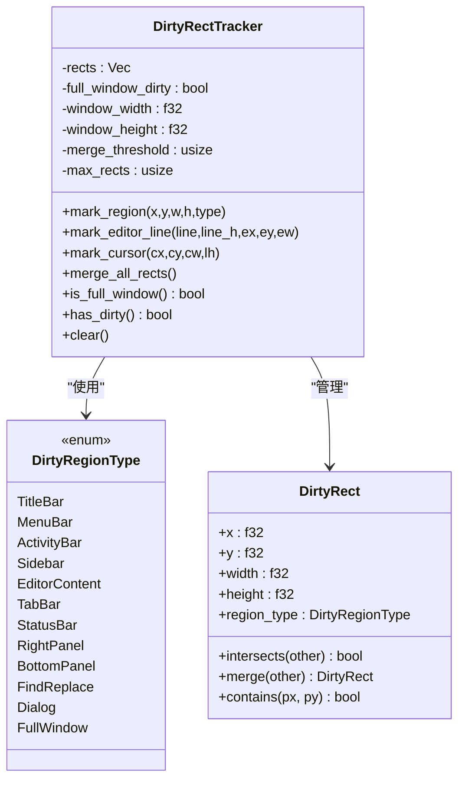
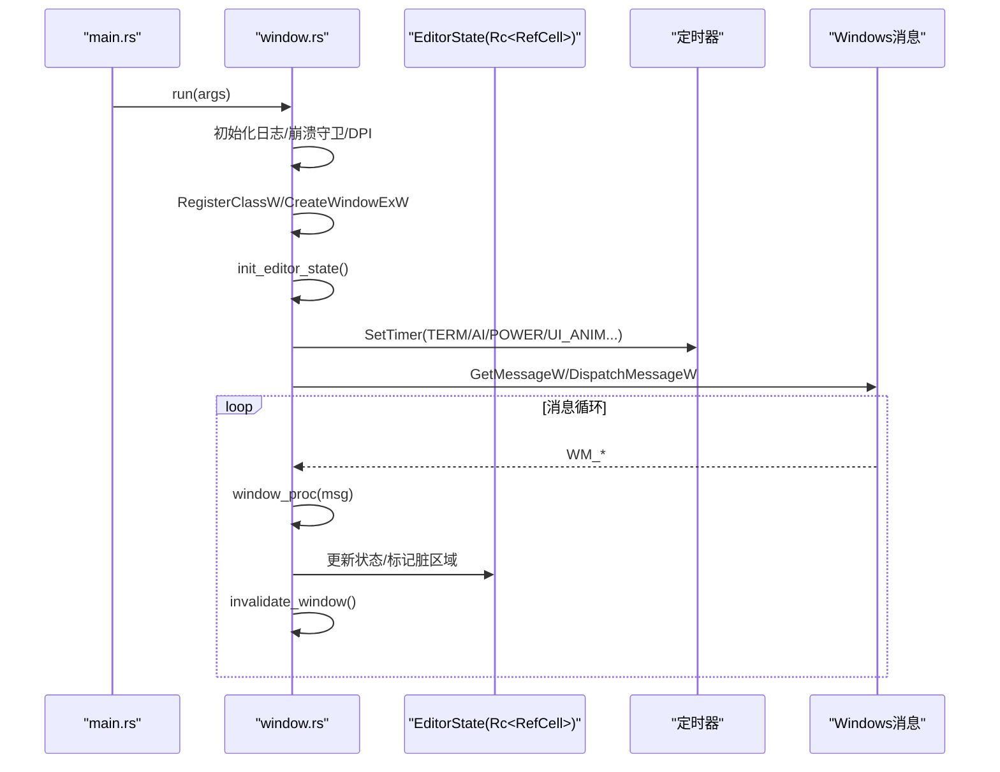
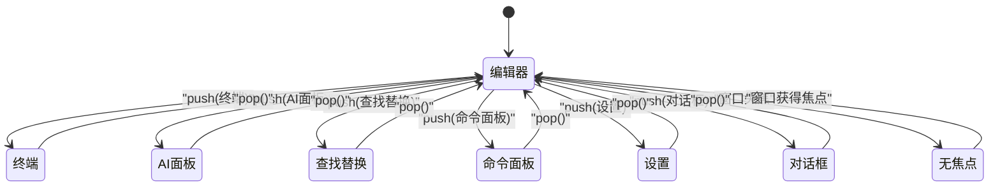
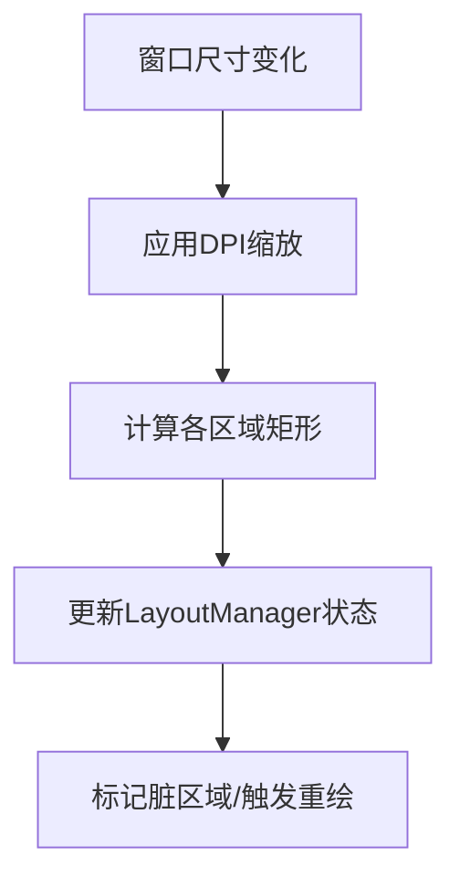
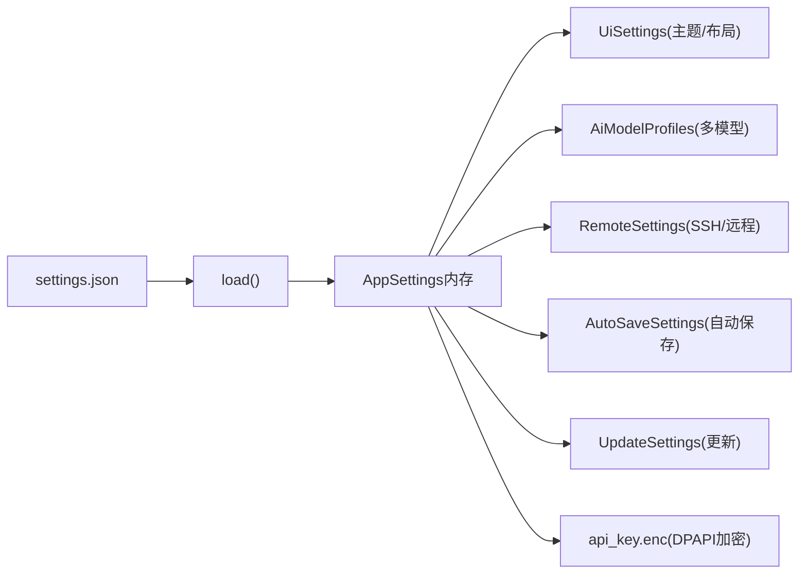
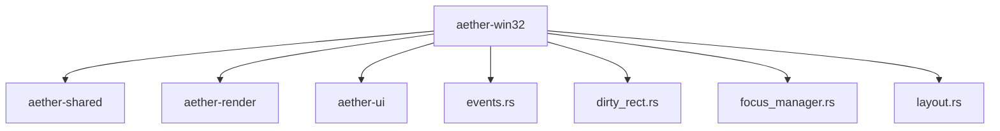

# 组件交互机制

<cite>
**本文引用的文件**
- [main.rs](file://crates/aether-win32/src/main.rs)
- [window.rs](file://crates/aether-win32/src/window.rs)
- [events.rs](file://crates/aether-win32/src/events.rs)
- [dirty_rect.rs](file://crates/aether-win32/src/dirty_rect.rs)
- [focus_manager.rs](file://crates/aether-win32/src/focus_manager.rs)
- [layout.rs](file://crates/aether-win32/src/layout.rs)
- [settings.rs](file://crates/aether-shared/src/settings.rs)
- [lib.rs (aether-win32)](file://crates/aether-win32/src/lib.rs)
- [lib.rs (aether-ui)](file://crates/aether-ui/src/lib.rs)
</cite>

## 目录
1. [简介](#简介)
2. [项目结构](#项目结构)
3. [核心组件](#核心组件)
4. [架构总览](#架构总览)
5. [详细组件分析](#详细组件分析)
6. [依赖关系分析](#依赖关系分析)
7. [性能考量](#性能考量)
8. [故障排查指南](#故障排查指南)
9. [结论](#结论)
10. [附录](#附录)

## 简介
本文件面向牧羊人编辑器的“组件交互机制”，聚焦以下目标：
- 说明各组件间的通信方式：直接调用、事件发布/订阅、消息队列与定时器驱动。
- 文档化 UI 组件生命周期管理：创建、更新、销毁过程中的状态同步与渲染触发。
- 解释跨组件状态共享：全局设置、用户偏好与运行时状态的传播路径。
- 说明解耦设计：接口抽象、依赖注入（通过窗口用户数据）与回调机制。
- 分析性能优化：批量更新、增量计算、懒加载与脏矩形合并。
- 文档化错误处理与异常传播：FFI 边界保护、崩溃守卫与降级策略。
- 提供时序图与状态同步流程图，帮助理解关键流程。

## 项目结构
仓库采用 Cargo Workspace 组织，UI 与编辑器相关逻辑主要分布在 aether-win32 与 aether-ui 两个 crate；共享配置在 aether-shared；渲染抽象在 aether-render。

图表来源
- [main.rs:1-52](file://crates/aether-win32/src/main.rs#L1-L52)
- [window.rs:132-204](file://crates/aether-win32/src/window.rs#L132-L204)
- [events.rs:1-186](file://crates/aether-win32/src/events.rs#L1-L186)
- [dirty_rect.rs:1-112](file://crates/aether-win32/src/dirty_rect.rs#L1-L112)
- [focus_manager.rs:1-122](file://crates/aether-win32/src/focus_manager.rs#L1-L122)
- [layout.rs:237-337](file://crates/aether-win32/src/layout.rs#L237-L337)
- [settings.rs:329-453](file://crates/aether-shared/src/settings.rs#L329-L453)

章节来源
- [main.rs:1-52](file://crates/aether-win32/src/main.rs#L1-L52)
- [lib.rs (aether-win32):1-58](file://crates/aether-win32/src/lib.rs#L1-L58)
- [lib.rs (aether-ui):1-34](file://crates/aether-ui/src/lib.rs#L1-L34)

## 核心组件
- 窗口与消息循环（window.rs）：负责 Win32 窗口创建、消息分发、定时器调度、活跃状态线程局部存储、失效重绘标记。
- 事件总线与队列（events.rs）：定义 EditorEvent、EventQueue，实现一帧内事件合并与批量下推到脏矩形追踪器。
- 脏矩形追踪器（dirty_rect.rs）：记录需要重绘的区域，支持区域类型、全窗口重绘、合并与降级策略。
- 焦点管理器（focus_manager.rs）：统一窗口内面板焦点状态，维护历史栈以支持回退。
- 布局管理器（layout.rs）：计算标题栏、活动栏、侧边栏、编辑器、右侧/底部面板、状态栏的几何区域与可见性。
- 共享设置（settings.rs）：AppSettings、UiSettings、AiSettings 等持久化配置，提供 active_ai_settings 等访问方法。

章节来源
- [window.rs:73-128](file://crates/aether-win32/src/window.rs#L73-L128)
- [events.rs:9-186](file://crates/aether-win32/src/events.rs#L9-L186)
- [dirty_rect.rs:8-112](file://crates/aether-win32/src/dirty_rect.rs#L8-L112)
- [focus_manager.rs:10-122](file://crates/aether-win32/src/focus_manager.rs#L10-L122)
- [layout.rs:237-337](file://crates/aether-win32/src/layout.rs#L237-L337)
- [settings.rs:329-453](file://crates/aether-shared/src/settings.rs#L329-L453)

## 架构总览
系统采用“消息驱动 + 事件队列 + 脏矩形”的架构：
- 输入事件（键盘/鼠标/IME）由 window_proc 路由到具体处理器，修改模型或 UI 状态。
- 状态变更产生 EditorEvent，入队 EventQueue，按帧合并同类事件。
- 每帧渲染前将队列 drain 到 DirtyRectTracker，结合 LayoutManager 计算区域坐标，仅重绘受影响区域。
- 全局设置 AppSettings 作为共享配置源，窗口初始化时加载并应用到布局与主题。

图表来源
- [window.rs:355-446](file://crates/aether-win32/src/window.rs#L355-L446)
- [events.rs:66-186](file://crates/aether-win32/src/events.rs#L66-L186)
- [dirty_rect.rs:87-162](file://crates/aether-win32/src/dirty_rect.rs#L87-L162)
- [layout.rs:374-549](file://crates/aether-win32/src/layout.rs#L374-L549)
- [settings.rs:329-453](file://crates/aether-shared/src/settings.rs#L329-L453)

## 详细组件分析

### 事件系统与批量更新（events.rs）
- EditorEvent 枚举定义了文本变化、光标移动、选择变化、滚动、标签页切换、侧边栏/右侧/底部面板变化、状态栏变化、窗口尺寸变化、查找替换变化、对话框可见性变化等。
- EventQueue 实现：
  - push/extend：入队事件，自动合并同类事件（如连续 Scrolled/CursorMoved/SelectionChanged），合并 TextChanged 的行范围。
  - 全窗口事件优先级：WindowResized/DialogVisibilityChanged 会清空已有局部事件并标记 has_full_window。
  - drain_to_dirty_tracker：将事件转换为矩形并应用到 DirtyRectTracker，支持回调函数映射事件到区域。
- 性能特性：
  - 一帧内批量收集与合并，避免重复重绘。
  - 全窗口事件覆盖局部事件，减少无效绘制。

图表来源
- [events.rs:66-186](file://crates/aether-win32/src/events.rs#L66-L186)

章节来源
- [events.rs:9-186](file://crates/aether-win32/src/events.rs#L9-L186)

### 脏矩形追踪与渲染命令（dirty_rect.rs）
- DirtyRegionType 区分标题栏、菜单栏、活动栏、侧边栏、编辑器内容、标签栏、状态栏、右侧/底部面板、查找替换、对话框、全窗口。
- DirtyRectTracker：
  - mark_region/mark_editor_line/mark_cursor/mark_status_bar：标记区域为脏。
  - merge_all_rects：合并重叠矩形，降低绘制次数。
  - 阈值与降级：当脏矩形数量超过阈值或达到上限时，降级为全窗口重绘。
- RenderCommand::infer_from_state：根据状态变化推断最小必要重绘范围（EditorOnly、SidebarOnly、FullRedraw 等）。

图表来源
- [dirty_rect.rs:8-112](file://crates/aether-win32/src/dirty_rect.rs#L8-L112)
- [dirty_rect.rs:120-162](file://crates/aether-win32/src/dirty_rect.rs#L120-L162)
- [dirty_rect.rs:368-426](file://crates/aether-win32/src/dirty_rect.rs#L368-L426)

章节来源
- [dirty_rect.rs:8-112](file://crates/aether-win32/src/dirty_rect.rs#L8-L112)
- [dirty_rect.rs:120-162](file://crates/aether-win32/src/dirty_rect.rs#L120-L162)
- [dirty_rect.rs:368-426](file://crates/aether-win32/src/dirty_rect.rs#L368-L426)

### 窗口生命周期与消息路由（window.rs）
- run(args)：初始化日志、崩溃守卫、DPI 感知、注册窗口类、创建主窗口、应用启动参数、启动更新检查、进入消息循环。
- create_editor_window：恢复窗口位置/大小、启用 DWM Acrylic/Mica、拖拽文件、初始化编辑器状态、安装键盘钩子、启动后台任务定时器。
- init_editor_state：计算 DPI 缩放、应用布局常量、获取客户区尺寸、初始化渲染目标并首次渲染、设置当前活跃状态、安装低层键盘钩子、启动电源/终端/AI 定时器、将状态指针存入 GWLP_USERDATA。
- window_proc：捕获 panic 并回退到默认处理；根据消息类型路由到对应处理器；对输入事件进行空闲计时与冰冻态解冻；从 GWLP_USERDATA 获取并设置当前窗口状态。
- invalidate_window：替代直接 render()，利用 Windows 合并 WM_PAINT 的特性消除双重渲染。

图表来源
- [main.rs:1-52](file://crates/aether-win32/src/main.rs#L1-L52)
- [window.rs:132-204](file://crates/aether-win32/src/window.rs#L132-L204)
- [window.rs:206-338](file://crates/aether-win32/src/window.rs#L206-L338)
- [window.rs:355-446](file://crates/aether-win32/src/window.rs#L355-L446)

章节来源
- [window.rs:132-204](file://crates/aether-win32/src/window.rs#L132-L204)
- [window.rs:206-338](file://crates/aether-win32/src/window.rs#L206-L338)
- [window.rs:355-446](file://crates/aether-win32/src/window.rs#L355-L446)

### 焦点管理与输入路由（focus_manager.rs）
- FocusTarget 枚举标识当前接收键盘输入的面板（编辑器、终端、AI 面板、查找替换、命令面板、设置、对话框、无焦点）。
- FocusManager：
  - current/set/push/pop：维护当前焦点与历史栈，支持回退。
  - on_set_focus/on_kill_focus：响应窗口级焦点变化。
- 与 window.rs 集成：WM_SETFOCUS/WM_KILLFOCUS 消息路由到焦点管理器，确保键盘事件正确路由到目标面板。

图表来源
- [focus_manager.rs:10-122](file://crates/aether-win32/src/focus_manager.rs#L10-L122)

章节来源
- [focus_manager.rs:10-122](file://crates/aether-win32/src/focus_manager.rs#L10-L122)

### 布局与区域计算（layout.rs）
- Region：表示矩形区域，提供 contains/right/bottom 等方法。
- ActivityBarView/SidebarContent：活动栏视图类型与侧边栏内容类型，用于决定显示内容与图标。
- TitlebarButtons：标题栏按钮布局单一事实源，统一计算工具按钮、用户头像、模式切换、前进/后退等位置。
- LayoutManager：
  - 计算各区域：title_bar_region/menu_bar_region/activity_bar_region/sidebar_region/editor_region/tab_bar_region/editor_content_region/right_panel_region/bottom_panel_region/status_bar_region。
  - 调整与动画：resize_sidebar/resize_right_panel/resize_bottom_panel/toggle_sidebar/toggle_right_panel/toggle_bottom_panel，支持侧边栏展开/收起动画。
  - 欢迎页抑制：welcome_sidebar_suppressed/activity_bar_shown，控制欢迎页期间侧边栏与活动栏行为。
  - DPI 缩放：apply_dpi_scale 按比例换算布局常量与用户可调尺寸。

图表来源
- [layout.rs:237-337](file://crates/aether-win32/src/layout.rs#L237-L337)
- [layout.rs:374-549](file://crates/aether-win32/src/layout.rs#L374-L549)

章节来源
- [layout.rs:237-337](file://crates/aether-win32/src/layout.rs#L237-L337)
- [layout.rs:374-549](file://crates/aether-win32/src/layout.rs#L374-L549)

### 跨组件状态共享（settings.rs）
- AppSettings：包含 ui、remote、auto_save、ai_models、active_model_id、update 等字段。
- UiSettings：主题、字体大小、侧边栏可见性、活动栏/菜单栏顺序、窗口位置/尺寸/最大化、最后工作区、AI 面板标签页快照、编辑器模式。
- AiSettings/AiModelProfile：AI 模型配置档案，支持多模型与激活模型选择。
- 持久化：
  - load/save：从 settings.json 加载，原子写入临时文件后 rename。
  - api_key_path：单独 DPAPI 加密存储 API Key，不写入明文到 JSON。
  - persist_last_workspace：独立维护“最后打开的工作区”。
- active_ai_settings：返回当前激活模型的 AI 设置副本，供 AI 面板/运行时调用。

图表来源
- [settings.rs:329-453](file://crates/aether-shared/src/settings.rs#L329-L453)
- [settings.rs:487-559](file://crates/aether-shared/src/settings.rs#L487-L559)

章节来源
- [settings.rs:329-453](file://crates/aether-shared/src/settings.rs#L329-L453)
- [settings.rs:487-559](file://crates/aether-shared/src/settings.rs#L487-L559)

## 依赖关系分析
- aether-win32 依赖 aether-shared（设置）、aether-render（渲染抽象）、Windows SDK（Win32 API）。
- aether-ui 提供通用 UI 组件（菜单、对话框、主题等），被 aether-win32 消费。
- 事件系统与脏矩形追踪形成“状态变更 -> 事件队列 -> 脏区域 -> 渲染”的闭环。
- 焦点管理器与布局管理器协同，确保输入与可视区域的正确映射。

图表来源
- [Cargo.toml:1-19](file://Cargo.toml#L1-L19)
- [lib.rs (aether-win32):1-58](file://crates/aether-win32/src/lib.rs#L1-L58)
- [lib.rs (aether-ui):1-34](file://crates/aether-ui/src/lib.rs#L1-L34)

章节来源
- [Cargo.toml:1-19](file://Cargo.toml#L1-L19)
- [lib.rs (aether-win32):1-58](file://crates/aether-win32/src/lib.rs#L1-L58)
- [lib.rs (aether-ui):1-34](file://crates/aether-ui/src/lib.rs#L1-L34)

## 性能考量
- 批量更新：EventQueue 在一帧内合并同类事件，减少重绘次数。
- 增量计算：DirtyRectTracker 记录并合并脏矩形，避免全量重绘；超过阈值降级为全窗口重绘。
- 懒加载：布局管理器按需计算区域，欢迎页抑制侧边栏渲染；定时器驱动后台任务（终端输出、AI 流式生成）仅在必要时刷新。
- 渲染优化：invalidate_window 利用 Windows 合并 WM_PAINT 的特性；RenderCommand 推断最小必要重绘范围。
- 内存与冻结：电源看门狗检测空闲时长，进入冰冻态释放内存；用户输入立即解冻。

[本节为通用指导，无需特定文件引用]

## 故障排查指南
- FFI 边界保护：window_proc 使用 catch_unwind 包裹，panic 时记录诊断信息并回退到 DefWindowProcW，避免进程崩溃。
- 崩溃守卫：install 安装 SEH 过滤器捕获原生崩溃并写 minidump；mark_clean_exit 正常退出时清理会话哨兵。
- 日志初始化失败：记录警告并写入临时文件以便调试。
- 设置损坏处理：settings.json 解析失败时备份原文件并回退到默认设置。
- 常见问题定位：
  - 重绘闪烁：检查 EventQueue 合并逻辑与 DirtyRectTracker 阈值设置。
  - 焦点错乱：确认 FocusManager 的 push/pop 与 WM_SETFOCUS/WM_KILLFOCUS 路由。
  - 布局错位：验证 LayoutManager 的 DPI 缩放与区域计算。

章节来源
- [window.rs:355-446](file://crates/aether-win32/src/window.rs#L355-L446)
- [settings.rs:389-453](file://crates/aether-shared/src/settings.rs#L389-L453)

## 结论
牧羊人编辑器通过“消息驱动 + 事件队列 + 脏矩形”的架构实现了高效的组件交互与渲染优化。窗口过程负责消息路由与状态更新，事件队列实现批量合并，脏矩形追踪器保证增量重绘，布局管理器提供精确的区域计算，焦点管理器确保输入正确路由，共享设置贯穿全局配置。该设计在保证高性能的同时，提供了良好的解耦性与可维护性。

[本节为总结，无需特定文件引用]

## 附录
- 关键流程时序图与状态同步流程图已在相应章节中提供，便于理解事件传播与渲染触发。
- 建议在实际开发中：
  - 优先使用 EventQueue 推送事件，避免直接调用渲染。
  - 使用 DirtyRectTracker 的专用方法标记区域，减少手工计算错误。
  - 通过 LayoutManager 统一计算区域，避免硬编码坐标。
  - 使用 FocusManager 管理焦点，确保键盘事件路由正确。
  - 通过 AppSettings 读写配置，遵循原子写入与加密存储规范。

[本节为补充说明，无需特定文件引用]