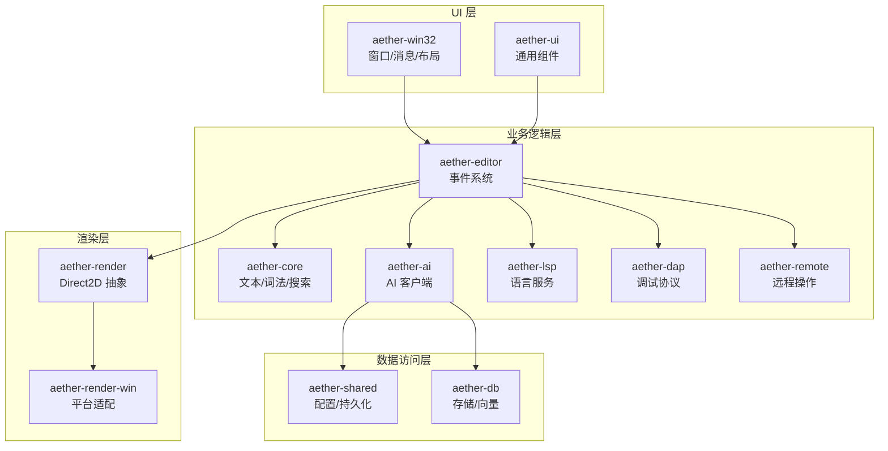
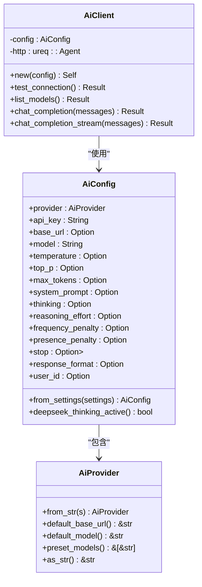
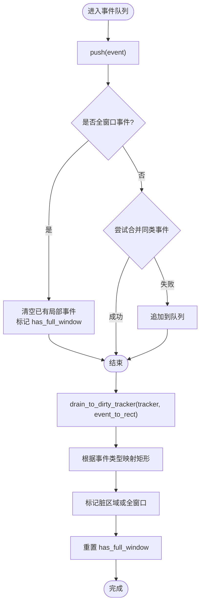
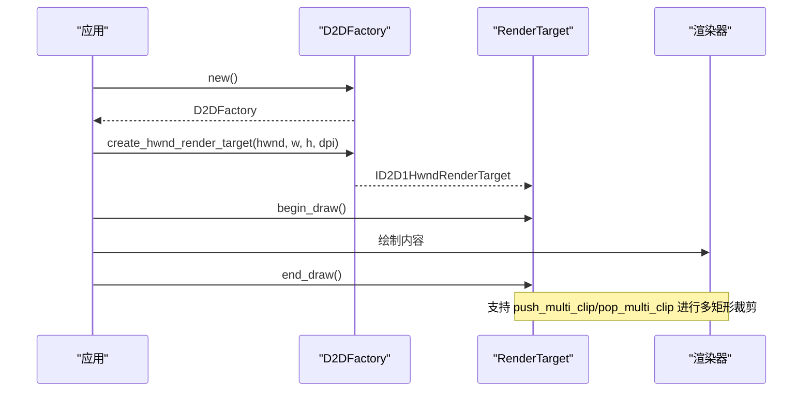
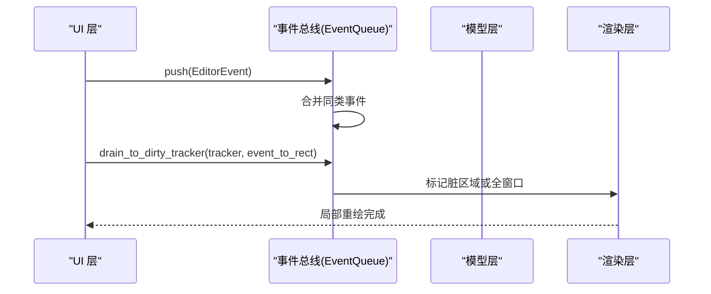
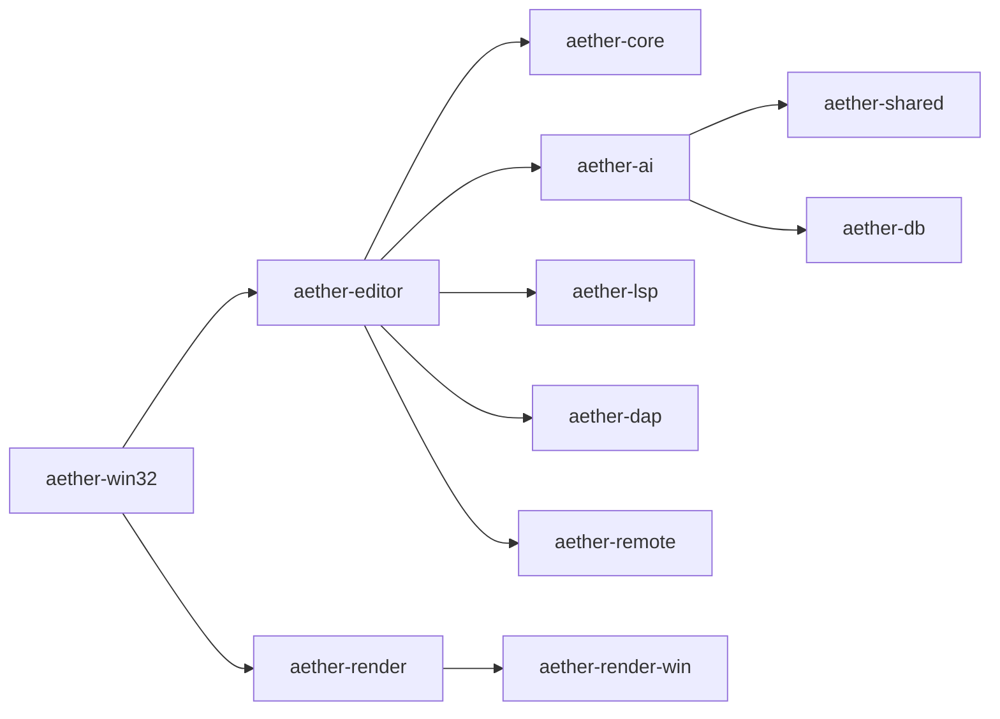

# 设计模式与原则

<cite>
**本文引用的文件**
- [Cargo.toml](file://Cargo.toml)
- [README.md](file://README.md)
- [aether-ai/lib.rs](file://crates/aether-ai/src/lib.rs)
- [aether-plugin/lib.rs](file://crates/aether-plugin/src/lib.rs)
- [aether-plugin/registry.rs](file://crates/aether-plugin/src/registry.rs)
- [aether-editor/events.rs](file://crates/aether-editor/src/events.rs)
- [aether-win32/events.rs](file://crates/aether-win32/src/events.rs)
- [aether-render/d2d/factory.rs](file://crates/aether-render/src/d2d/factory.rs)
- [aether-shared/settings.rs](file://crates/aether-shared/src/settings.rs)
- [aether-win32/settings.rs](file://crates/aether-win32/src/settings.rs)
</cite>

## 目录
1. [简介](#简介)
2. [项目结构](#项目结构)
3. [核心组件](#核心组件)
4. [架构总览](#架构总览)
5. [详细组件分析](#详细组件分析)
6. [依赖关系分析](#依赖关系分析)
7. [性能考量](#性能考量)
8. [故障排查指南](#故障排查指南)
9. [结论](#结论)
10. [附录](#附录)

## 简介
本文件面向牧羊人编辑器（Aether Studio）的设计模式与原则，聚焦以下主题：
- 策略模式：用于 AI 提供商的抽象与切换
- 观察者模式：用于状态变更通知与事件总线
- 工厂模式：用于渲染资源创建与插件生命周期管理
- 分层架构：UI 层、业务逻辑层、数据访问层的职责分离
- 事件驱动架构：消息传递机制、事件总线模式、异步处理
- 模块化设计：单一职责、接口隔离、依赖倒置
- 代码复用与扩展点：如何在不破坏现有功能的前提下扩展能力

## 项目结构
仓库采用 Cargo Workspace 组织，按职责拆分为多个 crate。顶层配置定义了所有成员 crate，便于统一构建与发布。

```mermaid
graph TB
A["工作区根<br/>Cargo.toml"] --> B["aether-core<br/>文本缓冲/词法/搜索"]
A --> C["aether-render<br/>Direct2D/DirectWrite 渲染抽象"]
A --> D["aether-win32<br/>Windows UI/窗口/消息循环"]
A --> E["aether-lsp<br/>语言服务客户端"]
A --> F["aether-dap<br/>调试适配器客户端基础"]
A --> G["aether-remote<br/>远程操作抽象"]
A --> H["aether-ai<br/>AI 服务接口与请求处理"]
A --> I["aether-plugin<br/>插件注册/权限/运行时"]
A --> J["aether-cli<br/>命令行启动器"]
A --> K["aether-shared<br/>共享配置与持久化"]
A --> L["aether-editor<br/>编辑器事件系统"]
A --> M["aether-ai-panel<br/>AI 面板与对话"]
A --> N["aether-db<br/>数据库存储"]
A --> O["aether-terminal<br/>终端面板"]
A --> P["aether-ui<br/>通用 UI 组件"]
A --> Q["aether-render-win<br/>Win 平台渲染适配"]
```

图表来源
- [Cargo.toml:1-19](file://Cargo.toml#L1-L19)

章节来源
- [Cargo.toml:1-19](file://Cargo.toml#L1-L19)
- [README.md:162-179](file://README.md#L162-L179)

## 核心组件
- AI 服务层（aether-ai）：提供统一的 AI 客户端与流式响应事件，封装不同提供商的 OpenAI 兼容接口，并通过配置对象注入参数。
- 插件系统（aether-plugin）：实现插件注册表、钩子订阅与事件分发，支持权限控制与运行时调用。
- 编辑器事件系统（aether-editor / aether-win32）：定义编辑器事件枚举与事件队列，合并同类事件并映射到脏矩形区域，驱动局部重绘。
- 渲染抽象（aether-render）：通过 Direct2D 工厂与渲染目标管理，提供绘制上下文、裁剪与多矩形脏区优化。
- 共享设置（aether-shared / aether-win32）：集中管理 AI 模型档案与运行参数，提供从持久化到运行时的转换。

章节来源
- [aether-ai/lib.rs:16-22](file://crates/aether-ai/src/lib.rs#L16-L22)
- [aether-ai/lib.rs:165-190](file://crates/aether-ai/src/lib.rs#L165-L190)
- [aether-plugin/registry.rs:17-31](file://crates/aether-plugin/src/registry.rs#L17-L31)
- [aether-editor/events.rs:9-36](file://crates/aether-editor/src/events.rs#L9-L36)
- [aether-render/d2d/factory.rs:14-31](file://crates/aether-render/src/d2d/factory.rs#L14-L31)
- [aether-shared/settings.rs:143-155](file://crates/aether-shared/src/settings.rs#L143-L155)
- [aether-win32/settings.rs:199-234](file://crates/aether-win32/src/settings.rs#L199-L234)

## 架构总览
整体采用分层与事件驱动相结合的设计：
- UI 层（aether-win32 / aether-ui）：负责窗口、消息循环、菜单、布局与输入事件；将用户交互转换为编辑器事件。
- 业务逻辑层（aether-core / aether-editor / aether-ai / aether-lsp / aether-dap / aether-remote）：处理文本编辑、语法高亮、AI 请求、语言服务、调试协议与远程操作。
- 数据访问层（aether-db / aether-shared）：负责持久化配置、向量检索与数据存储。
- 渲染层（aether-render / aether-render-win）：基于 Direct2D/DirectWrite 的自绘引擎，支持主题、动画与脏矩形优化。

图表来源
- [aether-editor/events.rs:1-7](file://crates/aether-editor/src/events.rs#L1-L7)
- [aether-ai/lib.rs:259-262](file://crates/aether-ai/src/lib.rs#L259-L262)
- [aether-render/d2d/factory.rs:14-31](file://crates/aether-render/src/d2d/factory.rs#L14-L31)
- [aether-shared/settings.rs:143-155](file://crates/aether-shared/src/settings.rs#L143-L155)

## 详细组件分析

### 策略模式：AI 提供商抽象与切换
- 使用枚举表示不同提供商（DeepSeek、Kimi、Custom），并提供默认 Base URL、默认模型与预设模型清单。
- 通过配置对象 AiConfig 注入提供商、API Key、Base URL、模型名与采样参数等，统一构造请求体。
- 客户端方法对 DeepSeek/Kimi/自定义均走 OpenAI 兼容路径，屏蔽差异，体现“对扩展开放、对修改封闭”。

图表来源
- [aether-ai/lib.rs:16-22](file://crates/aether-ai/src/lib.rs#L16-L22)
- [aether-ai/lib.rs:165-190](file://crates/aether-ai/src/lib.rs#L165-L190)
- [aether-ai/lib.rs:259-262](file://crates/aether-ai/src/lib.rs#L259-L262)

章节来源
- [aether-ai/lib.rs:16-22](file://crates/aether-ai/src/lib.rs#L16-L22)
- [aether-ai/lib.rs:165-190](file://crates/aether-ai/src/lib.rs#L165-L190)
- [aether-ai/lib.rs:259-262](file://crates/aether-ai/src/lib.rs#L259-L262)

### 观察者模式：编辑器事件总线与脏矩形优化
- 定义 EditorEvent 枚举，涵盖文本变化、光标移动、选择变化、滚动、标签页、侧边栏、右侧面板、底部面板、状态栏、窗口尺寸、查找替换、对话框可见性等。
- EventQueue 收集一帧内的事件，自动合并同类事件（如连续滚动、光标移动、选择变化、文本变化行范围合并），并在全窗口事件时清空局部事件。
- 通过 drain_to_dirty_tracker 将事件映射为脏矩形区域，驱动局部重绘，避免重复渲染。

图表来源
- [aether-editor/events.rs:9-36](file://crates/aether-editor/src/events.rs#L9-L36)
- [aether-editor/events.rs:66-186](file://crates/aether-editor/src/events.rs#L66-L186)

章节来源
- [aether-editor/events.rs:9-36](file://crates/aether-editor/src/events.rs#L9-L36)
- [aether-editor/events.rs:66-186](file://crates/aether-editor/src/events.rs#L66-L186)
- [aether-win32/events.rs:9-36](file://crates/aether-win32/src/events.rs#L9-L36)
- [aether-win32/events.rs:66-186](file://crates/aether-win32/src/events.rs#L66-L186)

### 工厂模式：渲染资源与插件生命周期
- 渲染工厂（D2DFactory）：封装 Direct2D 工厂创建与渲染目标管理，提供 HWND 渲染目标创建、尺寸调整、DPI 更新与多矩形裁剪。
- 插件注册表（PluginRegistry）：管理插件加载、卸载、钩子订阅与事件分发，结合权限控制与运行时调用，形成插件工厂与事件总线。

图表来源
- [aether-render/d2d/factory.rs:14-31](file://crates/aether-render/src/d2d/factory.rs#L14-L31)
- [aether-render/d2d/factory.rs:33-63](file://crates/aether-render/src/d2d/factory.rs#L33-L63)
- [aether-render/d2d/factory.rs:172-273](file://crates/aether-render/src/d2d/factory.rs#L172-L273)

章节来源
- [aether-render/d2d/factory.rs:14-31](file://crates/aether-render/src/d2d/factory.rs#L14-L31)
- [aether-render/d2d/factory.rs:33-63](file://crates/aether-render/src/d2d/factory.rs#L33-L63)
- [aether-render/d2d/factory.rs:172-273](file://crates/aether-render/src/d2d/factory.rs#L172-L273)
- [aether-plugin/registry.rs:17-31](file://crates/aether-plugin/src/registry.rs#L17-L31)
- [aether-plugin/registry.rs:34-91](file://crates/aether-plugin/src/registry.rs#L34-L91)

### 事件驱动架构：消息传递、事件总线与异步处理
- 编辑器事件总线：在 aether-editor 与 aether-win32 中定义 EditorEvent 与 EventQueue，实现事件合并与脏矩形映射，解耦模型与渲染。
- 插件事件总线：在 aether-plugin 中通过 PluginRegistry 的 subscribe/emit 实现钩子机制，支持多订阅者与权限校验。
- 异步处理：AI 客户端使用 mpsc 通道返回流式事件，后台线程发送 Token/Reasoning/Done/Error，UI 层消费事件以增量更新。

图表来源
- [aether-editor/events.rs:66-186](file://crates/aether-editor/src/events.rs#L66-L186)
- [aether-win32/events.rs:66-186](file://crates/aether-win32/src/events.rs#L66-L186)
- [aether-ai/lib.rs:286-299](file://crates/aether-ai/src/lib.rs#L286-L299)

章节来源
- [aether-editor/events.rs:66-186](file://crates/aether-editor/src/events.rs#L66-L186)
- [aether-win32/events.rs:66-186](file://crates/aether-win32/src/events.rs#L66-L186)
- [aether-ai/lib.rs:286-299](file://crates/aether-ai/src/lib.rs#L286-L299)
- [aether-plugin/registry.rs:67-91](file://crates/aether-plugin/src/registry.rs#L67-L91)

### 模块化设计原则：单一职责、接口隔离、依赖倒置
- 单一职责：每个 crate 聚焦特定领域（如 aether-core 专注文本与词法，aether-render 专注渲染抽象，aether-ai 专注 AI 请求）。
- 接口隔离：AI 提供商通过枚举与配置对象暴露最小必要接口；事件系统通过枚举与队列解耦模型与渲染。
- 依赖倒置：高层模块（UI/业务）依赖抽象（事件枚举、配置对象、工厂接口），而非具体实现细节。

章节来源
- [aether-ai/lib.rs:165-190](file://crates/aether-ai/src/lib.rs#L165-L190)
- [aether-editor/events.rs:9-36](file://crates/aether-editor/src/events.rs#L9-L36)
- [aether-render/d2d/factory.rs:14-31](file://crates/aether-render/src/d2d/factory.rs#L14-L31)

### 代码复用与扩展点
- 代码复用：
  - AI 客户端统一走 OpenAI 兼容路径，减少重复实现。
  - 事件队列合并同类事件，避免重复渲染。
  - 渲染工厂封装 Direct2D 资源创建与裁剪，供多处复用。
- 扩展点：
  - 新增 AI 提供商：扩展 AiProvider 枚举与默认配置。
  - 新增编辑器事件：扩展 EditorEvent 枚举与脏区域映射。
  - 新增插件钩子：在 PluginRegistry 中订阅与触发新 hook。

章节来源
- [aether-ai/lib.rs:16-22](file://crates/aether-ai/src/lib.rs#L16-L22)
- [aether-editor/events.rs:9-36](file://crates/aether-editor/src/events.rs#L9-L36)
- [aether-plugin/registry.rs:67-91](file://crates/aether-plugin/src/registry.rs#L67-L91)

## 依赖关系分析
各 crate 之间的依赖关系清晰，遵循分层与职责分离：
- UI 层依赖事件系统与渲染抽象。
- 业务逻辑层依赖 AI、LSP、DAP、Remote 等能力。
- 数据访问层被业务逻辑层引用，提供配置与存储。
- 渲染层独立于 UI 与业务，仅接收绘制指令。

图表来源
- [Cargo.toml:1-19](file://Cargo.toml#L1-L19)
- [README.md:162-179](file://README.md#L162-L179)

章节来源
- [Cargo.toml:1-19](file://Cargo.toml#L1-L19)
- [README.md:162-179](file://README.md#L162-L179)

## 性能考量
- 事件合并：EventQueue 合并连续滚动、光标移动、选择变化与文本变化行范围，减少重绘次数。
- 脏矩形优化：通过 region_type 与 is_full_window 判断，精准标记需要重绘的区域。
- 渲染裁剪：支持单矩形快路径与多矩形几何组裁剪，避免包围盒膨胀导致的额外绘制。
- 流式响应：AI 客户端使用 mpsc 通道分片推送 Token/Reasoning，降低 UI 阻塞。

章节来源
- [aether-editor/events.rs:99-143](file://crates/aether-editor/src/events.rs#L99-L143)
- [aether-render/d2d/factory.rs:172-273](file://crates/aether-render/src/d2d/factory.rs#L172-L273)
- [aether-ai/lib.rs:286-299](file://crates/aether-ai/src/lib.rs#L286-L299)

## 故障排查指南
- AI 错误分类：AiError 提供 safe_display 与重试判断，便于 UI 展示与安全提示。
- 事件队列异常：检查是否有未合并的重复事件或全窗口事件覆盖逻辑是否正确。
- 插件钩子权限：emit 返回结果中包含权限拒绝信息，需检查插件权限配置。

章节来源
- [aether-ai/lib.rs:84-163](file://crates/aether-ai/src/lib.rs#L84-L163)
- [aether-editor/events.rs:84-186](file://crates/aether-editor/src/events.rs#L84-L186)
- [aether-plugin/registry.rs:75-91](file://crates/aether-plugin/src/registry.rs#L75-L91)

## 结论
牧羊人编辑器通过策略模式、观察者模式与工厂模式，实现了可扩展、可维护且高性能的架构。分层设计与事件驱动确保了 UI、业务与数据的清晰边界，模块化原则提升了代码复用与扩展性。未来可在 AI 提供商、编辑器事件与插件钩子方面继续扩展，同时保持现有模式的稳定性与一致性。

## 附录
- 构建与运行：参考 README 中的构建与运行说明。
- 测试：工作区单元测试与 GUI 冒烟测试流程。
- 文档：内部文档系统覆盖架构、核心组件、性能优化与扩展系统。

章节来源
- [README.md:85-118](file://README.md#L85-L118)
- [README.md:127-159](file://README.md#L127-L159)
- [README.md:180-194](file://README.md#L180-L194)