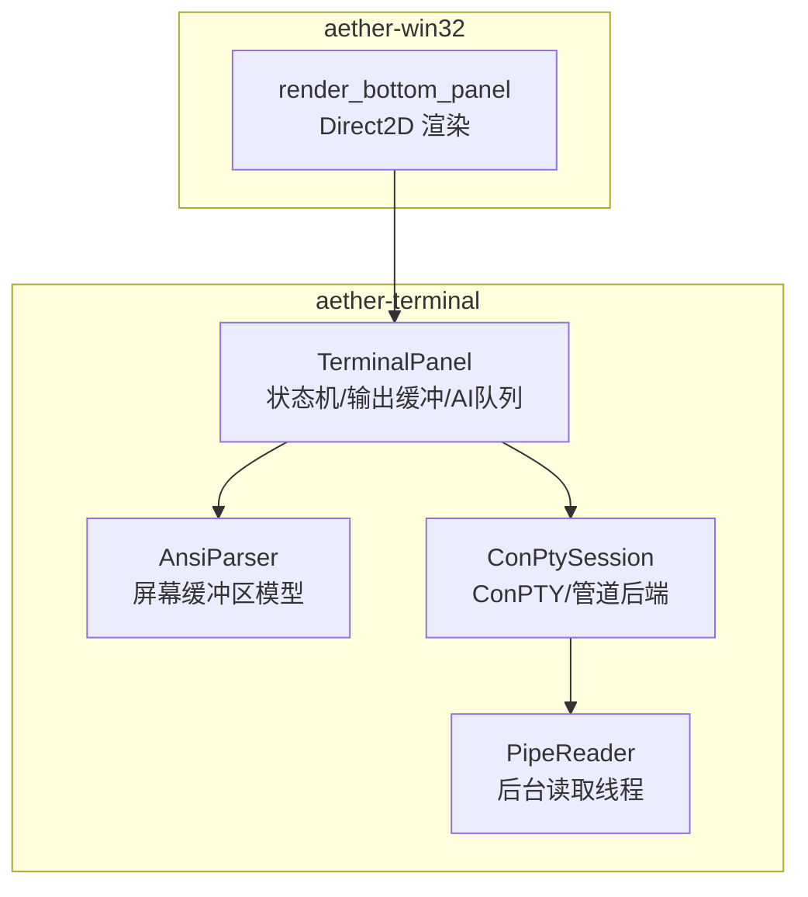
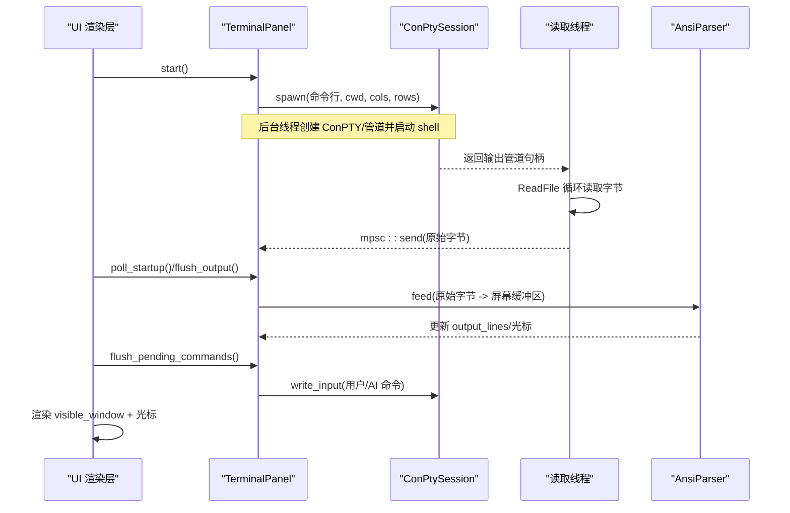
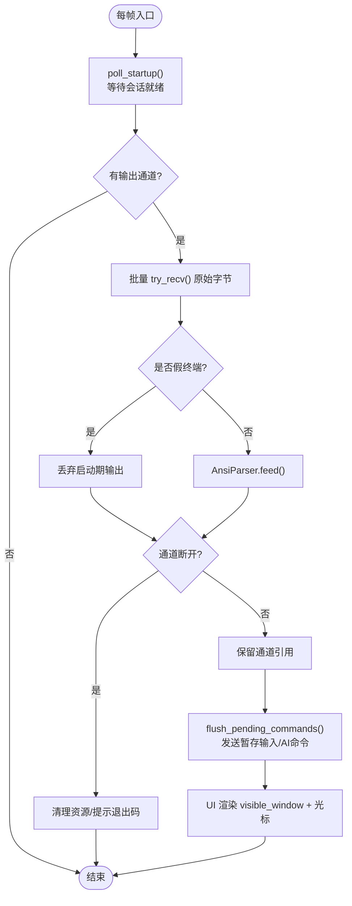
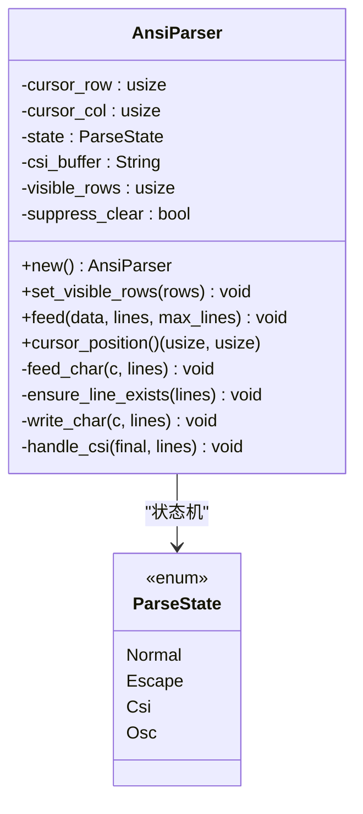
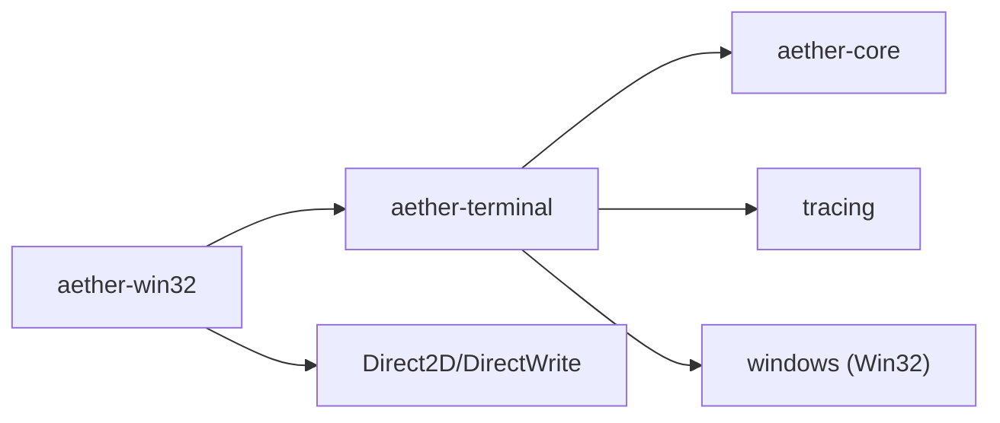

# 终端仿真器

<cite>
**本文引用的文件**
- [crates/aether-terminal/src/lib.rs](file://crates/aether-terminal/src/lib.rs)
- [crates/aether-terminal/src/terminal.rs](file://crates/aether-terminal/src/terminal.rs)
- [crates/aether-terminal/src/conpty.rs](file://crates/aether-terminal/src/conpty.rs)
- [crates/aether-terminal/Cargo.toml](file://crates/aether-terminal/Cargo.toml)
- [crates/aether-win32/src/render/terminal.rs](file://crates/aether-win32/src/render/terminal.rs)
- [README.md](file://README.md)
</cite>

## 目录
1. [简介](#简介)
2. [项目结构](#项目结构)
3. [核心组件](#核心组件)
4. [架构总览](#架构总览)
5. [详细组件分析](#详细组件分析)
6. [依赖关系分析](#依赖关系分析)
7. [性能考量](#性能考量)
8. [故障排查指南](#故障排查指南)
9. [结论](#结论)
10. [附录](#附录)

## 简介
本模块为 Aether Studio（牧羊人编辑器）的“终端仿真器”，提供内嵌同步终端面板，基于 Windows ConPTY（伪控制台）实现真正的交互式 Shell（PowerShell / CMD），支持 ANSI 颜色、方向键、Tab 补全等。当 ConPTY 不可用时自动回退到普通管道模式，保证基本输入输出可用。UI 层通过 Direct2D/DirectWrite 渲染终端内容、光标与滚动提示，并提供假终端占位体验，使真终端启动过程对用户无感。

## 项目结构
终端功能由两个 crate 协作完成：
- aether-terminal：终端内核（会话管理、ANSI 解析、AI Agent 命令队列、假终端占位）。
- aether-win32：Windows UI 集成（底部面板渲染、输入事件转发、尺寸同步）。



图表来源
- [crates/aether-terminal/src/terminal.rs:19-69](file://crates/aether-terminal/src/terminal.rs#L19-L69)
- [crates/aether-terminal/src/conpty.rs:50-57](file://crates/aether-terminal/src/conpty.rs#L50-L57)
- [crates/aether-win32/src/render/terminal.rs:3-12](file://crates/aether-win32/src/render/terminal.rs#L3-L12)

章节来源
- [crates/aether-terminal/src/lib.rs:1-8](file://crates/aether-terminal/src/lib.rs#L1-L8)
- [crates/aether-terminal/Cargo.toml:1-10](file://crates/aether-terminal/Cargo.toml#L1-L10)
- [README.md:221-238](file://README.md#L221-L238)

## 核心组件
- TerminalPanel：终端面板状态机，负责启动/停止、输入发送、输出刷新、滚动、AI Agent 命令队列与哨兵结果收集、假终端占位与无感替换。
- AnsiParser：轻量 ANSI 转义序列解析器，维护虚拟屏幕缓冲区（行缓冲 + 光标行列），处理回车、换行、退格、光标移动、清屏/清行、SGR 颜色剥离、OSC 跳过等。
- ConPtySession：封装子进程生命周期，优先使用 CreatePseudoConsole（ConPTY），失败则回退到匿名管道；提供 write_input、resize、is_alive、exit_code 等能力。
- PipeReader：将 Win32 HANDLE 适配为 std::io::Read，供后台线程持续读取子进程 stdout。
- UI 渲染：在 aether-win32 中计算可见行数与列数，调用 set_size 同步终端尺寸，并绘制背景、标签栏、输出行、光标与滚动提示。

章节来源
- [crates/aether-terminal/src/terminal.rs:19-69](file://crates/aether-terminal/src/terminal.rs#L19-L69)
- [crates/aether-terminal/src/terminal.rs:790-1122](file://crates/aether-terminal/src/terminal.rs#L790-L1122)
- [crates/aether-terminal/src/conpty.rs:50-57](file://crates/aether-terminal/src/conpty.rs#L50-L57)
- [crates/aether-terminal/src/conpty.rs:540-580](file://crates/aether-terminal/src/conpty.rs#L540-L580)
- [crates/aether-win32/src/render/terminal.rs:585-622](file://crates/aether-win32/src/render/terminal.rs#L585-L622)

## 架构总览
终端从 UI 触发启动，后台线程创建 ConPTY/管道并启动 shell；读取线程持续拉取输出并通过通道传回主线程；主线程每帧轮询启动结果、刷新输出、执行 AI Agent 命令队列、更新滚动与光标位置；UI 层根据可见区域计算行列并渲染。



图表来源
- [crates/aether-terminal/src/terminal.rs:170-264](file://crates/aether-terminal/src/terminal.rs#L170-L264)
- [crates/aether-terminal/src/terminal.rs:631-728](file://crates/aether-terminal/src/terminal.rs#L631-L728)
- [crates/aether-terminal/src/conpty.rs:69-132](file://crates/aether-terminal/src/conpty.rs#L69-L132)
- [crates/aether-terminal/src/conpty.rs:540-580](file://crates/aether-terminal/src/conpty.rs#L540-L580)
- [crates/aether-win32/src/render/terminal.rs:585-622](file://crates/aether-win32/src/render/terminal.rs#L585-L622)

## 详细组件分析

### TerminalPanel：状态机与交互流程
- 启动流程：检测默认 shell（优先 pwsh/powershell，其次 cmd），构建命令行，异步启动 ConPTY/管道，进入假终端模式立即显示模拟提示符，后台线程创建读取线程。
- 启动结果轮询：poll_startup 接收会话与输出通道，记录启动时间用于抑制初始清屏序列。
- 输出刷新：flush_output 非阻塞批量接收原始字节，在假终端模式下丢弃启动期无关输出；否则交给 AnsiParser 更新屏幕缓冲区；若通道断开则清理资源并提示退出码。
- 输入发送：统一通过 send_bytes 写入子进程 stdin；区分管道/ConPTY 的回车行为；支持字符、方向键、Tab、Delete、Home、End、中断等。
- 假终端模式：在真终端就绪前提供即时反馈，暂存输入并在 shell 就绪后一次性映射；同时负责无感替换（清空假显示、恢复真实提示符）。
- AI Agent 命令：queue_command/queue_agent_command 将命令加入队列；shell 就绪后按连接符拼接哨兵命令；poll_agent_results 扫描输出行匹配哨兵，提取命令输出并支持超时兜底。
- 滚动与可见窗口：维护 scroll_offset，visible_window 按可见行数裁剪输出；set_size 同步行列但不触发 ConPTY resize（避免清屏副作用）。



图表来源
- [crates/aether-terminal/src/terminal.rs:170-264](file://crates/aether-terminal/src/terminal.rs#L170-L264)
- [crates/aether-terminal/src/terminal.rs:631-728](file://crates/aether-terminal/src/terminal.rs#L631-L728)
- [crates/aether-terminal/src/terminal.rs:409-447](file://crates/aether-terminal/src/terminal.rs#L409-L447)

章节来源
- [crates/aether-terminal/src/terminal.rs:170-264](file://crates/aether-terminal/src/terminal.rs#L170-L264)
- [crates/aether-terminal/src/terminal.rs:409-447](file://crates/aether-terminal/src/terminal.rs#L409-L447)
- [crates/aether-terminal/src/terminal.rs:631-728](file://crates/aether-terminal/src/terminal.rs#L631-L728)
- [crates/aether-terminal/src/terminal.rs:790-1122](file://crates/aether-terminal/src/terminal.rs#L790-L1122)

### AnsiParser：屏幕缓冲区模型
- 状态机：Normal/Esc/Csi/Osc，处理 ESC 序列、CSI 参数、OSC 内容。
- 光标跟踪：支持 \r、\n、\b、光标移动（A/B/C/D）、定位（H/f/G/d）。
- 屏幕操作：清屏（J 支持 ED 0/1/2/3）、清行（K）、擦除字符（X）。
- 颜色与标题：SGR（m）剥离样式；OSC（]...BEL/ST）跳过标题设置。
- 可见区保护：清屏时仅清空 visible_rows 范围内的行，保留历史滚动缓冲。
- 启动抑制：suppress_clear 在 ConPTY 启动初期屏蔽清屏序列，避免误删提示符。



图表来源
- [crates/aether-terminal/src/terminal.rs:790-1122](file://crates/aether-terminal/src/terminal.rs#L790-L1122)

章节来源
- [crates/aether-terminal/src/terminal.rs:790-1122](file://crates/aether-terminal/src/terminal.rs#L790-L1122)

### ConPtySession：后端抽象（ConPTY/管道）
- 启动策略：尝试分配隐藏控制台并使用 CreatePseudoConsole；失败则回退到普通管道模式。
- 属性列表：使用 InitializeProcThreadAttributeList/UpdateProcThreadAttribute 将子进程关联到 ConPTY；注意不设置 STARTF_USESTDHANDLES，避免破坏交互模式。
- 进程管理：CreateProcessW 启动子进程；Drop 时关闭 ConPTY/管道、等待或终止子进程、释放属性列表与堆内存。
- 运行时接口：write_input 写 stdin；resize 仅在 ConPTY 生效；is_pipe/is_alive/exit_code 查询状态。

```mermaid
classDiagram
class ConPtySession {
-backend : Backend
-process_info : PROCESS_INFORMATION
-pipe_write : HANDLE
-attr_buffer : *c_void
-attr_initialized : bool
+spawn(commandline, cwd, cols, rows) Result
+write_input(data) Result
+resize(cols, rows) Result
+is_pipe() bool
+is_alive() bool
+exit_code() Option<u32>
}
class Backend {
<<enum>>
ConPty{hpc, console_allocated}
Pipe
}
ConPtySession --> Backend : "选择后端"
```

图表来源
- [crates/aether-terminal/src/conpty.rs:35-57](file://crates/aether-terminal/src/conpty.rs#L35-L57)
- [crates/aether-terminal/src/conpty.rs:69-132](file://crates/aether-terminal/src/conpty.rs#L69-L132)
- [crates/aether-terminal/src/conpty.rs:135-328](file://crates/aether-terminal/src/conpty.rs#L135-L328)
- [crates/aether-terminal/src/conpty.rs:331-407](file://crates/aether-terminal/src/conpty.rs#L331-L407)
- [crates/aether-terminal/src/conpty.rs:428-484](file://crates/aether-terminal/src/conpty.rs#L428-L484)
- [crates/aether-terminal/src/conpty.rs:487-538](file://crates/aether-terminal/src/conpty.rs#L487-L538)

章节来源
- [crates/aether-terminal/src/conpty.rs:69-132](file://crates/aether-terminal/src/conpty.rs#L69-L132)
- [crates/aether-terminal/src/conpty.rs:135-328](file://crates/aether-terminal/src/conpty.rs#L135-L328)
- [crates/aether-terminal/src/conpty.rs:331-407](file://crates/aether-terminal/src/conpty.rs#L331-L407)
- [crates/aether-terminal/src/conpty.rs:428-484](file://crates/aether-terminal/src/conpty.rs#L428-L484)
- [crates/aether-terminal/src/conpty.rs:487-538](file://crates/aether-terminal/src/conpty.rs#L487-L538)

### UI 渲染与尺寸同步
- 计算可见行列：根据渲染区域高度与字体度量计算 cell_w、visible_lines、term_cols、term_rows，并调用 set_size 同步终端尺寸。
- 渲染内容：绘制背景、顶部边框、标签栏（终端/问题）、输出行、滚动提示、光标半透明方块。
- 交互反馈：聚焦态高亮边框；向上浏览历史时显示提示；未启动时显示引导文案或重启提示。

章节来源
- [crates/aether-win32/src/render/terminal.rs:3-12](file://crates/aether-win32/src/render/terminal.rs#L3-L12)
- [crates/aether-win32/src/render/terminal.rs:585-622](file://crates/aether-win32/src/render/terminal.rs#L585-L622)
- [crates/aether-win32/src/render/terminal.rs:647-715](file://crates/aether-win32/src/render/terminal.rs#L647-L715)

## 依赖关系分析
- aether-terminal 依赖：
  - aether-core：共享基础类型/工具（如日志、配置等）。
  - tracing：结构化日志。
  - windows：Win32 API（控制台、管道、进程、内存、文件系统、消息等）。
- aether-win32 依赖：
  - Direct2D/DirectWrite：渲染文本与图形。
  - 终端模块：调用 TerminalPanel 进行状态管理与数据获取。



图表来源
- [crates/aether-terminal/Cargo.toml:6-10](file://crates/aether-terminal/Cargo.toml#L6-L10)

章节来源
- [crates/aether-terminal/Cargo.toml:6-10](file://crates/aether-terminal/Cargo.toml#L6-L10)

## 性能考量
- 非阻塞 I/O：flush_output 使用 try_recv 批量拉取，减少轮询开销。
- 启动优化：假终端模式立即响应，避免等待 shell 初始化；启动后短暂延迟再发送命令，避免被 PSReadLine 吞掉。
- 渲染优化：按可见行数裁剪输出，避免全量绘制；使用 DirectWrite 度量精确计算单元格宽度与光标位置。
- 尺寸同步：首次同步不触发 ConPTY resize，避免清屏导致的闪烁与丢失。
- 内存控制：output_lines 限制最大行数，超出时移除最早行；可见区清屏保留滚动缓冲。

[本节为通用性能讨论，无需具体文件分析]

## 故障排查指南
- 终端无输出：
  - 检查 ConPTY 是否成功创建；查看日志中“终端读取线程”与“终端启动成功”信息。
  - 确认 flush_output 是否持续运行（定期诊断日志）。
  - 若通道断开，会提示“进程已退出”并显示退出码。
- 命令无响应：
  - 确认 shell 就绪后再发送命令（900ms 延迟）；检查 flush_pending_commands 是否执行。
  - 路径含空格时需加引号；当前代码已处理。
- 清屏导致空白：
  - 启动初期 suppress_clear 屏蔽清屏序列；避免 ResizePseudoConsole 触发清屏。
- 假终端卡住：
  - 检查 fake_prompt 状态与 pending_input；确保无感替换逻辑正常执行。
- AI Agent 命令超时：
  - 检查哨兵是否出现在独占一行；确认 poll_agent_results 超时阈值（120 秒）。

章节来源
- [crates/aether-terminal/src/terminal.rs:266-294](file://crates/aether-terminal/src/terminal.rs#L266-L294)
- [crates/aether-terminal/src/terminal.rs:631-728](file://crates/aether-terminal/src/terminal.rs#L631-L728)
- [crates/aether-terminal/src/terminal.rs:409-447](file://crates/aether-terminal/src/terminal.rs#L409-L447)
- [crates/aether-terminal/src/terminal.rs:342-393](file://crates/aether-terminal/src/terminal.rs#L342-L393)

## 结论
该终端仿真器以 TerminalPanel 为核心，结合 AnsiParser 的屏幕缓冲区模型与 ConPtySession 的后端抽象，实现了高性能、低延迟的交互式终端体验。通过假终端占位与无感替换，显著改善启动感知；AI Agent 命令队列与哨兵机制使得自动化任务可可靠执行。UI 层精准渲染与尺寸同步保证了良好的视觉一致性。整体设计兼顾了鲁棒性与可扩展性，适用于现代编辑器的终端需求。

[本节为总结性内容，无需具体文件分析]

## 附录
- 产品特性参考：内置终端面板，通过 ConPTY 支持 PowerShell / CMD 子进程。
- 构建与运行：参见 README 中的构建与运行说明。

章节来源
- [README.md:221-238](file://README.md#L221-L238)
- [README.md:267-298](file://README.md#L267-L298)