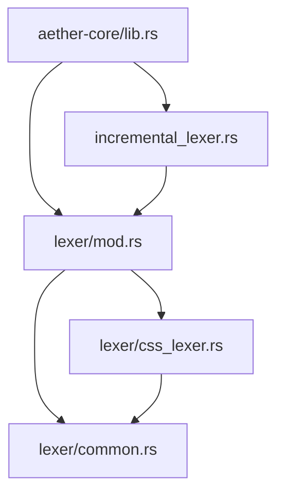
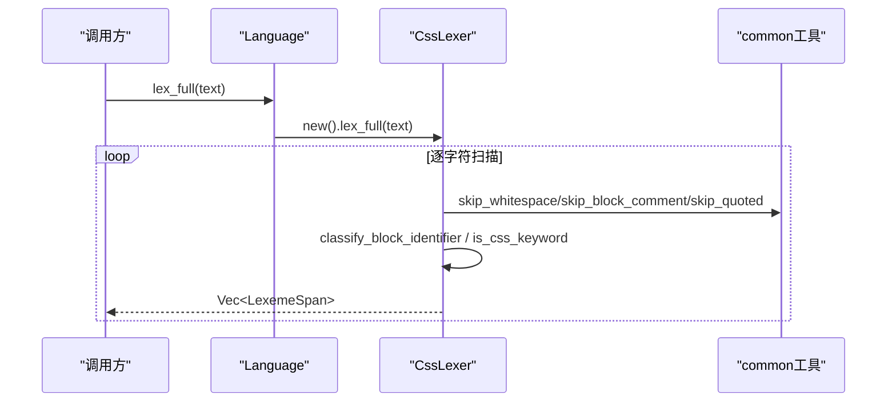
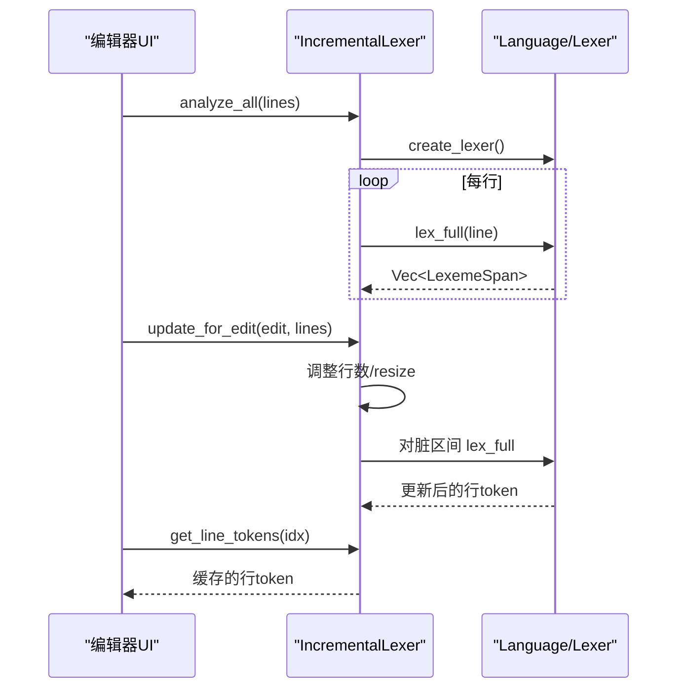
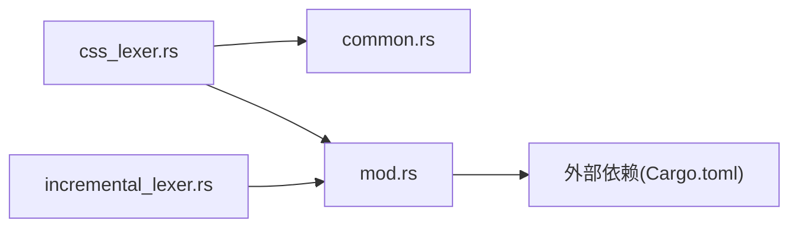

# CSS词法分析器

<cite>
**本文引用的文件**
- [css_lexer.rs](file://crates/aether-core/src/lexer/css_lexer.rs)
- [mod.rs](file://crates/aether-core/src/lexer/mod.rs)
- [common.rs](file://crates/aether-core/src/lexer/common.rs)
- [incremental_lexer.rs](file://crates/aether-core/src/incremental_lexer.rs)
- [lib.rs](file://crates/aether-core/src/lib.rs)
- [Cargo.toml](file://crates/aether-core/Cargo.toml)
</cite>

## 目录
1. [简介](#简介)
2. [项目结构](#项目结构)
3. [核心组件](#核心组件)
4. [架构总览](#架构总览)
5. [详细组件分析](#详细组件分析)
6. [依赖关系分析](#依赖关系分析)
7. [性能考量](#性能考量)
8. [故障排查指南](#故障排查指南)
9. [结论](#结论)
10. [附录](#附录)

## 简介
本文件系统性梳理并文档化该仓库中的CSS词法分析器实现，覆盖其设计目标、状态机模型、Token分类策略、增量缓存机制以及与编辑器渲染层的集成点。读者无需深入Rust即可理解CSS语法高亮与词法分析的整体流程与优化思路。

## 项目结构
CSS词法分析器位于核心库 aether-core 的 lexer 模块中，采用“通用接口 + 多语言实现”的分层组织：
- 公共接口与类型定义在 mod.rs（Lexer trait、TokenKind、Language、LexemeSpan）
- CSS具体实现位于 css_lexer.rs（CssLexer 及辅助函数）
- 跨语言共享工具在 common.rs（空白、注释、字符串等跳过逻辑）
- 增量词法分析在 incremental_lexer.rs（按行缓存、编辑后局部重算）
- 顶层模块导出在 lib.rs



图表来源
- [lib.rs:1-12](file://crates/aether-core/src/lib.rs#L1-L12)
- [mod.rs:1-208](file://crates/aether-core/src/lexer/mod.rs#L1-L208)
- [css_lexer.rs:1-203](file://crates/aether-core/src/lexer/css_lexer.rs#L1-L203)
- [common.rs:1-151](file://crates/aether-core/src/lexer/common.rs#L1-L151)
- [incremental_lexer.rs:1-129](file://crates/aether-core/src/incremental_lexer.rs#L1-L129)

章节来源
- [lib.rs:1-12](file://crates/aether-core/src/lib.rs#L1-L12)
- [mod.rs:1-208](file://crates/aether-core/src/lexer/mod.rs#L1-L208)

## 核心组件
- CssLexer：基于字节流的单字符驱动状态机，维护 in_block（选择器区/声明区）与嵌套深度 depth，输出 LexemeSpan 序列。
- TokenKind：统一的Token类型枚举，涵盖关键字、标识符、数字、字符串、标点、运算符、预处理指令、函数、属性等。
- Language：根据扩展名或路径选择对应语言的词法分析器，并提供静态分发 lex_full 以消除动态分配。
- IncrementalLexer：按行缓存token，支持编辑后的增量更新，避免全量重算。
- 公共工具：skip_whitespace/skip_block_comment/skip_quoted 等跨语言复用函数。

章节来源
- [css_lexer.rs:1-203](file://crates/aether-core/src/lexer/css_lexer.rs#L1-L203)
- [mod.rs:1-196](file://crates/aether-core/src/lexer/mod.rs#L1-L196)
- [incremental_lexer.rs:1-129](file://crates/aether-core/src/incremental_lexer.rs#L1-L129)
- [common.rs:1-151](file://crates/aether-core/src/lexer/common.rs#L1-L151)

## 架构总览
CSS词法分析器的整体调用链如下：上层通过 Language::lex_full 或 create_lexer 获取 CssLexer，对文本进行逐行或全量扫描；增量模式下由 IncrementalLexer 管理每行的token缓存并在编辑时仅重算受影响行。



图表来源
- [mod.rs:179-195](file://crates/aether-core/src/lexer/mod.rs#L179-L195)
- [css_lexer.rs:165-196](file://crates/aether-core/src/lexer/css_lexer.rs#L165-L196)
- [common.rs:5-55](file://crates/aether-core/src/lexer/common.rs#L5-L55)

## 详细组件分析

### CssLexer：状态机与Token分类
- 状态跟踪
  - in_block：true表示处于大括号内的声明区，false为选择器区。进入/退出块时通过 { } 切换，并使用 depth 支持 @media 等嵌套块。
  - 同一标识符在不同区域映射不同Token：选择器区→Keyword，声明区可能→Attribute/Function/Keyword/Identifier。
- 关键分支
  - 空白/换行：Whitespace/Newline
  - 注释：BlockComment（/* */）
  - 预处理指令：@规则（@media/@import/@keyframes等）→Preprocessor
  - 字符串：双引号/单引号→StringLiteral
  - # 处理：十六进制颜色→NumberLiteral；否则作为ID选择器→Keyword
  - 数字：整数/小数/负数/百分比/单位→NumberLiteral
  - CSS变量：--var-name→Identifier
  - !important→Keyword
  - 类选择器 .class（选择器区）→Keyword
  - 标识符：根据上下文分类（见下）
  - 分隔符/运算符/括号/通配符/百分比等→Punctuation/Operator
  - 未知字符→Unknown
- 声明区标识符分类
  - 若紧跟 ( → Function
  - 若紧跟 : → Attribute（属性名）
  - 若是常见CSS值关键字 → Keyword
  - 否则 → Identifier（值）

```mermaid
flowchart TD
Start(["开始"]) --> Ch{"当前字符"}
Ch --> |空白/制表/回车| WS["跳过空白<br/>返回 Whitespace"]
Ch --> |换行| NL["返回 Newline"]
Ch --> |/*| BC["跳过块注释<br/>返回 BlockComment"]
Ch --> |@| AT["跳过@规则名<br/>返回 Preprocessor"]
Ch --> |"'"| SQ["跳过单引号串<br/>返回 StringLiteral"]
Ch --> |'"| DQ["跳过双引号串<br/>返回 StringLiteral"]
Ch --> |#| HASH["判断是否十六进制颜色<br/>是→NumberLiteral<br/>否→Keyword"]
Ch --> |数字/小数/负数| NUM["跳过数字+单位/百分号<br/>返回 NumberLiteral"]
Ch --> |--| VAR["跳过CSS变量<br/>返回 Identifier"]
Ch --> |!| IMP["跳过important<br/>返回 Keyword"]
Ch --> |.且在选择器区| CLASS["跳过类名<br/>返回 Keyword"]
Ch --> |字母/下划线| ID["识别标识符<br/>按上下文分类<br/>Function/Attribute/Keyword/Identifier"]
Ch --> |{或}| BRACE["切换in_block/depth<br/>返回 Punctuation"]
Ch --> |: ; ,| SEP["返回 Punctuation"]
Ch --> |> + ~ *| OP["返回 Operator"]
Ch --> |%| PERC["返回 Operator"]
Ch --> |其他| UNK["UTF-8字符长度前进<br/>返回 Unknown"]
WS --> End(["结束"])
NL --> End
BC --> End
AT --> End
SQ --> End
DQ --> End
HASH --> End
NUM --> End
VAR --> End
IMP --> End
CLASS --> End
ID --> End
BRACE --> End
SEP --> End
OP --> End
PERC --> End
UNK --> End
```

图表来源
- [css_lexer.rs:15-162](file://crates/aether-core/src/lexer/css_lexer.rs#L15-L162)
- [css_lexer.rs:204-317](file://crates/aether-core/src/lexer/css_lexer.rs#L204-L317)
- [common.rs:25-55](file://crates/aether-core/src/lexer/common.rs#L25-L55)

章节来源
- [css_lexer.rs:15-196](file://crates/aether-core/src/lexer/css_lexer.rs#L15-L196)
- [css_lexer.rs:204-404](file://crates/aether-core/src/lexer/css_lexer.rs#L204-L404)

### 增量词法分析：IncrementalLexer
- 设计要点
  - 按行缓存 token：Vec<Vec<LexemeSpan>>，O(1) 访问
  - 编辑后仅重算受影响行：start_line..end_line 范围，以及新增/删除导致的偏移行
  - 版本控制：version 自增用于失效检测
  - 管理器：IncrementalLexerManager 支持多文件、最大缓存数量保护
- 典型流程
  - 首次打开：analyze_all 全量分析所有行
  - 编辑后：update_for_edit 调整行数、重算脏区间、必要时补算新增行
  - 读取：get_line_tokens/get_all_tokens 直接取缓存



图表来源
- [incremental_lexer.rs:28-129](file://crates/aether-core/src/incremental_lexer.rs#L28-L129)
- [mod.rs:159-195](file://crates/aether-core/src/lexer/mod.rs#L159-L195)

章节来源
- [incremental_lexer.rs:1-187](file://crates/aether-core/src/incremental_lexer.rs#L1-L187)
- [mod.rs:159-195](file://crates/aether-core/src/lexer/mod.rs#L159-L195)

### 公共工具：common.rs
- 提供跨语言复用的基础扫描函数：空白、行注释、块注释、带转义的字符串、标识符、数字通用框架等
- 这些函数仅依赖字节切片，无语言语义耦合，保证高性能与可移植性

章节来源
- [common.rs:1-151](file://crates/aether-core/src/lexer/common.rs#L1-L151)

### 统一接口与类型：mod.rs
- Lexer trait：统一 lex_full 接口
- TokenKind：跨语言一致的Token类型集合
- Language：从扩展名/路径推断语言，创建对应lexer，并提供静态分发 lex_full
- PlainTextLexer：无高亮的兜底lexer

章节来源
- [mod.rs:1-208](file://crates/aether-core/src/lexer/mod.rs#L1-L208)

## 依赖关系分析
- 模块内依赖
  - css_lexer.rs 依赖 common.rs 的工具函数，并通过 mod.rs 暴露的 Lexer trait、TokenKind、LexemeSpan 完成接口对接
  - incremental_lexer.rs 依赖 Language 与 Lexer 抽象，使用 create_lexer 与 lex_full 进行行级增量计算
- 外部依赖
  - aether-core/Cargo.toml 引入 memchr、regex、rayon 等用于高性能文本处理与并行能力（尽管CSS lexer本身未直接使用，但同库其他模块可用）



图表来源
- [css_lexer.rs:1-203](file://crates/aether-core/src/lexer/css_lexer.rs#L1-L203)
- [common.rs:1-151](file://crates/aether-core/src/lexer/common.rs#L1-L151)
- [incremental_lexer.rs:1-129](file://crates/aether-core/src/incremental_lexer.rs#L1-L129)
- [Cargo.toml:6-17](file://crates/aether-core/Cargo.toml#L6-L17)

章节来源
- [Cargo.toml:6-17](file://crates/aether-core/Cargo.toml#L6-L17)

## 性能考量
- 零分配与内存友好
  - LexemeSpan 使用紧凑布局（start/len/kind/flags），减少对象开销
  - 全量分析预分配 Vec 容量，降低扩容成本
- 字节级扫描
  - 大量使用 u8 切片与 ASCII 判定，避免 UTF-8 解码开销
  - 仅在需要时进行 from_utf8 转换（如 # 颜色判断）
- 增量更新
  - 按行缓存，编辑后仅重算脏区间，显著降低交互延迟
  - 管理器限制最大缓存文件数，防止长时间运行内存增长
- 静态分发
  - Language::lex_full 直接调用具体 lexer，避免 Box 与虚调用开销

[本节为通用性能讨论，不直接分析特定代码片段]

## 故障排查指南
- 常见问题定位
  - 选择器区/声明区误判：检查 { } 嵌套计数 depth 与 in_block 切换逻辑
  - 十六进制颜色误识别：确认 is_hex_color 的长度与字符集校验
  - 数字解析不完整：检查 skip_css_number 对小数、负数、单位、百分号的顺序处理
  - 字符串转义错误：确认 skip_quoted 对末尾反斜杠的安全处理
  - 增量缓存不一致：核对 update_for_edit 的 start_line/end_line 与 line_delta 计算是否正确
- 调试建议
  - 打印脏区间与版本变化，验证增量更新范围
  - 针对边界用例（空文件、超长行、非法UTF-8首字节）编写测试断言
  - 使用增量管理器统计缓存命中率与文件大小上限行为

章节来源
- [css_lexer.rs:214-260](file://crates/aether-core/src/lexer/css_lexer.rs#L214-L260)
- [common.rs:25-55](file://crates/aether-core/src/lexer/common.rs#L25-L55)
- [incremental_lexer.rs:43-101](file://crates/aether-core/src/incremental_lexer.rs#L43-L101)

## 结论
该CSS词法分析器以简洁的状态机为核心，结合统一的Token体系与增量缓存，实现了高效、可扩展的语法高亮基础设施。其在选择器区与声明区的差异化分类、对@规则的嵌套支持、以及对数字/颜色/变量的精细处理，使其能够稳定服务于现代CSS/SCSS/Less等样式文件的编辑体验。配合增量词法分析器，可在大规模文档与频繁编辑场景下保持低延迟与低内存占用。

[本节为总结性内容，不直接分析特定文件]

## 附录
- 术语说明
  - 选择器区：大括号外的CSS规则头部区域
  - 声明区：大括号内的属性-值对区域
  - 预处理指令：以@开头的规则（如@media、@import）
  - 增量词法分析：仅对受编辑影响的行重新生成token
- 相关测试
  - css_lexer.rs 内置丰富单元测试，覆盖空白、注释、选择器、属性、数值、颜色、变量、函数调用、嵌套块、组合子等场景

章节来源
- [css_lexer.rs:406-556](file://crates/aether-core/src/lexer/css_lexer.rs#L406-L556)