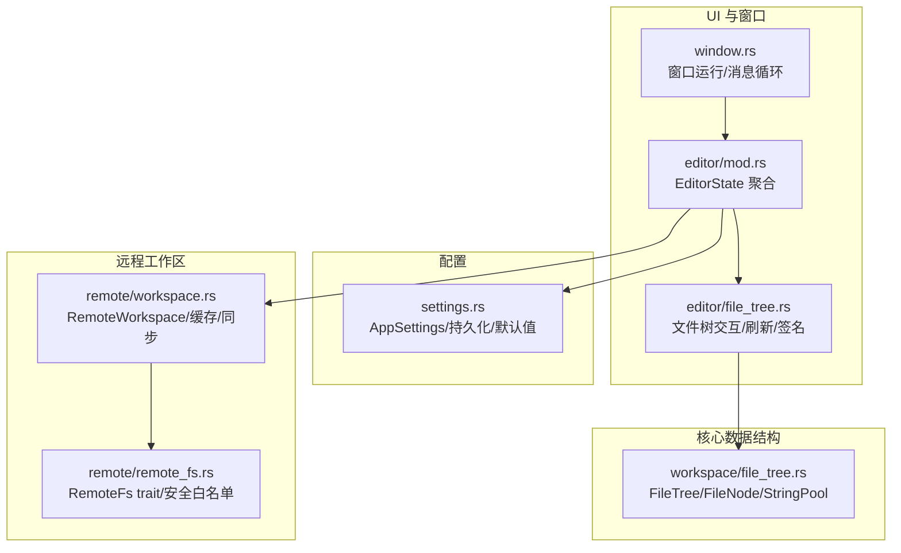
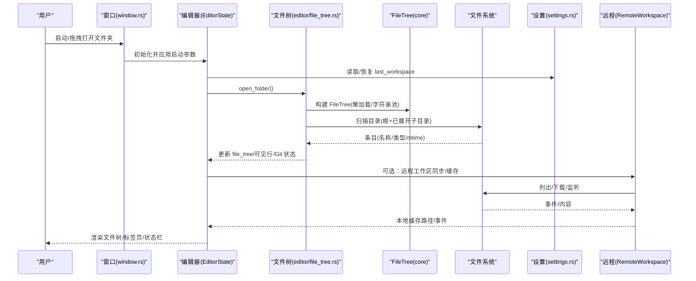
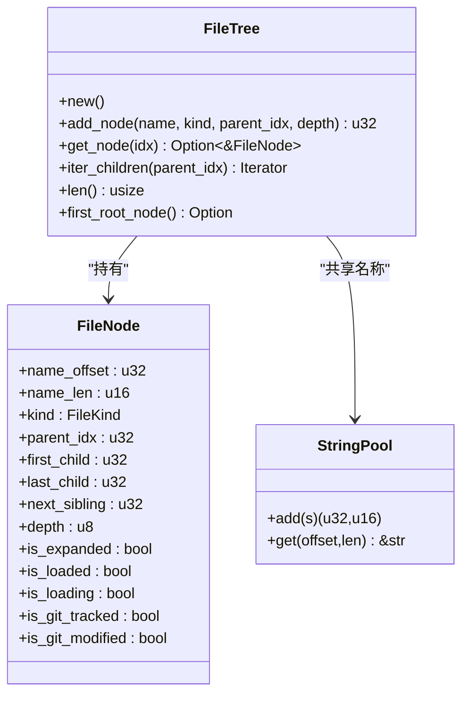
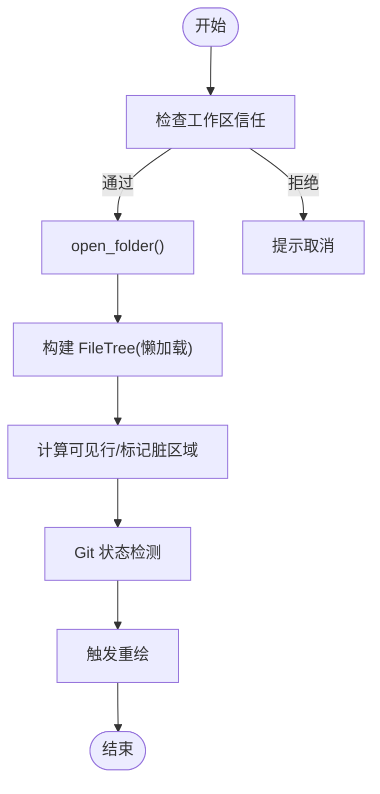
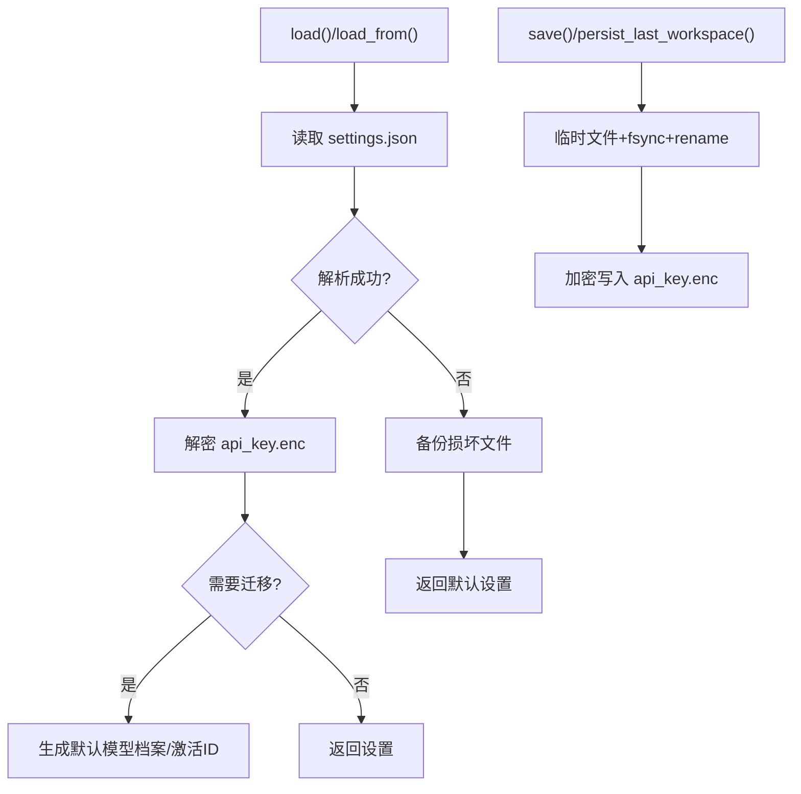
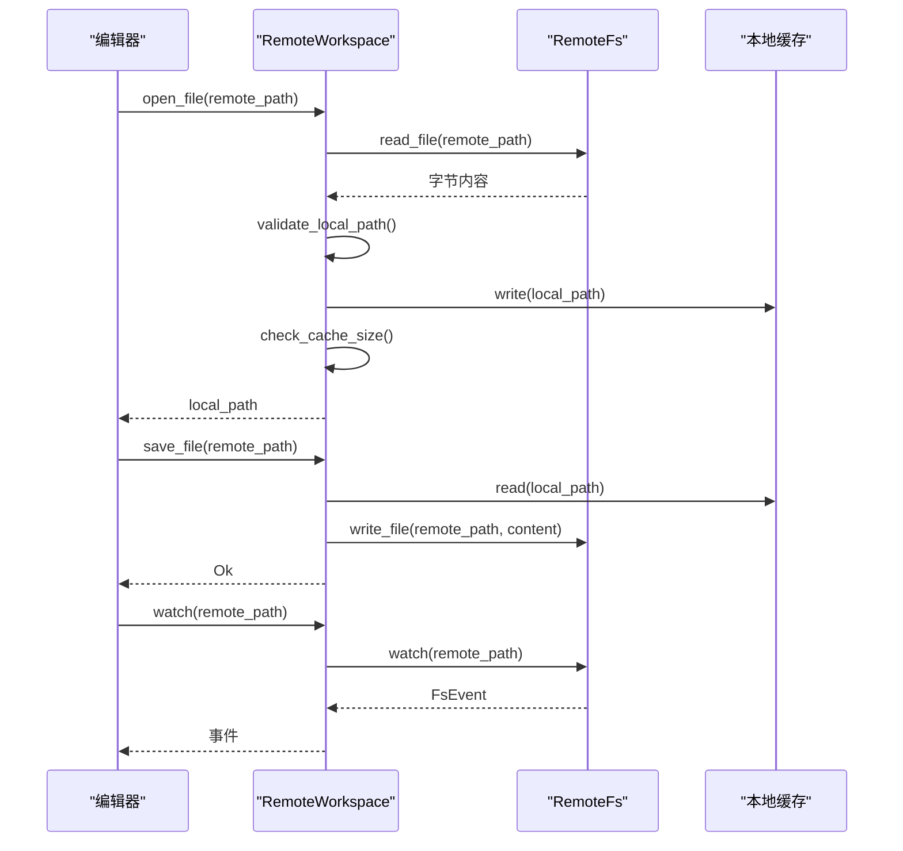
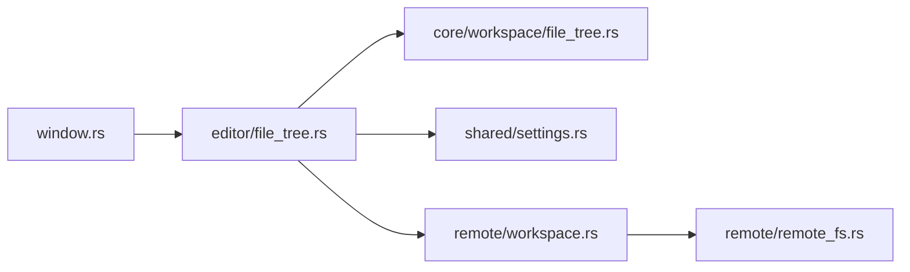

# 工作区管理

<cite>
**本文引用的文件**
- [crates/aether-core/src/workspace/file_tree.rs](file://crates/aether-core/src/workspace/file_tree.rs)
- [crates/aether-win32/src/editor/file_tree.rs](file://crates/aether-win32/src/editor/file_tree.rs)
- [crates/aether-win32/src/editor/mod.rs](file://crates/aether-win32/src/editor/mod.rs)
- [crates/aether-shared/src/settings.rs](file://crates/aether-shared/src/settings.rs)
- [crates/aether-remote/src/workspace.rs](file://crates/aether-remote/src/workspace.rs)
- [crates/aether-remote/src/remote_fs.rs](file://crates/aether-remote/src/remote_fs.rs)
- [crates/aether-win32/src/window.rs](file://crates/aether-win32/src/window.rs)
</cite>

## 目录
1. [简介](#简介)
2. [项目结构](#项目结构)
3. [核心组件](#核心组件)
4. [架构总览](#架构总览)
5. [详细组件分析](#详细组件分析)
6. [依赖关系分析](#依赖关系分析)
7. [性能考虑](#性能考虑)
8. [故障排除指南](#故障排除指南)
9. [结论](#结论)
10. [附录：使用示例](#附录使用示例)

## 简介
本文件面向“工作区管理系统”，系统性阐述以下主题：
- 工作区的概念与生命周期：项目加载、文件监控、状态同步
- 文件树结构的实现：目录遍历、文件过滤、虚拟文件系统支持
- 配置管理：设置持久化、配置验证、默认值处理
- 与文件系统的交互：异步文件操作、缓存策略、错误处理
- 使用示例：创建工作区、管理文件和配置
- 性能优化建议与故障排除

## 项目结构
工作区相关能力分布在多个 crate 中，职责清晰、分层明确：
- aether-core: 提供高性能的文件树数据结构（紧凑内存布局、字符串池、懒加载标记）
- aether-win32: 编辑器 UI 与工作区集成层，负责打开文件夹、构建/刷新文件树、监听变更、用户交互
- aether-shared: 应用设置持久化（settings.json）、API Key 加密存储、默认值与迁移
- aether-remote: 远程工作区抽象与本地缓存、安全校验、缓存清理、事件监听
- window: 窗口生命周期与消息循环，驱动后台任务与渲染

图表来源
- [crates/aether-win32/src/window.rs:132-204](file://crates/aether-win32/src/window.rs#L132-L204)
- [crates/aether-win32/src/editor/mod.rs:651-676](file://crates/aether-win32/src/editor/mod.rs#L651-L676)
- [crates/aether-win32/src/editor/file_tree.rs:325-451](file://crates/aether-win32/src/editor/file_tree.rs#L325-L451)
- [crates/aether-core/src/workspace/file_tree.rs:1-232](file://crates/aether-core/src/workspace/file_tree.rs#L1-L232)
- [crates/aether-shared/src/settings.rs:385-559](file://crates/aether-shared/src/settings.rs#L385-L559)
- [crates/aether-remote/src/workspace.rs:19-231](file://crates/aether-remote/src/workspace.rs#L19-L231)
- [crates/aether-remote/src/remote_fs.rs:26-186](file://crates/aether-remote/src/remote_fs.rs#L26-L186)

章节来源
- [crates/aether-win32/src/window.rs:132-204](file://crates/aether-win32/src/window.rs#L132-L204)
- [crates/aether-win32/src/editor/mod.rs:651-676](file://crates/aether-win32/src/editor/mod.rs#L651-L676)

## 核心组件
- 文件树数据结构（aether-core）
  - FileTree/FileNode：扁平化节点数组 + 首尾子节点指针 + 兄弟链表，O(1) 尾插；StringPool 共享路径名存储，降低内存占用
  - 懒加载：is_loaded/is_loading 控制目录展开时按需扫描子项
- 编辑器工作区集成（aether-win32）
  - EditorState.fs：当前工作区路径、FileTree、可见行缓存、加载世代、轻量刷新、根签名变化检测
  - 文件树交互：新建/重命名/删除、上下文菜单、资源管理器打开、路径复制、Git 状态联动
- 配置管理（aether-shared）
  - AppSettings：多模型 AI 配置、UI 布局、自动保存、更新策略等；持久化采用原子写入（临时文件+fsync+rename）
  - API Key 单独 DPAPI 加密存储，避免明文落盘
- 远程工作区（aether-remote）
  - RemoteWorkspace：远程文件按需下载到本地缓存、TOCTOU 防护、路径规范校验、缓存大小限制与清理
  - RemoteFs trait：统一 SSH/容器等后端；exec_restricted 命令白名单与元字符过滤，git_exec 参数校验

章节来源
- [crates/aether-core/src/workspace/file_tree.rs:1-232](file://crates/aether-core/src/workspace/file_tree.rs#L1-L232)
- [crates/aether-win32/src/editor/file_tree.rs:325-451](file://crates/aether-win32/src/editor/file_tree.rs#L325-L451)
- [crates/aether-shared/src/settings.rs:385-559](file://crates/aether-shared/src/settings.rs#L385-L559)
- [crates/aether-remote/src/workspace.rs:19-231](file://crates/aether-remote/src/workspace.rs#L19-L231)
- [crates/aether-remote/src/remote_fs.rs:26-186](file://crates/aether-remote/src/remote_fs.rs#L26-L186)

## 架构总览
工作区从“打开文件夹”到“文件树展示与同步”的端到端流程如下：

图表来源
- [crates/aether-win32/src/window.rs:132-204](file://crates/aether-win32/src/window.rs#L132-L204)
- [crates/aether-win32/src/editor/file_tree.rs:325-451](file://crates/aether-win32/src/editor/file_tree.rs#L325-L451)
- [crates/aether-core/src/workspace/file_tree.rs:78-212](file://crates/aether-core/src/workspace/file_tree.rs#L78-L212)
- [crates/aether-remote/src/workspace.rs:58-147](file://crates/aether-remote/src/workspace.rs#L58-L147)
- [crates/aether-shared/src/settings.rs:385-485](file://crates/aether-shared/src/settings.rs#L385-L485)

## 详细组件分析

### 文件树数据结构（aether-core）
- 设计要点
  - 扁平 Vec 存储节点，首尾子节点 + 兄弟链表，避免指针跳转带来的缓存不友好
  - StringPool 集中存储所有名称，减少重复分配
  - 懒加载：目录首次展开才扫描子项，is_loaded 与 is_loading 防止重复触发
- 复杂度
  - 插入 O(1) 尾插（维护 first_child/last_child）
  - 遍历 children O(k) 按兄弟链
  - 名称访问 O(1) 切片
- 边界与健壮性
  - 溢出保护：节点数与名称长度 try_from 检查，避免静默截断导致索引错乱
  - 测试覆盖：空树、根兄弟链、名称获取、节点字段等

图表来源
- [crates/aether-core/src/workspace/file_tree.rs:1-232](file://crates/aether-core/src/workspace/file_tree.rs#L1-L232)

章节来源
- [crates/aether-core/src/workspace/file_tree.rs:1-232](file://crates/aether-core/src/workspace/file_tree.rs#L1-L232)

### 编辑器工作区集成（aether-win32）
- 关键职责
  - 打开/刷新工作区：open_folder/refresh_file_tree/refresh_file_tree_light
  - 懒加载与可见行缓存：ensure_node_loaded_async、visible_rows 重建
  - 轻量刷新：保留展开状态，仅重建根与已展开子目录，避免全量重建闪烁
  - 工作区根签名：基于目录层级名称/类型/mtime 计算哈希，用于 AI 终端命令后增量刷新
  - 文件操作：新建/重命名/删除、上下文菜单、在资源管理器中打开、复制路径
- 与 Git/LSP/状态栏联动
  - 刷新后调用 Git detect 更新状态
  - 打开文件后可能触发 LSP 诊断更新（由其他模块驱动）

图表来源
- [crates/aether-win32/src/editor/file_tree.rs:325-451](file://crates/aether-win32/src/editor/file_tree.rs#L325-L451)

章节来源
- [crates/aether-win32/src/editor/file_tree.rs:325-451](file://crates/aether-win32/src/editor/file_tree.rs#L325-L451)
- [crates/aether-win32/src/editor/mod.rs:506-548](file://crates/aether-win32/src/editor/mod.rs#L506-L548)

### 配置管理（aether-shared）
- 持久化策略
  - settings.json 原子写入：临时文件 + fsync + rename，崩溃不损坏配置
  - API Key 单独加密存储（Windows DPAPI），不在 JSON 中明文
- 默认值与迁移
  - 旧版单一 AI 配置迁移为多模型档案
  - last_workspace 独立持久化方法，避免多窗口互相覆盖
- 安全性
  - 解析失败时备份损坏文件，回退到默认设置

图表来源
- [crates/aether-shared/src/settings.rs:385-559](file://crates/aether-shared/src/settings.rs#L385-L559)

章节来源
- [crates/aether-shared/src/settings.rs:385-559](file://crates/aether-shared/src/settings.rs#L385-L559)

### 远程工作区（aether-remote）
- 本地缓存与安全
  - validate_local_path：规范路径校验，防路径遍历
  - TOCTOU 防护：写入后再次 canonicalize 校验，越界则删除并报错
  - 缓存上限：超过阈值自动清理最旧文件至目标比例
- 同步与监听
  - sync_tree：将远程目录结构同步到本地缓存
  - watch：转发底层 RemoteFs 的事件通道
- 安全命令执行
  - exec_restricted：严格白名单 + shell 元字符过滤
  - git_exec：参数校验（禁止以 - 开头、路径遍历、绝对路径等）

图表来源
- [crates/aether-remote/src/workspace.rs:28-147](file://crates/aether-remote/src/workspace.rs#L28-L147)
- [crates/aether-remote/src/remote_fs.rs:26-186](file://crates/aether-remote/src/remote_fs.rs#L26-L186)

章节来源
- [crates/aether-remote/src/workspace.rs:28-147](file://crates/aether-remote/src/workspace.rs#L28-L147)
- [crates/aether-remote/src/remote_fs.rs:26-186](file://crates/aether-remote/src/remote_fs.rs#L26-L186)

## 依赖关系分析
- 耦合与内聚
  - editor/file_tree.rs 依赖 core/workspace/file_tree.rs 的数据结构，保持 UI 与数据解耦
  - remote/workspace.rs 依赖 remote_fs.rs 的抽象接口，便于替换 SSH/容器后端
  - settings.rs 被 UI 与窗口初始化阶段广泛使用，作为全局配置源
- 外部依赖
  - Windows API（窗口、DWM、剪贴板、ShellExecute）
  - tokio runtime（LSP 异步任务）
  - serde/serde_json（配置序列化）
- 潜在循环依赖
  - 通过模块划分与 trait 抽象避免循环；UI 不直接依赖具体远程实现

图表来源
- [crates/aether-win32/src/editor/file_tree.rs:325-451](file://crates/aether-win32/src/editor/file_tree.rs#L325-L451)
- [crates/aether-core/src/workspace/file_tree.rs:1-232](file://crates/aether-core/src/workspace/file_tree.rs#L1-L232)
- [crates/aether-shared/src/settings.rs:385-559](file://crates/aether-shared/src/settings.rs#L385-L559)
- [crates/aether-remote/src/workspace.rs:19-231](file://crates/aether-remote/src/workspace.rs#L19-L231)
- [crates/aether-remote/src/remote_fs.rs:26-186](file://crates/aether-remote/src/remote_fs.rs#L26-L186)
- [crates/aether-win32/src/window.rs:132-204](file://crates/aether-win32/src/window.rs#L132-L204)

章节来源
- [crates/aether-win32/src/editor/file_tree.rs:325-451](file://crates/aether-win32/src/editor/file_tree.rs#L325-L451)
- [crates/aether-core/src/workspace/file_tree.rs:1-232](file://crates/aether-core/src/workspace/file_tree.rs#L1-L232)
- [crates/aether-shared/src/settings.rs:385-559](file://crates/aether-shared/src/settings.rs#L385-L559)
- [crates/aether-remote/src/workspace.rs:19-231](file://crates/aether-remote/src/workspace.rs#L19-L231)
- [crates/aether-remote/src/remote_fs.rs:26-186](file://crates/aether-remote/src/remote_fs.rs#L26-L186)
- [crates/aether-win32/src/window.rs:132-204](file://crates/aether-win32/src/window.rs#L132-L204)

## 性能考虑
- 文件树
  - 扁平存储与首尾指针：O(1) 插入与遍历，缓存友好
  - 懒加载：仅展开目录时扫描子项，减少初始 IO
  - 可见行缓存：避免每帧全量遍历，命中测试降为 O(1) 行定位
- 配置持久化
  - 原子写入避免竞争与损坏；API Key 加密存储降低安全风险
- 远程缓存
  - 容量上限与自动清理，防止无限增长
  - 按需下载与版本记录，减少重复传输
- 渲染与事件
  - 脏矩形追踪与 WM_PAINT 合并，避免重复渲染
  - 后台定时器驱动 LSP/终端输出/文件监控，非阻塞 UI

[本节为通用性能指导，无需特定文件引用]

## 故障排除指南
- 配置损坏
  - 现象：settings.json 解析失败
  - 处理：自动备份为 .json.corrupt，回退到默认设置
  - 参考：[crates/aether-shared/src/settings.rs:442-450](file://crates/aether-shared/src/settings.rs#L442-L450)
- 远程路径越界/符号链接攻击
  - 现象：写入后路径超出缓存目录
  - 处理：删除越界文件并报错；前后均进行 canonicalize 校验
  - 参考：[crates/aether-remote/src/workspace.rs:79-94](file://crates/aether-remote/src/workspace.rs#L79-L94)
- 命令注入风险
  - 现象：exec_restricted 拒绝包含 shell 元字符的命令
  - 处理：白名单精确匹配命令名，拒绝危险字符
  - 参考：[crates/aether-remote/src/remote_fs.rs:51-93](file://crates/aether-remote/src/remote_fs.rs#L51-L93)
- 文件树点击错位
  - 现象：高 DPI/滚动下点击与渲染不一致
  - 处理：统一使用逻辑像素与滚动偏移计算起始坐标
  - 参考：[crates/aether-win32/src/editor/file_tree.rs:17-34](file://crates/aether-win32/src/editor/file_tree.rs#L17-L34)

章节来源
- [crates/aether-shared/src/settings.rs:442-450](file://crates/aether-shared/src/settings.rs#L442-L450)
- [crates/aether-remote/src/workspace.rs:79-94](file://crates/aether-remote/src/workspace.rs#L79-L94)
- [crates/aether-remote/src/remote_fs.rs:51-93](file://crates/aether-remote/src/remote_fs.rs#L51-L93)
- [crates/aether-win32/src/editor/file_tree.rs:17-34](file://crates/aether-win32/src/editor/file_tree.rs#L17-L34)

## 结论
本工作区管理系统通过：
- 高性能文件树数据结构与懒加载机制，保障大项目下的响应速度
- 原子化配置持久化与敏感信息加密，提升可靠性与安全性
- 远程工作区的安全校验与缓存策略，支持跨环境开发
- 轻量刷新与根签名变化检测，减少无谓重建与闪烁
整体实现了稳定、高效、可扩展的工作区管理能力。

[本节为总结性内容，无需特定文件引用]

## 附录：使用示例
以下为典型操作流程（以步骤形式描述，不直接粘贴代码）：

- 创建工作区
  - 启动应用，窗口初始化并加载设置
  - 调用 open_folder 打开本地或远程路径
  - 构建 FileTree，懒加载已展开目录，更新可见行与 Git 状态
  - 参考：
    - [crates/aether-win32/src/editor/file_tree.rs:325-451](file://crates/aether-win32/src/editor/file_tree.rs#L325-L451)
    - [crates/aether-core/src/workspace/file_tree.rs:78-212](file://crates/aether-core/src/workspace/file_tree.rs#L78-L212)

- 管理文件
  - 新建/重命名/删除：通过文件树内联输入与上下文菜单完成
  - 在资源管理器中打开/复制路径：便捷导航与协作
  - 参考：
    - [crates/aether-win32/src/editor/file_tree.rs:118-258](file://crates/aether-win32/src/editor/file_tree.rs#L118-L258)
    - [crates/aether-win32/src/editor/file_tree.rs:453-547](file://crates/aether-win32/src/editor/file_tree.rs#L453-L547)

- 配置管理
  - 读取/保存设置：settings.json 原子写入，API Key 加密存储
  - 迁移旧配置：单一 AI 配置转为多模型档案
  - 参考：
    - [crates/aether-shared/src/settings.rs:385-559](file://crates/aether-shared/src/settings.rs#L385-L559)

- 远程工作区
  - 打开远程文件：按需下载到本地缓存，校验路径安全
  - 同步目录结构：sync_tree 创建目录骨架
  - 监听变更：watch 转发 FsEvent
  - 参考：
    - [crates/aether-remote/src/workspace.rs:58-147](file://crates/aether-remote/src/workspace.rs#L58-L147)
    - [crates/aether-remote/src/remote_fs.rs:26-186](file://crates/aether-remote/src/remote_fs.rs#L26-L186)

章节来源
- [crates/aether-win32/src/editor/file_tree.rs:118-258](file://crates/aether-win32/src/editor/file_tree.rs#L118-L258)
- [crates/aether-win32/src/editor/file_tree.rs:325-451](file://crates/aether-win32/src/editor/file_tree.rs#L325-L451)
- [crates/aether-core/src/workspace/file_tree.rs:78-212](file://crates/aether-core/src/workspace/file_tree.rs#L78-L212)
- [crates/aether-shared/src/settings.rs:385-559](file://crates/aether-shared/src/settings.rs#L385-L559)
- [crates/aether-remote/src/workspace.rs:58-147](file://crates/aether-remote/src/workspace.rs#L58-L147)
- [crates/aether-remote/src/remote_fs.rs:26-186](file://crates/aether-remote/src/remote_fs.rs#L26-L186)