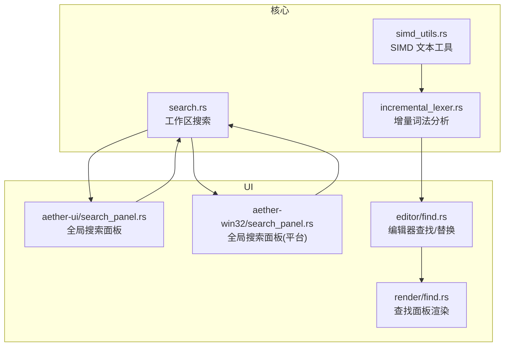
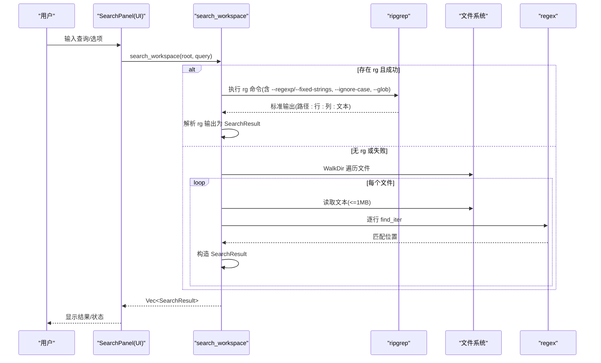
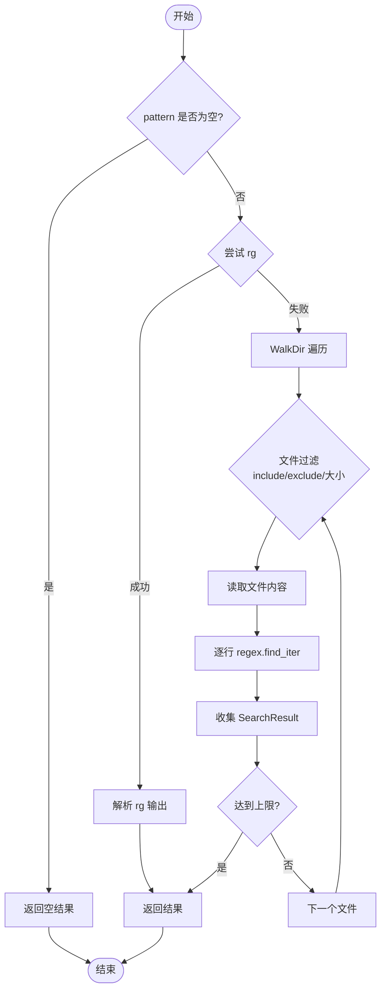
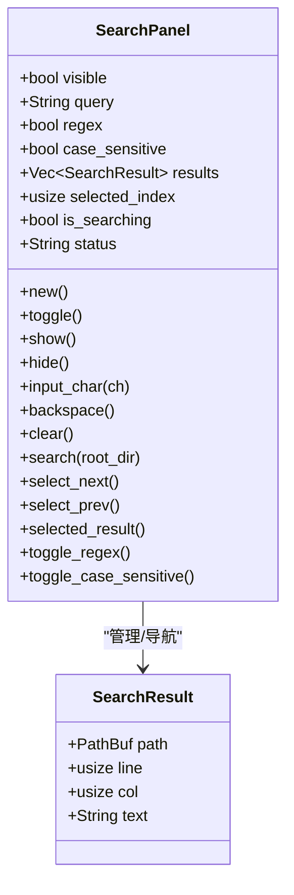
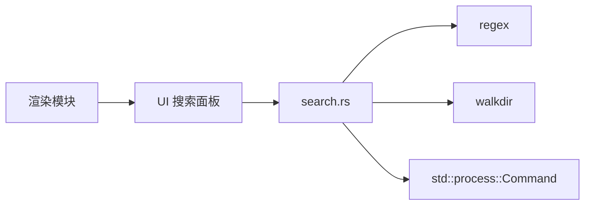

# 搜索系统

<cite>
**本文引用的文件**
- [search.rs](file://crates/aether-core/src/search.rs)
- [simd_utils.rs](file://crates/aether-core/src/simd_utils.rs)
- [benchmarks.rs](file://crates/aether-core/src/benchmarks.rs)
- [search_panel.rs (UI)](file://crates/aether-ui/src/search_panel.rs)
- [search_panel.rs (Win32)](file://crates/aether-win32/src/search_panel.rs)
- [find.rs (编辑器查找/替换)](file://crates/aether-win32/src/editor/find.rs)
- [render_find.rs (查找面板渲染)](file://crates/aether-win32/src/render/find.rs)
- [incremental_lexer.rs](file://crates/aether-core/src/incremental_lexer.rs)
</cite>

## 目录
1. [简介](#简介)
2. [项目结构](#项目结构)
3. [核心组件](#核心组件)
4. [架构总览](#架构总览)
5. [详细组件分析](#详细组件分析)
6. [依赖关系分析](#依赖关系分析)
7. [性能考量](#性能考量)
8. [故障排查指南](#故障排查指南)
9. [结论](#结论)
10. [附录](#附录)

## 简介
本技术文档围绕“搜索系统”的实现与使用，覆盖全文搜索算法、正则表达式支持、搜索结果排序与展示、SIMD 优化、配置选项、索引构建与维护策略，以及大规模文件搜索的优化方案。目标是帮助开发者理解并高效扩展该搜索子系统，同时为使用者提供清晰的配置与调优建议。

## 项目结构
搜索系统由以下关键部分组成：
- 核心搜索引擎：负责工作区扫描、正则匹配、结果收集与解析（优先调用外部 ripgrep，回退到 walkdir + regex）。
- SIMD 工具库：提供高性能文本处理原语（换行计数、字节查找、空白跳过等），用于加速词法分析与后续可能的搜索路径。
- UI 层：全局搜索面板与编辑器内查找/替换面板，封装用户交互、状态管理与结果导航。
- 增量词法分析器：缓存每行 token，减少重复分析开销，间接提升编辑与高亮相关性能。

图表来源
- [search.rs:48-182](file://crates/aether-core/src/search.rs#L48-L182)
- [simd_utils.rs:1-101](file://crates/aether-core/src/simd_utils.rs#L1-L101)
- [incremental_lexer.rs:1-129](file://crates/aether-core/src/incremental_lexer.rs#L1-L129)
- [search_panel.rs (UI):1-108](file://crates/aether-ui/src/search_panel.rs#L1-L108)
- [search_panel.rs (Win32):1-108](file://crates/aether-win32/src/search_panel.rs#L1-L108)
- [find.rs (编辑器查找/替换):1-252](file://crates/aether-win32/src/editor/find.rs#L1-L252)
- [render_find.rs:1-294](file://crates/aether-win32/src/render/find.rs#L1-L294)

章节来源
- [search.rs:48-182](file://crates/aether-core/src/search.rs#L48-L182)
- [simd_utils.rs:1-101](file://crates/aether-core/src/simd_utils.rs#L1-L101)
- [incremental_lexer.rs:1-129](file://crates/aether-core/src/incremental_lexer.rs#L1-L129)
- [search_panel.rs (UI):1-108](file://crates/aether-ui/src/search_panel.rs#L1-L108)
- [search_panel.rs (Win32):1-108](file://crates/aether-win32/src/search_panel.rs#L1-L108)
- [find.rs (编辑器查找/替换):1-252](file://crates/aether-win32/src/editor/find.rs#L1-L252)
- [render_find.rs:1-294](file://crates/aether-win32/src/render/find.rs#L1-L294)

## 核心组件
- 搜索查询与结果模型：定义 SearchQuery（模式、正则、大小写敏感、包含/排除 glob）和 SearchResult（路径、行列号、匹配行文本）。
- 工作区搜索入口：优先尝试 ripgrep；失败时回退到 walkdir + regex 遍历文件并逐行匹配。
- 正则构建：根据是否启用正则与大小写敏感构建 Regex，并在非正则模式下对字面量进行转义。
- 文件过滤：基于相对路径的包含/排除判断，限制文件大小以避免大文件拖慢搜索。
- 结果解析：解析 ripgrep 输出格式，构造统一的结果对象。

章节来源
- [search.rs:6-43](file://crates/aether-core/src/search.rs#L6-L43)
- [search.rs:48-182](file://crates/aether-core/src/search.rs#L48-L182)
- [search.rs:184-201](file://crates/aether-core/src/search.rs#L184-L201)

## 架构总览
搜索系统采用“外部引擎优先 + 内置回退”的混合架构：
- 外部引擎：ripgrep（rg）通过命令行参数控制大小写、正则/固定字符串、glob 包含/排除、最大行数与文件大小限制，快速返回结果。
- 内置回退：walkdir 遍历目录树，按行读取并使用 regex 匹配，限制结果数量与文件大小，保证在无 rg 环境下仍可工作。
- UI 层：全局搜索面板将用户输入转换为 SearchQuery，调用核心搜索并展示结果；编辑器内查找/替换维护当前文件的匹配位置与导航。

图表来源
- [search.rs:48-182](file://crates/aether-core/src/search.rs#L48-L182)
- [search_panel.rs (UI):58-79](file://crates/aether-ui/src/search_panel.rs#L58-L79)
- [search_panel.rs (Win32):58-79](file://crates/aether-win32/src/search_panel.rs#L58-L79)

## 详细组件分析

### 全文搜索算法与正则支持
- 字符串匹配：在非正则模式下，使用 regex::escape 将用户输入作为字面量匹配，避免误解析元字符。
- 正则表达式：当启用正则时，直接使用用户提供的模式；若无效则返回错误，阻止搜索。
- 大小写敏感：通过 RegexBuilder.case_insensitive 控制；在 rg 模式下通过 --ignore-case 传递。
- 文件范围控制：include/exclude 通过 glob 模式传入 rg 或在 walkdir 中基于相对路径匹配；默认排除 target/.git/node_modules。
- 结果限制：rg 模式设置 max-count=50；walkdir 模式限制结果总数为 500，避免内存膨胀。

图表来源
- [search.rs:48-182](file://crates/aether-core/src/search.rs#L48-L182)
- [search.rs:184-201](file://crates/aether-core/src/search.rs#L184-L201)

章节来源
- [search.rs:48-182](file://crates/aether-core/src/search.rs#L48-L182)
- [search.rs:184-201](file://crates/aether-core/src/search.rs#L184-L201)

### SIMD 优化与向量化搜索
- 换行计数：使用 bytecount 实现 AVX2/SSE2 运行时分派，显著快于标量循环。
- 字节查找：memchr 提供高效的单字节查找，常用于定位换行符或分隔符。
- 空白跳过：SWAR 批量检测空格/制表符/回车，使用 chunks_exact 消除边界检查，便于编译器向量化。
- 前缀匹配与行长度：利用切片比较与 memchr 快速计算行长度与前缀匹配。
- 字符分类：批量分类字母/数字/空白，辅助词法分析。

这些原语虽未直接嵌入搜索主流程，但为词法分析、行分割、高亮等模块提供高性能基础，从而间接提升整体搜索体验（如更快的行解析与高亮渲染）。

章节来源
- [simd_utils.rs:1-101](file://crates/aether-core/src/simd_utils.rs#L1-L101)
- [benchmarks.rs:236-263](file://crates/aether-core/src/benchmarks.rs#L236-L263)

### 搜索结果展示与管理
- 全局搜索面板：
  - 输入管理：支持字符输入、退格、清空。
  - 搜索执行：将 query、regex、case_sensitive 组合为 SearchQuery，调用 search_workspace，更新结果与状态。
  - 结果导航：上下选择当前结果项，获取选中结果。
- 编辑器查找/替换：
  - 查找所有匹配：在当前文件中查找并缓存结果，避免重复扫描。
  - 导航：下一个/上一个匹配，自动移动光标并选中文本。
  - 替换：替换当前匹配，记录历史以支持撤销；批量替换从后向前操作，避免偏移问题。
- 渲染：
  - 查找面板绘制：包括标签、输入框、匹配计数、替换输入框等 UI 元素。

图表来源
- [search_panel.rs (UI):1-108](file://crates/aether-ui/src/search_panel.rs#L1-L108)
- [search_panel.rs (Win32):1-108](file://crates/aether-win32/src/search_panel.rs#L1-L108)
- [search.rs:36-43](file://crates/aether-core/src/search.rs#L36-L43)

章节来源
- [search_panel.rs (UI):1-108](file://crates/aether-ui/src/search_panel.rs#L1-L108)
- [search_panel.rs (Win32):1-108](file://crates/aether-win32/src/search_panel.rs#L1-L108)
- [find.rs (编辑器查找/替换):1-252](file://crates/aether-win32/src/editor/find.rs#L1-L252)
- [render_find.rs:1-294](file://crates/aether-win32/src/render/find.rs#L1-L294)

### 增量词法分析与性能关联
- 增量 Lexer：缓存每行 token，编辑时仅重新分析受影响行，降低重复分析成本。
- 管理器：多文件 lexer 缓存，限制最大缓存文件数，避免长期运行内存增长。
- 与搜索的关系：虽然搜索不直接依赖增量 lexer，但高亮与语法分析的性能提升有助于整体响应速度，尤其在搜索结果跳转后的渲染阶段。

章节来源
- [incremental_lexer.rs:1-129](file://crates/aether-core/src/incremental_lexer.rs#L1-L129)
- [incremental_lexer.rs:131-187](file://crates/aether-core/src/incremental_lexer.rs#L131-L187)

## 依赖关系分析
- 搜索核心依赖：
  - regex：构建正则表达式，支持大小写敏感与字面量转义。
  - walkdir：遍历目录树，配合 include/exclude 过滤。
  - std::process::Command：调用外部 rg 执行搜索。
- UI 依赖：
  - aether_core::search：导入 SearchQuery、SearchResult 与 search_workspace。
- 渲染依赖：
  - Direct2D/DWrite：绘制查找面板与文本。

图表来源
- [search.rs:1-5](file://crates/aether-core/src/search.rs#L1-L5)
- [search_panel.rs (UI):1-2](file://crates/aether-ui/src/search_panel.rs#L1-L2)
- [render_find.rs:1-2](file://crates/aether-win32/src/render/find.rs#L1-L2)

章节来源
- [search.rs:1-5](file://crates/aether-core/src/search.rs#L1-L5)
- [search_panel.rs (UI):1-2](file://crates/aether-ui/src/search_panel.rs#L1-L2)
- [render_find.rs:1-2](file://crates/aether-win32/src/render/find.rs#L1-L2)

## 性能考量
- 外部引擎优先：rg 具备高度优化的搜索路径，建议在可用时始终优先使用。
- 结果限制：rg 设置 max-count=50；walkdir 模式限制结果总数为 500，防止内存占用过高。
- 文件大小限制：walkdir 跳过大于 1MB 的文件，避免 I/O 瓶颈。
- SIMD 加速：换行计数、字节查找、空白跳过等原语显著提升底层文本处理性能。
- 增量分析：增量 lexer 减少重复分析开销，提高编辑与高亮性能。
- 基准测试：提供多项基准（PieceTable、SIMD、增量 lexer），可用于评估不同场景下的性能表现。

章节来源
- [search.rs:61-94](file://crates/aether-core/src/search.rs#L61-L94)
- [search.rs:128-171](file://crates/aether-core/src/search.rs#L128-L171)
- [simd_utils.rs:1-101](file://crates/aether-core/src/simd_utils.rs#L1-L101)
- [benchmarks.rs:236-263](file://crates/aether-core/src/benchmarks.rs#L236-L263)

## 故障排查指南
- 正则表达式错误：当启用正则且模式非法时，build_regex 返回错误，导致搜索无法执行。请检查正则语法。
- rg 不可用或失败：若 rg 不存在或命令失败，系统将回退到 walkdir + regex；可检查环境变量或安装 rg。
- 结果为空：确认 pattern 非空；检查 include/exclude 是否过于严格；确认文件未被大小限制过滤。
- 结果过多：调整 max-count 或增加 exclude 模式以减少无关文件。
- 界面状态异常：检查 SearchPanel 的状态字段（is_searching、status）是否正确更新；确保结果集合与选中索引同步。

章节来源
- [search.rs:173-182](file://crates/aether-core/src/search.rs#L173-L182)
- [search.rs:61-94](file://crates/aether-core/src/search.rs#L61-L94)
- [search.rs:128-171](file://crates/aether-core/src/search.rs#L128-L171)
- [search_panel.rs (UI):58-79](file://crates/aether-ui/src/search_panel.rs#L58-L79)

## 结论
该搜索系统通过“外部引擎优先 + 内置回退”的架构，在保证性能的同时提供了可靠的容错能力。SIMD 工具与增量词法分析进一步提升了底层文本处理效率。UI 层提供了直观的全局搜索与编辑器内查找/替换功能，支持结果导航与状态反馈。通过合理配置 include/exclude、正则与大小写敏感选项，可在大规模项目中获得良好的搜索体验。

## 附录

### 搜索配置选项说明
- 大小写敏感：case_sensitive=true 时区分大小写；否则忽略大小写。
- 全词匹配：当前实现未提供显式“全词匹配”开关；可通过正则 \bword\b 实现。
- 正则表达式模式：regex=true 时使用正则；false 时按字面量匹配。
- 包含/排除：include 指定包含的 glob 模式；exclude 指定排除的 glob 模式（默认排除 target/.git/node_modules）。

章节来源
- [search.rs:6-43](file://crates/aether-core/src/search.rs#L6-L43)
- [search.rs:184-201](file://crates/aether-core/src/search.rs#L184-L201)

### 使用示例
- 全局搜索：
  - 打开全局搜索面板，输入查询，选择是否使用正则与大小写敏感，点击搜索。
  - 结果列表显示匹配的文件、行号、列号与行文本；可使用上下键导航。
- 编辑器内查找/替换：
  - 打开查找面板，输入查询，自动高亮并统计匹配数；使用下一个/上一个导航。
  - 展开替换面板，输入替换文本，逐个或批量替换；支持撤销。

章节来源
- [search_panel.rs (UI):58-79](file://crates/aether-ui/src/search_panel.rs#L58-L79)
- [find.rs (编辑器查找/替换):22-131](file://crates/aether-win32/src/editor/find.rs#L22-L131)

### 索引构建与维护策略
- 当前实现未建立持久化索引；每次搜索实时扫描文件或调用 rg。
- 建议：
  - 保持 rg 可用以获得最佳性能。
  - 合理配置 include/exclude，缩小搜索范围。
  - 对于超大仓库，考虑分仓或按需索引特定目录。
  - 结合增量 lexer 与高亮缓存，提升跳转后的渲染性能。

章节来源
- [search.rs:48-182](file://crates/aether-core/src/search.rs#L48-L182)
- [incremental_lexer.rs:131-187](file://crates/aether-core/src/incremental_lexer.rs#L131-L187)

### 大规模文件搜索优化建议
- 优先使用 rg：确保 rg 已安装并可执行。
- 限制文件大小：walkdir 模式已限制 1MB；rg 模式通过 --max-filesize 控制。
- 精确 include/exclude：使用更具体的 glob 模式减少扫描范围。
- 结果上限：rg 设置 max-count=50；walkdir 模式限制 500 条结果。
- 并行与缓存：如需更高吞吐，可在上层引入并行扫描与结果缓存（需自行扩展）。

章节来源
- [search.rs:61-94](file://crates/aether-core/src/search.rs#L61-L94)
- [search.rs:128-171](file://crates/aether-core/src/search.rs#L128-L171)