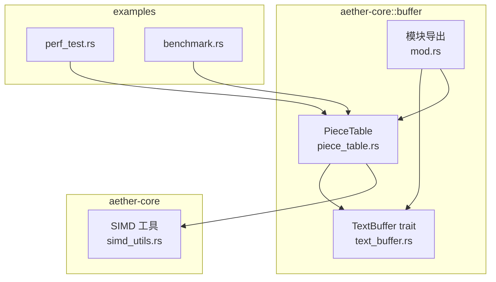
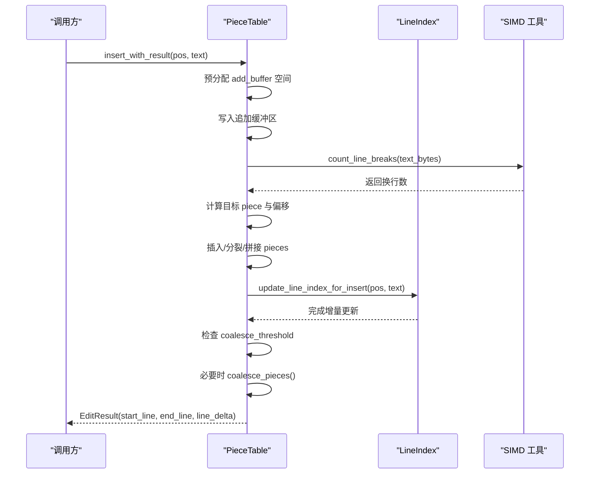
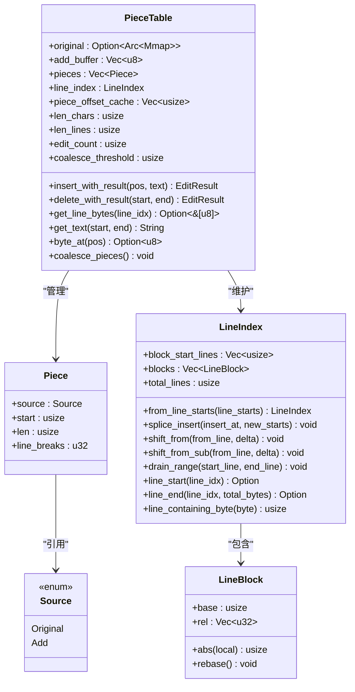
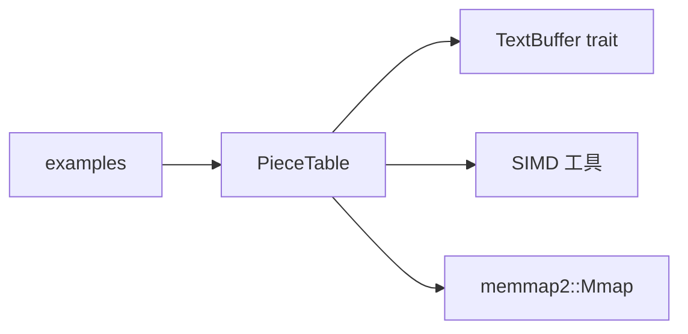

# Piece Table 算法详解

<cite>
**本文引用的文件**
- [piece_table.rs](file://crates/aether-core/src/buffer/piece_table.rs)
- [text_buffer.rs](file://crates/aether-core/src/buffer/text_buffer.rs)
- [mod.rs](file://crates/aether-core/src/buffer/mod.rs)
- [simd_utils.rs](file://crates/aether-core/src/simd_utils.rs)
- [perf_test.rs](file://crates/aether-core/examples/perf_test.rs)
- [benchmark.rs](file://crates/aether-core/examples/benchmark.rs)
</cite>

## 目录
1. [简介](#简介)
2. [项目结构](#项目结构)
3. [核心组件](#核心组件)
4. [架构总览](#架构总览)
5. [详细组件分析](#详细组件分析)
6. [依赖关系分析](#依赖关系分析)
7. [性能考量](#性能考量)
8. [故障排查指南](#故障排查指南)
9. [结论](#结论)
10. [附录：使用示例与最佳实践](#附录使用示例与最佳实践)

## 简介
本技术文档围绕 Piece Table 算法在 Aether 编辑器中的实现，系统阐述其数据结构设计、索引机制、内存布局优化，以及插入、删除、查找等操作的原理与时间复杂度。文档还覆盖 Piece 的合并策略、分裂机制、行索引维护、垃圾回收（碎片合并）过程，并提供构建与编辑操作的使用路径、边界处理建议、与标准字符串操作的对比优势，以及在大规模文本编辑场景下的性能表现与优化建议。

## 项目结构
Aether 的核心缓冲区位于 aether-core crate 的 buffer 模块中，Piece Table 是其中一种高性能文本存储方案，并通过 TextBuffer trait 对外暴露统一接口。SIMD 工具用于加速换行符计数与查找。

图表来源
- [piece_table.rs:11-35](file://crates/aether-core/src/buffer/piece_table.rs#L11-L35)
- [text_buffer.rs:1-49](file://crates/aether-core/src/buffer/text_buffer.rs#L1-L49)
- [mod.rs:1-9](file://crates/aether-core/src/buffer/mod.rs#L1-L9)
- [simd_utils.rs:1-18](file://crates/aether-core/src/simd_utils.rs#L1-L18)

章节来源
- [piece_table.rs:11-35](file://crates/aether-core/src/buffer/piece_table.rs#L11-L35)
- [text_buffer.rs:1-49](file://crates/aether-core/src/buffer/text_buffer.rs#L1-L49)
- [mod.rs:1-9](file://crates/aether-core/src/buffer/mod.rs#L1-L9)

## 核心组件
- PieceTable：高性能文本缓冲区，支持 O(1) 追加写入、O(log n) 定位、零拷贝读取大文件片段。
- Piece：指向原始文件或追加缓冲区的连续字节片段，包含源类型、起始偏移、长度和缓存的行断点数。
- Source：枚举，标识数据来源于 Original（内存映射）或 Add（追加缓冲区）。
- LineIndex：两级分块行索引，提供行号到字节偏移的高效转换，支持增量更新与块级平移。
- TextBuffer trait：抽象文本编辑接口，使上层代码与具体数据结构解耦。
- SIMD 工具：利用底层库进行换行符计数与查找，提升扫描性能。

章节来源
- [piece_table.rs:53-66](file://crates/aether-core/src/buffer/piece_table.rs#L53-L66)
- [piece_table.rs:73-114](file://crates/aether-core/src/buffer/piece_table.rs#L73-L114)
- [text_buffer.rs:1-49](file://crates/aether-core/src/buffer/text_buffer.rs#L1-L49)
- [simd_utils.rs:8-18](file://crates/aether-core/src/simd_utils.rs#L8-L18)

## 架构总览
Piece Table 采用“只追加”的追加缓冲区 + 内存映射的原始文件双源模型，通过有序 Piece 列表组织逻辑顺序。行索引以分块方式维护每行的起始字节位置，支持批量平移与局部插入/删除，避免全量重建。编辑操作会触发增量行索引更新，并在达到阈值时执行碎片合并以减少 Piece 数量。

图表来源
- [piece_table.rs:450-562](file://crates/aether-core/src/buffer/piece_table.rs#L450-L562)
- [piece_table.rs:991-1023](file://crates/aether-core/src/buffer/piece_table.rs#L991-L1023)
- [piece_table.rs:1843-1876](file://crates/aether-core/src/buffer/piece_table.rs#L1843-L1876)
- [simd_utils.rs:8-18](file://crates/aether-core/src/simd_utils.rs#L8-L18)

## 详细组件分析

### Piece 与 Source 设计
- Piece 记录 source、start、len、line_breaks，表示一段连续字节及其元信息。
- Source::Original 指向 Arc<Mmap> 共享的原始文件映射；Source::Add 指向 Vec<u8> 追加缓冲区。
- 优点：
  - 原始文件零拷贝打开与读取，适合大文件。
  - 追加缓冲区只增不减，避免频繁移动数据。
  - 通过 Piece 列表组合出逻辑顺序，支持高效插入与删除。

章节来源
- [piece_table.rs:53-66](file://crates/aether-core/src/buffer/piece_table.rs#L53-L66)
- [piece_table.rs:14-35](file://crates/aether-core/src/buffer/piece_table.rs#L14-L35)

### 行索引 LineIndex 与分块
- 两级分块：块级保存绝对基址，块内保存 u32 相对偏移，降低内存占用并支持增量平移。
- 关键操作：
  - from_line_starts：从完整行起始列表构建分块索引。
  - splice_insert：在指定行位置插入新行起始偏移，处理跨块与溢出。
  - shift_from / shift_from_sub：对从某行开始的后续行偏移进行整体加/减。
  - drain_range：删除指定行范围，维护块结构与前缀。
  - split_block_at_raw / split_oversized_raw：当块过大时按半分裂，控制单次编辑的 memmove 上界。
- 复杂度：
  - 行查找：O(log B + log K)，B 为块数，K 为块大小（默认 4096）。
  - 增量更新：O(K + B)，远优于旧实现的 O(N)。

章节来源
- [piece_table.rs:73-114](file://crates/aether-core/src/buffer/piece_table.rs#L73-L114)
- [piece_table.rs:125-179](file://crates/aether-core/src/buffer/piece_table.rs#L125-L179)
- [piece_table.rs:205-227](file://crates/aether-core/src/buffer/piece_table.rs#L205-L227)
- [piece_table.rs:231-276](file://crates/aether-core/src/buffer/piece_table.rs#L231-L276)
- [piece_table.rs:278-341](file://crates/aether-core/src/buffer/piece_table.rs#L278-L341)
- [piece_table.rs:343-379](file://crates/aether-core/src/buffer/piece_table.rs#L343-L379)

### 插入操作 insert_with_result
- 步骤：
  - 预分配追加缓冲区容量，减少重新分配。
  - 将文本写入追加缓冲区，统计换行符数量。
  - 若 pos 在末尾，直接 push 新 Piece。
  - 否则定位目标 Piece，根据偏移决定插入、分裂或拼接。
  - 增量更新行索引，必要时触发碎片合并。
- 时间复杂度：
  - 定位：O(log n) 使用 piece_offset_cache 二分查找。
  - 插入/分裂：O(n) 最坏情况（Vec 插入），但平均较小。
  - 行索引更新：O(K + B)。
- 边界处理：
  - 空表、pos 越界钳位、跨 piece 读取回退到 get_text。

章节来源
- [piece_table.rs:450-562](file://crates/aether-core/src/buffer/piece_table.rs#L450-L562)
- [piece_table.rs:881-932](file://crates/aether-core/src/buffer/piece_table.rs#L881-L932)
- [piece_table.rs:991-1023](file://crates/aether-core/src/buffer/piece_table.rs#L991-L1023)

### 删除操作 delete_with_result
- 步骤：
  - 钳位 end 防止越界。
  - 定位 start/end 所在 Piece 及偏移。
  - 单 Piece 内删除：可能缩减、截断或拆分。
  - 多 Piece 删除：保留两端剩余部分，替换中间区间。
  - 更新 len_chars/len_lines，增量更新行索引，必要时合并碎片。
- 时间复杂度：
  - 定位：O(log n)。
  - 删除/拼接：O(n) 最坏（splice），但受阈值控制。
  - 行索引更新：O(K + B)。

章节来源
- [piece_table.rs:569-688](file://crates/aether-core/src/buffer/piece_table.rs#L569-L688)
- [piece_table.rs:1025-1059](file://crates/aether-core/src/buffer/piece_table.rs#L1025-L1059)

### 查找与读取
- byte_at：O(log n) 获取单个字节，零拷贝无堆分配。
- get_line_bytes：优先零拷贝，若跨 Piece 则返回 None，调用方回退到 get_text。
- get_text：遍历 Pieces 拼接目标范围，使用 lossy 转换避免非 UTF-8 异常。
- line_byte_range：基于 LineIndex 快速得到行字节范围。

章节来源
- [piece_table.rs:710-741](file://crates/aether-core/src/buffer/piece_table.rs#L710-L741)
- [piece_table.rs:827-843](file://crates/aether-core/src/buffer/piece_table.rs#L827-L843)
- [piece_table.rs:857-879](file://crates/aether-core/src/buffer/piece_table.rs#L857-L879)
- [piece_table.rs:934-944](file://crates/aether-core/src/buffer/piece_table.rs#L934-L944)

### 合并策略与碎片回收
- 合并条件：相邻两个 Piece 均为 Source::Add 且连续（current.start + current.len == next.start）。
- 触发时机：edit_count 达到 coalesce_threshold（默认 32）后执行合并，重置计数器。
- 效果：减少 Piece 数量，降低后续查找与拼接开销。

章节来源
- [piece_table.rs:485-490](file://crates/aether-core/src/buffer/piece_table.rs#L485-L490)
- [piece_table.rs:679-684](file://crates/aether-core/src/buffer/piece_table.rs#L679-L684)
- [piece_table.rs:1843-1876](file://crates/aether-core/src/buffer/piece_table.rs#L1843-L1876)

### 分裂机制与行索引维护
- 行索引分裂：当块内行数超过 LINE_BLOCK_MAX 时，按半分裂为新块，保持块大小可控。
- 增量更新：
  - 插入：shift_from 平移后续行偏移，splice_insert 插入新行起始。
  - 删除：drain_range 删除行起始，shift_from_sub 调整后续偏移。
- 健壮性：rebase 处理 base 归一化，避免下溢；split_block_at_raw 保证 u32 相对偏移不溢出。

章节来源
- [piece_table.rs:205-227](file://crates/aether-core/src/buffer/piece_table.rs#L205-L227)
- [piece_table.rs:231-276](file://crates/aether-core/src/buffer/piece_table.rs#L231-L276)
- [piece_table.rs:278-341](file://crates/aether-core/src/buffer/piece_table.rs#L278-L341)
- [piece_table.rs:343-379](file://crates/aether-core/src/buffer/piece_table.rs#L343-L379)

### 类图：核心数据结构关系

图表来源
- [piece_table.rs:14-35](file://crates/aether-core/src/buffer/piece_table.rs#L14-L35)
- [piece_table.rs:53-66](file://crates/aether-core/src/buffer/piece_table.rs#L53-L66)
- [piece_table.rs:73-114](file://crates/aether-core/src/buffer/piece_table.rs#L73-L114)
- [piece_table.rs:125-179](file://crates/aether-core/src/buffer/piece_table.rs#L125-L179)
- [piece_table.rs:450-562](file://crates/aether-core/src/buffer/piece_table.rs#L450-L562)
- [piece_table.rs:569-688](file://crates/aether-core/src/buffer/piece_table.rs#L569-L688)
- [piece_table.rs:1843-1876](file://crates/aether-core/src/buffer/piece_table.rs#L1843-L1876)

## 依赖关系分析
- PieceTable 依赖：
  - TextBuffer trait：统一接口，便于替换实现。
  - SIMD 工具：加速换行符计数与查找。
  - memmap2：内存映射原始文件，实现零拷贝。
- 外部集成：
  - examples 中的 perf_test 与 benchmark 调用基准测试入口，验证性能。

图表来源
- [text_buffer.rs:1-49](file://crates/aether-core/src/buffer/text_buffer.rs#L1-L49)
- [simd_utils.rs:1-18](file://crates/aether-core/src/simd_utils.rs#L1-L18)
- [piece_table.rs:3-8](file://crates/aether-core/src/buffer/piece_table.rs#L3-L8)
- [perf_test.rs:1-18](file://crates/aether-core/examples/perf_test.rs#L1-L18)
- [benchmark.rs:1-18](file://crates/aether-core/examples/benchmark.rs#L1-L18)

章节来源
- [text_buffer.rs:1-49](file://crates/aether-core/src/buffer/text_buffer.rs#L1-L49)
- [simd_utils.rs:1-18](file://crates/aether-core/src/simd_utils.rs#L1-L18)
- [piece_table.rs:3-8](file://crates/aether-core/src/buffer/piece_table.rs#L3-L8)
- [perf_test.rs:1-18](file://crates/aether-core/examples/perf_test.rs#L1-L18)
- [benchmark.rs:1-18](file://crates/aether-core/examples/benchmark.rs#L1-L18)

## 性能考量
- 时间复杂度概览：
  - 插入：平均 O(log n + k)，k 为插入引起的 Piece 分裂与 Vec 插入代价；行索引更新 O(K + B)。
  - 删除：平均 O(log n + k)，k 为删除引起的 Piece 拼接与 Vec 删除代价；行索引更新 O(K + B)。
  - 查找：byte_at 与 find_piece_at_byte 为 O(log n)；get_line_bytes 零拷贝命中时为 O(1)。
- 内存布局优化：
  - 追加缓冲区只增不减，避免频繁移动。
  - 原始文件通过 Arc<Mmap> 共享，快照零拷贝。
  - 行索引分块降低内存占用，支持增量平移。
- 碎片合并：
  - 达到阈值后合并相邻 Add 片段，减少 Piece 数量，提升后续操作效率。
- 与标准字符串对比优势：
  - 标准 String 插入/删除需 O(n) 移动；Piece Table 通过分段与增量更新显著降低热点区域成本。
  - 大文件打开与读取零拷贝，避免全量加载。
- 常见陷阱与建议：
  - 避免频繁小插入导致碎片过多，合理设置 coalesce_threshold。
  - 跨 Piece 读取应回退到 get_text，不要假设零拷贝一定成功。
  - 行索引更新需严格处理边界（如 end_line 计算、rebase），防止幽灵行起点。

[本节为通用性能讨论，无需特定文件来源]

## 故障排查指南
- 常见问题：
  - 行索引不一致：检查删除时的 drain_end 计算与 rebase 逻辑，确保不会残留幽灵行起点。
  - 越界访问：确认 delete 的 end 钳位与 byte_at 的边界保护。
  - 非 UTF-8 内容：get_text 使用 lossy 转换，避免空字符串或异常。
- 调试建议：
  - 使用单元测试验证随机编辑后的行索引一致性。
  - 通过 get_line_bytes 与 get_text 对比，定位跨 Piece 读取问题。
  - 监控 edit_count 与 coalesce 触发频率，调整阈值。

章节来源
- [piece_table.rs:1025-1059](file://crates/aether-core/src/buffer/piece_table.rs#L1025-L1059)
- [piece_table.rs:569-688](file://crates/aether-core/src/buffer/piece_table.rs#L569-L688)
- [piece_table.rs:827-843](file://crates/aether-core/src/buffer/piece_table.rs#L827-L843)
- [piece_table.rs:1407-1455](file://crates/aether-core/src/buffer/piece_table.rs#L1407-L1455)

## 结论
Piece Table 通过分段存储、追加缓冲区、内存映射与分块行索引，实现了高效的大规模文本编辑能力。其插入/删除操作在热点区域具有显著优势，配合碎片合并与零拷贝读取，适合高并发、大文件的编辑器场景。合理配置阈值与关注边界处理，可进一步提升稳定性与性能。

[本节为总结性内容，无需特定文件来源]

## 附录：使用示例与最佳实践

### 构建 Piece Table
- 从字符串创建：适用于新文件或测试。
- 从文件创建：使用内存映射打开大文件，零拷贝加载。

章节来源
- [piece_table.rs:383-406](file://crates/aether-core/src/buffer/piece_table.rs#L383-L406)
- [piece_table.rs:408-448](file://crates/aether-core/src/buffer/piece_table.rs#L408-L448)

### 执行文本编辑操作
- 插入：
  - 使用 insert_with_result 获取受影响行范围，便于 UI 增量刷新。
  - 注意预分配追加缓冲区容量，减少重新分配。
- 删除：
  - 使用 delete_with_result 处理边界钳位与行索引更新。
  - 跨 Piece 删除时保留两端剩余部分。

章节来源
- [piece_table.rs:450-562](file://crates/aether-core/src/buffer/piece_table.rs#L450-L562)
- [piece_table.rs:569-688](file://crates/aether-core/src/buffer/piece_table.rs#L569-L688)

### 处理边界情况
- 空表插入：允许直接 push 新 Piece。
- 跨 Piece 读取：get_line_bytes 返回 None 时回退到 get_text。
- 行索引边界：end_line 计算与 rebase 避免下溢与幽灵行。

章节来源
- [piece_table.rs:472-493](file://crates/aether-core/src/buffer/piece_table.rs#L472-L493)
- [piece_table.rs:710-741](file://crates/aether-core/src/buffer/piece_table.rs#L710-L741)
- [piece_table.rs:312-341](file://crates/aether-core/src/buffer/piece_table.rs#L312-L341)

### 性能基准与测试
- 运行性能测试：通过 examples 中的入口执行基准测试套件。
- 单元测试覆盖：包括大量随机编辑、跨块删除、CRLF 处理等场景。

章节来源
- [perf_test.rs:1-18](file://crates/aether-core/examples/perf_test.rs#L1-L18)
- [benchmark.rs:1-18](file://crates/aether-core/examples/benchmark.rs#L1-L18)
- [piece_table.rs:1078-1455](file://crates/aether-core/src/buffer/piece_table.rs#L1078-L1455)