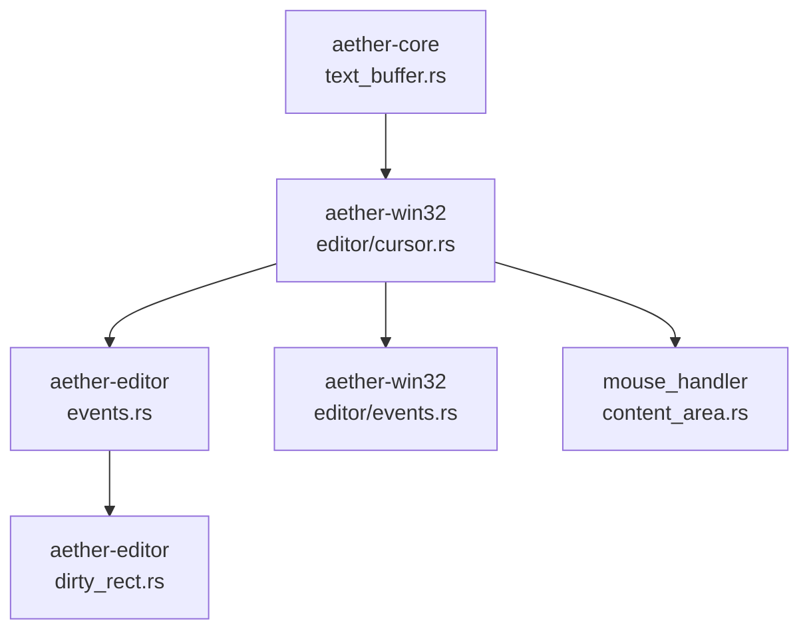
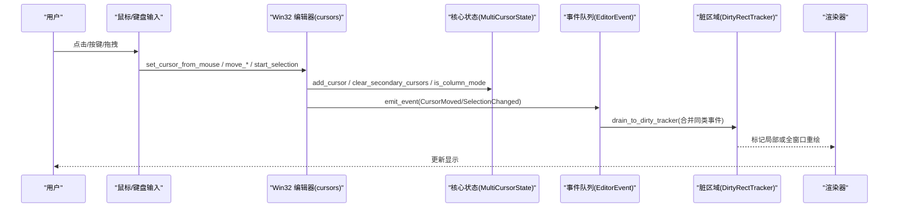
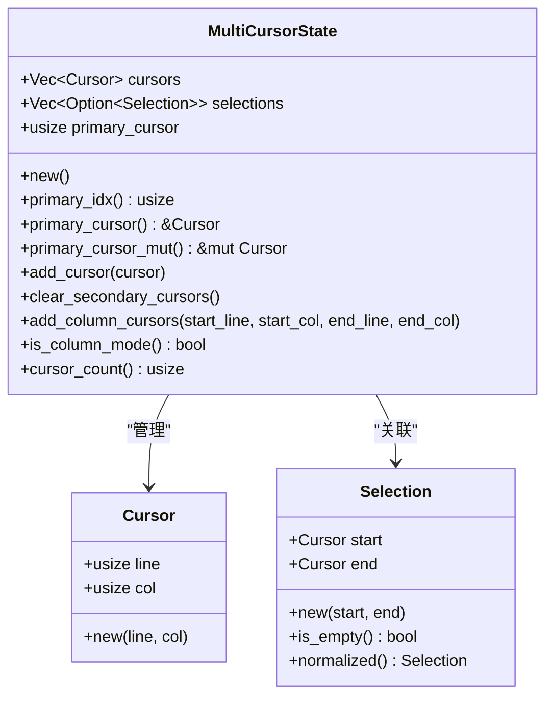
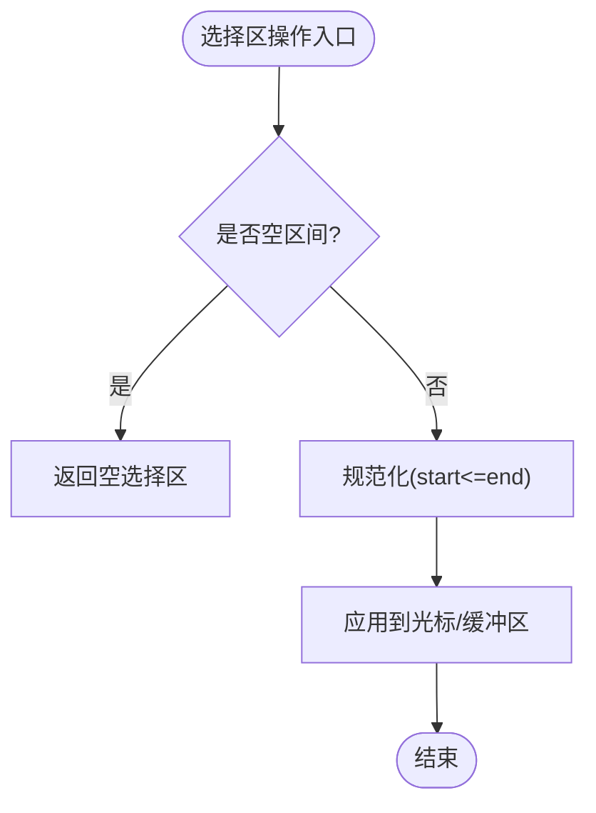
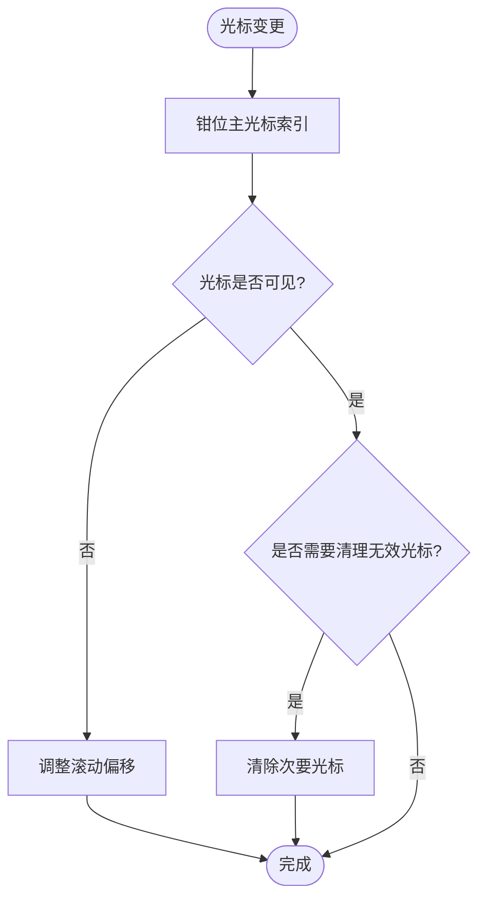
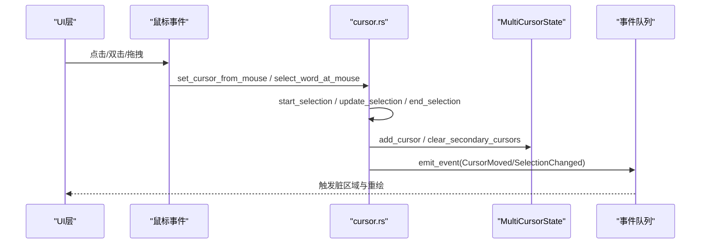
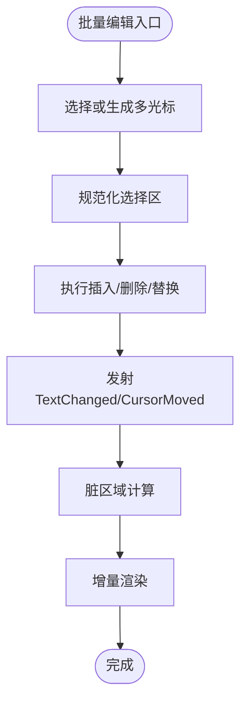
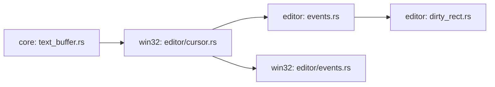

# 多光标和选择区处理

<cite>
**本文引用的文件**
- [text_buffer.rs](file://crates/aether-core/src/buffer/text_buffer.rs)
- [cursor.rs](file://crates/aether-win32/src/editor/cursor.rs)
- [events.rs（编辑器事件）](file://crates/aether-editor/src/events.rs)
- [events.rs（Win32 编辑器事件）](file://crates/aether-win32/src/editor/events.rs)
- [dirty_rect.rs（aether-editor）](file://crates/aether-editor/src/dirty_rect.rs)
- [l_button_down/content_area.rs](file://crates/aether-win32/src/window/mouse_handler/l_button_down/content_area.rs)
</cite>

## 目录
1. [简介](#简介)
2. [项目结构](#项目结构)
3. [核心组件](#核心组件)
4. [架构总览](#架构总览)
5. [详细组件分析](#详细组件分析)
6. [依赖关系分析](#依赖关系分析)
7. [性能考虑](#性能考虑)
8. [故障排查指南](#故障排查指南)
9. [结论](#结论)
10. [附录：使用示例与最佳实践](#附录使用示例与最佳实践)

## 简介
本技术文档聚焦于“多光标与选择区处理”能力，围绕以下目标展开：
- 深入解释 MultiCursorState 的设计：光标集合管理、主光标同步、列选择模式。
- 详细说明 Selection 的实现：创建、规范化、空区间判断等。
- 文档化光标位置验证、边界检查与无效光标清理机制。
- 提供具体代码路径示例，展示如何添加多个光标、处理选择区变更、执行批量编辑。
- 解释与用户交互的集成方式：鼠标点击、键盘快捷键、触摸手势（通过输入事件管线）。
- 包含性能优化策略：增量更新、脏区域计算、事件合并与视口优先高亮。

## 项目结构
与多光标/选择区相关的核心代码分布在如下模块：
- 核心数据结构与状态：位于 aether-core 文本缓冲区层，定义 Cursor、Selection、MultiCursorState 以及编辑操作类型与结果。
- 编辑器交互与光标控制：位于 aether-win32 编辑器层，实现光标移动、选择区开始/更新/结束、鼠标定位、批量添加光标等。
- 事件系统与脏区域：位于 aether-editor 与 aether-win32 的事件模块，负责将模型变化转换为渲染所需的脏矩形，并进行事件合并与增量重绘。

图表来源
- [text_buffer.rs:173-258](file://crates/aether-core/src/buffer/text_buffer.rs#L173-L258)
- [cursor.rs:283-759](file://crates/aether-win32/src/editor/cursor.rs#L283-L759)
- [events.rs（编辑器事件）:10-186](file://crates/aether-editor/src/events.rs#L10-L186)
- [events.rs（Win32 编辑器事件）:112-221](file://crates/aether-win32/src/editor/events.rs#L112-L221)
- [dirty_rect.rs（aether-editor）:87-181](file://crates/aether-editor/src/dirty_rect.rs#L87-L181)
- [l_button_down/content_area.rs:1773-1802](file://crates/aether-win32/src/window/mouse_handler/l_button_down/content_area.rs#L1773-L1802)

章节来源
- [text_buffer.rs:173-258](file://crates/aether-core/src/buffer/text_buffer.rs#L173-L258)
- [cursor.rs:283-759](file://crates/aether-win32/src/editor/cursor.rs#L283-L759)
- [events.rs（编辑器事件）:10-186](file://crates/aether-editor/src/events.rs#L10-L186)
- [events.rs（Win32 编辑器事件）:112-221](file://crates/aether-win32/src/editor/events.rs#L112-L221)
- [dirty_rect.rs（aether-editor）:87-181](file://crates/aether-editor/src/dirty_rect.rs#L87-L181)
- [l_button_down/content_area.rs:1773-1802](file://crates/aether-win32/src/window/mouse_handler/l_button_down/content_area.rs#L1773-L1802)

## 核心组件
- Cursor：表示行号与字节列的光标位置。
- Selection：由 start 与 end 两个 Cursor 组成，支持空区间判断与规范化（确保 start <= end）。
- MultiCursorState：维护多个光标及其对应选择区，支持主光标访问、添加光标、清除次要光标、列选择模式等。
- Editor 光标控制：提供光标移动、选择区生命周期管理、鼠标定位、批量添加光标等。
- 事件系统：将光标/选择区变化转化为 EditorEvent，并驱动脏区域计算与增量渲染。

章节来源
- [text_buffer.rs:83-122](file://crates/aether-core/src/buffer/text_buffer.rs#L83-L122)
- [text_buffer.rs:173-258](file://crates/aether-core/src/buffer/text_buffer.rs#L173-L258)
- [cursor.rs:283-759](file://crates/aether-win32/src/editor/cursor.rs#L283-L759)
- [events.rs（编辑器事件）:10-186](file://crates/aether-editor/src/events.rs#L10-L186)

## 架构总览
下图展示了从用户交互到数据模型再到渲染更新的完整流程：

图表来源
- [cursor.rs:688-759](file://crates/aether-win32/src/editor/cursor.rs#L688-L759)
- [text_buffer.rs:173-258](file://crates/aether-core/src/buffer/text_buffer.rs#L173-L258)
- [events.rs（编辑器事件）:84-186](file://crates/aether-editor/src/events.rs#L84-L186)
- [events.rs（Win32 编辑器事件）:122-221](file://crates/aether-win32/src/editor/events.rs#L122-L221)

## 详细组件分析

### MultiCursorState 设计
- 字段说明：
  - cursors：光标集合，每个元素为 Cursor（line, col）。
  - selections：与光标一一对应的可选选择区，None 表示无选择区。
  - primary_cursor：主光标索引，内部通过钳位访问避免越界。
- 关键方法：
  - new()：初始化默认单光标与空选择区。
  - primary_idx()：返回安全的主光标索引（钳位到有效范围）。
  - primary_cursor()/primary_cursor_mut()：获取/修改主光标。
  - add_cursor(cursor)：追加新光标及空选择区。
  - clear_secondary_cursors()：保留主光标及其选择区，删除其余光标。
  - add_column_cursors(start_line, start_col, end_line, end_col)：生成列选择模式的多光标（矩形选区），并设置主光标为第一个。
  - is_column_mode()：当存在多个光标且所有选择区均为 None 时，判定为列选择模式。
- 复杂度与行为：
  - 添加光标 O(1)，清除次要光标 O(n)。
  - 列选择模式按行数线性生成光标，时间复杂度 O(k)（k 为行数跨度）。

图表来源
- [text_buffer.rs:83-122](file://crates/aether-core/src/buffer/text_buffer.rs#L83-L122)
- [text_buffer.rs:173-258](file://crates/aether-core/src/buffer/text_buffer.rs#L173-L258)

章节来源
- [text_buffer.rs:173-258](file://crates/aether-core/src/buffer/text_buffer.rs#L173-L258)

### Selection 结构与选择区逻辑
- 创建与空判断：
  - Selection::new(start, end)：构造选择区。
  - is_empty()：start == end 时为真。
- 规范化：
  - normalized()：若 start > end，则交换两端，保证 start <= end；用于统一方向以便后续计算。
- 与 MultiCursorState 的关系：
  - selections[i] 对应第 i 个光标的选择区；列选择模式下通常为 None。
- 典型用法：
  - 在鼠标按下时记录起点，拖动过程中更新终点，松开时完成选择。
  - 在批量编辑前对选择区进行规范化，确保插入/删除范围正确。

图表来源
- [text_buffer.rs:96-122](file://crates/aether-core/src/buffer/text_buffer.rs#L96-L122)

章节来源
- [text_buffer.rs:96-122](file://crates/aether-core/src/buffer/text_buffer.rs#L96-L122)

### 光标位置验证、边界检查与无效光标清理
- 主光标索引钳位：
  - primary_idx() 将 primary_cursor 限制在 [0, cursors.len()-1]，防止外部非法值导致越界 panic。
- 光标可见性与滚动：
  - ensure_cursor_visible_vertical/horizontal：根据光标位置调整滚动偏移，确保光标始终可见。
- 无效光标清理：
  - clear_secondary_cursors()：仅保留主光标与其选择区，删除其他光标，避免多余状态。
- 列选择模式检测：
  - is_column_mode()：当存在多个光标且全部无选择区时进入列选择模式，便于批量编辑。

图表来源
- [text_buffer.rs:191-223](file://crates/aether-core/src/buffer/text_buffer.rs#L191-L223)
- [cursor.rs:146-159](file://crates/aether-win32/src/editor/cursor.rs#L146-L159)
- [cursor.rs:95-144](file://crates/aether-win32/src/editor/cursor.rs#L95-L144)

章节来源
- [text_buffer.rs:191-223](file://crates/aether-core/src/buffer/text_buffer.rs#L191-L223)
- [cursor.rs:95-159](file://crates/aether-win32/src/editor/cursor.rs#L95-L159)

### 用户交互集成：鼠标、键盘与手势
- 鼠标点击定位：
  - set_cursor_from_mouse：根据鼠标坐标计算行/列，考虑字符宽度与可视列折算，支持就近吸附。
  - select_word_at_mouse：双击选词，基于当前行词边界确定选择区。
- 选择区生命周期：
  - start_selection/update_selection/end_selection/clear_selection：管理选择区的开始、更新、结束与清空。
- 键盘快捷键与批量操作：
  - add_cursor_line_below/above：在上下行同列添加光标。
  - add_cursor_at_next_occurrence：查找下一个相同单词并添加光标，同时设置选择区。
- 触摸手势：
  - 通过输入事件管线（如 mouse_move/l_button_down）映射到光标与选择区操作，保持与鼠标一致的行为。

图表来源
- [cursor.rs:688-759](file://crates/aether-win32/src/editor/cursor.rs#L688-L759)
- [cursor.rs:545-686](file://crates/aether-win32/src/editor/cursor.rs#L545-L686)
- [events.rs（编辑器事件）:84-186](file://crates/aether-editor/src/events.rs#L84-L186)

章节来源
- [cursor.rs:545-759](file://crates/aether-win32/src/editor/cursor.rs#L545-L759)
- [l_button_down/content_area.rs:1773-1802](file://crates/aether-win32/src/window/mouse_handler/l_button_down/content_area.rs#L1773-L1802)

### 批量编辑与选择区变更
- 批量添加光标：
  - add_cursor_line_below/above：在当前光标上下行同列添加新光标，并更新主光标位置。
  - add_cursor_at_next_occurrence：搜索下一个匹配项并添加光标，同时设置选择区以指示选中内容。
- 选择区变更：
  - start_selection/update_selection/end_selection：在拖拽中实时更新选择区终点，结束时提交变更。
- 与缓冲区交互：
  - 在批量编辑前，先规范化选择区，再调用缓冲区的 insert/delete/replace 等操作。
  - 每次编辑后发射 TextChanged/CursorMoved 事件，驱动脏区域更新。

图表来源
- [cursor.rs:545-686](file://crates/aether-win32/src/editor/cursor.rs#L545-L686)
- [events.rs（Win32 编辑器事件）:112-221](file://crates/aether-win32/src/editor/events.rs#L112-L221)

章节来源
- [cursor.rs:545-686](file://crates/aether-win32/src/editor/cursor.rs#L545-L686)
- [events.rs（Win32 编辑器事件）:112-221](file://crates/aether-win32/src/editor/events.rs#L112-L221)

## 依赖关系分析
- 核心数据结构（Cursor/Selection/MultiCursorState）被编辑器交互层引用，用于管理光标与选择区。
- 编辑器交互层（cursor.rs）依赖核心状态，并通过事件系统（events.rs）通知渲染层。
- 事件系统（events.rs）负责合并同类事件，降低重复重绘开销。
- 脏区域追踪器（dirty_rect.rs）接收事件并计算需要重绘的区域，支持局部与全窗口重绘。

图表来源
- [text_buffer.rs:173-258](file://crates/aether-core/src/buffer/text_buffer.rs#L173-L258)
- [cursor.rs:283-759](file://crates/aether-win32/src/editor/cursor.rs#L283-L759)
- [events.rs（编辑器事件）:10-186](file://crates/aether-editor/src/events.rs#L10-L186)
- [events.rs（Win32 编辑器事件）:112-221](file://crates/aether-win32/src/editor/events.rs#L112-L221)
- [dirty_rect.rs（aether-editor）:87-181](file://crates/aether-editor/src/dirty_rect.rs#L87-L181)

章节来源
- [text_buffer.rs:173-258](file://crates/aether-core/src/buffer/text_buffer.rs#L173-L258)
- [cursor.rs:283-759](file://crates/aether-win32/src/editor/cursor.rs#L283-L759)
- [events.rs（编辑器事件）:10-186](file://crates/aether-editor/src/events.rs#L10-L186)
- [events.rs（Win32 编辑器事件）:112-221](file://crates/aether-win32/src/editor/events.rs#L112-L221)
- [dirty_rect.rs（aether-editor）:87-181](file://crates/aether-editor/src/dirty_rect.rs#L87-L181)

## 性能考虑
- 事件合并：
  - EventQueue 将连续的 CursorMoved/SelectionChanged/Scrolled 合并为单次事件，减少渲染负担。
- 脏区域计算：
  - DirtyRectTracker 合并重叠矩形，超过阈值时降级为全窗口重绘，避免过多小区域重绘。
- 视口优先高亮：
  - 重建缓存时优先处理可见区域与扩展区域，大文件模式下跳过不可见区域的高亮，提升响应速度。
- 增量更新：
  - 光标移动与选择区变更仅标记相关行或区域为脏，结合滚动可见性计算，最小化重绘范围。

章节来源
- [events.rs（编辑器事件）:84-186](file://crates/aether-editor/src/events.rs#L84-L186)
- [dirty_rect.rs（aether-editor）:87-181](file://crates/aether-editor/src/dirty_rect.rs#L87-L181)
- [events.rs（Win32 编辑器事件）:401-621](file://crates/aether-win32/src/editor/events.rs#L401-L621)

## 故障排查指南
- 光标不可见：
  - 检查 ensure_cursor_visible_vertical/horizontal 是否被调用，确认滚动偏移是否正确更新。
- 选择区异常：
  - 确认 Selection::normalized() 是否被调用，确保 start <= end。
  - 检查 start_selection/update_selection/end_selection 的生命周期是否完整。
- 多光标状态不一致：
  - 使用 clear_secondary_cursors() 清理多余光标，确保主光标索引通过 primary_idx() 访问。
- 渲染残影：
  - 确认事件队列是否正确合并与刷新，脏区域是否准确标记。

章节来源
- [cursor.rs:95-159](file://crates/aether-win32/src/editor/cursor.rs#L95-L159)
- [text_buffer.rs:191-223](file://crates/aether-core/src/buffer/text_buffer.rs#L191-L223)
- [events.rs（编辑器事件）:84-186](file://crates/aether-editor/src/events.rs#L84-L186)

## 结论
本项目在多光标与选择区处理上实现了清晰的数据模型与高效的交互流程：
- MultiCursorState 提供了健壮的光标管理与列选择模式支持。
- Selection 结构简单明确，规范化与空区间判断保障了编辑操作的正确性。
- 编辑器交互层将用户输入转化为状态变更，并通过事件系统与脏区域机制驱动增量渲染。
- 性能优化策略（事件合并、脏区域计算、视口优先高亮）确保了在大文件场景下的流畅体验。

## 附录：使用示例与最佳实践
- 添加多个光标：
  - 参考路径：[cursor.rs:545-686](file://crates/aether-win32/src/editor/cursor.rs#L545-L686)
  - 步骤：在当前光标上下行添加光标，或使用“查找下一个相同单词”功能。
- 处理选择区变更：
  - 参考路径：[cursor.rs:736-759](file://crates/aether-win32/src/editor/cursor.rs#L736-L759)
  - 步骤：start_selection -> update_selection -> end_selection，必要时规范化选择区。
- 执行批量编辑：
  - 参考路径：[events.rs（Win32 编辑器事件）:112-221](file://crates/aether-win32/src/editor/events.rs#L112-L221)
  - 步骤：基于选择区或光标集合执行 insert/delete/replace，发射 TextChanged/CursorMoved 事件。
- 与用户交互集成：
  - 鼠标点击：参考路径 [cursor.rs:688-759](file://crates/aether-win32/src/editor/cursor.rs#L688-L759)
  - 键盘快捷键：参考路径 [cursor.rs:545-686](file://crates/aether-win32/src/editor/cursor.rs#L545-L686)
  - 触摸手势：通过输入事件管线映射到光标与选择区操作。

章节来源
- [cursor.rs:545-759](file://crates/aether-win32/src/editor/cursor.rs#L545-L759)
- [events.rs（Win32 编辑器事件）:112-221](file://crates/aether-win32/src/editor/events.rs#L112-L221)