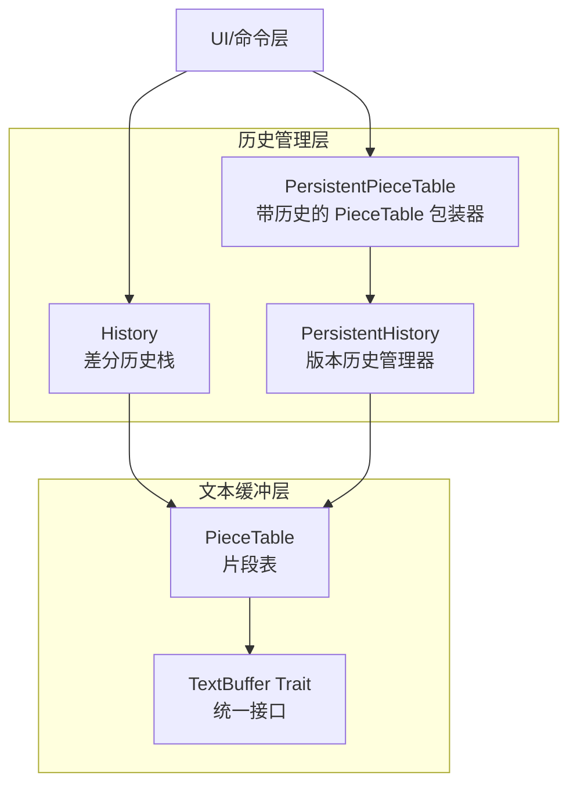
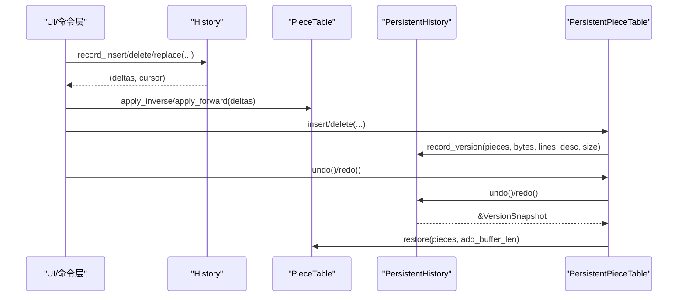
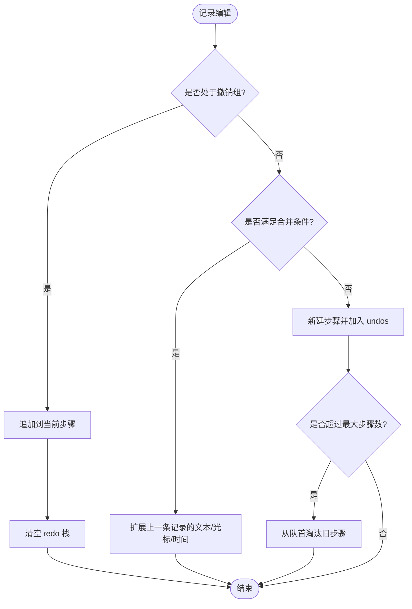
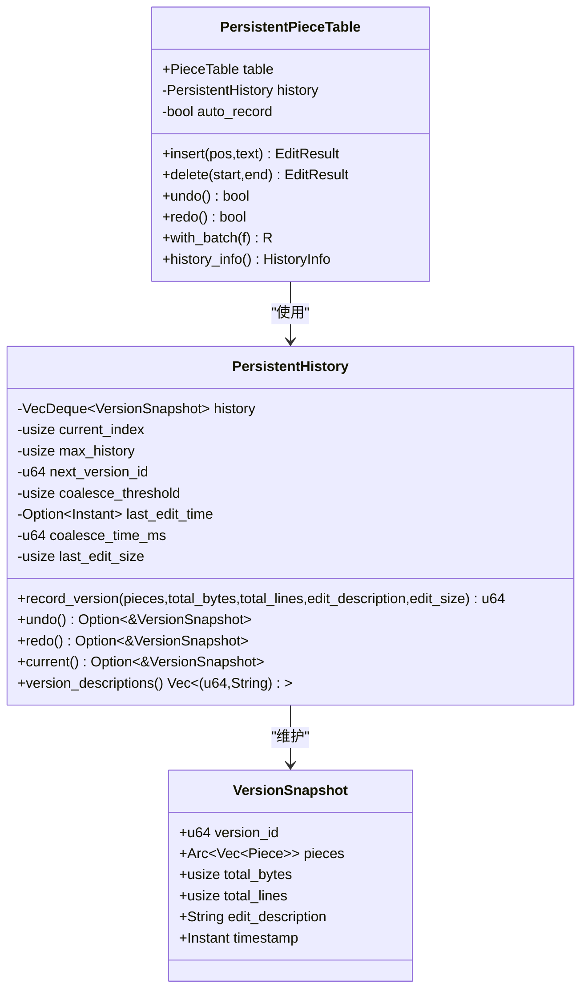
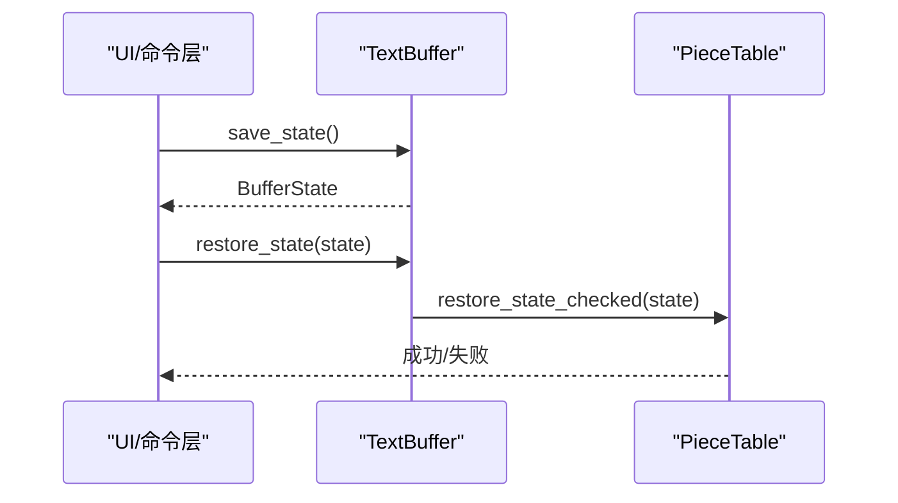
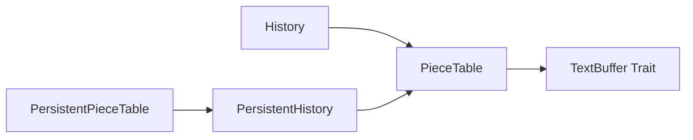

# 撤销重做机制

<cite>
**本文引用的文件**
- [history.rs](file://crates/aether-core/src/buffer/history.rs)
- [persistent_history.rs](file://crates/aether-core/src/persistent_history.rs)
- [text_buffer.rs](file://crates/aether-core/src/buffer/text_buffer.rs)
- [piece_table.rs](file://crates/aether-core/src/buffer/piece_table.rs)
- [mod.rs](file://crates/aether-core/src/buffer/mod.rs)
</cite>

## 目录
1. [简介](#简介)
2. [项目结构](#项目结构)
3. [核心组件](#核心组件)
4. [架构总览](#架构总览)
5. [详细组件分析](#详细组件分析)
6. [依赖关系分析](#依赖关系分析)
7. [性能考量](#性能考量)
8. [故障排查指南](#故障排查指南)
9. [结论](#结论)
10. [附录](#附录)

## 简介
本技术文档围绕编辑器中的“撤销/重做”机制，系统阐述历史栈的数据结构设计、操作序列管理、状态快照与持久化方案；解释撤销/重做的实现原理（逆运算、状态恢复、依赖处理）；并给出历史记录压缩策略、内存优化、并发安全保证与错误恢复机制。最后提供性能调优建议，包括历史记录限制、批量操作处理和内存泄漏防护。

## 项目结构
撤销重做能力由两套互补的子系统构成：
- 基于差分的轻量级历史栈：记录最小可逆编辑单元，适合高频输入场景，避免完整缓冲区拷贝。
- 基于版本快照的持久化历史：利用 PieceTable 的不可变片段共享特性，以 Arc 包装版本片段列表，支持高效撤销/重做与批量合并。

**图表来源**
- [history.rs:14-28](file://crates/aether-core/src/buffer/history.rs#L14-L28)
- [persistent_history.rs:13-50](file://crates/aether-core/src/persistent_history.rs#L13-L50)
- [persistent_history.rs:240-376](file://crates/aether-core/src/persistent_history.rs#L240-L376)
- [piece_table.rs:1550-1672](file://crates/aether-core/src/buffer/piece_table.rs#L1550-L1672)

**章节来源**
- [history.rs:14-28](file://crates/aether-core/src/buffer/history.rs#L14-L28)
- [persistent_history.rs:13-50](file://crates/aether-core/src/persistent_history.rs#L13-L50)
- [text_buffer.rs:1-49](file://crates/aether-core/src/buffer/text_buffer.rs#L1-L49)
- [piece_table.rs:1550-1672](file://crates/aether-core/src/buffer/piece_table.rs#L1550-L1672)

## 核心组件
- EditDelta：表示一次可逆的编辑差分（插入/删除/替换），提供正向应用与逆向应用方法。
- EditRecord：单条编辑记录，包含差分、光标前后位置和时间戳。
- History：基于 VecDeque 的撤销/重做栈，支持撤销组、连续输入合并、步骤数量限制。
- VersionSnapshot：持久化版本快照，包含片段列表（Arc<Vec<Piece>>）、字节数、行数、描述和时间戳。
- PersistentHistory：环形缓冲区维护版本历史，支持时间/大小合并、溢出保护、当前版本索引。
- PersistentPieceTable：对 PieceTable 的包装，自动记录版本并提供 undo/redo 与批量操作。
- TextBuffer 与 BufferState：统一的文本缓冲接口与状态保存/恢复抽象，供 Undo/Redo 使用。

**章节来源**
- [history.rs:30-110](file://crates/aether-core/src/buffer/history.rs#L30-L110)
- [history.rs:112-340](file://crates/aether-core/src/buffer/history.rs#L112-L340)
- [persistent_history.rs:7-50](file://crates/aether-core/src/persistent_history.rs#L7-L50)
- [persistent_history.rs:52-238](file://crates/aether-core/src/persistent_history.rs#L52-L238)
- [persistent_history.rs:240-376](file://crates/aether-core/src/persistent_history.rs#L240-L376)
- [text_buffer.rs:1-49](file://crates/aether-core/src/buffer/text_buffer.rs#L1-L49)
- [text_buffer.rs:61-81](file://crates/aether-core/src/buffer/text_buffer.rs#L61-L81)

## 架构总览
撤销重做采用“差分 + 版本快照”双轨设计：
- 高频编辑路径走 History 差分栈，记录最小可逆单元，支持合并与分组，避免大对象拷贝。
- 需要跨会话或更稳定状态的场景使用 PersistentHistory 版本快照，借助 PieceTable 的不可变片段共享，降低内存占用。

**图表来源**
- [history.rs:140-323](file://crates/aether-core/src/buffer/history.rs#L140-L323)
- [persistent_history.rs:66-136](file://crates/aether-core/src/persistent_history.rs#L66-L136)
- [persistent_history.rs:298-321](file://crates/aether-core/src/persistent_history.rs#L298-L321)
- [piece_table.rs:1645-1672](file://crates/aether-core/src/buffer/piece_table.rs#L1645-L1672)

## 详细组件分析

### 差分历史栈（History）
- 数据结构
  - undos/redos：VecDeque<Vec<EditRecord>>，支持 O(1) 淘汰与步长限制。
  - merge_state：跟踪连续同位置插入/删除，在时间窗口内合并为一条记录。
  - grouping/group_open：撤销组模式，组内多条记录合成一个撤销步骤，互不合并。
- 操作语义
  - record_insert/record_delete/record_replace：记录编辑差分与光标变化，必要时合并。
  - undo/redo：返回需按序应用的差分列表与目标光标位置；撤销时清空 redo 栈。
  - push_record：组模式下追加到当前步骤，否则新建步骤；超过 max_records 则从队首淘汰。
- 复杂度与优化
  - 每条记录仅存储差分与光标信息，显著降低内存占用。
  - 连续输入合并减少步骤数量，提升用户体验。
  - 撤销组确保复杂操作的原子性。

**图表来源**
- [history.rs:140-301](file://crates/aether-core/src/buffer/history.rs#L140-L301)

**章节来源**
- [history.rs:14-110](file://crates/aether-core/src/buffer/history.rs#L14-L110)
- [history.rs:112-340](file://crates/aether-core/src/buffer/history.rs#L112-L340)

### 版本快照历史（PersistentHistory 与 PersistentPieceTable）
- 数据结构
  - VersionSnapshot：包含版本ID、Arc<Vec<Piece>>、字节数、行数、描述、时间戳。
  - PersistentHistory：环形缓冲区维护版本历史，支持时间/大小合并、溢出保护、当前版本索引。
- 操作语义
  - record_version：根据编辑大小与时间窗口决定是否合并到当前版本；创建新版本后更新索引与限制长度。
  - undo/redo：移动 current_index 并返回对应版本的快照引用。
  - PersistentPieceTable：封装 PieceTable，自动记录版本并提供 with_batch 批量操作。
- 复杂度与优化
  - 通过 Arc 共享片段列表，undo/redo 仅增加引用计数，避免完整拷贝。
  - 合并小编辑减少历史条目，降低内存压力。
  - 溢出时优先保留当前版本附近的历史，避免用户跳至最新条目。

**图表来源**
- [persistent_history.rs:7-50](file://crates/aether-core/src/persistent_history.rs#L7-L50)
- [persistent_history.rs:52-238](file://crates/aether-core/src/persistent_history.rs#L52-L238)
- [persistent_history.rs:240-376](file://crates/aether-core/src/persistent_history.rs#L240-L376)

**章节来源**
- [persistent_history.rs:66-136](file://crates/aether-core/src/persistent_history.rs#L66-L136)
- [persistent_history.rs:157-238](file://crates/aether-core/src/persistent_history.rs#L157-L238)
- [persistent_history.rs:298-376](file://crates/aether-core/src/persistent_history.rs#L298-L376)

### 文本缓冲集成（TextBuffer 与 PieceTable）
- TextBuffer 接口定义统一的插入、删除、切片、行号转换、快照创建与状态保存/恢复方法。
- PieceTable 实现 TextBuffer，并提供 save_state/restore_state 用于 Undo/Redo 的状态恢复。
- 快照创建采用零拷贝策略（Arc<Mmap> 共享），避免大文件打开时的全量拷贝。

**图表来源**
- [text_buffer.rs:1-49](file://crates/aether-core/src/buffer/text_buffer.rs#L1-L49)
- [piece_table.rs:1645-1672](file://crates/aether-core/src/buffer/piece_table.rs#L1645-L1672)

**章节来源**
- [text_buffer.rs:1-49](file://crates/aether-core/src/buffer/text_buffer.rs#L1-L49)
- [piece_table.rs:1550-1672](file://crates/aether-core/src/buffer/piece_table.rs#L1550-L1672)

## 依赖关系分析
- History 依赖 PieceTable 进行实际的插入/删除操作，并通过 EditDelta 的 apply_inverse/apply_forward 完成撤销/重做。
- PersistentHistory 依赖 PieceTable 的 get_pieces/len_bytes/len_lines 获取版本元数据，并使用 Arc 共享片段列表。
- TextBuffer 作为抽象层，使上层代码与具体数据结构解耦，便于切换实现或扩展功能。

**图表来源**
- [history.rs:30-77](file://crates/aether-core/src/buffer/history.rs#L30-L77)
- [persistent_history.rs:240-376](file://crates/aether-core/src/persistent_history.rs#L240-L376)
- [text_buffer.rs:1-49](file://crates/aether-core/src/buffer/text_buffer.rs#L1-L49)

**章节来源**
- [history.rs:30-77](file://crates/aether-core/src/buffer/history.rs#L30-L77)
- [persistent_history.rs:240-376](file://crates/aether-core/src/persistent_history.rs#L240-L376)
- [text_buffer.rs:1-49](file://crates/aether-core/src/buffer/text_buffer.rs#L1-L49)

## 性能考量
- 历史记录限制
  - History 默认最大步骤数为 10000，超出时从队首淘汰，避免无限增长。
  - PersistentHistory 支持配置最大历史条目数，并在溢出时优先保留当前版本附近的历史。
- 批量操作处理
  - History 支持撤销组（begin_group/end_group），将多个编辑合并为一个撤销步骤。
  - PersistentPieceTable 提供 with_batch，批量操作结束后只记录一次历史。
- 内存优化
  - History 仅记录差分与光标信息，避免完整缓冲区拷贝。
  - PersistentHistory 使用 Arc<Vec<Piece>> 共享片段列表，undo/redo 仅增加引用计数。
  - PieceTable 快照创建采用零拷贝策略（Arc<Mmap> 共享）。
- 合并策略
  - History 在 500ms 时间窗口内对同位置插入/删除进行合并。
  - PersistentHistory 根据编辑大小与时间窗口决定是否合并到当前版本。

[本节为通用性能指导，无需特定文件来源]

## 故障排查指南
- 状态恢复失败
  - PieceTable 的 restore_state_checked 会对反序列化后的 piece 进行严格校验，任何字段越界或损坏都会返回错误，调用方可选择保留旧状态。
  - 若发生 add_buffer_len 异常（保存时长度大于当前长度），说明 add_buffer 被异常截断，应检查并发写入或持久化逻辑。
- 历史栈不一致
  - 新记录会清空 redo 栈，确保撤销/重做路径的一致性。
  - 撤销组模式会禁用合并，确保组内记录独立且可逆。
- 并发安全
  - TextBuffer 接口要求 Send + Sync，支持后台线程安全访问。
  - PieceTable 快照创建采用零拷贝策略，避免锁竞争。

**章节来源**
- [piece_table.rs:1662-1672](file://crates/aether-core/src/buffer/piece_table.rs#L1662-L1672)
- [history.rs:282-301](file://crates/aether-core/src/buffer/history.rs#L282-L301)
- [text_buffer.rs:1-49](file://crates/aether-core/src/buffer/text_buffer.rs#L1-L49)

## 结论
本项目通过“差分历史栈 + 版本快照历史”的双轨设计，实现了高效、可扩展的撤销/重做机制。差分历史栈适用于高频编辑场景，版本快照历史适用于需要稳定状态的场景。两者均充分利用了 PieceTable 的不可变片段共享特性，显著降低了内存占用并提升了性能。通过合理的合并策略、批量操作支持与严格的错误恢复机制，系统在用户体验与资源消耗之间取得了良好平衡。

[本节为总结性内容，无需特定文件来源]

## 附录
- 关键数据结构与算法复杂度
  - History：VecDeque 支持 O(1) 入队/出队，步骤限制为 O(1) 淘汰。
  - PersistentHistory：环形缓冲区，版本合并为 O(1) 判断与更新。
  - PieceTable：片段表支持 O(1) 插入/删除，行索引支持 O(log n) 查找。
- 代码示例路径
  - 记录插入操作：[history.rs:140-196](file://crates/aether-core/src/buffer/history.rs#L140-L196)
  - 记录删除操作：[history.rs:198-252](file://crates/aether-core/src/buffer/history.rs#L198-L252)
  - 记录替换操作：[history.rs:254-280](file://crates/aether-core/src/buffer/history.rs#L254-L280)
  - 执行撤销/重做：[history.rs:303-323](file://crates/aether-core/src/buffer/history.rs#L303-L323)
  - 版本快照记录：[persistent_history.rs:66-136](file://crates/aether-core/src/persistent_history.rs#L66-L136)
  - 批量操作：[persistent_history.rs:347-363](file://crates/aether-core/src/persistent_history.rs#L347-L363)
  - 状态保存/恢复：[piece_table.rs:1645-1672](file://crates/aether-core/src/buffer/piece_table.rs#L1645-L1672)

[本节为附录内容，无需特定文件来源]