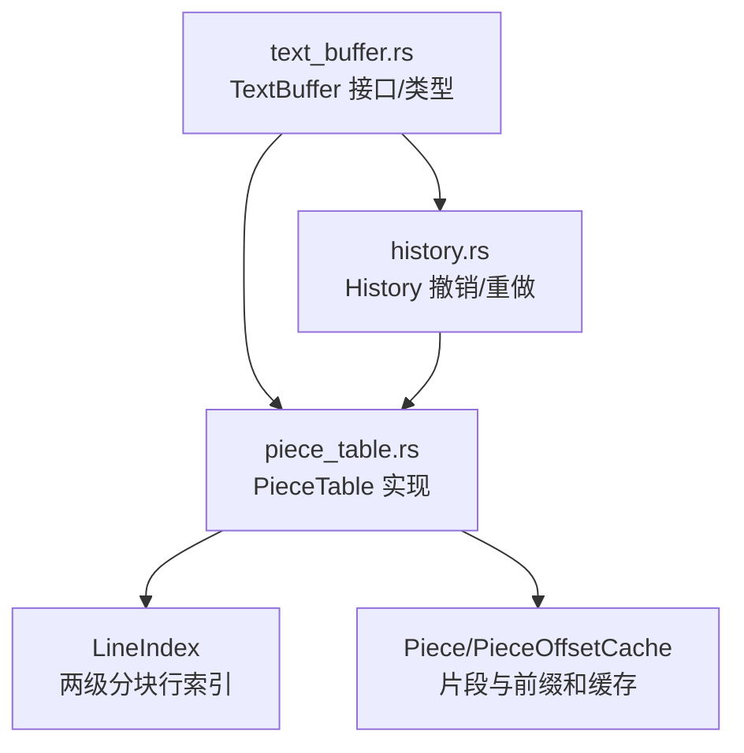
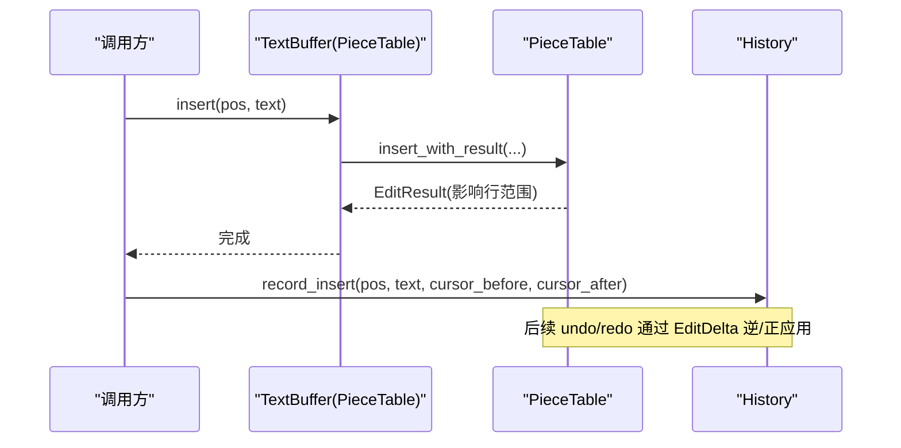
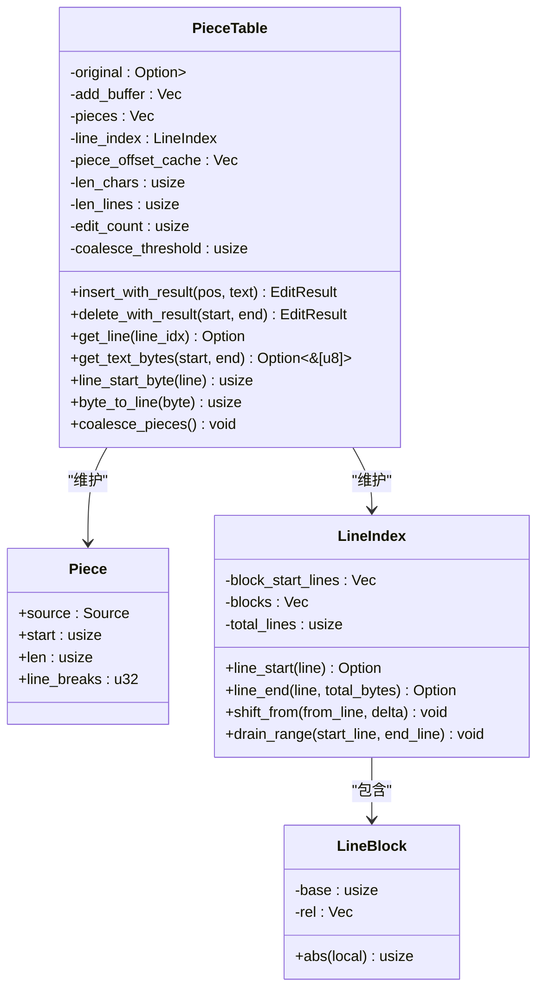
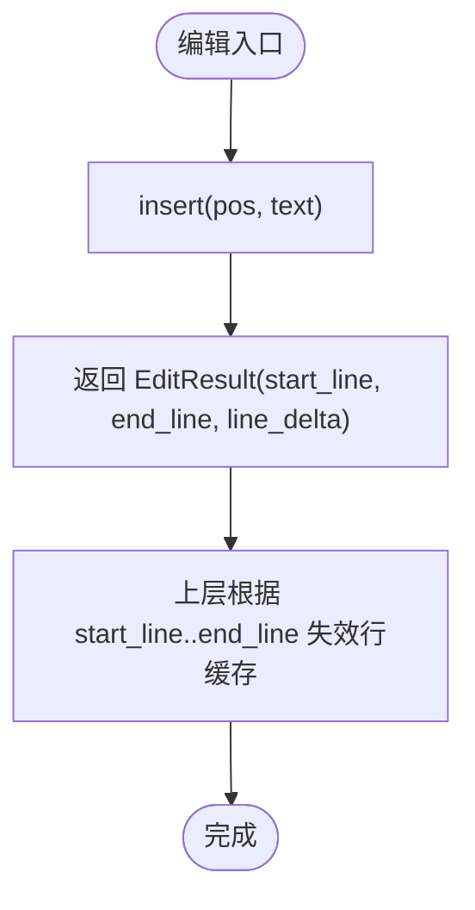
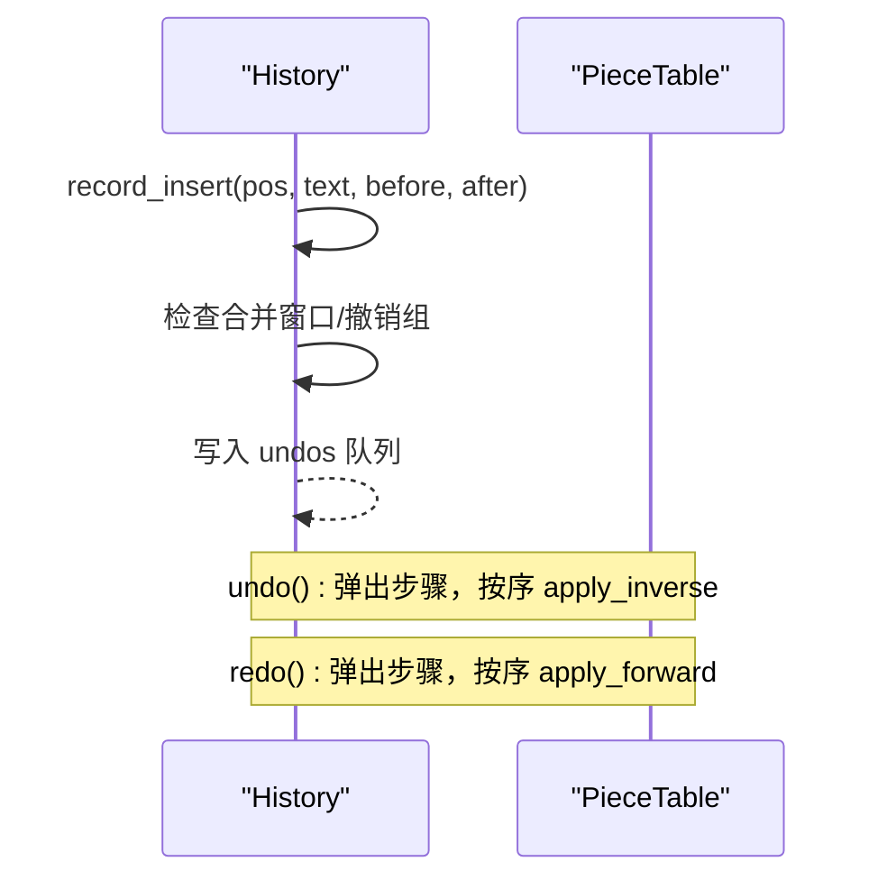
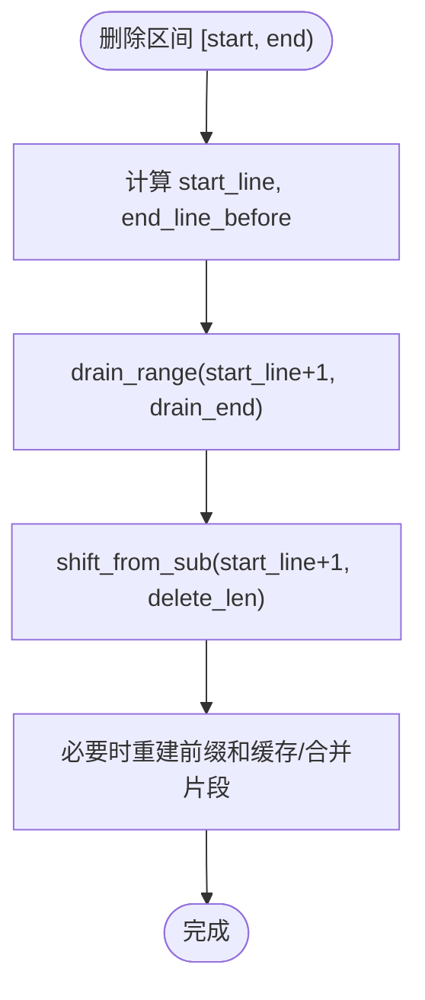
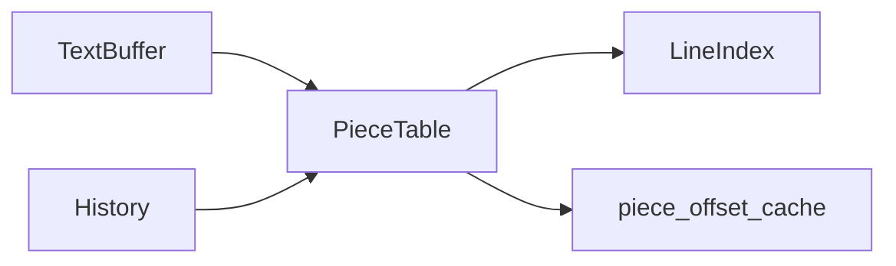

# 文本缓冲系统

<cite>
**本文引用的文件**
- [crates/aether-core/src/buffer/mod.rs](file://crates/aether-core/src/buffer/mod.rs)
- [crates/aether-core/src/buffer/text_buffer.rs](file://crates/aether-core/src/buffer/text_buffer.rs)
- [crates/aether-core/src/buffer/piece_table.rs](file://crates/aether-core/src/buffer/piece_table.rs)
- [crates/aether-core/src/buffer/history.rs](file://crates/aether-core/src/buffer/history.rs)
</cite>

## 目录
1. [简介](#简介)
2. [项目结构](#项目结构)
3. [核心组件](#核心组件)
4. [架构总览](#架构总览)
5. [详细组件分析](#详细组件分析)
6. [依赖关系分析](#依赖关系分析)
7. [性能考量](#性能考量)
8. [故障排查指南](#故障排查指南)
9. [结论](#结论)
10. [附录：使用示例与最佳实践](#附录使用示例与最佳实践)

## 简介
本技术文档围绕文本缓冲系统的核心实现展开，重点解释 Piece Table 算法的数据结构设计、插入/删除操作的时间复杂度与优化策略；详细说明 TextBuffer 抽象接口及其在缓冲区状态管理、多光标与选择区处理上的设计；文档化历史栈机制（撤销/重做）的差分记录、合并窗口与内存优化；并提供创建缓冲区、执行编辑、移动光标的实践指引。最后给出与词法分析器、渲染引擎等上层组件的集成要点与性能优化建议。

## 项目结构
文本缓冲系统位于 aether-core 的 buffer 模块中，采用分层组织：
- text_buffer.rs：定义 TextBuffer 抽象接口、快照接口、光标/选择区/编辑结果等公共类型。
- piece_table.rs：PieceTable 的具体实现，包含片段表、行索引、增量更新、零拷贝读取、状态保存/恢复等。
- history.rs：基于差分的撤销/重做历史栈，支持连续输入合并、撤销组、最大步数限制。
- mod.rs：模块导出，统一对外暴露类型。

图表来源
- [crates/aether-core/src/buffer/text_buffer.rs:1-49](file://crates/aether-core/src/buffer/text_buffer.rs#L1-L49)
- [crates/aether-core/src/buffer/piece_table.rs:11-35](file://crates/aether-core/src/buffer/piece_table.rs#L11-L35)
- [crates/aether-core/src/buffer/history.rs:14-28](file://crates/aether-core/src/buffer/history.rs#L14-L28)

章节来源
- [crates/aether-core/src/buffer/mod.rs:1-8](file://crates/aether-core/src/buffer/mod.rs#L1-L8)

## 核心组件
- TextBuffer 抽象：以字节偏移为基本单位，提供插入、删除、切片、全量文本、行计数、行范围、行列转换、快照、状态保存/恢复等方法，屏蔽底层数据结构差异。
- PieceTable：高性能文本缓冲区，维护原始文件内存映射（只读）、追加缓冲区（只增不删）、有序片段表、行索引、前缀和缓存、字符/行数统计、编辑计数与自动合并阈值。
- History：基于 EditDelta 的轻量级撤销/重做，支持连续同位置输入/删除合并、撤销组、最大步骤限制。

章节来源
- [crates/aether-core/src/buffer/text_buffer.rs:1-49](file://crates/aether-core/src/buffer/text_buffer.rs#L1-L49)
- [crates/aether-core/src/buffer/piece_table.rs:11-35](file://crates/aether-core/src/buffer/piece_table.rs#L11-L35)
- [crates/aether-core/src/buffer/history.rs:6-28](file://crates/aether-core/src/buffer/history.rs#L6-L28)

## 架构总览
整体数据流与控制流如下：
- 编辑路径：调用方通过 TextBuffer 接口对 PieceTable 执行 insert/delete，内部进行片段分裂/合并、行索引增量更新、前缀和缓存重建或延迟合并。
- 历史路径：每次编辑后由 History 记录 EditDelta（Insert/Delete/Replace），并维护撤销/重做队列；支持合并窗口与撤销组。
- 读取路径：get_line/get_text 优先尝试零拷贝（单片段命中），否则回退到拼接；行号与字节偏移通过 LineIndex 快速定位。
- 快照/状态：create_snapshot 返回不可变快照，save_state/restore_state 用于持久化或跨进程恢复。

图表来源
- [crates/aether-core/src/buffer/piece_table.rs:450-562](file://crates/aether-core/src/buffer/piece_table.rs#L450-L562)
- [crates/aether-core/src/buffer/history.rs:140-196](file://crates/aether-core/src/buffer/history.rs#L140-L196)

## 详细组件分析

### Piece Table 算法与数据结构
- 片段表（pieces）：每个 Piece 指向 Source::Original（内存映射）或 Source::Add（追加缓冲区），记录 start、len、line_breaks。
- 追加缓冲区（add_buffer）：只追加不删除，天然可逆，避免频繁移动大块数据。
- 行索引（LineIndex）：两级分块结构，块内存储 u32 相对偏移，支持 O(1) 基址平移与 O(K+块大小+块数) 的增量插入/删除，显著降低大文件行索引维护成本。
- 前缀和缓存（piece_offset_cache）：记录每个片段起始字节偏移及总长度，使 byte_to_line、find_piece_at_byte 等查询达到 O(log n)。
- 自动合并：每 N 次编辑后触发 coalesce_pieces，减少碎片数量，提升后续查找效率。

时间复杂度概览：
- 插入：O(log n) 定位 + O(k) 片段插入/分裂 + 行索引增量更新 O(K+块大小+块数)，k 为新增片段数，K 为新行数量。
- 删除：O(log n) 定位 + O(k) 片段删除/合并 + 行索引增量更新 O(K+块大小+块数)。
- 读取：单片段命中时 O(1) 零拷贝；跨片段时 O(n) 拼接（n 为涉及片段数）。
- 行号↔字节偏移：O(log n) 通过 LineIndex 两级二分查找。

图表来源
- [crates/aether-core/src/buffer/piece_table.rs:11-35](file://crates/aether-core/src/buffer/piece_table.rs#L11-L35)
- [crates/aether-core/src/buffer/piece_table.rs:53-66](file://crates/aether-core/src/buffer/piece_table.rs#L53-L66)
- [crates/aether-core/src/buffer/piece_table.rs:73-114](file://crates/aether-core/src/buffer/piece_table.rs#L73-L114)

章节来源
- [crates/aether-core/src/buffer/piece_table.rs:11-35](file://crates/aether-core/src/buffer/piece_table.rs#L11-L35)
- [crates/aether-core/src/buffer/piece_table.rs:73-114](file://crates/aether-core/src/buffer/piece_table.rs#L73-L114)
- [crates/aether-core/src/buffer/piece_table.rs:450-562](file://crates/aether-core/src/buffer/piece_table.rs#L450-L562)
- [crates/aether-core/src/buffer/piece_table.rs:569-688](file://crates/aether-core/src/buffer/piece_table.rs#L569-L688)
- [crates/aether-core/src/buffer/piece_table.rs:934-1059](file://crates/aether-core/src/buffer/piece_table.rs#L934-L1059)
- [crates/aether-core/src/buffer/piece_table.rs:1843-1876](file://crates/aether-core/src/buffer/piece_table.rs#L1843-L1876)

### TextBuffer 抽象与状态管理
- 接口设计：所有操作基于字节偏移，行号从 0 开始；提供 create_snapshot 用于后台线程安全读取；save_state/restore_state 用于撤销/重做或持久化。
- 光标与选择区：Cursor 表示行列位置；Selection 表示起止光标，支持规范化（start<=end）；MultiCursorState 支持多光标与列选择模式。
- 编辑结果：EditResult 携带受影响行范围与行数变化，便于上层精确失效缓存。

图表来源
- [crates/aether-core/src/buffer/text_buffer.rs:1-49](file://crates/aether-core/src/buffer/text_buffer.rs#L1-L49)
- [crates/aether-core/src/buffer/text_buffer.rs:124-171](file://crates/aether-core/src/buffer/text_buffer.rs#L124-L171)

章节来源
- [crates/aether-core/src/buffer/text_buffer.rs:1-49](file://crates/aether-core/src/buffer/text_buffer.rs#L1-L49)
- [crates/aether-core/src/buffer/text_buffer.rs:83-122](file://crates/aether-core/src/buffer/text_buffer.rs#L83-L122)
- [crates/aether-core/src/buffer/text_buffer.rs:173-258](file://crates/aether-core/src/buffer/text_buffer.rs#L173-L258)
- [crates/aether-core/src/buffer/text_buffer.rs:124-171](file://crates/aether-core/src/buffer/text_buffer.rs#L124-L171)

### 历史栈机制（撤销/重做）
- 差分记录：EditDelta 仅记录 Insert/Delete/Replace 的最小信息，避免保存完整 piece 表导致的 O(N²) 内存增长。
- 合并窗口：连续同位置输入/删除在 500ms 窗口内合并为一条记录，减少撤销步骤数量。
- 撤销组：begin_group/end_group 将多条记录归为一个撤销步骤，保证原子性。
- 最大步数：VecDeque 维护 undos/redos，超过阈值时 O(1) 淘汰头部。

图表来源
- [crates/aether-core/src/buffer/history.rs:6-28](file://crates/aether-core/src/buffer/history.rs#L6-L28)
- [crates/aether-core/src/buffer/history.rs:140-196](file://crates/aether-core/src/buffer/history.rs#L140-L196)
- [crates/aether-core/src/buffer/history.rs:303-323](file://crates/aether-core/src/buffer/history.rs#L303-L323)

章节来源
- [crates/aether-core/src/buffer/history.rs:6-28](file://crates/aether-core/src/buffer/history.rs#L6-L28)
- [crates/aether-core/src/buffer/history.rs:140-196](file://crates/aether-core/src/buffer/history.rs#L140-L196)
- [crates/aether-core/src/buffer/history.rs:303-323](file://crates/aether-core/src/buffer/history.rs#L303-L323)

### 行索引与增量更新
- 行索引分块：块级存绝对基址，块内存 u32 相对偏移；支持 split_block_at_raw、split_oversized_raw 控制块尺寸。
- 增量插入：收集新行起始位置，先 shift_from 平移后续行，再 splice_insert 插入新行起点。
- 增量删除：计算需删除的行范围，drain_range 删除后再 shift_from_sub 调整后续行偏移。

图表来源
- [crates/aether-core/src/buffer/piece_table.rs:569-688](file://crates/aether-core/src/buffer/piece_table.rs#L569-L688)
- [crates/aether-core/src/buffer/piece_table.rs:1025-1059](file://crates/aether-core/src/buffer/piece_table.rs#L1025-L1059)

章节来源
- [crates/aether-core/src/buffer/piece_table.rs:229-380](file://crates/aether-core/src/buffer/piece_table.rs#L229-L380)
- [crates/aether-core/src/buffer/piece_table.rs:1025-1059](file://crates/aether-core/src/buffer/piece_table.rs#L1025-L1059)

### 与词法分析器与渲染引擎的集成
- 词法分析器：通常基于行/字节范围增量扫描，利用 PieceTable 的 get_line_bytes 零拷贝路径与 line_byte_range 快速获取行内容，避免重复分配。
- 渲染引擎：依赖行级缓存失效策略，结合 EditResult.start_line..end_line 精确标记脏矩形；对于大文件，优先使用零拷贝读取以减少内存压力。
- 快照并发：create_snapshot 返回不可变快照，允许后台线程安全读取而不阻塞编辑。

章节来源
- [crates/aether-core/src/buffer/piece_table.rs:710-741](file://crates/aether-core/src/buffer/piece_table.rs#L710-L741)
- [crates/aether-core/src/buffer/piece_table.rs:1632-1643](file://crates/aether-core/src/buffer/piece_table.rs#L1632-L1643)

## 依赖关系分析
- TextBuffer 接口解耦了上层逻辑与具体数据结构，便于替换实现（如 Rope）。
- PieceTable 依赖 LineIndex 进行高效行定位，依赖 piece_offset_cache 加速片段查找。
- History 依赖 PieceTable 的 insert/delete 进行逆/正向应用，并通过 EditDelta 最小化内存占用。

图表来源
- [crates/aether-core/src/buffer/text_buffer.rs:1-49](file://crates/aether-core/src/buffer/text_buffer.rs#L1-L49)
- [crates/aether-core/src/buffer/piece_table.rs:11-35](file://crates/aether-core/src/buffer/piece_table.rs#L11-L35)
- [crates/aether-core/src/buffer/history.rs:6-28](file://crates/aether-core/src/buffer/history.rs#L6-L28)

章节来源
- [crates/aether-core/src/buffer/text_buffer.rs:1-49](file://crates/aether-core/src/buffer/text_buffer.rs#L1-L49)
- [crates/aether-core/src/buffer/piece_table.rs:11-35](file://crates/aether-core/src/buffer/piece_table.rs#L11-L35)
- [crates/aether-core/src/buffer/history.rs:6-28](file://crates/aether-core/src/buffer/history.rs#L6-L28)

## 性能考量
- 零拷贝读取：get_line_bytes 在单片段命中时直接返回切片，避免 String 分配；跨片段时回退到拼接。
- 行索引优化：两级分块与 u32 相对偏移，批量平移与插入，避免 O(总行数) 全量更新。
- 片段合并：编辑计数达到阈值后合并相邻 Add 片段，减少碎片数量，提升后续查找效率。
- 前缀和缓存：piece_offset_cache 使 find_piece_at_byte、len_bytes 等达到 O(1)/O(log n)。
- 历史栈内存：差分记录替代完整快照，避免长会话下 O(N²) 内存增长；支持最大步数限制与合并窗口。

[本节为通用性能讨论，无需特定文件引用]

## 故障排查指南
- 行索引不一致：确保删除区间边界正确，参考 update_line_index_for_delete 中的 drain_end 计算逻辑，避免幽灵行起点残留。
- 跨片段读取为空：get_line_bytes 返回 None 表示跨片段无法零拷贝，应回退到 get_text 拼接；检查是否误用零拷贝路径。
- 撤销/重做异常：确认 EditDelta 的逆/正向应用顺序正确；检查 add_buffer 长度一致性（只追加不收缩）。
- 状态恢复失败：restore_state_checked 会严格校验 pieces_data 长度、source/start/len/line_breaks 与 add_buffer_len，任何非法值将放弃恢复。

章节来源
- [crates/aether-core/src/buffer/piece_table.rs:1025-1059](file://crates/aether-core/src/buffer/piece_table.rs#L1025-L1059)
- [crates/aether-core/src/buffer/piece_table.rs:710-741](file://crates/aether-core/src/buffer/piece_table.rs#L710-L741)
- [crates/aether-core/src/buffer/piece_table.rs:1674-1831](file://crates/aether-core/src/buffer/piece_table.rs#L1674-L1831)

## 结论
该文本缓冲系统通过 Piece Table 与两级分块行索引实现了高效的插入/删除与行定位能力，配合前缀和缓存与自动片段合并，显著提升了大文件编辑性能。TextBuffer 抽象提供了稳定的接口与快照机制，History 基于差分的撤销/重做在保证功能的同时控制了内存占用。整体设计兼顾性能与可维护性，适合在高吞吐编辑器场景中使用。

[本节为总结性内容，无需特定文件引用]

## 附录：使用示例与最佳实践
以下为常见操作的代码片段路径，供参考实现细节：
- 创建缓冲区
  - 从字符串创建：[from_string:383-406](file://crates/aether-core/src/buffer/piece_table.rs#L383-L406)
  - 从文件创建（内存映射）：[from_file:408-448](file://crates/aether-core/src/buffer/piece_table.rs#L408-L448)
- 执行编辑操作
  - 插入文本（带影响行范围）：[insert_with_result:450-562](file://crates/aether-core/src/buffer/piece_table.rs#L450-L562)
  - 删除文本（带影响行范围）：[delete_with_result:569-688](file://crates/aether-core/src/buffer/piece_table.rs#L569-L688)
- 处理光标移动
  - 行号转字节偏移：[line_col_to_byte:1583-1617](file://crates/aether-core/src/buffer/piece_table.rs#L1583-L1617)
  - 字节偏移转行列：[byte_to_line_col:1619-1630](file://crates/aether-core/src/buffer/piece_table.rs#L1619-L1630)
- 历史栈操作
  - 记录插入（支持合并窗口）：[record_insert:140-196](file://crates/aether-core/src/buffer/history.rs#L140-L196)
  - 记录删除（支持合并窗口）：[record_delete:198-252](file://crates/aether-core/src/buffer/history.rs#L198-L252)
  - 撤销/重做：[undo/redo:303-323](file://crates/aether-core/src/buffer/history.rs#L303-L323)
- 状态保存/恢复
  - 保存状态：[save_state:1645-1660](file://crates/aether-core/src/buffer/piece_table.rs#L1645-L1660)
  - 恢复状态（带校验）：[restore_state_checked:1674-1831](file://crates/aether-core/src/buffer/piece_table.rs#L1674-L1831)

最佳实践
- 优先使用 get_line_bytes 进行零拷贝读取，仅在跨片段时回退到 get_text。
- 利用 EditResult 精确失效行级缓存，避免全量重绘。
- 合理使用撤销组 begin_group/end_group，保证复杂编辑的原子性。
- 监控 edit_count 与 coalesce_threshold，平衡碎片数量与合并开销。

[本节为实践指导，无需特定文件引用]