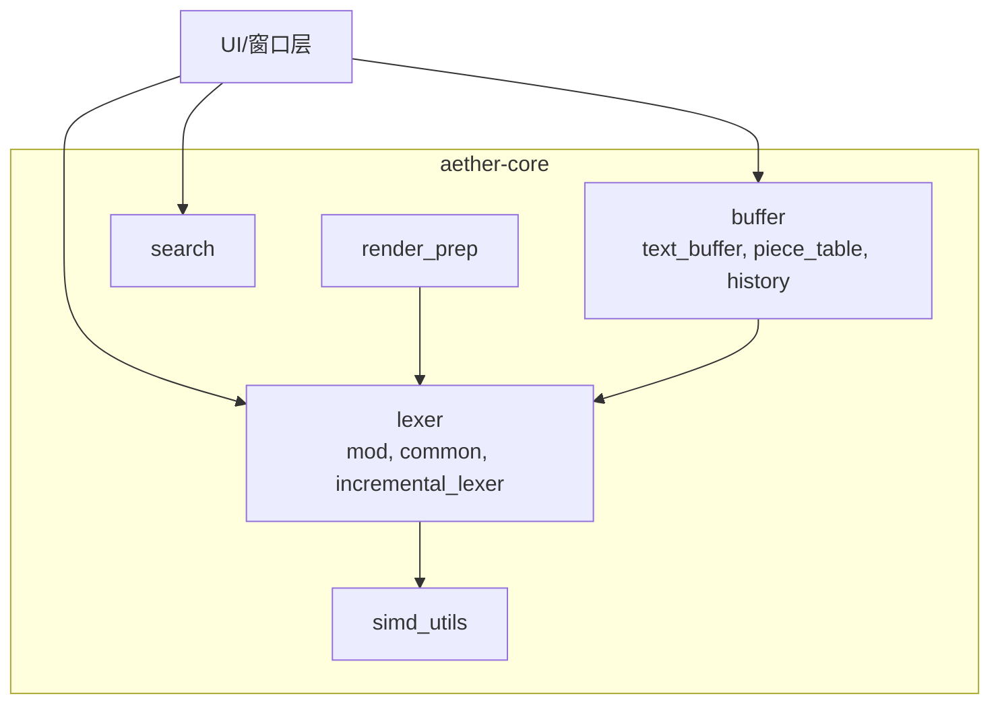
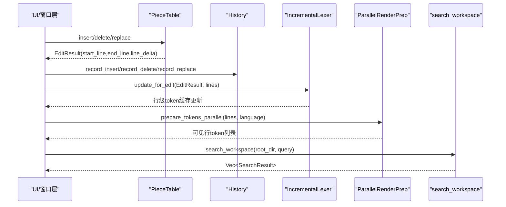
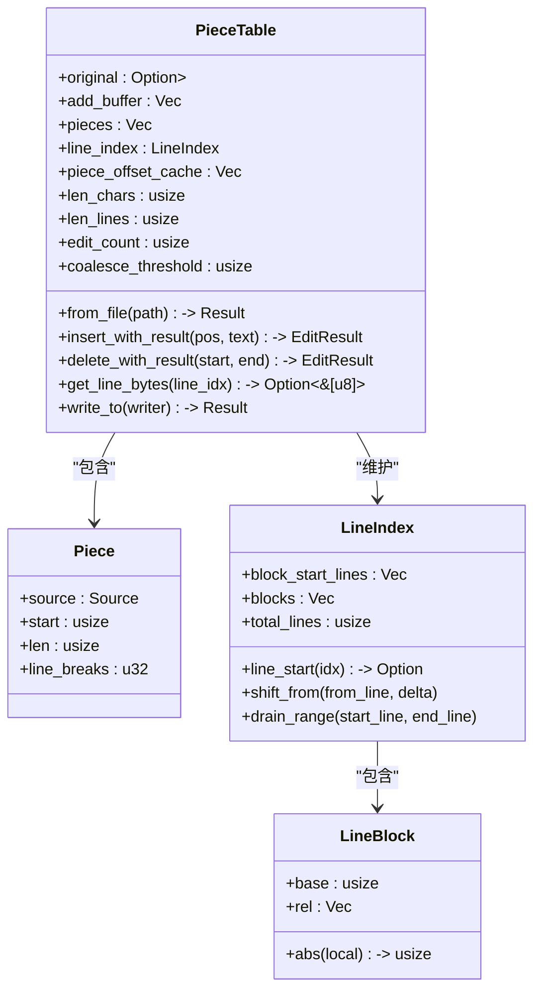
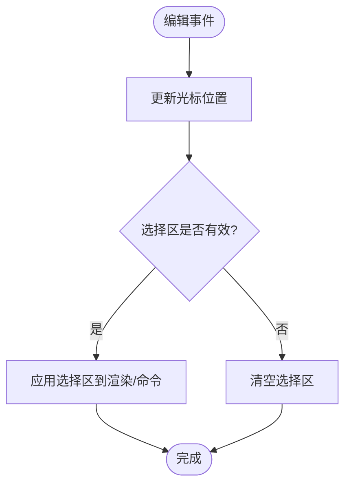
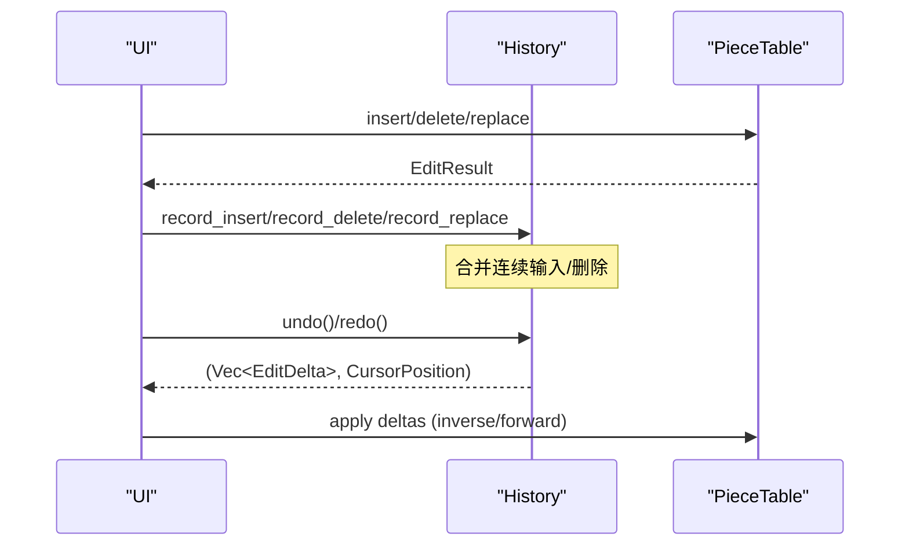
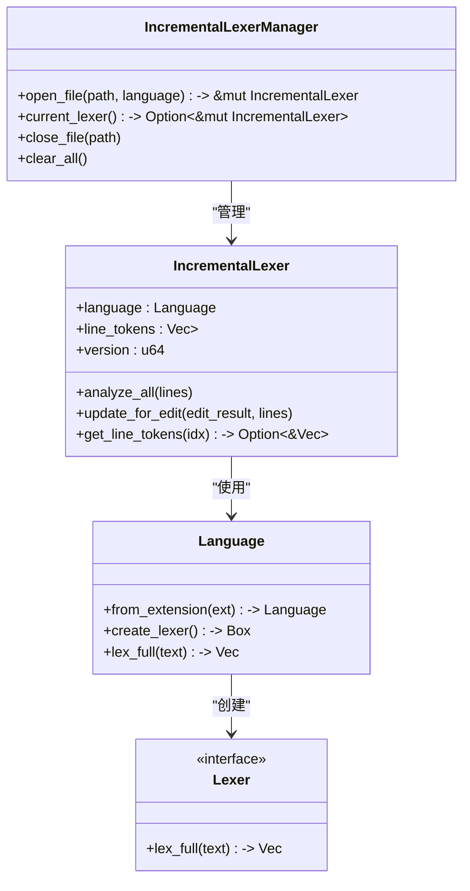
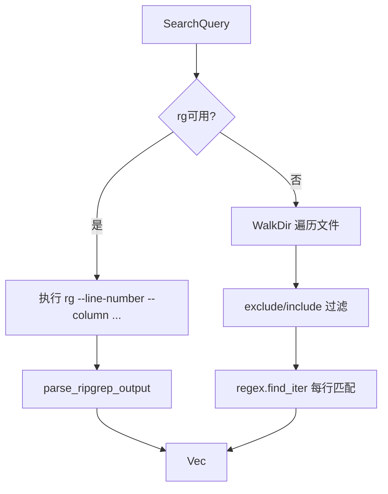
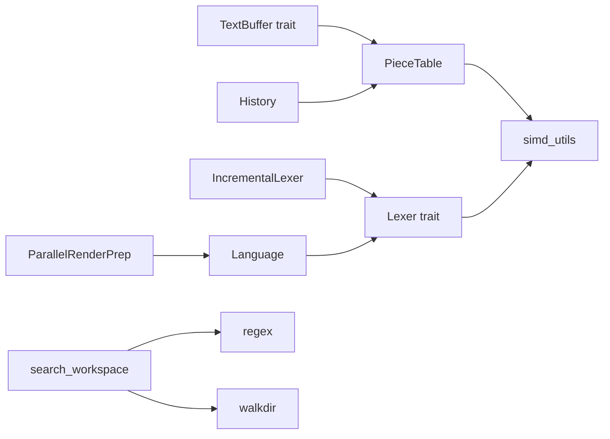

# 核心编辑器

<cite>
**本文引用的文件**
- [piece_table.rs](file://crates/aether-core/src/buffer/piece_table.rs)
- [text_buffer.rs](file://crates/aether-core/src/buffer/text_buffer.rs)
- [history.rs](file://crates/aether-core/src/buffer/history.rs)
- [mod.rs（buffer）](file://crates/aether-core/src/buffer/mod.rs)
- [mod.rs（lexer）](file://crates/aether-core/src/lexer/mod.rs)
- [common.rs（lexer）](file://crates/aether-core/src/lexer/common.rs)
- [incremental_lexer.rs](file://crates/aether-core/src/incremental_lexer.rs)
- [search.rs](file://crates/aether-core/src/search.rs)
- [simd_utils.rs](file://crates/aether-core/src/simd_utils.rs)
- [render_prep.rs](file://crates/aether-core/src/render_prep.rs)
- [lib.rs（aether-core）](file://crates/aether-core/src/lib.rs)
</cite>

## 目录
1. [简介](#简介)
2. [项目结构](#项目结构)
3. [核心组件](#核心组件)
4. [架构总览](#架构总览)
5. [详细组件分析](#详细组件分析)
6. [依赖关系分析](#依赖关系分析)
7. [性能考量](#性能考量)
8. [故障排查指南](#故障排查指南)
9. [结论](#结论)
10. [附录：使用模式与集成示例](#附录使用模式与集成示例)

## 简介
本文件面向“核心编辑器”能力，系统性阐述以下关键子系统的设计与实现：
- Piece Table 文本缓冲算法的原理、数据结构与性能优势
- 多光标与选择区处理机制
- 撤销/重做历史栈的差分记录与合并策略
- 词法分析器框架：增量词法分析、多语言支持与语法高亮渲染管线
- 全文搜索系统：工作区搜索、正则/字面量匹配、结果展示
- 与渲染、UI、LSP 等上层组件的集成方式
- 常见问题与性能优化建议

目标读者包括初学者与有经验的开发者。文档在保持可读性的同时提供足够的技术深度，并附带图示与代码路径引用。

## 项目结构
核心编辑器功能集中在 aether-core crate 中，围绕 buffer、lexer、search、simd_utils、render_prep 等模块组织：
- buffer：PieceTable 文本缓冲、TextBuffer trait、多光标状态、编辑结果、历史管理
- lexer：通用 Lexer trait、TokenKind、Language、各语言词法分析器、增量词法管理器
- search：工作区搜索（优先 ripgrep，回退 walkdir+regex）
- simd_utils：SIMD 加速的字节查找、换行计数、空白跳过等工具
- render_prep：并行预处理可见行的 token，渲染缓存

图表来源
- [lib.rs（aether-core）:1-12](file://crates/aether-core/src/lib.rs#L1-L12)
- [mod.rs（buffer）:1-9](file://crates/aether-core/src/buffer/mod.rs#L1-L9)
- [mod.rs（lexer）:1-306](file://crates/aether-core/src/lexer/mod.rs#L1-L306)
- [incremental_lexer.rs:1-301](file://crates/aether-core/src/incremental_lexer.rs#L1-L301)
- [search.rs:1-342](file://crates/aether-core/src/search.rs#L1-L342)
- [simd_utils.rs:1-267](file://crates/aether-core/src/simd_utils.rs#L1-L267)
- [render_prep.rs:1-194](file://crates/aether-core/src/render_prep.rs#L1-L194)

章节来源
- [lib.rs（aether-core）:1-12](file://crates/aether-core/src/lib.rs#L1-L12)

## 核心组件
- 文本缓冲：基于 Piece Table 的高性能缓冲区，支持 O(1) 插入/删除、零拷贝大文件打开、行索引分块优化、片段偏移前缀和缓存
- 多光标与选择：MultiCursorState 维护多个光标与选择区域，支持列选择模式与主光标钳位
- 撤销/重做：History 以 EditDelta 差分记录操作，支持连续输入/删除合并、撤销组、最大步数限制
- 词法分析：Lexer trait + Language 分发，多语言支持；IncrementalLexer 按行缓存 token，EditResult 驱动增量更新
- 搜索：SearchQuery 封装查询条件，search_workspace 优先调用 rg，否则 walkdir+regex 扫描
- SIMD 工具：count_newlines_simd、find_byte_simd、skip_whitespace_simd 等，提升热点路径性能
- 渲染预取：ParallelRenderPrep 并行计算可见行 token，RenderCache 缓存可见行数据

章节来源
- [text_buffer.rs:1-344](file://crates/aether-core/src/buffer/text_buffer.rs#L1-L344)
- [piece_table.rs:1-800](file://crates/aether-core/src/buffer/piece_table.rs#L1-L800)
- [history.rs:1-565](file://crates/aether-core/src/buffer/history.rs#L1-L565)
- [mod.rs（lexer）:1-306](file://crates/aether-core/src/lexer/mod.rs#L1-L306)
- [incremental_lexer.rs:1-301](file://crates/aether-core/src/incremental_lexer.rs#L1-L301)
- [search.rs:1-342](file://crates/aether-core/src/search.rs#L1-L342)
- [simd_utils.rs:1-267](file://crates/aether-core/src/simd_utils.rs#L1-L267)
- [render_prep.rs:1-194](file://crates/aether-core/src/render_prep.rs#L1-L194)

## 架构总览
编辑器核心由“文本缓冲 + 增量词法 + 搜索 + SIMD 工具 + 渲染预取”构成。编辑事件驱动 PieceTable 变更，产生 EditResult；History 记录 EditDelta；IncrementalLexer 根据 EditResult 仅重新分析受影响行；渲染阶段通过 ParallelRenderPrep 并行生成 token，并使用 RenderCache 避免重复计算；搜索模块在工作区范围内执行 rg 或 walkdir+regex 检索。

图表来源
- [piece_table.rs:450-688](file://crates/aether-core/src/buffer/piece_table.rs#L450-L688)
- [history.rs:140-323](file://crates/aether-core/src/buffer/history.rs#L140-L323)
- [incremental_lexer.rs:28-101](file://crates/aether-core/src/incremental_lexer.rs#L28-L101)
- [render_prep.rs:32-60](file://crates/aether-core/src/render_prep.rs#L32-L60)
- [search.rs:45-171](file://crates/aether-core/src/search.rs#L45-L171)

## 详细组件分析

### Piece Table 文本缓冲
- 设计要点
  - 原始内容通过内存映射（Mmap）只读加载，新增内容追加到 add_buffer，避免频繁复制
  - pieces 有序片段表，每个 Piece 指向 Source::Original 或 Source::Add，含 start、len、line_breaks
  - 行索引 LineIndex 采用两级分块结构，块内相对偏移 u32，块基址 usize，支持高效平移与分裂
  - piece_offset_cache 前缀和缓存，O(1) 获取总字节长度
  - 自动合并阈值 coalesce_threshold 控制碎片合并频率，平衡内存与访问速度
- 关键操作
  - 插入：insert_with_result 将新文本写入 add_buffer，拆分/插入片段，更新 line_index 与前缀缓存
  - 删除：delete_with_result 调整片段边界，必要时 split 片段，更新行索引与前缀缓存
  - 读取：get_line_bytes 尝试零拷贝返回单片段切片；跨片段时回退拼接
  - 保存：write_to 直接写出各片段，未编辑时可走 mmap 零拷贝路径
- 复杂度与优化
  - 插入/删除近似 O(1) 片段操作，行索引更新为 O(K + 块大小 + 块数)
  - 行定位使用二分查找与块级 partition_point，降低全表扫描开销
  - 大文件打开一次性构建行起始偏移表，减少二次扫描

图表来源
- [piece_table.rs:11-35](file://crates/aether-core/src/buffer/piece_table.rs#L11-L35)
- [piece_table.rs:53-66](file://crates/aether-core/src/buffer/piece_table.rs#L53-L66)
- [piece_table.rs:73-114](file://crates/aether-core/src/buffer/piece_table.rs#L73-L114)
- [piece_table.rs:116-380](file://crates/aether-core/src/buffer/piece_table.rs#L116-L380)
- [piece_table.rs:382-800](file://crates/aether-core/src/buffer/piece_table.rs#L382-L800)

章节来源
- [piece_table.rs:1-800](file://crates/aether-core/src/buffer/piece_table.rs#L1-L800)

### 多光标与选择区
- MultiCursorState 维护 cursors、selections、primary_cursor
- 主光标索引通过 primary_idx() 钳位，防止越界 panic
- 支持列选择模式：add_column_cursors 在多行创建光标，is_column_mode 检测
- Selection 规范化确保 start <= end，is_empty 判断空选区

图表来源
- [text_buffer.rs:173-258](file://crates/aether-core/src/buffer/text_buffer.rs#L173-L258)
- [text_buffer.rs:96-122](file://crates/aether-core/src/buffer/text_buffer.rs#L96-L122)

章节来源
- [text_buffer.rs:83-258](file://crates/aether-core/src/buffer/text_buffer.rs#L83-L258)

### 撤销/重做历史栈
- History 以 EditDelta 记录插入、删除、替换操作，支持逆操作 apply_inverse 与前向应用 apply_forward
- 连续同位置输入/删除在 MERGE_WINDOW_MS 内合并为一条记录，减少步骤数量
- 撤销组 begin_group/end_group 将多条记录归为一个步骤，undo/redo 整体恢复
- 最大步数限制 max_records 使用 VecDeque 进行 O(1) 淘汰

图表来源
- [history.rs:14-77](file://crates/aether-core/src/buffer/history.rs#L14-L77)
- [history.rs:140-323](file://crates/aether-core/src/buffer/history.rs#L140-L323)

章节来源
- [history.rs:1-565](file://crates/aether-core/src/buffer/history.rs#L1-L565)

### 词法分析器框架与增量分析
- Lexer trait 定义 lex_full 接口，Language 枚举分发具体语言分析器
- TokenKind 统一跨语言的 token 类别，LexemeSpan 压缩存储 start/len/kind/flags
- IncrementalLexer 按行缓存 token，update_for_edit 根据 EditResult 仅重新分析受影响行
- IncrementalLexerManager 管理多文件的增量 lexer，支持开关文件与缓存上限保护

图表来源
- [mod.rs（lexer）:1-196](file://crates/aether-core/src/lexer/mod.rs#L1-L196)
- [incremental_lexer.rs:8-129](file://crates/aether-core/src/incremental_lexer.rs#L8-L129)
- [incremental_lexer.rs:131-193](file://crates/aether-core/src/incremental_lexer.rs#L131-L193)

章节来源
- [mod.rs（lexer）:1-306](file://crates/aether-core/src/lexer/mod.rs#L1-L306)
- [incremental_lexer.rs:1-301](file://crates/aether-core/src/incremental_lexer.rs#L1-L301)
- [common.rs（lexer）:1-151](file://crates/aether-core/src/lexer/common.rs#L1-L151)

### 搜索系统
- SearchQuery 封装 pattern、regex、case_sensitive、include/exclude glob 模式
- search_workspace 优先调用 ripgrep（rg），失败回退 walkdir+regex
- parse_ripgrep_output 解析 rg 输出格式 path:line:col:text
- walkdir 路径过滤 exclude/include，限制文件大小，逐行匹配并收集结果

图表来源
- [search.rs:6-171](file://crates/aether-core/src/search.rs#L6-L171)
- [search.rs:96-126](file://crates/aether-core/src/search.rs#L96-L126)

章节来源
- [search.rs:1-342](file://crates/aether-core/src/search.rs#L1-L342)

### SIMD 优化
- count_newlines_simd 使用 bytecount 库，AVX2/SSE2 运行时分派
- find_byte_simd 使用 memchr，快速定位目标字节
- skip_whitespace_simd 使用 16 字节 SWAR 批量检测空格/制表符/回车
- line_length_simd、starts_with_simd、classify_chars_simd 辅助词法与渲染

章节来源
- [simd_utils.rs:1-267](file://crates/aether-core/src/simd_utils.rs#L1-L267)

### 渲染预取与缓存
- ParallelRenderPrep 使用 rayon 并行处理可见行 token，行数较少时回退单线程
- RenderCache 缓存可见行文本与 token，版本化失效检测，避免重复计算

章节来源
- [render_prep.rs:1-194](file://crates/aether-core/src/render_prep.rs#L1-L194)

## 依赖关系分析
- buffer 模块对外暴露 TextBuffer trait、MultiCursorState、EditResult 等类型
- lexer 模块通过 Language 分发具体语言分析器，IncrementalLexer 依赖 EditResult 进行增量更新
- search 模块独立于 buffer/lexer，但可与 UI 层协作展示搜索结果
- simd_utils 被 buffer/lexer 复用，提升热点路径性能
- render_prep 依赖 lexer 与语言类型，为渲染管线提供并行 token 预处理

图表来源
- [mod.rs（buffer）:1-9](file://crates/aether-core/src/buffer/mod.rs#L1-L9)
- [mod.rs（lexer）:1-306](file://crates/aether-core/src/lexer/mod.rs#L1-L306)
- [incremental_lexer.rs:1-301](file://crates/aether-core/src/incremental_lexer.rs#L1-L301)
- [search.rs:1-342](file://crates/aether-core/src/search.rs#L1-L342)
- [simd_utils.rs:1-267](file://crates/aether-core/src/simd_utils.rs#L1-L267)
- [render_prep.rs:1-194](file://crates/aether-core/src/render_prep.rs#L1-L194)

章节来源
- [lib.rs（aether-core）:1-12](file://crates/aether-core/src/lib.rs#L1-L12)

## 性能考量
- 文本缓冲
  - 插入/删除近似 O(1)，行索引更新为 O(K + 块大小 + 块数)
  - 行定位使用二分查找与块级 partition_point，避免全表扫描
  - 大文件打开一次性构建行起始偏移表，减少二次扫描
  - 片段偏移前缀和缓存使 len_bytes 为 O(1)
- 撤销/重做
  - 差分记录 EditDelta，避免整张 piece 表快照，内存占用从 O(N²) 降至 KB 级
  - 连续输入/删除合并减少步骤数量，撤销组提升用户体验
- 词法分析
  - 增量更新仅重分析受影响行，缓存命中率提升显著
  - 并行预处理可见行 token，rayon 线程池复用避免创建销毁开销
- 搜索
  - 优先 rg 利用系统级高性能搜索，回退 walkdir+regex 保证可用性
  - 限制文件大小与结果数量，避免长时间阻塞
- SIMD
  - 换行计数与字节查找委托给 bytecount/memchr，获得 AVX2/SSE2 加速
  - 空白跳过使用 SWAR 批量检测，减少分支与边界检查

## 故障排查指南
- 行号与列号转换异常
  - 检查 byte_to_line_col 与 line_col_to_byte 的实现一致性，确认 UTF-8 字符边界处理
  - 参考路径：[text_buffer.rs:33-37](file://crates/aether-core/src/buffer/text_buffer.rs#L33-L37)
- 多光标越界 panic
  - 使用 primary_idx() 钳位主光标索引，避免外部设置非法值
  - 参考路径：[text_buffer.rs:191-206](file://crates/aether-core/src/buffer/text_buffer.rs#L191-L206)
- 撤销/重做不生效
  - 确认 record_insert/record_delete/record_replace 正确传入被删文本与光标位置
  - 检查合并窗口 MERGE_WINDOW_MS 与撤销组 begin_group/end_group 的使用
  - 参考路径：[history.rs:140-323](file://crates/aether-core/src/buffer/history.rs#L140-L323)
- 词法分析缓存不一致
  - 确保 update_for_edit 使用正确的 EditResult 与 lines 参数
  - 检查 IncrementalLexerManager 的文件切换与缓存清理
  - 参考路径：[incremental_lexer.rs:36-101](file://crates/aether-core/src/incremental_lexer.rs#L36-L101)
- 搜索结果为空或超时
  - 确认 rg 可用性与参数配置，检查 include/exclude 模式
  - 回退路径下限制文件大小与结果数量，避免长时间扫描
  - 参考路径：[search.rs:45-171](file://crates/aether-core/src/search.rs#L45-L171)
- 渲染卡顿
  - 使用 ParallelRenderPrep 并行预处理，注意行数阈值与线程池大小
  - 使用 RenderCache 版本化失效检测，避免重复计算
  - 参考路径：[render_prep.rs:32-60](file://crates/aether-core/src/render_prep.rs#L32-L60)

章节来源
- [text_buffer.rs:83-258](file://crates/aether-core/src/buffer/text_buffer.rs#L83-L258)
- [history.rs:140-323](file://crates/aether-core/src/buffer/history.rs#L140-L323)
- [incremental_lexer.rs:36-101](file://crates/aether-core/src/incremental_lexer.rs#L36-L101)
- [search.rs:45-171](file://crates/aether-core/src/search.rs#L45-L171)
- [render_prep.rs:32-60](file://crates/aether-core/src/render_prep.rs#L32-L60)

## 结论
核心编辑器通过 Piece Table 文本缓冲、增量词法分析、差分撤销/重做、SIMD 优化与并行渲染预取，实现了高性能、可扩展的编辑体验。搜索系统兼顾速度与可用性，支持多种语言与文件格式。上述组件协同工作，为上层 UI、LSP、AI 等功能提供稳定基础。建议在大规模编辑场景下关注行索引更新与片段合并频率，合理配置撤销组与合并窗口，以获得更佳的用户体验与资源利用率。

## 附录：使用模式与集成示例
- 文本缓冲使用模式
  - 打开文件：PieceTable::from_file 使用内存映射加载，构建行索引与前缀缓存
  - 编辑操作：insert/delete/replace 后获取 EditResult，用于增量词法与渲染更新
  - 读取文本：优先 get_line_bytes 零拷贝路径，跨片段时回退拼接
  - 参考路径：[piece_table.rs:408-448](file://crates/aether-core/src/buffer/piece_table.rs#L408-L448)、[piece_table.rs:450-688](file://crates/aether-core/src/buffer/piece_table.rs#L450-L688)
- 多光标与选择区
  - 添加光标：MultiCursorState::add_cursor，列选择模式使用 add_column_cursors
  - 规范化选择区：Selection::normalized，确保 start <= end
  - 参考路径：[text_buffer.rs:208-258](file://crates/aether-core/src/buffer/text_buffer.rs#L208-L258)、[text_buffer.rs:96-122](file://crates/aether-core/src/buffer/text_buffer.rs#L96-L122)
- 撤销/重做
  - 记录操作：record_insert/record_delete/record_replace，传入光标前后位置
  - 撤销/重做：undo/redo 返回 deltas 与光标位置，应用到缓冲区
  - 参考路径：[history.rs:140-323](file://crates/aether-core/src/buffer/history.rs#L140-L323)
- 词法分析与高亮
  - 全量分析：IncrementalLexer::analyze_all 首次打开文件
  - 增量更新：update_for_edit 根据 EditResult 重分析受影响行
  - 并行预处理：ParallelRenderPrep::prepare_tokens_parallel 处理可见行
  - 参考路径：[incremental_lexer.rs:28-101](file://crates/aether-core/src/incremental_lexer.rs#L28-L101)、[render_prep.rs:32-60](file://crates/aether-core/src/render_prep.rs#L32-L60)
- 搜索系统集成
  - 构建查询：SearchQuery 设置 pattern、regex、case_sensitive、include/exclude
  - 执行搜索：search_workspace 优先 rg，回退 walkdir+regex
  - 展示结果：SearchResult 包含 path、line、col、text
  - 参考路径：[search.rs:6-171](file://crates/aether-core/src/search.rs#L6-L171)

章节来源
- [piece_table.rs:408-688](file://crates/aether-core/src/buffer/piece_table.rs#L408-L688)
- [text_buffer.rs:96-258](file://crates/aether-core/src/buffer/text_buffer.rs#L96-L258)
- [history.rs:140-323](file://crates/aether-core/src/buffer/history.rs#L140-L323)
- [incremental_lexer.rs:28-101](file://crates/aether-core/src/incremental_lexer.rs#L28-L101)
- [render_prep.rs:32-60](file://crates/aether-core/src/render_prep.rs#L32-L60)
- [search.rs:6-171](file://crates/aether-core/src/search.rs#L6-L171)