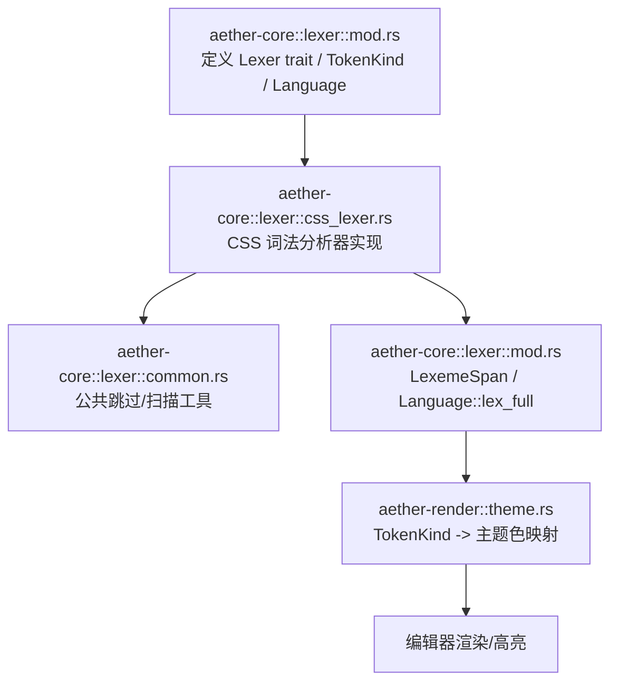
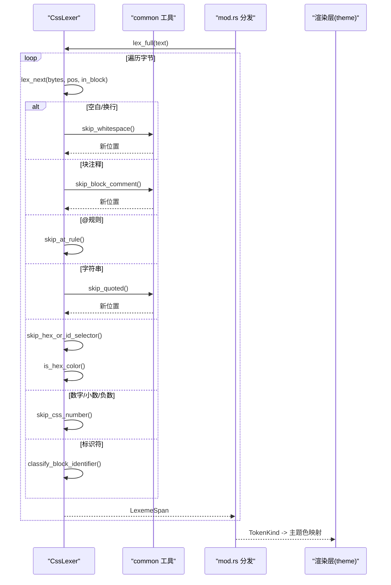
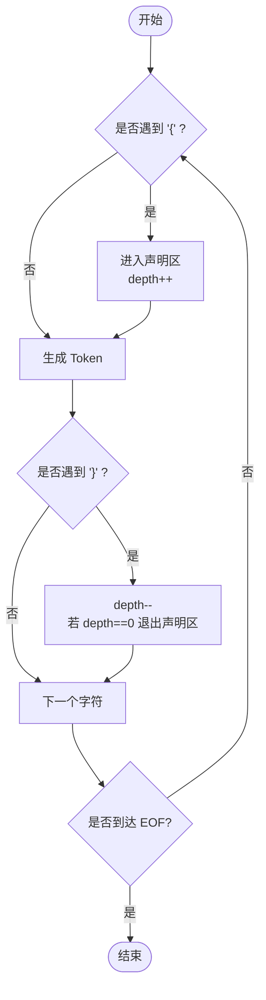
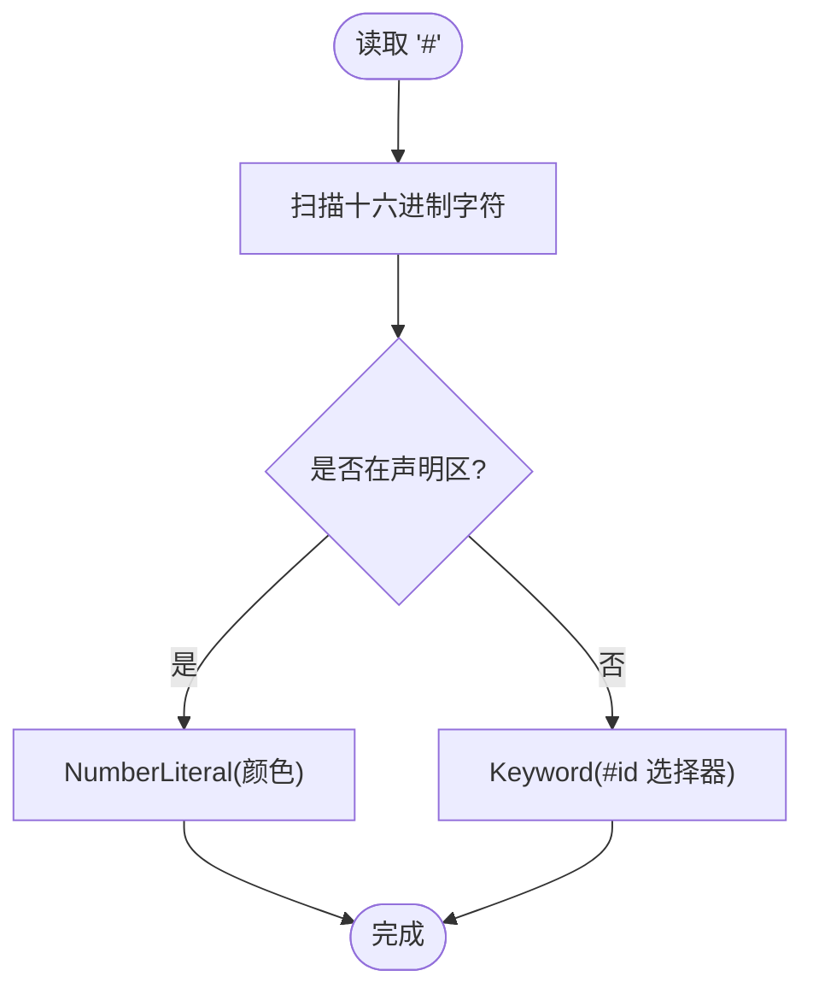
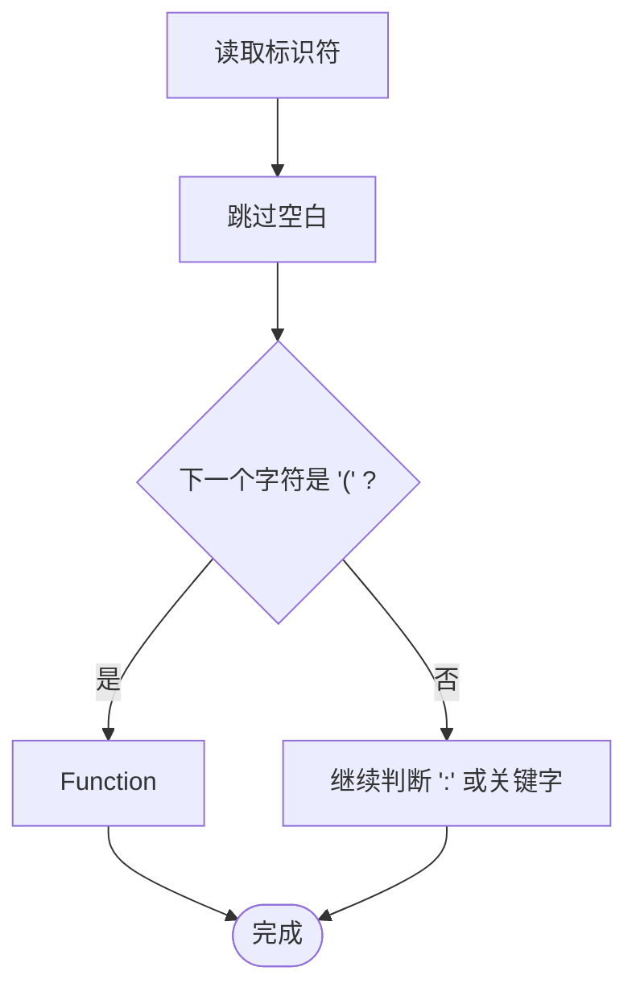
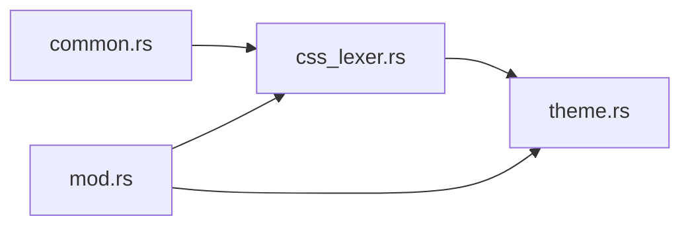

# CSS 词法分析器

<cite>
**本文引用的文件**
- [css_lexer.rs](file://crates/aether-core/src/lexer/css_lexer.rs)
- [mod.rs](file://crates/aether-core/src/lexer/mod.rs)
- [common.rs](file://crates/aether-core/src/lexer/common.rs)
- [theme.rs](file://crates/aether-render/src/theme.rs)
</cite>

## 目录
1. [简介](#简介)
2. [项目结构](#项目结构)
3. [核心组件](#核心组件)
4. [架构总览](#架构总览)
5. [详细组件分析](#详细组件分析)
6. [依赖关系分析](#依赖关系分析)
7. [性能考量](#性能考量)
8. [故障排查指南](#故障排查指南)
9. [结论](#结论)
10. [附录：样式示例与识别效果](#附录样式示例与识别效果)

## 简介
本技术文档聚焦于项目中的 CSS 词法分析器，系统性说明其语法规则实现与处理流程，覆盖选择器、属性声明、值解析、媒体查询等。重点阐述颜色值（十六进制）、单位（px、em、rem、% 等）、函数（calc、var、attr 等）的识别方式，并解释 CSS 变量支持与作用域机制在词法层面的体现。同时给出基于测试用例的样式示例，展示各类规则的识别效果。

## 项目结构
CSS 词法分析器位于 aether-core 的 lexer 模块中，采用统一的 Lexer trait 与 TokenKind 体系，各语言通过独立实现接入。CSS 相关的关键文件如下：
- css_lexer.rs：CSS 词法分析器的具体实现，包含状态机、跳过逻辑与分类规则
- mod.rs：通用 Lexer trait、TokenKind、Language 枚举及创建/分发逻辑
- common.rs：跨语言共享的基础扫描工具（空白、注释、字符串、数字框架等）
- theme.rs：渲染层将 TokenKind 映射到主题色，用于语法高亮显示

图表来源
- [mod.rs:1-196](file://crates/aether-core/src/lexer/mod.rs#L1-L196)
- [css_lexer.rs:1-196](file://crates/aether-core/src/lexer/css_lexer.rs#L1-L196)
- [common.rs:1-151](file://crates/aether-core/src/lexer/common.rs#L1-L151)
- [theme.rs:337-381](file://crates/aether-render/src/theme.rs#L337-L381)

章节来源
- [mod.rs:1-196](file://crates/aether-core/src/lexer/mod.rs#L1-L196)
- [css_lexer.rs:1-196](file://crates/aether-core/src/lexer/css_lexer.rs#L1-L196)
- [common.rs:1-151](file://crates/aether-core/src/lexer/common.rs#L1-L151)

## 核心组件
- CssLexer：实现 Lexer trait，提供 lex_full 全量词法分析；内部使用 in_block 状态跟踪当前处于选择器区还是声明区，同一标识符在不同区域映射为不同 TokenKind（选择器→Keyword，属性名→Attribute）。
- TokenKind：统一 token 类型，包括 Keyword、Identifier、StringLiteral、NumberLiteral、Operator、Punctuation、Preprocessor、Function、Attribute、Whitespace、Newline、Unknown、EOF 等。
- LexemeSpan：压缩存储 token 的起始位置、长度、类型与标志位，单行内偏移与长度均用 u32 表示，降低内存占用。
- Language：根据扩展名或路径检测语言，并创建对应 Lexer；对 CSS/SCSS/SASS/LESS/STYLUS/WXSS/ACSS 统一归入 CSS 词法分析。
- common 工具：skip_whitespace、skip_block_comment、skip_quoted、skip_number_generic 等，供各语言复用。

章节来源
- [css_lexer.rs:1-196](file://crates/aether-core/src/lexer/css_lexer.rs#L1-L196)
- [mod.rs:1-196](file://crates/aether-core/src/lexer/mod.rs#L1-L196)
- [common.rs:1-151](file://crates/aether-core/src/lexer/common.rs#L1-L151)

## 架构总览
CSS 词法分析流程：
- 输入文本转为字节切片，逐字符匹配分支
- 维护 in_block 与 depth 以区分选择器区与声明区，并支持 @media 等嵌套块
- 按首字符分流：空白/换行、块注释、@规则、字符串、#号（颜色或 ID）、数字（含负数、小数、百分比、单位）、CSS 变量、!important、类选择器、标识符、分隔符、组合选择器、括号、通配符、未知字符
- 声明区内标识符进一步分类：后跟 ( → Function；后跟 : → Attribute；常见关键字 → Keyword；其他 → Identifier
- 输出 Vec<LexemeSpan>，由上层进行语法高亮或后续解析

图表来源
- [css_lexer.rs:15-196](file://crates/aether-core/src/lexer/css_lexer.rs#L15-L196)
- [common.rs:5-55](file://crates/aether-core/src/lexer/common.rs#L5-L55)
- [mod.rs:160-196](file://crates/aether-core/src/lexer/mod.rs#L160-L196)
- [theme.rs:337-381](file://crates/aether-render/src/theme.rs#L337-L381)

## 详细组件分析

### 选择器与声明区状态机
- 通过 in_block 与 depth 控制：遇到 { 进入声明区并增加深度，遇到 } 减少深度，当深度归零时退出声明区
- 选择器区标识符统一标记为 Keyword；声明区标识符根据上下文分类为 Attribute、Function、Keyword 或 Identifier

图表来源
- [css_lexer.rs:165-196](file://crates/aether-core/src/lexer/css_lexer.rs#L165-L196)

章节来源
- [css_lexer.rs:15-196](file://crates/aether-core/src/lexer/css_lexer.rs#L15-L196)

### 颜色值与单位解析
- 十六进制颜色：# 后跟随十六进制字符序列，且在声明区时被识别为 NumberLiteral；在选择器区作为 #id 被识别为 Keyword
- 单位与数值：支持整数、小数、负数、百分比以及多种单位（如 px、em、rem、vh、vw、s、ms、deg、fr、ch、ex、cm、mm、in、pt、pc），统一归类为 NumberLiteral
- 百分比：当 % 单独出现时标记为 Operator；通常与数字一起被 skip_css_number 吞掉形成完整数值 token

图表来源
- [css_lexer.rs:63-74](file://crates/aether-core/src/lexer/css_lexer.rs#L63-L74)
- [css_lexer.rs:213-228](file://crates/aether-core/src/lexer/css_lexer.rs#L213-L228)
- [css_lexer.rs:230-260](file://crates/aether-core/src/lexer/css_lexer.rs#L230-L260)

章节来源
- [css_lexer.rs:63-74](file://crates/aether-core/src/lexer/css_lexer.rs#L63-L74)
- [css_lexer.rs:213-228](file://crates/aether-core/src/lexer/css_lexer.rs#L213-L228)
- [css_lexer.rs:230-260](file://crates/aether-core/src/lexer/css_lexer.rs#L230-L260)

### 函数调用识别（calc、var、attr、rgba 等）
- 声明区内标识符后紧跟 ( 即识别为 Function，适用于 calc、var、attr、rgb、rgba、hsl、hsla、linear-gradient 等
- 该识别发生在 classify_block_identifier 中，先检查空白后是否为 (，若是则返回 Function

图表来源
- [css_lexer.rs:290-317](file://crates/aether-core/src/lexer/css_lexer.rs#L290-L317)

章节来源
- [css_lexer.rs:290-317](file://crates/aether-core/src/lexer/css_lexer.rs#L290-L317)

### 媒体查询与预处理指令
- 以 @ 开头的规则（如 @media、@import、@keyframes、@font-face）统一识别为 Preprocessor
- 支持嵌套块：@media 内部可包含选择器和声明，状态机通过 depth 管理嵌套层级

章节来源
- [css_lexer.rs:38-45](file://crates/aether-core/src/lexer/css_lexer.rs#L38-L45)
- [css_lexer.rs:165-196](file://crates/aether-core/src/lexer/css_lexer.rs#L165-L196)

### CSS 变量支持与“作用域”机制
- 变量名以 -- 前缀（如 --primary），在词法层面被识别为 Identifier
- “作用域”在词法阶段不展开，仅保留变量名 token；实际替换与继承由上层解析器/运行时处理
- 测试用例验证 var(--var-name) 中 --var-name 被识别为 Identifier

章节来源
- [css_lexer.rs:101-105](file://crates/aether-core/src/lexer/css_lexer.rs#L101-L105)
- [css_lexer.rs:500-504](file://crates/aether-core/src/lexer/css_lexer.rs#L500-L504)

### 预处理器相关语法扩展
- 项目将 SCSS、SASS、LESS、STYLUS、WXSS、ACSS 等扩展名统一归入 CSS 语言，使用同一 CSS 词法分析器
- 这意味着这些扩展名的基础语法（选择器、属性、值、@规则、函数、变量）在词法层面得到一致处理；更复杂的语义（如嵌套、混入、插值）需由上层解析器处理

章节来源
- [mod.rs:142-144](file://crates/aether-core/src/lexer/mod.rs#L142-L144)

### 关键数据结构与复杂度
- LexemeSpan：紧凑存储 start、len、kind、flags，单行内偏移与长度限制在 u32，空间效率高
- 时间复杂度：lex_full 线性扫描 O(n)，n 为输入字节长度；每个字符最多一次分支判断与少量辅助扫描
- 空间复杂度：输出 tokens 向量容量预分配，避免频繁扩容

章节来源
- [mod.rs:70-92](file://crates/aether-core/src/lexer/mod.rs#L70-L92)
- [css_lexer.rs:165-196](file://crates/aether-core/src/lexer/css_lexer.rs#L165-L196)

## 依赖关系分析
- CssLexer 依赖 common 工具进行空白、注释、字符串、数字的跳过
- 通过 Language::create_lexer 与 Language::lex_full 静态分发，避免动态分发开销
- 渲染层 theme 将 TokenKind 映射为主题色，实现语法高亮

图表来源
- [common.rs:1-151](file://crates/aether-core/src/lexer/common.rs#L1-L151)
- [mod.rs:160-196](file://crates/aether-core/src/lexer/mod.rs#L160-L196)
- [theme.rs:337-381](file://crates/aether-render/src/theme.rs#L337-L381)

章节来源
- [mod.rs:160-196](file://crates/aether-core/src/lexer/mod.rs#L160-L196)
- [theme.rs:337-381](file://crates/aether-render/src/theme.rs#L337-L381)

## 性能考量
- 线性扫描与最小化分配：lex_full 预分配 Vec 容量，减少内存分配
- 静态分发：Language::lex_full 直接调用具体 lexer 实现，避免 Box<dyn Lexer> 的动态分发成本
- 字节级操作：大量使用 &[u8] 与 ASCII 判断，提升扫描效率
- 基准测试：bench 模块提供多语言 lexer 性能对比，便于评估优化效果

章节来源
- [mod.rs:179-196](file://crates/aether-core/src/lexer/mod.rs#L179-L196)
- [css_lexer.rs:165-196](file://crates/aether-core/src/lexer/css_lexer.rs#L165-L196)

## 故障排查指南
- 未闭合引号：skip_quoted 会安全跳过转义并在末尾无闭合时吞至文本末尾，避免越界；若出现异常高亮，检查字符串边界
- 未闭合注释：skip_block_comment 在无闭合 */ 时会扫描至文本末尾；确认注释完整性
- 颜色值误判：# 在选择器区会被识别为 Keyword（#id），仅在声明区且满足十六进制格式时为 NumberLiteral；检查 in_block 状态
- 函数识别失败：确保标识符后紧跟 (；若有空白，classify_block_identifier 会跳过空白再判断
- 变量作用域：词法阶段不展开变量，若变量未生效，检查上层解析器是否正确处理 var() 与继承

章节来源
- [common.rs:39-55](file://crates/aether-core/src/lexer/common.rs#L39-L55)
- [css_lexer.rs:63-74](file://crates/aether-core/src/lexer/css_lexer.rs#L63-L74)
- [css_lexer.rs:290-317](file://crates/aether-core/src/lexer/css_lexer.rs#L290-L317)

## 结论
本项目 CSS 词法分析器采用简洁高效的状态机设计，准确区分选择器区与声明区，并对颜色、单位、函数、媒体查询、变量等关键语法进行稳健识别。通过统一的 TokenKind 与 Language 分发机制，既保证了高性能，又具备良好的可扩展性。对于 SCSS/SASS/LESS 等预处理器扩展，词法层面保持一致处理，复杂语义交由上层解析器承担。

## 附录：样式示例与识别效果
以下示例来自内置测试，展示不同样式规则的识别结果（token 类型）：
- 元素选择器：body { } → Keyword、Punctuation
- 类选择器：.container { } → Keyword
- ID 选择器：#main { } → Keyword
- 属性与值：a { color: red; } → Attribute、Punctuation、Keyword
- 带单位数值：a { margin: 10px; } → NumberLiteral
- 百分比：a { width: 100%; } → NumberLiteral
- 十六进制颜色：a { color: #fff; } → NumberLiteral
- 长十六进制颜色：a { color: #1a3a6b; } → NumberLiteral
- 媒体查询：@media (max-width: 768px) { } → Preprocessor
- 字符串值：a { font-family: 'Microsoft YaHei'; } → StringLiteral
- !important：a { color: red !important; } → Keyword
- CSS 变量：a { color: var(--primary); } → Identifier
- 函数调用：a { background: rgba(0, 0, 0, 0.5); } → Function
- 嵌套块：@media (max-width: 768px) { .container { display: none; } } → Preprocessor、Keyword、Attribute
- 组合选择器：div > span { } → Operator
- 多选择器：h1, h2, h3 { } → Keyword、Punctuation
- 零值：a { margin: 0; } → NumberLiteral
- 负值：a { margin: -10px; } → NumberLiteral
- 小数：a { opacity: 0.5; } → NumberLiteral
- 点前小数：a { opacity: .5; } → NumberLiteral

章节来源
- [css_lexer.rs:418-556](file://crates/aether-core/src/lexer/css_lexer.rs#L418-L556)