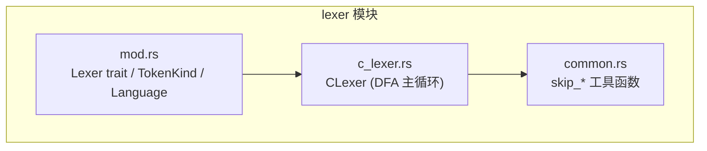
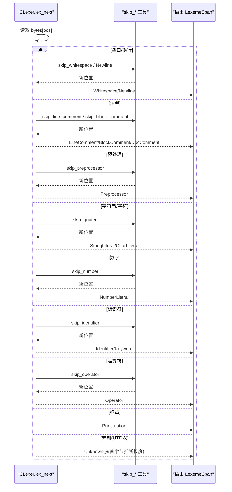
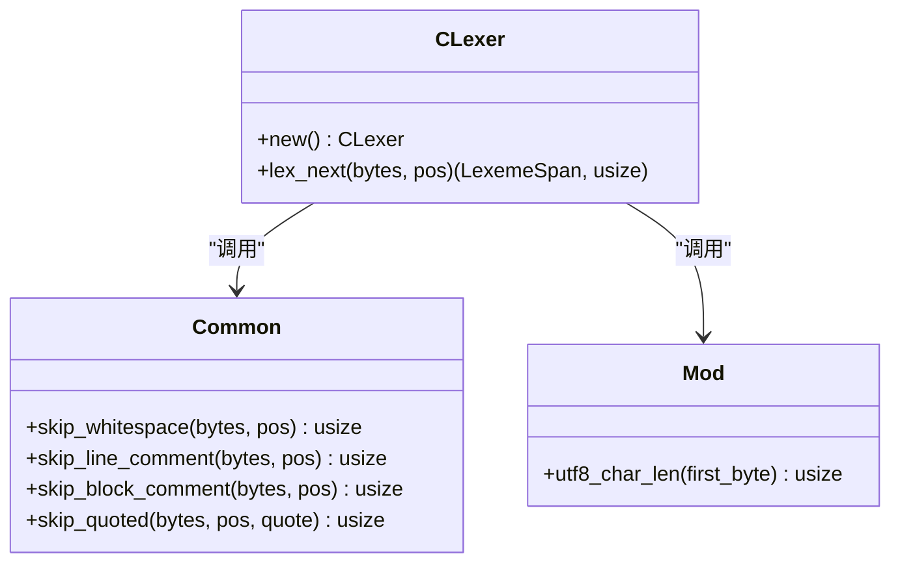
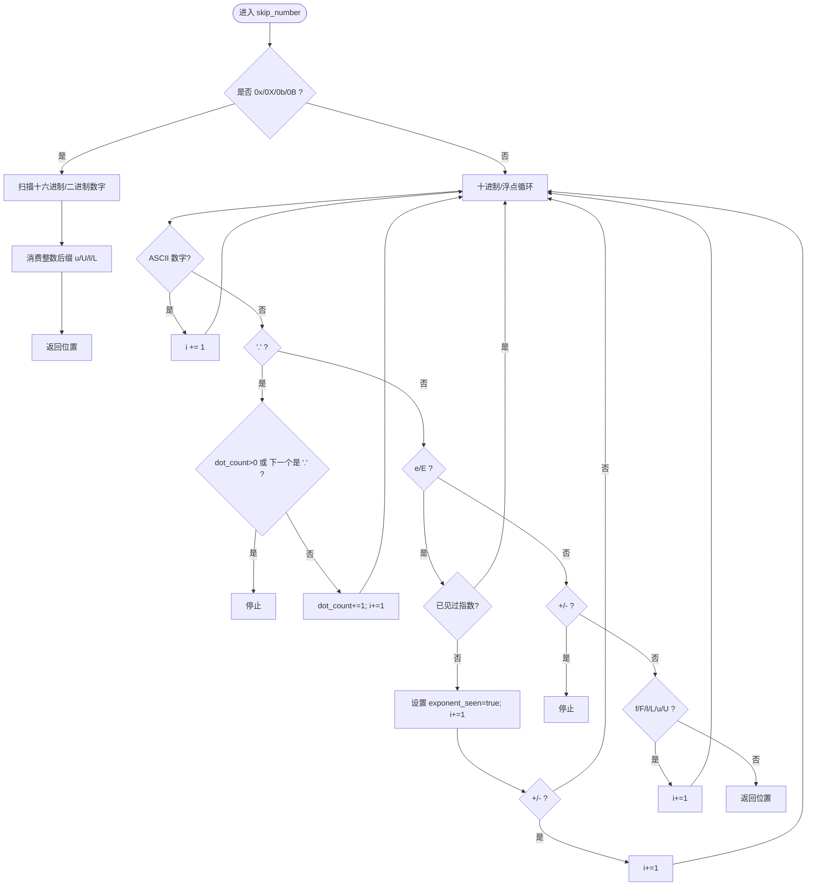
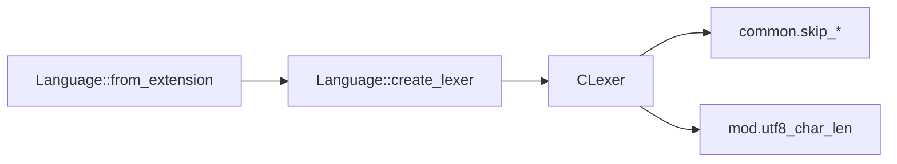

# C/C++ 词法分析器

<cite>
**本文引用的文件**
- [c_lexer.rs](file://crates/aether-core/src/lexer/c_lexer.rs)
- [common.rs](file://crates/aether-core/src/lexer/common.rs)
- [mod.rs](file://crates/aether-core/src/lexer/mod.rs)
- [lexer_bench.rs](file://crates/aether-core/benches/lexer_bench.rs)
</cite>

## 目录
1. [简介](#简介)
2. [项目结构](#项目结构)
3. [核心组件](#核心组件)
4. [架构总览](#架构总览)
5. [详细组件分析](#详细组件分析)
6. [依赖关系分析](#依赖关系分析)
7. [性能考量](#性能考量)
8. [故障排查指南](#故障排查指南)
9. [结论](#结论)
10. [附录：语法元素与测试用例速查](#附录语法元素与测试用例速查)

## 简介
本技术文档围绕 C/C++ 词法分析器（CLexer）的实现进行深入解析，重点说明其基于确定性有限自动机（DFA）的逐字符扫描与状态推进机制。文档覆盖以下能力：
- 预处理指令识别（如 #include、#define），支持续行
- 注释类型：行注释 //、块注释 /* */、文档注释 /** */
- 字符串与字符字面量，含转义处理
- 数字格式：十进制、十六进制（0x）、二进制（0b）、浮点指数、后缀 f/F/l/L/u/U
- 关键字识别机制与操作符处理逻辑
- UTF-8 字符支持策略
- 性能优化策略与错误处理机制
- 结合测试用例的典型场景说明

## 项目结构
C/C++ 词法分析器位于 aether-core 的 lexer 模块中，采用“通用接口 + 多语言实现”的分层组织方式：
- 公共接口与类型定义在 mod.rs（Lexer trait、TokenKind、LexemeSpan、Language 等）
- C/C++ 具体实现位于 c_lexer.rs（CLexer 及其 DFA 驱动的主循环）
- 共享工具函数位于 common.rs（跳过空白、注释、字符串、数字等）
- 基准测试位于 benches/lexer_bench.rs（用于评估不同语言的词法分析吞吐）

图表来源
- [mod.rs:1-196](file://crates/aether-core/src/lexer/mod.rs#L1-L196)
- [c_lexer.rs:1-113](file://crates/aether-core/src/lexer/c_lexer.rs#L1-L113)
- [common.rs:1-90](file://crates/aether-core/src/lexer/common.rs#L1-L90)

章节来源
- [mod.rs:1-196](file://crates/aether-core/src/lexer/mod.rs#L1-L196)
- [c_lexer.rs:1-113](file://crates/aether-core/src/lexer/c_lexer.rs#L1-L113)
- [common.rs:1-90](file://crates/aether-core/src/lexer/common.rs#L1-L90)

## 核心组件
- Lexer trait：统一抽象，提供 lex_full(text) -> Vec<LexemeSpan> 的全量词法分析接口
- TokenKind：跨语言统一的 token 类别枚举（Keyword、Identifier、StringLiteral、CharLiteral、NumberLiteral、LineComment、BlockComment、DocComment、Operator、Punctuation、Preprocessor、Whitespace、Newline、Unknown、EOF 等）
- LexemeSpan：紧凑表示 token 的起始位置、长度、种类与标志位
- Language：按扩展名或路径选择对应 lexer，并可直接静态分发调用 lex_full
- CLexer：C/C++ 词法分析器，基于 DFA 思想在主循环中根据首字节分支到不同 skip_* 子程序，完成 token 切分

章节来源
- [mod.rs:1-196](file://crates/aether-core/src/lexer/mod.rs#L1-L196)
- [c_lexer.rs:1-113](file://crates/aether-core/src/lexer/c_lexer.rs#L1-L113)

## 架构总览
CLexer 的核心是一个以字节为单位的 DFA 式扫描器：
- 读取当前字节，依据首字符分类进入不同分支
- 每个分支调用对应的 skip_* 函数推进位置指针，产出 LexemeSpan
- 循环直到文本结束，输出 token 序列

图表来源
- [c_lexer.rs:12-96](file://crates/aether-core/src/lexer/c_lexer.rs#L12-L96)
- [common.rs:6-55](file://crates/aether-core/src/lexer/common.rs#L6-L55)
- [mod.rs:233-243](file://crates/aether-core/src/lexer/mod.rs#L233-L243)

## 详细组件分析

### CLexer 主循环（DFA 驱动）
- 入口：lex_next(bytes, pos)，根据首字节进行模式匹配
- 空白与换行：直接返回 Whitespace 或 Newline
- 注释：
  - // 行注释：调用 skip_line_comment，直到换行或末尾
  - /* 块注释：调用 skip_block_comment；若内容以 /** 开头且非 /**/ 则标记为 DocComment
- 预处理指令：
  - # 后调用 skip_preprocessor，支持 \ 续行，直到换行或末尾
- 字符串与字符：
  - 双引号字符串：调用 skip_quoted('"')
  - 单引号字符：调用 skip_quoted('\'')
- 数字：
  - 检测 0x/0X/0b/0B 前缀，随后扫描十六进制或二进制数字，再消费整数后缀 u/U/l/L
  - 十进制/浮点数：允许小数点、指数 e/E、可选正负号、后缀 f/F/l/L/u/U
- 标识符与关键字：
  - 字母/下划线开始，连续字母数字/下划线
  - is_keyword_bytes 精确匹配 C/C++ 关键字集合
- 运算符：
  - 支持 ++/--/->/==/!=/<=/>=/<</>>/&&/|| 等复合运算符
- 标点：
  - (){}[],:;.? 等作为 Punctuation
- 未知字符（UTF-8）：
  - 使用 utf8_char_len(first_byte) 推断字符长度，避免非法字节导致死循环

章节来源
- [c_lexer.rs:12-96](file://crates/aether-core/src/lexer/c_lexer.rs#L12-L96)
- [c_lexer.rs:121-169](file://crates/aether-core/src/lexer/c_lexer.rs#L121-L169)
- [c_lexer.rs:171-293](file://crates/aether-core/src/lexer/c_lexer.rs#L171-L293)
- [mod.rs:233-243](file://crates/aether-core/src/lexer/mod.rs#L233-L243)

#### 类图（CLexer 与其依赖）

图表来源
- [c_lexer.rs:1-113](file://crates/aether-core/src/lexer/c_lexer.rs#L1-L113)
- [common.rs:6-55](file://crates/aether-core/src/lexer/common.rs#L6-L55)
- [mod.rs:233-243](file://crates/aether-core/src/lexer/mod.rs#L233-L243)

### 数字字面量解析流程

图表来源
- [c_lexer.rs:185-233](file://crates/aether-core/src/lexer/c_lexer.rs#L185-L233)

### 注释与文档注释识别
- 行注释：从 // 开始，直到换行或末尾
- 块注释：从 /* 开始，直到 */；若内容为 /** 开头且不是 /**/，则标记为文档注释
- 文档注释可用于生成 API 文档，编辑器可据此高亮或折叠

章节来源
- [c_lexer.rs:25-49](file://crates/aether-core/src/lexer/c_lexer.rs#L25-L49)
- [common.rs:14-37](file://crates/aether-core/src/lexer/common.rs#L14-L37)

### 预处理指令处理
- 以 # 开头的整行视为预处理指令
- 支持反斜杠续行（\ 后紧跟换行）
- 直到换行或文本末尾结束

章节来源
- [c_lexer.rs:50-56](file://crates/aether-core/src/lexer/c_lexer.rs#L50-L56)
- [c_lexer.rs:171-183](file://crates/aether-core/src/lexer/c_lexer.rs#L171-L183)

### 字符串与字符字面量
- 双引号字符串：调用 skip_quoted('"')，正确处理转义（如 \"）
- 单引号字符：调用 skip_quoted('\'')
- 遇到不匹配的结束引号时，吞到文本末尾，保证稳健性

章节来源
- [c_lexer.rs:57-67](file://crates/aether-core/src/lexer/c_lexer.rs#L57-L67)
- [common.rs:39-55](file://crates/aether-core/src/lexer/common.rs#L39-L55)

### 关键字识别机制
- 标识符由字母/下划线开始，后续字母数字/下划线
- 通过 is_keyword_bytes 精确匹配 C/C++ 关键字集合（包括 C99/C11 新增关键字如 _Alignas、_Atomic、_Bool、_Complex、_Generic、_Imaginary、_Noreturn、_Static_assert、_Thread_local）
- 未命中关键字则归类为 Identifier

章节来源
- [c_lexer.rs:75-83](file://crates/aether-core/src/lexer/c_lexer.rs#L75-L83)
- [c_lexer.rs:121-169](file://crates/aether-core/src/lexer/c_lexer.rs#L121-L169)

### 操作符处理逻辑
- 支持单字符与复合操作符：++、--、->、==、!=、<=、>=、<<、>>、&&、||、+=、-=、*=、%=、^=、/= 等
- 通过 skip_operator 向前看一位或两位，决定最长匹配

章节来源
- [c_lexer.rs:84-90](file://crates/aether-core/src/lexer/c_lexer.rs#L84-L90)
- [c_lexer.rs:243-293](file://crates/aether-core/src/lexer/c_lexer.rs#L243-L293)

### UTF-8 字符支持
- 对未知字节，使用 utf8_char_len(first_byte) 推断字符长度，确保至少前进一个 UTF-8 字符
- 避免非法字节导致的死循环，提升鲁棒性

章节来源
- [c_lexer.rs:91-94](file://crates/aether-core/src/lexer/c_lexer.rs#L91-L94)
- [mod.rs:233-243](file://crates/aether-core/src/lexer/mod.rs#L233-L243)

## 依赖关系分析
- CLexer 依赖 common 中的 skip_* 工具函数，解耦了具体跳过逻辑
- 通过 Language::from_extension 将文件扩展名映射到 Language::C，从而创建 CLexer
- TokenKind 与 LexemeSpan 作为统一的数据载体，便于上层渲染与语义分析复用

图表来源
- [mod.rs:117-177](file://crates/aether-core/src/lexer/mod.rs#L117-L177)
- [c_lexer.rs:1-113](file://crates/aether-core/src/lexer/c_lexer.rs#L1-L113)
- [common.rs:6-55](file://crates/aether-core/src/lexer/common.rs#L6-L55)
- [mod.rs:233-243](file://crates/aether-core/src/lexer/mod.rs#L233-L243)

章节来源
- [mod.rs:117-177](file://crates/aether-core/src/lexer/mod.rs#L117-L177)
- [c_lexer.rs:1-113](file://crates/aether-core/src/lexer/c_lexer.rs#L1-L113)

## 性能考量
- 零分配主循环：lex_full 预分配 Vec 容量，减少扩容开销
- 字节级扫描：直接操作 &[u8]，避免 UTF-8 解码成本
- 最短匹配与最长匹配结合：
  - 数字解析中防止 1..2 被误合并为一个数字
  - 操作符解析采用最长匹配，减少 token 数量
- 静态分发：Language::lex_full 直接调用具体 lexer，避免 Box 动态分发
- 基准测试：benchmarks 包含 C/Rust/JS/Python 样本，用于评估吞吐

章节来源
- [c_lexer.rs:99-113](file://crates/aether-core/src/lexer/c_lexer.rs#L99-L113)
- [mod.rs:179-196](file://crates/aether-core/src/lexer/mod.rs#L179-L196)
- [lexer_bench.rs:136-158](file://crates/aether-core/benches/lexer_bench.rs#L136-L158)

## 故障排查指南
- 未闭合字符串/字符：
  - skip_quoted 遇到不匹配结束引号会吞到文本末尾，不会崩溃；检查输入是否完整
- 未闭合块注释：
  - skip_block_comment 到达末尾仍未找到 */ 会返回文本末尾；确认注释是否正确闭合
- 数字解析异常：
  - 1..2 不会被识别为单个数字；若期望范围表达式，请在上层语法阶段处理
  - 指数符号仅允许在 e/E 之后出现；其他位置的 +/- 会终止数字解析
- 预处理指令续行：
  - 仅当 \ 后紧跟换行才视为续行；否则按普通字符处理
- UTF-8 未知字符：
  - 未知字节按首字节推断长度，避免死循环；如需更严格校验，可在上层添加编码检查

章节来源
- [common.rs:39-55](file://crates/aether-core/src/lexer/common.rs#L39-L55)
- [common.rs:25-37](file://crates/aether-core/src/lexer/common.rs#L25-L37)
- [c_lexer.rs:185-233](file://crates/aether-core/src/lexer/c_lexer.rs#L185-L233)
- [c_lexer.rs:171-183](file://crates/aether-core/src/lexer/c_lexer.rs#L171-L183)
- [mod.rs:233-243](file://crates/aether-core/src/lexer/mod.rs#L233-L243)

## 结论
CLexer 以简洁高效的 DFA 风格实现了 C/C++ 的词法分析，覆盖主流语法元素与常见边界情况。通过共享工具函数与统一接口，既保证了可扩展性，又维持了高性能。配合完善的测试与基准，能够在编辑器场景中稳定工作。

## 附录：语法元素与测试用例速查
- 预处理指令
  - #include <stdio.h>
  - #define MAX 100
  - 续行：#define FOO \<newline> bar
  - 参考测试：test_c_preprocessor_continuation
- 注释
  - 行注释：// line comment
  - 块注释：/* block */
  - 文档注释：/** doc */
  - 参考测试：test_comments、test_c_doc_comment
- 字符串与字符
  - 字符串："str"
  - 字符：'c'
  - 参考测试：test_c_strings_and_chars
- 数字
  - 十六进制：0x1F
  - 二进制：0b10
  - 浮点：3.14f
  - 指数：1e10L
  - 整数后缀：123u
  - 参考测试：test_c_numbers
- 操作符
  - ++ -- -> == != <= >= << >> && ||
  - 参考测试：test_c_operators、test_c_divide_assignment
- 关键字
  - int main() { return 0; }
  - 参考测试：test_keywords
- UTF-8 未知字符
  - 中文
  - 参考测试：test_c_unknown_utf8

章节来源
- [c_lexer.rs:299-423](file://crates/aether-core/src/lexer/c_lexer.rs#L299-L423)