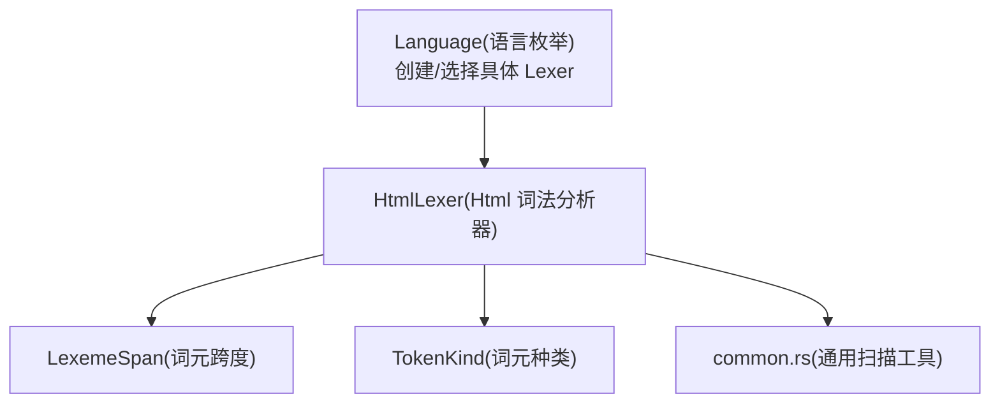
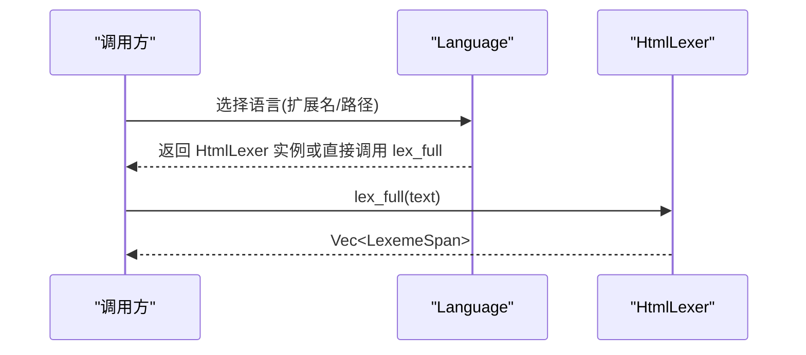
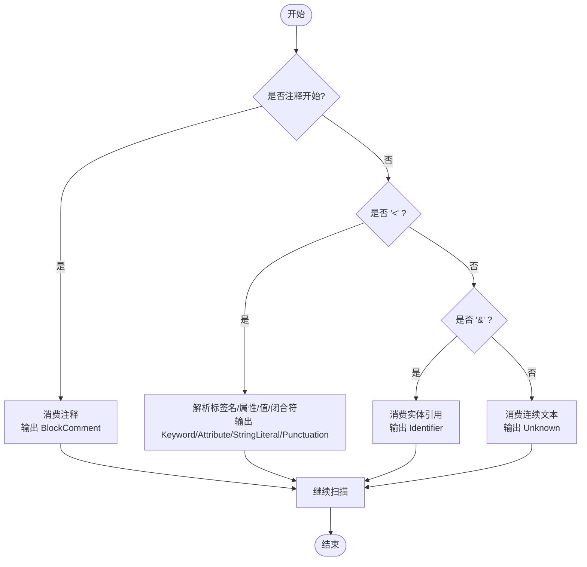
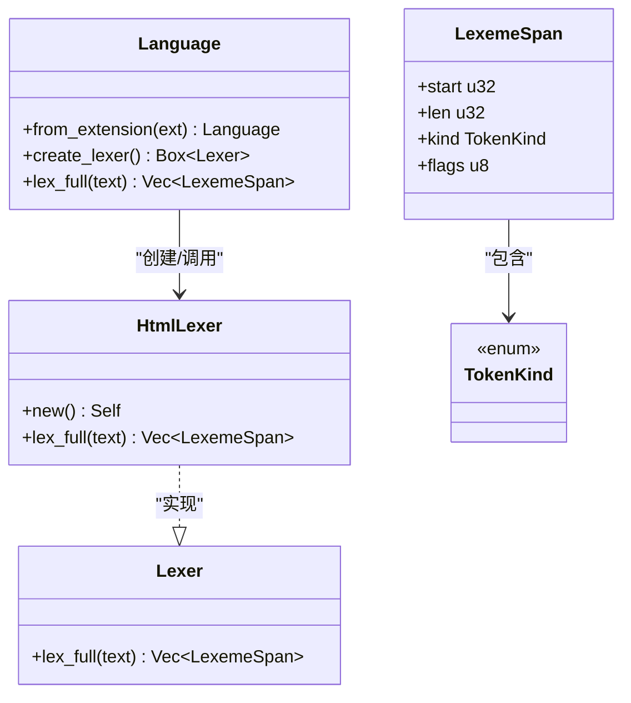

# HTML 词法分析器

<cite>
**本文引用的文件**
- [html_lexer.rs](file://crates/aether-core/src/lexer/html_lexer.rs)
- [mod.rs](file://crates/aether-core/src/lexer/mod.rs)
- [common.rs](file://crates/aether-core/src/lexer/common.rs)
- [lexer_bench.rs](file://crates/aether-core/benches/lexer_bench.rs)
</cite>

## 目录
1. [简介](#简介)
2. [项目结构](#项目结构)
3. [核心组件](#核心组件)
4. [架构总览](#架构总览)
5. [详细组件分析](#详细组件分析)
6. [依赖关系分析](#依赖关系分析)
7. [性能考量](#性能考量)
8. [故障排查指南](#故障排查指南)
9. [结论](#结论)
10. [附录：示例与用法](#附录示例与用法)

## 简介
本技术文档围绕仓库中的 HTML 词法分析器实现，系统性说明其语法元素识别能力、错误恢复策略、以及与其他模块的集成方式。重点覆盖：
- 标签、属性、文本节点、注释、实体引用等基础语法
- HTML5 语义化标签与自定义属性的处理现状
- 特殊字符实体（如 &amp;、&lt;、&gt;）与 Unicode 的处理方式
- 不闭合标签等不规范代码的错误恢复机制
- 在编辑器渲染管线中的使用位置与扩展点

## 项目结构
HTML 词法分析器位于 aether-core 的 lexer 子模块中，采用“多语言统一接口 + 具体语言实现”的组织方式：
- 公共接口与类型定义集中在 mod.rs
- HTML 具体实现位于 html_lexer.rs
- 通用扫描工具函数位于 common.rs
- 基准测试位于 benches/lexer_bench.rs（用于整体性能评估）

图表来源
- [mod.rs:94-196](file://crates/aether-core/src/lexer/mod.rs#L94-L196)
- [html_lexer.rs:1-198](file://crates/aether-core/src/lexer/html_lexer.rs#L1-L198)
- [common.rs:1-90](file://crates/aether-core/src/lexer/common.rs#L1-L90)

章节来源
- [mod.rs:1-306](file://crates/aether-core/src/lexer/mod.rs#L1-L306)
- [html_lexer.rs:1-287](file://crates/aether-core/src/lexer/html_lexer.rs#L1-L287)
- [common.rs:1-151](file://crates/aether-core/src/lexer/common.rs#L1-L151)

## 核心组件
- HtmlLexer：实现 Lexer trait，提供 lex_full 方法对整段文本进行一次性词法分析。
- TokenKind：统一的词元类别，包括 Keyword、Attribute、StringLiteral、BlockComment、Punctuation、Identifier、Unknown 等。
- LexemeSpan：记录每个词元的起始偏移、长度、种类和标志位，便于上层高亮或着色。
- Language：根据扩展名或路径选择并创建对应语言的 Lexer，其中 HTML 相关扩展名均映射到 HtmlLexer。

章节来源
- [html_lexer.rs:1-204](file://crates/aether-core/src/lexer/html_lexer.rs#L1-L204)
- [mod.rs:7-92](file://crates/aether-core/src/lexer/mod.rs#L7-L92)
- [mod.rs:94-196](file://crates/aether-core/src/lexer/mod.rs#L94-L196)

## 架构总览
HTML 词法分析器的调用路径如下：
- 上层通过 Language::create_lexer 或 Language::lex_full 选择 HtmlLexer
- HtmlLexer.lex_full 将输入文本按字节流扫描，产出 LexemeSpan 序列
- 上层渲染层依据 TokenKind 进行着色或高亮

图表来源
- [mod.rs:159-196](file://crates/aether-core/src/lexer/mod.rs#L159-L196)
- [html_lexer.rs:10-198](file://crates/aether-core/src/lexer/html_lexer.rs#L10-L198)

## 详细组件分析

### 词元与数据结构
- TokenKind：涵盖关键字、标识符、字符串字面量、注释、运算符、标点、属性、未知等，为跨语言统一的高亮分类提供基础。
- LexemeSpan：包含 start、len、kind、flags，以紧凑形式存储词元位置与类型，适合高性能渲染。

章节来源
- [mod.rs:7-92](file://crates/aether-core/src/lexer/mod.rs#L7-L92)

### HTML 词法分析流程
HtmlLexer 的核心流程为单遍扫描，按以下优先级识别：
1. 注释 <!-- ... -->
2. 标签 <...>（含结束标签、属性、自闭合）
3. 实体引用 &...;
4. 普通文本（直到遇到 < 或 & 或注释开始）

图表来源
- [html_lexer.rs:16-198](file://crates/aether-core/src/lexer/html_lexer.rs#L16-L198)

章节来源
- [html_lexer.rs:16-198](file://crates/aether-core/src/lexer/html_lexer.rs#L16-L198)

### 标签与属性处理
- 标签名：支持 ASCII 字母数字、连字符、下划线、冒号；若未识别到有效标签名，则将 '<' 作为标点回退。
- 属性：支持 name=value 形式，值可为双引号或单引号包裹的字符串，也支持无引号值。
- 自闭合：支持 '/' 前缀表示自闭合，同时 '>' 作为结束标点。
- 结束标签：支持 '</' 前缀。

章节来源
- [html_lexer.rs:36-158](file://crates/aether-core/src/lexer/html_lexer.rs#L36-L158)

### 注释与文本节点
- 注释：<!-- ... --> 被整体识别为 BlockComment。
- 文本节点：非标签、非实体的连续字符被识别为 Unknown，便于上层统一处理。

章节来源
- [html_lexer.rs:16-34](file://crates/aether-core/src/lexer/html_lexer.rs#L16-L34)
- [html_lexer.rs:178-193](file://crates/aether-core/src/lexer/html_lexer.rs#L178-L193)

### 实体引用与 Unicode
- 实体引用：从 '&' 开始，直到 ';' 或空白或 '<' 为止，整体输出为 Identifier。
- Unicode：当前实现基于字节扫描，不解析 Unicode 转义或解码；UTF-8 首字节推断工具存在于 common.rs，但未被 HTML 词法器直接使用。

章节来源
- [html_lexer.rs:160-176](file://crates/aether-core/src/lexer/html_lexer.rs#L160-L176)
- [common.rs:233-243](file://crates/aether-core/src/lexer/common.rs#L233-L243)

### 错误恢复与健壮性
- 不闭合标签：当遇到 '<' 后无法识别有效标签名时，回退并将 '<' 视为标点，避免阻塞后续解析。
- 不完整实体：若实体引用未以 ';' 结尾，会消费至空白或 '<' 为止，仍输出一个 Identifier，保证不会丢失文本。
- 无引号属性值：遇到空白或 '>' 即停止，确保鲁棒性。

章节来源
- [html_lexer.rs:62-71](file://crates/aether-core/src/lexer/html_lexer.rs#L62-L71)
- [html_lexer.rs:160-176](file://crates/aether-core/src/lexer/html_lexer.rs#L160-L176)
- [html_lexer.rs:127-144](file://crates/aether-core/src/lexer/html_lexer.rs#L127-L144)

### HTML5 语义化标签与自定义属性
- 语义化标签：当前实现不区分内置标签与自定义标签，所有符合标签名规则的标记均识别为 Keyword。因此 HTML5 新增语义化标签（如 <header>、<article>、<section>、<nav>、<footer> 等）可被正确识别为 Keyword。
- 自定义属性：data-* 等自定义属性同样被识别为 Attribute，无需额外配置。

章节来源
- [html_lexer.rs:46-71](file://crates/aether-core/src/lexer/html_lexer.rs#L46-L71)
- [html_lexer.rs:83-145](file://crates/aether-core/src/lexer/html_lexer.rs#L83-L145)

### 与渲染/高亮的集成
- Language::from_extension 将 .html/.htm/.xhtml 及多种模板扩展名（vue/svelte/wxml/ftl/jinja/hbs/ejs/erb/haml/pug/liquid/razor/cshtml）映射到 HtmlLexer。
- Language::lex_full 直接调用对应语言的 lex_full，避免动态分发开销。

章节来源
- [mod.rs:113-149](file://crates/aether-core/src/lexer/mod.rs#L113-L149)
- [mod.rs:179-196](file://crates/aether-core/src/lexer/mod.rs#L179-L196)

## 依赖关系分析
- HtmlLexer 依赖 Lexer trait 与 TokenKind/LexemeSpan 类型定义。
- Language 负责创建/调度 HtmlLexer。
- common.rs 提供通用的跳过/扫描工具函数，虽未被 HtmlLexer 直接复用，但体现了 lexer 层的通用设计。

图表来源
- [mod.rs:1-92](file://crates/aether-core/src/lexer/mod.rs#L1-L92)
- [mod.rs:94-196](file://crates/aether-core/src/lexer/mod.rs#L94-L196)
- [html_lexer.rs:1-204](file://crates/aether-core/src/lexer/html_lexer.rs#L1-L204)

章节来源
- [mod.rs:1-306](file://crates/aether-core/src/lexer/mod.rs#L1-L306)
- [html_lexer.rs:1-287](file://crates/aether-core/src/lexer/html_lexer.rs#L1-L287)

## 性能考量
- 单遍扫描：HtmlLexer 对输入进行一次线性扫描，时间复杂度 O(n)，空间复杂度取决于输出 token 数量。
- 预分配容量：内部使用 with_capacity 减少扩容开销。
- 字节级操作：基于 as_bytes() 进行快速匹配，避免 UTF-8 解码带来的额外成本。
- 基准测试：bench 模块提供了多语言词法分析的基准框架，可用于对比不同语言的解析性能。

章节来源
- [html_lexer.rs:11-14](file://crates/aether-core/src/lexer/html_lexer.rs#L11-L14)
- [lexer_bench.rs:136-158](file://crates/aether-core/benches/lexer_bench.rs#L136-L158)

## 故障排查指南
- 现象：'<div' 未闭合导致后续文本被吞掉
  - 原因：当前实现遇到 '<' 且无法识别有效标签名时会回退，仅将 '<' 作为标点输出，不会阻塞后续解析。
  - 建议：如需更严格的校验，可在上层添加语法检查并提示用户。
- 现象：实体引用未以 ';' 结尾
  - 行为：实体引用会被消费到空白或 '<' 为止，仍输出一个 Identifier，保证文本不被丢弃。
- 现象：属性值缺少闭合引号
  - 行为：有引号时若无闭合引号，会消费到文本末尾；无引号值则在空白或 '>' 处停止。
- 现象：Unicode 显示异常
  - 原因：当前实现基于字节扫描，不进行 Unicode 解码；如需语义层面的 Unicode 处理，应在上层进行。

章节来源
- [html_lexer.rs:62-71](file://crates/aether-core/src/lexer/html_lexer.rs#L62-L71)
- [html_lexer.rs:160-176](file://crates/aether-core/src/lexer/html_lexer.rs#L160-L176)
- [html_lexer.rs:112-144](file://crates/aether-core/src/lexer/html_lexer.rs#L112-L144)

## 结论
该 HTML 词法分析器实现了简洁高效的单遍扫描，能够识别注释、标签（含属性与自闭合）、实体引用与普通文本，并通过回退与保守消费策略保证对不规范输入的鲁棒性。对于 HTML5 语义化标签与自定义属性，当前实现以通用规则识别，满足大多数高亮场景。若需更精细的语义区分（如 DOCTYPE、脚本/样式块、命名空间等），可在现有基础上扩展状态机与规则表。

## 附录：示例与用法
以下为常见 HTML 片段的识别效果说明（基于当前实现的行为）：
- 注释
  - 输入："<!-- comment -->"
  - 输出：单个 BlockComment
- 标签与属性
  - 输入："<a href=\"url\" class='x'>text</a>"
  - 输出：Keyword（标签名）、Attribute（属性名）、Operator（=）、StringLiteral（属性值）、Punctuation（>、/）
- 自闭合标签
  - 输入：" "
  - 输出：Keyword（<br）、Punctuation（/、>）
- 实体引用
  - 输入："&amp; &lt;"
  - 输出：Identifier（实体）、Whitespace、Identifier（实体）
- 文本与注释混合
  - 输入："text<!-- c -->more"
  - 输出：Unknown（text）、BlockComment、Unknown（more）
- 不闭合标签
  - 输入："<div"
  - 输出：Keyword（<div）
- 裸小于号
  - 输入："3 < 4"
  - 输出：Unknown（3）、Punctuation（<）、Unknown（4）

章节来源
- [html_lexer.rs:219-286](file://crates/aether-core/src/lexer/html_lexer.rs#L219-L286)