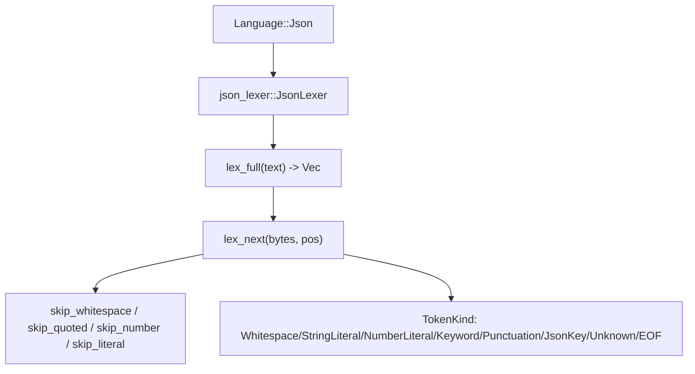
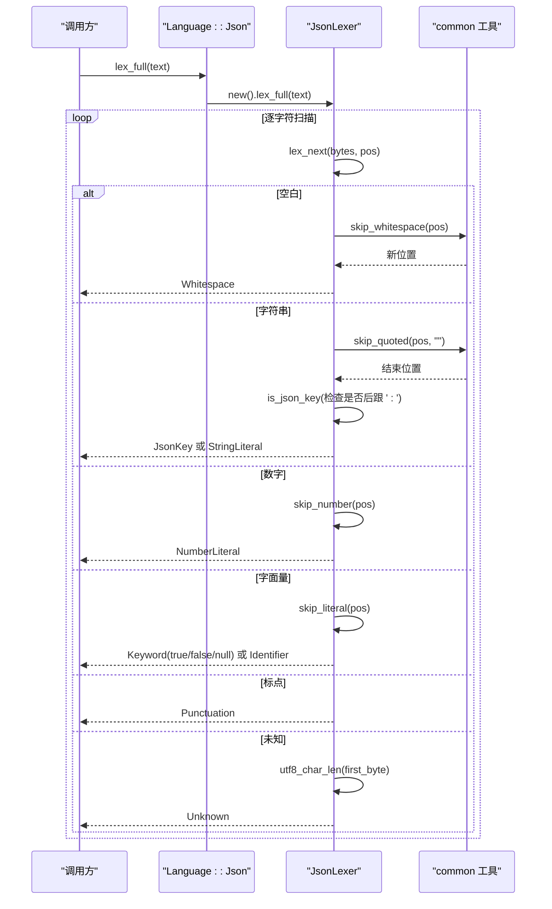
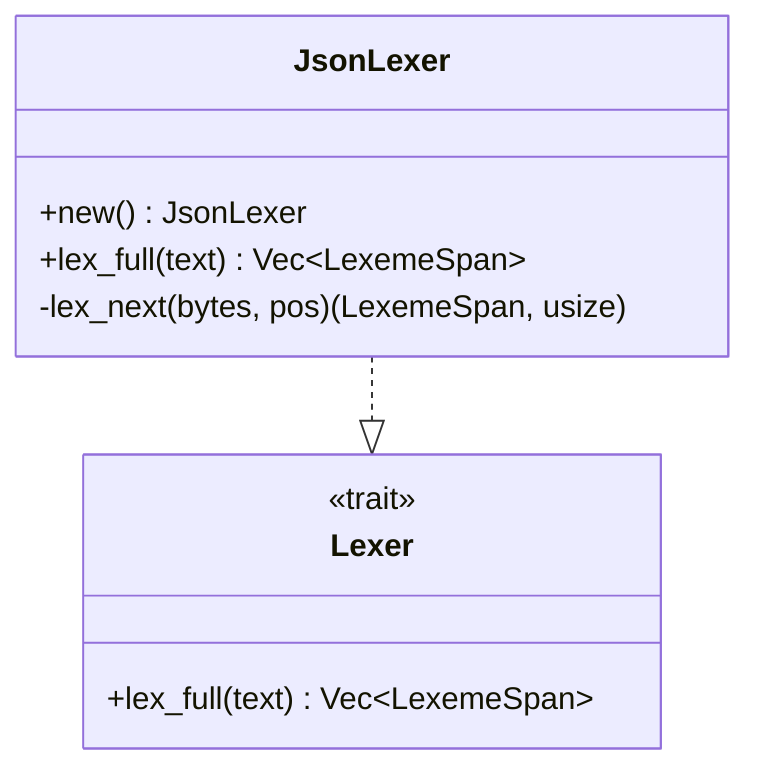
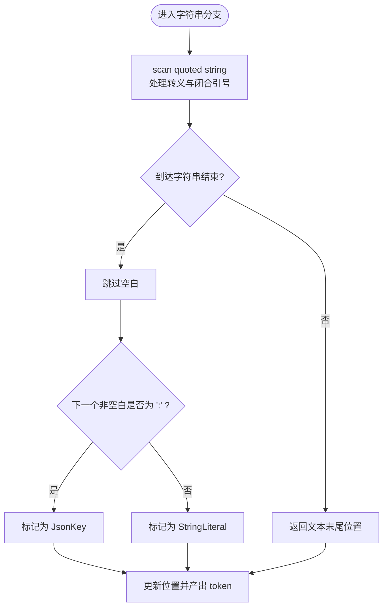
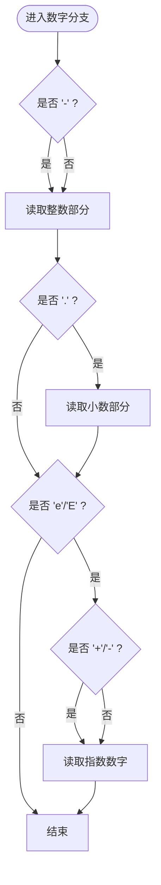
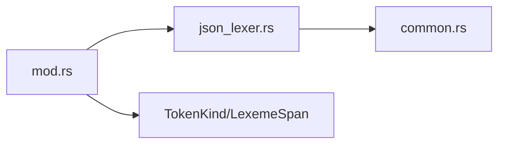

# JSON 词法分析器

<cite>
**本文引用的文件**
- [json_lexer.rs](file://crates/aether-core/src/lexer/json_lexer.rs)
- [common.rs](file://crates/aether-core/src/lexer/common.rs)
- [mod.rs](file://crates/aether-core/src/lexer/mod.rs)
- [recent_projects.json](file://crates/aether-ui/recent_projects.json)
</cite>

## 目录
1. [简介](#简介)
2. [项目结构](#项目结构)
3. [核心组件](#核心组件)
4. [架构总览](#架构总览)
5. [详细组件分析](#详细组件分析)
6. [依赖关系分析](#依赖关系分析)
7. [性能考量](#性能考量)
8. [故障排查指南](#故障排查指南)
9. [结论](#结论)
10. [附录](#附录)

## 简介
本技术文档围绕仓库中的 JSON 词法分析器实现，系统阐述其如何严格识别 JSON 数据类型的词法单元（对象、数组、字符串、数字、布尔值与 null），并说明空白处理、标点符号、键名识别等关键行为。文档还对比通用编程语言词法分析器的差异，强调 JSON 格式的简洁性与严格性；提供示例展示各类数据类型的识别效果；并对错误检测与容错机制进行分析，确保与 JSON 规范保持一致的稳健处理。

## 项目结构
JSON 词法分析器位于 aether-core 的 lexer 模块中，采用统一的 Lexer trait 抽象，并通过 Language 枚举进行语言分发。JSON 专用实现为 JsonLexer，使用字节级扫描以提升性能，同时复用 common 模块中的通用跳过函数。

图表来源
- [mod.rs:160-195](file://crates/aether-core/src/lexer/mod.rs#L160-L195)
- [json_lexer.rs:12-76](file://crates/aether-core/src/lexer/json_lexer.rs#L12-L76)
- [common.rs:6-55](file://crates/aether-core/src/lexer/common.rs#L6-L55)

章节来源
- [mod.rs:1-306](file://crates/aether-core/src/lexer/mod.rs#L1-L306)
- [json_lexer.rs:1-227](file://crates/aether-core/src/lexer/json_lexer.rs#L1-L227)
- [common.rs:1-151](file://crates/aether-core/src/lexer/common.rs#L1-L151)

## 核心组件
- JsonLexer：JSON 专用词法分析器，实现 Lexer trait，负责将输入文本切分为 LexemeSpan 序列。
- TokenKind：统一 token 类型，包含 Keyword、StringLiteral、NumberLiteral、Punctuation、JsonKey、Whitespace、Unknown、EOF 等。
- LexemeSpan：紧凑表示 token 的起始位置、长度、类型与标志位，用于后续高亮或解析。
- 公共工具：common 模块提供 skip_whitespace、skip_quoted 等跨语言复用的扫描函数。

章节来源
- [mod.rs:1-111](file://crates/aether-core/src/lexer/mod.rs#L1-L111)
- [mod.rs:70-92](file://crates/aether-core/src/lexer/mod.rs#L70-L92)
- [json_lexer.rs:4-82](file://crates/aether-core/src/lexer/json_lexer.rs#L4-L82)
- [common.rs:6-55](file://crates/aether-core/src/lexer/common.rs#L6-L55)

## 架构总览
JSON 词法分析流程如下：
- 入口：Language::Json.lex_full 直接调用 json_lexer::JsonLexer::lex_full。
- 主循环：lex_full 将文本转为字节切片，按字符推进，反复调用 lex_next 生成 token。
- 分类规则：根据首字节判断空白、字符串、数字、字面量关键字、标点或未知字符。
- 子过程：
  - 空白：跳过空格、制表符、回车、换行。
  - 字符串：使用 skip_quoted 处理转义与闭合引号；若其后跟随冒号则标记为 JsonKey，否则为 StringLiteral。
  - 数字：支持负号、小数点、指数部分（e/E 及可选正负号）。
  - 字面量：true/false/null 识别为 Keyword，其他字母序列识别为 Identifier。
  - 标点：{ } [ ] , : 识别为 Punctuation。
  - 未知：UTF-8 多字节字符按首字节推断长度，标记为 Unknown。

图表来源
- [mod.rs:179-195](file://crates/aether-core/src/lexer/mod.rs#L179-L195)
- [json_lexer.rs:12-76](file://crates/aether-core/src/lexer/json_lexer.rs#L12-L76)
- [common.rs:6-55](file://crates/aether-core/src/lexer/common.rs#L6-L55)

## 详细组件分析

### JsonLexer 类与接口
- 构造与默认实现：JsonLexer::new() 与 Default 实现。
- 全量词法分析：lex_full 返回 Vec<LexemeSpan>，内部维护位置指针与 token 列表。
- 单步扫描：lex_next 基于首字节分支处理，产出具体 token 类型与下一位置。

图表来源
- [json_lexer.rs:4-82](file://crates/aether-core/src/lexer/json_lexer.rs#L4-L82)
- [mod.rs:1-5](file://crates/aether-core/src/lexer/mod.rs#L1-L5)

章节来源
- [json_lexer.rs:4-82](file://crates/aether-core/src/lexer/json_lexer.rs#L4-L82)
- [mod.rs:1-5](file://crates/aether-core/src/lexer/mod.rs#L1-L5)

### 字符串与键名识别
- 字符串扫描：使用 skip_quoted 正确处理反斜杠转义与闭合引号；遇到不匹配时吞到文本末尾以保证健壮性。
- 键名判定：在字符串结束后跳过空白，若下一个非空白字符为冒号，则标记为 JsonKey，否则为普通 StringLiteral。

图表来源
- [json_lexer.rs:24-33](file://crates/aether-core/src/lexer/json_lexer.rs#L24-L33)
- [json_lexer.rs:84-92](file://crates/aether-core/src/lexer/json_lexer.rs#L84-L92)
- [common.rs:42-55](file://crates/aether-core/src/lexer/common.rs#L42-L55)

章节来源
- [json_lexer.rs:24-33](file://crates/aether-core/src/lexer/json_lexer.rs#L24-L33)
- [json_lexer.rs:84-92](file://crates/aether-core/src/lexer/json_lexer.rs#L84-L92)
- [common.rs:42-55](file://crates/aether-core/src/lexer/common.rs#L42-L55)

### 数字精度与格式
- 支持负号、整数、小数点与小数部分、指数部分（e/E 及可选正负号）。
- 未对数值范围与精度做额外限制，仅完成词法层面的扫描与边界识别。

图表来源
- [json_lexer.rs:104-128](file://crates/aether-core/src/lexer/json_lexer.rs#L104-L128)

章节来源
- [json_lexer.rs:104-128](file://crates/aether-core/src/lexer/json_lexer.rs#L104-L128)

### 字面量与标识符
- true/false/null 识别为 Keyword。
- 其他字母序列识别为 Identifier。
- 该逻辑保证 JSON 关键字不被误判为标识符。

章节来源
- [json_lexer.rs:42-50](file://crates/aether-core/src/lexer/json_lexer.rs#L42-L50)
- [json_lexer.rs:130-136](file://crates/aether-core/src/lexer/json_lexer.rs#L130-L136)

### 空白与标点
- 空白包括空格、制表符、回车、换行，统一标记为 Whitespace。
- 标点包括 { } [ ] , :，统一标记为 Punctuation。

章节来源
- [json_lexer.rs:20-23](file://crates/aether-core/src/lexer/json_lexer.rs#L20-L23)
- [json_lexer.rs:51-53](file://crates/aether-core/src/lexer/json_lexer.rs#L51-L53)
- [common.rs:6-12](file://crates/aether-core/src/lexer/common.rs#L6-L12)

### UTF-8 与 Unicode 支持
- 未知字符路径使用 utf8_char_len 根据首字节推断字符长度，避免越界并保证至少前进一步。
- 字符串扫描通过 skip_quoted 处理任意字节内容，但当前实现未显式校验 Unicode 转义序列（如 \uXXXX）；对于非法或不支持的转义，行为以“安全跳过”为主，保持鲁棒性。

章节来源
- [json_lexer.rs:54-57](file://crates/aether-core/src/lexer/json_lexer.rs#L54-L57)
- [mod.rs:233-243](file://crates/aether-core/src/lexer/mod.rs#L233-L243)
- [common.rs:42-55](file://crates/aether-core/src/lexer/common.rs#L42-L55)

### 与通用编程语言词法分析器的区别
- JSON 无注释语法：当前实现不识别注释，符合 JSON 规范。
- JSON 严格类型：关键字 true/false/null 必须精确匹配，否则视为标识符。
- JSON 键名必须是双引号字符串：实现通过 is_json_key 在后置冒号处区分键名与普通字符串。
- JSON 数字格式受限：仅支持十进制、小数与指数形式，不支持十六进制、八进制等扩展。
- JSON 不允许尾随逗号：当前实现仅做词法切分，不进行语法验证；但标点 token 可被上层语法分析器用于错误检测。

章节来源
- [json_lexer.rs:42-53](file://crates/aether-core/src/lexer/json_lexer.rs#L42-L53)
- [json_lexer.rs:84-92](file://crates/aether-core/src/lexer/json_lexer.rs#L84-L92)
- [json_lexer.rs:104-128](file://crates/aether-core/src/lexer/json_lexer.rs#L104-L128)

## 依赖关系分析
- JsonLexer 依赖 common 模块的 skip_quoted 与 skip_whitespace。
- Language 枚举将 .json/.jsonc/.jsonl 映射到 Language::Json，并创建 JsonLexer。
- TokenKind 与 LexemeSpan 为所有语言共享，确保高亮与后续处理的统一性。

图表来源
- [mod.rs:160-195](file://crates/aether-core/src/lexer/mod.rs#L160-L195)
- [json_lexer.rs:1-12](file://crates/aether-core/src/lexer/json_lexer.rs#L1-L12)
- [common.rs:1-55](file://crates/aether-core/src/lexer/common.rs#L1-L55)

章节来源
- [mod.rs:160-195](file://crates/aether-core/src/lexer/mod.rs#L160-L195)
- [json_lexer.rs:1-12](file://crates/aether-core/src/lexer/json_lexer.rs#L1-L12)
- [common.rs:1-55](file://crates/aether-core/src/lexer/common.rs#L1-L55)

## 性能考量
- 字节级扫描：lex_full 将文本转换为 bytes 切片，减少编码转换开销。
- 预分配容量：tokens 初始容量按 text.len()/4 估算，降低扩容次数。
- 简单状态机：lex_next 基于首字节快速分支，避免复杂状态管理。
- 复用工具函数：skip_quoted/skip_whitespace 等通用函数提升复用率与一致性。
- 基准测试：bench 模块覆盖多种语言，可作为整体性能参考；JSON 可通过相同框架接入评估。

章节来源
- [json_lexer.rs:63-76](file://crates/aether-core/src/lexer/json_lexer.rs#L63-L76)
- [common.rs:6-55](file://crates/aether-core/src/lexer/common.rs#L6-L55)
- [benches/lexer_bench.rs:136-158](file://crates/aether-core/benches/lexer_bench.rs#L136-L158)

## 故障排查指南
- 未知字符：当遇到无法识别的首字节时，会按 utf8_char_len 推断长度并标记为 Unknown，避免死循环。
- 未闭合字符串：skip_quoted 在遇到不匹配闭合引号时会吞到文本末尾，保证继续前进；上层应结合语法分析进行错误提示。
- 非法字面量：非 true/false/null 的字母序列会被识别为 Identifier，便于调试定位问题。
- 键名误判：is_json_key 仅在字符串后紧跟冒号时标记为 JsonKey；若冒号前存在非法空白或其他字符，需由上层语法分析器校验。

章节来源
- [json_lexer.rs:54-57](file://crates/aether-core/src/lexer/json_lexer.rs#L54-L57)
- [json_lexer.rs:84-92](file://crates/aether-core/src/lexer/json_lexer.rs#L84-L92)
- [common.rs:42-55](file://crates/aether-core/src/lexer/common.rs#L42-L55)

## 结论
该 JSON 词法分析器以简洁、严格的方式实现了 JSON 数据类型的词法识别，重点覆盖对象、数组、字符串、数字、布尔值与 null 的基本形态，并通过键名识别与标点分离为上层语法分析提供清晰的结构信息。其设计强调鲁棒性与性能：字节级扫描、预分配容量、通用工具复用以及未知字符的安全处理。尽管未实现完整的 Unicode 转义校验与语法错误检测，但已满足编辑器高亮与基础语义分析的需求；更严格的规范合规可由上层解析器补充。

## 附录
- JSON 数据类型识别示例（来自仓库内 JSON 文件）：
  - 对象与数组：recent_projects.json 展示了对象数组结构，键名与字符串值均可被正确识别。
  - 数字：测试用例覆盖了负数、小数与指数形式。
  - 布尔与 null：测试用例验证了 true/false/null 作为关键字的识别。
  - 标点与空白：测试用例验证了分隔符与空白 token 的生成。

章节来源
- [recent_projects.json:1-17](file://crates/aether-ui/recent_projects.json#L1-L17)
- [json_lexer.rs:138-226](file://crates/aether-core/src/lexer/json_lexer.rs#L138-L226)