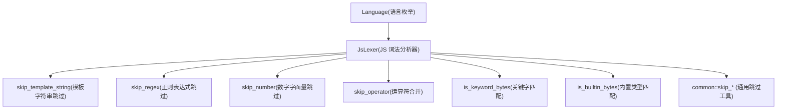
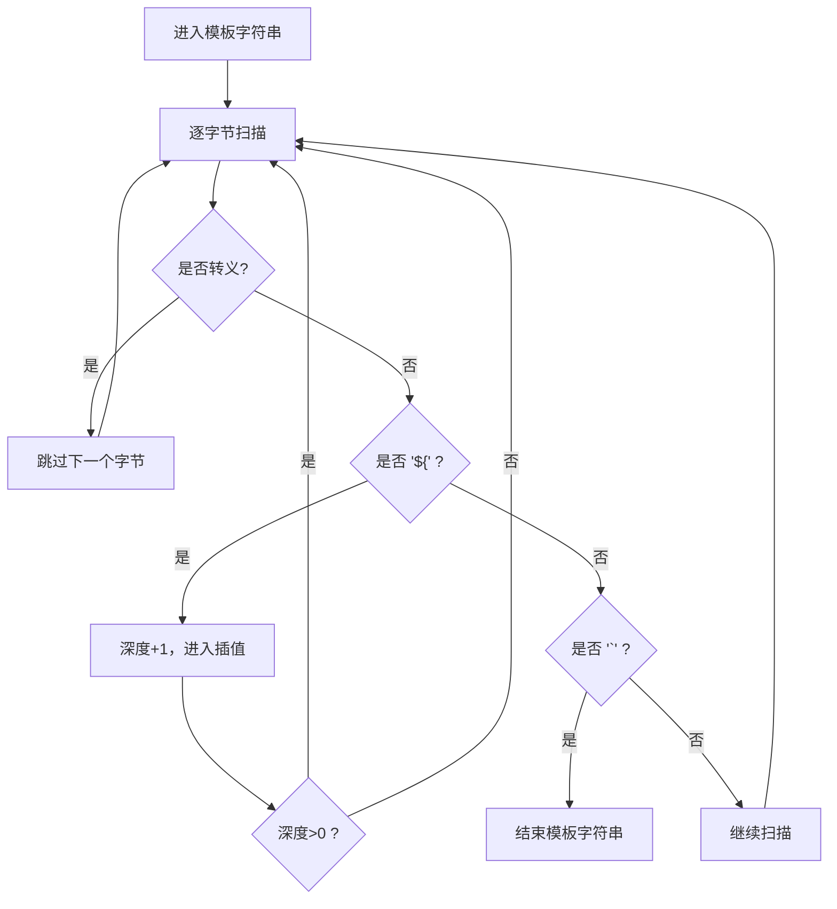
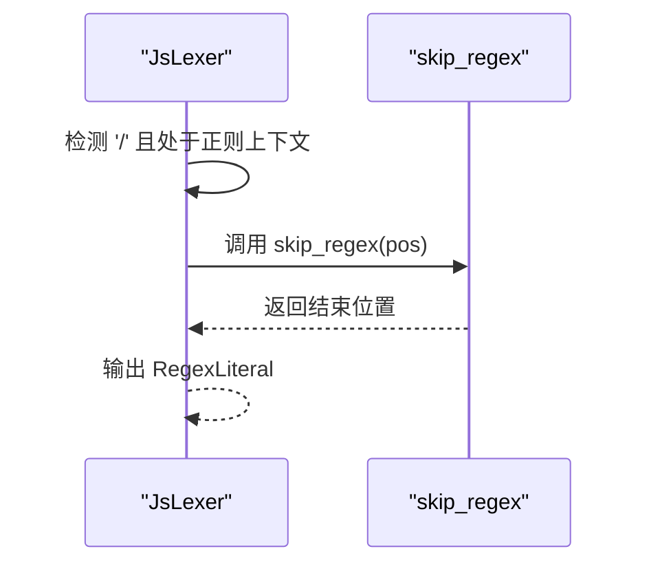
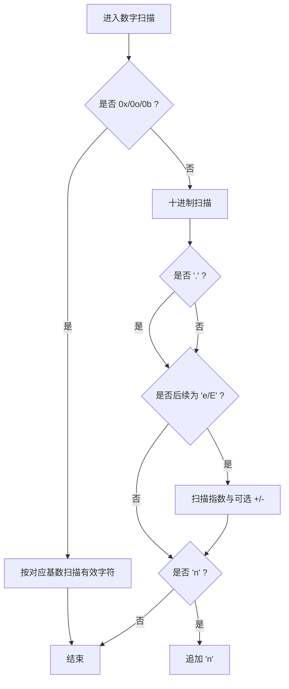
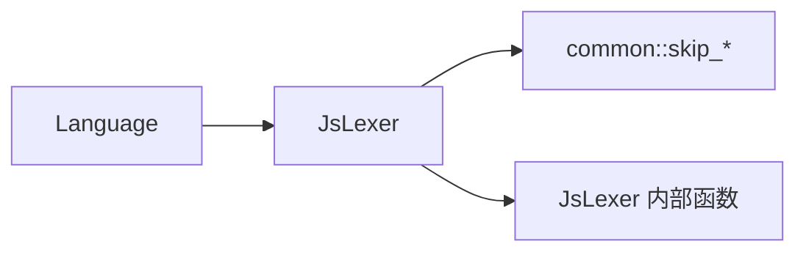

# JavaScript 词法分析器

<cite>
**本文引用的文件**
- [js_lexer.rs](file://crates/aether-core/src/lexer/js_lexer.rs)
- [common.rs](file://crates/aether-core/src/lexer/common.rs)
- [mod.rs](file://crates/aether-core/src/lexer/mod.rs)
- [benchmarks.rs](file://crates/aether-core/src/benchmarks.rs)
</cite>

## 目录
1. [简介](#简介)
2. [项目结构](#项目结构)
3. [核心组件](#核心组件)
4. [架构总览](#架构总览)
5. [详细组件分析](#详细组件分析)
6. [依赖关系分析](#依赖关系分析)
7. [性能考量](#性能考量)
8. [故障排查指南](#故障排查指南)
9. [结论](#结论)
10. [附录](#附录)

## 简介
本技术文档聚焦于仓库中的 JavaScript 词法分析器实现，系统性解析其对现代 ES 特性的支持情况与内部工作机制。重点覆盖：
- 模板字符串（含嵌套插值）
- 正则表达式字面量
- 箭头函数语法（通过关键字与标识符识别）
- 解构赋值（通过关键字与标点符号组合识别）
- 字符串字面量多种格式（普通字符串、模板字符串、标签模板）
- 数字字面量（科学计数法、BigInt、十六进制前缀等）
- 异步编程关键字（async、await）
- 模块系统关键字（import、export）
同时说明错误恢复机制与兼容性考虑，并提供可复用的代码片段识别示例路径。

## 项目结构
JavaScript 词法分析位于 aether-core 的 lexer 模块中，采用“通用 Lexer trait + 语言特定实现”的分层设计：
- 公共接口与 Token 类型定义在 mod.rs
- JS 具体实现位于 js_lexer.rs
- 共享扫描工具在 common.rs
- 基准测试与增量分析在 benchmarks.rs



图表来源
- [mod.rs:94-196](file://crates/aether-core/src/lexer/mod.rs#L94-L196)
- [js_lexer.rs:12-158](file://crates/aether-core/src/lexer/js_lexer.rs#L12-L158)

章节来源
- [mod.rs:1-196](file://crates/aether-core/src/lexer/mod.rs#L1-L196)
- [js_lexer.rs:1-158](file://crates/aether-core/src/lexer/js_lexer.rs#L1-L158)

## 核心组件
- JsLexer：基于字节流的单行全量词法分析器，提供 lex_full 接口，按字符分类推进位置并产出 LexemeSpan。
- TokenKind：跨语言的统一 Token 类型集合，包含 Keyword、Identifier、StringLiteral、NumberLiteral、RegexLiteral、FormatString、Operator、Punctuation、Whitespace、Newline、Unknown、EOF 等。
- Language：根据扩展名选择对应 Lexer，JS/TS 共用 JsLexer。
- 通用工具：skip_whitespace、skip_line_comment、skip_block_comment、skip_quoted、utf8_char_len 等。

章节来源
- [mod.rs:1-111](file://crates/aether-core/src/lexer/mod.rs#L1-L111)
- [mod.rs:113-196](file://crates/aether-core/src/lexer/mod.rs#L113-L196)
- [js_lexer.rs:1-158](file://crates/aether-core/src/lexer/js_lexer.rs#L1-L158)
- [common.rs:1-55](file://crates/aether-core/src/lexer/common.rs#L1-L55)

## 架构总览
JS 词法分析流程以状态机式逐字符扫描为核心，关键分支包括：
- 空白与换行
- 注释（行注释、块注释）
- 字符串与模板字符串
- 数字字面量（十进制、科学计数法、进制前缀、BigInt）
- 标识符与关键字/内置类型
- 运算符合并（含新运算符如 **=、??=、?.、>>> 等）
- 正则表达式字面量（上下文敏感判断）

```mermaid
flowchart TD
Start(["开始 lex_next"]) --> Ch{"当前字节"}
Ch --> |空白/制表/回车| WS["跳过空白"]
Ch --> |换行| NL["输出 Newline"]
Ch --> |'/'| Slash{"下一字节?"}
Slash --> |"//"| LC["跳过行注释"]
Slash --> |"/*"| BC["跳过块注释"]
Slash --> |其他| RegexCtx{"是否正则上下文?"}
RegexCtx --> |是| RE["跳过正则并输出 RegexLiteral"]
RegexCtx --> |否| OP["跳过运算符并输出 Operator"]
Ch --> |'`'| TS["跳过模板字符串并输出 FormatString"]
Ch --> |'"'或"'"| STR["跳过引号字符串并输出 StringLiteral"]
Ch --> |数字| NUM["跳过数字并输出 NumberLiteral"]
Ch --> |字母/下划线/$| ID["跳过标识符并判定 Keyword/TypeName/Identifier"]
Ch --> |运算符首字符| OP2["合并多字符运算符并输出 Operator"]
Ch --> |标点| PUNC["输出 Punctuation"]
Ch --> |其他| UTF8["按UTF-8完整字符推进并输出 Unknown"]
WS --> End(["结束"])
NL --> End
LC --> End
BC --> End
RE --> End
OP --> End
TS --> End
STR --> End
NUM --> End
ID --> End
OP2 --> End
PUNC --> End
UTF8 --> End
```

图表来源
- [js_lexer.rs:12-141](file://crates/aether-core/src/lexer/js_lexer.rs#L12-L141)

章节来源
- [js_lexer.rs:12-141](file://crates/aether-core/src/lexer/js_lexer.rs#L12-L141)

## 详细组件分析

### 模板字符串（含嵌套插值）
- 行为：遇到反引号进入模板字符串模式，安全处理转义字符；当检测到 ${ 时，进入插值区域，使用深度计数器平衡 {}，确保嵌套模板与表达式正确跳过。
- 输出：FormatString。
- 复杂度：O(n)，n 为模板字符串长度；插值部分线性扫描。
- 边界处理：末尾反斜杠不越界；未闭合模板返回到文本末尾。



图表来源
- [js_lexer.rs:305-330](file://crates/aether-core/src/lexer/js_lexer.rs#L305-L330)

章节来源
- [js_lexer.rs:305-330](file://crates/aether-core/src/lexer/js_lexer.rs#L305-L330)

### 正则表达式字面量
- 上下文判断：向前查找最近的非空白字符，若为 (、[、,、=、:、;、!、&、|、?、{、}、\n、~ 之一，则视为正则上下文。
- 扫描规则：正确处理字符集 [...] 内的 /，以及标志位 g、i、m 等。
- 输出：RegexLiteral。
- 复杂度：O(n)。



图表来源
- [js_lexer.rs:25-87](file://crates/aether-core/src/lexer/js_lexer.rs#L25-L87)
- [js_lexer.rs:332-357](file://crates/aether-core/src/lexer/js_lexer.rs#L332-L357)

章节来源
- [js_lexer.rs:25-87](file://crates/aether-core/src/lexer/js_lexer.rs#L25-L87)
- [js_lexer.rs:332-357](file://crates/aether-core/src/lexer/js_lexer.rs#L332-L357)

### 数字字面量（科学计数法、BigInt、十六进制前缀）
- 支持：
  - 十进制整数与浮点数（含小数点）
  - 科学计数法 e/E 及可选正负指数
  - 进制前缀：0x/0X、0o/0O、0b/0B
  - BigInt 后缀 n
  - 下划线分隔符
- 特殊保护：避免将 1..2 误合并为数字（阻止连续点）。
- 输出：NumberLiteral。
- 复杂度：O(n)。



图表来源
- [js_lexer.rs:359-408](file://crates/aether-core/src/lexer/js_lexer.rs#L359-L408)

章节来源
- [js_lexer.rs:359-408](file://crates/aether-core/src/lexer/js_lexer.rs#L359-L408)

### 运算符合并与新运算符
- 支持多字符运算符合并，包括：
  - 比较与相等：===、!==
  - 幂与幂赋值：**、**=
  - 空值合并与赋值：??、??=
  - 可选链：?.
  - 无符号右移：>>>
  - 左移赋值：<<=
- 输出：Operator。
- 复杂度：常数级检查，整体 O(n)。

章节来源
- [js_lexer.rs:420-521](file://crates/aether-core/src/lexer/js_lexer.rs#L420-L521)

### 关键字与内置类型
- 关键字：包含控制流、声明、模块与异步相关关键字，如 import、export、async、await、static、get、set、of、from、as、enum、implements、interface、package、private、protected、public、abstract、boolean、byte、char、double、final、float、goto、int、long、native、short、synchronized、throws、transient、volatile、null、true、false、undefined 等。
- 内置类型：Array、Object、String、Number、Boolean、Date、RegExp、Function、Symbol、Error、Map、Set、WeakMap、WeakSet、Promise、Proxy、Reflect、JSON、Math、console、window、document、globalThis、require、module、exports、Buffer、process、EventEmitter 以及 TypeScript 类型与工具类型等。
- 输出：Keyword、TypeName。

章节来源
- [js_lexer.rs:166-303](file://crates/aether-core/src/lexer/js_lexer.rs#L166-L303)

### 字符串字面量与标签模板
- 普通字符串：双引号与单引号，均调用通用 skip_quoted，支持转义与未闭合回退。
- 模板字符串：反引号，支持 ${...} 插值与嵌套模板。
- 标签模板：语法上仍由模板字符串处理，标签名作为前置标识符，由上层语义解析负责。
- 输出：StringLiteral、FormatString。

章节来源
- [js_lexer.rs:88-107](file://crates/aether-core/src/lexer/js_lexer.rs#L88-L107)
- [js_lexer.rs:305-330](file://crates/aether-core/src/lexer/js_lexer.rs#L305-L330)
- [common.rs:39-55](file://crates/aether-core/src/lexer/common.rs#L39-L55)

### 现代 ES 特性识别要点
- 箭头函数：由标识符与标点组合构成（例如参数列表与 =>），词法阶段仅识别标识符与运算符，=> 会被拆分为两个 > 或作为运算符序列，具体语义由上层解析器决定。
- 解构赋值：由 {、[、]、逗号、冒号等标点与标识符组合表示，词法阶段仅拆分出标点与标识符，语义由上层解析器决定。
- 异步与模块：async、await、import、export 等已纳入关键字集合，便于高亮与基础语法识别。

章节来源
- [js_lexer.rs:166-210](file://crates/aether-core/src/lexer/js_lexer.rs#L166-L210)
- [js_lexer.rs:128-134](file://crates/aether-core/src/lexer/js_lexer.rs#L128-L134)

## 依赖关系分析
- JsLexer 依赖：
  - common 模块：skip_whitespace、skip_line_comment、skip_block_comment、skip_quoted、utf8_char_len
  - 自身：skip_template_string、skip_regex、skip_number、skip_identifier、skip_operator、is_keyword_bytes、is_builtin_bytes
- Language 调度：
  - 对 .js/.jsx/.mjs/.cjs/.es/.es6 与 .ts/.tsx/.mts/.cts 统一使用 JsLexer



图表来源
- [mod.rs:113-196](file://crates/aether-core/src/lexer/mod.rs#L113-L196)
- [js_lexer.rs:1-158](file://crates/aether-core/src/lexer/js_lexer.rs#L1-L158)

章节来源
- [mod.rs:113-196](file://crates/aether-core/src/lexer/mod.rs#L113-L196)
- [js_lexer.rs:1-158](file://crates/aether-core/src/lexer/js_lexer.rs#L1-L158)

## 性能考量
- 时间复杂度：
  - 全量分析 O(n)，n 为输入字节数；各子扫描均为线性。
- 空间复杂度：
  - 输出 tokens 向量容量预分配，减少扩容开销。
- 优化点：
  - 使用字节切片直接扫描，避免额外拷贝。
  - 合理跳过空白与注释，减少无效处理。
  - 运算符合并为常数步长检查。
- 基准参考：
  - 项目提供增量词法分析与 SIMD 加速的基准框架，可用于评估不同场景下的吞吐与时延。

章节来源
- [js_lexer.rs:144-158](file://crates/aether-core/src/lexer/js_lexer.rs#L144-L158)
- [benchmarks.rs:55-87](file://crates/aether-core/src/benchmarks.rs#L55-L87)

## 故障排查指南
- 常见问题定位：
  - 正则误判：确认上下文判断逻辑是否正确（如标识符后不应视为正则）。
  - 模板字符串未闭合：会吞至文本末尾，需检查外层模板与插值深度。
  - 数字解析异常：注意 1..2 被阻止合并为数字；BigInt 后缀 n 仅在数字后出现。
  - 未知字符：UTF-8 完整字符推进，避免中文/emoji 导致高亮错位。
- 调试建议：
  - 使用单元测试样例验证各类语法片段的 token 种类与数量。
  - 结合 Language.lex_full 进行端到端验证。

章节来源
- [js_lexer.rs:523-661](file://crates/aether-core/src/lexer/js_lexer.rs#L523-L661)
- [common.rs:92-150](file://crates/aether-core/src/lexer/common.rs#L92-L150)

## 结论
该 JavaScript 词法分析器以简洁高效的字节扫描实现了对现代 ES 语法的广泛支持，涵盖模板字符串、正则表达式、数字字面量（含 BigInt）、关键字（含 async/await、import/export）等。其设计强调：
- 清晰的职责划分（通用工具与语言特定实现分离）
- 稳定的错误恢复（未闭合字符串/注释/模板回退到末尾）
- 良好的可扩展性（TokenKind 与 Language 调度）
对于更复杂的语义（如箭头函数、解构赋值），词法阶段仅提供基础标记，语义解析交由上层完成，符合高性能编辑器的分层架构原则。

## 附录
- 代码片段识别示例（路径引用，不含代码内容）：
  - 模板字符串与嵌套插值：[js_lexer.rs:536-542](file://crates/aether-core/src/lexer/js_lexer.rs#L536-L542)、[js_lexer.rs:650-660](file://crates/aether-core/src/lexer/js_lexer.rs#L650-L660)
  - 正则表达式字面量：[js_lexer.rs:544-553](file://crates/aether-core/src/lexer/js_lexer.rs#L544-L553)、[js_lexer.rs:638-648](file://crates/aether-core/src/lexer/js_lexer.rs#L638-L648)
  - 数字字面量（科学计数法、BigInt、十六进制前缀）：[js_lexer.rs:580-590](file://crates/aether-core/src/lexer/js_lexer.rs#L580-L590)
  - 运算符合并（含 ??=、?.、>>> 等）：[js_lexer.rs:592-600](file://crates/aether-core/src/lexer/js_lexer.rs#L592-L600)
  - 关键字与内置类型（含 async/await、import/export）：[js_lexer.rs:166-210](file://crates/aether-core/src/lexer/js_lexer.rs#L166-L210)、[js_lexer.rs:241-303](file://crates/aether-core/src/lexer/js_lexer.rs#L241-L303)
  - 字符串字面量与标签模板：[js_lexer.rs:88-107](file://crates/aether-core/src/lexer/js_lexer.rs#L88-L107)、[js_lexer.rs:570-578](file://crates/aether-core/src/lexer/js_lexer.rs#L570-L578)