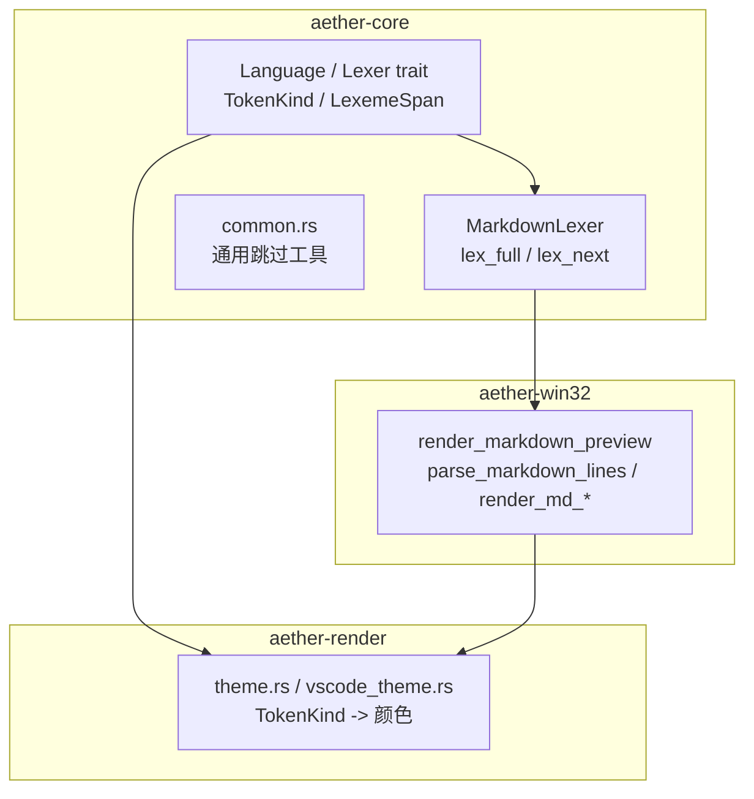
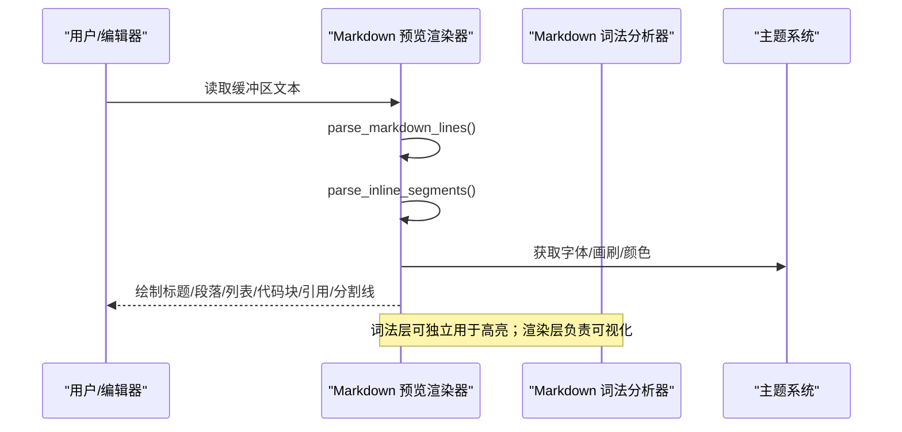
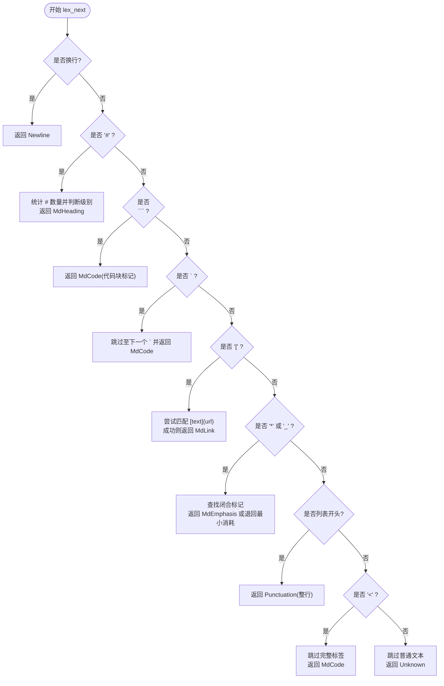
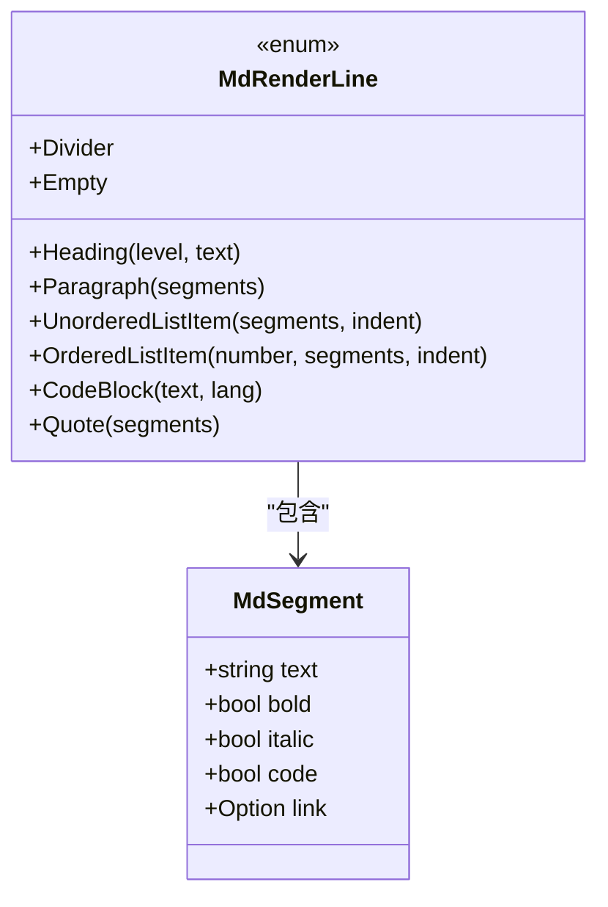

# Markdown 词法分析器

<cite>
**本文引用的文件**
- [markdown_lexer.rs](file://crates/aether-core/src/lexer/markdown_lexer.rs)
- [mod.rs](file://crates/aether-core/src/lexer/mod.rs)
- [common.rs](file://crates/aether-core/src/lexer/common.rs)
- [markdown_preview.rs](file://crates/aether-win32/src/render/markdown_preview.rs)
- [theme.rs](file://crates/aether-render/src/theme.rs)
- [vscode_theme.rs](file://crates/aether-render/src/vscode_theme.rs)
</cite>

## 目录
1. [简介](#简介)
2. [项目结构](#项目结构)
3. [核心组件](#核心组件)
4. [架构总览](#架构总览)
5. [详细组件分析](#详细组件分析)
6. [依赖关系分析](#依赖关系分析)
7. [性能考量](#性能考量)
8. [故障排查指南](#故障排查指南)
9. [结论](#结论)
10. [附录：语法与示例对照表](#附录语法与示例对照表)

## 简介
本技术文档聚焦于仓库中的 Markdown 词法分析与预览渲染能力，覆盖以下方面：
- 词法层面：标题、段落、列表（有序/无序）、链接、图片占位、代码块、引用块、HTML 嵌入等。
- 内联格式：粗体、斜体、行内代码、链接；删除线在当前实现中未作为独立 token 类型支持。
- HTML 嵌入：以“代码片段”形式识别并高亮，便于编辑时区分。
- 扩展语法：当前实现包含分割线、引用块、代码围栏等常见扩展。
- 解析与渲染：从文本到渲染行的转换流程，以及基于 DirectWrite/Direct2D 的富文本绘制。
- 嵌套结构与上下文感知：代码块围栏、列表缩进、行内标记匹配等。

## 项目结构
Markdown 相关能力分布在两个 crate：
- aether-core：通用词法框架与 Markdown 词法分析器（按字节扫描，产出 LexemeSpan）。
- aether-win32：Markdown 预览渲染器，将 Markdown 文本解析为 MdRenderLine，并使用 DirectWrite 富文本绘制。
- aether-render：主题映射，将 TokenKind 映射到颜色，供编辑器高亮使用。



图表来源
- [mod.rs:1-196](file://crates/aether-core/src/lexer/mod.rs#L1-L196)
- [markdown_lexer.rs:1-137](file://crates/aether-core/src/lexer/markdown_lexer.rs#L1-L137)
- [markdown_preview.rs:785-863](file://crates/aether-win32/src/render/markdown_preview.rs#L785-L863)
- [theme.rs:420-467](file://crates/aether-render/src/theme.rs#L420-L467)
- [vscode_theme.rs:205-244](file://crates/aether-render/src/vscode_theme.rs#L205-L244)

章节来源
- [mod.rs:1-196](file://crates/aether-core/src/lexer/mod.rs#L1-L196)
- [markdown_lexer.rs:1-137](file://crates/aether-core/src/lexer/markdown_lexer.rs#L1-L137)
- [markdown_preview.rs:785-863](file://crates/aether-win32/src/render/markdown_preview.rs#L785-L863)
- [theme.rs:420-467](file://crates/aether-render/src/theme.rs#L420-L467)
- [vscode_theme.rs:205-244](file://crates/aether-render/src/vscode_theme.rs#L205-L244)

## 核心组件
- 词法单元与语言分发
  - TokenKind：统一跨语言的 token 类型，包含 Markdown 专用类型 MdHeading、MdLink、MdCode、MdEmphasis、Newline、Unknown、EOF 等。
  - Language：根据扩展名选择对应 lexer，Markdown 对应 markdown_lexer::MarkdownLexer。
  - LexemeSpan：紧凑表示 token 起止与种类，flags 用于携带额外信息（如标题级别）。
- Markdown 词法分析器
  - 单字节驱动的状态机式扫描，优先匹配特殊语法（换行、标题、代码块/行内代码、链接、强调、列表、HTML 标签），否则回退为普通文本。
  - 通过 skip_* 辅助函数高效推进位置，避免重复扫描。
- Markdown 预览渲染器
  - parse_markdown_lines：行级解析，生成 MdRenderLine（标题、段落、列表项、代码块、引用、分割线、空行）。
  - parse_inline_segments：行内解析，生成 MdSegment（文本、粗体、斜体、行内代码、链接）。
  - render_md_*：使用 DirectWrite TextLayout 应用富文本样式，渲染标题、段落、列表、代码块、引用、分割线。

章节来源
- [mod.rs:1-196](file://crates/aether-core/src/lexer/mod.rs#L1-L196)
- [markdown_lexer.rs:11-137](file://crates/aether-core/src/lexer/markdown_lexer.rs#L11-L137)
- [markdown_preview.rs:743-863](file://crates/aether-win32/src/render/markdown_preview.rs#L743-L863)

## 架构总览
下图展示从输入文本到最终渲染的关键调用链与数据流。



图表来源
- [markdown_preview.rs:785-863](file://crates/aether-win32/src/render/markdown_preview.rs#L785-L863)
- [markdown_lexer.rs:123-137](file://crates/aether-core/src/lexer/markdown_lexer.rs#L123-L137)
- [theme.rs:420-467](file://crates/aether-render/src/theme.rs#L420-L467)

## 详细组件分析

### Markdown 词法分析器（aether-core）
- 入口与调度
  - lex_full：逐字节扫描，循环调用 lex_next，收集 LexemeSpan。
  - lex_next：优先级匹配顺序为：换行 → 标题 → 代码块标记 → 行内代码 → 链接 → 强调 → 列表 → HTML 标签 → 普通文本。
- 关键规则
  - 标题：连续 # 计数作为级别，要求后接空格或行尾。
  - 代码块：三个反引号起始的行视为代码块标记；行内代码用单个反引号包裹。
  - 链接：[text](url) 模式整体识别为 MdLink。
  - 强调：* 或 _ 包裹，支持 1~3 个标记字符；若换行前未闭合，仅消耗开放标记，避免整行误判。
  - 列表：无序（-、*、+ 后跟空格）和有序（数字 + . 空格）整行识别为标点类 token。
  - HTML 标签：<...> 整体识别为 MdCode（便于编辑期区分）。
- 复杂度
  - 时间 O(n)，空间 O(k)（k 为 token 数量），skip_* 函数均为线性扫描。
- 错误处理
  - 不匹配的强调标记不会吞掉整行，而是退回最小消耗，保证后续文本继续解析。



图表来源
- [markdown_lexer.rs:11-120](file://crates/aether-core/src/lexer/markdown_lexer.rs#L11-L120)

章节来源
- [markdown_lexer.rs:11-120](file://crates/aether-core/src/lexer/markdown_lexer.rs#L11-L120)
- [markdown_lexer.rs:145-264](file://crates/aether-core/src/lexer/markdown_lexer.rs#L145-L264)

### Markdown 预览渲染器（aether-win32）
- 行级解析
  - parse_markdown_lines：维护代码块状态（in_code_block、code_lang），依次识别空行、分割线、标题、引用、无序/有序列表、普通段落。
  - 列表缩进：每 2 空格为一层级，用于渲染时的左偏移。
- 行内解析
  - parse_inline_segments：顺序处理行内代码、粗体（**）、斜体（*）、链接 [text](url)，输出 MdSegment 序列。
- 渲染策略
  - 标题：不同级别对应不同字号，H1/H2 下方绘制分割线。
  - 段落：使用 DirectWrite TextLayout 对 MdSegment 应用粗体/斜体等样式。
  - 列表：无序列表绘制圆点，有序列表绘制序号，均带缩进。
  - 代码块：深色背景矩形 + 浅色等宽文本。
  - 引用：左侧竖线 + 灰色文本。
  - 分割线：水平细线。
- 可见性裁剪
  - 基于视口 y 坐标与行高计算，跳过不可见行，提升滚动性能。



图表来源
- [markdown_preview.rs:743-783](file://crates/aether-win32/src/render/markdown_preview.rs#L743-L783)

章节来源
- [markdown_preview.rs:785-863](file://crates/aether-win32/src/render/markdown_preview.rs#L785-L863)
- [markdown_preview.rs:865-909](file://crates/aether-win32/src/render/markdown_preview.rs#L865-L909)
- [markdown_preview.rs:911-1041](file://crates/aether-win32/src/render/markdown_preview.rs#L911-L1041)
- [markdown_preview.rs:212-717](file://crates/aether-win32/src/render/markdown_preview.rs#L212-L717)

### 主题与高亮映射（aether-render）
- TokenKind 到颜色的映射：MdHeading、MdLink、MdCode、MdEmphasis 等均有对应主题色。
- VSCode 主题兼容：markup.heading、markup.link、markup.inline.raw、markup.bold/italic 等映射到内部颜色字段。

章节来源
- [theme.rs:420-467](file://crates/aether-render/src/theme.rs#L420-L467)
- [vscode_theme.rs:205-244](file://crates/aether-render/src/vscode_theme.rs#L205-L244)

## 依赖关系分析
- 模块耦合
  - markdown_lexer.rs 依赖 mod.rs 的 Lexer trait、TokenKind、LexemeSpan。
  - markdown_preview.rs 自包含解析与渲染逻辑，不直接依赖 lexer，但语义上与 TokenKind 保持一致以便主题映射。
  - theme.rs 与 vscode_theme.rs 提供颜色映射，被渲染器与编辑器高亮共用。
- 外部依赖
  - Windows DirectWrite/Direct2D 用于富文本与图形绘制。
- 潜在循环依赖
  - 当前实现无循环依赖；渲染与词法解耦，便于单独测试与复用。


图表来源
- [mod.rs:1-196](file://crates/aether-core/src/lexer/mod.rs#L1-L196)
- [markdown_lexer.rs:1-137](file://crates/aether-core/src/lexer/markdown_lexer.rs#L1-L137)
- [markdown_preview.rs:785-863](file://crates/aether-win32/src/render/markdown_preview.rs#L785-L863)
- [theme.rs:420-467](file://crates/aether-render/src/theme.rs#L420-L467)
- [vscode_theme.rs:205-244](file://crates/aether-render/src/vscode_theme.rs#L205-L244)

章节来源
- [mod.rs:1-196](file://crates/aether-core/src/lexer/mod.rs#L1-L196)
- [markdown_lexer.rs:1-137](file://crates/aether-core/src/lexer/markdown_lexer.rs#L1-L137)
- [markdown_preview.rs:785-863](file://crates/aether-win32/src/render/markdown_preview.rs#L785-L863)
- [theme.rs:420-467](file://crates/aether-render/src/theme.rs#L420-L467)
- [vscode_theme.rs:205-244](file://crates/aether-render/src/vscode_theme.rs#L205-L244)

## 性能考量
- 词法分析
  - 单字节扫描 + 线性跳过函数，整体 O(n)；LexemeSpan 紧凑存储减少内存占用。
  - 强调标记在换行处提前终止，避免不必要的长距离搜索。
- 渲染优化
  - 视口裁剪：仅渲染可见行，减少 DrawText/Layout 调用。
  - TextLayout 复用：段落内一次性创建布局，批量设置样式范围。
  - 代码块背景与文本分离绘制，降低复杂排版开销。
- 建议
  - 对于超长文档，可考虑分页/虚拟滚动进一步减少布局对象创建。
  - 行内解析可引入更高效的区间匹配算法以降低字符串拼接成本。

## 故障排查指南
- 强调标记未闭合
  - 现象：行末存在 * 或 _ 但未找到闭合。
  - 行为：仅消耗开放标记，剩余文本按普通文本继续解析，避免整行误标。
  - 参考：skip_emphasis 在遇到换行或未找到闭合时的回退逻辑。
- 链接不完整
  - 现象：[text] 缺少 (url)。
  - 行为：不识别为链接，按普通文本处理。
- 列表误识别
  - 现象：-、*、+ 后无空格，或数字后非 ". "。
  - 行为：不作为列表，回退为普通文本。
- HTML 标签
  - 行为：以 MdCode 识别，便于编辑期高亮；如需语义化，可在渲染层扩展。

章节来源
- [markdown_lexer.rs:187-209](file://crates/aether-core/src/lexer/markdown_lexer.rs#L187-L209)
- [markdown_lexer.rs:164-185](file://crates/aether-core/src/lexer/markdown_lexer.rs#L164-L185)
- [markdown_lexer.rs:88-115](file://crates/aether-core/src/lexer/markdown_lexer.rs#L88-L115)

## 结论
该实现提供了轻量而实用的 Markdown 词法分析与预览渲染能力：
- 词法层：快速、鲁棒，覆盖标题、代码、链接、强调、列表、HTML 标签等。
- 渲染层：行级与行内两级解析，结合 DirectWrite 富文本绘制，满足常用场景。
- 可扩展性：主题映射清晰，易于扩展新 token 类型与样式；解析器结构便于添加更多扩展语法。

## 附录：语法与示例对照表
- 标题：# H1、## H2、### H3、#### H4
- 段落：任意文本行
- 列表
  - 无序：- item、* item、+ item
  - 有序：1. first、2. second
- 链接：[Rust](https://rust-lang.org)
- 图片：当前实现未内置图片语法；可在渲染层扩展为图像占位或外链显示
- 代码
  - 行内代码：`println!`
  - 代码块：```rust ... ```
- 引用块：> quoted text
- 分割线：---、***、___
- 内联格式
  - 粗体：**bold**
  - 斜体：*italic*
  - 行内代码：`code`
  - 链接：[text](url)
- HTML 嵌入：<tag ...> 作为代码片段识别
- 删除线：当前未作为独立 token 类型支持；可通过行内解析扩展

章节来源
- [markdown_preview.rs:865-909](file://crates/aether-win32/src/render/markdown_preview.rs#L865-L909)
- [markdown_preview.rs:911-1041](file://crates/aether-win32/src/render/markdown_preview.rs#L911-L1041)
- [markdown_lexer.rs:23-115](file://crates/aether-core/src/lexer/markdown_lexer.rs#L23-L115)