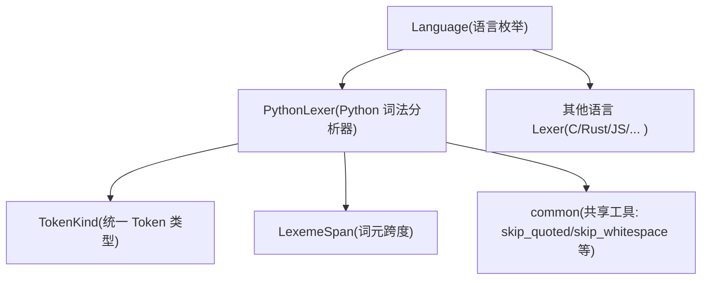
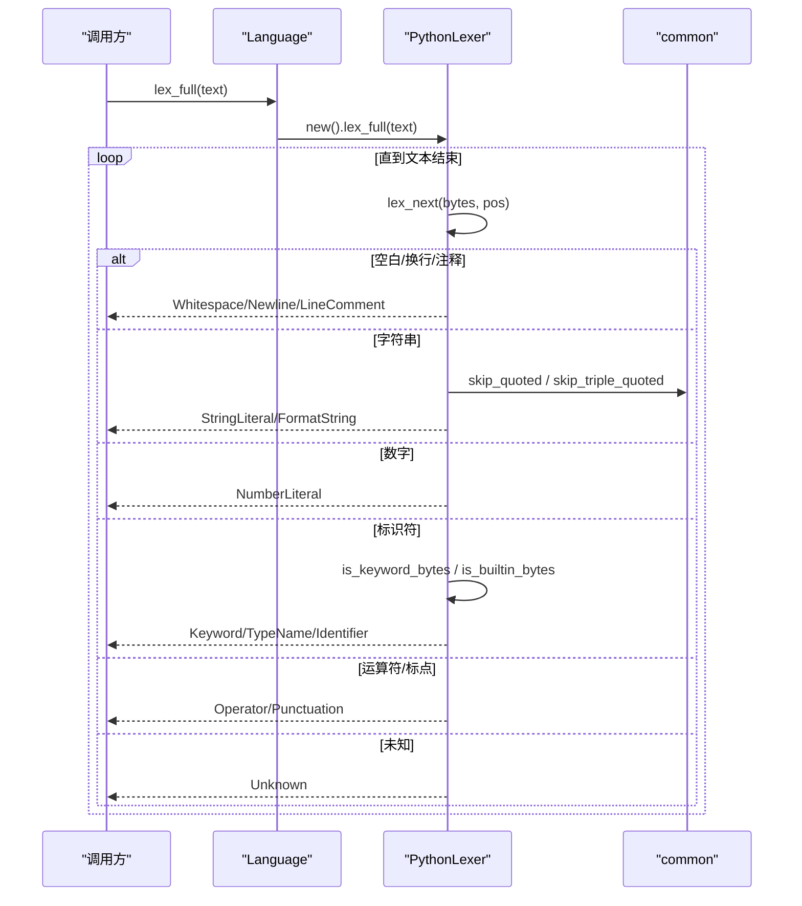
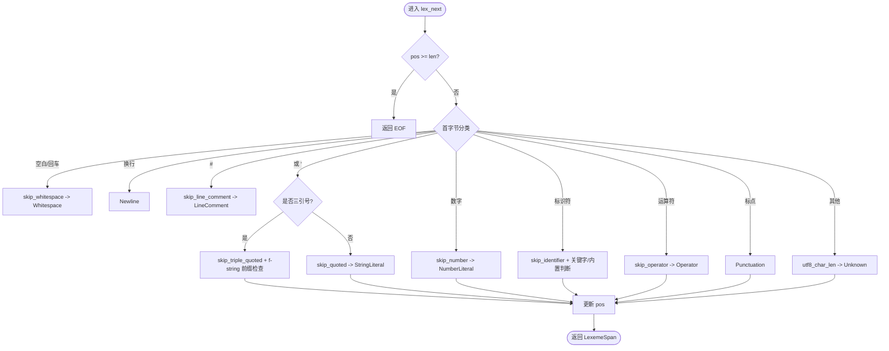
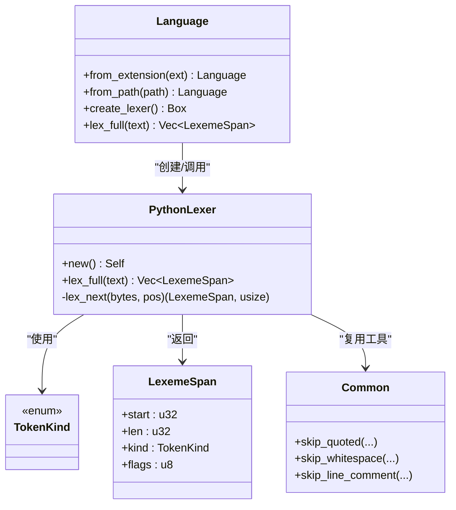

# Python 词法分析器

<cite>
**本文引用的文件**
- [python_lexer.rs](file://crates/aether-core/src/lexer/python_lexer.rs)
- [mod.rs](file://crates/aether-core/src/lexer/mod.rs)
- [common.rs](file://crates/aether-core/src/lexer/common.rs)
- [lexer_bench.rs](file://crates/aether-core/benches/lexer_bench.rs)
</cite>

## 目录
1. [简介](#简介)
2. [项目结构](#项目结构)
3. [核心组件](#核心组件)
4. [架构总览](#架构总览)
5. [详细组件分析](#详细组件分析)
6. [依赖关系分析](#依赖关系分析)
7. [性能考量](#性能考量)
8. [故障排查指南](#故障排查指南)
9. [结论](#结论)
10. [附录：语法识别示例与行为说明](#附录语法识别示例与行为说明)

## 简介
本技术文档围绕仓库中的 Python 词法分析器实现，系统性解析其如何处理 Python 语言的独特语法特征，包括关键字、装饰器、字符串（含三引号与 f-string）、数字、运算符、标点符号、注释等。同时说明当前实现对缩进敏感性的处理方式、行继续符的处理现状，以及与其他语言不同的语法元素（如列表推导式、字典推导式、生成器表达式）在词法层面的识别情况。文档提供代码级流程图和时序图，帮助读者理解从输入字节到 Token 的完整流程。

## 项目结构
Python 词法分析器位于 aether-core 的 lexer 模块中，采用多语言统一接口设计，PythonLexer 通过通用 Lexer trait 暴露 lex_full 方法，返回统一的 LexemeSpan 序列。公共工具函数集中在 common 模块，供各语言复用。Language 枚举负责按扩展名选择具体 Lexer。

图表来源
- [mod.rs:94-196](file://crates/aether-core/src/lexer/mod.rs#L94-L196)
- [python_lexer.rs:1-124](file://crates/aether-core/src/lexer/python_lexer.rs#L1-L124)
- [common.rs:1-55](file://crates/aether-core/src/lexer/common.rs#L1-L55)

章节来源
- [mod.rs:94-196](file://crates/aether-core/src/lexer/mod.rs#L94-L196)
- [python_lexer.rs:1-124](file://crates/aether-core/src/lexer/python_lexer.rs#L1-L124)
- [common.rs:1-55](file://crates/aether-core/src/lexer/common.rs#L1-L55)

## 核心组件
- PythonLexer：实现 Python 语法的逐字符扫描与 Token 分类，支持关键字、标识符、字符串（含三引号与 f-string）、数字、运算符、标点、注释、换行、空白、未知字符等。
- TokenKind/LexemeSpan：跨语言统一的 Token 类型与位置跨度结构，用于高亮与后续处理。
- Language：根据文件扩展名创建对应 Lexer，并支持静态分发直接调用 lex_full。
- common：提供跳过空白、字符串、注释等通用工具，降低重复实现成本。

章节来源
- [python_lexer.rs:1-124](file://crates/aether-core/src/lexer/python_lexer.rs#L1-L124)
- [mod.rs:7-92](file://crates/aether-core/src/lexer/mod.rs#L7-L92)
- [mod.rs:94-196](file://crates/aether-core/src/lexer/mod.rs#L94-L196)
- [common.rs:1-55](file://crates/aether-core/src/lexer/common.rs#L1-L55)

## 架构总览
Python 词法分析流程如下：
- 入口：Language::lex_full(Language::Python) 或 Language::create_lexer() 后调用 lex_full。
- 主循环：PythonLexer.lex_full 将文本转为字节切片，循环调用 lex_next 逐个产出 LexemeSpan。
- 分类逻辑：lex_next 根据首字节分派到不同分支（空白、换行、注释、字符串、数字、标识符、运算符、标点、未知）。
- 字符串处理：单引号/双引号使用通用 skip_quoted；三引号使用专用 skip_triple_quoted；f-string 通过前缀检测标记为 FormatString。
- 关键字与内置类型：标识符扫描后，通过 is_keyword_bytes/is_builtin_bytes 判断 Keyword/TypeName。
- 输出：累积 LexemeSpan 向量，包含 start、len、kind、flags。

图表来源
- [mod.rs:179-195](file://crates/aether-core/src/lexer/mod.rs#L179-L195)
- [python_lexer.rs:110-124](file://crates/aether-core/src/lexer/python_lexer.rs#L110-L124)
- [python_lexer.rs:12-107](file://crates/aether-core/src/lexer/python_lexer.rs#L12-L107)
- [common.rs:42-55](file://crates/aether-core/src/lexer/common.rs#L42-L55)

## 详细组件分析

### PythonLexer 主流程与 Token 分类
- 空白与换行：空格、制表符、回车归为 Whitespace；换行单独作为 Newline。
- 注释：以 # 开头的行注释，跳过至行尾。
- 字符串：
  - 单/双引号：使用通用 skip_quoted，正确处理转义。
  - 三引号：使用 skip_triple_quoted，匹配连续三个相同引号。
  - f-string：若三引号前存在 f/F 前缀，或单/双引号前有 f/F 前缀，则标记为 FormatString。
- 数字：支持整数、浮点、指数、虚数后缀 j/J、下划线分隔。
- 标识符：ASCII 字母、数字、下划线组成；随后判断是否为关键字或内置类型。
- 运算符：支持常见二元/一元组合，如 **、//、-> 等。
- 标点：括号、花括号、方括号、逗号、分号、冒号、点、问号、@ 等。
- 未知：UTF-8 字符推进，避免中文/emoji 被拆分导致错位。

图表来源
- [python_lexer.rs:12-107](file://crates/aether-core/src/lexer/python_lexer.rs#L12-L107)
- [python_lexer.rs:218-227](file://crates/aether-core/src/lexer/python_lexer.rs#L218-L227)
- [python_lexer.rs:229-260](file://crates/aether-core/src/lexer/python_lexer.rs#L229-L260)
- [python_lexer.rs:262-268](file://crates/aether-core/src/lexer/python_lexer.rs#L262-L268)
- [python_lexer.rs:270-340](file://crates/aether-core/src/lexer/python_lexer.rs#L270-L340)
- [common.rs:42-55](file://crates/aether-core/src/lexer/common.rs#L42-L55)

章节来源
- [python_lexer.rs:12-107](file://crates/aether-core/src/lexer/python_lexer.rs#L12-L107)
- [python_lexer.rs:132-208](file://crates/aether-core/src/lexer/python_lexer.rs#L132-L208)
- [python_lexer.rs:210-340](file://crates/aether-core/src/lexer/python_lexer.rs#L210-L340)
- [common.rs:42-55](file://crates/aether-core/src/lexer/common.rs#L42-L55)

### 关键字集合与内置类型
- 关键字：包含控制流、异步、类与函数定义、导入、异常处理等常用关键字，例如 False/None/True、and/as/assert、async/await、break/class/continue、def/del/elif/else、except/finally、for/from/global、if/import/in/is、lambda/nonlocal/not/or、pass/raise/return、try/while/with/yield。
- 内置类型/函数：int/float/str/bool/list/dict/tuple/set/frozenset/bytes/bytearray/memoryview/object/type/range/enumerate/zip/map/filter/len/print/input/open/super/Exception/BaseException/ValueError/TypeError/KeyError/IndexError 等。

章节来源
- [python_lexer.rs:132-208](file://crates/aether-core/src/lexer/python_lexer.rs#L132-L208)

### 字符串与 f-string 处理
- 三引号字符串：支持 """ 与 ''' 的多行字符串，使用专用跳过函数定位结束位置。
- f-string：支持 f"""...""" 与 f'...'、f"..."，通过前缀 f/F 检测标记为 FormatString。
- 转义与边界：通用 skip_quoted 正确处理末尾反斜杠与不闭合引号的情况。

章节来源
- [python_lexer.rs:29-61](file://crates/aether-core/src/lexer/python_lexer.rs#L29-L61)
- [python_lexer.rs:69-92](file://crates/aether-core/src/lexer/python_lexer.rs#L69-L92)
- [python_lexer.rs:218-227](file://crates/aether-core/src/lexer/python_lexer.rs#L218-L227)
- [common.rs:42-55](file://crates/aether-core/src/lexer/common.rs#L42-L55)

### 数字与运算符
- 数字：支持整数、浮点数、指数形式、虚数后缀 j/J、下划线分隔（如 1_000），并防止 1..2 被合并为单一数字。
- 运算符：支持 +=、-=、*=、**=、/=、//=、%=、==、!=、<=、>=、-> 等组合与箭头。

章节来源
- [python_lexer.rs:229-260](file://crates/aether-core/src/lexer/python_lexer.rs#L229-L260)
- [python_lexer.rs:270-340](file://crates/aether-core/src/lexer/python_lexer.rs#L270-L340)

### 装饰器与标点
- 装饰器：@ 作为标点符号，配合换行与标识符可形成 @property、@staticmethod 等装饰语法。
- 标点：括号、花括号、方括号、逗号、分号、冒号、点、问号、@ 均作为 Punctuation。

章节来源
- [python_lexer.rs:99-101](file://crates/aether-core/src/lexer/python_lexer.rs#L99-L101)
- [python_lexer.rs:355-364](file://crates/aether-core/src/lexer/python_lexer.rs#L355-L364)

### 缩进敏感性与行继续符
- 缩进敏感性：当前实现将换行作为独立 Token（Newline），并将空白（空格、制表符、回车）归为 Whitespace。未在当前词法阶段进行语义级的缩进块解析（如 if/for/def 后的缩进块），因此“缩进敏感性”在词法层仅体现为换行与空白的区分，不进行结构化缩进判定。
- 行继续符：当前实现未显式处理 \ 作为行继续符的逻辑；遇到 \ 时会被当作普通字符或转义的一部分（取决于上下文）。对于需要跨行拼接的语句，词法层不会自动合并为单行逻辑单元。

章节来源
- [python_lexer.rs:20-28](file://crates/aether-core/src/lexer/python_lexer.rs#L20-L28)
- [python_lexer.rs:210-216](file://crates/aether-core/src/lexer/python_lexer.rs#L210-L216)

### 与其他语言不同的语法元素（词法层面）
- 列表推导式、字典推导式、生成器表达式：这些语法由方括号、花括号、圆括号与 for/if 等构成，词法层会将其拆分为标点与标识符/关键字等基础 Token，不做语义级推导结构识别。
- 类型注解：形如 x: int 的注解在词法层表现为标识符、冒号、类型名（内置类型或自定义标识符），不做类型系统语义解析。
- 异步编程：async/await 作为关键字被识别，但异步函数体与协程语义不在词法层处理。

章节来源
- [python_lexer.rs:132-170](file://crates/aether-core/src/lexer/python_lexer.rs#L132-L170)
- [python_lexer.rs:99-101](file://crates/aether-core/src/lexer/python_lexer.rs#L99-L101)

## 依赖关系分析
- PythonLexer 依赖 common 提供的通用跳过函数，减少重复实现。
- 所有 Lexer 共享 TokenKind/LexemeSpan，保证跨语言一致性。
- Language 统一管理 Lexer 创建与静态分发，避免运行时动态分配开销。

图表来源
- [mod.rs:94-196](file://crates/aether-core/src/lexer/mod.rs#L94-L196)
- [python_lexer.rs:1-124](file://crates/aether-core/src/lexer/python_lexer.rs#L1-L124)
- [common.rs:1-55](file://crates/aether-core/src/lexer/common.rs#L1-L55)

章节来源
- [mod.rs:94-196](file://crates/aether-core/src/lexer/mod.rs#L94-L196)
- [python_lexer.rs:1-124](file://crates/aether-core/src/lexer/python_lexer.rs#L1-L124)
- [common.rs:1-55](file://crates/aether-core/src/lexer/common.rs#L1-L55)

## 性能考量
- 预分配容量：lex_full 使用 text.len()/4+1 预估 token 数量，减少扩容开销。
- 字节级扫描：基于 &[u8] 的直接扫描，避免不必要的字符串转换。
- UTF-8 安全推进：未知字符通过 utf8_char_len 按完整字符推进，避免中文/emoji 拆分导致的错位。
- 基准测试：bench 中包含 Python 样本，可用于评估词法性能。

章节来源
- [python_lexer.rs:110-124](file://crates/aether-core/src/lexer/python_lexer.rs#L110-L124)
- [mod.rs:233-243](file://crates/aether-core/src/lexer/mod.rs#L233-L243)
- [lexer_bench.rs:73-102](file://crates/aether-core/benches/lexer_bench.rs#L73-L102)

## 故障排查指南
- 字符串未闭合：skip_quoted 会在到达文本末尾时返回长度，确保不会越界；若出现未闭合字符串，仍会吞到末尾，便于高亮显示。
- 三引号字符串误判：确认是否存在 f/F 前缀；若无前缀则为 StringLiteral，若有则为 FormatString。
- 数字解析异常：注意 1..2 不会被合并为单一数字；指数 e/E 与虚数 j/J 需符合规则。
- 未知字符高亮：非 ASCII 字符按完整 UTF-8 推进，避免错位；如需更细粒度分类，可在上层扩展。

章节来源
- [python_lexer.rs:29-61](file://crates/aether-core/src/lexer/python_lexer.rs#L29-L61)
- [python_lexer.rs:229-260](file://crates/aether-core/src/lexer/python_lexer.rs#L229-L260)
- [common.rs:42-55](file://crates/aether-core/src/lexer/common.rs#L42-L55)

## 结论
该 Python 词法分析器实现了 Python 基础语法的高亮所需的关键 Token 分类，包括关键字、标识符、字符串（含三引号与 f-string）、数字、运算符、标点、注释与换行。对缩进敏感性与行继续符未在词法层做语义级处理，保持轻量与高性能。对于列表推导式、类型注解、异步语法等，词法层仅做基础 Token 拆分，语义解析交由上层完成。整体设计清晰、可扩展，适合编辑器高亮与快速反馈场景。

## 附录：语法识别示例与行为说明
以下为若干 Python 语法片段的识别效果说明（不展示源码内容，仅描述行为）：
- 关键字识别：def、return、if、for、async、await 等将被识别为 Keyword。
- 装饰器：@ 作为标点，配合换行与标识符形成装饰语法。
- 字符串：
  - 单/双引号字符串识别为 StringLiteral。
  - 三引号字符串识别为 StringLiteral；若带 f/F 前缀则识别为 FormatString。
- 数字：整数、浮点、指数、虚数、下划线分隔的数字识别为 NumberLiteral。
- 运算符：+=、**、//、-> 等识别为 Operator。
- 标点：括号、花括号、方括号、逗号、分号、冒号、点、问号、@ 识别为 Punctuation。
- 注释：# 开始的行注释识别为 LineComment。
- 缩进：换行作为 Newline，空白作为 Whitespace；不进行语义级缩进块解析。
- 行继续符：\ 不作为行继续符在词法层合并；跨行语句保持原样。
- 列表/字典推导式与生成器表达式：由标点与关键字/标识符组成，词法层不识别推导结构本身。
- 类型注解：x: int 等由标识符、冒号、类型名组成，不做类型系统语义解析。
- 异步：async/await 作为关键字识别，不解析协程语义。

章节来源
- [python_lexer.rs:132-208](file://crates/aether-core/src/lexer/python_lexer.rs#L132-L208)
- [python_lexer.rs:29-61](file://crates/aether-core/src/lexer/python_lexer.rs#L29-L61)
- [python_lexer.rs:229-340](file://crates/aether-core/src/lexer/python_lexer.rs#L229-L340)
- [python_lexer.rs:20-28](file://crates/aether-core/src/lexer/python_lexer.rs#L20-L28)