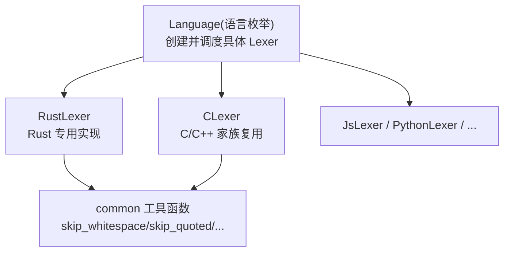
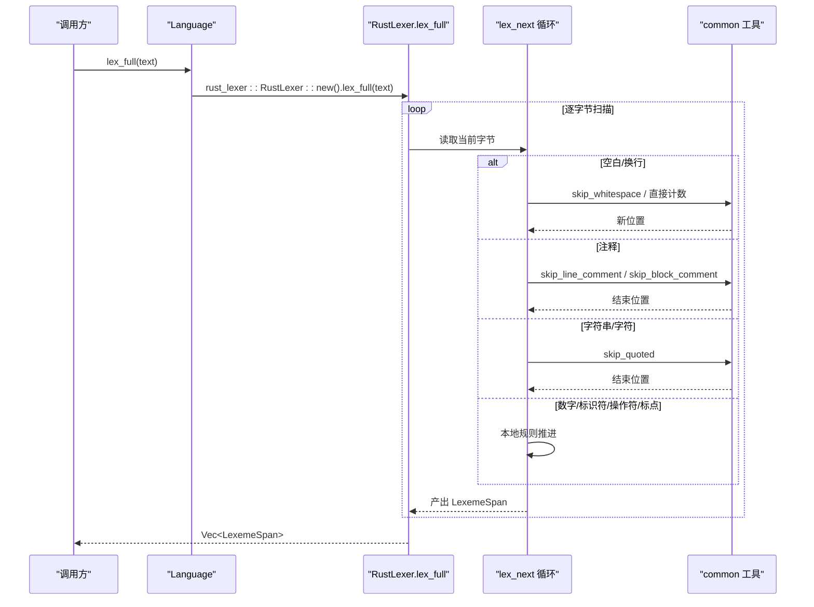
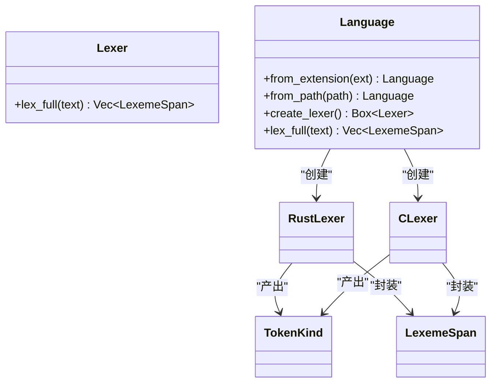

# Rust 词法分析器

<cite>
**本文引用的文件**
- [crates/aether-core/src/lexer/mod.rs](file://crates/aether-core/src/lexer/mod.rs)
- [crates/aether-core/src/lexer/rust_lexer.rs](file://crates/aether-core/src/lexer/rust_lexer.rs)
- [crates/aether-core/src/lexer/common.rs](file://crates/aether-core/src/lexer/common.rs)
- [crates/aether-core/src/lexer/c_lexer.rs](file://crates/aether-core/src/lexer/c_lexer.rs)
- [crates/aether-core/benches/lexer_bench.rs](file://crates/aether-core/benches/lexer_bench.rs)
</cite>

## 目录
1. [简介](#简介)
2. [项目结构](#项目结构)
3. [核心组件](#核心组件)
4. [架构总览](#架构总览)
5. [详细组件分析](#详细组件分析)
6. [依赖关系分析](#依赖关系分析)
7. [性能考虑](#性能考虑)
8. [故障排查指南](#故障排查指南)
9. [结论](#结论)
10. [附录](#附录)

## 简介
本技术文档聚焦于 Rust 词法分析器的实现与特性，系统阐述其在编辑器中的角色、设计模式、关键算法与优化策略。重点覆盖：
- Rust 语言特有语法元素：生命周期标注、宏调用、属性注解、关键字集合、操作符优先级处理、数字字面量等
- 与 C/C++ 词法分析器的差异与复用机制
- 性能与内存优化实践
- 典型 Rust 语法的识别示例（闭包表达式、模式匹配、trait 定义等）

## 项目结构
该词法分析子系统位于 aether-core crate 的 lexer 模块中，采用“统一接口 + 多语言实现”的分层组织方式：
- 公共接口与类型定义：mod.rs
- 各语言具体实现：rust_lexer.rs、c_lexer.rs、js_lexer.rs、python_lexer.rs 等
- 共享工具函数：common.rs
- 基准测试：benches/lexer_bench.rs



图表来源
- [crates/aether-core/src/lexer/mod.rs:94-196](file://crates/aether-core/src/lexer/mod.rs#L94-L196)
- [crates/aether-core/src/lexer/rust_lexer.rs:1-167](file://crates/aether-core/src/lexer/rust_lexer.rs#L1-L167)
- [crates/aether-core/src/lexer/c_lexer.rs:1-113](file://crates/aether-core/src/lexer/c_lexer.rs#L1-L113)
- [crates/aether-core/src/lexer/common.rs:1-90](file://crates/aether-core/src/lexer/common.rs#L1-L90)

章节来源
- [crates/aether-core/src/lexer/mod.rs:1-306](file://crates/aether-core/src/lexer/mod.rs#L1-L306)

## 核心组件
- TokenKind 枚举：跨语言统一的 token 类别，包含关键字、标识符、字符串/字符字面量、注释、运算符、标点、预处理指令、属性、类型名、函数名、宏、生命周期、泛型、正则、格式化字符串、Markdown/JSON/TOML 特定标记、空白、换行、未知、EOF 等。
- LexemeSpan：压缩表示的词元跨度（起始位置、长度、种类、标志位），用于高效存储与传递 token 信息。
- Lexer trait：统一的全量词法分析接口 lex_full(text) -> Vec<LexemeSpan>。
- Language 枚举：按扩展名或路径选择语言，并提供 create_lexer() 与 lex_full() 静态分发入口。

章节来源
- [crates/aether-core/src/lexer/mod.rs:1-111](file://crates/aether-core/src/lexer/mod.rs#L1-L111)
- [crates/aether-core/src/lexer/mod.rs:70-92](file://crates/aether-core/src/lexer/mod.rs#L70-L92)
- [crates/aether-core/src/lexer/mod.rs:94-196](file://crates/aether-core/src/lexer/mod.rs#L94-L196)

## 架构总览
整体采用“单字节流扫描 + 状态机式分支”的设计：每个语言的 lexer 实现一个 lex_next(bytes, pos) 返回 (token, new_pos)，再由 lex_full 循环推进位置直至 EOF。公共工具函数负责通用跳过逻辑（空白、注释、引号包裹的字面量等）。



图表来源
- [crates/aether-core/src/lexer/mod.rs:179-196](file://crates/aether-core/src/lexer/mod.rs#L179-L196)
- [crates/aether-core/src/lexer/rust_lexer.rs:12-167](file://crates/aether-core/src/lexer/rust_lexer.rs#L12-L167)
- [crates/aether-core/src/lexer/common.rs:5-55](file://crates/aether-core/src/lexer/common.rs#L5-L55)

## 详细组件分析

### Rust 词法分析器（RustLexer）
职责与行为：
- 支持空白、换行、行/块/文档注释、属性注解、字符串/字符字面量、数字字面量、标识符/关键字/内置类型/宏名、操作符、标点、未知 UTF-8 字符等。
- 生命周期标注：以 'a、'static 等形式识别为 Lifetime token。
- 宏调用检测：在标识符后紧跟 ! 时识别为 Macro token。
- 属性注解：以 # 或 #[...] 形式识别为 Attribute token。
- 数字字面量：支持十进制、十六进制前缀 0x、八进制 0o、二进制 0b，以及下划线分隔、浮点小数点与指数 e/E，同时避免将范围语法如 1..2 误合并为一个数字。
- 操作符优先级：通过一次向前看一位的方式组合双字符操作符（如 ==、<=、>>、&&、|| 等），保证常见 Rust 操作符被正确切分。

```mermaid
flowchart TD
Start(["进入 lex_next"]) --> Ch{"首字节分类"}
Ch --> |空白/换行| WS["跳过空白/输出换行"]
Ch --> |/| Slash{"下一字节?"}
Slash --> |//| LineCmt["跳过行注释"]
Slash --> |/*| BlockCmt["跳过块注释(含嵌套深度)"]
Slash --> |=| Assign["输出赋值类操作符"]
Slash --> |其他| Op["输出单字符操作符"]
Ch --> |#| Attr["跳过属性注解(支持 #[...])"]
Ch --> |"\""/"'"| Quote["跳过引号包裹的字面量"]
Ch --> |' | LifeOrChar{"是否转义/单字符/生命周期?"}
LifeOrChar --> |转义| CharLit["字符字面量"]
LifeOrChar --> |单字符| CharLit
LifeOrChar --> |小写字母| Lifetime["生命周期标注"]
Ch --> |数字| Num["解析数字(含进制/小数/指数)"]
Ch --> |字母/下划线| Id["解析标识符并判定关键字/类型名/宏名"]
Ch --> |操作符| Ops["组合操作符(>=, <<, &&, ||...)"]
Ch --> |标点| Punc["输出标点"]
Ch --> |其他| Unknown["按UTF-8长度输出Unknown"]
WS --> End(["返回(token, 新位置)"])
LineCmt --> End
BlockCmt --> End
Assign --> End
Op --> End
Attr --> End
Quote --> End
CharLit --> End
Lifetime --> End
Num --> End
Id --> End
Ops --> End
Punc --> End
Unknown --> End
```

图表来源
- [crates/aether-core/src/lexer/rust_lexer.rs:12-150](file://crates/aether-core/src/lexer/rust_lexer.rs#L12-L150)
- [crates/aether-core/src/lexer/rust_lexer.rs:275-325](file://crates/aether-core/src/lexer/rust_lexer.rs#L275-L325)
- [crates/aether-core/src/lexer/rust_lexer.rs:327-435](file://crates/aether-core/src/lexer/rust_lexer.rs#L327-L435)

章节来源
- [crates/aether-core/src/lexer/rust_lexer.rs:1-583](file://crates/aether-core/src/lexer/rust_lexer.rs#L1-L583)

#### Rust 关键字集合与内置类型
- 关键字：包括控制流、所有权/借用、模块/可见性、异步、宏相关等常用关键字（如 fn、let、if、for、match、impl、trait、use、pub、async、await、move、static、dyn、where、yield 等）。
- 内置类型：基础数值类型、布尔、字符、字符串、容器与智能指针（如 i32、u64、bool、char、str、String、Vec、Option、Result、Box、Rc、Arc、HashMap、BTreeMap、HashSet、BTreeSet、VecDeque、LinkedList、BinaryHeap、Cow）。

章节来源
- [crates/aether-core/src/lexer/rust_lexer.rs:175-273](file://crates/aether-core/src/lexer/rust_lexer.rs#L175-L273)

#### 生命周期标注识别
- 以 ' 开头且紧随小写字母或 static 等合法标识序列，识别为 Lifetime。
- 与字符字面量的区分：若 ' 后是转义字符（\n、\t 等）或单字符字面量，则归为 CharLiteral；否则尝试识别为生命周期。

章节来源
- [crates/aether-core/src/lexer/rust_lexer.rs:77-101](file://crates/aether-core/src/lexer/rust_lexer.rs#L77-L101)
- [crates/aether-core/src/lexer/rust_lexer.rs:319-325](file://crates/aether-core/src/lexer/rust_lexer.rs#L319-L325)

#### 宏调用与属性注解
- 宏调用：当标识符后紧跟 ! 时，! 作为 Macro token 输出，便于后续高亮或语法树构建。
- 属性注解：以 # 或 #[...] 形式整体识别为 Attribute，支持内联属性（#![...]）与常规属性（#[derive(Debug)]）。

章节来源
- [crates/aether-core/src/lexer/rust_lexer.rs:64-68](file://crates/aether-core/src/lexer/rust_lexer.rs#L64-L68)
- [crates/aether-core/src/lexer/rust_lexer.rs:123-138](file://crates/aether-core/src/lexer/rust_lexer.rs#L123-L138)
- [crates/aether-core/src/lexer/rust_lexer.rs:297-317](file://crates/aether-core/src/lexer/rust_lexer.rs#L297-L317)

#### 数字字面量与范围语法保护
- 支持十进制、十六进制（0x）、八进制（0o）、二进制（0b），允许下划线分隔。
- 支持浮点数的小数点与指数部分（e/E 及可选正负号）。
- 特殊保护：遇到 .. 或连续 . 时停止数字扫描，避免将 1..2 误识别为单个数字。

章节来源
- [crates/aether-core/src/lexer/rust_lexer.rs:327-374](file://crates/aether-core/src/lexer/rust_lexer.rs#L327-L374)

#### 操作符优先级与组合
- 通过一次向前看一位的组合策略，识别常见的双字符操作符（如 ==、!=、<=、>=、<<、>>、&&、||、+=、-=、*=、/=、%=、^=、&=、|=、=>、-> 等）。
- 保证在 Rust 常见上下文中正确切分操作符序列。

章节来源
- [crates/aether-core/src/lexer/rust_lexer.rs:139-142](file://crates/aether-core/src/lexer/rust_lexer.rs#L139-L142)
- [crates/aether-core/src/lexer/rust_lexer.rs:384-435](file://crates/aether-core/src/lexer/rust_lexer.rs#L384-L435)

#### 与 C/C++ 词法分析器的差异与复用
- 差异点：
  - Rust 支持生命周期标注（Lifetime）、属性注解（Attribute）、宏调用（Macro）、更丰富的关键字与内置类型。
  - Rust 不原生支持三引号字符串，使用通用 skip_quoted 处理标准字符串与字符字面量。
  - Rust 的数字字面量支持更多进制前缀（0o、0b）与范围语法保护。
- 复用机制：
  - 共用 common 工具函数（空白、注释、引号包裹字面量等）。
  - 共用 TokenKind/LexemeSpan/Lexer trait 抽象，确保跨语言一致性与可替换性。
  - Language 枚举提供统一入口，可按扩展名或路径创建对应 lexer。

章节来源
- [crates/aether-core/src/lexer/mod.rs:94-196](file://crates/aether-core/src/lexer/mod.rs#L94-L196)
- [crates/aether-core/src/lexer/common.rs:1-90](file://crates/aether-core/src/lexer/common.rs#L1-L90)
- [crates/aether-core/src/lexer/c_lexer.rs:1-113](file://crates/aether-core/src/lexer/c_lexer.rs#L1-L113)

#### Rust 特有语法识别示例
- 闭包表达式：如 x => x * 2 或 |x| x + 1，其中 => 会被识别为 Operator，| 和管道符属于标点/操作符范畴，由上层语法分析结合上下文进行语义判断。
- 模式匹配：match、if let、while let 等关键字与 => 操作符配合，形成模式匹配结构。
- trait 定义：trait 关键字与 impl 块中的方法签名，均由关键字与标识符组成，由 lexer 正确切分。
- 原始字符串字面量：当前实现未对 r"..." 或 r##...## 做专门分支，但通用 skip_quoted 能正确处理带反斜杠的字符串内容；如需精确高亮原始字符串边界，可在未来扩展专门的原始字符串解析分支。

章节来源
- [crates/aether-core/src/lexer/rust_lexer.rs:12-150](file://crates/aether-core/src/lexer/rust_lexer.rs#L12-L150)
- [crates/aether-core/src/lexer/rust_lexer.rs:327-374](file://crates/aether-core/src/lexer/rust_lexer.rs#L327-L374)

### 公共工具函数（common）
- skip_whitespace：跳过空格、制表符、回车。
- skip_line_comment：跳过 // 开始的行注释至换行或末尾。
- skip_block_comment：跳过 /* */ 块注释，支持未闭合情况安全返回末尾。
- skip_quoted：跳过由指定引号包裹的字符串/字符字面量，正确处理转义与末尾反斜杠。
- skip_identifier_*：ASCII 标识符扫描，支持额外字符集。
- skip_number_generic：通用数字扫描框架，供不同语言定制 is_valid 回调。

章节来源
- [crates/aether-core/src/lexer/common.rs:5-90](file://crates/aether-core/src/lexer/common.rs#L5-L90)

### C/C++ 词法分析器（CLexer）
- 支持空白、换行、行/块/文档注释、预处理指令（#include/#define 等）、字符串/字符字面量、数字字面量、关键字、操作符、标点、未知 UTF-8 字符。
- 与 RustLexer 的差异主要体现在关键字集合、预处理指令、数字后缀与进制前缀等方面。

章节来源
- [crates/aether-core/src/lexer/c_lexer.rs:1-425](file://crates/aether-core/src/lexer/c_lexer.rs#L1-L425)

## 依赖关系分析
- 语言调度：Language 根据扩展名或路径创建具体 Lexer，并提供静态分发 lex_full，避免 Box 分配与动态分发开销。
- 工具复用：所有语言 lexer 均依赖 common 提供的通用跳过函数，降低重复实现与维护成本。
- 数据结构：TokenKind 与 LexemeSpan 是所有 lexer 的统一产物格式，便于上层渲染与高亮模块消费。



图表来源
- [crates/aether-core/src/lexer/mod.rs:94-196](file://crates/aether-core/src/lexer/mod.rs#L94-L196)
- [crates/aether-core/src/lexer/mod.rs:1-68](file://crates/aether-core/src/lexer/mod.rs#L1-L68)
- [crates/aether-core/src/lexer/rust_lexer.rs:1-167](file://crates/aether-core/src/lexer/rust_lexer.rs#L1-L167)
- [crates/aether-core/src/lexer/c_lexer.rs:1-113](file://crates/aether-core/src/lexer/c_lexer.rs#L1-L113)

章节来源
- [crates/aether-core/src/lexer/mod.rs:94-196](file://crates/aether-core/src/lexer/mod.rs#L94-L196)

## 性能考虑
- 零分配与预分配：lex_full 内部使用 Vec::with_capacity 预估容量，减少扩容开销。
- 单字节流扫描：基于 &bytes 的直接索引与步进，避免不必要的字符串拷贝。
- 静态分发：Language::lex_full 直接调用具体 lexer 的 lex_full，避免动态分发与 Box 分配。
- 紧凑数据结构：LexemeSpan 使用 u32/u8 字段压缩空间占用，适合大规模 token 列表。
- 基准测试：benchmarks 提供跨语言样本的吞吐测量，便于持续优化。

章节来源
- [crates/aether-core/src/lexer/rust_lexer.rs:153-167](file://crates/aether-core/src/lexer/rust_lexer.rs#L153-L167)
- [crates/aether-core/src/lexer/mod.rs:179-196](file://crates/aether-core/src/lexer/mod.rs#L179-L196)
- [crates/aether-core/benches/lexer_bench.rs:136-162](file://crates/aether-core/benches/lexer_bench.rs#L136-L162)

## 故障排查指南
- 未终止的块注释：当注释未闭合时，RustLexer 的 skip_block_comment 会推进到文本末尾，避免遗留字节导致后续产生异常 token。
- 空块注释不被误判为文档注释：通过守卫条件排除 /**/ 这种空块注释，保持与 C 词法分析器一致的 DocComment 分类。
- 数字与范围语法冲突：遇到 .. 或连续 . 时立即停止数字扫描，防止 1..2 被错误识别为单一数字。
- 生命周期与字符字面量混淆：优先检查转义字符与单字符字面量，再尝试识别生命周期，避免误分类。
- 未知 UTF-8 字符：使用 utf8_char_len 推断完整字符长度，避免中文/emoji 被拆散导致高亮错位。

章节来源
- [crates/aether-core/src/lexer/rust_lexer.rs:275-295](file://crates/aether-core/src/lexer/rust_lexer.rs#L275-L295)
- [crates/aether-core/src/lexer/rust_lexer.rs:327-374](file://crates/aether-core/src/lexer/rust_lexer.rs#L327-L374)
- [crates/aether-core/src/lexer/mod.rs:233-243](file://crates/aether-core/src/lexer/mod.rs#L233-L243)

## 结论
该 Rust 词法分析器以简洁高效的单字节流扫描为核心，结合统一的抽象接口与共享工具函数，实现了跨语言的可复用架构。针对 Rust 特有的生命周期、宏调用、属性注解、关键字与内置类型、数字字面量与操作符组合等进行了细致处理，并通过紧凑的数据结构与静态分发优化了性能。与 C/C++ 词法分析器相比，RustLexer 在语法识别上更具针对性，同时保持了良好的复用性与一致性。

## 附录
- 参考用例与测试：
  - 关键字、数字、注释、字符串/字符、生命周期、属性、宏调用、内置类型等验证用例位于 rust_lexer.rs 的 tests 模块。
  - 基准测试涵盖 Rust、JS、Python、C 四种语言的典型代码片段，用于评估吞吐与稳定性。

章节来源
- [crates/aether-core/src/lexer/rust_lexer.rs:437-583](file://crates/aether-core/src/lexer/rust_lexer.rs#L437-L583)
- [crates/aether-core/benches/lexer_bench.rs:1-162](file://crates/aether-core/benches/lexer_bench.rs#L1-L162)