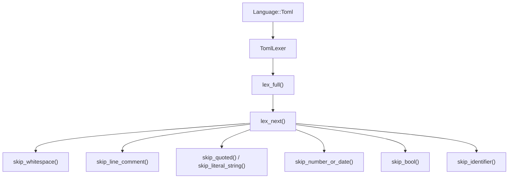
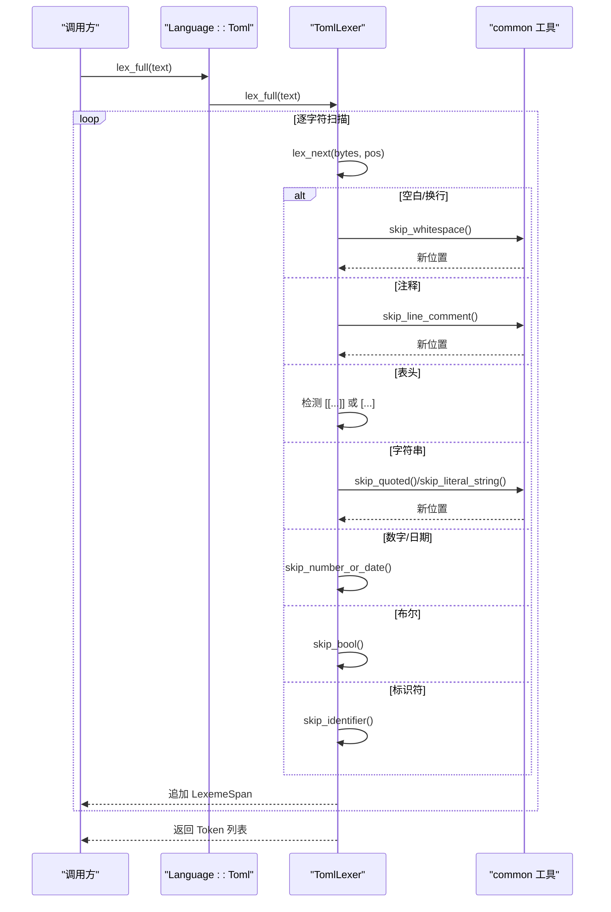
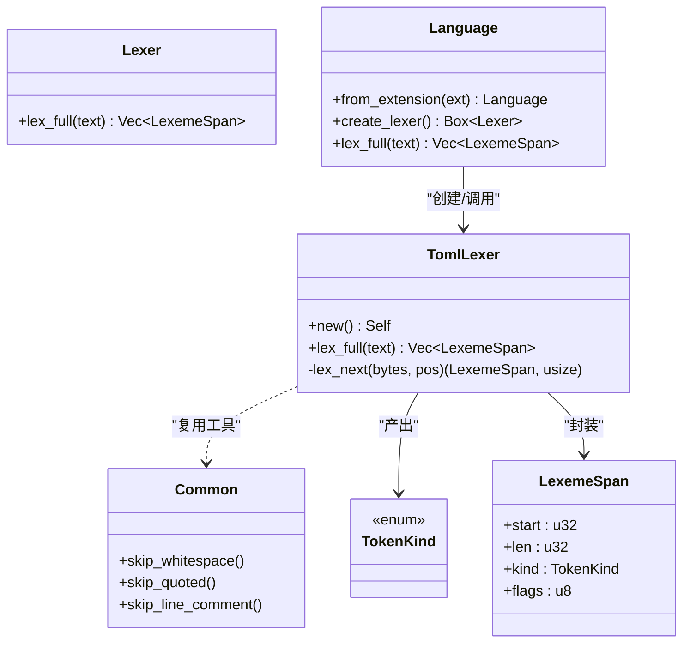

# TOML 词法分析器

<cite>
**本文引用的文件**
- [toml_lexer.rs](file://crates/aether-core/src/lexer/toml_lexer.rs)
- [mod.rs](file://crates/aether-core/src/lexer/mod.rs)
- [common.rs](file://crates/aether-core/src/lexer/common.rs)
</cite>

## 目录
1. [简介](#简介)
2. [项目结构](#项目结构)
3. [核心组件](#核心组件)
4. [架构总览](#架构总览)
5. [详细组件分析](#详细组件分析)
6. [依赖关系分析](#依赖关系分析)
7. [性能考量](#性能考量)
8. [故障排查指南](#故障排查指南)
9. [结论](#结论)
10. [附录：配置示例与验证要点](#附录配置示例与验证要点)

## 简介
本技术文档围绕 TOML（Tom's Obvious, Minimal Language）词法分析器的实现进行系统化说明，重点覆盖以下方面：
- 语法规则的识别：键值对、表（table）、数组表（array of tables）、内联表等。
- 数据类型支持：字符串、整数、浮点数、布尔值、日期时间、数组与嵌套表。
- 层次化配置结构的表示方法：通过表头与键路径表达层级关系。
- 配置验证与错误处理机制：在词法阶段如何识别并上报异常，确保配置文件的有效性。
- 使用示例展示不同数据类型的识别效果。

该实现位于 aether-core 的 lexer 模块中，采用轻量、面向字节流的扫描策略，输出统一的 Token 流供上层解析或高亮使用。

## 项目结构
TOML 词法分析器属于多语言词法框架的一部分，统一由 Lexer trait 抽象，并通过 Language 枚举分发到具体语言的词法分析器。TOML 相关代码主要分布在以下文件：
- toml_lexer.rs：TOML 专用词法分析器实现，负责将输入文本切分为 Token 序列。
- mod.rs：定义通用 Lexer trait、TokenKind、LexemeSpan、Language 枚举及创建/调用逻辑。
- common.rs：跨语言共享的基础跳过/扫描工具函数（如空白、注释、引号字符串等）。



图表来源
- [mod.rs:160-195](file://crates/aether-core/src/lexer/mod.rs#L160-L195)
- [toml_lexer.rs:106-120](file://crates/aether-core/src/lexer/toml_lexer.rs#L106-L120)
- [toml_lexer.rs:12-103](file://crates/aether-core/src/lexer/toml_lexer.rs#L12-L103)
- [common.rs:6-55](file://crates/aether-core/src/lexer/common.rs#L6-L55)

章节来源
- [mod.rs:1-306](file://crates/aether-core/src/lexer/mod.rs#L1-L306)
- [toml_lexer.rs:1-266](file://crates/aether-core/src/lexer/toml_lexer.rs#L1-L266)
- [common.rs:1-151](file://crates/aether-core/src/lexer/common.rs#L1-L151)

## 核心组件
- TomlLexer：TOML 专用词法分析器，实现 Lexer trait，提供 lex_full 全量词法分析能力。
- TokenKind：统一的 Token 类型枚举，包含 Keyword、Identifier、StringLiteral、NumberLiteral、LineComment、Punctuation、TomlTable、Whitespace、Newline、Unknown、EOF 等。
- LexemeSpan：紧凑的词法单元跨度，包含起始位置、长度、Token 种类和标志位。
- Language：语言枚举与工厂方法，根据扩展名或路径选择对应 Lexer，并对 TOML 返回 TomlLexer。
- common 工具：提供 skip_whitespace、skip_quoted、skip_line_comment 等基础扫描函数，被 TOML 词法器复用。

章节来源
- [mod.rs:1-111](file://crates/aether-core/src/lexer/mod.rs#L1-L111)
- [mod.rs:160-195](file://crates/aether-core/src/lexer/mod.rs#L160-L195)
- [toml_lexer.rs:1-126](file://crates/aether-core/src/lexer/toml_lexer.rs#L1-L126)
- [common.rs:1-90](file://crates/aether-core/src/lexer/common.rs#L1-L90)

## 架构总览
TOML 词法分析流程如下：
- 入口：Language::Toml.lex_full(text) 直接调用 toml_lexer::TomlLexer::lex_full。
- 主循环：lex_full 遍历字节切片，反复调用 lex_next 获取下一个 Token。
- 分支识别：lex_next 根据首字节判断类别（空白、换行、注释、表头、字符串、数字/日期、布尔、标识符、标点、未知），调用相应跳过函数生成 LexemeSpan。
- 输出：累积所有 LexemeSpan 形成 Token 流，供上层语法分析或高亮渲染使用。



图表来源
- [mod.rs:180-195](file://crates/aether-core/src/lexer/mod.rs#L180-L195)
- [toml_lexer.rs:106-120](file://crates/aether-core/src/lexer/toml_lexer.rs#L106-L120)
- [toml_lexer.rs:12-103](file://crates/aether-core/src/lexer/toml_lexer.rs#L12-L103)
- [common.rs:6-55](file://crates/aether-core/src/lexer/common.rs#L6-L55)

## 详细组件分析

### TomlLexer 实现与关键逻辑
- 全量词法分析：lex_full 初始化容量为 text.len()/4+1 的向量，顺序扫描并收集 LexemeSpan。
- 单步识别：lex_next 基于首字节分派：
  - 空白与换行：标记为 Whitespace/Newline。
  - 注释：以 # 开头至行尾，标记为 LineComment。
  - 表头：[table] 或 [[array]]，统一标记为 TomlTable；支持未闭合表头的鲁棒处理。
  - 字符串：双引号字符串使用 skip_quoted 处理转义；单引号字面串使用 skip_literal_string。
  - 数字/日期：支持整数、浮点、指数形式以及 ISO 日期时间片段（含 T、Z、+、:、. 等）。
  - 布尔：true/false 识别为 Keyword，其他字母序列作为 Identifier。
  - 标识符：允许字母、数字、下划线与连字符。
  - 标点：= . , { } 等作为 Punctuation。
  - 未知：UTF-8 安全前进，标记 Unknown。
- 测试覆盖：内置单元测试覆盖表头、键、注释、空输入、数组表、字符串、数字与布尔、标点、未知字符、未闭合表头等场景。

```mermaid
flowchart TD
Start(["进入 lex_next"]) --> CheckEOF{"pos >= len?"}
CheckEOF --> |是| ReturnEOF["返回 EOF"]
CheckEOF --> |否| ReadCh["读取首字节 ch"]
ReadCh --> Branch{"ch 类别"}
Branch --> |空白/制表/回车| SkipWS["skip_whitespace -> Whitespace"]
Branch --> |换行| Newline["Newline"]
Branch --> |#| Comment["skip_line_comment -> LineComment"]
Branch --> |[| Table["检测 [[...]] 或 [...] -> TomlTable"]
Branch --> |" | ' | String["skip_quoted/skip_literal_string -> StringLiteral"]
Branch --> |数字| NumDate["skip_number_or_date -> NumberLiteral"]
Branch --> |+/-| Sign{"后跟数字?"}
Sign --> |是| NumDate
Sign --> |否| Punct["Punctuation"]
Branch --> |t/f| Bool["skip_bool -> Keyword/Identifier"]
Branch --> |字母/下划线| Id["skip_identifier -> Identifier"]
Branch --> |=/. , { }| Punct2["Punctuation"]
Branch --> |其他| Unknown["utf8_char_len -> Unknown"]
SkipWS --> Next["更新 pos"]
Newline --> Next
Comment --> Next
Table --> Next
String --> Next
NumDate --> Next
Punct --> Next
Bool --> Next
Id --> Next
Punct2 --> Next
Unknown --> Next
Next --> End(["返回 (LexemeSpan, new_pos)"])
```

图表来源
- [toml_lexer.rs:12-103](file://crates/aether-core/src/lexer/toml_lexer.rs#L12-L103)
- [toml_lexer.rs:128-181](file://crates/aether-core/src/lexer/toml_lexer.rs#L128-L181)

章节来源
- [toml_lexer.rs:12-126](file://crates/aether-core/src/lexer/toml_lexer.rs#L12-L126)
- [toml_lexer.rs:183-265](file://crates/aether-core/src/lexer/toml_lexer.rs#L183-L265)

### 公共接口与类型
- Lexer trait：定义 lex_full 接口，统一各语言词法分析器的行为。
- TokenKind：涵盖关键字、标识符、字符串、数字、注释、标点、TOML 表头、空白、换行、未知、EOF 等。
- LexemeSpan：紧凑存储 start、len、kind、flags，便于高效索引与定位。
- Language：从扩展名或路径推断语言，并提供 create_lexer 与静态分发 lex_full。

章节来源
- [mod.rs:1-111](file://crates/aether-core/src/lexer/mod.rs#L1-L111)
- [mod.rs:160-195](file://crates/aether-core/src/lexer/mod.rs#L160-L195)

### 共享工具函数
- skip_whitespace：跳过空格、制表符、回车。
- skip_line_comment：跳过 // 风格行注释（通用工具，TOML 使用 # 注释，但可复用思路）。
- skip_block_comment：跳过 /* */ 块注释（通用工具）。
- skip_quoted：跳过带转义的引号字符串，正确处理末尾反斜杠与不匹配结束引号。
- skip_identifier_ascii / skip_identifier_with：通用标识符扫描。
- skip_number_generic：通用数字扫描框架，按回调判定有效字符。

章节来源
- [common.rs:6-90](file://crates/aether-core/src/lexer/common.rs#L6-L90)

## 依赖关系分析
- TomlLexer 依赖 common 中的 skip_quoted、skip_whitespace 等工具函数，降低重复实现。
- Language 将 TOML 映射到 TomlLexer，提供统一入口。
- TokenKind 与 LexemeSpan 为跨语言统一数据结构，保证下游高亮/解析的一致性。



图表来源
- [mod.rs:160-195](file://crates/aether-core/src/lexer/mod.rs#L160-L195)
- [toml_lexer.rs:1-126](file://crates/aether-core/src/lexer/toml_lexer.rs#L1-L126)
- [common.rs:6-55](file://crates/aether-core/src/lexer/common.rs#L6-L55)

章节来源
- [mod.rs:160-195](file://crates/aether-core/src/lexer/mod.rs#L160-L195)
- [toml_lexer.rs:1-126](file://crates/aether-core/src/lexer/toml_lexer.rs#L1-L126)
- [common.rs:6-55](file://crates/aether-core/src/lexer/common.rs#L6-L55)

## 性能考量
- 内存分配优化：lex_full 预分配 Vec 容量为 text.len()/4+1，减少扩容开销。
- 字节级扫描：直接操作 &str 的 bytes，避免 UTF-8 解码成本，仅在未知字符时按首字节估算长度前进。
- 工具函数复用：skip_quoted、skip_whitespace 等通用函数避免重复实现，提升可读性与维护性。
- 静态分发：Language::lex_full 直接调用具体 Lexer 的 lex_full，无 Box 分配与动态分发开销。

章节来源
- [toml_lexer.rs:106-120](file://crates/aether-core/src/lexer/toml_lexer.rs#L106-L120)
- [mod.rs:180-195](file://crates/aether-core/src/lexer/mod.rs#L180-L195)
- [common.rs:6-55](file://crates/aether-core/src/lexer/common.rs#L6-L55)

## 故障排查指南
- 未闭合表头：当遇到 [table 但未找到 ] 时，仍会产出 TomlTable 并推进位置，避免阻塞后续解析。建议在语法层进一步校验完整性。
- 未知字符：遇到无法识别的首字节，按 UTF-8 首字节长度前进并标记 Unknown，防止死循环。
- 字符串未闭合：skip_quoted 在末尾反斜杠或不匹配结束引号时会吞到文本末尾，需在上层进行语法校验并报告错误。
- 数字/日期边界：skip_number_or_date 接受数字、符号、分隔符与指数标记，若出现非法组合，应在语法层报错。
- 布尔与标识符歧义：以 t/f 开头的词会被尽可能扫描，若不是 true/false 则归类为 Identifier，避免误判。

章节来源
- [toml_lexer.rs:29-46](file://crates/aether-core/src/lexer/toml_lexer.rs#L29-L46)
- [toml_lexer.rs:98-101](file://crates/aether-core/src/lexer/toml_lexer.rs#L98-L101)
- [toml_lexer.rs:136-145](file://crates/aether-core/src/lexer/toml_lexer.rs#L136-L145)
- [toml_lexer.rs:147-163](file://crates/aether-core/src/lexer/toml_lexer.rs#L147-L163)
- [toml_lexer.rs:81-90](file://crates/aether-core/src/lexer/toml_lexer.rs#L81-L90)

## 结论
该 TOML 词法分析器以简洁高效的字节扫描为核心，覆盖了 TOML 的关键语法元素：键值对、表与数组表、字符串、数字/日期、布尔、标点与注释。通过统一的 Token 类型与紧凑的 LexemeSpan，为上层语法分析与高亮提供了稳定基础。结合完善的单元测试与鲁棒的边界处理，能够在大多数场景下正确识别并推进解析。对于更严格的语义校验（如表头闭合、数值合法性、键路径规范），建议在上层语法分析阶段完成。

## 附录：配置示例与验证要点
以下为常见 TOML 配置片段的示例与识别要点（用于展示词法阶段的识别效果，实际语义校验由上层完成）：

- 键值对与字符串
  - name = "Alice"
  - version = '1.2.3'
  - 识别要点：键为 Identifier，值为 StringLiteral。

- 数字与布尔
  - count = 42
  - price = 3.14
  - flag = true
  - 识别要点：整数/浮点归为 NumberLiteral，布尔归为 Keyword。

- 日期时间
  - created = 1979-05-27T07:32:00Z
  - 识别要点：日期时间片段被 NumberLiteral 捕获（词法阶段不区分具体类型）。

- 表与数组表
  - [package]
  - [[dependencies]]
  - 识别要点：统一识别为 TomlTable，用于构建层次化配置结构。

- 内联表
  - meta = { author = "Bob", tags = ["rust", "config"] }
  - 识别要点：{ } 与 , 为 Punctuation，键与值分别识别为 Identifier/StringLiteral/NumberLiteral。

- 注释
  - # 这是注释
  - 识别要点：LineComment，不影响后续键值解析。

- 层次化配置结构表示方法
  - 顶层键值对属于根表。
  - [section] 开启子表，其下的键属于该子表。
  - [[items]] 开启数组表，每个实例为一个独立对象。
  - 通过表头与键路径表达层级关系，例如 section.key = value。

- 配置验证与错误处理机制
  - 词法阶段：识别未知字符、未闭合字符串、未闭合表头，并推进位置以避免卡死。
  - 语法阶段：应检查表头闭合、键路径合法性、数值格式、布尔拼写、日期时间格式等，并报告具体错误位置。
  - 建议：在语法分析阶段将 LexemeSpan 的位置信息转换为人类可读的行/列，以便用户快速定位问题。

章节来源
- [toml_lexer.rs:183-265](file://crates/aether-core/src/lexer/toml_lexer.rs#L183-L265)
- [toml_lexer.rs:12-103](file://crates/aether-core/src/lexer/toml_lexer.rs#L12-L103)
- [common.rs:6-55](file://crates/aether-core/src/lexer/common.rs#L6-L55)