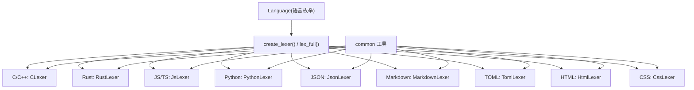
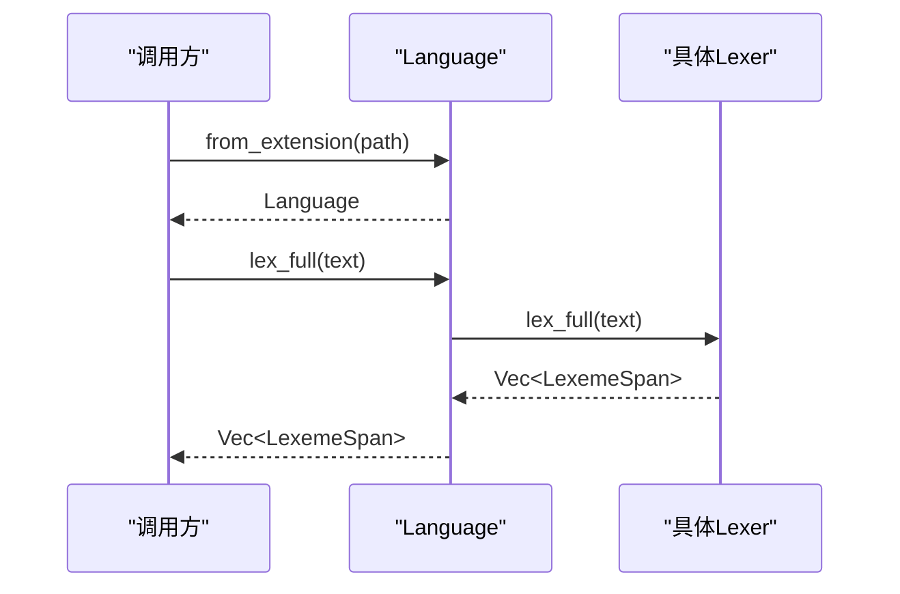
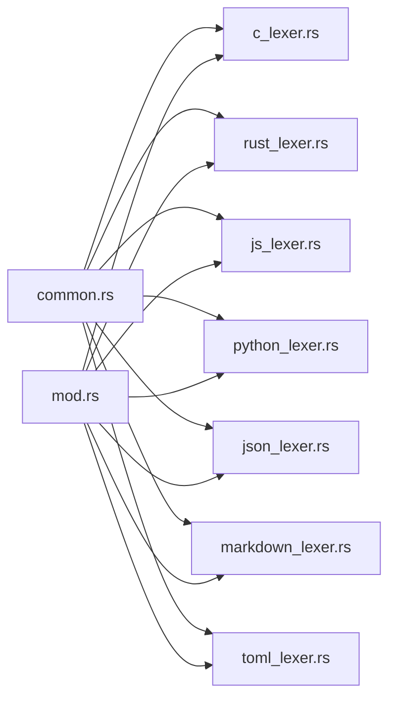

# 具体语言实现

<cite>
**本文引用的文件**
- [crates/aether-core/src/lexer/mod.rs](file://crates/aether-core/src/lexer/mod.rs)
- [crates/aether-core/src/lexer/common.rs](file://crates/aether-core/src/lexer/common.rs)
- [crates/aether-core/src/lexer/rust_lexer.rs](file://crates/aether-core/src/lexer/rust_lexer.rs)
- [crates/aether-core/src/lexer/js_lexer.rs](file://crates/aether-core/src/lexer/js_lexer.rs)
- [crates/aether-core/src/lexer/python_lexer.rs](file://crates/aether-core/src/lexer/python_lexer.rs)
- [crates/aether-core/src/lexer/c_lexer.rs](file://crates/aether-core/src/lexer/c_lexer.rs)
- [crates/aether-core/src/lexer/json_lexer.rs](file://crates/aether-core/src/lexer/json_lexer.rs)
- [crates/aether-core/src/lexer/markdown_lexer.rs](file://crates/aether-core/src/lexer/markdown_lexer.rs)
- [crates/aether-core/src/lexer/toml_lexer.rs](file://crates/aether-core/src/lexer/toml_lexer.rs)
- [crates/aether-core/src/lexer/html_lexer.rs](file://crates/aether-core/src/lexer/html_lexer.rs)
- [crates/aether-core/src/lexer/css_lexer.rs](file://crates/aether-core/src/lexer/css_lexer.rs)
</cite>

## 目录
1. [简介](#简介)
2. [项目结构](#项目结构)
3. [核心组件](#核心组件)
4. [架构总览](#架构总览)
5. [详细组件分析](#详细组件分析)
6. [依赖关系分析](#依赖关系分析)
7. [性能考量](#性能考量)
8. [故障排查指南](#故障排查指南)
9. [结论](#结论)
10. [附录：各语言高亮规则与配置要点](#附录各语言高亮规则与配置要点)

## 简介
本参考文档聚焦于多语言词法分析器的具体实现，覆盖 C/C++、Rust、JavaScript/TypeScript、Python、JSON、Markdown、TOML、HTML、CSS 等语言的语法高亮规则。文档从统一抽象出发，说明每种语言的 Token 类型、语法规则差异与共同模式，并提供可操作的示例与配置建议，以及性能优化和调试方法，帮助读者在编辑器中实现一致且高性能的语法高亮体验。

## 项目结构
词法分析子系统位于 aether-core crate 的 lexer 模块中，采用“统一接口 + 多语言实现”的分层设计：
- 统一接口与公共类型定义在 mod.rs 中，提供 Lexer trait、TokenKind、LexemeSpan、Language 枚举及工厂方法。
- 通用工具函数集中在 common.rs，如跳过空白、注释、字符串、标识符、数字等。
- 每种语言一个独立文件实现 Lexer trait，例如 rust_lexer.rs、js_lexer.rs、python_lexer.rs、c_lexer.rs、json_lexer.rs、markdown_lexer.rs、toml_lexer.rs、html_lexer.rs、css_lexer.rs。

图表来源
- [crates/aether-core/src/lexer/mod.rs:94-196](file://crates/aether-core/src/lexer/mod.rs#L94-L196)
- [crates/aether-core/src/lexer/common.rs:1-151](file://crates/aether-core/src/lexer/common.rs#L1-L151)

章节来源
- [crates/aether-core/src/lexer/mod.rs:1-306](file://crates/aether-core/src/lexer/mod.rs#L1-L306)
- [crates/aether-core/src/lexer/common.rs:1-151](file://crates/aether-core/src/lexer/common.rs#L1-L151)

## 核心组件
- 统一接口 Lexer：对单行文本进行全量词法分析，返回 LexemeSpan 列表。
- 统一 Token 类型 TokenKind：跨语言一致的语义类别（关键字、标识符、字符串、注释、运算符、分隔符、预处理指令、属性、类型名、函数名、宏、生命周期、泛型、正则、格式化字符串、Markdown 标题/链接/代码/强调、JSON 键、TOML 表头、空白、换行、未知、EOF）。
- 词法单元跨度 LexemeSpan：紧凑表示 token 的起始位置、长度、种类与标志位。
- 语言枚举 Language：根据扩展名或路径检测语言，并创建对应 lexer；同时提供静态分发的 lex_full 以消除动态分发开销。
- 公共工具 common：复用跳过逻辑，避免重复实现。

章节来源
- [crates/aether-core/src/lexer/mod.rs:1-111](file://crates/aether-core/src/lexer/mod.rs#L1-L111)
- [crates/aether-core/src/lexer/mod.rs:113-196](file://crates/aether-core/src/lexer/mod.rs#L113-L196)
- [crates/aether-core/src/lexer/common.rs:1-151](file://crates/aether-core/src/lexer/common.rs#L1-L151)

## 架构总览
整体流程：上层通过 Language::from_extension/from_path 识别语言，调用 create_lexer 或直接使用 lex_full 静态分发到具体 lexer；每个 lexer 基于字节流扫描，产出 LexemeSpan；渲染层依据 TokenKind 映射主题颜色完成高亮。

图表来源
- [crates/aether-core/src/lexer/mod.rs:113-196](file://crates/aether-core/src/lexer/mod.rs#L113-L196)

## 详细组件分析

### C/C++ 词法分析器（CLexer）
- 支持：行注释、块注释（含文档注释 /** */）、预处理指令 #include/#define、字符串/字符字面量、数字（含进制前缀、浮点指数、后缀）、关键字、运算符、标点、UTF-8 安全推进。
- 关键点：
  - 文档注释判定：块注释以 /** 开头且非空块注释时标记为 DocComment。
  - 预处理指令整行吞并，处理续行符。
  - 数字解析考虑十六进制/二进制前缀与整数/浮点后缀。
- 适用场景：C/C++ 源码高亮，亦作为 Go/Java 的 fallback。

章节来源
- [crates/aether-core/src/lexer/c_lexer.rs:1-425](file://crates/aether-core/src/lexer/c_lexer.rs#L1-L425)

### Rust 词法分析器（RustLexer）
- 支持：生命周期 'a、属性 #[...] 与内联属性 #![...]、宏调用与宏定义、关键字、内置类型、字符串/字符、数字（含进制、浮点、范围语法保护）、运算符、注释（行注释、块注释、文档注释）。
- 关键点：
  - 生命周期与字符字面量区分：反斜杠转义优先识别为字符字面量；否则按 'a 形式识别为生命周期。
  - 宏检测：标识符后紧跟 ! 视为 Macro。
  - 嵌套块注释深度计数，未闭合时推进至末尾避免残余 token。
  - 数字解析阻止 1..2 范围被误合并为数字。
- 适用场景：Rust 源码高亮，包括生命周期、宏、泛型相关的高亮。

章节来源
- [crates/aether-core/src/lexer/rust_lexer.rs:1-583](file://crates/aether-core/src/lexer/rust_lexer.rs#L1-L583)

### JavaScript/TypeScript 词法分析器（JsLexer）
- 支持：正则表达式、模板字符串、字符串、数字（含 BigInt n 后缀）、关键字、内置类型、注释、运算符、标点、UTF-8 安全推进。
- 关键点：
  - 正则上下文判断：向前查找最近非空白字符，若处于特定上下文则识别为 RegexLiteral。
  - 模板字符串：支持 ${...} 嵌套，整体标记为 FormatString。
  - 数字解析：支持 0x/0o/0b 前缀、小数、指数、BigInt 后缀 n。
  - 运算符：支持 **=、===、!==、??、??=、?.、>>> 等现代语法。
- 适用场景：JS/TS 源码高亮，包括正则、模板字符串、现代运算符。

章节来源
- [crates/aether-core/src/lexer/js_lexer.rs:1-662](file://crates/aether-core/src/lexer/js_lexer.rs#L1-L662)

### Python 词法分析器（PythonLexer）
- 支持：f-string、三引号字符串、单/双引号字符串、注释、数字（含虚数 j/J）、关键字、内置类型、运算符、标点、UTF-8 安全推进。
- 关键点：
  - f-string：前缀 f/F 出现在引号之前，整体标记为 FormatString。
  - 三引号字符串：支持 """ 与 '''，未闭合时吞到末尾。
  - 数字解析：支持小数、指数、虚数后缀 j/J。
- 适用场景：Python 源码高亮，包括 f-string、装饰器 @、注释。

章节来源
- [crates/aether-core/src/lexer/python_lexer.rs:1-450](file://crates/aether-core/src/lexer/python_lexer.rs#L1-L450)

### JSON 词法分析器（JsonLexer）
- 支持：键值对中的键（JsonKey）、字符串、数字、布尔与 null（Keyword）、标点、空白、UTF-8 安全推进。
- 关键点：
  - 键识别：字符串后紧跟 : 视为 JsonKey。
  - 数字解析：支持负数、小数、指数。
- 适用场景：JSON 配置文件高亮，突出键名与字面量。

章节来源
- [crates/aether-core/src/lexer/json_lexer.rs:1-227](file://crates/aether-core/src/lexer/json_lexer.rs#L1-L227)

### Markdown 词法分析器（MarkdownLexer）
- 支持：标题（MdHeading，级别通过 flags 记录）、代码块与行内代码（MdCode）、链接（MdLink）、强调（MdEmphasis，级别通过 flags 记录）、无序/有序列表、HTML 标签、普通文本、换行。
- 关键点：
  - 标题：连续 # 数量决定级别，最多 6 级。
  - 强调：支持 *text*、**text**、_text_、__text__，未闭合时仅消耗开放标记，避免整行误标。
  - HTML 标签：简单匹配 <tag ...> 与 </tag>，属性值支持引号。
- 适用场景：Markdown 文档高亮，突出标题、链接、代码块、强调。

章节来源
- [crates/aether-core/src/lexer/markdown_lexer.rs:1-398](file://crates/aether-core/src/lexer/markdown_lexer.rs#L1-L398)

### TOML 词法分析器（TomlLexer）
- 支持：表头 [[table]]/[table]（TomlTable）、字符串（双引号/单引号）、数字与日期、布尔、注释、键（Identifier）、标点、空白、换行。
- 关键点：
  - 表头：数组表与普通表均识别。
  - 键：统一使用 Identifier，而非 JsonKey。
  - 数字/日期：支持 ISO 时间格式片段。
- 适用场景：TOML 配置文件高亮，突出表头、键、字面量。

章节来源
- [crates/aether-core/src/lexer/toml_lexer.rs:1-266](file://crates/aether-core/src/lexer/toml_lexer.rs#L1-L266)

### HTML 词法分析器（HtmlLexer）
- 支持：注释 <!-- -->、标签（元素名 Keyword、属性 Attribute、属性值 StringLiteral、操作符 =）、实体引用 &...;、普通文本、自闭合标签。
- 关键点：
  - 标签解析：识别开始/结束标签、属性名/值、自闭合 /。
  - 实体引用：&name; 整体识别为 Identifier。
- 适用场景：HTML 模板高亮，突出标签、属性、值、注释。

章节来源
- [crates/aether-core/src/lexer/html_lexer.rs:1-287](file://crates/aether-core/src/lexer/html_lexer.rs#L1-L287)

### CSS 词法分析器（CssLexer）
- 支持：@规则（Preprocessor）、选择器区与声明区的状态机、字符串、十六进制颜色、数字与单位、CSS 变量 --var、!important、类/ID 选择器、函数调用、组合选择器、通配符、百分比、标点、换行。
- 关键点：
  - 状态机 in_block：跟踪 {} 内外，同一标识符在不同区域映射不同 TokenKind（选择器 → Keyword，属性名 → Attribute）。
  - 颜色：#fff/#1a3a6b 在声明区识别为 NumberLiteral。
  - 数值：支持负数、小数、百分比、单位（px/em/rem/vh/vw/s/ms/deg/fr/ch/ex/cm/mm/in/pt/pc 等）。
  - 函数：属性值中 ident( 识别为 Function。
- 适用场景：CSS/SCSS/SASS/Less/Stylus 样式高亮，突出选择器、属性、值、@规则。

章节来源
- [crates/aether-core/src/lexer/css_lexer.rs:1-557](file://crates/aether-core/src/lexer/css_lexer.rs#L1-L557)

## 依赖关系分析
- 所有语言 lexer 依赖 common 提供的通用跳过函数，减少重复实现，提升一致性。
- Language 枚举集中管理语言到 lexer 的映射，便于扩展与维护。
- 各 lexer 内部自包含解析逻辑，耦合度低，易于单独测试与替换。

图表来源
- [crates/aether-core/src/lexer/mod.rs:198-207](file://crates/aether-core/src/lexer/mod.rs#L198-L207)
- [crates/aether-core/src/lexer/common.rs:1-151](file://crates/aether-core/src/lexer/common.rs#L1-L151)

章节来源
- [crates/aether-core/src/lexer/mod.rs:198-207](file://crates/aether-core/src/lexer/mod.rs#L198-L207)
- [crates/aether-core/src/lexer/common.rs:1-151](file://crates/aether-core/src/lexer/common.rs#L1-L151)

## 性能考量
- 静态分发：Language::lex_full 直接调用具体 lexer 的 lex_full，避免 Box 分配与动态分发开销。
- 预分配容量：各 lexer 初始化 Vec 时预估容量 text.len()/4 + 1，减少扩容次数。
- 字节级扫描：多数 lexer 以 &[u8] 为输入，避免 UTF-8 解码开销；仅在必要时使用 utf8_char_len 推进。
- 跳过函数复用：common 提供高效跳过逻辑，减少重复代码与分支判断。
- 边界安全：字符串/注释/正则等解析中对末尾反斜杠与越界进行防护，避免异常与回退。

[本节为通用指导，不直接分析具体文件]

## 故障排查指南
- 未闭合注释/字符串：
  - C/C++/Rust 块注释未闭合时推进至末尾，避免后续 token 错位。
  - JS 正则/模板字符串、Python 三引号字符串未闭合时吞到末尾，确保稳定输出。
- 特殊字符与 UTF-8：
  - 未知字符按完整 UTF-8 字符推进，避免中文/emoji 被拆分导致高亮错位。
- 上下文歧义：
  - JS 中正则与除法的上下文判断：向前查找最近非空白字符，避免将 a / b 误判为正则。
  - Markdown 强调未闭合时仅消耗开放标记，避免整行误标。
- 数字解析边界：
  - 防止 1..2 范围被合并为数字；JS/TS/Rust/CSS 均有相应保护。
- 调试建议：
  - 使用单元测试验证关键语法（关键字、注释、字符串、数字、运算符、语言特性）。
  - 针对边缘用例（未闭合、转义、嵌套）编写回归测试。

章节来源
- [crates/aether-core/src/lexer/rust_lexer.rs:275-295](file://crates/aether-core/src/lexer/rust_lexer.rs#L275-L295)
- [crates/aether-core/src/lexer/js_lexer.rs:305-357](file://crates/aether-core/src/lexer/js_lexer.rs#L305-L357)
- [crates/aether-core/src/lexer/python_lexer.rs:218-227](file://crates/aether-core/src/lexer/python_lexer.rs#L218-L227)
- [crates/aether-core/src/lexer/markdown_lexer.rs:187-209](file://crates/aether-core/src/lexer/markdown_lexer.rs#L187-L209)

## 结论
该词法分析子系统通过统一的 Lexer 接口与 TokenKind，实现了多语言的一致高亮能力。每种语言针对其特有语法进行了精细化处理，同时复用通用工具函数保证性能与稳定性。借助静态分发与字节级扫描，系统在大规模文本编辑场景中具备良好性能。未来可扩展更多语言与特性，保持接口稳定与测试完备是关键。

[本节为总结性内容，不直接分析具体文件]

## 附录：各语言高亮规则与配置要点
- C/C++
  - 高亮：关键字、字符串、字符、数字、注释（行/块/文档）、预处理指令、运算符、标点。
  - 配置要点：启用文档注释高亮；预处理指令整行高亮；注意续行符。
- Rust
  - 高亮：关键字、内置类型、生命周期、宏、属性、字符串/字符、数字、注释、运算符、标点。
  - 配置要点：生命周期与字符字面量区分；宏调用与宏定义高亮；范围语法保护。
- JavaScript/TypeScript
  - 高亮：关键字、内置类型、正则、模板字符串、字符串、数字（含 BigInt）、注释、运算符、标点。
  - 配置要点：正则上下文判断；模板字符串嵌套；现代运算符（**=、??、?. 等）。
- Python
  - 高亮：关键字、内置类型、f-string、三引号字符串、注释、数字（含虚数）、运算符、标点。
  - 配置要点：f-string 前缀位置；装饰器 @ 高亮；三引号字符串未闭合处理。
- JSON
  - 高亮：键（JsonKey）、字符串、数字、布尔/null（Keyword）、标点、空白。
  - 配置要点：键名高亮；数字支持负数、小数、指数。
- Markdown
  - 高亮：标题（级别）、代码块/行内代码、链接、强调（级别）、列表、HTML 标签、普通文本、换行。
  - 配置要点：标题级别映射；强调未闭合处理；HTML 标签简单解析。
- TOML
  - 高亮：表头（数组表/普通表）、字符串、数字/日期、布尔、键（Identifier）、注释、标点、空白、换行。
  - 配置要点：键统一为 Identifier；日期片段识别；表头高亮。
- HTML
  - 高亮：注释、标签（元素名/属性/值）、实体引用、普通文本、自闭合标签。
  - 配置要点：属性值引号处理；实体引用整体高亮。
- CSS
  - 高亮：@规则、选择器（元素/类/ID）、属性、值（关键字/函数/颜色/数字+单位）、字符串、标点、换行。
  - 配置要点：状态机 in_block；颜色 #fff/#1a3a6b 高亮；CSS 变量 --var；函数调用高亮。

[本节为概念性指导，不直接分析具体文件]