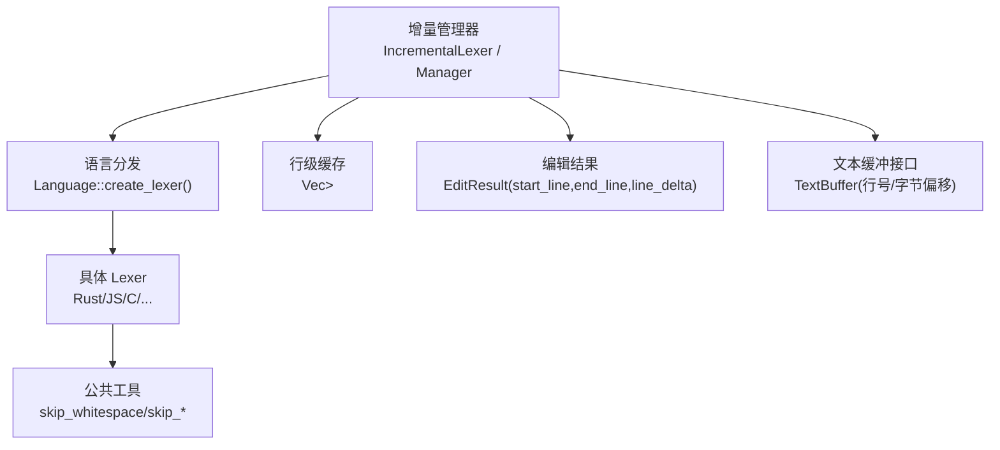
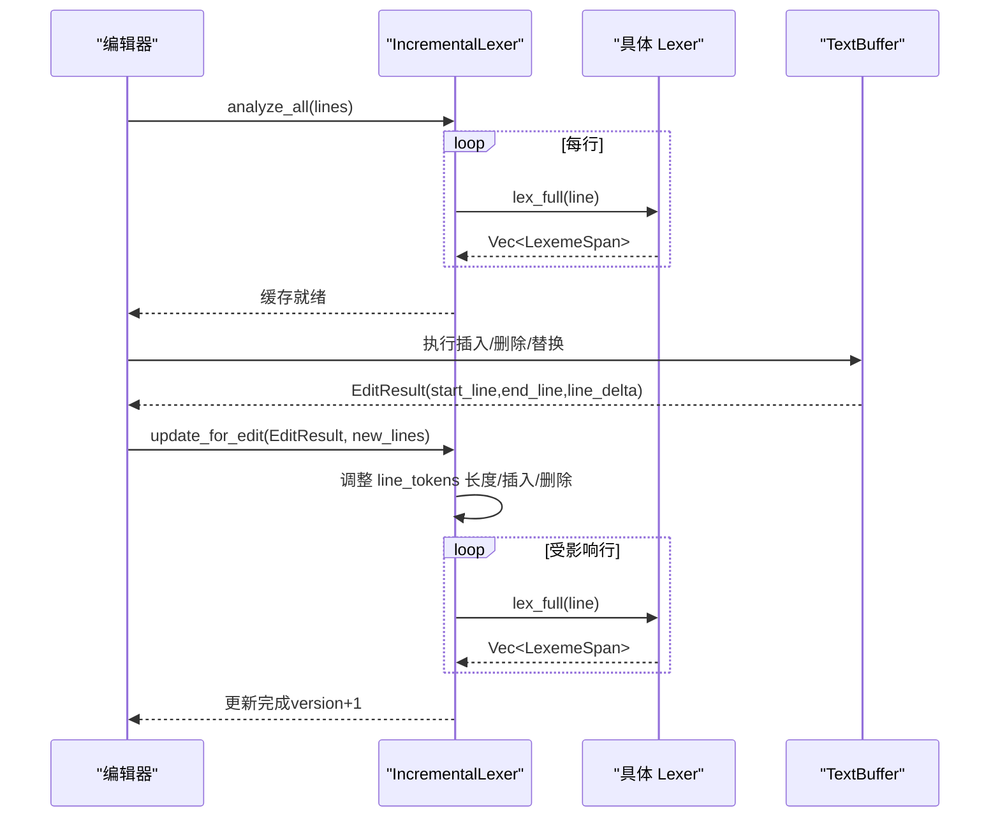
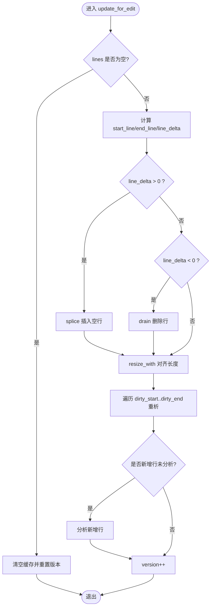
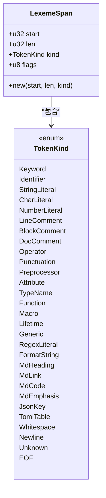
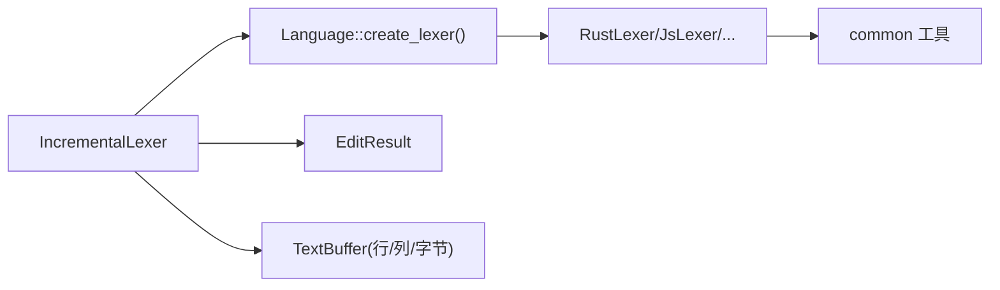
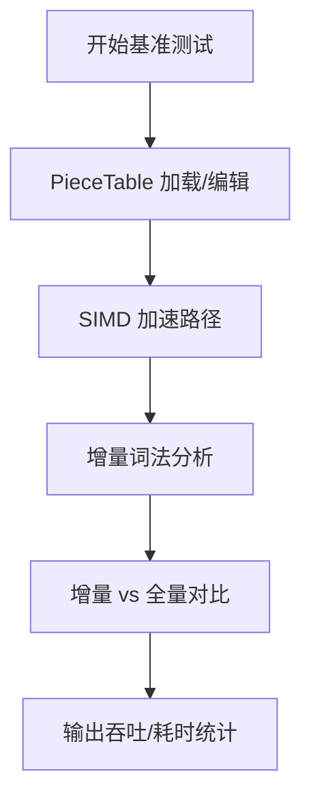

# 增量词法分析框架

<cite>
**本文引用的文件**
- [incremental_lexer.rs](file://crates/aether-core/src/incremental_lexer.rs)
- [mod.rs（Lexer 接口与语言分发）](file://crates/aether-core/src/lexer/mod.rs)
- [common.rs（通用扫描工具）](file://crates/aether-core/src/lexer/common.rs)
- [rust_lexer.rs](file://crates/aether-core/src/lexer/rust_lexer.rs)
- [js_lexer.rs](file://crates/aether-core/src/lexer/js_lexer.rs)
- [text_buffer.rs（文本缓冲区与编辑结果）](file://crates/aether-core/src/buffer/text_buffer.rs)
- [benchmarks.rs（性能基准测试套件）](file://crates/aether-core/src/benchmarks.rs)
- [lexer_bench.rs（Criterion 基准）](file://crates/aether-core/benches/lexer_bench.rs)
</cite>

## 目录
1. [简介](#简介)
2. [项目结构](#项目结构)
3. [核心组件](#核心组件)
4. [架构总览](#架构总览)
5. [详细组件分析](#详细组件分析)
6. [依赖关系分析](#依赖关系分析)
7. [性能考量](#性能考量)
8. [故障排查指南](#故障排查指南)
9. [结论](#结论)
10. [附录：集成示例与最佳实践](#附录：集成示例与最佳实践)

## 简介
本技术文档面向增量词法分析框架，系统性阐述其架构设计、状态机管理、变更检测与性能优化策略。文档覆盖 Lexer trait 接口设计、全量分析与增量分析的差异与适用场景；深入解析 LexemeSpan 数据结构的设计与内存布局优化；解释 TokenKind 分类体系与语义含义；并提供编辑器集成示例与性能基准测试结果及优化建议。

## 项目结构
增量词法分析位于 aether-core 中，围绕“行级缓存 + 精确失效”的增量更新模型组织代码：
- 增量管理器：IncrementalLexer / IncrementalLexerManager
- 词法接口与语言分发：Lexer trait、Language 枚举、各语言 lexer
- 公共扫描工具：空白、注释、字符串等跳过函数
- 文本缓冲与编辑结果：EditResult 用于计算受影响的行范围
- 基准测试：SIMD、PieceTable、增量 vs 全量对比

图表来源
- [incremental_lexer.rs:8-129](file://crates/aether-core/src/incremental_lexer.rs#L8-L129)
- [mod.rs（Lexer 接口与语言分发）:94-196](file://crates/aether-core/src/lexer/mod.rs#L94-L196)
- [common.rs:5-90](file://crates/aether-core/src/lexer/common.rs#L5-L90)
- [text_buffer.rs:142-171](file://crates/aether-core/src/buffer/text_buffer.rs#L142-L171)

章节来源
- [incremental_lexer.rs:8-129](file://crates/aether-core/src/incremental_lexer.rs#L8-L129)
- [mod.rs（Lexer 接口与语言分发）:94-196](file://crates/aether-core/src/lexer/mod.rs#L94-L196)
- [text_buffer.rs:142-171](file://crates/aether-core/src/buffer/text_buffer.rs#L142-L171)

## 核心组件
- 增量词法分析器 IncrementalLexer
  - 维护每行的 token 缓存（Vec<Vec<LexemeSpan>>），支持 O(1) 行访问
  - 通过 EditResult 精确计算受影响行范围，仅重析该行
  - 版本计数器 version 用于外部失效检测
- 增量管理器 IncrementalLexerManager
  - 多文件缓存，限制最大缓存数量，避免无界增长
  - 提供 open/close/switch/clear_all 生命周期管理
- Lexer trait 与 Language 分发
  - 统一 lex_full(text) -> Vec<LexemeSpan> 接口
  - Language::create_lexer() 动态创建，Language::lex_full() 静态分发消除 Box 分配
- 公共扫描工具
  - skip_whitespace/skip_line_comment/skip_block_comment/skip_quoted 等，跨语言复用
- 文本缓冲与编辑结果
  - TextBuffer 抽象编辑操作与行号/字节偏移转换
  - EditResult 描述 start_line/end_line/line_delta，驱动增量失效

章节来源
- [incremental_lexer.rs:8-129](file://crates/aether-core/src/incremental_lexer.rs#L8-L129)
- [mod.rs（Lexer 接口与语言分发）:1-196](file://crates/aether-core/src/lexer/mod.rs#L1-L196)
- [common.rs:5-90](file://crates/aether-core/src/lexer/common.rs#L5-L90)
- [text_buffer.rs:142-171](file://crates/aether-core/src/buffer/text_buffer.rs#L142-L171)

## 架构总览
增量分析的核心流程：
- 首次打开文件：analyze_all 对每行调用具体语言的 lex_full，构建行级 token 缓存
- 编辑后：根据 EditResult 计算受影响行区间，仅对该区间逐行重新 lex_full
- 行数变化：使用 Vec::splice/drain 调整缓存结构，保持与 lines 同步
- 版本控制：每次修改递增 version，供上层进行一致性判断

图表来源
- [incremental_lexer.rs:28-101](file://crates/aether-core/src/incremental_lexer.rs#L28-L101)
- [text_buffer.rs:142-171](file://crates/aether-core/src/buffer/text_buffer.rs#L142-L171)

## 详细组件分析

### 增量词法分析器 IncrementalLexer
- 行级缓存：以 Vec<Vec<LexemeSpan>> 存储，行号即索引，连续内存布局，O(1) 访问
- 变更检测：依据 EditResult 的 start_line/end_line/line_delta 精确计算脏区
- 内存调整：
  - 行数增加：在 start_line+1 处 splice 插入空行
  - 行数减少：drain 移除被删行
  - resize_with 保证与 lines 长度一致
- 版本控制：version 自增，便于上层缓存失效或渲染刷新
- 统计：cache_stats 返回缓存大小与上次行数

图表来源
- [incremental_lexer.rs:43-101](file://crates/aether-core/src/incremental_lexer.rs#L43-L101)

章节来源
- [incremental_lexer.rs:8-129](file://crates/aether-core/src/incremental_lexer.rs#L8-L129)

### 增量管理器 IncrementalLexerManager
- 多文件缓存：HashMap<String, IncrementalLexer> 按路径管理
- 当前文件跟踪：current_file 用于快速定位
- 缓存上限保护：超过 MAX_INCREMENTAL_LEXER_FILES 时清空，避免长时间运行内存膨胀
- 生命周期：open/close/switch/clear_all

章节来源
- [incremental_lexer.rs:131-187](file://crates/aether-core/src/incremental_lexer.rs#L131-L187)

### Lexer trait 与语言分发
- Lexer trait：定义 lex_full(&self, text: &str) -> Vec<LexemeSpan>
- Language 枚举：C/Rust/Python/JS/TS/Go/Java/Json/Markdown/Toml/Html/Css/PlainText/Image
- create_lexer：动态创建具体 Lexer（Box<dyn Lexer>）
- lex_full：静态分发，直接调用具体实现，避免 Box 分配与虚调用开销

章节来源
- [mod.rs（Lexer 接口与语言分发）:1-196](file://crates/aether-core/src/lexer/mod.rs#L1-L196)

### 公共扫描工具 common
- skip_whitespace：跳过空格/制表符/回车
- skip_line_comment：跳过 // 行注释
- skip_block_comment：跳过 /* */ 块注释
- skip_quoted：跳过引号包围的字符串/字符字面量，处理转义与不匹配情况
- skip_identifier_ascii/with：标识符扫描
- skip_number_generic：数字字面量通用扫描框架

章节来源
- [common.rs:5-90](file://crates/aether-core/src/lexer/common.rs#L5-L90)

### 具体语言 Lexer 示例
- RustLexer：识别关键字、类型名、宏、生命周期、字符串、字符、数字、注释、运算符、标点等
- JsLexer：识别正则表达式、模板字符串、关键字、内置类型、字符串、数字、注释、运算符、标点等

章节来源
- [rust_lexer.rs:12-167](file://crates/aether-core/src/lexer/rust_lexer.rs#L12-L167)
- [js_lexer.rs:12-158](file://crates/aether-core/src/lexer/js_lexer.rs#L12-L158)

### LexemeSpan 数据结构与内存布局
- 字段：start(u32)、len(u32)、kind(TokenKind)、flags(u8)
- 压缩目标：从 24B 压缩到 12B，单行内偏移与长度均不超过 4GB
- 构造便捷：new(start: usize, len: usize, kind) 自动截断为 u32
- flags：预留位，可用于扩展标记（如是否高亮、是否折叠等）

图表来源
- [mod.rs（Lexer 接口与语言分发）:7-79](file://crates/aether-core/src/lexer/mod.rs#L7-L79)

章节来源
- [mod.rs（Lexer 接口与语言分发）:7-79](file://crates/aether-core/src/lexer/mod.rs#L7-L79)

### TokenKind 分类体系与语义
- 通用类别：Keyword、Identifier、StringLiteral、CharLiteral、NumberLiteral、LineComment、BlockComment、DocComment、Operator、Punctuation
- 预处理/注解：Preprocessor、Attribute
- 类型/函数/宏：TypeName、Function、Macro、Lifetime、Generic
- 特殊字面量：RegexLiteral、FormatString
- Markdown：MdHeading、MdLink、MdCode、MdEmphasis
- 配置格式：JsonKey、TomlTable
- 控制流：Whitespace、Newline、Unknown、EOF

章节来源
- [mod.rs（Lexer 接口与语言分发）:7-68](file://crates/aether-core/src/lexer/mod.rs#L7-L68)

### 全量分析与增量分析的区别与适用场景
- 全量分析（analyze_all）
  - 适用于首次打开文件或切换文件时
  - 对全部行调用 lex_full，构建完整缓存
- 增量分析（update_for_edit）
  - 适用于编辑后的局部更新
  - 基于 EditResult 精确计算脏区，仅重析受影响行
  - 优势：大幅降低 CPU 与内存分配，提升响应速度

章节来源
- [incremental_lexer.rs:28-101](file://crates/aether-core/src/incremental_lexer.rs#L28-L101)
- [text_buffer.rs:142-171](file://crates/aether-core/src/buffer/text_buffer.rs#L142-L171)

## 依赖关系分析
- IncrementalLexer 依赖 Language::create_lexer() 获取具体 Lexer
- 具体 Lexer 依赖 common 中的通用扫描函数
- IncrementalLexer 依赖 EditResult 计算脏区
- 文本缓冲 TextBuffer 提供行号/字节偏移转换，确保编辑位置准确

图表来源
- [incremental_lexer.rs:28-101](file://crates/aether-core/src/incremental_lexer.rs#L28-L101)
- [mod.rs（Lexer 接口与语言分发）:159-196](file://crates/aether-core/src/lexer/mod.rs#L159-L196)
- [common.rs:5-90](file://crates/aether-core/src/lexer/common.rs#L5-L90)
- [text_buffer.rs:142-171](file://crates/aether-core/src/buffer/text_buffer.rs#L142-L171)

章节来源
- [incremental_lexer.rs:28-101](file://crates/aether-core/src/incremental_lexer.rs#L28-L101)
- [mod.rs（Lexer 接口与语言分发）:159-196](file://crates/aether-core/src/lexer/mod.rs#L159-L196)
- [common.rs:5-90](file://crates/aether-core/src/lexer/common.rs#L5-L90)
- [text_buffer.rs:142-171](file://crates/aether-core/src/buffer/text_buffer.rs#L142-L171)

## 性能考量
- 行级缓存与连续内存布局：Vec<Vec<LexemeSpan>> 提供 O(1) 行访问，减少间接寻址
- 精确失效：基于 EditResult 的 start_line/end_line/line_delta，最小化重析范围
- 静态分发：Language::lex_full 直接调用具体实现，避免 Box 分配与虚调用
- SIMD 加速：换行符计数、字节查找、空白跳过等热点路径使用 SIMD
- 基准测试：
  - PieceTable 加载/插入/删除/读取/快照/编辑吞吐
  - SIMD 新行计数/字节查找/空白跳过
  - 增量 vs 全量对比：展示增量更新的显著加速

图表来源
- [benchmarks.rs:108-443](file://crates/aether-core/src/benchmarks.rs#L108-L443)
- [lexer_bench.rs:136-158](file://crates/aether-core/benches/lexer_bench.rs#L136-L158)

章节来源
- [benchmarks.rs:108-443](file://crates/aether-core/src/benchmarks.rs#L108-L443)
- [lexer_bench.rs:136-158](file://crates/aether-core/benches/lexer_bench.rs#L136-L158)

## 故障排查指南
- 编辑后缓存不一致
  - 检查 EditResult 的 start_line/end_line/line_delta 是否正确计算
  - 确认 update_for_edit 已正确调整 line_tokens 长度与脏区
- 行数变化导致越界
  - 验证 splice/drain 的边界条件，确保 remove_start/remove_end 不越界
- 版本不同步
  - 每次 edit 后 version 应自增，确保上层能检测到变更
- 多文件缓存泄漏
  - 使用 close_file 释放不再使用的文件，避免 HashMap 无限增长
  - 超过 MAX_INCREMENTAL_LEXER_FILES 会触发清理

章节来源
- [incremental_lexer.rs:43-101](file://crates/aether-core/src/incremental_lexer.rs#L43-L101)
- [incremental_lexer.rs:151-187](file://crates/aether-core/src/incremental_lexer.rs#L151-L187)
- [text_buffer.rs:142-171](file://crates/aether-core/src/buffer/text_buffer.rs#L142-L171)

## 结论
该增量词法分析框架通过行级缓存、精确失效与静态分发，实现了高效的编辑器高亮与语法分析。LexemeSpan 的紧凑布局与 TokenKind 的统一分类提升了可扩展性与性能。结合 SIMD 与完善的基准测试，框架在大规模文件与高频编辑场景下表现优异。建议在编辑器中优先采用增量分析，仅在首次打开或切换文件时使用全量分析。

## 附录：集成示例与最佳实践
- 编辑器集成步骤
  - 打开文件：使用 IncrementalLexerManager::open_file 获取对应语言的 IncrementalLexer
  - 首次分析：调用 analyze_all(lines) 构建缓存
  - 编辑处理：根据 TextBuffer 的编辑操作生成 EditResult，调用 update_for_edit(new_lines)
  - 渲染消费：通过 get_line_tokens 或 get_all_tokens 获取行级 token 进行高亮
- 最佳实践
  - 尽量批量合并编辑操作，减少多次 update_for_edit 调用
  - 合理设置 MAX_INCREMENTAL_LEXER_FILES，平衡内存占用与命中率
  - 使用 Language::lex_full 进行一次性分析，避免 Box 分配
  - 利用 version 进行渲染层失效判断，避免重复绘制

章节来源
- [incremental_lexer.rs:151-187](file://crates/aether-core/src/incremental_lexer.rs#L151-L187)
- [mod.rs（Lexer 接口与语言分发）:159-196](file://crates/aether-core/src/lexer/mod.rs#L159-L196)
- [text_buffer.rs:142-171](file://crates/aether-core/src/buffer/text_buffer.rs#L142-L171)