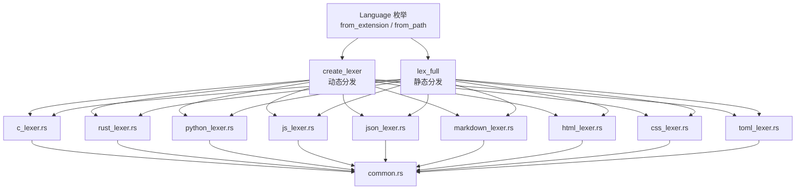
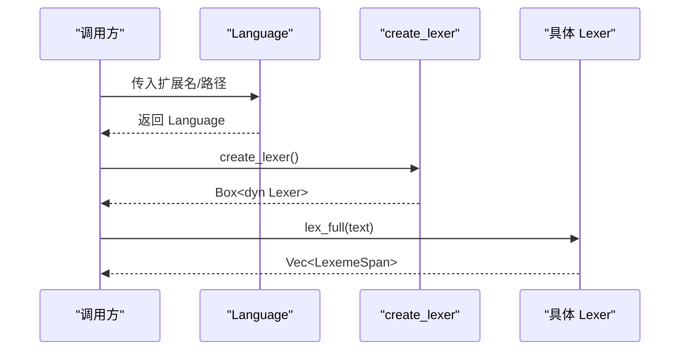
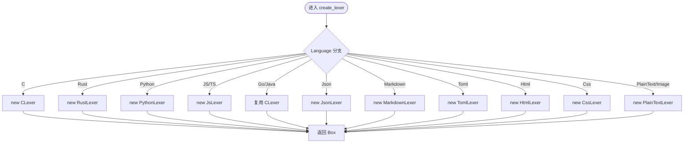
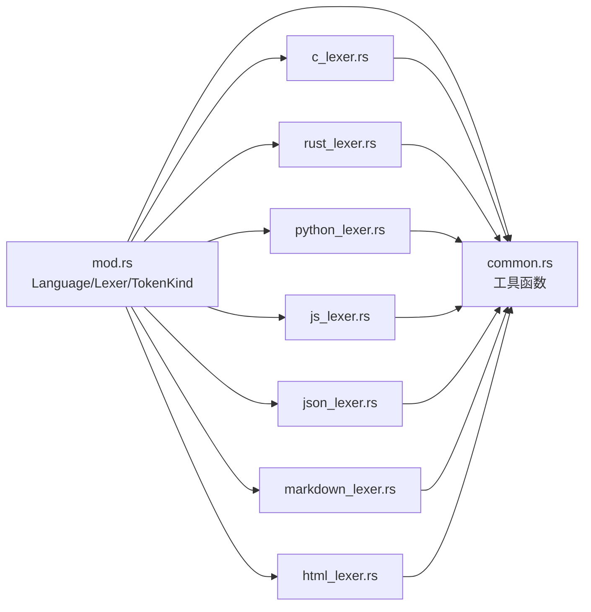

# 多语言支持架构

<cite>
**本文引用的文件**
- [crates/aether-core/src/lexer/mod.rs](file://crates/aether-core/src/lexer/mod.rs)
- [crates/aether-core/src/lexer/common.rs](file://crates/aether-core/src/lexer/common.rs)
- [crates/aether-core/src/lexer/c_lexer.rs](file://crates/aether-core/src/lexer/c_lexer.rs)
- [crates/aether-core/src/lexer/rust_lexer.rs](file://crates/aether-core/src/lexer/rust_lexer.rs)
- [crates/aether-core/src/lexer/js_lexer.rs](file://crates/aether-core/src/lexer/js_lexer.rs)
- [crates/aether-core/src/lexer/python_lexer.rs](file://crates/aether-core/src/lexer/python_lexer.rs)
- [crates/aether-core/src/lexer/json_lexer.rs](file://crates/aether-core/src/lexer/json_lexer.rs)
- [crates/aether-core/src/lexer/markdown_lexer.rs](file://crates/aether-core/src/lexer/markdown_lexer.rs)
- [crates/aether-core/src/lexer/html_lexer.rs](file://crates/aether-core/src/lexer/html_lexer.rs)
</cite>

## 目录
1. [简介](#简介)
2. [项目结构](#项目结构)
3. [核心组件](#核心组件)
4. [架构总览](#架构总览)
5. [详细组件分析](#详细组件分析)
6. [依赖关系分析](#依赖关系分析)
7. [性能考量](#性能考量)
8. [故障排查指南](#故障排查指南)
9. [结论](#结论)
10. [附录：添加新语言支持与兼容性矩阵](#附录添加新语言支持与兼容性矩阵)

## 简介
本文件系统性说明编辑器中“多语言支持架构”的设计与实现，重点覆盖：
- Language 枚举的设计理念与扩展机制
- 文件扩展名到语言的映射规则
- 语言检测算法（从路径和扩展名推断）
- create_lexer 工厂方法与静态分发 lex_full 的实现策略
- 通用词法规则（common 模块）的共享能力（UTF-8 处理、空白识别等）
- 新增语言支持的完整步骤与最佳实践
- 语言支持矩阵与兼容性说明

## 项目结构
多语言支持的核心位于 aether-core 的词法分析子系统，采用“统一接口 + 多语言实现”的分层组织：
- 公共接口与类型定义：Lexer trait、TokenKind、LexemeSpan、Language 枚举、utf8_char_len 工具
- 语言检测与工厂：Language::from_extension/from_path、create_lexer、lex_full
- 各语言词法分析器：C/Rust/Python/JS/TS/JSON/Markdown/HTML/CSS/TOML 等
- 通用工具：common 模块提供跳过空白、注释、字符串、标识符、数字等基础扫描函数

图表来源
- [crates/aether-core/src/lexer/mod.rs:94-196](file://crates/aether-core/src/lexer/mod.rs#L94-L196)
- [crates/aether-core/src/lexer/common.rs:1-151](file://crates/aether-core/src/lexer/common.rs#L1-L151)

章节来源
- [crates/aether-core/src/lexer/mod.rs:94-196](file://crates/aether-core/src/lexer/mod.rs#L94-L196)
- [crates/aether-core/src/lexer/common.rs:1-151](file://crates/aether-core/src/lexer/common.rs#L1-L151)

## 核心组件
- Lexer trait：统一的词法分析接口，提供全量行级分析能力。
- TokenKind：跨语言统一的 token 类别，涵盖关键字、标识符、字面量、注释、运算符、分隔符、属性、类型名、函数名、宏、生命周期、泛型、正则、格式化字符串、Markdown/JSON/TOML 专用标记、空白、换行、未知、EOF。
- LexemeSpan：紧凑表示 token 的起止位置、类别与标志位，优化内存占用。
- Language 枚举：集中管理支持的语言族，并提供扩展名映射、路径解析、创建 lexer、静态分发分析等方法。
- common 模块：提供不依赖具体语言的字节级扫描工具，如跳过空白、行/块注释、引号字符串、标识符、数字等。

章节来源
- [crates/aether-core/src/lexer/mod.rs:1-111](file://crates/aether-core/src/lexer/mod.rs#L1-L111)
- [crates/aether-core/src/lexer/common.rs:1-151](file://crates/aether-core/src/lexer/common.rs#L1-L151)

## 架构总览
整体采用“枚举驱动 + 工厂模式 + 静态/动态分发”的组合：
- 语言检测：通过文件扩展名或路径推断 Language。
- 动态分发：create_lexer 返回 Box<dyn Lexer>，便于运行时选择具体实现。
- 静态分发：lex_full 直接 match 调用具体实现，避免装箱与虚调用开销。
- 通用能力：common 模块为所有 lexer 复用，保证一致性与可维护性。

图表来源
- [crates/aether-core/src/lexer/mod.rs:113-196](file://crates/aether-core/src/lexer/mod.rs#L113-L196)

章节来源
- [crates/aether-core/src/lexer/mod.rs:113-196](file://crates/aether-core/src/lexer/mod.rs#L113-L196)

## 详细组件分析

### Language 枚举与扩展机制
- 设计理念：以枚举为中心聚合语言族，集中管理扩展名映射、路径解析、lexer 创建与分析入口，降低耦合度。
- 扩展机制：新增语言时，需扩展 Language 枚举、在 from_extension 中添加映射、在 create_lexer 与 lex_full 中添加分支。
- 回退策略：未知扩展名统一归为 PlainText，确保任何文本均可被查看；Go/Java 等无独立 lexer 的语言复用 C 家族作为 fallback。

章节来源
- [crates/aether-core/src/lexer/mod.rs:94-196](file://crates/aether-core/src/lexer/mod.rs#L94-L196)

### 文件扩展名到语言的映射规则
- 大小写不敏感：统一转为小写匹配。
- 分组映射：将相似语法/用途的扩展名归入同一语言族（如 HTML 模板、CSS 预处理器）。
- 图片类型：Image 仅用于图标/路由，不参与词法分析。
- 默认回退：未知扩展名 -> PlainText。

章节来源
- [crates/aether-core/src/lexer/mod.rs:117-149](file://crates/aether-core/src/lexer/mod.rs#L117-L149)

### 语言检测算法（从路径和扩展名推断）
- from_path：提取路径扩展名并委托给 from_extension；若无扩展名则回退为 PlainText。
- from_extension：基于扩展名精确匹配，按语言族归类。

章节来源
- [crates/aether-core/src/lexer/mod.rs:151-157](file://crates/aether-core/src/lexer/mod.rs#L151-L157)
- [crates/aether-core/src/lexer/mod.rs:117-149](file://crates/aether-core/src/lexer/mod.rs#L117-L149)

### create_lexer 工厂方法（动态分发）
- 职责：根据 Language 实例创建对应的 Lexer 实现，返回 trait 对象。
- 适用场景：需要延迟构建、存储或运行时选择的场景。
- 注意：Go/Java 复用 C 家族 lexer，提供注释、字符串、数字、大括号等公共结构的高亮。

图表来源
- [crates/aether-core/src/lexer/mod.rs:159-177](file://crates/aether-core/src/lexer/mod.rs#L159-L177)

章节来源
- [crates/aether-core/src/lexer/mod.rs:159-177](file://crates/aether-core/src/lexer/mod.rs#L159-L177)

### 静态分发 lex_full（高性能路径）
- 设计动机：避免 Box 分配与虚调用开销，直接在编译期确定目标实现。
- 行为：match Language，直接调用对应 lexer.lex_full，返回结果。
- 适用场景：高频调用、对性能敏感的路径。

章节来源
- [crates/aether-core/src/lexer/mod.rs:179-195](file://crates/aether-core/src/lexer/mod.rs#L179-L195)

### 通用词法规则（common 模块）
- 功能清单：
  - 跳过空白字符（空格、制表符、回车）
  - 跳过行注释（//）
  - 跳过块注释（/* */），支持未闭合情况
  - 跳过引号包围的字符串/字符字面量，正确处理转义
  - 跳过 ASCII 标识符及扩展字符集
  - 通用数字扫描框架（回调判定）
- UTF-8 处理：
  - utf8_char_len：根据首字节推断字符长度，非法或 ASCII 返回 1，保证至少前进一步，避免中文/emoji 被拆散导致高亮错位。
- 复用范围：所有语言 lexer 均复用这些工具，确保一致性与可维护性。

章节来源
- [crates/aether-core/src/lexer/common.rs:1-151](file://crates/aether-core/src/lexer/common.rs#L1-L151)
- [crates/aether-core/src/lexer/mod.rs:233-243](file://crates/aether-core/src/lexer/mod.rs#L233-L243)

### 各语言词法分析器要点
- C 家族（CLexer）：
  - 支持预处理指令、行/块/文档注释、字符串/字符字面量、数字（含进制后缀）、标识符与关键字、运算符、标点。
  - 使用 common 工具进行注释、字符串、空白等扫描。
- Rust（RustLexer）：
  - 支持属性、生命周期、宏调用、文档注释、字符串/字符字面量、数字、关键字、内置类型、宏名等。
- Python（PythonLexer）：
  - 支持三引号字符串、f-string、关键字、内置类型、注释、数字、运算符、标点。
- JavaScript/TypeScript（JsLexer）：
  - 支持正则表达式上下文判断、模板字符串、字符串/字符字面量、关键字、内置类型、注释、数字、运算符、标点。
- JSON（JsonLexer）：
  - 支持键值区分、布尔/空字面量、数字、字符串、空白、标点。
- Markdown（MarkdownLexer）：
  - 支持标题、代码块/行内代码、链接、强调、列表、HTML 标签、普通文本。
- HTML（HtmlLexer）：
  - 支持注释、标签名、属性名/值、实体引用、普通文本。

章节来源
- [crates/aether-core/src/lexer/c_lexer.rs:1-200](file://crates/aether-core/src/lexer/c_lexer.rs#L1-L200)
- [crates/aether-core/src/lexer/rust_lexer.rs:1-200](file://crates/aether-core/src/lexer/rust_lexer.rs#L1-L200)
- [crates/aether-core/src/lexer/python_lexer.rs:1-200](file://crates/aether-core/src/lexer/python_lexer.rs#L1-L200)
- [crates/aether-core/src/lexer/js_lexer.rs:1-200](file://crates/aether-core/src/lexer/js_lexer.rs#L1-L200)
- [crates/aether-core/src/lexer/json_lexer.rs:1-200](file://crates/aether-core/src/lexer/json_lexer.rs#L1-L200)
- [crates/aether-core/src/lexer/markdown_lexer.rs:1-200](file://crates/aether-core/src/lexer/markdown_lexer.rs#L1-L200)
- [crates/aether-core/src/lexer/html_lexer.rs:1-200](file://crates/aether-core/src/lexer/html_lexer.rs#L1-L200)

## 依赖关系分析
- 低耦合：每个语言 lexer 仅依赖 common 与公共类型，避免相互耦合。
- 集中调度：Language 作为唯一入口，屏蔽内部实现细节。
- 可扩展：新增语言只需扩展枚举与分支，不影响既有逻辑。

图表来源
- [crates/aether-core/src/lexer/mod.rs:198-207](file://crates/aether-core/src/lexer/mod.rs#L198-L207)
- [crates/aether-core/src/lexer/common.rs:1-151](file://crates/aether-core/src/lexer/common.rs#L1-L151)

章节来源
- [crates/aether-core/src/lexer/mod.rs:198-207](file://crates/aether-core/src/lexer/mod.rs#L198-L207)

## 性能考量
- 静态分发优先：lex_full 直接 match 调用，避免 Box 分配与虚调用，适合热路径。
- 紧凑数据结构：LexemeSpan 压缩字段，减少内存占用。
- 字节级扫描：common 模块基于字节切片操作，减少编码转换开销。
- UTF-8 安全推进：utf8_char_len 保证非法字节也能前进，避免死循环。
- 缓存与容量预分配：各 lexer 使用 Vec::with_capacity 预估容量，减少扩容。

[本节为通用性能讨论，不直接分析具体文件]

## 故障排查指南
- 问题：中文/emoji 高亮错位
  - 原因：未按完整 UTF-8 字符推进
  - 解决：使用 utf8_char_len 计算字符长度，确保每次至少前进一个完整字符
- 问题：未闭合注释导致卡住
  - 原因：块注释扫描未处理边界
  - 解决：skip_block_comment 在未找到结束符时返回末尾，避免无限循环
- 问题：字符串转义处理错误
  - 原因：反斜杠在末尾时越界
  - 解决：skip_quoted 在末尾只前进 1，避免越界
- 问题：未知扩展名无法打开
  - 原因：未设置回退
  - 解决：from_extension 默认返回 PlainText，确保任何文本可被查看

章节来源
- [crates/aether-core/src/lexer/mod.rs:233-243](file://crates/aether-core/src/lexer/mod.rs#L233-L243)
- [crates/aether-core/src/lexer/common.rs:25-55](file://crates/aether-core/src/lexer/common.rs#L25-L55)

## 结论
该多语言支持架构通过统一的 Language 枚举与 Lexer 接口，结合 common 模块的共享能力，实现了高内聚、低耦合、易扩展的词法分析体系。动态分发与静态分发并存，兼顾灵活性与性能。新增语言只需遵循约定扩展枚举与分支，即可快速接入。

[本节为总结性内容，不直接分析具体文件]

## 附录：添加新语言支持与兼容性矩阵

### 新增语言支持步骤
1. 扩展 Language 枚举：新增语言变体。
2. 更新 from_extension：为新扩展名添加映射。
3. 实现 Lexer：实现 Lexer trait，复用 common 工具。
4. 更新 create_lexer：添加分支，返回新 lexer。
5. 更新 lex_full：添加静态分发分支。
6. 编写测试：覆盖关键语法与边界条件。
7. 验证兼容性：确保与其他语言互不干扰，UTF-8 处理正确。

章节来源
- [crates/aether-core/src/lexer/mod.rs:94-196](file://crates/aether-core/src/lexer/mod.rs#L94-L196)
- [crates/aether-core/src/lexer/common.rs:1-151](file://crates/aether-core/src/lexer/common.rs#L1-L151)

### 语言支持矩阵与兼容性说明
- 已支持语言族：
  - C/C++：关键字、注释、字符串、数字、预处理指令
  - Rust：属性、生命周期、宏、文档注释
  - Python：三引号字符串、f-string、关键字、内置类型
  - JavaScript/TypeScript：正则、模板字符串、关键字、内置类型
  - JSON：键值、布尔/空、数字、字符串
  - Markdown：标题、代码、链接、强调、列表、HTML 标签
  - HTML：注释、标签、属性、实体引用
  - CSS/TOML：样式与配置语法
- 回退策略：
  - Go/Java：复用 C 家族 lexer，提供公共结构高亮
  - 未知扩展名：PlainText，确保可读性
- 兼容性：
  - 所有 lexer 均基于字节级扫描，兼容 UTF-8
  - 统一 TokenKind，便于上层渲染与语义分析

章节来源
- [crates/aether-core/src/lexer/mod.rs:94-196](file://crates/aether-core/src/lexer/mod.rs#L94-L196)
- [crates/aether-core/src/lexer/c_lexer.rs:1-200](file://crates/aether-core/src/lexer/c_lexer.rs#L1-L200)
- [crates/aether-core/src/lexer/rust_lexer.rs:1-200](file://crates/aether-core/src/lexer/rust_lexer.rs#L1-L200)
- [crates/aether-core/src/lexer/python_lexer.rs:1-200](file://crates/aether-core/src/lexer/python_lexer.rs#L1-L200)
- [crates/aether-core/src/lexer/js_lexer.rs:1-200](file://crates/aether-core/src/lexer/js_lexer.rs#L1-L200)
- [crates/aether-core/src/lexer/json_lexer.rs:1-200](file://crates/aether-core/src/lexer/json_lexer.rs#L1-L200)
- [crates/aether-core/src/lexer/markdown_lexer.rs:1-200](file://crates/aether-core/src/lexer/markdown_lexer.rs#L1-L200)
- [crates/aether-core/src/lexer/html_lexer.rs:1-200](file://crates/aether-core/src/lexer/html_lexer.rs#L1-L200)