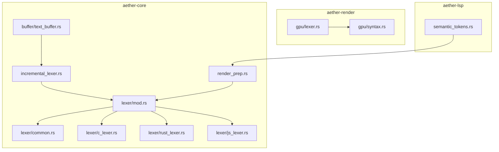
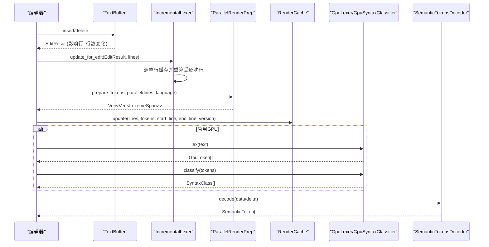
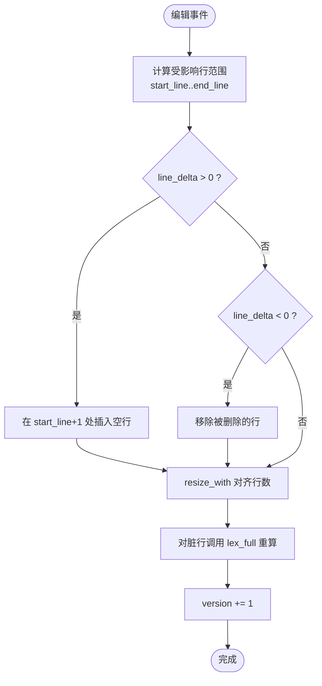
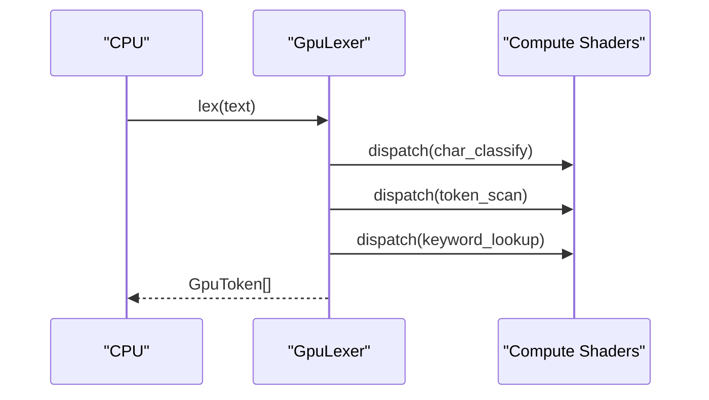
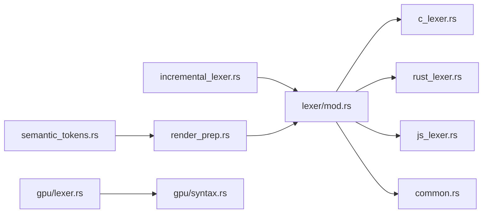

# 词法分析器

<cite>
**本文引用的文件**
- [incremental_lexer.rs](file://crates/aether-core/src/incremental_lexer.rs)
- [mod.rs（lexer）](file://crates/aether-core/src/lexer/mod.rs)
- [common.rs](file://crates/aether-core/src/lexer/common.rs)
- [c_lexer.rs](file://crates/aether-core/src/lexer/c_lexer.rs)
- [rust_lexer.rs](file://crates/aether-core/src/lexer/rust_lexer.rs)
- [js_lexer.rs](file://crates/aether-core/src/lexer/js_lexer.rs)
- [render_prep.rs](file://crates/aether-core/src/render_prep.rs)
- [text_buffer.rs](file://crates/aether-core/src/buffer/text_buffer.rs)
- [lexer.rs（GPU）](file://crates/aether-render/src/gpu/lexer.rs)
- [syntax.rs（GPU）](file://crates/aether-render/src/gpu/syntax.rs)
- [semantic_tokens.rs](file://crates/aether-lsp/src/semantic_tokens.rs)
</cite>

## 目录
1. [简介](#简介)
2. [项目结构](#项目结构)
3. [核心组件](#核心组件)
4. [架构总览](#架构总览)
5. [详细组件分析](#详细组件分析)
6. [依赖关系分析](#依赖关系分析)
7. [性能考量](#性能考量)
8. [故障排查指南](#故障排查指南)
9. [结论](#结论)
10. [附录：扩展指南与调试技巧](#附录：扩展指南与调试技巧)

## 简介
本文件为“词法分析器系统”的全面技术文档，聚焦增量词法分析的架构设计与实现原理，涵盖 Token 流生成、状态机管理、错误恢复机制；多语言支持框架及新语言接入方法；C、Rust、JavaScript 的具体词法规则与高亮逻辑；与渲染系统的集成（语义令牌处理、GPU 加速）；以及性能优化策略、扩展指南与常见问题解决方案。目标是帮助读者快速理解并扩展该词法分析子系统。

## 项目结构
词法分析相关代码主要分布在以下模块：
- aether-core：通用词法分析接口、各语言 Lexer 实现、增量词法分析器、渲染预处理与缓存
- aether-render：GPU 侧的并行词法分析与语法分类（Compute Shader）
- aether-lsp：LSP 语义令牌解码与映射，用于更精确的高亮

图表来源
- [mod.rs（lexer）:94-196](file://crates/aether-core/src/lexer/mod.rs#L94-L196)
- [incremental_lexer.rs:8-129](file://crates/aether-core/src/incremental_lexer.rs#L8-L129)
- [render_prep.rs:17-61](file://crates/aether-core/src/render_prep.rs#L17-L61)
- [lexer.rs（GPU）:48-221](file://crates/aether-render/src/gpu/lexer.rs#L48-L221)
- [syntax.rs（GPU）:39-124](file://crates/aether-render/src/gpu/syntax.rs#L39-L124)
- [semantic_tokens.rs:17-86](file://crates/aether-lsp/src/semantic_tokens.rs#L17-L86)

章节来源
- [mod.rs（lexer）:94-196](file://crates/aether-core/src/lexer/mod.rs#L94-L196)
- [incremental_lexer.rs:8-129](file://crates/aether-core/src/incremental_lexer.rs#L8-L129)
- [render_prep.rs:17-61](file://crates/aether-core/src/render_prep.rs#L17-L61)
- [lexer.rs（GPU）:48-221](file://crates/aether-render/src/gpu/lexer.rs#L48-L221)
- [syntax.rs（GPU）:39-124](file://crates/aether-render/src/gpu/syntax.rs#L39-L124)
- [semantic_tokens.rs:17-86](file://crates/aether-lsp/src/semantic_tokens.rs#L17-L86)

## 核心组件
- 统一词法接口与 Token 模型
  - Lexer trait：定义 lex_full(text) -> Vec<LexemeSpan>
  - LexemeSpan：紧凑表示 token 的起始位置、长度、类型与标志位
  - TokenKind：跨语言统一的 token 类别（关键字、标识符、字符串、注释、运算符等）
  - Language：语言枚举与工厂方法 create_lexer() / lex_full()
- 增量词法分析器
  - IncrementalLexer：按行缓存 token，编辑时仅重算受影响行
  - IncrementalLexerManager：多文件管理器，带最大缓存数量保护
- 公共工具函数
  - common.rs 提供空白、注释、字符串、标识符、数字等通用跳过/扫描函数
- 具体语言实现
  - C/Rust/JS 等 Lexer 基于 DFA/规则匹配，识别关键字、字面量、注释、操作符、正则、模板字符串等
- 渲染预处理与缓存
  - ParallelRenderPrep：按行并行生成 token（rayon），小行数回退单线程
  - RenderCache：可见行文本与 token 的缓存，版本化失效控制
- GPU 加速
  - GpuLexer：三阶段 Compute Shader（字符分类、Token 扫描、关键字查找）
  - GpuSyntaxClassifier：基于 Token 序列模式的语法分类（函数声明/调用、类型名、变量声明等）
- LSP 语义令牌
  - SemanticTokensDecoder：解码 LSP 紧凑数组为结构化 token，支持 delta 更新
  - map_tokens：将 LSP 类型与修饰符映射为渲染可用信息

章节来源
- [mod.rs（lexer）:1-196](file://crates/aether-core/src/lexer/mod.rs#L1-L196)
- [common.rs:1-151](file://crates/aether-core/src/lexer/common.rs#L1-L151)
- [incremental_lexer.rs:8-187](file://crates/aether-core/src/incremental_lexer.rs#L8-L187)
- [render_prep.rs:1-194](file://crates/aether-core/src/render_prep.rs#L1-L194)
- [lexer.rs（GPU）:1-430](file://crates/aether-render/src/gpu/lexer.rs#L1-L430)
- [syntax.rs（GPU）:1-289](file://crates/aether-render/src/gpu/syntax.rs#L1-L289)
- [semantic_tokens.rs:1-558](file://crates/aether-lsp/src/semantic_tokens.rs#L1-L558)

## 架构总览
增量词法分析流程：
- 编辑器对文本缓冲区执行插入/删除，得到 EditResult（受影响的行范围与行数变化）
- IncrementalLexer 根据 EditResult 调整内部行级 token 缓存，仅重算受影响行
- 渲染层通过 ParallelRenderPrep 对可见行进行并行 token 预处理，并使用 RenderCache 缓存结果
- 可选地，使用 GPU 词法分析器进行高性能 token 扫描与语法分类
- LSP 语义令牌可叠加到本地 token 上，提供更精确的类型/修饰符信息

图表来源
- [text_buffer.rs:124-171](file://crates/aether-core/src/buffer/text_buffer.rs#L124-L171)
- [incremental_lexer.rs:36-101](file://crates/aether-core/src/incremental_lexer.rs#L36-L101)
- [render_prep.rs:32-61](file://crates/aether-core/src/render_prep.rs#L32-L61)
- [lexer.rs（GPU）:187-221](file://crates/aether-render/src/gpu/lexer.rs#L187-L221)
- [syntax.rs（GPU）:93-124](file://crates/aether-render/src/gpu/syntax.rs#L93-L124)
- [semantic_tokens.rs:17-86](file://crates/aether-lsp/src/semantic_tokens.rs#L17-L86)

## 详细组件分析

### 增量词法分析器（IncrementalLexer）
- 设计要点
  - 行级缓存：Vec<Vec<LexemeSpan>>，行号即索引，O(1) 访问
  - 版本号：每次编辑后递增，供渲染缓存失效检测
  - 编辑处理：根据 EditResult 计算受影响行范围，仅重算这些行；处理插入/删除导致的行偏移
  - 管理器：多文件缓存上限保护，避免长时间运行内存无界增长
- 关键流程
  - analyze_all：首次打开文件全量分析
  - update_for_edit：增量更新，splice/drain 调整行缓存，lex_full 重算脏行
  - get_line_tokens/get_all_tokens：读取缓存
  - clear/version/cache_stats：清理与统计

图表来源
- [incremental_lexer.rs:36-101](file://crates/aether-core/src/incremental_lexer.rs#L36-L101)

章节来源
- [incremental_lexer.rs:8-187](file://crates/aether-core/src/incremental_lexer.rs#L8-L187)
- [text_buffer.rs:124-171](file://crates/aether-core/src/buffer/text_buffer.rs#L124-L171)

### 语言抽象与 Token 模型（lexer/mod.rs）
- Lexer trait：统一 lex_full 接口
- TokenKind：跨语言统一 token 类别，覆盖关键字、标识符、字符串、注释、运算符、分隔符、预处理指令、属性、类型名、函数名、宏、生命周期、泛型、正则、格式化字符串、Markdown 元素、JSON/TOML 特殊标记、空白、换行、未知、EOF
- Language：从扩展名/路径推断语言，create_lexer 动态分发，lex_full 静态分发（零 Box 分配）
- PlainTextLexer：无高亮的兜底实现

章节来源
- [mod.rs（lexer）:1-196](file://crates/aether-core/src/lexer/mod.rs#L1-L196)

### 公共工具函数（lexer/common.rs）
- skip_whitespace：跳过空格/制表符/回车
- skip_line_comment / skip_block_comment：跳过行/块注释
- skip_quoted：安全跳过引号包围的字符串/字符字面量，正确处理末尾反斜杠
- skip_identifier_ascii / skip_identifier_with：标识符扫描
- skip_number_generic：通用数字扫描框架（回调判定合法字符）

章节来源
- [common.rs:1-151](file://crates/aether-core/src/lexer/common.rs#L1-L151)

### C 语言词法分析器（c_lexer.rs）
- DFA/规则驱动：按首字节分派，识别空白、换行、注释（行/块/文档）、预处理指令、字符串/字符、数字（含进制前缀、指数、后缀）、标识符/关键字、操作符、标点、未知 UTF-8 字符
- 数字解析：十六进制/二进制前缀，阻止 1..2 范围语法误合并
- 操作符合并：++/--/->/==/!=/<=/>>/<</>>/&&/|| 等
- 测试覆盖：关键字、注释、操作符、预处理续行、UTF-8 未知字符

章节来源
- [c_lexer.rs:1-425](file://crates/aether-core/src/lexer/c_lexer.rs#L1-L425)

### Rust 语言词法分析器（rust_lexer.rs）
- 特性支持：
  - 文档注释：/// 与 /** */（排除空块注释）
  - 生命周期：'a, 'static 等
  - 属性：#[...] 与 #![...]
  - 宏调用：ident!
  - 内置类型：i32/u64/String/Option/Result 等
  - 数字：0x/0b/0o、下划线分隔、浮点指数
- 边界处理：未闭合块注释推进至末尾，避免残余 token；反斜杠转义字符字面量不误判为生命周期

章节来源
- [rust_lexer.rs:1-583](file://crates/aether-core/src/lexer/rust_lexer.rs#L1-L583)

### JavaScript/TypeScript 词法分析器（js_lexer.rs）
- 特性支持：
  - 正则表达式：上下文判断（非标识符后）识别 /.../g 标志
  - 模板字符串：`...${...}` 嵌套内容跳过
  - 字符串：双引号/单引号
  - 数字：0x/0b/0o、BigInt n 后缀、指数
  - 操作符：===/!==/**=/??/?./>>> 等
  - 关键字与内置类型：TS 类型如 interface/type/namespace/keyof 等
- 中文/Emoji：按完整 UTF-8 字符推进，避免高亮错位

章节来源
- [js_lexer.rs:1-662](file://crates/aether-core/src/lexer/js_lexer.rs#L1-L662)

### 渲染预处理与缓存（render_prep.rs）
- ParallelRenderPrep：
  - 阈值判断：行数少于 100 或线程数不足时回退单线程
  - 并行 map-reduce：每行独立创建 lexer 并 lex_full
- RenderCache：
  - 缓存可见行文本与 token_lines，记录 start_line/end_line/version
  - is_valid 检查缓存有效性，update/clear 管理生命周期

章节来源
- [render_prep.rs:1-194](file://crates/aether-core/src/render_prep.rs#L1-L194)

### GPU 词法分析与语法分类（aether-render）
- GpuLexer：
  - 三阶段流水线：字符分类 -> Token 扫描 -> 关键字查找
  - 资源管理：DFA 表、关键字哈希表、工作缓冲区（UAV/SRV）
  - 执行流程：upload_text -> dispatch(char_classify) -> dispatch(token_scan) -> dispatch(keyword_lookup) -> readback
- GpuSyntaxClassifier：
  - 基于 Token 序列模式（最多 4 个）匹配函数声明/调用、类型名、变量声明、字段访问、宏调用等
  - 输出 SyntaxClass（class_id + confidence）

图表来源
- [lexer.rs（GPU）:187-221](file://crates/aether-render/src/gpu/lexer.rs#L187-L221)
- [syntax.rs（GPU）:93-124](file://crates/aether-render/src/gpu/syntax.rs#L93-L124)

章节来源
- [lexer.rs（GPU）:1-430](file://crates/aether-render/src/gpu/lexer.rs#L1-L430)
- [syntax.rs（GPU）:1-289](file://crates/aether-render/src/gpu/syntax.rs#L1-L289)

### LSP 语义令牌（aether-lsp）
- SemanticTokensDecoder：
  - decode：将紧凑 uinteger 数组解码为结构化 SemanticToken（行、列、长度、类型、修饰符）
  - decode_delta：应用编辑操作到之前的 token 列表，支持增量更新
- map_tokens：将 LSP 类型与修饰符映射为渲染可用信息（类型枚举 + 修饰符列表）

章节来源
- [semantic_tokens.rs:1-558](file://crates/aether-lsp/src/semantic_tokens.rs#L1-L558)

## 依赖关系分析
- 耦合与内聚
  - lexer/mod.rs 作为中心枢纽，聚合各语言 Lexer 与公共工具，内聚度高
  - incremental_lexer.rs 依赖 buffer 的 EditResult，低耦合于具体文本结构
  - render_prep.rs 依赖 Language/Lexer，与增量分析解耦，便于替换为 GPU 方案
  - GPU 模块与 CPU 模块通过相同数据结构（token 类型常量）协作
- 外部依赖
  - rayon：并行预处理
  - Windows D3D11：GPU 计算着色器与缓冲区管理
  - lsp_types：LSP 语义令牌协议

图表来源
- [mod.rs（lexer）:198-207](file://crates/aether-core/src/lexer/mod.rs#L198-L207)
- [incremental_lexer.rs:1-3](file://crates/aether-core/src/incremental_lexer.rs#L1-L3)
- [render_prep.rs:1-4](file://crates/aether-core/src/render_prep.rs#L1-L4)
- [lexer.rs（GPU）:1-9](file://crates/aether-render/src/gpu/lexer.rs#L1-L9)
- [syntax.rs（GPU）:1-8](file://crates/aether-render/src/gpu/syntax.rs#L1-L8)
- [semantic_tokens.rs:1-2](file://crates/aether-lsp/src/semantic_tokens.rs#L1-L2)

章节来源
- [mod.rs（lexer）:198-207](file://crates/aether-core/src/lexer/mod.rs#L198-L207)
- [incremental_lexer.rs:1-3](file://crates/aether-core/src/incremental_lexer.rs#L1-L3)
- [render_prep.rs:1-4](file://crates/aether-core/src/render_prep.rs#L1-L4)
- [lexer.rs（GPU）:1-9](file://crates/aether-render/src/gpu/lexer.rs#L1-L9)
- [syntax.rs（GPU）:1-8](file://crates/aether-render/src/gpu/syntax.rs#L1-L8)
- [semantic_tokens.rs:1-2](file://crates/aether-lsp/src/semantic_tokens.rs#L1-L2)

## 性能考量
- 增量更新最小化重算：仅对受影响行调用 lex_full，避免全量分析
- 行级缓存连续内存布局：Vec 索引 O(1)，splice/drain 高效调整
- 并行预处理：rayon 线程池复用，避免频繁创建/销毁线程；小行数回退单线程减少开销
- GPU 加速：三阶段 Compute Shader 并行扫描，适合大文件与高频编辑场景
- 缓存失效控制：版本化 RenderCache 与 IncrementalLexer.version，避免重复计算
- 内存保护：IncrementalLexerManager 最大缓存文件数限制，防止长时间运行内存增长

[本节为通用指导，无需特定文件引用]

## 故障排查指南
- 常见现象与定位
  - 高亮错位：检查 UTF-8 字符长度推断（utf8_char_len）是否正确，确保未知字符按完整字节推进
  - 正则误判：JS 中 '/' 在非上下文应识别为操作符，检查上下文判断逻辑
  - 未闭合注释：Rust 块注释未终止时应推进至末尾，避免残余 token
  - 数字范围语法：1..2 不应合并为数字，检查 dot_count 与相邻 '.' 判断
  - 增量失效：确认 EditResult 的 start_line/end_line/line_delta 计算正确，脏行范围是否覆盖所有受影响区域
- 调试建议
  - 使用 cache_stats 与 version 观察缓存命中率与失效次数
  - 打印脏行范围与重算行数，验证增量更新范围
  - 对比 CPU 与 GPU 输出的 token 数量与类型，定位差异
  - 针对 LSP 语义令牌，检查 decode/delta 应用顺序与边界条件

章节来源
- [mod.rs（lexer）:233-243](file://crates/aether-core/src/lexer/mod.rs#L233-L243)
- [js_lexer.rs:25-87](file://crates/aether-core/src/lexer/js_lexer.rs#L25-L87)
- [rust_lexer.rs:275-295](file://crates/aether-core/src/lexer/rust_lexer.rs#L275-L295)
- [c_lexer.rs:185-233](file://crates/aether-core/src/lexer/c_lexer.rs#L185-L233)
- [incremental_lexer.rs:36-101](file://crates/aether-core/src/incremental_lexer.rs#L36-L101)
- [semantic_tokens.rs:52-86](file://crates/aether-lsp/src/semantic_tokens.rs#L52-L86)

## 结论
本词法分析系统通过统一的 Lexer 接口、紧凑的 Token 模型、增量行级缓存与并行/GPU 加速，实现了高效、可扩展的多语言高亮能力。C/Rust/JS 的具体实现覆盖了主流语言特性，并与 LSP 语义令牌集成以增强精确度。通过合理的缓存失效与性能优化策略，系统在大规模文件与高频编辑场景下仍保持良好响应。扩展新语言只需实现 Lexer trait 并注册到 Language 枚举即可。

[本节为总结性内容，无需特定文件引用]

## 附录：扩展指南与调试技巧

### 为新语言添加词法分析器
- 步骤
  1. 新建 lexer 文件（如 mylang_lexer.rs），实现 Lexer trait 的 lex_full
  2. 在 Language 枚举中添加新语言变体，并在 create_lexer/lex_full 中注册
  3. 复用 common.rs 中的通用跳过/扫描函数，提高实现效率
  4. 编写单元测试覆盖关键字、字面量、注释、操作符、边界情况
  5. 如需 GPU 加速，参考 GpuLexer/GpuSyntaxClassifier 的模式，定义 token 类型常量与语法模式
- 注意事项
  - 确保 UTF-8 字符长度推断正确，避免高亮错位
  - 处理未闭合注释/字符串/正则等异常输入，保证稳健性
  - 增量更新需与 EditResult 配合，确保脏行范围准确

章节来源
- [mod.rs（lexer）:159-196](file://crates/aether-core/src/lexer/mod.rs#L159-L196)
- [common.rs:1-151](file://crates/aether-core/src/lexer/common.rs#L1-L151)
- [lexer.rs（GPU）:29-46](file://crates/aether-render/src/gpu/lexer.rs#L29-L46)
- [syntax.rs（GPU）:56-72](file://crates/aether-render/src/gpu/syntax.rs#L56-L72)

### 调试技巧
- 增量分析
  - 打印 EditResult 与脏行范围，验证 update_for_edit 逻辑
  - 使用 cache_stats 观察缓存命中率
- 语言特性
  - 针对关键字/内置类型/操作符编写针对性用例
  - 对正则/模板字符串/数字范围语法进行边界测试
- GPU 与 LSP
  - 对比 CPU/GPU 输出，定位差异
  - 检查 LSP delta 应用的顺序与边界条件

章节来源
- [incremental_lexer.rs:125-128](file://crates/aether-core/src/incremental_lexer.rs#L125-L128)
- [js_lexer.rs:305-357](file://crates/aether-core/src/lexer/js_lexer.rs#L305-L357)
- [semantic_tokens.rs:52-86](file://crates/aether-lsp/src/semantic_tokens.rs#L52-L86)