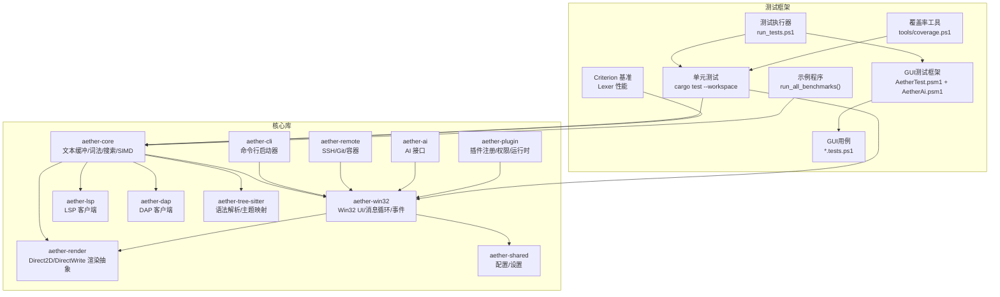
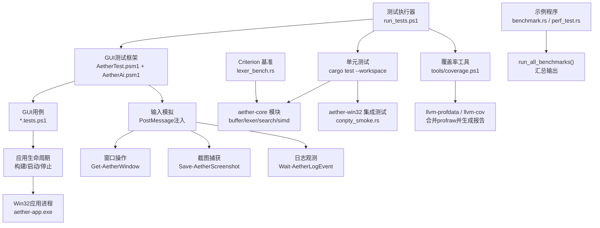
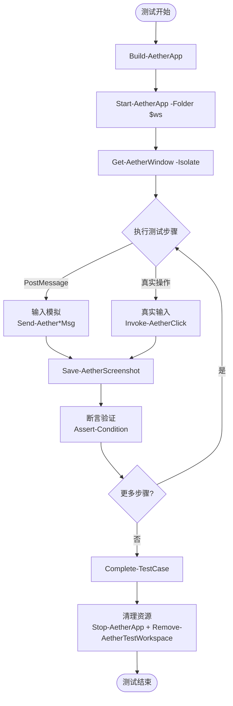
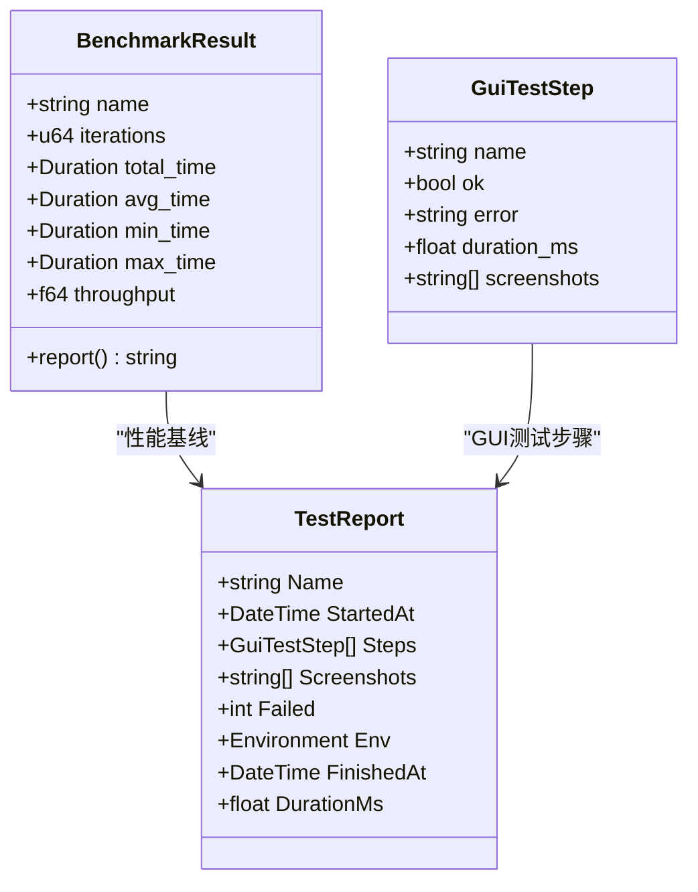
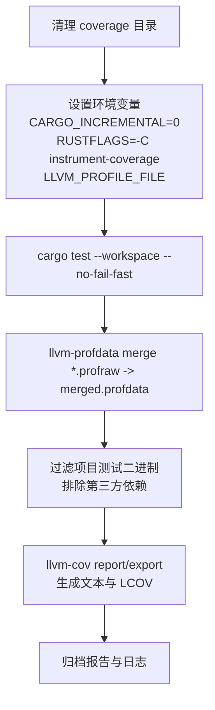
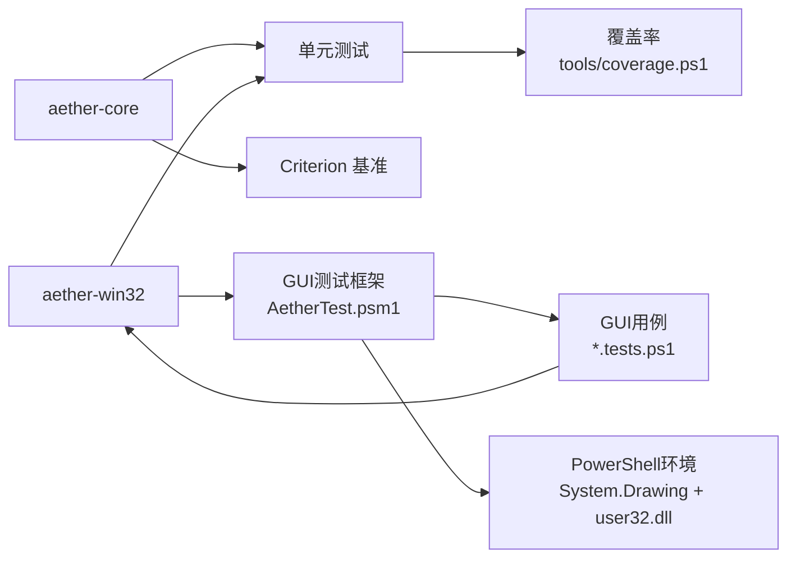

# 测试策略

<cite>
**本文引用的文件**   
- [README.md](file://README.md)
- [TEST_WORKFLOW.md](file://TEST_WORKFLOW.md)
- [tests/framework/AetherTest.psm1](file://tests/framework/AetherTest.psm1)
- [tests/framework/AetherAi.psm1](file://tests/framework/AetherAi.psm1)
- [tests/run_tests.ps1](file://tests/run_tests.ps1)
- [tests/cases/_template.tests.ps1](file://tests/cases/_template.tests.ps1)
- [tests/cases/explorer_inline_input.tests.ps1](file://tests/cases/explorer_inline_input.tests.ps1)
- [tests/ai/AI_TESTING.md](file://tests/ai/AI_TESTING.md)
- [tests/tools/coverage.ps1](file://tests/tools/coverage.ps1)
- [crates/aether-core/src/lib.rs](file://crates/aether-core/src/lib.rs)
- [crates/aether-core/benches/lexer_bench.rs](file://crates/aether-core/benches/lexer_bench.rs)
- [crates/aether-core/examples/benchmark.rs](file://crates/aether-core/examples/benchmark.rs)
- [crates/aether-core/examples/perf_test.rs](file://crates/aether-core/examples/perf_test.rs)
- [crates/aether-win32/tests/conpty_smoke.rs](file://crates/aether-win32/tests/conpty_smoke.rs)
</cite>

## 更新摘要
**变更内容**   
- 新增基于PowerShell的综合测试框架（AetherTest.psm1），提供完整的GUI自动化能力
- 新增AI协作测试层（AetherAi.psm1），支持智能操作、诊断包生成和动作脚本DSL
- 重构测试执行入口（run_tests.ps1），统一单元测试、GUI测试和覆盖率收集
- 新增结构化测试用例模板和示例，支持PostMessage注入的可靠GUI自动化
- 整合覆盖率工具为单一脚本（tools/coverage.ps1）

## 目录
1. [引言](#引言)
2. [项目结构](#项目结构)
3. [核心组件](#核心组件)
4. [架构总览](#架构总览)
5. [详细组件分析](#详细组件分析)
6. [依赖分析](#依赖分析)
7. [性能考虑](#性能考虑)
8. [故障排查指南](#故障排查指南)
9. [结论](#结论)
10. [附录](#附录)

## 引言
本测试策略面向牧羊人编辑器（Aether Studio），覆盖单元测试、GUI 冒烟测试、性能基准与覆盖率报告，以及 CI/CD 自动化流程。目标是建立可重复、可度量、可持续的质量保障体系，确保在 Windows 原生 UI 与高性能编辑内核的复杂场景下，持续交付稳定版本。

**更新** 新增了基于PowerShell的综合测试框架，提供可靠的GUI自动化能力，通过PostMessage注入避免前台锁定问题，支持智能操作和AI协作测试。

## 项目结构
仓库采用 Cargo Workspace 组织，按职责拆分为多个 Crate。测试相关资源主要分布在：
- crates/*/src 下的模块与示例
- crates/*/benches 下的 Criterion 基准
- tests 目录下的 PowerShell GUI 测试框架与覆盖率脚本
- README 中提供的运行命令与质量指标

**图表来源**
- [tests/framework/AetherTest.psm1:1-828](file://tests/framework/AetherTest.psm1#L1-L828)
- [tests/framework/AetherAi.psm1:1-408](file://tests/framework/AetherAi.psm1#L1-L408)
- [tests/run_tests.ps1:1-91](file://tests/run_tests.ps1#L1-L91)

章节来源
- [tests/framework/AetherTest.psm1:1-828](file://tests/framework/AetherTest.psm1#L1-L828)
- [tests/framework/AetherAi.psm1:1-408](file://tests/framework/AetherAi.psm1#L1-L408)
- [tests/run_tests.ps1:1-91](file://tests/run_tests.ps1#L1-L91)

## 核心组件
- **综合测试框架**
  - AetherTest.psm1：提供应用生命周期管理、窗口操作、输入模拟（真实鼠标+PostMessage注入）、截图捕获、临时工作区、日志观测、断言和报告功能
  - AetherAi.psm1：AI协作层，支持智能操作、诊断包生成、动作脚本DSL、像素断言和UI状态快照
- **GUI自动化**
  - 基于PostMessage注入的可靠输入方式，不受前台锁定和窗口遮挡影响
  - 支持鼠标点击、双击、滚轮、拖拽等完整交互
  - 键盘输入通过WM_CHAR注入，不依赖前台焦点
  - 组合键支持Ctrl/Shift/Alt修饰符
- **测试执行**
  - run_tests.ps1统一入口，支持unit/gui/ai/coverage/all套件
  - 结构化用例模板，支持元数据标注和AI生成
  - JSON格式报告，包含步骤耗时、截图路径和环境信息
- **性能基准**
  - 使用Criterion对Lexer进行吞吐基准
  - 提供run_all_benchmarks示例统一输出结果
- **覆盖率**
  - tools/coverage.ps1一体化脚本，合并插桩测试和报告生成

章节来源
- [tests/framework/AetherTest.psm1:1-828](file://tests/framework/AetherTest.psm1#L1-L828)
- [tests/framework/AetherAi.psm1:1-408](file://tests/framework/AetherAi.psm1#L1-L408)
- [tests/run_tests.ps1:1-91](file://tests/run_tests.ps1#L1-L91)
- [tests/tools/coverage.ps1:1-64](file://tests/tools/coverage.ps1#L1-L64)

## 架构总览
下图展示新的PowerShell测试框架与核心模块的交互关系：测试执行器协调单元测试和GUI测试；GUI框架通过PostMessage注入与Win32应用通信；覆盖率工具围绕测试二进制生成报告。

**图表来源**
- [tests/run_tests.ps1:1-91](file://tests/run_tests.ps1#L1-L91)
- [tests/framework/AetherTest.psm1:1-828](file://tests/framework/AetherTest.psm1#L1-L828)
- [tests/framework/AetherAi.psm1:1-408](file://tests/framework/AetherAi.psm1#L1-L408)
- [tests/tools/coverage.ps1:1-64](file://tests/tools/coverage.ps1#L1-L64)

## 详细组件分析

### 综合测试框架架构
**更新** 新增基于PowerShell的综合测试框架，提供完整的GUI自动化能力。

#### AetherTest.psm1 核心功能
- **应用生命周期管理**：Build-AetherApp、Start-AetherApp、Stop-AetherApp
- **窗口操作**：Get-AetherWindow、Resize-AetherWindow、Move-AetherWindow、Set-AetherWindowState、Close-AetherWindow
- **输入模拟**：
  - PostMessage注入：Send-AetherClickMsg、Send-AetherTextMsg、Send-AetherKeyMsg、Send-AetherHotkey
  - 真实鼠标：Invoke-AetherClick（需要前台焦点）
  - 高级交互：Send-AetherDoubleClickMsg、Send-AetherMouseWheel、Send-AetherDrag
- **截图捕获**：Save-AetherScreenshot，保存到tests/screenshots/<case>/目录
- **日志观测**：Get-AetherLog、Wait-AetherLogEvent，支持正则匹配和超时等待
- **断言与报告**：Assert-Condition、Complete-TestCase，生成JSON格式报告

#### AetherAi.psm1 AI协作层
- **动作脚本DSL**：Invoke-AetherActionScript，支持click/dblclick/mousewheel/drag/keys/key/hotkey/wait/shot/expect等动作
- **智能操作**：Find-AetherHitRegion、Invoke-AetherSmartClick、Wait-AetherHitRegion
- **诊断包生成**：New-AetherDiagBundle，打包失败诊断材料（截图+日志+hit regions+进程状态）
- **UI状态快照**：Get-AetherUiState、Get-AetherEditorState，供AI分析决策

**图表来源**
- [tests/framework/AetherTest.psm1:114-181](file://tests/framework/AetherTest.psm1#L114-L181)
- [tests/framework/AetherTest.psm1:232-404](file://tests/framework/AetherTest.psm1#L232-L404)
- [tests/framework/AetherTest.psm1:605-627](file://tests/framework/AetherTest.psm1#L605-L627)
- [tests/framework/AetherTest.psm1:735-800](file://tests/framework/AetherTest.psm1#L735-L800)

章节来源
- [tests/framework/AetherTest.psm1:1-828](file://tests/framework/AetherTest.psm1#L1-L828)
- [tests/framework/AetherAi.psm1:1-408](file://tests/framework/AetherAi.psm1#L1-L408)

### GUI冒烟测试实现原理
**更新** 从Python方案迁移到PowerShell框架，提供更可靠的GUI自动化。

#### 核心特性
- **PostMessage注入**：通过Windows API直接发送消息，不受前台锁定影响
- **坐标系统**：物理坐标 = 名义值 × Scale²，自动处理DPI缩放
- **智能定位**：基于hit regions的语义化操作，无需硬编码坐标
- **异步等待**：Wait-AetherLogEvent等待异步操作完成
- **诊断包**：失败时自动生成诊断材料，便于问题分析

#### 输入方式对比
| 方式 | 函数 | 适用场景 | 可靠性 |
|------|------|----------|--------|
| PostMessage点击 | Send-AetherClickMsg | 首选，不受前台锁定影响 | ⭐⭐⭐⭐⭐ |
| PostMessage文本 | Send-AetherTextMsg | 文本输入，逐字符注入 | ⭐⭐⭐⭐⭐ |
| PostMessage按键 | Send-AetherKeyMsg | 单键操作，{ENTER}/{ESC}等 | ⭐⭐⭐⭐⭐ |
| PostMessage组合键 | Send-AetherHotkey | Ctrl+S/Ctrl+Shift+P等 | ⭐⭐⭐⭐⭐ |
| 真实鼠标 | Invoke-AetherClick | 需要系统级行为 | ⭐⭐⭐ |
| SendKeys | Send-AetherKeys | 仅当需要系统级焦点行为 | ⭐⭐ |

章节来源
- [tests/framework/AetherTest.psm1:232-404](file://tests/framework/AetherTest.psm1#L232-L404)
- [tests/ai/AI_TESTING.md:57-129](file://tests/ai/AI_TESTING.md#L57-L129)

### 性能基准测试方法
**更新** 保持原有的Criterion基准测试，同时新增GUI测试性能监控。

#### Lexer性能基准（Criterion）
- 输入样本：Rust/JS/Python/C各约2–3KB代码片段
- 指标：Bytes/s吞吐量，按语言与样本长度分组
- 用法：criterion_group/criterion_main定义基准组，black_box防止编译器优化

#### GUI测试性能监控
- 步骤耗时记录：每个Invoke-TestStep自动记录duration_ms
- 应用性能采样：Get-AetherUiState获取CPU和内存使用情况
- 异步操作等待：Wait-AetherLogEvent避免忙等待的性能浪费

**图表来源**
- [crates/aether-core/src/benchmarks.rs:11-53](file://crates/aether-core/src/benchmarks.rs#L11-L53)
- [tests/reports/explorer_inline_input.json:1-54](file://tests/reports/explorer_inline_input.json#L1-L54)

章节来源
- [crates/aether-core/benches/lexer_bench.rs:1-162](file://crates/aether-core/benches/lexer_bench.rs#L1-L162)
- [crates/aether-core/src/benchmarks.rs:1-443](file://crates/aether-core/src/benchmarks.rs#L1-L443)
- [tests/reports/explorer_inline_input.json:1-54](file://tests/reports/explorer_inline_input.json#L1-L54)

### 覆盖率报告生成与分析
**更新** 整合为统一的tools/coverage.ps1脚本，简化覆盖率工作流程。

#### 一体化覆盖率工具
- **阶段1**：插桩测试，设置RUSTFLAGS和LLVM_PROFILE_FILE环境变量
- **阶段2**：合并profraw文件，生成merged.profdata
- **阶段3**：过滤项目测试二进制，生成文本和LCOV报告
- **错误处理**：检查llvm-tools组件是否安装，处理缺失的profraw文件

#### 指标解读与改进建议
- Regions/Lines/Functions覆盖率反映不同粒度的覆盖情况
- 优先提升核心模块（buffer/lexer/incremental_lexer/simd）的测试覆盖
- 将GUI渲染与系统交互代码通过抽象与桩替换，提高可测性
- 定期回归对比覆盖率趋势，关注热点路径与回归点

**图表来源**
- [tests/tools/coverage.ps1:16-64](file://tests/tools/coverage.ps1#L16-L64)

章节来源
- [tests/tools/coverage.ps1:1-64](file://tests/tools/coverage.ps1#L1-L64)

### 测试自动化流程与CI/CD集成
**更新** 新增统一的测试执行入口，支持多种测试套件。

#### 本地快速验证
- **全工作区测试**：`pwsh -File tests\run_tests.ps1 -Suite unit`
- **GUI测试**：`pwsh -File tests\run_tests.ps1 -Suite gui`
- **AI框架自检**：`pwsh -File tests\run_tests.ps1 -Suite ai`
- **覆盖率**：`pwsh -File tests\run_tests.ps1 -Suite coverage`
- **全部测试**：`pwsh -File tests\run_tests.ps1 -Suite all`

#### CI/CD建议
- 在PR触发流水线中并行执行：单元测试、GUI测试、覆盖率
- 缓存依赖与构建产物，缩短反馈时间
- 将覆盖率阈值作为门禁（例如Lines ≥ 40%，Functions ≥ 60%）
- 归档截图与报告，便于人工复核与历史回溯
- 支持指定用例运行：`-Case explorer_inline_input`

章节来源
- [tests/run_tests.ps1:1-91](file://tests/run_tests.ps1#L1-L91)
- [tests/ai/AI_TESTING.md:255-263](file://tests/ai/AI_TESTING.md#L255-L263)

## 依赖分析
**更新** 新增PowerShell测试框架依赖关系。

### 组件耦合与内聚
- aether-core高内聚：文本缓冲、词法、搜索、SIMD与基准集中在同一crate
- GUI框架解耦：PowerShell脚本通过外部进程与UI自动化访问，不侵入生产代码
- 分层架构：AetherTest.psm1提供基础能力，AetherAi.psm1提供AI协作增强

### 外部依赖
- **PowerShell生态**：System.Drawing用于截图，WScript.Shell用于SendKeys
- **Windows API**：user32.dll用于窗口操作和消息注入
- **Rust生态**：Criterion用于基准，llvm-cov用于覆盖率
- **Python生态**：legacy目录下保留旧版Python脚本作为存档

### 潜在循环依赖
- 当前结构未见明显循环
- GUI框架通过PostMessage与应用程序通信，无直接代码依赖
- 若引入更多跨crate测试夹具，建议使用特征或共享测试crate隔离

**图表来源**
- [tests/framework/AetherTest.psm1:34-92](file://tests/framework/AetherTest.psm1#L34-L92)
- [tests/framework/AetherAi.psm1:1-408](file://tests/framework/AetherAi.psm1#L1-L408)
- [tests/run_tests.ps1:1-91](file://tests/run_tests.ps1#L1-L91)

章节来源
- [tests/framework/AetherTest.psm1:1-828](file://tests/framework/AetherTest.psm1#L1-L828)
- [tests/framework/AetherAi.psm1:1-408](file://tests/framework/AetherAi.psm1#L1-L408)
- [tests/run_tests.ps1:1-91](file://tests/run_tests.ps1#L1-L91)

## 性能考虑
**更新** 新增GUI测试性能监控和优化建议。

### 基准稳定性
- 预热与最大时间限制避免冷启动与极端波动影响
- 黑盒输入防止编译器优化
- GUI测试中使用Wait-AetherLogEvent替代忙等待

### 内存与吞吐
- PieceTable大文件加载与多次编辑吞吐应纳入回归基线
- 增量Lexer对比全量分析，确保显著加速
- GUI测试步骤耗时记录，便于性能回归检测

### GUI性能优化
- PostMessage注入比真实鼠标操作更快更可靠
- 合理设置延迟参数，避免过度等待
- 使用Isolate模式避免窗口重叠导致的重绘开销

## 故障排查指南
**更新** 新增PowerShell测试框架相关的故障排查。

### GUI测试失败
- 确认debug构建产物存在（hit regions仅在debug构建可用）
- 检查工作区信任列表：`$env:APPDATA\Aether\trusted_folders.txt`
- 查看截图与JSON报告定位失败步骤
- 使用New-AetherDiagBundle生成诊断包

### ConPTY测试不稳定
- 确保串行执行，避免并发创建伪控制台互相干扰
- 检查COMSPEC路径，增加读取超时
- 核对ANSI控制序列差异

### 覆盖率缺失
- 确认llvm-tools-preview已安装：`rustup component add llvm-tools`
- 检查.profraw文件是否生成
- 核对忽略正则是否误过滤项目源码

### PowerShell环境问题
- 确认PowerShell 7+版本
- 检查System.Drawing模块可用性
- 验证user32.dll调用权限

章节来源
- [tests/framework/AetherTest.psm1:123-172](file://tests/framework/AetherTest.psm1#L123-L172)
- [tests/framework/AetherAi.psm1:261-332](file://tests/framework/AetherAi.psm1#L261-L332)
- [tests/ai/AI_TESTING.md:225-254](file://tests/ai/AI_TESTING.md#L225-L254)

## 结论
本测试策略以“核心逻辑强覆盖 + GUI冒烟保体验 + 基准与覆盖率促演进”为主线，形成闭环质量保障。**更新** 新增的PowerShell综合测试框架提供了可靠的GUI自动化能力，通过PostMessage注入解决了前台锁定问题，支持智能操作和AI协作测试。建议在后续迭代中持续提升核心模块覆盖率、完善GUI自动化用例集，并将性能基线与覆盖率阈值纳入CI门禁，确保长期稳定与高效交付。

## 附录
### 常用命令速查
**更新** 新增PowerShell测试框架命令。

#### 单元测试
- 全工作区测试：`cargo test --workspace --no-fail-fast`
- 静态检查：`cargo clippy --workspace --all-targets -- -D warnings`

#### GUI测试
- 全部GUI用例：`pwsh -File tests\run_tests.ps1 -Suite gui`
- 指定用例：`pwsh -File tests\run_tests.ps1 -Suite gui -Case explorer_inline_input`
- 跳过构建：`pwsh -File tests\run_tests.ps1 -Suite gui -SkipBuild`

#### AI框架自检
- 环境验证：`pwsh -File tests\run_tests.ps1 -Suite ai`

#### 覆盖率
- 一体化覆盖率：`pwsh -File tests\run_tests.ps1 -Suite coverage`
- 仅生成报告：`pwsh -File tests\tools/coverage.ps1 -ReportOnly`

#### 全部测试
- 完整套件：`pwsh -File tests\run_tests.ps1 -Suite all`

章节来源
- [tests/run_tests.ps1:1-91](file://tests/run_tests.ps1#L1-L91)
- [tests/ai/AI_TESTING.md:255-263](file://tests/ai/AI_TESTING.md#L255-L263)
- [tests/tools/coverage.ps1:1-64](file://tests/tools/coverage.ps1#L1-L64)