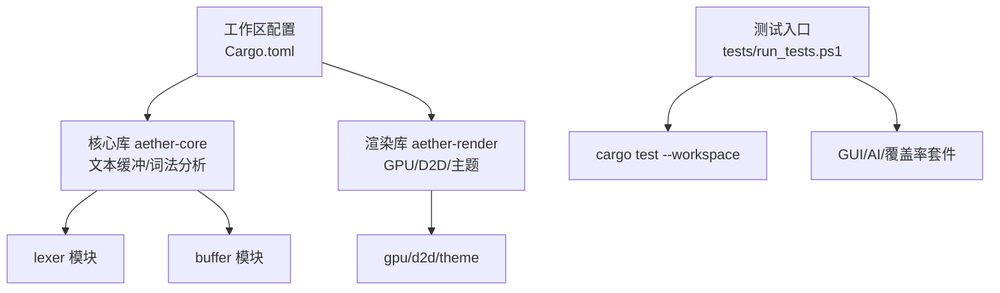
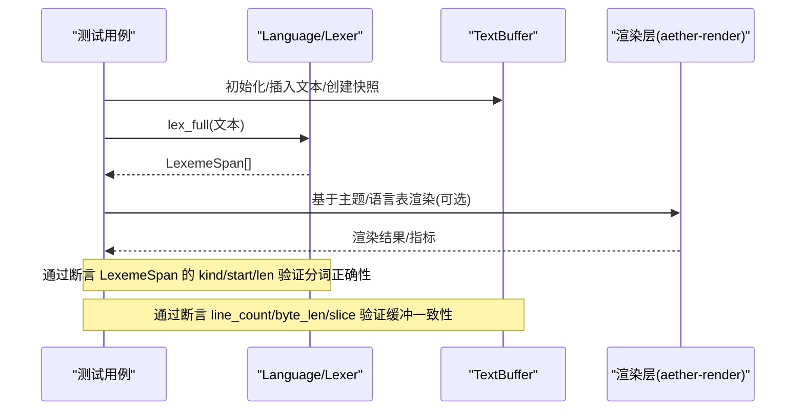
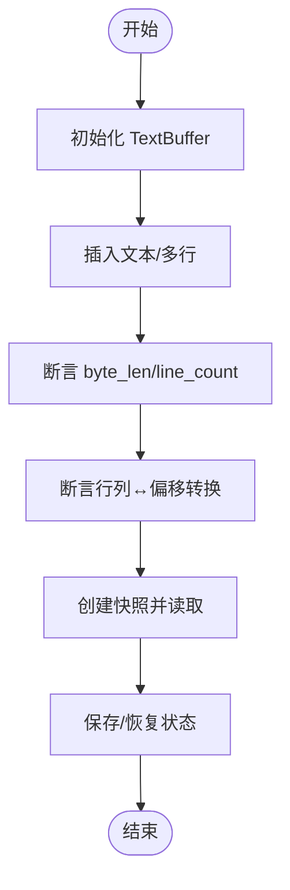
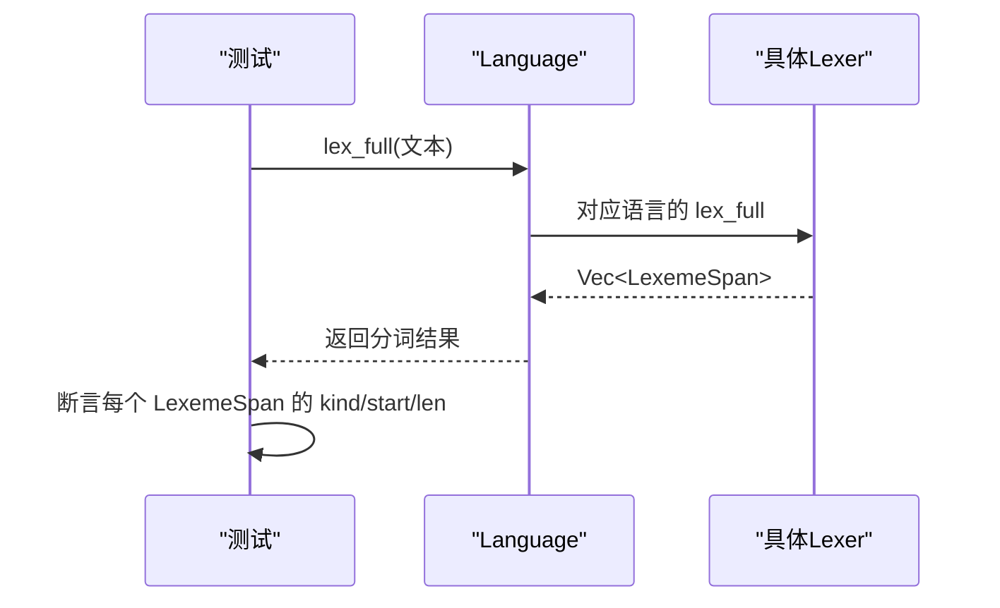
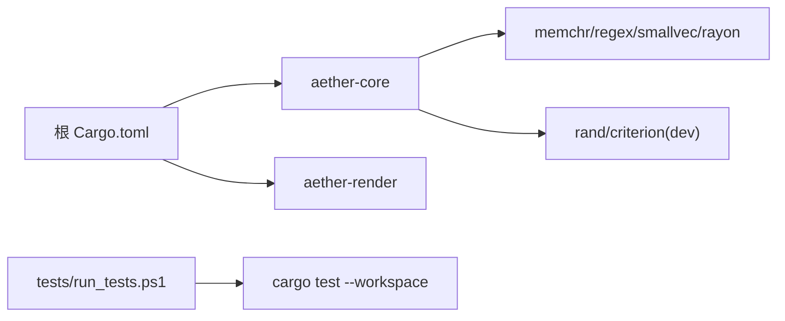

# 单元测试

<cite>
**本文引用的文件**
- [Cargo.toml](file://Cargo.toml)
- [aether-core/Cargo.toml](file://crates/aether-core/Cargo.toml)
- [run_tests.ps1](file://tests/run_tests.ps1)
- [lexer/mod.rs](file://crates/aether-core/src/lexer/mod.rs)
- [buffer/text_buffer.rs](file://crates/aether-core/src/buffer/text_buffer.rs)
- [buffer/mod.rs](file://crates/aether-core/src/buffer/mod.rs)
- [render/lib.rs](file://crates/aether-render/src/lib.rs)
</cite>

## 目录
1. [简介](#简介)
2. [项目结构](#项目结构)
3. [核心组件](#核心组件)
4. [架构总览](#架构总览)
5. [详细组件分析](#详细组件分析)
6. [依赖分析](#依赖分析)
7. [性能考虑](#性能考虑)
8. [故障排查指南](#故障排查指南)
9. [结论](#结论)
10. [附录](#附录)

## 简介
本文件面向 Rust crate 级别的单元测试，系统化说明测试框架设计、编写规范、数据准备与断言方法，并覆盖文本缓冲、词法分析器、渲染引擎等核心模块的测试策略。文档同时给出模拟对象使用方式（外部依赖隔离与状态验证）、最佳实践（命名约定、用例组织、性能考量）以及调试技巧与常见问题解决方案，帮助读者为编辑器功能编写高质量、可维护的单元测试。

## 项目结构
工作区由多个 crate 组成，测试入口统一通过 PowerShell 脚本调度：
- 工作区定义与版本信息位于根 Cargo.toml。
- aether-core 提供文本缓冲与词法分析能力，包含基准与 dev-dependencies。
- aether-render 暴露渲染相关模块，供上层 UI 与平台渲染使用。
- tests/run_tests.ps1 提供统一的测试执行入口，支持 unit/gui/ai/coverage/all 套件。

图表来源
- [Cargo.toml:1-19](file://Cargo.toml#L1-L19)
- [run_tests.ps1:35-45](file://tests/run_tests.ps1#L35-L45)

章节来源
- [Cargo.toml:1-37](file://Cargo.toml#L1-L37)
- [aether-core/Cargo.toml:1-22](file://crates/aether-core/Cargo.toml#L1-L22)
- [run_tests.ps1:1-91](file://tests/run_tests.ps1#L1-L91)

## 核心组件
- 文本缓冲（TextBuffer/Snapshot/State）：抽象编辑操作、行号/列号转换、不可变快照与 Undo/Redo 状态保存恢复。
- 词法分析器（Lexer/Language/TokenKind/LexemeSpan）：跨语言统一 Token 类型与单行全量分析接口，按扩展名/路径选择具体 Lexer。
- 渲染库（aether-render）：对外暴露 GPU/D2D/主题等子模块，便于上层 UI 与平台渲染集成。

章节来源
- [buffer/text_buffer.rs:1-200](file://crates/aether-core/src/buffer/text_buffer.rs#L1-L200)
- [buffer/mod.rs:1-9](file://crates/aether-core/src/buffer/mod.rs#L1-L9)
- [lexer/mod.rs:1-208](file://crates/aether-core/src/lexer/mod.rs#L1-L208)
- [render/lib.rs:1-5](file://crates/aether-render/src/lib.rs#L1-L5)

## 架构总览
下图展示“输入文本 → 词法分析 → 渲染”的核心链路，以及测试如何介入各阶段进行断言与隔离。

图表来源
- [lexer/mod.rs:159-195](file://crates/aether-core/src/lexer/mod.rs#L159-L195)
- [lexer/mod.rs:245-305](file://crates/aether-core/src/lexer/mod.rs#L245-L305)
- [buffer/text_buffer.rs:1-59](file://crates/aether-core/src/buffer/text_buffer.rs#L1-L59)
- [render/lib.rs:1-5](file://crates/aether-render/src/lib.rs#L1-L5)

## 详细组件分析

### 文本缓冲测试策略
- 目标：验证插入/删除/切片/行号转换/多光标/快照/Undo-Redo 的正确性与边界条件。
- 数据准备：
  - 构造空缓冲与含换行的多行文本，覆盖 UTF-8 多字节字符。
  - 构造极端场景：超长行、大量换行、重复字符、首尾空白。
- 断言方法：
  - 行级：line_count、line_text(line_idx)、line_byte_range。
  - 偏移级：byte_len、slice(start,end)、line_col_to_byte、byte_to_line_col。
  - 状态级：save_state/restore_state 前后一致；EditResult 合并后的受影响行范围合理。
- 并发与快照：
  - 使用 create_snapshot 在后台线程读取，断言 snapshot 与主缓冲内容一致且不阻塞写操作。
- 示例流程（以函数调用顺序示意）：

章节来源
- [buffer/text_buffer.rs:1-200](file://crates/aether-core/src/buffer/text_buffer.rs#L1-L200)
- [buffer/mod.rs:1-9](file://crates/aether-core/src/buffer/mod.rs#L1-L9)

### 词法分析器测试策略
- 目标：验证不同语言的 token 分类、跨度计算、UTF-8 安全前进与空输入处理。
- 数据准备：
  - 每种语言的最小可解析片段（关键字、标识符、字符串、注释、数字、分隔符）。
  - 混合语法片段与边界情况（引号未闭合、非法 UTF-8 首字节）。
- 断言方法：
  - 对 lex_full 返回的 LexemeSpan 数组，校验 start/len/kind 是否符合预期。
  - Language::from_extension/from_path 映射到正确语言。
  - PlainTextLexer 对空串返回空数组，非空串返回单一 Unknown token。
- 静态分发优化：
  - 使用 Language::lex_full 直接按 match 分发，避免 Box 分配与动态分发开销，测试中应覆盖该路径。

图表来源
- [lexer/mod.rs:159-195](file://crates/aether-core/src/lexer/mod.rs#L159-L195)
- [lexer/mod.rs:245-305](file://crates/aether-core/src/lexer/mod.rs#L245-L305)

章节来源
- [lexer/mod.rs:1-208](file://crates/aether-core/src/lexer/mod.rs#L1-L208)
- [lexer/mod.rs:245-305](file://crates/aether-core/src/lexer/mod.rs#L245-L305)

### 渲染引擎测试策略
- 目标：确保主题加载、GPU/D2D 资源初始化与渲染管线在测试环境下可被隔离与验证。
- 数据准备：
  - 最小化主题配置与语言高亮表（如适用），避免真实 GPU 设备依赖。
  - 使用 mock 或 stub 替代系统级资源（如 D2D/GPU 上下文），仅验证逻辑分支。
- 断言方法：
  - 验证主题解析结果、颜色/字体映射是否正确。
  - 验证渲染前预处理（如布局/视口）输出符合预期。
- 注意：
  - 若涉及真实 GPU/D2D 调用，应在 CI 或本地启用相应环境；否则用桩替换并断言行为。

章节来源
- [render/lib.rs:1-5](file://crates/aether-render/src/lib.rs#L1-L5)

### 模拟对象与外部依赖隔离
- 原则：
  - 将外部依赖（文件系统、网络、GPU/D2D、LSP/调试器）抽象为 trait 或接口，测试中注入实现。
  - 使用内存数据结构替代持久化存储，保证测试幂等与快速。
- 常见模式：
  - 文件访问：用内存映射或内存集合模拟文件树与内容。
  - 网络请求：拦截并返回固定响应，验证重试/超时/错误分支。
  - 渲染后端：提供无头/离屏实现，仅断言中间结果。
- 状态验证：
  - 记录关键状态变化（如缓冲区状态、词法结果、渲染参数），断言其时序与最终一致性。

[本节为通用指导，不直接分析具体文件]

### 测试编写最佳实践
- 命名约定：
  - 测试函数以 test_ 开头，描述被测行为（如 test_language_from_extension）。
  - 组合测试使用 test_xxx_when_yyy_then_zzz 表达前置与期望。
- 用例组织：
  - 按模块划分 #[cfg(test)] mod tests，保持内聚与可定位。
  - 共享夹具放在模块内私有函数或独立 fixture 模块。
- 数据准备：
  - 小且明确的输入，覆盖典型、边界与异常三类。
  - 使用随机生成器时固定种子以保证可重现性。
- 断言方法：
  - 优先断言可观察的外部状态（返回值、副作用、日志条目）。
  - 对复杂结构使用结构化断言（如逐项比较 LexemeSpan）。
- 性能考虑：
  - 单元测试聚焦正确性；基准测试放入 benches，使用 criterion 生成报告。
  - 避免在单元测试中进行 I/O 或网络调用。

[本节为通用指导，不直接分析具体文件]

### 代码示例：为编辑器功能编写有效单元测试
以下以“文本缓冲 + 词法分析”的组合场景为例，展示端到端测试的组织思路（不含具体代码）：
- 步骤：
  - 初始化 TextBuffer，插入一段包含关键字、字符串、注释的代码片段。
  - 调用 Language::lex_full 获取 LexemeSpan 列表。
  - 断言：
    - 行号与字节长度一致。
    - 关键字/字符串/注释的 TokenKind 正确。
    - 每个 token 的 start/len 拼接后等于原输入。
  - 创建快照并在后台线程读取，断言内容与主缓冲一致。
  - 执行一次编辑（插入/删除），断言 EditResult 的受影响行范围合理。
- 参考路径：
  - 文本缓冲 API 与状态：[text_buffer.rs:1-200](file://crates/aether-core/src/buffer/text_buffer.rs#L1-L200)
  - 词法接口与测试：[lexer/mod.rs:159-195](file://crates/aether-core/src/lexer/mod.rs#L159-L195), [lexer/mod.rs:245-305](file://crates/aether-core/src/lexer/mod.rs#L245-L305)

章节来源
- [buffer/text_buffer.rs:1-200](file://crates/aether-core/src/buffer/text_buffer.rs#L1-L200)
- [lexer/mod.rs:159-195](file://crates/aether-core/src/lexer/mod.rs#L159-L195)
- [lexer/mod.rs:245-305](file://crates/aether-core/src/lexer/mod.rs#L245-L305)

## 依赖分析
- 工作区成员与版本由根 Cargo.toml 管理，统一 edition/rust-version/profile。
- aether-core 引入 memchr/regex/smallvec/rayon 等用于高性能文本处理与并行；dev-dependencies 包含 rand/criterion 用于测试与基准。
- 测试入口通过 run_tests.ps1 调用 cargo test --workspace，集中输出与失败统计。

图表来源
- [Cargo.toml:1-37](file://Cargo.toml#L1-L37)
- [aether-core/Cargo.toml:1-22](file://crates/aether-core/Cargo.toml#L1-L22)
- [run_tests.ps1:35-45](file://tests/run_tests.ps1#L35-L45)

章节来源
- [Cargo.toml:1-37](file://Cargo.toml#L1-L37)
- [aether-core/Cargo.toml:1-22](file://crates/aether-core/Cargo.toml#L1-L22)
- [run_tests.ps1:1-91](file://tests/run_tests.ps1#L1-L91)

## 性能考虑
- 单元测试应避免 I/O 与网络，尽量使用内存结构与确定性输入。
- 对热点路径（如 lex_full、行号转换）使用基准测试（benches）评估，结合 criterion HTML 报告定位瓶颈。
- 利用 Language::lex_full 的静态分发减少运行时开销；测试中应覆盖该路径以确保优化未被破坏。
- 大文本测试建议使用分段/增量策略，避免单次分配过大导致 OOM。

[本节为通用指导，不直接分析具体文件]

## 故障排查指南
- 测试无法运行：
  - 检查 PowerShell 执行策略与工作区路径；确认 run_tests.ps1 能定位到项目根。
  - 清理增量编译：设置 CARGO_INCREMENTAL=0 后重试。
- 单元测试失败：
  - 查看 tests/reports/cargo_test.log 中的过滤输出，定位 FAILED/panicked 行。
  - 针对 lexer/buffer 的断言失败，缩小输入至最小复现用例，逐步添加断言。
- GUI/AI 测试问题：
  - 先运行 AI 自检（ai/selfcheck.ps1）确认环境与依赖就绪。
  - 截图与诊断包有助于定位 UI 坐标/渲染差异。
- 覆盖率报告：
  - 使用 tools/coverage.ps1 生成 llvm-cov 报告，关注未覆盖分支与热点路径。

章节来源
- [run_tests.ps1:35-45](file://tests/run_tests.ps1#L35-L45)
- [run_tests.ps1:70-83](file://tests/run_tests.ps1#L70-L83)

## 结论
本项目采用清晰的 crate 分层与统一的测试入口，围绕文本缓冲与词法分析构建了完善的单元测试基础。通过模块化测试策略、模拟对象隔离与基准测试配合，既能保障功能正确性，又能持续优化性能。建议在新功能开发中遵循本文的最佳实践，持续完善用例覆盖与回归测试。

## 附录
- 常用命令
  - 运行全部单元测试：pwsh -File tests/run_tests.ps1 -Suite unit
  - 仅运行指定 GUI 用例：pwsh -File tests/run_tests.ps1 -Suite gui -Case explorer_inline_input
  - 运行 AI 自检：pwsh -File tests/run_tests.ps1 -Suite ai
  - 生成覆盖率报告：pwsh -File tests/run_tests.ps1 -Suite coverage
  - 运行全部套件：pwsh -File tests/run_tests.ps1 -Suite all

[本节为通用指导，不直接分析具体文件]