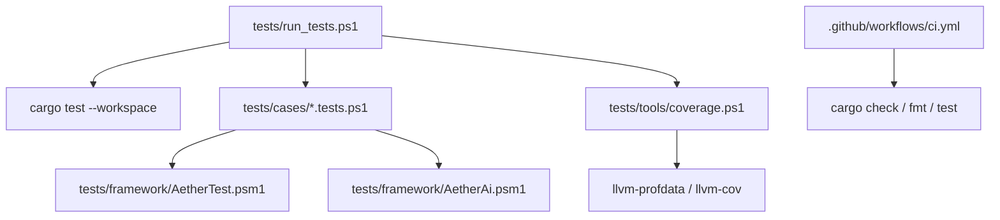
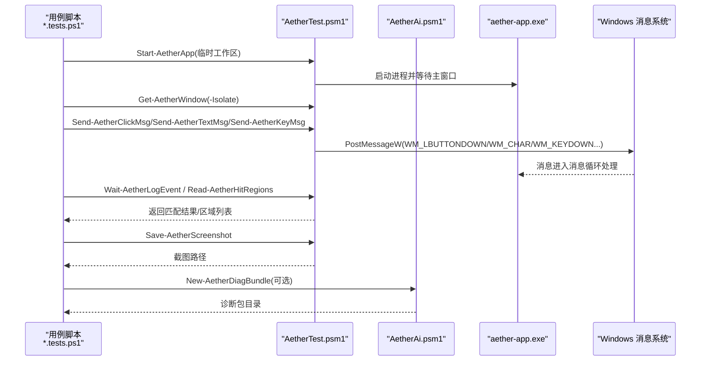
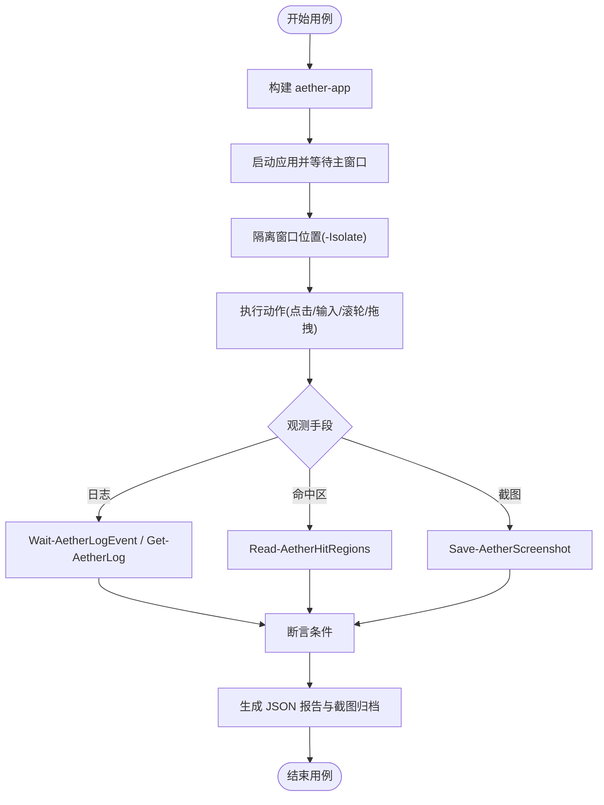
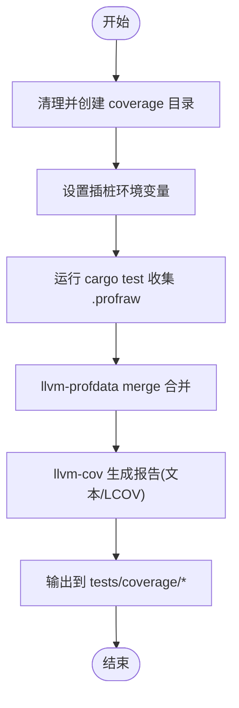
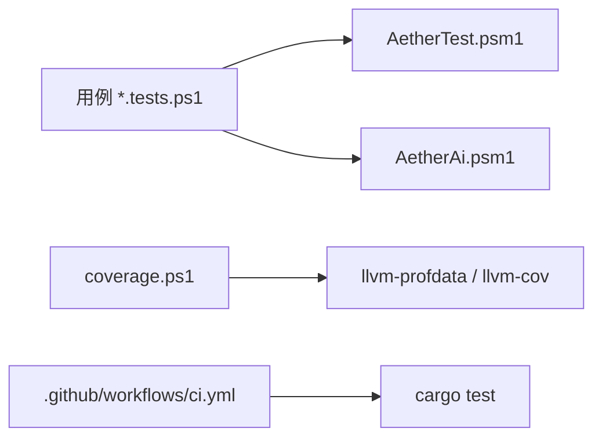

# 测试策略

<cite>
**本文引用的文件**
- [README.md](file://README.md)
- [Cargo.toml](file://Cargo.toml)
- [tests/run_tests.ps1](file://tests/run_tests.ps1)
- [tests/tools/coverage.ps1](file://tests/tools/coverage.ps1)
- [tests/framework/AetherTest.psm1](file://tests/framework/AetherTest.psm1)
- [tests/framework/AetherAi.psm1](file://tests/framework/AetherAi.psm1)
- [tests/cases/_template.tests.ps1](file://tests/cases/_template.tests.ps1)
- [tests/cases/default_mode_toggle.tests.ps1](file://tests/cases/default_mode_toggle.tests.ps1)
- [tests/ai/AI_TESTING.md](file://tests/ai/AI_TESTING.md)
- [.github/workflows/ci.yml](file://.github/workflows/ci.yml)
</cite>

## 目录
1. [简介](#简介)
2. [项目结构](#项目结构)
3. [核心组件](#核心组件)
4. [架构总览](#架构总览)
5. [详细组件分析](#详细组件分析)
6. [依赖关系分析](#依赖关系分析)
7. [性能与覆盖率](#性能与覆盖率)
8. [故障排查指南](#故障排查指南)
9. [结论](#结论)
10. [附录：最佳实践与示例](#附录：最佳实践与示例)

## 简介
本文件为 Aether Studio（牧羊人编辑器）的测试策略文档，覆盖单元测试、GUI/端到端测试、性能测试、自动化流程（CI/CD）、测试数据与环境隔离、覆盖率统计、调试与问题定位、以及面向开发者的质量保障方法。目标是帮助开发者以可维护、可观测、可回归的方式持续保证产品质量。

## 项目结构
仓库采用 Cargo Workspace 组织多 crate，测试体系由“统一入口脚本 + GUI 测试框架 + 覆盖率工具 + CI”构成：
- 统一入口：tests/run_tests.ps1，支持 unit/gui/ai/coverage/all 等套件
- GUI 测试框架：tests/framework/AetherTest.psm1（应用生命周期、窗口/输入/截图/日志/hit regions/断言/报告），tests/framework/AetherAi.psm1（诊断包、动作脚本 DSL、像素断言、UI 状态快照、智能操作）
- 用例：tests/cases/*.tests.ps1（可独立运行），_template.tests.ps1 提供模板
- 覆盖率：tests/tools/coverage.ps1（插桩 + llvm-cov 报告）
- CI：.github/workflows/ci.yml（格式化、检查、测试）

图表来源
- [tests/run_tests.ps1:24-83](file://tests/run_tests.ps1#L24-L83)
- [tests/tools/coverage.ps1:16-57](file://tests/tools/coverage.ps1#L16-L57)
- [.github/workflows/ci.yml:9-25](file://.github/workflows/ci.yml#L9-L25)

章节来源
- [README.md:127-161](file://README.md#L127-L161)
- [Cargo.toml:1-19](file://Cargo.toml#L1-L19)
- [tests/run_tests.ps1:24-83](file://tests/run_tests.ps1#L24-L83)

## 核心组件
- 统一测试入口：tests/run_tests.ps1
  - 支持单元、GUI、AI 自检、覆盖率、全量套件
  - 输出日志到 tests/reports/cargo_test.log
  - GUI 用例遍历 tests/cases/*.tests.ps1，支持按 Case 过滤
- GUI 测试框架：AetherTest.psm1
  - 应用构建/启动/停止、窗口几何与 DPI、PostMessage 注入点击/键盘/滚轮/拖拽
  - 临时工作区、截图、日志观测、hit regions 读取、断言与 JSON 报告
- AI 协作层：AetherAi.psm1
  - 动作脚本 DSL（click/dblclick/mouse/key/hotkey/wait/shot/expect/resize/movewin/winstate/closewin）
  - 像素断言、截图差异对比、UI/编辑器状态快照、失败诊断包打包
- 覆盖率工具：tests/tools/coverage.ps1
  - 插桩测试（RUSTFLAGS instrument-coverage + LLVM_PROFILE_FILE）
  - 合并 profraw，生成文本与 LCOV 报告，仅包含项目 crate 二进制

章节来源
- [tests/run_tests.ps1:35-83](file://tests/run_tests.ps1#L35-L83)
- [tests/framework/AetherTest.psm1:114-181](file://tests/framework/AetherTest.psm1#L114-L181)
- [tests/framework/AetherTest.psm1:232-577](file://tests/framework/AetherTest.psm1#L232-L577)
- [tests/framework/AetherTest.psm1:605-772](file://tests/framework/AetherTest.psm1#L605-L772)
- [tests/framework/AetherAi.psm1:20-177](file://tests/framework/AetherAi.psm1#L20-L177)
- [tests/framework/AetherAi.psm1:181-403](file://tests/framework/AetherAi.psm1#L181-L403)
- [tests/tools/coverage.ps1:16-57](file://tests/tools/coverage.ps1#L16-L57)

## 架构总览
下图展示从用例到被测应用的完整调用链，包括 PostMessage 注入、日志观测、截图与报告产出。

图表来源
- [tests/framework/AetherTest.psm1:138-181](file://tests/framework/AetherTest.psm1#L138-L181)
- [tests/framework/AetherTest.psm1:258-327](file://tests/framework/AetherTest.psm1#L258-L327)
- [tests/framework/AetherTest.psm1:605-627](file://tests/framework/AetherTest.psm1#L605-L627)
- [tests/framework/AetherAi.psm1:332-403](file://tests/framework/AetherAi.psm1#L332-L403)

## 详细组件分析

### 单元测试（Rust workspace）
- 执行方式：通过统一入口或 README 中的命令，使用 cargo test --workspace 运行全部 crate 的单元测试
- 关键约定：
  - 禁用增量编译以避免 ICE：$env:CARGO_INCREMENTAL = '0'
  - 失败不中断：--no-fail-fast
  - 日志输出到 tests/reports/cargo_test.log
- 建议：
  - 对纯业务逻辑模块优先补充单测，目标覆盖率 80–100%
  - 将外部依赖（网络/IO）抽象为接口，便于在单测中替换

章节来源
- [README.md:127-146](file://README.md#L127-L146)
- [tests/run_tests.ps1:35-46](file://tests/run_tests.ps1#L35-L46)

### GUI 测试与端到端测试
- 用例组织：tests/cases/*.tests.ps1，每个用例可独立运行；_template.tests.ps1 提供标准骨架
- 能力要点：
  - 应用生命周期：Build/Start/Stop，自动信任工作区、new_window 隔离
  - 输入模拟：优先 PostMessage 注入（点击/双击/滚轮/拖拽/按键/组合键），避免前台锁定与焦点问题
  - 坐标与 DPI：物理坐标 = 名义值 × Scale²；hit region 坐标需再乘 Scale 转物理坐标
  - 观测手段：日志（Get-AetherLog/Wait-AetherLogEvent）、hit regions（Read-AetherHitRegions）、截图（Save-AetherScreenshot）
  - 智能操作：Invoke-AetherSmartClick、Wait-AetherHitRegion、Get-AetherEditorState
  - 报告与截图：tests/reports/<case>.json、tests/screenshots/<case>/
- 典型用例：default_mode_toggle.tests.ps1 演示设置页交互与持久化校验

图表来源
- [tests/cases/_template.tests.ps1:23-49](file://tests/cases/_template.tests.ps1#L23-L49)
- [tests/framework/AetherTest.psm1:138-181](file://tests/framework/AetherTest.psm1#L138-L181)
- [tests/framework/AetherTest.psm1:258-577](file://tests/framework/AetherTest.psm1#L258-L577)
- [tests/framework/AetherTest.psm1:605-772](file://tests/framework/AetherTest.psm1#L605-L772)

章节来源
- [tests/cases/_template.tests.ps1:23-138](file://tests/cases/_template.tests.ps1#L23-L138)
- [tests/cases/default_mode_toggle.tests.ps1:18-78](file://tests/cases/default_mode_toggle.tests.ps1#L18-L78)
- [tests/ai/AI_TESTING.md:47-157](file://tests/ai/AI_TESTING.md#L47-L157)

### 性能测试与基准
- 步骤耗时：GUI 用例每步记录 duration_ms，便于趋势对比
- 日志埋点：通过 tracing 输出耗时信息，测试侧用日志模式匹配采集
- 冻结检测：Compare-AetherScreenshot / Assert-AetherUiChanged 用于检测渲染管线冻结
- 基准：crates/aether-core/benches/lexer_bench.rs 提供词法分析器基准

章节来源
- [tests/framework/AetherAi.psm1:181-284](file://tests/framework/AetherAi.psm1#L181-L284)
- [tests/ai/AI_TESTING.md:227-233](file://tests/ai/AI_TESTING.md#L227-L233)

### 覆盖率统计
- 工具：tests/tools/coverage.ps1
- 流程：
  - 清理并创建 tests/coverage 目录
  - 设置 RUSTFLAGS="-C instrument-coverage" 与 LLVM_PROFILE_FILE
  - 运行 cargo test --workspace --no-fail-fast 收集 .profraw
  - 使用 llvm-profdata merge 合并，再用 llvm-cov 生成文本与 LCOV 报告
  - 仅包含项目 crate 的二进制，忽略第三方依赖
- 产物：coverage_report.txt、coverage.lcov

图表来源
- [tests/tools/coverage.ps1:16-57](file://tests/tools/coverage.ps1#L16-L57)

章节来源
- [tests/tools/coverage.ps1:1-64](file://tests/tools/coverage.ps1#L1-L64)
- [README.md:144-161](file://README.md#L144-L161)

### 自动化测试与 CI/CD
- 本地入口：tests/run_tests.ps1 支持 unit/gui/ai/coverage/all
- CI 流水线：.github/workflows/ci.yml 在 push/pr 时执行格式化检查、cargo check、cargo test
- 建议扩展：
  - 在 CI 中增加 GUI 冒烟测试（release 构建后运行）
  - 在 CI 中集成覆盖率收集（安装 llvm-tools 并运行 coverage.ps1）
  - 上传 reports/screenshots/diag 作为工件以便回溯

章节来源
- [tests/run_tests.ps1:24-83](file://tests/run_tests.ps1#L24-L83)
- [.github/workflows/ci.yml:9-25](file://.github/workflows/ci.yml#L9-L25)
- [README.md:127-161](file://README.md#L127-L161)

## 依赖关系分析
- 用例脚本依赖框架模块：
  - AetherTest.psm1：提供应用生命周期、输入模拟、截图、日志、hit regions、断言与报告
  - AetherAi.psm1：提供高级能力（DSL、像素断言、诊断包、智能操作）
- 覆盖率工具依赖 Rust 工具链组件：
  - rustup component add llvm-tools（提供 llvm-profdata、llvm-cov）
- CI 依赖 Windows 环境（windows-latest）

图表来源
- [tests/cases/_template.tests.ps1:23-27](file://tests/cases/_template.tests.ps1#L23-L27)
- [tests/tools/coverage.ps1:29-34](file://tests/tools/coverage.ps1#L29-L34)
- [.github/workflows/ci.yml:9-25](file://.github/workflows/ci.yml#L9-L25)

章节来源
- [tests/framework/AetherTest.psm1:1-31](file://tests/framework/AetherTest.psm1#L1-L31)
- [tests/framework/AetherAi.psm1:1-14](file://tests/framework/AetherAi.psm1#L1-L14)
- [tests/tools/coverage.ps1:29-34](file://tests/tools/coverage.ps1#L29-L34)
- [.github/workflows/ci.yml:9-25](file://.github/workflows/ci.yml#L9-L25)

## 性能与覆盖率
- 性能基线：
  - GUI 用例步骤耗时记录于 JSON 报告，可用于回归对比
  - 冻结检测：通过前后截图差异比例判断 UI 是否无响应
  - 词法分析器基准位于 crates/aether-core/benches/lexer_bench.rs
- 覆盖率现状与建议：
  - 当前整体覆盖率受 GUI/系统交互影响偏低，但业务逻辑模块可达 80–100%
  - 建议：
    - 将 GUI/系统交互部分尽量下沉为可测试接口，提升可测性
    - 针对热点路径补充单测与集成用例
    - 在 CI 中固定覆盖率阈值，逐步提升

章节来源
- [tests/framework/AetherAi.psm1:181-284](file://tests/framework/AetherAi.psm1#L181-L284)
- [README.md:148-161](file://README.md#L148-L161)

## 故障排查指南
- 常见陷阱与对策（来自 AI 测试指南）：
  - 参数传递：Start-Process 会剥离 JSON 引号，必须通过 .NET ProcessStartInfo.ArgumentList 传递
  - 工作区信任：未信任目录会弹模态框阻塞，框架已自动写入信任列表
  - 单实例互斥：强制 new_window=true 避免转发参数给旧窗口
  - 窗口重叠：使用 -Isolate 移动测试窗口到 (40,40)
  - 前台锁定与焦点：一律使用 PostMessage 注入，避免真实鼠标/键盘丢失
  - 冰冻态：最小化触发冻结，长用例注意防冻；可用 Set-AetherWindowState 主动触发
  - 日志与 hit regions：status_message 不写日志，验证打开成功请用 hit regions 状态栏语言
  - 组合键顺序：先按下修饰键，再按目标键，释放逆序
  - WM_DROPFILES：无法通过 PostMessage 直接模拟，改用 Ctrl+O 或 Start-AetherApp -Folder
  - 渲染冻结：用 Assert-AetherUiChanged + 再次可见交互 + Get-AetherLogSince 断言
- 诊断包：New-AetherDiagBundle 打包 manifest、report、截图、日志尾部、hit regions、进程状态，便于 AI 分析

章节来源
- [tests/ai/AI_TESTING.md:235-288](file://tests/ai/AI_TESTING.md#L235-L288)
- [tests/framework/AetherAi.psm1:332-403](file://tests/framework/AetherAi.psm1#L332-L403)

## 结论
本项目已形成完善的分层测试体系：Rust 单元测试确保核心逻辑正确性；PowerShell GUI 框架实现高可靠性的端到端验证；覆盖率工具提供量化指标；CI 流水线保障基础质量门禁。通过遵循坐标/DPI 约定、优先 PostMessage 注入、利用 hit regions 与日志观测、结合诊断包与像素断言，可有效降低不稳定因素并快速定位问题。建议在后续迭代中持续提升业务模块覆盖率，并在 CI 中固化 GUI 冒烟与覆盖率任务。

## 附录：最佳实践与示例
- 编写 GUI 用例的最佳实践
  - 使用 _template.tests.ps1 作为起点，填写 Target/Feature/Scenario/Expect/Layout
  - 使用 New-AetherTestWorkspace 声明测试文件，Start-AetherApp -Folder 启动并自动信任
  - 使用 Get-AetherWindow -Isolate 隔离窗口，避免与用户窗口重叠
  - 优先使用 PostMessage 注入（点击/文本/按键/组合键/滚轮/拖拽）
  - 使用 Wait-AetherHitRegion / Invoke-AetherSmartClick 进行语义化交互
  - 使用 Wait-AetherLogEvent / Read-AetherHitRegions / Save-AetherScreenshot 进行观测与断言
  - 失败时生成诊断包：New-AetherDiagBundle
- 代码示例路径
  - 用例模板：[tests/cases/_template.tests.ps1:23-138](file://tests/cases/_template.tests.ps1#L23-L138)
  - 设置页切换用例：[tests/cases/default_mode_toggle.tests.ps1:18-78](file://tests/cases/default_mode_toggle.tests.ps1#L18-L78)
  - 应用生命周期与输入模拟：[tests/framework/AetherTest.psm1:138-577](file://tests/framework/AetherTest.psm1#L138-L577)
  - 动作脚本 DSL 与诊断包：[tests/framework/AetherAi.psm1:20-403](file://tests/framework/AetherAi.psm1#L20-L403)
  - 覆盖率脚本：[tests/tools/coverage.ps1:16-57](file://tests/tools/coverage.ps1#L16-L57)
  - 统一入口：[tests/run_tests.ps1:24-83](file://tests/run_tests.ps1#L24-L83)
- 测试驱动开发与质量保证
  - 新增功能前先写用例（至少 GUI 冒烟），确保行为可观测、可断言
  - 将复杂交互拆分为小步骤，每步有明确断言（日志/命中区/截图）
  - 对易变 UI 元素优先使用 hit regions 语义定位，避免硬编码坐标
  - 对异步行为使用 Wait-AetherLogEvent 等待完成，避免竞态
  - 在 PR 前本地运行 unit/gui/coverage，确保 CI 稳定

章节来源
- [tests/cases/_template.tests.ps1:23-138](file://tests/cases/_template.tests.ps1#L23-L138)
- [tests/cases/default_mode_toggle.tests.ps1:18-78](file://tests/cases/default_mode_toggle.tests.ps1#L18-L78)
- [tests/framework/AetherTest.psm1:138-577](file://tests/framework/AetherTest.psm1#L138-L577)
- [tests/framework/AetherAi.psm1:20-403](file://tests/framework/AetherAi.psm1#L20-L403)
- [tests/tools/coverage.ps1:16-57](file://tests/tools/coverage.ps1#L16-L57)
- [tests/run_tests.ps1:24-83](file://tests/run_tests.ps1#L24-L83)
- [tests/ai/AI_TESTING.md:23-157](file://tests/ai/AI_TESTING.md#L23-L157)