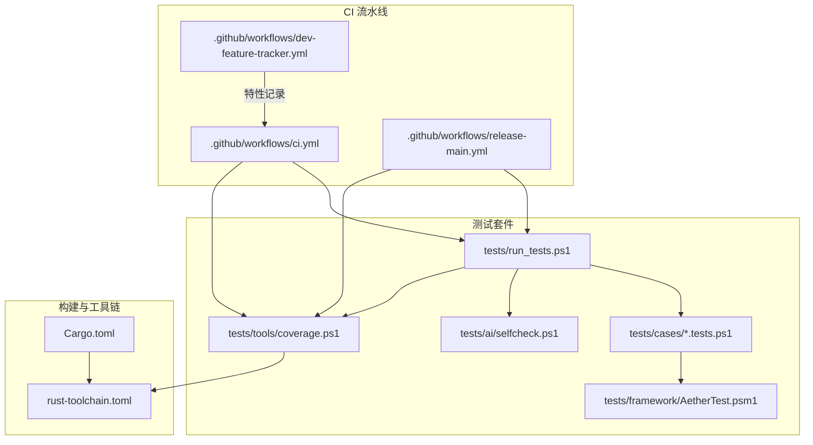
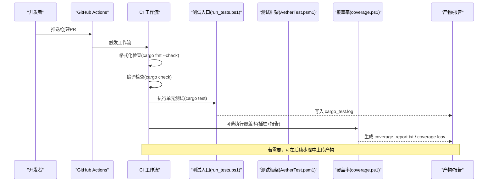
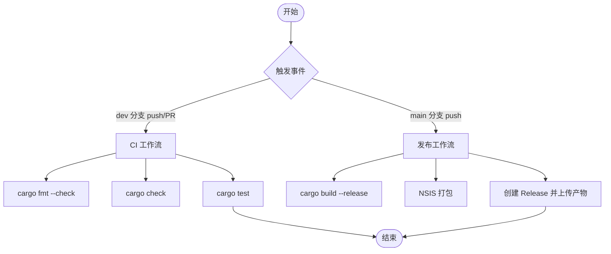
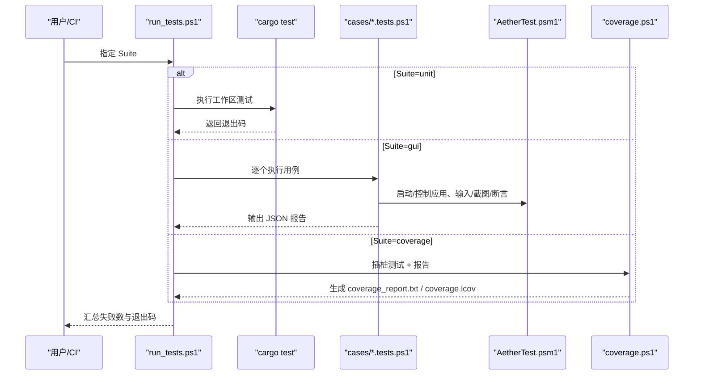
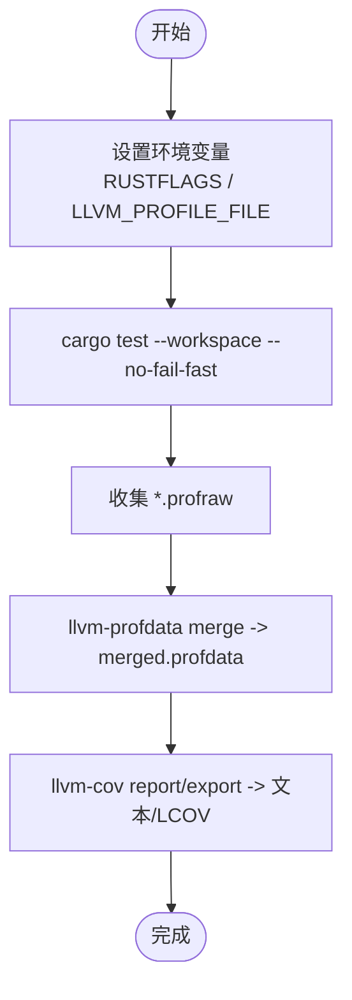
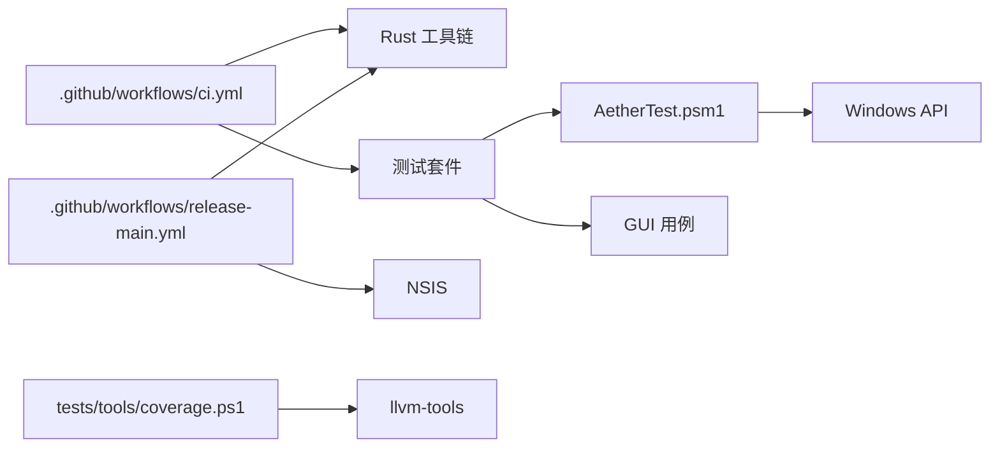

# 自动化测试

<cite>
**本文引用的文件**
- [ci.yml](file://.github/workflows/ci.yml)
- [release-main.yml](file://.github/workflows/release-main.yml)
- [dev-feature-tracker.yml](file://.github/workflows/dev-feature-tracker.yml)
- [run_tests.ps1](file://tests/run_tests.ps1)
- [AetherTest.psm1](file://tests/framework/AetherTest.psm1)
- [coverage.ps1](file://tests/tools/coverage.ps1)
- [selfcheck.ps1](file://tests/ai/selfcheck.ps1)
- [default_mode_toggle.tests.ps1](file://tests/cases/default_mode_toggle.tests.ps1)
- [Cargo.toml](file://Cargo.toml)
- [rust-toolchain.toml](file://rust-toolchain.toml)
</cite>

## 目录
1. [简介](#简介)
2. [项目结构](#项目结构)
3. [核心组件](#核心组件)
4. [架构总览](#架构总览)
5. [详细组件分析](#详细组件分析)
6. [依赖关系分析](#依赖关系分析)
7. [性能考虑](#性能考虑)
8. [故障排查指南](#故障排查指南)
9. [结论](#结论)
10. [附录：配置示例与最佳实践](#附录配置示例与最佳实践)

## 简介
本文件面向“自动化测试”主题，系统化说明仓库中的 CI/CD 流水线、测试执行流程、覆盖率报告生成与发布机制、质量门禁策略，以及测试脚本维护与环境管理。重点覆盖 GitHub Actions 工作流设计、触发条件、并行与串行执行策略、结果收集与归档、覆盖率报告（文本与 LCOV）的自动生成与使用方式，并给出可操作的配置示例与优化建议。

## 项目结构
仓库采用 Rust Workspace 多 crate 组织，测试体系由三部分构成：
- 单元测试：通过 cargo test 在工作区范围执行
- GUI 测试：基于 PowerShell 框架 AetherTest 驱动应用进程，模拟输入、截图、断言与报告输出
- 覆盖率：通过 instrument-coverage + llvm-profdata/llvm-cov 生成 profraw 合并与 LCOV 报告

图表来源
- [ci.yml:1-26](file://.github/workflows/ci.yml#L1-L26)
- [release-main.yml:1-185](file://.github/workflows/release-main.yml#L1-L185)
- [dev-feature-tracker.yml:1-111](file://.github/workflows/dev-feature-tracker.yml#L1-L111)
- [run_tests.ps1:1-91](file://tests/run_tests.ps1#L1-L91)
- [AetherTest.psm1:1-800](file://tests/framework/AetherTest.psm1#L1-L800)
- [coverage.ps1:1-64](file://tests/tools/coverage.ps1#L1-L64)
- [selfcheck.ps1:1-224](file://tests/ai/selfcheck.ps1#L1-L224)
- [Cargo.toml:1-37](file://Cargo.toml#L1-L37)
- [rust-toolchain.toml:1-5](file://rust-toolchain.toml#L1-L5)

章节来源
- [ci.yml:1-26](file://.github/workflows/ci.yml#L1-L26)
- [run_tests.ps1:1-91](file://tests/run_tests.ps1#L1-L91)
- [Cargo.toml:1-37](file://Cargo.toml#L1-L37)
- [rust-toolchain.toml:1-5](file://rust-toolchain.toml#L1-L5)

## 核心组件
- CI 工作流
  - ci.yml：在 dev 分支 push/PR 时运行格式化检查、cargo check、cargo test
  - release-main.yml：main 分支发布流程，包含版本生成、构建产物打包与上传
  - dev-feature-tracker.yml：合并 PR 后提取特性并记录到 .github/features
- 测试入口与框架
  - run_tests.ps1：统一入口，支持 unit/gui/ai/coverage/all 等套件；GUI 用例逐个执行并统计失败数
  - AetherTest.psm1：GUI 测试框架核心，封装应用生命周期、窗口/输入/截图/日志/断言/报告
  - selfcheck.ps1：AI 协作层自检，验证框架能力可用
  - coverage.ps1：插桩测试 + llvm-cov 报告一体化
- 用例与报告
  - cases/*.tests.ps1：GUI 用例，遵循用例协议，输出 JSON 报告至 tests/reports
  - reports/*：JSON 测试结果汇总，便于后续聚合与质量门禁

章节来源
- [ci.yml:1-26](file://.github/workflows/ci.yml#L1-L26)
- [release-main.yml:1-185](file://.github/workflows/release-main.yml#L1-L185)
- [dev-feature-tracker.yml:1-111](file://.github/workflows/dev-feature-tracker.yml#L1-L111)
- [run_tests.ps1:1-91](file://tests/run_tests.ps1#L1-L91)
- [AetherTest.psm1:1-800](file://tests/framework/AetherTest.psm1#L1-L800)
- [selfcheck.ps1:1-224](file://tests/ai/selfcheck.ps1#L1-L224)
- [coverage.ps1:1-64](file://tests/tools/coverage.ps1#L1-L64)
- [default_mode_toggle.tests.ps1:1-78](file://tests/cases/default_mode_toggle.tests.ps1#L1-L78)

## 架构总览
下图展示从代码提交到测试执行、覆盖率生成与报告产物的端到端流程。

图表来源
- [ci.yml:1-26](file://.github/workflows/ci.yml#L1-L26)
- [run_tests.ps1:35-46](file://tests/run_tests.ps1#L35-L46)
- [coverage.ps1:16-26](file://tests/tools/coverage.ps1#L16-L26)
- [coverage.ps1:28-60](file://tests/tools/coverage.ps1#L28-L60)

## 详细组件分析

### CI 工作流设计与实现
- 触发条件
  - ci.yml：push/PR 到 dev 分支时触发
  - release-main.yml：push 到 main 分支时触发发布
  - dev-feature-tracker.yml：PR 关闭且已合并时记录特性
- 执行环境
  - Windows 环境用于构建与测试（windows-latest）
  - 使用 dtolnay/rust-toolchain@stable 安装 Rust 工具链
- 任务内容
  - 格式化检查：cargo fmt --check
  - 编译检查：cargo check
  - 单元测试：cargo test
- 发布流程
  - 生成版本号（含日期与 SHA），构建 release 二进制，打包 NSIS 安装包，创建 GitHub Release 并上传产物

图表来源
- [ci.yml:1-26](file://.github/workflows/ci.yml#L1-L26)
- [release-main.yml:1-185](file://.github/workflows/release-main.yml#L1-L185)

章节来源
- [ci.yml:1-26](file://.github/workflows/ci.yml#L1-L26)
- [release-main.yml:1-185](file://.github/workflows/release-main.yml#L1-L185)
- [dev-feature-tracker.yml:1-111](file://.github/workflows/dev-feature-tracker.yml#L1-L111)

### 测试执行自动化流程
- 统一入口
  - run_tests.ps1 提供 Suite 参数选择：unit、gui、ai、coverage、all
  - 单元测试：cargo test --workspace --no-fail-fast，输出日志到 tests/reports/cargo_test.log
  - GUI 测试：遍历 tests/cases/*.tests.ps1，逐个执行并累计失败数
  - AI 自检：调用 tests/ai/selfcheck.ps1 验证框架能力
  - 覆盖率：调用 tests/tools/coverage.ps1 进行插桩测试与报告生成
- GUI 用例执行
  - 每个用例独立启动应用、构造临时工作区、执行步骤、截图与断言，最终输出 JSON 报告到 tests/reports
  - 用例可通过 -SkipBuild 跳过构建以加速迭代

图表来源
- [run_tests.ps1:35-83](file://tests/run_tests.ps1#L35-L83)
- [AetherTest.psm1:114-181](file://tests/framework/AetherTest.psm1#L114-L181)
- [coverage.ps1:16-60](file://tests/tools/coverage.ps1#L16-L60)

章节来源
- [run_tests.ps1:1-91](file://tests/run_tests.ps1#L1-L91)
- [AetherTest.psm1:114-181](file://tests/framework/AetherTest.psm1#L114-L181)
- [coverage.ps1:16-60](file://tests/tools/coverage.ps1#L16-L60)

### 覆盖率报告自动生成与发布机制
- 插桩测试
  - 设置 RUSTFLAGS=-C instrument-coverage 与 LLVM_PROFILE_FILE 路径
  - 执行 cargo test --workspace --no-fail-fast 收集 .profraw
- 报告生成
  - 使用 llvm-profdata merge 合并 profraw
  - 使用 llvm-cov report/export 生成文本报告与 LCOV
  - 仅包含项目 crate 的二进制，忽略第三方依赖
- 发布与集成
  - 可将 coverage_report.txt 与 coverage.lcov 作为工件上传（当前工作流未直接上传，但具备生成能力）
  - 可在后续步骤中添加上传动作以集成到 CI 产物或覆盖率平台

图表来源
- [coverage.ps1:16-26](file://tests/tools/coverage.ps1#L16-L26)
- [coverage.ps1:28-60](file://tests/tools/coverage.ps1#L28-L60)

章节来源
- [coverage.ps1:1-64](file://tests/tools/coverage.ps1#L1-L64)

### 测试报告的自动生成与发布
- GUI 用例报告
  - 每个用例结束后输出 JSON 报告到 tests/reports/<case>.json
  - 报告包含用例元信息、步骤耗时、截图路径、失败信息等
- 单元测试日志
  - cargo test 输出重定向到 tests/reports/cargo_test.log
- 覆盖率报告
  - 文本报告与 LCOV 输出到 tests/coverage
- 发布机制
  - 当前 CI 未自动上传报告；可在工作流步骤中添加 actions/upload-artifact 以持久化产物
  - 发布工作流会上传构建产物（exe、安装包），可类比扩展为上传报告

章节来源
- [run_tests.ps1:35-46](file://tests/run_tests.ps1#L35-L46)
- [AetherTest.psm1:778-800](file://tests/framework/AetherTest.psm1#L778-L800)
- [coverage.ps1:55-60](file://tests/tools/coverage.ps1#L55-L60)

### 质量门禁与回归检测
- 质量门禁
  - 格式化检查失败则中断流水线
  - cargo check/test 失败则中断流水线
  - GUI 用例失败累计非零退出码，导致整体失败
- 回归检测
  - 通过 JSON 报告与截图对比（可扩展 diff 工具）识别 UI 回归
  - 覆盖率报告可用于阈值门禁（需在工作流中增加阈值判断逻辑）
  - 日志观测（Get-AetherLog/Wait-AetherLogEvent）辅助定位异步行为异常

章节来源
- [ci.yml:18-25](file://.github/workflows/ci.yml#L18-L25)
- [run_tests.ps1:70-90](file://tests/run_tests.ps1#L70-L90)
- [AetherTest.psm1:654-745](file://tests/framework/AetherTest.psm1#L654-L745)

### 测试脚本维护指南
- 测试环境管理
  - 使用 New-AetherTestWorkspace 创建临时工作区，避免污染用户目录
  - 信任文件夹写入 %APPDATA%\Aether\trusted_folders.txt，防止模态弹窗阻塞
  - 日志位于 %TEMP%\Aether\logs，按天轮转，可使用 Get-AetherLogSince 观察新追加行
- 依赖版本控制
  - rust-toolchain.toml 固定 channel 与 components/targets
  - Cargo.toml 定义 workspace 成员与版本信息
- 故障排查
  - 使用 Wait-AetherLogEvent 等待异步事件（如 LSP 诊断、状态栏变化）
  - 使用 Read-AetherHitRegions 获取可点击区域，辅助定位 UI 元素
  - 使用 Save-AetherScreenshot 保存截图，结合 JSON 报告定位失败点

章节来源
- [AetherTest.psm1:123-181](file://tests/framework/AetherTest.psm1#L123-L181)
- [AetherTest.psm1:631-650](file://tests/framework/AetherTest.psm1#L631-L650)
- [AetherTest.psm1:654-745](file://tests/framework/AetherTest.psm1#L654-L745)
- [rust-toolchain.toml:1-5](file://rust-toolchain.toml#L1-L5)
- [Cargo.toml:1-37](file://Cargo.toml#L1-L37)

### 具体配置示例
- 在 CI 中运行全部测试套件（包括 GUI 与覆盖率）
  - 在 ci.yml 的 jobs.check.steps 中添加：
    - 安装 PowerShell（默认已有）
    - 执行 pwsh -File tests/run_tests.ps1 -Suite all
    - 可选：执行 pwsh -File tests/tools/coverage.ps1
- 在发布流程中附加覆盖率报告上传
  - 在 release-main.yml 的步骤末尾添加 upload-artifact 动作，上传 tests/coverage 下的报告文件

章节来源
- [ci.yml:1-26](file://.github/workflows/ci.yml#L1-L26)
- [release-main.yml:1-185](file://.github/workflows/release-main.yml#L1-L185)
- [run_tests.ps1:70-83](file://tests/run_tests.ps1#L70-L83)
- [coverage.ps1:55-60](file://tests/tools/coverage.ps1#L55-L60)

### 测试性能监控与优化策略
- 性能监控
  - 用例步骤耗时记录在 JSON 报告中，可用于趋势分析与瓶颈定位
  - 日志观测可捕获关键操作耗时（如异步事件等待）
- 优化策略
  - 使用 -SkipBuild 跳过重复构建
  - 限制 GUI 用例并行度（当前为串行逐个执行，避免资源竞争）
  - 缓存 Rust 依赖（release 工作流已启用 rust-cache，可在 CI 中复用）
  - 减少截图频率与尺寸，降低 I/O 开销

章节来源
- [AetherTest.psm1:796-800](file://tests/framework/AetherTest.psm1#L796-L800)
- [run_tests.ps1:58-66](file://tests/run_tests.ps1#L58-L66)
- [release-main.yml:26-30](file://.github/workflows/release-main.yml#L26-L30)

### 处理测试失败与回归检测
- 失败处理
  - 单元测试：cargo test 非零退出码即失败
  - GUI 用例：逐用例执行，失败累计并输出 JSON 报告
  - 覆盖率：若未找到 .profraw 或工具缺失，将抛出错误并中断
- 回归检测
  - 通过 JSON 报告与截图差异对比识别 UI 回归
  - 覆盖率阈值门禁（需在工作流中增加判断逻辑）
  - 日志模式匹配（如状态栏语言切换、LSP 诊断）作为回归信号

章节来源
- [run_tests.ps1:70-90](file://tests/run_tests.ps1#L70-L90)
- [coverage.ps1:32-38](file://tests/tools/coverage.ps1#L32-L38)
- [AetherTest.psm1:714-745](file://tests/framework/AetherTest.psm1#L714-L745)

## 依赖关系分析
- 工作流依赖
  - ci.yml 依赖 Rust 工具链与 Windows 环境
  - release-main.yml 依赖 NSIS（必要时通过 choco 安装）
  - dev-feature-tracker.yml 依赖 Git 与 GitHub API
- 测试框架依赖
  - AetherTest.psm1 依赖 Windows API（user32.dll、kernel32.dll）
  - GUI 用例依赖应用可执行文件与临时工作区
- 覆盖率工具依赖
  - llvm-profdata/llvm-cov 需通过 rustup component add llvm-tools 安装

图表来源
- [ci.yml:1-26](file://.github/workflows/ci.yml#L1-L26)
- [release-main.yml:80-94](file://.github/workflows/release-main.yml#L80-L94)
- [AetherTest.psm1:34-92](file://tests/framework/AetherTest.psm1#L34-L92)
- [coverage.ps1:28-34](file://tests/tools/coverage.ps1#L28-L34)

章节来源
- [ci.yml:1-26](file://.github/workflows/ci.yml#L1-L26)
- [release-main.yml:80-94](file://.github/workflows/release-main.yml#L80-L94)
- [AetherTest.psm1:34-92](file://tests/framework/AetherTest.psm1#L34-L92)
- [coverage.ps1:28-34](file://tests/tools/coverage.ps1#L28-L34)

## 性能考虑
- 构建缓存：使用 rust-cache 缓存依赖，缩短冷启动时间
- 增量构建：单元测试阶段保持增量构建；覆盖率阶段禁用增量以避免干扰
- 并行策略：GUI 用例串行执行以避免窗口/进程竞争；未来可按功能模块拆分 job 并行
- I/O 优化：减少截图频率与大小；日志按天轮转，避免单文件过大

[本节为通用指导，不直接分析具体文件]

## 故障排查指南
- 常见问题
  - 未找到 llvm-tools：安装 rustup component add llvm-tools
  - 应用启动后立即退出：检查构建产物与信任文件夹配置
  - 窗口遮挡导致点击失败：优先使用 PostMessage 注入而非真实鼠标
  - 日志误匹配历史会话：使用 Get-AetherLogMark/Get-AetherLogSince 限定观察窗口
- 定位手段
  - 查看 tests/reports/cargo_test.log 与 JSON 报告
  - 使用 Wait-AetherLogEvent 等待异步事件
  - 保存截图并结合 hit regions 定位 UI 元素

章节来源
- [coverage.ps1:28-34](file://tests/tools/coverage.ps1#L28-L34)
- [AetherTest.psm1:138-181](file://tests/framework/AetherTest.psm1#L138-L181)
- [AetherTest.psm1:654-745](file://tests/framework/AetherTest.psm1#L654-L745)

## 结论
该仓库建立了完善的自动化测试体系：CI 流水线负责格式检查、编译检查与单元测试；PowerShell 框架驱动 GUI 测试并输出结构化报告；覆盖率工具链生成可集成的 LCOV 报告。通过合理的环境管理、依赖控制与日志观测，能够有效支撑持续集成与质量门禁。建议在现有基础上增强报告上传与覆盖率阈值门禁，进一步提升质量保障能力。

[本节为总结性内容，不直接分析具体文件]

## 附录：配置示例与最佳实践
- 在 CI 中运行全部测试套件
  - 在 ci.yml 的 steps 中添加执行 run_tests.ps1 -Suite all
  - 可选：追加 coverage.ps1 生成覆盖率报告
- 在发布流程中上传覆盖率报告
  - 在 release-main.yml 末尾添加 upload-artifact 步骤，上传 tests/coverage 下的报告文件
- 最佳实践
  - 使用 -SkipBuild 加速本地迭代
  - 通过 JSON 报告与截图进行回归对比
  - 使用 Wait-AetherLogEvent 等待异步事件，提高稳定性
  - 固定工具链版本，确保环境一致性

章节来源
- [ci.yml:1-26](file://.github/workflows/ci.yml#L1-L26)
- [release-main.yml:1-185](file://.github/workflows/release-main.yml#L1-L185)
- [run_tests.ps1:70-83](file://tests/run_tests.ps1#L70-L83)
- [coverage.ps1:55-60](file://tests/tools/coverage.ps1#L55-L60)