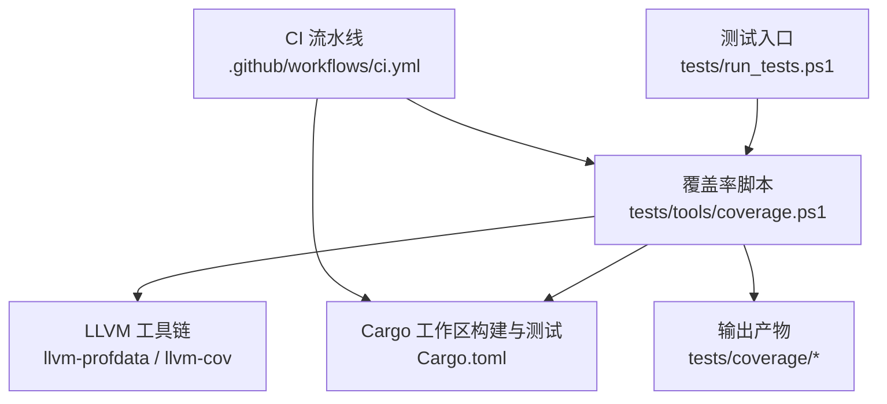
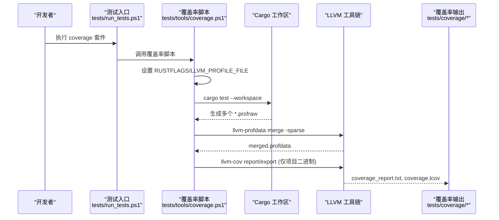
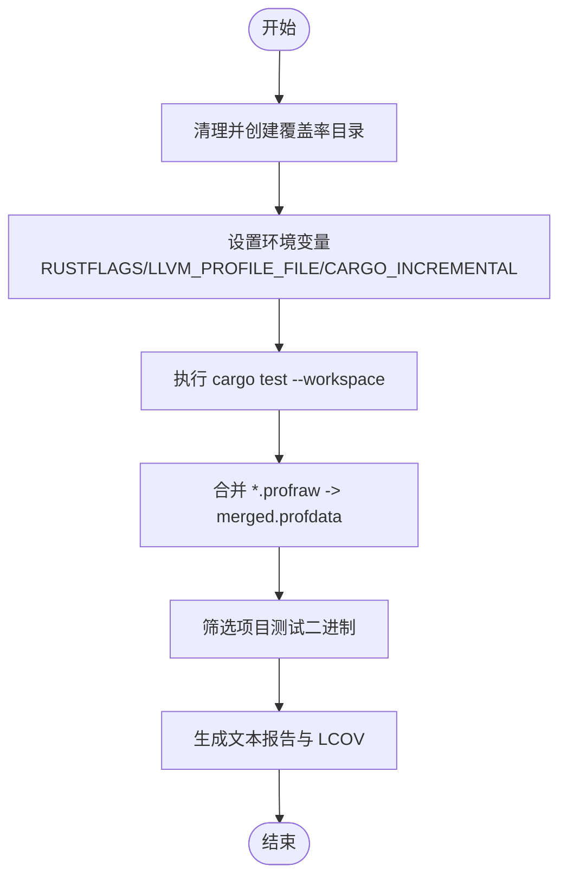
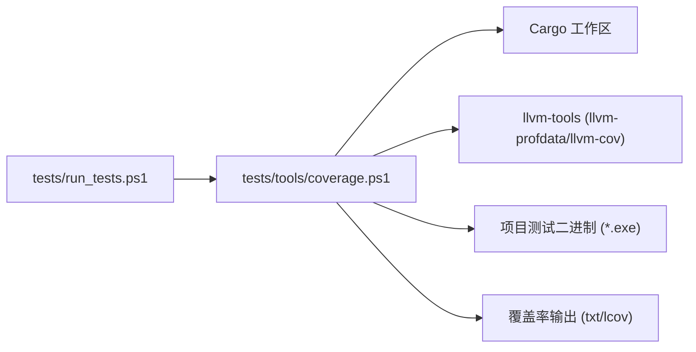

# 覆盖率分析

<cite>
**本文引用的文件**
- [tests/tools/coverage.ps1](file://tests/tools/coverage.ps1)
- [tests/run_tests.ps1](file://tests/run_tests.ps1)
- [.github/workflows/ci.yml](file://.github/workflows/ci.yml)
- [Cargo.toml](file://Cargo.toml)
- [.cargo/config.toml](file://.cargo/config.toml)
- [rust-toolchain.toml](file://rust-toolchain.toml)
</cite>

## 目录
1. [简介](#简介)
2. [项目结构](#项目结构)
3. [核心组件](#核心组件)
4. [架构总览](#架构总览)
5. [详细组件分析](#详细组件分析)
6. [依赖关系分析](#依赖关系分析)
7. [性能考量](#性能考量)
8. [故障排查指南](#故障排查指南)
9. [结论](#结论)
10. [附录](#附录)

## 简介
本文件为“覆盖率分析”的完整技术文档，面向 Rust 工作区项目，说明如何使用 LLVM 工具链进行代码覆盖率统计与报告生成。内容涵盖：
- 工具链与配置：Rust 插桩编译、LLVM profdata/llvm-cov 的使用
- 数据收集与分析：行覆盖率、分支覆盖率、函数覆盖率的含义与获取方式
- 报告解读：关键指标、盲区识别与改进建议
- 实践策略：测试重点识别、质量评估、CI 门禁
- 第三方库与生成代码的处理方法
- 具体使用示例与命令流程

## 项目结构
本项目采用多 crate 工作区组织，覆盖率脚本位于 tests/tools，统一入口在 tests/run_tests.ps1，CI 在 .github/workflows/ci.yml。覆盖率相关的关键配置包括：
- 工作区定义与版本信息：Cargo.toml
- 构建目标与默认 rustflags：.cargo/config.toml
- 工具链固定与组件声明：rust-toolchain.toml
- 覆盖率一体化脚本：tests/tools/coverage.ps1
- 测试统一入口（含 coverage 套件）：tests/run_tests.ps1
- CI 流水线（当前未包含覆盖率门禁，可集成）：.github/workflows/ci.yml

图表来源
- [tests/run_tests.ps1:1-91](file://tests/run_tests.ps1#L1-L91)
- [tests/tools/coverage.ps1:1-63](file://tests/tools/coverage.ps1#L1-L63)
- [Cargo.toml:1-37](file://Cargo.toml#L1-L37)
- [.github/workflows/ci.yml:1-26](file://.github/workflows/ci.yml#L1-L26)

章节来源
- [tests/run_tests.ps1:1-91](file://tests/run_tests.ps1#L1-L91)
- [tests/tools/coverage.ps1:1-63](file://tests/tools/coverage.ps1#L1-L63)
- [Cargo.toml:1-37](file://Cargo.toml#L1-L37)
- [.github/workflows/ci.yml:1-26](file://.github/workflows/ci.yml#L1-L26)

## 核心组件
- 覆盖率一体化脚本：负责插桩编译、运行测试、合并 profraw、生成文本与 LCOV 报告
- 测试统一入口：提供 coverage 套件，便于一键执行覆盖率流程
- 工作区与构建配置：定义目标平台、默认 rustflags、增量构建等
- CI 流水线：格式化检查、cargo check、单元测试；可扩展为覆盖率门禁

章节来源
- [tests/tools/coverage.ps1:1-63](file://tests/tools/coverage.ps1#L1-L63)
- [tests/run_tests.ps1:1-91](file://tests/run_tests.ps1#L1-L91)
- [Cargo.toml:1-37](file://Cargo.toml#L1-L37)
- [.cargo/config.toml:1-31](file://.cargo/config.toml#L1-L31)
- [rust-toolchain.toml:1-5](file://rust-toolchain.toml#L1-L5)

## 架构总览
覆盖率采集与报告生成的端到端流程如下：
- 通过环境变量启用插桩编译并指定 profraw 输出路径
- 在工作区范围执行测试，收集每个测试进程的 profraw
- 合并所有 profraw 为统一的 profdata
- 仅对项目的测试二进制（排除第三方依赖）生成覆盖率报告
- 输出文本报告与 LCOV 格式，便于本地查看或接入 CI/CD 工具

图表来源
- [tests/run_tests.ps1:70-79](file://tests/run_tests.ps1#L70-L79)
- [tests/tools/coverage.ps1:16-57](file://tests/tools/coverage.ps1#L16-L57)

## 详细组件分析

### 覆盖率一体化脚本（tests/tools/coverage.ps1）
职责与关键点：
- 阶段一：插桩测试
  - 关闭增量构建，避免缓存导致的数据不一致
  - 设置 RUSTFLAGS 启用 instrument-coverage
  - 设置 LLVM_PROFILE_FILE 指定 profraw 输出路径
  - 以工作区模式运行测试，捕获日志
- 阶段二：合并与报告
  - 校验 llvm-tools 组件是否安装
  - 扫描并合并所有 profraw 到 merged.profdata
  - 筛选项目 crate 的测试二进制（名称匹配 aether 前缀），排除第三方依赖
  - 使用 llvm-cov 生成文本报告与 LCOV 导出
  - 忽略 .cargo、registry、target 等无关路径

图表来源
- [tests/tools/coverage.ps1:16-57](file://tests/tools/coverage.ps1#L16-L57)

章节来源
- [tests/tools/coverage.ps1:1-63](file://tests/tools/coverage.ps1#L1-L63)

### 测试统一入口（tests/run_tests.ps1）
职责与关键点：
- 提供 unit、gui、ai、coverage、all 等多套件入口
- coverage 套件直接调用覆盖率脚本，失败时累计错误计数
- 支持 GUI 用例单独运行与跳过构建参数

章节来源
- [tests/run_tests.ps1:1-91](file://tests/run_tests.ps1#L1-L91)

### 工作区与构建配置（Cargo.toml、.cargo/config.toml、rust-toolchain.toml）
- 工作区成员与解析器版本：确保多 crate 统一构建
- 构建目标与默认 rustflags：x86_64-pc-windows-msvc，CPU 特性优化
- 工具链通道与组件：stable，包含 rustfmt/clippy，目标平台
- 注意：覆盖率插桩标志由覆盖率脚本在运行时设置，不写入全局 rustflags

章节来源
- [Cargo.toml:1-37](file://Cargo.toml#L1-L37)
- [.cargo/config.toml:1-31](file://.cargo/config.toml#L1-L31)
- [rust-toolchain.toml:1-5](file://rust-toolchain.toml#L1-L5)

### CI 流水线（.github/workflows/ci.yml）
现状与建议：
- 当前步骤：格式化检查、cargo check、cargo test
- 建议扩展：增加覆盖率门禁步骤，例如在 PR 上运行覆盖率并比较阈值，或在 dev 分支定期生成报告归档

章节来源
- [.github/workflows/ci.yml:1-26](file://.github/workflows/ci.yml#L1-L26)

## 依赖关系分析
覆盖率流程中的关键依赖与耦合：
- 覆盖率脚本依赖 llvm-tools 组件（llvm-profdata、llvm-cov）
- 覆盖率脚本依赖 Cargo 工作区测试产物（*.exe 测试二进制）
- 覆盖率脚本通过文件名规则过滤第三方依赖，降低噪声
- 测试入口与覆盖率脚本松耦合，便于独立维护

图表来源
- [tests/run_tests.ps1:70-79](file://tests/run_tests.ps1#L70-L79)
- [tests/tools/coverage.ps1:28-57](file://tests/tools/coverage.ps1#L28-L57)

章节来源
- [tests/run_tests.ps1:70-79](file://tests/run_tests.ps1#L70-L79)
- [tests/tools/coverage.ps1:28-57](file://tests/tools/coverage.ps1#L28-L57)

## 性能考量
- 插桩编译会显著增加编译时间与二进制体积，建议在覆盖率任务中禁用增量构建
- 合并 profraw 与生成报告可能耗时较长，建议仅在必要分支或定时任务中执行
- 仅对项目二进制生成报告，可大幅减少噪音与计算量
- 若需并行化，可在 CI 中将不同 crate 的覆盖率任务拆分后合并

[本节为通用指导，无需特定文件引用]

## 故障排查指南
常见问题与处理：
- 未找到 llvm-tools：安装 rustup component add llvm-tools
- 未找到 profraw：先执行插桩测试，再运行报告生成
- 报告为空或偏低：确认筛选的二进制是否正确，检查 ignore-filename-regex 是否误过滤
- 链接期 CRT 冲突：确保 C/C++ 依赖使用 /MD（已在 .cargo/config.toml 中统一）

章节来源
- [tests/tools/coverage.ps1:28-38](file://tests/tools/coverage.ps1#L28-L38)
- [.cargo/config.toml:12-17](file://.cargo/config.toml#L12-L17)

## 结论
本项目已具备完善的覆盖率采集与报告生成能力，基于 Rust 插桩与 LLVM 工具链，能够对工作区内项目 crate 的测试进行行级覆盖率统计，并输出文本与 LCOV 报告。建议在 CI 中引入覆盖率门禁，结合阈值与趋势分析，持续提升代码质量。对于第三方库与生成代码，可通过忽略路径与仅统计项目二进制的方式，聚焦有效覆盖率。

[本节为总结性内容，无需特定文件引用]

## 附录

### 覆盖率指标解释
- 行覆盖率：被执行的源代码行数占比，反映测试对代码行的覆盖程度
- 分支覆盖率：条件分支中被执行的路径占比，衡量对复杂逻辑的覆盖情况
- 函数覆盖率：被调用的函数数量占比，体现对模块接口的覆盖度

说明：
- 本项目的覆盖率脚本通过 llvm-cov 生成行覆盖率；分支覆盖率与函数覆盖率可由 llvm-cov 的不同选项或后续工具进一步细化

[本节为概念性说明，无需特定文件引用]

### 覆盖率提升策略与实践
- 测试重点识别：优先覆盖核心算法、边界条件、异常路径
- 盲区分析：利用 LCOV 定位未覆盖文件与函数，补充针对性用例
- 质量评估：设定最低覆盖率阈值，结合变更影响范围评估风险
- 持续改进：将覆盖率纳入 PR 审查与发布前检查

[本节为通用实践，无需特定文件引用]

### 工具使用示例
- 本地执行覆盖率：
  - 进入项目根目录
  - 执行 PowerShell 脚本：pwsh -File tests\tools\coverage.ps1
  - 或使用统一入口：pwsh -File tests\run_tests.ps1 -Suite coverage
- 仅生成报告（已有 profraw）：
  - pwsh -File tests\tools/coverage.ps1 -ReportOnly
- 输出位置：
  - 文本报告：tests/coverage/coverage_report.txt
  - LCOV 报告：tests/coverage/coverage.lcov

章节来源
- [tests/tools/coverage.ps1:4-7](file://tests/tools/coverage.ps1#L4-L7)
- [tests/run_tests.ps1:70-79](file://tests/run_tests.ps1#L70-L79)

### 在持续集成中的作用与质量门禁
- 当前 CI 步骤：格式化检查、cargo check、cargo test
- 建议门禁：
  - 在 PR 上运行覆盖率并比较基线阈值
  - 在 dev 分支定时生成覆盖率报告并归档
  - 对新增代码强制达到最低覆盖率要求

章节来源
- [.github/workflows/ci.yml:1-26](file://.github/workflows/ci.yml#L1-L26)

### 第三方库与生成代码的处理
- 仅统计项目 crate：通过文件名匹配 aether 前缀，排除第三方依赖
- 忽略无关路径：使用 ignore-filename-regex 排除 .cargo、registry、target
- 生成代码：若存在源码生成步骤，建议将生成产物纳入版本控制并在覆盖率中排除或单独统计

章节来源
- [tests/tools/coverage.ps1:45-53](file://tests/tools/coverage.ps1#L45-L53)