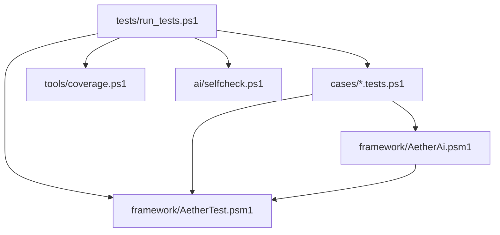
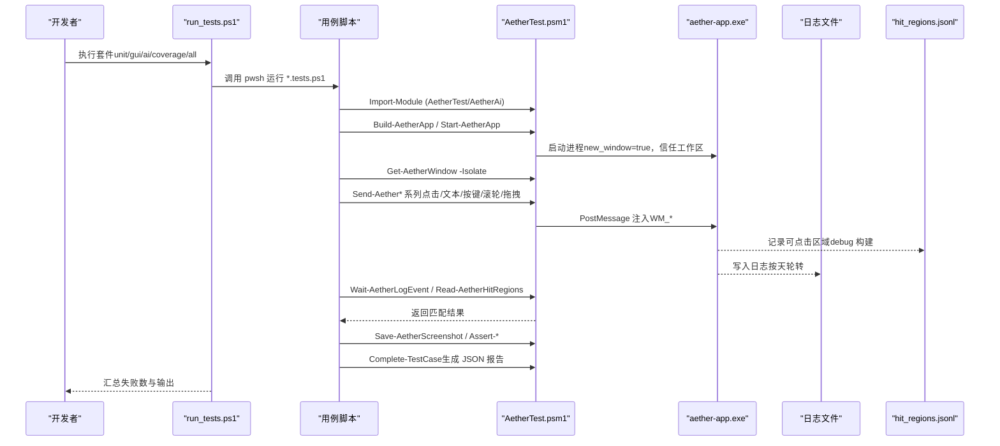
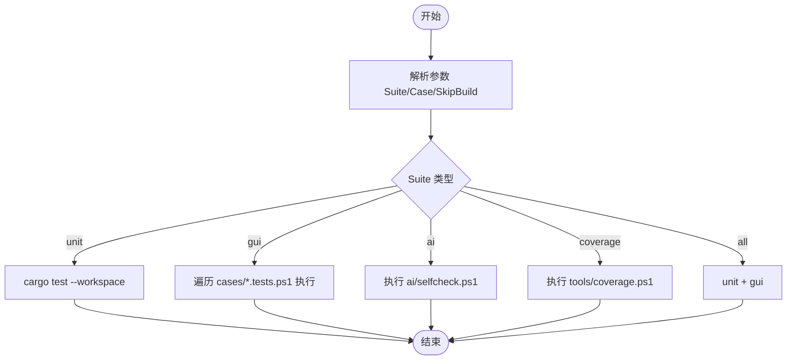
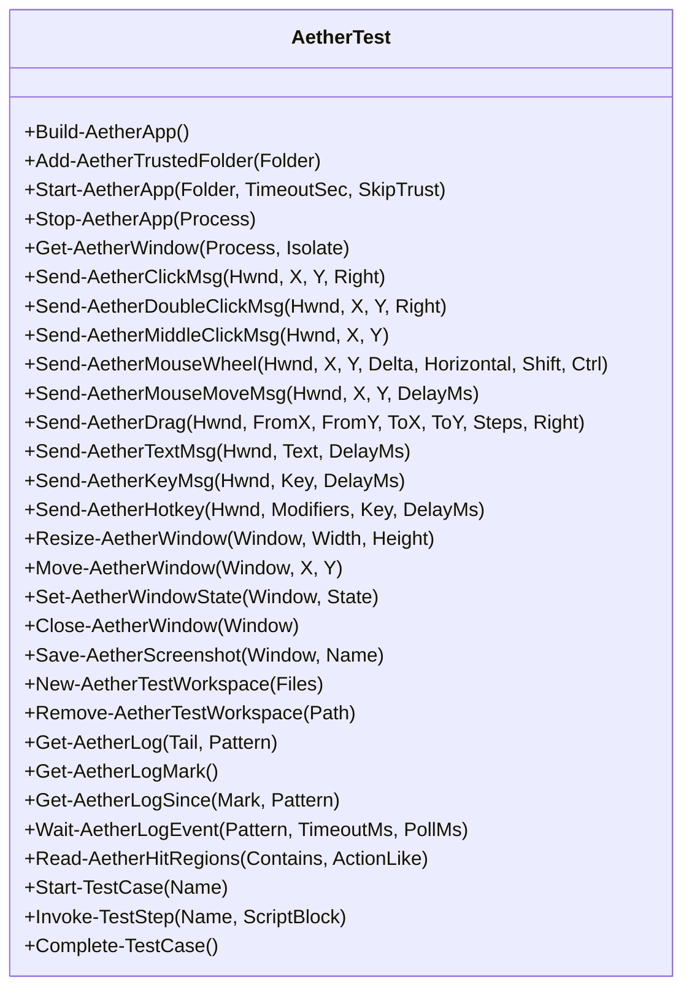
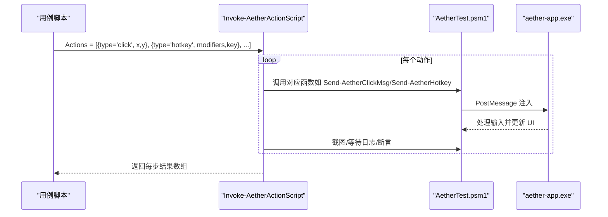
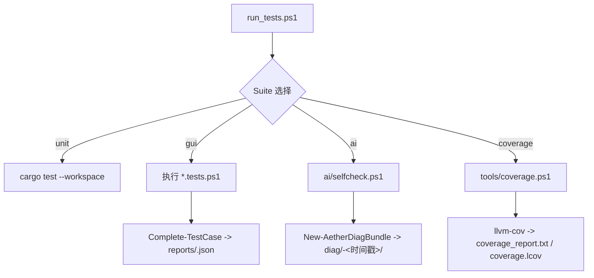
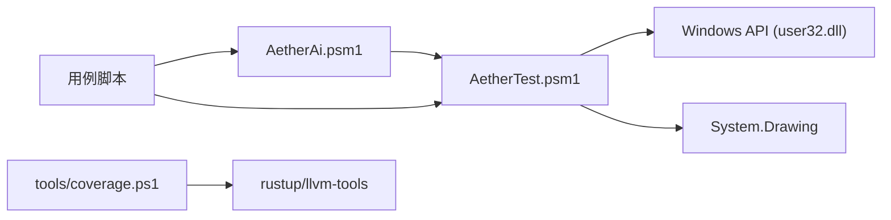

# 集成测试

<cite>
**本文引用的文件**
- [tests/run_tests.ps1](file://tests/run_tests.ps1)
- [tests/framework/AetherTest.psm1](file://tests/framework/AetherTest.psm1)
- [tests/framework/AetherAi.psm1](file://tests/framework/AetherAi.psm1)
- [tests/ai/AI_TESTING.md](file://tests/ai/AI_TESTING.md)
- [tests/ai/selfcheck.ps1](file://tests/ai/selfcheck.ps1)
- [tests/cases/_template.tests.ps1](file://tests/cases/_template.tests.ps1)
- [tests/cases/explorer_inline_input.tests.ps1](file://tests/cases/explorer_inline_input.tests.ps1)
- [tests/cases/default_mode_toggle.tests.ps1](file://tests/cases/default_mode_toggle.tests.ps1)
- [tests/tools/coverage.ps1](file://tests/tools/coverage.ps1)
</cite>

## 目录
1. [简介](#简介)
2. [项目结构](#项目结构)
3. [核心组件](#核心组件)
4. [架构总览](#架构总览)
5. [详细组件分析](#详细组件分析)
6. [依赖关系分析](#依赖关系分析)
7. [性能考量](#性能考量)
8. [故障排查指南](#故障排查指南)
9. [结论](#结论)
10. [附录](#附录)

## 简介
本文件为 Aether Studio GUI 集成测试的权威文档，覆盖以下方面：
- GUI 集成测试架构与 PowerShell 测试框架实现
- 端到端测试场景设计（用户交互、文件操作、AI 功能）
- 测试环境搭建与管理（测试数据准备、模拟服务与依赖隔离）
- 测试用例编写指南（元素定位、操作模拟、结果验证）
- 测试执行流程与报告生成机制
- 具体测试示例与调试方法、性能优化技巧

## 项目结构
测试体系围绕 tests 目录组织，采用“统一入口 + 框架模块 + 用例脚本 + AI 协作层”的分层设计：
- 统一入口：tests/run_tests.ps1 提供 unit/gui/ai/coverage/all 等套件入口
- 框架核心：AetherTest.psm1 负责应用生命周期、窗口管理、输入模拟、截图、日志观测、断言与报告
- AI 协作层：AetherAi.psm1 提供动作脚本 DSL、像素断言、UI 状态快照、诊断包、智能点击等高级能力
- 用例脚本：cases/*.tests.ps1 描述端到端场景，可独立运行
- 辅助工具：tools/coverage.ps1 提供插桩覆盖率一体化流程；ai/selfcheck.ps1 做环境自检

图表来源
- [tests/run_tests.ps1:1-91](file://tests/run_tests.ps1#L1-L91)
- [tests/framework/AetherTest.psm1:1-800](file://tests/framework/AetherTest.psm1#L1-L800)
- [tests/framework/AetherAi.psm1:1-492](file://tests/framework/AetherAi.psm1#L1-L492)
- [tests/tools/coverage.ps1:1-64](file://tests/tools/coverage.ps1#L1-L64)
- [tests/ai/selfcheck.ps1:1-224](file://tests/ai/selfcheck.ps1#L1-L224)

章节来源
- [tests/run_tests.ps1:1-91](file://tests/run_tests.ps1#L1-L91)

## 核心组件
- 统一测试入口（run_tests.ps1）
  - 支持单元、GUI、AI 自检、覆盖率、全量套件
  - 收集 cargo test 输出并写入 reports 目录
  - 遍历 cases/*.tests.ps1 逐个执行，支持按 Case 名过滤
- 框架核心（AetherTest.psm1）
  - 构建与启动应用（Build-AetherApp、Start-AetherApp），自动信任工作区、new_window 隔离
  - 窗口几何与 DPI 换算（Get-AetherWindow、Scale2）
  - 输入模拟（PostMessage 注入为主：点击、双击、中键、滚轮、拖拽、文本、按键、组合键）
  - 截图与临时工作区（Save-AetherScreenshot、New-AetherTestWorkspace）
  - 日志观测（Get-AetherLog、Wait-AetherLogEvent、Get-AetherLogMark/Since）
  - hit regions 读取（Read-AetherHitRegions）
  - 用例协议（Start-TestCase、Invoke-TestStep、Complete-TestCase）
- AI 协作层（AetherAi.psm1）
  - 动作脚本 DSL（Invoke-AetherActionScript）：click/dblclick/mclick/hover/move/wheel/drag/keys/key/hotkey/wait/shot/expect/resize/movewin/winstate/closewin
  - 像素断言与截图差异（Test-AetherPixelRegion、Compare-AetherScreenshot、Assert-AetherUiChanged）
  - UI 状态快照（Get-AetherUiState）、编辑器状态摘要（Get-AetherEditorState）
  - 日志事件断言（Assert-AetherLogEvent）
  - 诊断包打包（New-AetherDiagBundle）
  - 智能操作（Find-AetherHitRegion、Invoke-AetherSmartClick、Wait-AetherHitRegion）

章节来源
- [tests/framework/AetherTest.psm1:1-800](file://tests/framework/AetherTest.psm1#L1-L800)
- [tests/framework/AetherAi.psm1:1-492](file://tests/framework/AetherAi.psm1#L1-L492)

## 架构总览
GUI 集成测试通过 PowerShell 驱动真实应用进程，使用 PostMessage 注入输入，结合日志与 hit regions 进行强断言。整体流程如下：

图表来源
- [tests/run_tests.ps1:35-83](file://tests/run_tests.ps1#L35-L83)
- [tests/framework/AetherTest.psm1:114-181](file://tests/framework/AetherTest.psm1#L114-L181)
- [tests/framework/AetherTest.psm1:185-228](file://tests/framework/AetherTest.psm1#L185-L228)
- [tests/framework/AetherTest.psm1:232-577](file://tests/framework/AetherTest.psm1#L232-L577)
- [tests/framework/AetherTest.psm1:654-745](file://tests/framework/AetherTest.psm1#L654-L745)
- [tests/framework/AetherTest.psm1:778-800](file://tests/framework/AetherTest.psm1#L778-L800)

## 详细组件分析

### 统一入口与套件调度（run_tests.ps1）
- 支持参数 Suite（unit/gui/ai/coverage/all）、Case（指定用例）、SkipBuild
- 单元测试：cargo test --workspace，输出重定向到 reports/cargo_test.log
- GUI 套件：遍历 cases/*.tests.ps1，逐个以 pwsh 执行，支持 -SkipBuild 透传
- AI 自检：调用 ai/selfcheck.ps1
- 覆盖率：调用 tools/coverage.ps1
- 失败计数与退出码聚合

图表来源
- [tests/run_tests.ps1:24-83](file://tests/run_tests.ps1#L24-L83)

章节来源
- [tests/run_tests.ps1:1-91](file://tests/run_tests.ps1#L1-L91)

### 框架核心（AetherTest.psm1）
- 应用生命周期
  - Build-AetherApp：增量构建 aether-win32
  - Add-AetherTrustedFolder：写入 %APPDATA%\Aether\trusted_folders.txt，避免模态信任弹窗
  - Start-AetherApp：通过 .NET ProcessStartInfo.ArgumentList 传递 JSON 参数，new_window=true 避免单实例转发
  - Stop-AetherApp：优雅关闭或强制终止
- 窗口与几何
  - Get-AetherWindow：恢复/前置窗口，计算 Dpi/Scale/Scale2，支持 -Isolate 移动窗口避免重叠
- 输入模拟（首选 PostMessage 注入）
  - 鼠标：Send-AetherClickMsg、Send-AetherDoubleClickMsg、Send-AetherMiddleClickMsg、Send-AetherMouseWheel、Send-AetherMouseMoveMsg、Send-AetherDrag
  - 键盘：Send-AetherTextMsg（逐字符 WM_CHAR）、Send-AetherKeyMsg（WM_KEYDOWN/UP）、Send-AetherHotkey（修饰键顺序与释放逆序）
  - 真实鼠标：Invoke-AetherClick（需要系统级行为时使用）
- 窗口操作
  - Resize-AetherWindow、Move-AetherWindow、Set-AetherWindowState、Close-AetherWindow
- 文件拖放
  - Send-AetherDropFiles 当前抛出异常提示替代方案（Ctrl+O 或 Start-AetherApp -Folder）
- 截图与工作区
  - Save-AetherScreenshot：保存到 tests/screenshots/<case>/
  - New-AetherTestWorkspace / Remove-AetherTestWorkspace：创建/清理临时工作区
- 日志观测
  - Get-AetherLog：按天轮转日志，Tail/Pattern 过滤
  - Get-AetherLogMark / Get-AetherLogSince：基于字节长度基线观察新增日志
  - Wait-AetherLogEvent：轮询等待异步完成
- hit regions
  - Read-AetherHitRegions：读取 debug 构建记录的每帧可点击区域
- 用例协议
  - Start-TestCase、Invoke-TestStep、Complete-TestCase：记录步骤耗时、截图、错误信息，输出 JSON 报告

图表来源
- [tests/framework/AetherTest.psm1:114-181](file://tests/framework/AetherTest.psm1#L114-L181)
- [tests/framework/AetherTest.psm1:185-228](file://tests/framework/AetherTest.psm1#L185-L228)
- [tests/framework/AetherTest.psm1:232-577](file://tests/framework/AetherTest.psm1#L232-L577)
- [tests/framework/AetherTest.psm1:605-650](file://tests/framework/AetherTest.psm1#L605-L650)
- [tests/framework/AetherTest.psm1:654-745](file://tests/framework/AetherTest.psm1#L654-L745)
- [tests/framework/AetherTest.psm1:778-800](file://tests/framework/AetherTest.psm1#L778-L800)

章节来源
- [tests/framework/AetherTest.psm1:1-800](file://tests/framework/AetherTest.psm1#L1-L800)

### AI 协作层（AetherAi.psm1）
- 动作脚本 DSL（Invoke-AetherActionScript）
  - 将 actions 数组逐项执行，返回每步结果（ok/note/duration_ms/screenshot）
  - 支持 click/dblclick/mclick/hover/move/wheel/drag/keys/key/hotkey/wait/shot/expect/resize/movewin/winstate/closewin
- 像素断言与冻结检测
  - Test-AetherPixelRegion：采样平均色断言
  - Compare-AetherScreenshot：对比两张截图变化比例
  - Assert-AetherUiChanged：断言画面发生变化（防冻结回归）
- UI 状态快照
  - Get-AetherUiState：日志尾部、hit regions、CPU/内存、状态消息
  - Get-AetherEditorState：标签数、状态栏项、最近日志
- 日志断言
  - Assert-AetherLogEvent：包含/不包含某模式
- 诊断包
  - New-AetherDiagBundle：打包 manifest/report/screenshots/app.log/hit_regions/process
- 智能操作
  - Find-AetherHitRegion：按动作名称模糊匹配最新一帧区域
  - Invoke-AetherSmartClick：根据语义区域自动点击（内置坐标换算）
  - Wait-AetherHitRegion：等待 UI 元素出现

图表来源
- [tests/framework/AetherAi.psm1:20-177](file://tests/framework/AetherAi.psm1#L20-L177)
- [tests/framework/AetherTest.psm1:232-577](file://tests/framework/AetherTest.psm1#L232-L577)

章节来源
- [tests/framework/AetherAi.psm1:1-492](file://tests/framework/AetherAi.psm1#L1-L492)

### 端到端测试场景设计
- 用户交互流程测试
  - 标题栏设置页打开、通用页默认启动模式切换（default_mode_toggle.tests.ps1）
  - 资源管理器内联输入行新建/重命名（explorer_inline_input.tests.ps1）
- 文件操作测试
  - 新建文件/文件夹、提交后磁盘校验、空名提交取消
- AI 功能测试
  - 通过 AI 自检（selfcheck.ps1）验证框架链路可用
  - 使用动作脚本 DSL 探索式交互，结合日志与 hit regions 断言

章节来源
- [tests/cases/default_mode_toggle.tests.ps1:1-78](file://tests/cases/default_mode_toggle.tests.ps1#L1-L78)
- [tests/cases/explorer_inline_input.tests.ps1:1-98](file://tests/cases/explorer_inline_input.tests.ps1#L1-L98)
- [tests/ai/selfcheck.ps1:1-224](file://tests/ai/selfcheck.ps1#L1-L224)

### 测试环境与依赖隔离
- 测试数据准备
  - New-AetherTestWorkspace：创建临时工作区，声明所需文件
  - 清理策略：Remove-AetherTestWorkspace 仅清理框架创建的目录
- 模拟服务与依赖隔离
  - new_window=true：避免单实例互斥导致参数转发
  - 信任列表：Add-AetherTrustedFolder 写入 trusted_folders.txt，避免模态确认框
  - 窗口隔离：Get-AetherWindow -Isolate 移动到 (40,40)，避免与用户窗口重叠
- 环境变量与构建
  - 单元测试：CARGO_INCREMENTAL=0
  - 覆盖率：RUSTFLAGS="-C instrument-coverage"，LLVM_PROFILE_FILE 配置

章节来源
- [tests/framework/AetherTest.psm1:123-181](file://tests/framework/AetherTest.psm1#L123-L181)
- [tests/framework/AetherTest.psm1:631-650](file://tests/framework/AetherTest.psm1#L631-L650)
- [tests/run_tests.ps1:35-46](file://tests/run_tests.ps1#L35-L46)
- [tests/tools/coverage.ps1:16-26](file://tests/tools/coverage.ps1#L16-L26)

### 测试用例编写指南
- 页面元素定位
  - 优先使用语义化 hit region：Invoke-AetherSmartClick -ActionLike "sidebar:new_file"
  - 手算坐标需遵循布局常量与 Scale2 换算（见 AI_TESTING.md §3）
- 用户操作模拟
  - 首选 PostMessage 注入：Send-AetherClickMsg/Send-AetherTextMsg/Send-AetherKeyMsg/Send-AetherHotkey
  - 真实鼠标仅在需要系统级行为时使用（Invoke-AetherClick）
- 结果验证
  - 日志断言：Wait-AetherLogEvent / Assert-AetherLogEvent
  - hit regions 断言：Read-AetherHitRegions -ActionLike "status:*"
  - 截图断言：Save-AetherScreenshot / Test-AetherPixelRegion / Assert-AetherUiChanged
- 用例模板与示例
  - _template.tests.ps1：标准骨架，含注释说明与常用操作示例
  - explorer_inline_input.tests.ps1：完整端到端场景（新建/重命名/取消）
  - default_mode_toggle.tests.ps1：设置页交互与持久化校验

章节来源
- [tests/ai/AI_TESTING.md:47-158](file://tests/ai/AI_TESTING.md#L47-L158)
- [tests/cases/_template.tests.ps1:1-138](file://tests/cases/_template.tests.ps1#L1-L138)
- [tests/cases/explorer_inline_input.tests.ps1:1-98](file://tests/cases/explorer_inline_input.tests.ps1#L1-L98)
- [tests/cases/default_mode_toggle.tests.ps1:1-78](file://tests/cases/default_mode_toggle.tests.ps1#L1-L78)

### 测试执行流程与报告生成
- 执行入口
  - run_tests.ps1：统一调度 unit/gui/ai/coverage/all
- 报告生成
  - 单元测试：cargo test 输出重定向到 reports/cargo_test.log
  - GUI 用例：Complete-TestCase 生成 reports/<case>.json（Steps、Screenshots、Env）
  - 覆盖率：tools/coverage.ps1 生成 coverage_report.txt 与 coverage.lcov
- 诊断包
  - New-AetherDiagBundle：打包 manifest/report/screenshots/app.log/hit_regions/process

图表来源
- [tests/run_tests.ps1:35-83](file://tests/run_tests.ps1#L35-L83)
- [tests/framework/AetherTest.psm1:778-800](file://tests/framework/AetherTest.psm1#L778-L800)
- [tests/tools/coverage.ps1:28-64](file://tests/tools/coverage.ps1#L28-L64)
- [tests/framework/AetherAi.psm1:332-403](file://tests/framework/AetherAi.psm1#L332-L403)

章节来源
- [tests/run_tests.ps1:1-91](file://tests/run_tests.ps1#L1-L91)
- [tests/tools/coverage.ps1:1-64](file://tests/tools/coverage.ps1#L1-L64)
- [tests/framework/AetherAi.psm1:332-403](file://tests/framework/AetherAi.psm1#L332-L403)

## 依赖关系分析
- 模块耦合
  - AetherAi.psm1 依赖 AetherTest.psm1 提供的底层能力（输入、窗口、日志、截图）
  - 用例脚本依赖两者，通过 Import-Module 引入
- 外部依赖
  - Windows API：user32.dll（窗口/输入/消息）
  - System.Drawing：截图与像素操作
  - Rust 工具链：cargo、llvm-profdata、llvm-cov（覆盖率）
- 潜在循环依赖
  - 无直接循环；分层清晰（用例 → AI 层 → 核心层）

图表来源
- [tests/framework/AetherTest.psm1:32-94](file://tests/framework/AetherTest.psm1#L32-L94)
- [tests/tools/coverage.ps1:28-64](file://tests/tools/coverage.ps1#L28-L64)

章节来源
- [tests/framework/AetherTest.psm1:1-800](file://tests/framework/AetherTest.psm1#L1-L800)
- [tests/framework/AetherAi.psm1:1-492](file://tests/framework/AetherAi.psm1#L1-L492)
- [tests/tools/coverage.ps1:1-64](file://tests/tools/coverage.ps1#L1-L64)

## 性能考量
- 步骤耗时记录：Invoke-TestStep 自动记录 duration_ms，便于回归分析
- 应用日志埋点：tracing::info!(ms=..., "DIAG <阶段>")，测试用 Wait-AetherLogEvent 等待异步完成
- 渲染冻结检测：Assert-AetherUiChanged 对比前后截图变化比例，防止 D2D 状态毒化
- 滚动与拖拽优化：分步移动（Steps）提升平滑度，减少丢帧风险
- 覆盖率采集：instrument-coverage 插桩，合并 profraw 生成报告

章节来源
- [tests/framework/AetherTest.psm1:796-800](file://tests/framework/AetherTest.psm1#L796-L800)
- [tests/ai/AI_TESTING.md:227-234](file://tests/ai/AI_TESTING.md#L227-L234)
- [tests/framework/AetherAi.psm1:224-284](file://tests/framework/AetherAi.psm1#L224-L284)
- [tests/tools/coverage.ps1:16-64](file://tests/tools/coverage.ps1#L16-L64)

## 故障排查指南
- 常见陷阱（详见 AI_TESTING.md §10）
  - Start-Process 剥离 JSON 引号：必须通过 Start-AetherApp 的 ArgumentList 传递
  - 工作区信任弹窗：自动写入 trusted_folders.txt
  - 单实例互斥：new_window=true 避免参数转发
  - 窗口矩形持久化：-Isolate 移动到 (40,40)
  - 前台锁定与焦点：一律使用 PostMessage 注入
  - 冰冻态：最小化触发，周期发输入防冻
  - status_message 不写日志：用 hit regions 状态栏语言断言
  - DPI 变化：重新 Get-AetherWindow 获取最新 Scale2
  - debug/release 构建差异：hit regions/DIAG 仅 debug 有效
  - 滚轮坐标转换：内部自动转为屏幕坐标
  - 组合键顺序：先修饰键再目标键，释放逆序
  - WM_DROPFILES 限制：使用替代方案（Ctrl+O 或 Start-AetherApp -Folder）
  - 编辑器模式污染：启动前检测 settings.json，必要时临时改写
  - PowerShell 返回值数组语义：注意逗号包裹与 @() 二次包裹
  - 末尾参数组展开陷阱：显式分支避免炸参
  - hit region 坐标空间：名义值×Scale，物理坐标需再乘 Scale
  - 持久化布局污染：新增控件应注册 hit region，用例用语义点击
  - 渲染冻结回归：三件套断言（截图变化 + 可见交互 + 日志无 EndDraw 失败）
- 诊断流程
  - 失败后执行 New-AetherDiagBundle，生成诊断包供 AI 分析
  - 检查 manifest.json、report.json、screenshots、app.log、hit_regions.jsonl、process.txt

章节来源
- [tests/ai/AI_TESTING.md:235-288](file://tests/ai/AI_TESTING.md#L235-L288)
- [tests/framework/AetherAi.psm1:332-403](file://tests/framework/AetherAi.psm1#L332-L403)

## 结论
本集成测试体系通过 PowerShell 框架与 AI 协作层，实现了稳定可靠的 GUI 自动化测试。核心优势包括：
- 强隔离：new_window、信任列表、窗口隔离确保测试独立性
- 强断言：日志、hit regions、截图差异多手段验证
- 高可用：PostMessage 注入不受前台锁定影响，动作脚本 DSL 提升可维护性
- 可扩展：用例模板与智能操作降低编写门槛，覆盖率工具保障质量

建议在实际使用中：
- 优先使用语义化 hit region 定位元素
- 使用 PostMessage 注入输入，避免前台锁定问题
- 利用 Wait-AetherLogEvent 与 Assert-AetherUiChanged 增强断言可靠性
- 定期运行 selfcheck 与环境自检，确保框架链路正常

## 附录
- 快速开始
  - 复制 _template.tests.ps1 为新用例，填写元数据，运行 pwsh -File tests\cases\<name>.tests.ps1
  - 统一入口：pwsh -File tests\run_tests.ps1 -Suite gui -Case <name>
- 快捷键速查（参考 AI_TESTING.md §12）
  - 保存、命令面板、侧栏切换、终端切换、设置、查找/替换、撤销/重做、标签导航等

章节来源
- [tests/cases/_template.tests.ps1:1-138](file://tests/cases/_template.tests.ps1#L1-L138)
- [tests/ai/AI_TESTING.md:301-341](file://tests/ai/AI_TESTING.md#L301-L341)