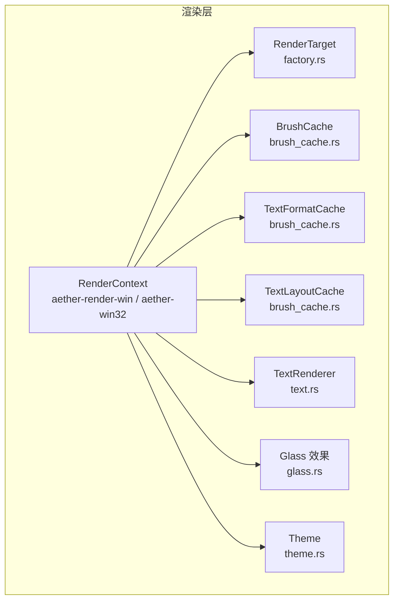
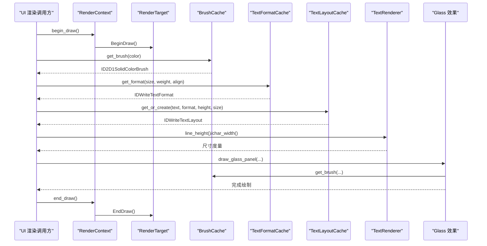
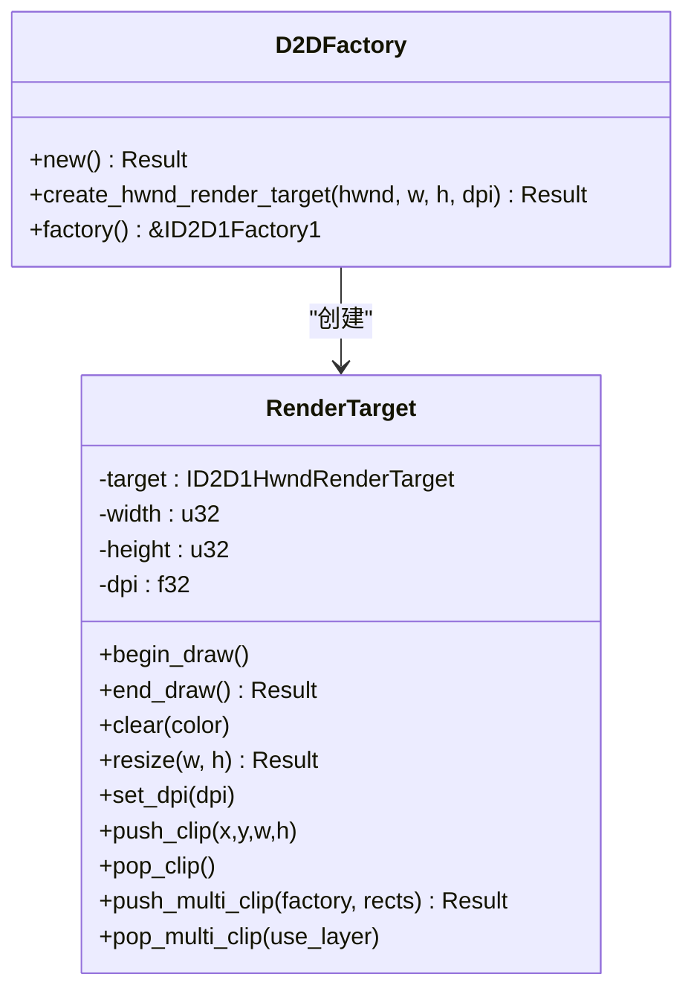
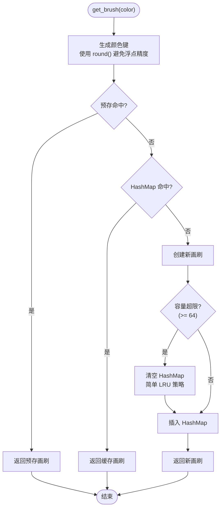
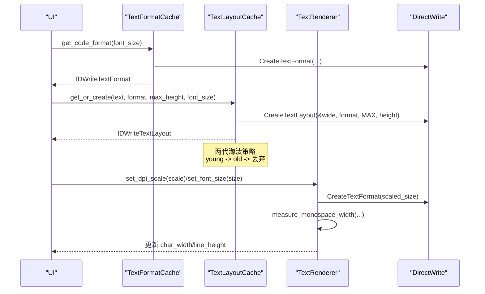
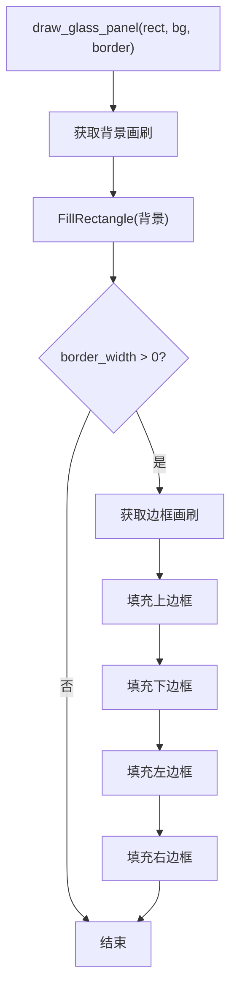
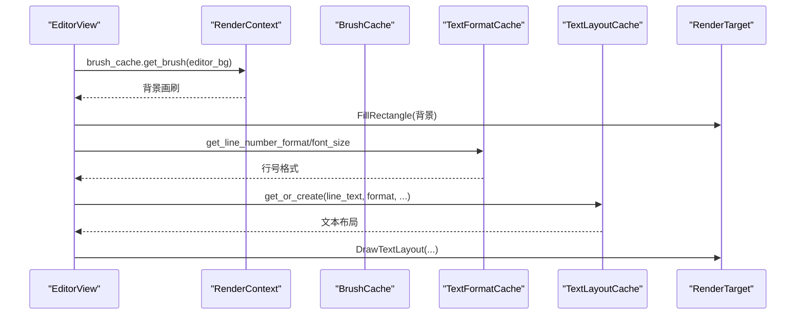
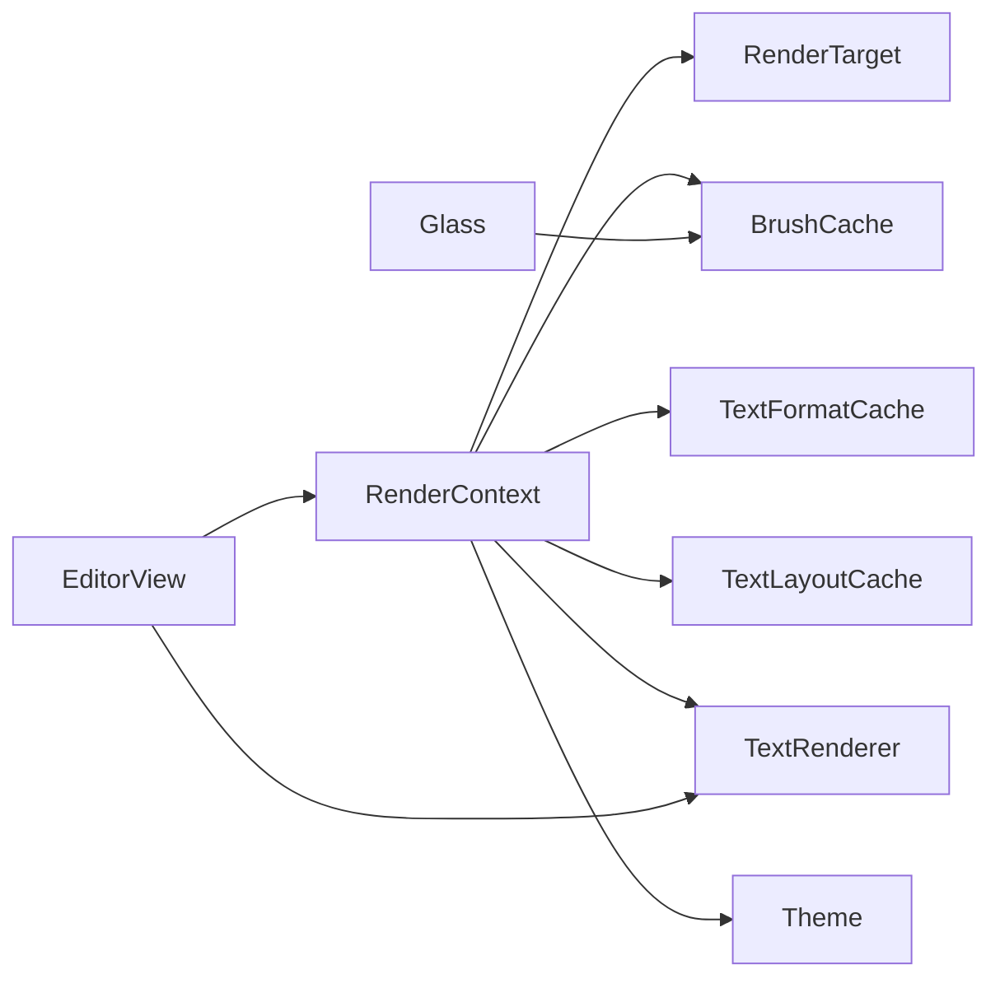

# Direct2D 渲染

<cite>
**本文引用的文件**
- [aether-render/src/d2d/mod.rs](file://crates/aether-render/src/d2d/mod.rs)
- [aether-render/src/d2d/brush_cache.rs](file://crates/aether-render/src/d2d/brush_cache.rs)
- [aether-render/src/d2d/text.rs](file://crates/aether-render/src/d2d/text.rs)
- [aether-render/src/d2d/glass.rs](file://crates/aether-render/src/d2d/glass.rs)
- [aether-render/src/d2d/factory.rs](file://crates/aether-render/src/d2d/factory.rs)
- [aether-render-win/src/render_context.rs](file://crates/aether-render-win/src/render_context.rs)
- [aether-win32/src/render_context.rs](file://crates/aether-win32/src/render_context.rs)
- [aether-render/src/theme.rs](file://crates/aether-render/src/theme.rs)
- [aether-win32/src/render/editor_view.rs](file://crates/aether-win32/src/render/editor_view.rs)
</cite>

## 更新摘要
**变更内容**
- 增强了画刷缓存系统的性能优化和内存管理策略
- 改进了文本格式和布局缓存的两代淘汰机制
- 优化了颜色键生成算法以避免浮点精度问题
- 增强了多矩形裁剪区域的精确处理
- 改进了设备丢失和资源管理的健壮性

## 目录
1. [简介](#简介)
2. [项目结构](#项目结构)
3. [核心组件](#核心组件)
4. [架构总览](#架构总览)
5. [详细组件分析](#详细组件分析)
6. [依赖关系分析](#依赖关系分析)
7. [性能考量](#性能考量)
8. [故障排查指南](#故障排查指南)
9. [结论](#结论)
10. [附录：使用示例与最佳实践](#附录使用示例与最佳实践)

## 简介
本技术文档聚焦于 Direct2D 渲染模块，系统阐述 Direct2D 与 DirectWrite 的集成实现、渲染上下文管理、绘制原语封装、图形对象生命周期、增强的画刷缓存系统、文本渲染管线（字体处理、布局、字符宽度测量与 Unicode 支持）、玻璃效果（透明度与混合）的实现原理，并提供创建渲染上下文、绘制图形与处理文本的具体代码路径指引。同时给出性能调优建议与常见问题解决方案。

## 项目结构
Direct2D 渲染能力集中在 aether-render 的 d2d 子模块中，并通过 aether-render-win 与 aether-win32 的 RenderContext 暴露给上层 UI 渲染流程。关键组织方式如下：
- d2d/factory：Direct2D 工厂与 HWND 渲染目标的生命周期管理
- d2d/brush_cache：增强的画刷与文本格式/布局缓存，包含两代淘汰策略和优化的内存管理
- d2d/text：DirectWrite 文本渲染器与 DPI/字号自适应
- d2d/glass：玻璃面板、光晕选择、阴影等高级视觉效果
- theme：主题颜色与语法高亮映射
- render_context：统一封装渲染目标、缓存与常用操作（裁剪、填充、DPI 更新等）

**图表来源**
- [aether-render/src/d2d/factory.rs:14-63](file://crates/aether-render/src/d2d/factory.rs#L14-L63)
- [aether-render/src/d2d/brush_cache.rs:24-105](file://crates/aether-render/src/d2d/brush_cache.rs#L24-L105)
- [aether-render/src/d2d/text.rs:9-52](file://crates/aether-render/src/d2d/text.rs#L9-L52)
- [aether-render/src/d2d/glass.rs:12-62](file://crates/aether-render/src/d2d/glass.rs#L12-L62)
- [aether-render/src/theme.rs:8-31](file://crates/aether-render/src/theme.rs#L8-L31)
- [aether-render-win/src/render_context.rs:6-31](file://crates/aether-render-win/src/render_context.rs#L6-L31)

**章节来源**
- [aether-render/src/d2d/mod.rs:1-5](file://crates/aether-render/src/d2d/mod.rs#L1-L5)
- [aether-render/src/d2d/factory.rs:14-63](file://crates/aether-render/src/d2d/factory.rs#L14-L63)
- [aether-render/src/d2d/brush_cache.rs:24-105](file://crates/aether-render/src/d2d/brush_cache.rs#L24-L105)
- [aether-render/src/d2d/text.rs:9-52](file://crates/aether-render/src/d2d/text.rs#L9-L52)
- [aether-render/src/d2d/glass.rs:12-62](file://crates/aether-render/src/d2d/glass.rs#L12-L62)
- [aether-render/src/theme.rs:8-31](file://crates/aether-render/src/theme.rs#L8-L31)
- [aether-render-win/src/render_context.rs:6-31](file://crates/aether-render-win/src/render_context.rs#L6-L31)

## 核心组件
- 渲染目标与工厂：通过 D2DFactory 创建硬件加速的 HWND 渲染目标，封装 BeginDraw/EndDraw/Resize/DPI 更新与裁剪区域管理。
- **增强的画刷缓存**：预存常用颜色画刷 + HashMap 回退，采用优化的内存管理策略，控制最大条目数并支持设备丢失清理。
- **改进的文本格式与布局缓存**：预置常用 TextFormat；对 IDWriteTextLayout 采用两代淘汰策略（young/old），避免周期性全清导致的掉帧。
- 文本渲染器：基于 DirectWrite 创建字体格式，动态测量等宽字符宽度，支持 DPI 缩放与字号调整。
- 玻璃效果：提供半透明面板、柔和边框、光晕选择与阴影绘制工具函数，配合 BrushCache 复用画刷。
- 主题系统：集中定义 UI 颜色与语法高亮色，支持深色与毛玻璃两种主题模式。

**章节来源**
- [aether-render/src/d2d/factory.rs:14-63](file://crates/aether-render/src/d2d/factory.rs#L14-L63)
- [aether-render/src/d2d/brush_cache.rs:24-105](file://crates/aether-render/src/d2d/brush_cache.rs#L24-L105)
- [aether-render/src/d2d/brush_cache.rs:107-138](file://crates/aether-render/src/d2d/brush_cache.rs#L107-L138)
- [aether-render/src/d2d/brush_cache.rs:381-497](file://crates/aether-render/src/d2d/brush_cache.rs#L381-L497)
- [aether-render/src/d2d/text.rs:9-52](file://crates/aether-render/src/d2d/text.rs#L9-L52)
- [aether-render/src/d2d/glass.rs:12-62](file://crates/aether-render/src/d2d/glass.rs#L12-L62)
- [aether-render/src/theme.rs:8-31](file://crates/aether-render/src/theme.rs#L8-L31)

## 架构总览
Direct2D 渲染由 RenderContext 统一管理，协调工厂、渲染目标与各类缓存；UI 渲染调用方通过 RenderContext 获取 ID2D1HwndRenderTarget 进行绘制，并使用 BrushCache/TextFormatCache/TextLayoutCache 减少 COM 对象分配。文本渲染借助 DirectWrite 完成字体与布局计算，玻璃效果通过组合矩形填充与透明度实现。

**图表来源**
- [aether-render-win/src/render_context.rs:65-79](file://crates/aether-render-win/src/render_context.rs#L65-L79)
- [aether-render/src/d2d/brush_cache.rs:67-98](file://crates/aether-render/src/d2d/brush_cache.rs#L67-L98)
- [aether-render/src/d2d/brush_cache.rs:225-268](file://crates/aether-render/src/d2d/brush_cache.rs#L225-L268)
- [aether-render/src/d2d/brush_cache.rs:413-456](file://crates/aether-render/src/d2d/brush_cache.rs#L413-L456)
- [aether-render/src/d2d/text.rs:69-97](file://crates/aether-render/src/d2d/text.rs#L69-L97)
- [aether-render/src/d2d/glass.rs:12-62](file://crates/aether-render/src/d2d/glass.rs#L12-L62)

## 详细组件分析

### 渲染上下文管理（RenderTarget 与 D2DFactory）
- 工厂创建单线程 Direct2D 工厂，支持硬件加速渲染目标。
- RenderTarget 封装 BeginDraw/EndDraw/Clear/Resize/SetDpi/PushClip/PopClip。
- 多矩形裁剪：当需要多个独立矩形的并集裁剪时，使用 GeometryGroup（Union）+ PushLayer 精确裁剪，失败时回退到合并包围盒的 AxisAlignedClip。

**图表来源**
- [aether-render/src/d2d/factory.rs:14-63](file://crates/aether-render/src/d2d/factory.rs#L14-L63)
- [aether-render/src/d2d/factory.rs:65-162](file://crates/aether-render/src/d2d/factory.rs#L65-L162)
- [aether-render/src/d2d/factory.rs:172-273](file://crates/aether-render/src/d2d/factory.rs#L172-L273)

**章节来源**
- [aether-render/src/d2d/factory.rs:14-63](file://crates/aether-render/src/d2d/factory.rs#L14-L63)
- [aether-render/src/d2d/factory.rs:65-162](file://crates/aether-render/src/d2d/factory.rs#L65-L162)
- [aether-render/src/d2d/factory.rs:172-273](file://crates/aether-render/src/d2d/factory.rs#L172-L273)

### 增强的画刷缓存系统（BrushCache）
**更新** 画刷缓存系统得到了显著的性能优化和内存管理改进：

- **设计要点**：
  - 预存常用颜色画刷（小数组线性扫描，命中率高时比 HashMap 快）。
  - 未命中则回退到 FxHashMap 存储，超过最大条目数时清空以避免无界增长。
  - **改进的颜色键生成**：使用 round() 避免浮点精度问题（如 0.47 * 255 = 119.85 截断为 119，round 为 120），确保缓存一致性。
  - **优化的内存管理**：MAX_BRUSH_CACHE_ENTRIES 设置为 64，超出时清空整个 HashMap 作为简单 LRU 替代方案。
- **生命周期**：
  - init_common_brushes：在渲染目标就绪后一次性初始化常用画刷。
  - clear：设备丢失或冻结态释放时清空缓存。

**图表来源**
- [aether-render/src/d2d/brush_cache.rs:67-98](file://crates/aether-render/src/d2d/brush_cache.rs#L67-L98)
- [aether-render/src/d2d/brush_cache.rs:499-507](file://crates/aether-render/src/d2d/brush_cache.rs#L499-L507)
- [aether-render/src/d2d/brush_cache.rs:554-561](file://crates/aether-render/src/d2d/brush_cache.rs#L554-L561)

**章节来源**
- [aether-render/src/d2d/brush_cache.rs:24-105](file://crates/aether-render/src/d2d/brush_cache.rs#L24-L105)
- [aether-render/src/d2d/brush_cache.rs:499-507](file://crates/aether-render/src/d2d/brush_cache.rs#L499-L507)
- [aether-render/src/d2d/brush_cache.rs:554-561](file://crates/aether-render/src/d2d/brush_cache.rs#L554-L561)

### 改进的文本格式与布局缓存
**更新** 文本缓存系统采用了更智能的两代淘汰策略：

- **文本格式缓存（TextFormatCache）**：
  - 预置三种常用格式：代码左对齐、行号右对齐、居中。
  - 通过内部方法创建 IDWriteTextFormat，设置对齐与段落对齐。
  - 提供 measure_text_width 与 text_position_x 用于精确测量与光标定位。
- **文本布局缓存（TextLayoutCache）**：
  - **两代淘汰策略**：年轻代（young）和老代（old），热点条目晋升回 young，避免周期性全清导致掉帧。
  - 字体大小变化时自动清空缓存，确保布局一致性。
  - 支持带省略号的布局（侧边栏长文本截断）。
  - MAX_TEXT_LAYOUT_CACHE_ENTRIES 设置为 256，young 满时整代下沉为 old。

**图表来源**
- [aether-render/src/d2d/brush_cache.rs:128-193](file://crates/aether-render/src/d2d/brush_cache.rs#L128-L193)
- [aether-render/src/d2d/brush_cache.rs:225-268](file://crates/aether-render/src/d2d/brush_cache.rs#L225-L268)
- [aether-render/src/d2d/brush_cache.rs:315-378](file://crates/aether-render/src/d2d/brush_cache.rs#L315-L378)
- [aether-render/src/d2d/brush_cache.rs:413-456](file://crates/aether-render/src/d2d/brush_cache.rs#L413-L456)
- [aether-render/src/d2d/text.rs:20-52](file://crates/aether-render/src/d2d/text.rs#L20-L52)
- [aether-render/src/d2d/text.rs:54-67](file://crates/aether-render/src/d2d/text.rs#L54-L67)
- [aether-render/src/d2d/text.rs:69-97](file://crates/aether-render/src/d2d/text.rs#L69-L97)
- [aether-render/src/d2d/text.rs:99-127](file://crates/aether-render/src/d2d/text.rs#L99-L127)

**章节来源**
- [aether-render/src/d2d/brush_cache.rs:107-138](file://crates/aether-render/src/d2d/brush_cache.rs#L107-L138)
- [aether-render/src/d2d/brush_cache.rs:225-268](file://crates/aether-render/src/d2d/brush_cache.rs#L225-L268)
- [aether-render/src/d2d/brush_cache.rs:315-378](file://crates/aether-render/src/d2d/brush_cache.rs#L315-L378)
- [aether-render/src/d2d/brush_cache.rs:381-497](file://crates/aether-render/src/d2d/brush_cache.rs#L381-L497)
- [aether-render/src/d2d/text.rs:9-52](file://crates/aether-render/src/d2d/text.rs#L9-L52)
- [aether-render/src/d2d/text.rs:54-67](file://crates/aether-render/src/d2d/text.rs#L54-L67)
- [aether-render/src/d2d/text.rs:69-97](file://crates/aether-render/src/d2d/text.rs#L69-L97)
- [aether-render/src/d2d/text.rs:99-127](file://crates/aether-render/src/d2d/text.rs#L99-L127)

### 玻璃效果（Glass Effect）
- 半透明面板：通过 BrushCache 获取背景与边框画刷，填充矩形并叠加边框。
- 光晕选择：外层降低透明度放大矩形模拟发光，内层正常透明度填充选中区。
- 阴影与圆角模拟：底部阴影矩形与顶部高光条模拟圆角与层次感。
- 透明度与混合：利用 D2D1_COLOR_F 的 alpha 通道实现混合，无需额外混合状态切换。

**图表来源**
- [aether-render/src/d2d/glass.rs:12-62](file://crates/aether-render/src/d2d/glass.rs#L12-L62)

**章节来源**
- [aether-render/src/d2d/glass.rs:12-62](file://crates/aether-render/src/d2d/glass.rs#L12-L62)
- [aether-render/src/d2d/glass.rs:64-95](file://crates/aether-render/src/d2d/glass.rs#L64-L95)
- [aether-render/src/d2d/glass.rs:97-116](file://crates/aether-render/src/d2d/glass.rs#L97-L116)
- [aether-render/src/d2d/glass.rs:118-154](file://crates/aether-render/src/d2d/glass.rs#L118-L154)

### 编辑器视图中的绘制原语封装
- 编辑器背景、行号区、分隔线、选区高亮、当前行高亮、行号前景、光标等全部通过 BrushCache 获取画刷。
- 文本格式通过 TextFormatCache 获取，布局通过 TextLayoutCache 缓存。
- 使用 PushAxisAlignedClip 限制编辑区绘制范围，避免滚动时覆盖上层 UI。

**图表来源**
- [aether-win32/src/render/editor_view.rs:55-124](file://crates/aether-win32/src/render/editor_view.rs#L55-L124)
- [aether-win32/src/render/editor_view.rs:126-158](file://crates/aether-win32/src/render/editor_view.rs#L126-L158)

**章节来源**
- [aether-win32/src/render/editor_view.rs:55-124](file://crates/aether-win32/src/render/editor_view.rs#L55-L124)
- [aether-win32/src/render/editor_view.rs:126-158](file://crates/aether-win32/src/render/editor_view.rs#L126-L158)

## 依赖关系分析
- RenderContext 依赖 D2DFactory/RenderTarget 管理渲染目标，依赖 BrushCache/TextFormatCache/TextLayoutCache 管理资源。
- TextRenderer 依赖 DirectWrite 工厂与字体格式，负责 DPI/字号自适应与字符宽度测量。
- Glass 效果依赖 BrushCache 获取画刷，不直接持有渲染目标。
- Theme 提供颜色常量，供各模块统一配色。

**图表来源**
- [aether-render-win/src/render_context.rs:6-31](file://crates/aether-render-win/src/render_context.rs#L6-L31)
- [aether-render/src/d2d/brush_cache.rs:24-105](file://crates/aether-render/src/d2d/brush_cache.rs#L24-L105)
- [aether-render/src/d2d/text.rs:9-52](file://crates/aether-render/src/d2d/text.rs#L9-L52)
- [aether-render/src/d2d/glass.rs:12-62](file://crates/aether-render/src/d2d/glass.rs#L12-L62)
- [aether-render/src/theme.rs:8-31](file://crates/aether-render/src/theme.rs#L8-L31)
- [aether-win32/src/render/editor_view.rs:55-124](file://crates/aether-win32/src/render/editor_view.rs#L55-L124)

**章节来源**
- [aether-render-win/src/render_context.rs:6-31](file://crates/aether-render-win/src/render_context.rs#L6-L31)
- [aether-render/src/d2d/brush_cache.rs:24-105](file://crates/aether-render/src/d2d/brush_cache.rs#L24-L105)
- [aether-render/src/d2d/text.rs:9-52](file://crates/aether-render/src/d2d/text.rs#L9-L52)
- [aether-render/src/d2d/glass.rs:12-62](file://crates/aether-render/src/d2d/glass.rs#L12-L62)
- [aether-render/src/theme.rs:8-31](file://crates/aether-render/src/theme.rs#L8-L31)
- [aether-win32/src/render/editor_view.rs:55-124](file://crates/aether-win32/src/render/editor_view.rs#L55-L124)

## 性能考量
**更新** 画刷缓存系统的性能优化：

- **增强的画刷缓存**：
  - 预存常用颜色画刷，线性扫描命中快；HashMap 回退控制最大条目数（64），避免内存膨胀。
  - **改进的颜色键生成**：使用 round() 避免浮点精度导致的缓存失效，提高缓存命中率。
  - **优化的内存管理**：采用简单 LRU 策略，超出容量时清空整个 HashMap 而非逐个删除。
- **改进的文本格式与布局缓存**：
  - 预置常用 TextFormat，减少频繁创建开销。
  - **两代淘汰策略**：TextLayoutCache 采用 young/old 两代淘汰，热点条目自然存活，消除周期性全清导致的掉帧。
  - 字体大小变化时自动清空缓存，保证布局正确性。
- **精确的多矩形裁剪**：
  - 单矩形走 PushAxisAlignedClip 快路径；多矩形使用 GeometryGroup + PushLayer 精确裁剪，失败回退到合并包围盒。
- **DPI 与字号**：
  - 通过 TextRenderer 动态重建字体格式并重新测量字符宽度，避免硬编码比例带来的错位。
- **主题与颜色**：
  - 统一 Theme 颜色，减少重复构造；常用颜色预初始化画刷，提升首帧与高频绘制性能。

## 故障排查指南
**更新** 改进了设备丢失和资源管理的健壮性：

- **设备丢失**：
  - 现象：渲染目标失效，COM 对象不可用。
  - 处理：调用 handle_device_lost 清空 target 与缓存，随后重建渲染目标与预初始化资源。
- **冰冻态资源释放**：
  - 现象：应用进入后台或冻结态，需释放 GPU 相关资源。
  - 处理：release_for_suspend 复用设备丢失路径，并额外清空 TextLayout 缓存。
- **多矩形裁剪异常**：
  - 现象：部分区域未被裁剪或渲染错乱。
  - 处理：检查 push_multi_clip 是否成功，若失败会回退到合并包围盒；确认几何变换矩阵非退化。
- **文本布局偏差**：
  - 现象：光标位置与点击位置不一致。
  - 处理：确保 TextLayout 创建时不包含 null 终止符，与 measure_monospace_width 保持一致；使用 HitTestTextPosition 获取精确坐标。
- **画刷缓存失效**：
  - 现象：相同颜色多次创建画刷，性能下降。
  - 处理：检查颜色键生成是否正确，确保使用 round() 避免浮点精度问题。

**章节来源**
- [aether-render-win/src/render_context.rs:219-231](file://crates/aether-render-win/src/render_context.rs#L219-L231)
- [aether-render/src/d2d/factory.rs:172-273](file://crates/aether-render/src/d2d/factory.rs#L172-L273)
- [aether-render/src/d2d/brush_cache.rs:413-456](file://crates/aether-render/src/d2d/brush_cache.rs#L413-L456)
- [aether-render/src/d2d/brush_cache.rs:315-378](file://crates/aether-render/src/d2d/brush_cache.rs#L315-L378)
- [aether-render/src/d2d/brush_cache.rs:554-561](file://crates/aether-render/src/d2d/brush_cache.rs#L554-L561)

## 结论
该 Direct2D 渲染模块通过分层设计与增强的缓存策略，有效降低了 COM 对象分配与创建开销，提升了渲染性能与稳定性。**最新的画刷缓存系统增强**包括优化的内存管理、改进的颜色键生成算法和两代淘汰策略，进一步提高了缓存效率和性能表现。结合 DirectWrite 的文本布局与测量能力，实现了高精度的文本渲染与交互体验。玻璃效果通过透明度与混合实现现代 UI 视觉风格。整体架构清晰、职责明确，便于扩展与维护。

## 附录：使用示例与最佳实践
**更新** 基于增强的画刷缓存系统的最佳实践：

- 创建渲染上下文与初始化：
  - 参考 RenderContext::new 与 init_render_target，传入 HWND、物理尺寸与 DPI 缩放。
  - 参考 init_common_resources，预初始化常用画刷与文本格式。
- 绘制图形：
  - 使用 BrushCache::get_brush 获取画刷，调用 RenderTarget::FillRectangle 绘制背景与边框。
  - 使用 glass.rs 中的 draw_glass_panel、draw_glow_selection、draw_panel_shadow 快速实现玻璃效果。
- 处理文本：
  - 使用 TextFormatCache::get_code_format/get_line_number_format 获取文本格式。
  - 使用 TextLayoutCache::get_or_create 获取文本布局，避免每帧创建。
  - 使用 TextRenderer::set_dpi_scale/set_font_size 动态调整 DPI 与字号，并重新测量字符宽度。
- **最佳实践**：
  - 始终通过 BrushCache/TextFormatCache/TextLayoutCache 获取资源，避免重复创建。
  - **利用增强的缓存策略**：预存常用颜色以获得最佳性能，让系统自动管理内存。
  - 使用裁剪区域限制绘制范围，减少无效绘制。
  - 处理设备丢失与冻结态，及时释放与重建资源。
  - 主题颜色统一通过 Theme 管理，保持视觉一致性。
  - **注意颜色精度**：系统会自动处理浮点精度问题，但自定义颜色时应保持一致的精度。

**章节来源**
- [aether-render-win/src/render_context.rs:21-46](file://crates/aether-render-win/src/render_context.rs#L21-L46)
- [aether-render-win/src/render_context.rs:189-217](file://crates/aether-render-win/src/render_context.rs#L189-L217)
- [aether-render/src/d2d/brush_cache.rs:67-98](file://crates/aether-render/src/d2d/brush_cache.rs#L67-L98)
- [aether-render/src/d2d/glass.rs:12-62](file://crates/aether-render/src/d2d/glass.rs#L12-L62)
- [aether-render/src/d2d/brush_cache.rs:225-268](file://crates/aether-render/src/d2d/brush_cache.rs#L225-L268)
- [aether-render/src/d2d/brush_cache.rs:413-456](file://crates/aether-render/src/d2d/brush_cache.rs#L413-L456)
- [aether-render/src/d2d/text.rs:69-97](file://crates/aether-render/src/d2d/text.rs#L69-L97)
- [aether-render/src/d2d/text.rs:99-127](file://crates/aether-render/src/d2d/text.rs#L99-L127)
- [aether-render/src/d2d/brush_cache.rs:554-561](file://crates/aether-render/src/d2d/brush_cache.rs#L554-L561)