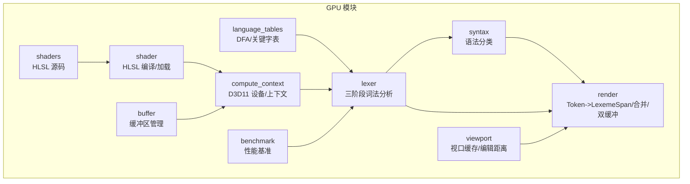
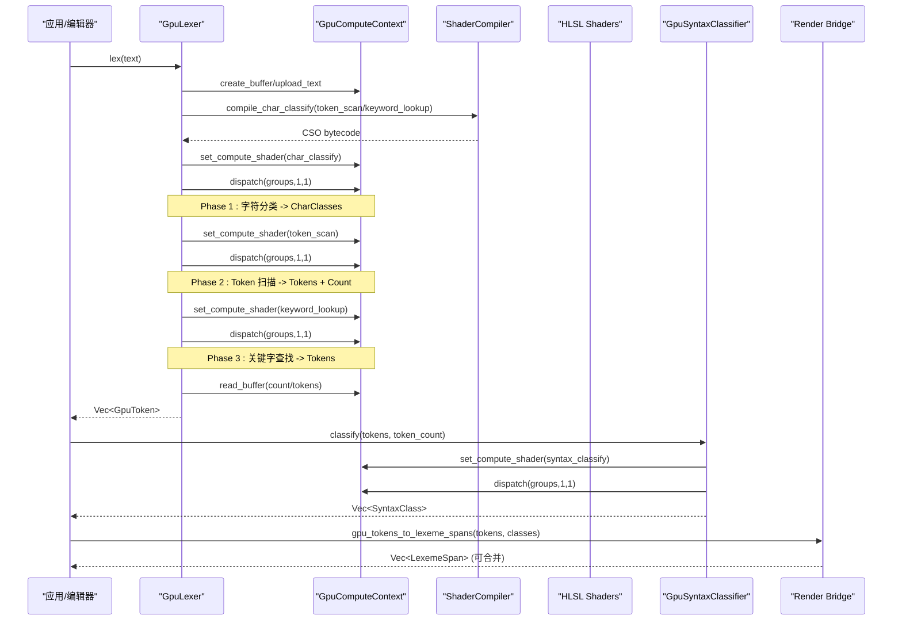
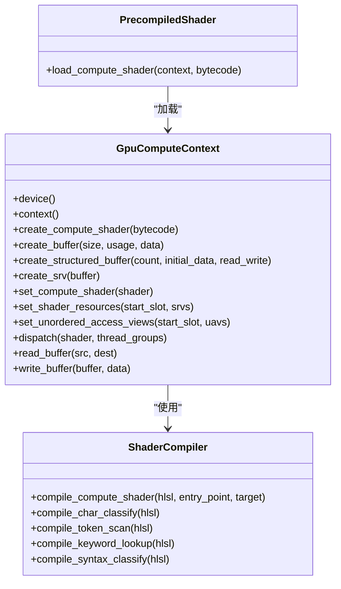
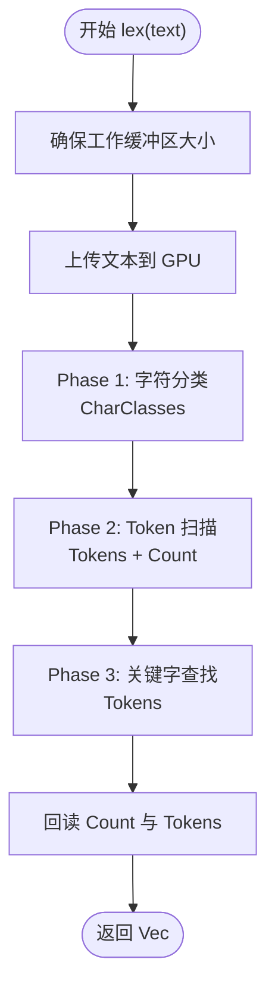
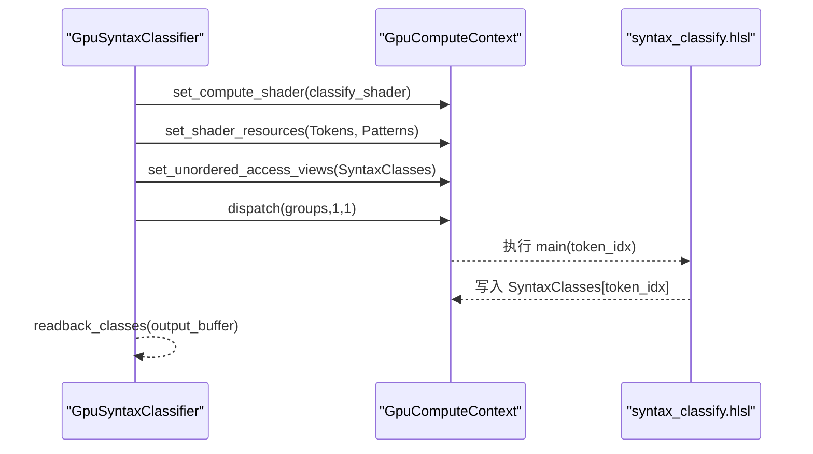
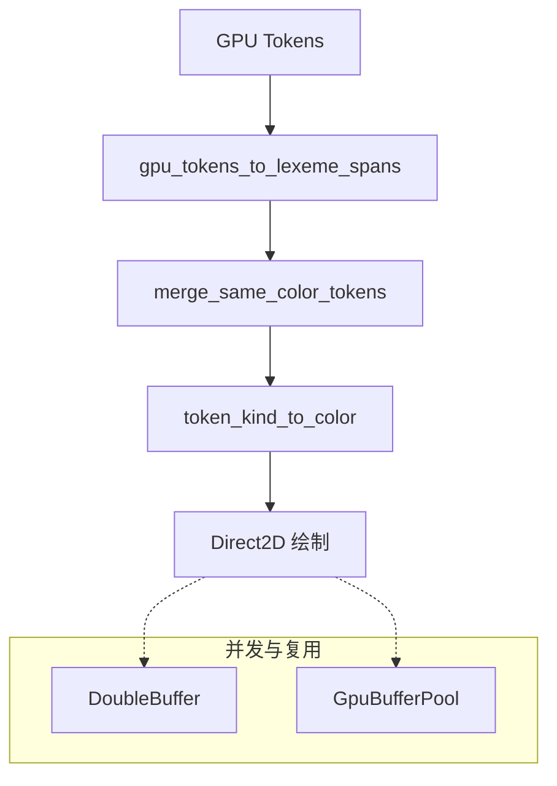
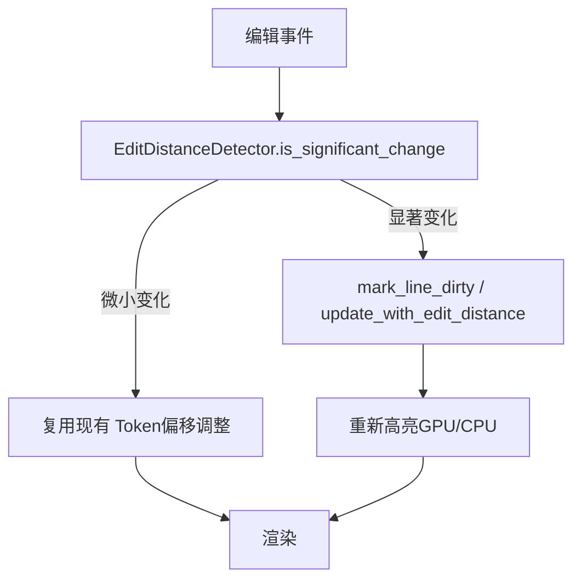
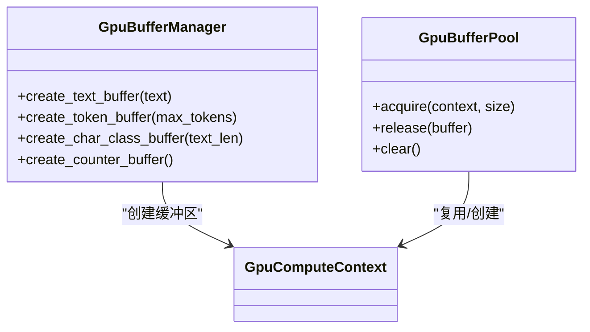
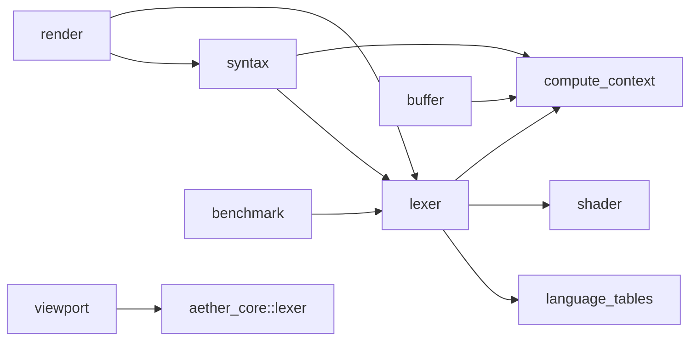

# GPU 加速

<cite>
**本文引用的文件**
- [crates/aether-render/src/gpu/mod.rs](file://crates/aether-render/src/gpu/mod.rs)
- [crates/aether-render/src/gpu/compute_context.rs](file://crates/aether-render/src/gpu/compute_context.rs)
- [crates/aether-render/src/gpu/shader.rs](file://crates/aether-render/src/gpu/shader.rs)
- [crates/aether-render/src/gpu/lexer.rs](file://crates/aether-render/src/gpu/lexer.rs)
- [crates/aether-render/src/gpu/syntax.rs](file://crates/aether-render/src/gpu/syntax.rs)
- [crates/aether-render/src/gpu/render.rs](file://crates/aether-render/src/gpu/render.rs)
- [crates/aether-render/src/gpu/viewport.rs](file://crates/aether-render/src/gpu/viewport.rs)
- [crates/aether-render/src/gpu/language_tables.rs](file://crates/aether-render/src/gpu/language_tables.rs)
- [crates/aether-render/src/gpu/buffer.rs](file://crates/aether-render/src/gpu/buffer.rs)
- [crates/aether-render/src/gpu/benchmark.rs](file://crates/aether-render/src/gpu/benchmark.rs)
- [crates/aether-render/src/gpu/shaders/char_classify.hlsl](file://crates/aether-render/src/gpu/shaders/char_classify.hlsl)
- [crates/aether-render/src/gpu/shaders/token_scan.hlsl](file://crates/aether-render/src/gpu/shaders/token_scan.hlsl)
- [crates/aether-render/src/gpu/shaders/keyword_lookup.hlsl](file://crates/aether-render/src/gpu/shaders/keyword_lookup.hlsl)
- [crates/aether-render/src/gpu/shaders/syntax_classify.hlsl](file://crates/aether-render/src/gpu/shaders/syntax_classify.hlsl)
</cite>

## 目录
1. [简介](#简介)
2. [项目结构](#项目结构)
3. [核心组件](#核心组件)
4. [架构总览](#架构总览)
5. [详细组件分析](#详细组件分析)
6. [依赖关系分析](#依赖关系分析)
7. [性能考量](#性能考量)
8. [故障排查指南](#故障排查指南)
9. [结论](#结论)
10. [附录：示例与最佳实践](#附录示例与最佳实践)

## 简介
本技术文档聚焦于 GPU 加速模块，围绕 Direct3D 11 Compute Shader 实现语法高亮的并行化词法分析与语法分类。内容涵盖：
- HLSL 着色器编写与编译（字符分类、Token 扫描、关键字查找、语法分类）
- GPU 内存管理（缓冲区、SRV/UAV、常量缓冲区、暂存缓冲）
- 并行计算优化（线程组划分、原子计数、共享内存、批处理）
- 渲染管线集成（Token 到 LexemeSpan 转换、合并同色 Token、双缓冲与内存池）
- 视口管理与语言表（增量高亮缓存、编辑距离检测、DFA/关键字表生成）
- 具体代码路径与调用序列，便于快速定位实现
- 性能基准测试方法与优化建议
- GPU 兼容性与错误处理策略

## 项目结构
GPU 模块位于 aether-render crate 的 gpu 子模块中，按职责划分为：
- compute_context：D3D11 设备/上下文封装，Compute Shader 生命周期管理
- shader：HLSL 编译与预编译加载、常量缓冲区创建
- lexer：三阶段并行词法分析（字符分类 -> Token 扫描 -> 关键字查找）
- syntax：基于 Token 流的简单语法模式匹配（函数声明/调用、类型名、变量等）
- render：GPU 结果到渲染器的桥接（TokenKind 映射、合并同色 Span、双缓冲与 GPU 缓冲池）
- viewport：视口级增量高亮缓存与编辑距离检测
- language_tables：多语言 DFA 与关键字表生成
- buffer：通用 GPU 缓冲区管理器
- benchmark：性能基准测试工具与测试数据生成
- shaders：HLSL 源码（字符分类、Token 扫描、关键字查找、语法分类）

图表来源
- [crates/aether-render/src/gpu/mod.rs:1-10](file://crates/aether-render/src/gpu/mod.rs#L1-L10)
- [crates/aether-render/src/gpu/compute_context.rs:17-45](file://crates/aether-render/src/gpu/compute_context.rs#L17-L45)
- [crates/aether-render/src/gpu/shader.rs:7-15](file://crates/aether-render/src/gpu/shader.rs#L7-L15)
- [crates/aether-render/src/gpu/lexer.rs:48-77](file://crates/aether-render/src/gpu/lexer.rs#L48-L77)
- [crates/aether-render/src/gpu/syntax.rs:39-54](file://crates/aether-render/src/gpu/syntax.rs#L39-L54)
- [crates/aether-render/src/gpu/render.rs:116-126](file://crates/aether-render/src/gpu/render.rs#L116-L126)
- [crates/aether-render/src/gpu/viewport.rs:3-22](file://crates/aether-render/src/gpu/viewport.rs#L3-L22)
- [crates/aether-render/src/gpu/language_tables.rs:1-35](file://crates/aether-render/src/gpu/language_tables.rs#L1-L35)
- [crates/aether-render/src/gpu/buffer.rs:6-16](file://crates/aether-render/src/gpu/buffer.rs#L6-L16)
- [crates/aether-render/src/gpu/benchmark.rs:3-9](file://crates/aether-render/src/gpu/benchmark.rs#L3-L9)

章节来源
- [crates/aether-render/src/gpu/mod.rs:1-10](file://crates/aether-render/src/gpu/mod.rs#L1-L10)

## 核心组件
- GpuComputeContext：封装 D3D11 设备与上下文，提供 CreateComputeShader、CreateBuffer、CreateStructuredBuffer、CreateSRV、Dispatch、Set* 等方法；支持 Staging 缓冲用于 CPU/GPU 数据回读/上传。
- ShaderCompiler/PrecompiledShader：使用 d3dcompiler_47.dll 将 HLSL 源码编译为 CSO，或从嵌入字节码加载；提供便捷方法针对四个阶段的 Shader 编译。
- GpuLexer：三阶段并行词法分析：
  - Phase 1：字符分类（char_classify.hlsl），每个线程处理一个字符，输出 CharClasses
  - Phase 2：Token 扫描（token_scan.hlsl），识别 Token 边界并写入 Tokens，使用原子计数器统计数量
  - Phase 3：关键字查找（keyword_lookup.hlsl），基于完美哈希表将标识符升级为关键字
- GpuSyntaxClassifier：基于 Token 流与语法模式进行 GPU 并行分类，输出 SyntaxClass（类别与置信度）
- Render 桥接：gpu_tokens_to_lexeme_spans 将 GPU Token 转换为 LexemeSpan；merge_same_color_tokens 合并相邻同色 Token 减少 DrawText 调用；DoubleBuffer/GpuBufferPool 提升并发与复用效率
- ViewportHighlightCache：视口级增量高亮缓存，维护窗口范围、版本、脏行标记与文本内容，结合 EditDistanceDetector 判断是否需要重新高亮
- LanguageTables：为多种语言生成 DFA 状态转换表与关键字哈希表，供 GPU 词法分析使用
- BufferManager：统一创建文本输入、Token 输出、字符分类、计数器缓冲区
- Benchmark：运行基准测试，统计平均/最小/最大耗时、吞吐量 MB/s、每行延迟 ms/line，并生成报告

章节来源
- [crates/aether-render/src/gpu/compute_context.rs:17-45](file://crates/aether-render/src/gpu/compute_context.rs#L17-L45)
- [crates/aether-render/src/gpu/shader.rs:7-15](file://crates/aether-render/src/gpu/shader.rs#L7-L15)
- [crates/aether-render/src/gpu/lexer.rs:48-77](file://crates/aether-render/src/gpu/lexer.rs#L48-L77)
- [crates/aether-render/src/gpu/syntax.rs:39-54](file://crates/aether-render/src/gpu/syntax.rs#L39-L54)
- [crates/aether-render/src/gpu/render.rs:7-126](file://crates/aether-render/src/gpu/render.rs#L7-L126)
- [crates/aether-render/src/gpu/viewport.rs:3-22](file://crates/aether-render/src/gpu/viewport.rs#L3-L22)
- [crates/aether-render/src/gpu/language_tables.rs:1-35](file://crates/aether-render/src/gpu/language_tables.rs#L1-L35)
- [crates/aether-render/src/gpu/buffer.rs:6-16](file://crates/aether-render/src/gpu/buffer.rs#L6-L16)
- [crates/aether-render/src/gpu/benchmark.rs:3-9](file://crates/aether-render/src/gpu/benchmark.rs#L3-L9)

## 架构总览
GPU 加速的高亮流程分为“词法分析”和“语法分类”两大部分，最终桥接到渲染层。

图表来源
- [crates/aether-render/src/gpu/lexer.rs:187-221](file://crates/aether-render/src/gpu/lexer.rs#L187-L221)
- [crates/aether-render/src/gpu/shader.rs:22-100](file://crates/aether-render/src/gpu/shader.rs#L22-L100)
- [crates/aether-render/src/gpu/compute_context.rs:96-241](file://crates/aether-render/src/gpu/compute_context.rs#L96-L241)
- [crates/aether-render/src/gpu/syntax.rs:93-124](file://crates/aether-render/src/gpu/syntax.rs#L93-L124)
- [crates/aether-render/src/gpu/render.rs:10-32](file://crates/aether-render/src/gpu/render.rs#L10-L32)

## 详细组件分析

### 计算上下文与着色器生命周期
- 设备创建：支持从 D2D Factory 获取底层 D3D11 设备，或独立创建硬件设备（Feature Level 11.0）
- 资源创建：结构化缓冲区（SRV/UAV）、常量缓冲区、SRV、Staging 缓冲
- 执行调度：设置 Compute Shader、绑定 SRV/UAV、Dispatch 线程组
- 数据回读：通过 Staging 缓冲 Map/Unmap 读取 GPU 结果

图表来源
- [crates/aether-render/src/gpu/compute_context.rs:17-241](file://crates/aether-render/src/gpu/compute_context.rs#L17-L241)
- [crates/aether-render/src/gpu/shader.rs:7-116](file://crates/aether-render/src/gpu/shader.rs#L7-L116)

章节来源
- [crates/aether-render/src/gpu/compute_context.rs:17-241](file://crates/aether-render/src/gpu/compute_context.rs#L17-L241)
- [crates/aether-render/src/gpu/shader.rs:7-116](file://crates/aether-render/src/gpu/shader.rs#L7-L116)

### 并行词法分析（三阶段）
- Phase 1 字符分类：每个线程处理一个字符，查表得到 CharClasses
- Phase 2 Token 扫描：识别 Token 起始位置，计算长度，写入 Tokens，原子递增计数
- Phase 3 关键字查找：对标识符进行 FNV-1a 哈希，查找完美哈希表，更新为关键字

图表来源
- [crates/aether-render/src/gpu/lexer.rs:187-221](file://crates/aether-render/src/gpu/lexer.rs#L187-L221)
- [crates/aether-render/src/gpu/shaders/char_classify.hlsl:81-88](file://crates/aether-render/src/gpu/shaders/char_classify.hlsl#L81-L88)
- [crates/aether-render/src/gpu/shaders/token_scan.hlsl:141-312](file://crates/aether-render/src/gpu/shaders/token_scan.hlsl#L141-L312)
- [crates/aether-render/src/gpu/shaders/keyword_lookup.hlsl:85-101](file://crates/aether-render/src/gpu/shaders/keyword_lookup.hlsl#L85-L101)

章节来源
- [crates/aether-render/src/gpu/lexer.rs:187-221](file://crates/aether-render/src/gpu/lexer.rs#L187-L221)
- [crates/aether-render/src/gpu/shaders/token_scan.hlsl:141-312](file://crates/aether-render/src/gpu/shaders/token_scan.hlsl#L141-L312)
- [crates/aether-render/src/gpu/shaders/keyword_lookup.hlsl:85-101](file://crates/aether-render/src/gpu/shaders/keyword_lookup.hlsl#L85-L101)

### 语法分类（GPU 并行模式匹配）
- 输入：Token 列表与语法模式（语言特定）
- 处理：每个线程尝试匹配多个模式，选择最高优先级，输出 SyntaxClass（类别+置信度）
- 输出：可用于后续渲染时区分函数声明/调用、类型名、变量等

图表来源
- [crates/aether-render/src/gpu/syntax.rs:93-124](file://crates/aether-render/src/gpu/syntax.rs#L93-L124)
- [crates/aether-render/src/gpu/shaders/syntax_classify.hlsl:101-141](file://crates/aether-render/src/gpu/shaders/syntax_classify.hlsl#L101-L141)

章节来源
- [crates/aether-render/src/gpu/syntax.rs:93-124](file://crates/aether-render/src/gpu/syntax.rs#L93-L124)
- [crates/aether-render/src/gpu/shaders/syntax_classify.hlsl:101-141](file://crates/aether-render/src/gpu/shaders/syntax_classify.hlsl#L101-L141)

### 渲染管线集成（Token 到 LexemeSpan）
- 转换：gpu_tokens_to_lexeme_spans 将 GPU Token 转为 LexemeSpan，优先使用语法分类结果（置信度阈值）
- 合并：merge_same_color_tokens 合并相邻同色 Token，减少绘制调用
- 颜色映射：token_kind_to_color 根据主题映射 TokenKind 到颜色
- 双缓冲与内存池：DoubleBuffer 实现 CPU/GPU 并行读写；GpuBufferPool 复用 GPU 缓冲区降低分配开销

图表来源
- [crates/aether-render/src/gpu/render.rs:10-126](file://crates/aether-render/src/gpu/render.rs#L10-L126)
- [crates/aether-render/src/gpu/render.rs:128-220](file://crates/aether-render/src/gpu/render.rs#L128-L220)

章节来源
- [crates/aether-render/src/gpu/render.rs:10-126](file://crates/aether-render/src/gpu/render.rs#L10-L126)
- [crates/aether-render/src/gpu/render.rs:128-220](file://crates/aether-render/src/gpu/render.rs#L128-L220)

### 视口管理与语言表
- 视口缓存：ViewportHighlightCache 维护可见窗口、版本、脏行标记与文本内容；resize_window 保留重叠行，新进入窗口的行标记为脏
- 增量更新：update_with_edit_distance 使用编辑距离检测显著变化，避免全量重算
- 语言表：LanguageLexerTables 为 Rust/C/JS/Python/Go/Java/JSON/TOML/Markdown/HTML/CSS 生成 DFA 与关键字表，适配不同语言的词法分析需求

图表来源
- [crates/aether-render/src/gpu/viewport.rs:63-154](file://crates/aether-render/src/gpu/viewport.rs#L63-L154)
- [crates/aether-render/src/gpu/viewport.rs:197-294](file://crates/aether-render/src/gpu/viewport.rs#L197-L294)
- [crates/aether-render/src/gpu/language_tables.rs:18-35](file://crates/aether-render/src/gpu/language_tables.rs#L18-L35)

章节来源
- [crates/aether-render/src/gpu/viewport.rs:63-154](file://crates/aether-render/src/gpu/viewport.rs#L63-L154)
- [crates/aether-render/src/gpu/viewport.rs:197-294](file://crates/aether-render/src/gpu/viewport.rs#L197-L294)
- [crates/aether-render/src/gpu/language_tables.rs:18-35](file://crates/aether-render/src/gpu/language_tables.rs#L18-L35)

### 缓冲区与内存管理
- 结构化缓冲区：用于输入文本、字符分类、Token 列表、计数器
- SRV/UAV：只读访问（SRV）与读写访问（UAV），支持原子操作（计数器）
- Staging 缓冲：CPU 可读/写，用于回读 GPU 结果与上传数据
- 内存池：GpuBufferPool 复用缓冲区，减少频繁分配/释放

图表来源
- [crates/aether-render/src/gpu/buffer.rs:6-48](file://crates/aether-render/src/gpu/buffer.rs#L6-L48)
- [crates/aether-render/src/gpu/render.rs:161-220](file://crates/aether-render/src/gpu/render.rs#L161-L220)
- [crates/aether-render/src/gpu/compute_context.rs:116-206](file://crates/aether-render/src/gpu/compute_context.rs#L116-L206)

章节来源
- [crates/aether-render/src/gpu/buffer.rs:6-48](file://crates/aether-render/src/gpu/buffer.rs#L6-L48)
- [crates/aether-render/src/gpu/render.rs:161-220](file://crates/aether-render/src/gpu/render.rs#L161-L220)
- [crates/aether-render/src/gpu/compute_context.rs:116-206](file://crates/aether-render/src/gpu/compute_context.rs#L116-L206)

## 依赖关系分析
- 模块耦合：
  - lexer 依赖 compute_context、shader、language_tables
  - syntax 依赖 compute_context、lexer（Token 类型）
  - render 依赖 lexer、syntax、theme
  - viewport 依赖 aether_core::lexer（LexemeSpan）
  - buffer 依赖 compute_context
  - benchmark 独立，用于对比 GPU/CPU/tree-sitter
- 外部依赖：
  - Windows D3D11 API（ID3D11Device/Context、Buffer、SRV/UAV）
  - d3dcompiler_47.dll（HLSL 编译）
  - Direct2D（主题颜色映射）

图表来源
- [crates/aether-render/src/gpu/lexer.rs:1-10](file://crates/aether-render/src/gpu/lexer.rs#L1-L10)
- [crates/aether-render/src/gpu/syntax.rs:1-9](file://crates/aether-render/src/gpu/syntax.rs#L1-L9)
- [crates/aether-render/src/gpu/render.rs:1-6](file://crates/aether-render/src/gpu/render.rs#L1-L6)
- [crates/aether-render/src/gpu/viewport.rs:1-2](file://crates/aether-render/src/gpu/viewport.rs#L1-L2)
- [crates/aether-render/src/gpu/buffer.rs:1-5](file://crates/aether-render/src/gpu/buffer.rs#L1-L5)
- [crates/aether-render/src/gpu/benchmark.rs:1-9](file://crates/aether-render/src/gpu/benchmark.rs#L1-L9)

章节来源
- [crates/aether-render/src/gpu/lexer.rs:1-10](file://crates/aether-render/src/gpu/lexer.rs#L1-L10)
- [crates/aether-render/src/gpu/syntax.rs:1-9](file://crates/aether-render/src/gpu/syntax.rs#L1-L9)
- [crates/aether-render/src/gpu/render.rs:1-6](file://crates/aether-render/src/gpu/render.rs#L1-L6)
- [crates/aether-render/src/gpu/viewport.rs:1-2](file://crates/aether-render/src/gpu/viewport.rs#L1-L2)
- [crates/aether-render/src/gpu/buffer.rs:1-5](file://crates/aether-render/src/gpu/buffer.rs#L1-L5)
- [crates/aether-render/src/gpu/benchmark.rs:1-9](file://crates/aether-render/src/gpu/benchmark.rs#L1-L9)

## 性能考量
- 线程组大小：所有 Shader 使用 numthreads(256,1,1)，适合批量处理大文本
- 原子计数：Token 扫描阶段使用 InterlockedAdd 保证全局索引唯一
- 共享内存：局部起始标记与类型存储，减少全局访存
- 批处理：按 256 字符分组 Dispatch，减少调度开销
- 合并渲染：merge_same_color_tokens 减少 DrawText 调用次数
- 双缓冲与内存池：避免 CPU/GPU 同步等待与频繁分配
- 基准测试：LexerBenchmark 统计平均/最小/最大耗时、MB/s、ms/line，支持 Markdown 报告

优化建议
- 增大线程组或分块处理超大文件，提高吞吐
- 优化关键字哈希表布局，减少冲突
- 在语法分类阶段增加模式缓存，减少重复匹配
- 使用异步拷贝与 Map/Unmap 重叠 I/O，隐藏带宽延迟
- 根据文件大小动态选择 GPU/CPU 方案（min_file_size 配置）

章节来源
- [crates/aether-render/src/gpu/shaders/token_scan.hlsl:294-307](file://crates/aether-render/src/gpu/shaders/token_scan.hlsl#L294-L307)
- [crates/aether-render/src/gpu/render.rs:74-106](file://crates/aether-render/src/gpu/render.rs#L74-L106)
- [crates/aether-render/src/gpu/render.rs:128-220](file://crates/aether-render/src/gpu/render.rs#L128-L220)
- [crates/aether-render/src/gpu/benchmark.rs:41-133](file://crates/aether-render/src/gpu/benchmark.rs#L41-L133)

## 故障排查指南
常见问题与处理策略
- 空 Shader 字节码：create_compute_shader 检查空字节码并返回错误，需确保预编译 CSO 或运行时编译成功
- 设备/上下文创建失败：D3D11CreateDevice 返回错误时需记录 Feature Level 与驱动信息
- 缓冲区大小不匹配：ensure_buffers 与 create_structured_buffer 需保证元素数量与 stride 正确
- 原子计数器溢出：MaxTokens 限制写入上限，避免越界
- 回读失败：read_buffer 使用 Staging 缓冲，需确保 CopyResource 与 Map/Unmap 顺序正确
- 语法分类置信度低：低于阈值时回退到 Token 类型映射，保证基本高亮

调试建议
- 打印 Shader 编译错误信息（error_blob）
- 检查 Dispatch 线程组数量是否覆盖全部数据
- 验证 SRV/UAV 绑定槽位与数量
- 使用最小复现用例验证单阶段功能

章节来源
- [crates/aether-render/src/gpu/compute_context.rs:96-114](file://crates/aether-render/src/gpu/compute_context.rs#L96-L114)
- [crates/aether-render/src/gpu/shader.rs:22-79](file://crates/aether-render/src/gpu/shader.rs#L22-L79)
- [crates/aether-render/src/gpu/lexer.rs:258-314](file://crates/aether-render/src/gpu/lexer.rs#L258-L314)
- [crates/aether-render/src/gpu/lexer.rs:372-401](file://crates/aether-render/src/gpu/lexer.rs#L372-L401)

## 结论
该 GPU 加速模块通过三阶段并行词法分析与 GPU 语法分类，实现了高效的语法高亮流水线。借助 D3D11 Compute Shader、完善的缓冲区管理与渲染桥接，能够在大型文件中保持良好性能。视口级增量缓存与编辑距离检测进一步提升了交互响应性。未来可通过更精细的模式匹配、异步 I/O 与自适应调度持续优化。

## 附录：示例与最佳实践
- 设置 GPU 上下文
  - 参考：[crates/aether-render/src/gpu/compute_context.rs:47-84](file://crates/aether-render/src/gpu/compute_context.rs#L47-L84)
- 编译着色器
  - 参考：[crates/aether-render/src/gpu/shader.rs:22-100](file://crates/aether-render/src/gpu/shader.rs#L22-L100)
- 执行并行计算
  - 参考：[crates/aether-render/src/gpu/lexer.rs:187-221](file://crates/aether-render/src/gpu/lexer.rs#L187-L221)
- 视口增量高亮
  - 参考：[crates/aether-render/src/gpu/viewport.rs:63-154](file://crates/aether-render/src/gpu/viewport.rs#L63-L154)
- 语言表生成
  - 参考：[crates/aether-render/src/gpu/language_tables.rs:18-35](file://crates/aether-render/src/gpu/language_tables.rs#L18-L35)
- 性能基准
  - 参考：[crates/aether-render/src/gpu/benchmark.rs:41-133](file://crates/aether-render/src/gpu/benchmark.rs#L41-L133)