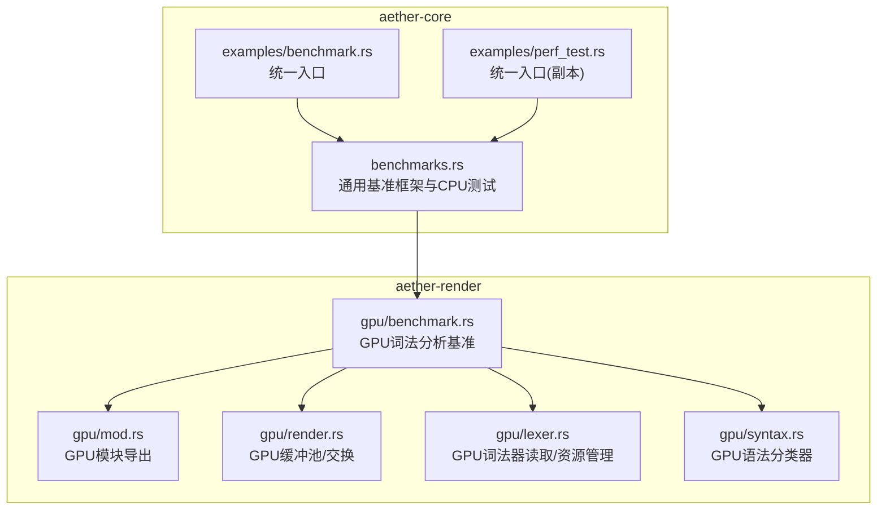
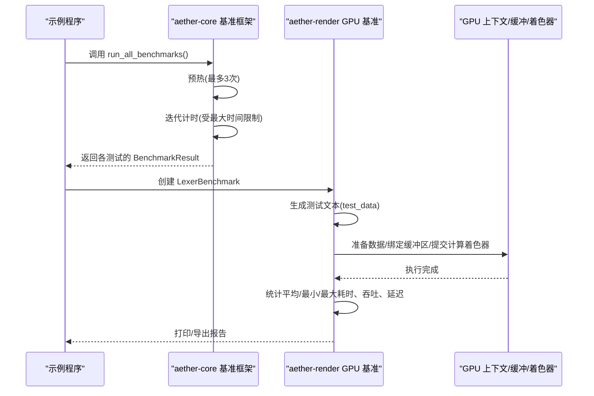
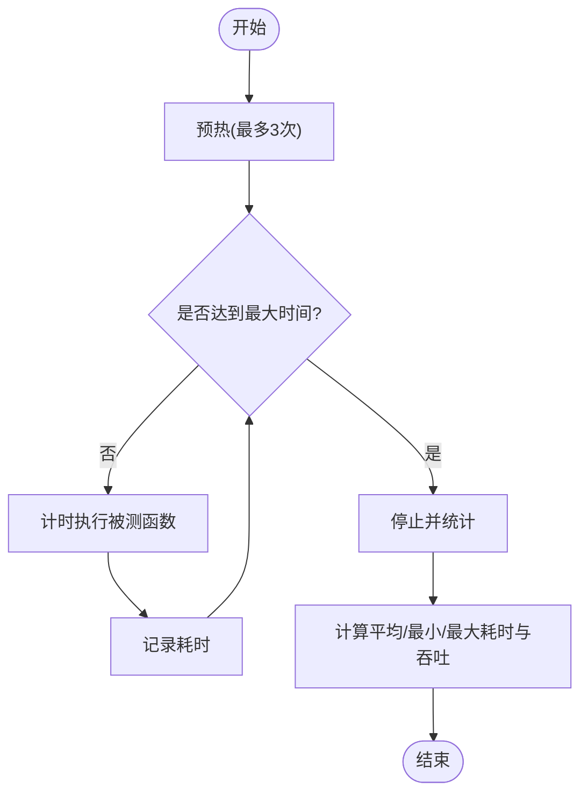
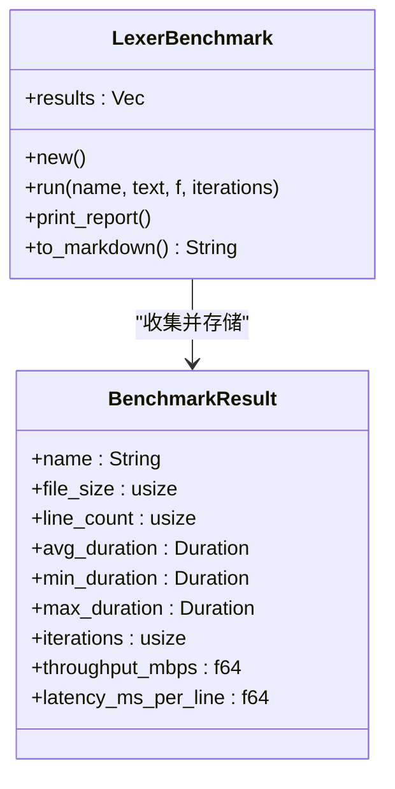
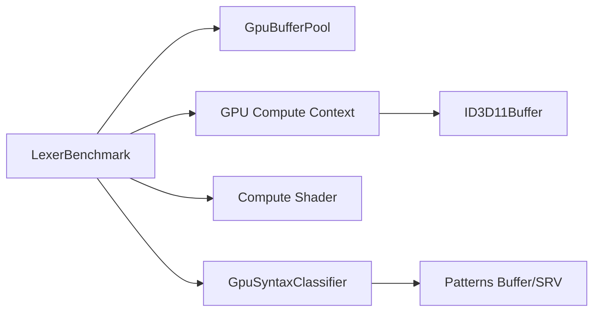
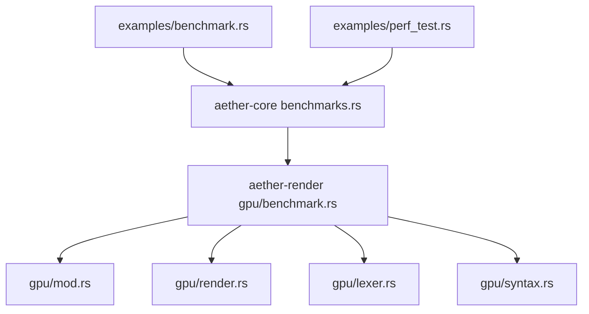

# 性能基准测试

<cite>
**本文引用的文件**
- [crates/aether-core/src/benchmarks.rs](file://crates/aether-core/src/benchmarks.rs)
- [crates/aether-render/src/gpu/benchmark.rs](file://crates/aether-render/src/gpu/benchmark.rs)
- [crates/aether-core/examples/benchmark.rs](file://crates/aether-core/examples/benchmark.rs)
- [crates/aether-core/examples/perf_test.rs](file://crates/aether-core/examples/perf_test.rs)
- [crates/aether-render/src/gpu/mod.rs](file://crates/aether-render/src/gpu/mod.rs)
- [crates/aether-render/src/gpu/render.rs](file://crates/aether-render/src/gpu/render.rs)
- [crates/aether-render/src/gpu/lexer.rs](file://crates/aether-render/src/gpu/lexer.rs)
- [crates/aether-render/src/gpu/syntax.rs](file://crates/aether-render/src/gpu/syntax.rs)
- [.github/workflows/ci.yml](file://.github/workflows/ci.yml)
</cite>

## 目录
1. [简介](#简介)
2. [项目结构](#项目结构)
3. [核心组件](#核心组件)
4. [架构总览](#架构总览)
5. [详细组件分析](#详细组件分析)
6. [依赖关系分析](#依赖关系分析)
7. [性能考量](#性能考量)
8. [故障排查指南](#故障排查指南)
9. [结论](#结论)
10. [附录](#附录)

## 简介
本技术文档围绕 GPU 性能基准测试模块展开，系统化说明基准测试框架的设计与实现、测试用例定义、性能指标收集与结果分析流程。重点覆盖渲染性能、内存使用、GPU 利用率测量以及吞吐量的测试场景；详细说明执行流程（预热、数据采集、统计分析）；提供自定义基准测试的编写与运行示例；并给出性能瓶颈识别与优化建议方法。同时，结合持续集成配置，说明如何在 CI 中自动化执行性能回归检测。

## 项目结构
仓库中与性能基准测试相关的代码主要分布在两个 crate：
- aether-core：通用基准测试框架与 CPU 侧性能测试（如 PieceTable、SIMD、增量词法分析）。
- aether-render：GPU 侧基准测试（词法分析对比）、GPU 缓冲区池、语法分类器等与渲染管线相关的组件。

图表来源
- [crates/aether-core/src/benchmarks.rs:1-443](file://crates/aether-core/src/benchmarks.rs#L1-L443)
- [crates/aether-render/src/gpu/benchmark.rs:1-287](file://crates/aether-render/src/gpu/benchmark.rs#L1-L287)
- [crates/aether-render/src/gpu/mod.rs:1-10](file://crates/aether-render/src/gpu/mod.rs#L1-L10)
- [crates/aether-render/src/gpu/render.rs:153-199](file://crates/aether-render/src/gpu/render.rs#L153-L199)
- [crates/aether-render/src/gpu/lexer.rs:386-429](file://crates/aether-render/src/gpu/lexer.rs#L386-L429)
- [crates/aether-render/src/gpu/syntax.rs:35-79](file://crates/aether-render/src/gpu/syntax.rs#L35-L79)

章节来源
- [crates/aether-core/src/benchmarks.rs:1-443](file://crates/aether-core/src/benchmarks.rs#L1-L443)
- [crates/aether-render/src/gpu/benchmark.rs:1-287](file://crates/aether-render/src/gpu/benchmark.rs#L1-L287)
- [crates/aether-render/src/gpu/mod.rs:1-10](file://crates/aether-render/src/gpu/mod.rs#L1-L10)

## 核心组件
- 通用基准框架（aether-core）
  - 提供统一的 run_benchmark 执行器，支持最大时间限制、预热、多次迭代计时与统计。
  - 提供 BenchmarkResult 数据结构，包含名称、迭代次数、总耗时、平均/最小/最大耗时与吞吐量。
  - 内置多种 CPU 侧性能测试：PieceTable 加载/插入/删除/读取/快照/编辑吞吐、SIMD 加速、增量词法分析全量与增量更新对比。
  - 提供 run_all_benchmarks 汇总入口，输出表格化报告。

- GPU 基准测试（aether-render）
  - LexerBenchmark：针对词法分析方案（CPU/GPU/第三方）进行多轮计时，计算平均/最小/最大耗时、MB/s 吞吐、ms/行延迟，并生成 Markdown 报告。
  - test_data：提供 Rust/JS/JSON 等测试文本生成器，便于构造不同规模与语法的输入。
  - 与 GPU 渲染子系统交互：通过 compute_context、buffer、shader、syntax 等模块完成 GPU 端数据准备与调度。

章节来源
- [crates/aether-core/src/benchmarks.rs:11-87](file://crates/aether-core/src/benchmarks.rs#L11-L87)
- [crates/aether-core/src/benchmarks.rs:104-334](file://crates/aether-core/src/benchmarks.rs#L104-L334)
- [crates/aether-core/src/benchmarks.rs:398-443](file://crates/aether-core/src/benchmarks.rs#L398-L443)
- [crates/aether-render/src/gpu/benchmark.rs:1-157](file://crates/aether-render/src/gpu/benchmark.rs#L1-L157)
- [crates/aether-render/src/gpu/benchmark.rs:159-236](file://crates/aether-render/src/gpu/benchmark.rs#L159-L236)

## 架构总览
基准测试整体由“执行器 + 被测目标 + 指标统计 + 报告”构成。CPU 侧通过通用框架驱动；GPU 侧在渲染子系统中以独立基准模块组织，并与 GPU 上下文、缓冲区、着色器协同工作。

图表来源
- [crates/aether-core/src/benchmarks.rs:55-87](file://crates/aether-core/src/benchmarks.rs#L55-L87)
- [crates/aether-core/src/benchmarks.rs:398-443](file://crates/aether-core/src/benchmarks.rs#L398-L443)
- [crates/aether-render/src/gpu/benchmark.rs:41-92](file://crates/aether-render/src/gpu/benchmark.rs#L41-L92)
- [crates/aether-render/src/gpu/benchmark.rs:94-157](file://crates/aether-render/src/gpu/benchmark.rs#L94-L157)
- [crates/aether-render/src/gpu/lexer.rs:386-429](file://crates/aether-render/src/gpu/lexer.rs#L386-L429)

## 详细组件分析

### 通用基准框架（aether-core）
- 执行模型
  - 预热阶段：最多执行 3 次以稳定缓存与 JIT/编译产物。
  - 正式阶段：按指定迭代次数执行被测闭包，记录每次耗时；若超过最大总时长则提前终止。
  - 统计阶段：计算总耗时、平均/最小/最大耗时与吞吐量（ops/s）。
- 典型测试场景
  - PieceTable：大文件加载、从文件加载、单次/多次插入、删除、行读取、全文读取、快照创建、编辑吞吐。
  - SIMD：换行符计数、字节查找、跳过空白。
  - 增量词法分析：全量分析与增量更新对比，评估编辑后的局部重算收益。
- 报告与汇总
  - 每个测试结果可格式化输出；run_all_benchmarks 汇总所有结果并打印表格。

图表来源
- [crates/aether-core/src/benchmarks.rs:55-87](file://crates/aether-core/src/benchmarks.rs#L55-L87)

章节来源
- [crates/aether-core/src/benchmarks.rs:11-87](file://crates/aether-core/src/benchmarks.rs#L11-L87)
- [crates/aether-core/src/benchmarks.rs:104-334](file://crates/aether-core/src/benchmarks.rs#L104-L334)
- [crates/aether-core/src/benchmarks.rs:398-443](file://crates/aether-core/src/benchmarks.rs#L398-L443)

### GPU 词法分析基准（aether-render）
- 设计要点
  - 使用 LexerBenchmark 对多种方案（CPU/GPU/第三方）进行公平对比。
  - 指标包括：文件大小、行数、平均/最小/最大耗时、MB/s 吞吐、ms/行延迟。
  - 支持控制台表格输出与 Markdown 导出，便于归档与比较。
- 数据准备
  - test_data 提供 Rust/JS/JSON 等多语言代码生成器，便于构造不同复杂度与规模的输入。
- 与渲染子系统协作
  - 通过 GPU 上下文、缓冲区池、着色器与语法分类器完成数据上传、并行处理与结果读取。

图表来源
- [crates/aether-render/src/gpu/benchmark.rs:1-157](file://crates/aether-render/src/gpu/benchmark.rs#L1-L157)

章节来源
- [crates/aether-render/src/gpu/benchmark.rs:1-157](file://crates/aether-render/src/gpu/benchmark.rs#L1-L157)
- [crates/aether-render/src/gpu/benchmark.rs:159-236](file://crates/aether-render/src/gpu/benchmark.rs#L159-L236)

### GPU 渲染与资源管理
- 缓冲区池
  - GpuBufferPool 复用 ID3D11Buffer，减少频繁分配/释放开销，提升吞吐稳定性。
- 交换与同步
  - swap 用于双缓冲切换，避免读写冲突。
- 词法器与语法分类器
  - GPU 词法器负责 token 流生成与读取；语法分类器基于 Token 序列进行并行模式匹配，辅助高亮。

图表来源
- [crates/aether-render/src/gpu/render.rs:153-199](file://crates/aether-render/src/gpu/render.rs#L153-L199)
- [crates/aether-render/src/gpu/lexer.rs:386-429](file://crates/aether-render/src/gpu/lexer.rs#L386-L429)
- [crates/aether-render/src/gpu/syntax.rs:35-79](file://crates/aether-render/src/gpu/syntax.rs#L35-L79)

章节来源
- [crates/aether-render/src/gpu/render.rs:153-199](file://crates/aether-render/src/gpu/render.rs#L153-L199)
- [crates/aether-render/src/gpu/lexer.rs:386-429](file://crates/aether-render/src/gpu/lexer.rs#L386-L429)
- [crates/aether-render/src/gpu/syntax.rs:35-79](file://crates/aether-render/src/gpu/syntax.rs#L35-L79)

## 依赖关系分析
- 模块耦合
  - aether-core 的基准框架为上层示例程序提供统一入口，不直接依赖 GPU 子系统，保持解耦。
  - aether-render 的 GPU 基准模块依赖 compute_context、buffer、shader、syntax 等渲染组件，形成内聚的 GPU 测试闭环。
- 外部依赖
  - Windows Direct3D11 资源（ID3D11Buffer、ID3D11ComputeShader、UAV/SRV 视图）在 GPU 侧被广泛使用。
- 潜在风险
  - GPU 资源生命周期管理需严格，避免悬垂引用或重复释放；缓冲区池与显式创建/销毁路径需保持一致。

图表来源
- [crates/aether-core/src/benchmarks.rs:398-443](file://crates/aether-core/src/benchmarks.rs#L398-L443)
- [crates/aether-core/examples/benchmark.rs:1-18](file://crates/aether-core/examples/benchmark.rs#L1-L18)
- [crates/aether-core/examples/perf_test.rs:1-18](file://crates/aether-core/examples/perf_test.rs#L1-L18)
- [crates/aether-render/src/gpu/benchmark.rs:1-157](file://crates/aether-render/src/gpu/benchmark.rs#L1-L157)
- [crates/aether-render/src/gpu/mod.rs:1-10](file://crates/aether-render/src/gpu/mod.rs#L1-L10)
- [crates/aether-render/src/gpu/render.rs:153-199](file://crates/aether-render/src/gpu/render.rs#L153-L199)
- [crates/aether-render/src/gpu/lexer.rs:386-429](file://crates/aether-render/src/gpu/lexer.rs#L386-L429)
- [crates/aether-render/src/gpu/syntax.rs:35-79](file://crates/aether-render/src/gpu/syntax.rs#L35-L79)

章节来源
- [crates/aether-core/src/benchmarks.rs:398-443](file://crates/aether-core/src/benchmarks.rs#L398-L443)
- [crates/aether-render/src/gpu/benchmark.rs:1-157](file://crates/aether-render/src/gpu/benchmark.rs#L1-L157)
- [crates/aether-render/src/gpu/mod.rs:1-10](file://crates/aether-render/src/gpu/mod.rs#L1-L10)

## 性能考量
- 预热策略
  - 通用框架默认最多 3 次预热，有助于稳定 CPU 缓存与 JIT 状态；GPU 侧建议在首次运行前增加一次“空跑”以触发着色器编译与资源初始化。
- 迭代次数与最大时间
  - 根据被测对象调整迭代次数；对于慢任务设置合理的 max_total_secs，避免 CI 超时。
- 指标选择
  - 渲染性能：关注平均/最小/最大耗时与 ms/行延迟；吞吐：MB/s；内存：观察缓冲区大小与分配频率；GPU 利用率：可通过系统工具配合日志采样。
- 稳定性
  - 多次运行取中位数或分位数可降低噪声影响；避免在测试期间运行其他高负载任务。
- 资源复用
  - 使用缓冲区池减少分配/释放；批量上传数据降低同步开销。

[本节为通用指导，不直接分析具体文件]

## 故障排查指南
- 常见问题
  - 测试耗时异常波动：检查是否存在 I/O 阻塞、GC/分配抖动、GPU 驱动后台任务干扰。
  - GPU 资源泄漏：确认 UVA/SRV/Buffer 正确释放；避免跨线程共享未加锁的资源。
  - 结果不可比：确保不同方案的输入规模一致（文件大小、行数），且预热与迭代次数相同。
- 定位方法
  - 使用 to_markdown 输出结构化报告，便于差异对比；逐步缩小输入规模定位热点。
  - 在关键路径前后添加计时点，定位瓶颈段。
- 参考实现
  - 通用框架的 run_benchmark 已内置最大时间保护，防止长时间卡死。
  - GPU 侧读取 token 列表与创建 UAV 的路径可用于验证数据回传是否正确。

章节来源
- [crates/aether-core/src/benchmarks.rs:55-87](file://crates/aether-core/src/benchmarks.rs#L55-L87)
- [crates/aether-render/src/gpu/benchmark.rs:94-157](file://crates/aether-render/src/gpu/benchmark.rs#L94-L157)
- [crates/aether-render/src/gpu/lexer.rs:386-429](file://crates/aether-render/src/gpu/lexer.rs#L386-L429)

## 结论
该基准测试框架将 CPU 与 GPU 侧的性能评估统一到一致的度量体系下：通过通用执行器保证可比性，通过 GPU 专用模块聚焦渲染与词法分析的关键路径。借助预热、迭代统计与多维指标（耗时、吞吐、延迟），能够准确识别性能瓶颈并指导优化。结合 CI 中的自动化执行，可实现持续回归检测，保障版本演进过程中的性能稳定性。

[本节为总结性内容，不直接分析具体文件]

## 附录

### 如何编写自定义基准测试
- CPU 侧（通用框架）
  - 使用 run_benchmark(name, iterations, max_total_secs, closure) 包裹被测逻辑，自动完成预热、计时与统计。
  - 参考路径：[crates/aether-core/src/benchmarks.rs:55-87](file://crates/aether-core/src/benchmarks.rs#L55-L87)
- GPU 侧（词法分析基准）
  - 使用 LexerBenchmark::run(name, text, closure, iterations) 传入待测函数与测试文本，内部会统计耗时、吞吐与延迟。
  - 参考路径：[crates/aether-render/src/gpu/benchmark.rs:41-92](file://crates/aether-render/src/gpu/benchmark.rs#L41-L92)
  - 可使用 test_data 生成不同规模与语法的输入。
  - 参考路径：[crates/aether-render/src/gpu/benchmark.rs:159-236](file://crates/aether-render/src/gpu/benchmark.rs#L159-L236)

### 如何运行测试套件与分析结果
- 统一入口
  - 运行示例程序以执行全部基准测试。
  - 参考路径：[crates/aether-core/examples/benchmark.rs:1-18](file://crates/aether-core/examples/benchmark.rs#L1-L18)
  - 参考路径：[crates/aether-core/examples/perf_test.rs:1-18](file://crates/aether-core/examples/perf_test.rs#L1-L18)
- 结果分析
  - 控制台表格输出与 Markdown 导出便于归档与对比。
  - 参考路径：[crates/aether-core/src/benchmarks.rs:398-443](file://crates/aether-core/src/benchmarks.rs#L398-L443)
  - 参考路径：[crates/aether-render/src/gpu/benchmark.rs:94-157](file://crates/aether-render/src/gpu/benchmark.rs#L94-L157)

### 持续集成中的自动化性能测试与回归检测
- 当前 CI 配置
  - 在 Windows 环境执行格式化检查、cargo check 与 cargo test。
  - 参考路径：[.github/workflows/ci.yml:1-26](file://.github/workflows/ci.yml#L1-L26)
- 扩展建议
  - 新增性能测试 job：构建 release 二进制，运行基准测试，解析输出（CSV/Markdown）并保存为工件。
  - 回归检测：与基线结果对比阈值（如平均耗时增长 > X% 或吞吐下降 > Y%），失败时标记 PR。
  - 隔离环境：固定驱动版本与硬件规格，减少噪声。

章节来源
- [.github/workflows/ci.yml:1-26](file://.github/workflows/ci.yml#L1-L26)