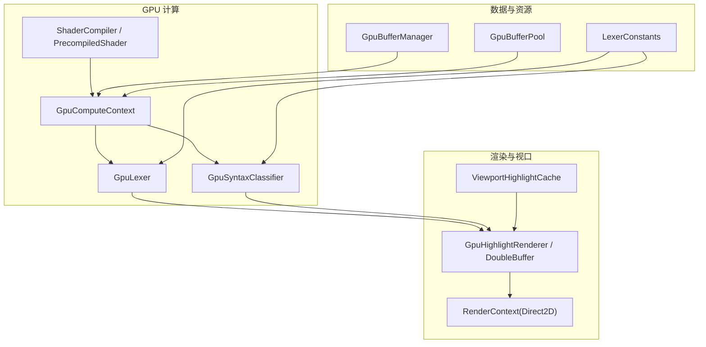
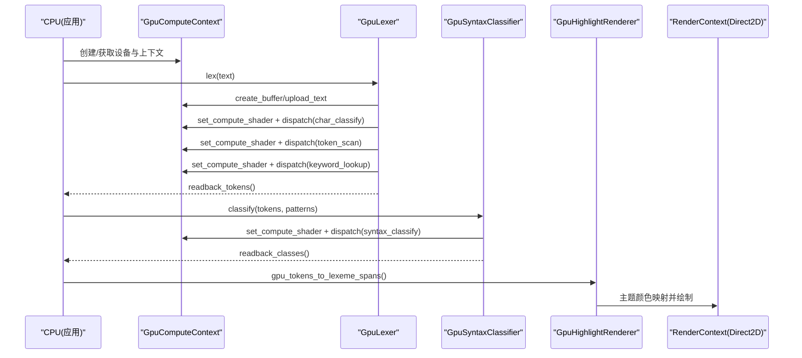
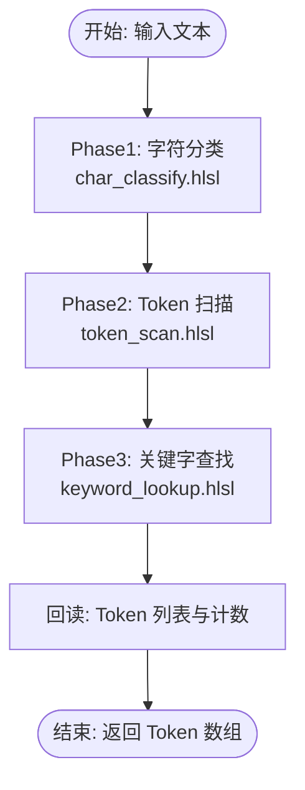
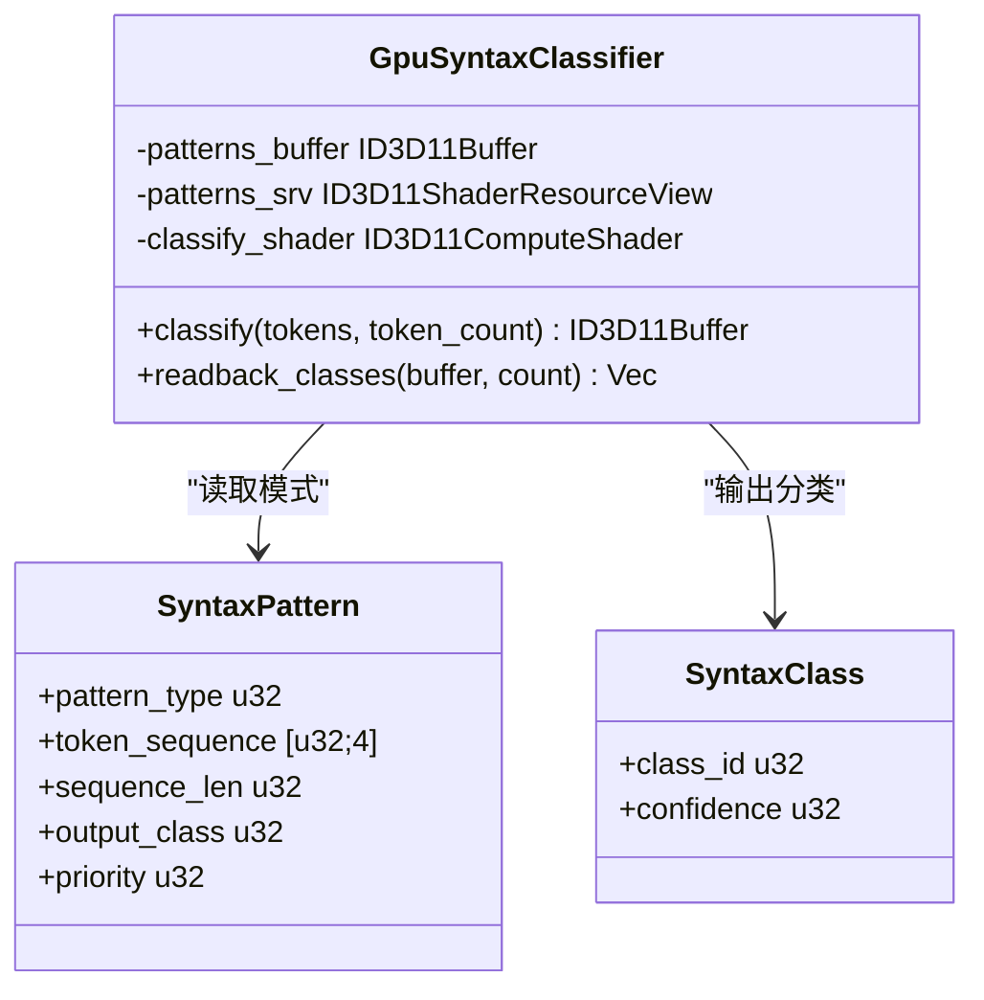
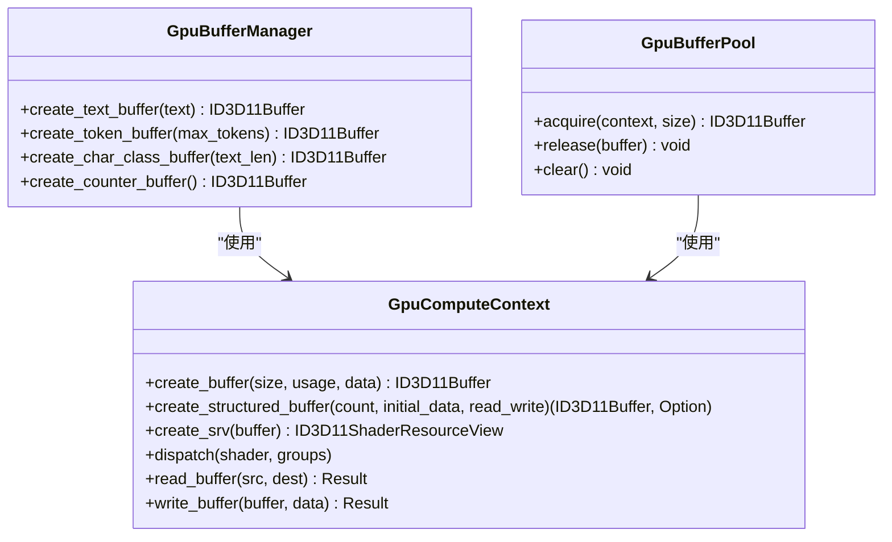
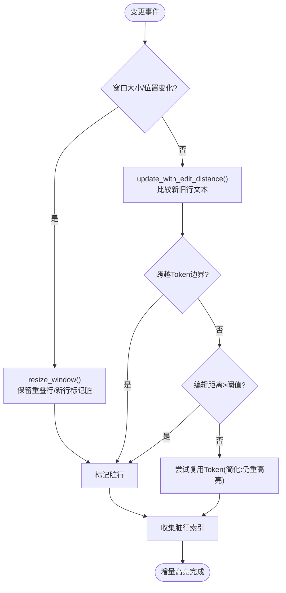
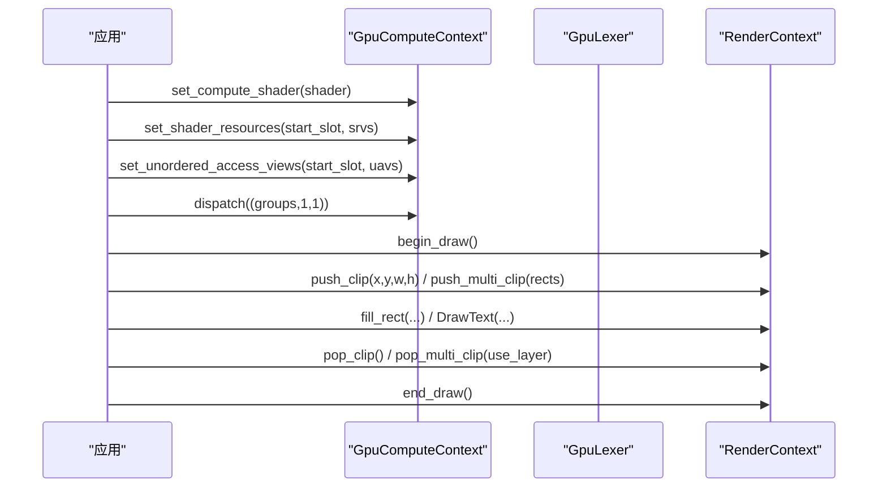
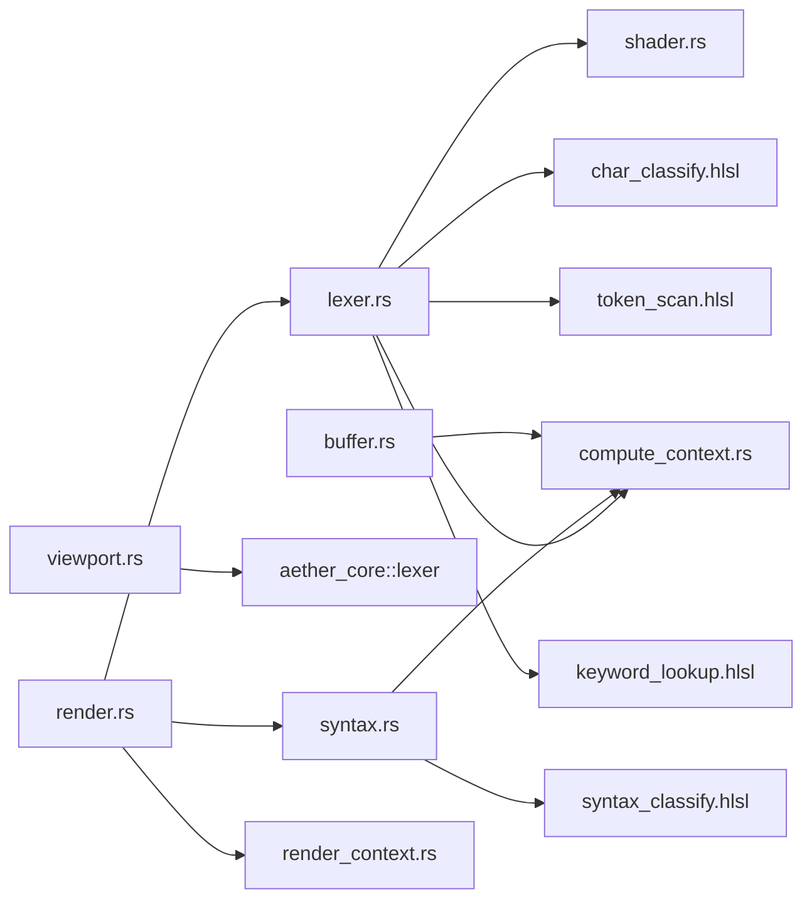

# 渲染管线

<cite>
**本文引用的文件**
- [crates/aether-render/src/gpu/mod.rs](file://crates/aether-render/src/gpu/mod.rs)
- [crates/aether-render/src/gpu/compute_context.rs](file://crates/aether-render/src/gpu/compute_context.rs)
- [crates/aether-render/src/gpu/buffer.rs](file://crates/aether-render/src/gpu/buffer.rs)
- [crates/aether-render/src/gpu/shader.rs](file://crates/aether-render/src/gpu/shader.rs)
- [crates/aether-render/src/gpu/lexer.rs](file://crates/aether-render/src/gpu/lexer.rs)
- [crates/aether-render/src/gpu/syntax.rs](file://crates/aether-render/src/gpu/syntax.rs)
- [crates/aether-render/src/gpu/render.rs](file://crates/aether-render/src/gpu/render.rs)
- [crates/aether-render/src/gpu/viewport.rs](file://crates/aether-render/src/gpu/viewport.rs)
- [crates/aether-render/src/gpu/benchmark.rs](file://crates/aether-render/src/gpu/benchmark.rs)
- [crates/aether-render/src/gpu/shaders/char_classify.hlsl](file://crates/aether-render/src/gpu/shaders/char_classify.hlsl)
- [crates/aether-render/src/gpu/shaders/token_scan.hlsl](file://crates/aether-render/src/gpu/shaders/token_scan.hlsl)
- [crates/aether-render/src/gpu/shaders/keyword_lookup.hlsl](file://crates/aether-render/src/gpu/shaders/keyword_lookup.hlsl)
- [crates/aether-render/src/gpu/shaders/syntax_classify.hlsl](file://crates/aether-render/src/gpu/shaders/syntax_classify.hlsl)
- [crates/aether-render-win/src/render_context.rs](file://crates/aether-render-win/src/render_context.rs)
</cite>

## 目录
1. [简介](#简介)
2. [项目结构](#项目结构)
3. [核心组件](#核心组件)
4. [架构总览](#架构总览)
5. [详细组件分析](#详细组件分析)
6. [依赖关系分析](#依赖关系分析)
7. [性能考量](#性能考量)
8. [故障排查指南](#故障排查指南)
9. [结论](#结论)
10. [附录](#附录)

## 简介
本技术文档聚焦于 GPU 渲染与计算管线，围绕以下目标展开：
- 解释基于 Direct3D 11 Compute Shader 的并行词法分析与语法分类流程（字符分类、Token 扫描、关键字查找、语法模式匹配）。
- 说明缓冲区管理机制：顶点/索引/常量缓冲区的创建、更新与销毁（在编辑器高亮场景中体现为文本输入、Token 输出、字符分类、计数器及常量参数等）。
- 文档化视口管理与增量更新：可见行范围缓存、编辑距离检测、脏行标记与窗口重排。
- 提供设置渲染状态、绑定资源与执行绘制的示例路径（Direct2D 渲染上下文与裁剪区域）。
- 总结优化策略：批处理、实例化渲染、延迟渲染思路在本工程中的落地方式与可拓展点。
- 给出性能分析与调试技巧，包括基准测试工具与常见错误定位方法。

## 项目结构
GPU 相关代码集中在 aether-render 的 gpu 模块中，按职责划分为：
- 计算上下文与设备管理：compute_context.rs
- 着色器编译与常量缓冲：shader.rs
- 词法分析流水线：lexer.rs + HLSL 着色器
- 语法分类：syntax.rs + HLSL 着色器
- 渲染桥接与双缓冲/池：render.rs
- 视口与增量高亮缓存：viewport.rs
- 基准测试：benchmark.rs
- Windows 侧 D2D 渲染上下文：aether-render-win/render_context.rs

图表来源
- [crates/aether-render/src/gpu/compute_context.rs:17-24](file://crates/aether-render/src/gpu/compute_context.rs#L17-L24)
- [crates/aether-render/src/gpu/shader.rs:7-150](file://crates/aether-render/src/gpu/shader.rs#L7-L150)
- [crates/aether-render/src/gpu/lexer.rs:48-77](file://crates/aether-render/src/gpu/lexer.rs#L48-L77)
- [crates/aether-render/src/gpu/syntax.rs:39-54](file://crates/aether-render/src/gpu/syntax.rs#L39-L54)
- [crates/aether-render/src/gpu/buffer.rs:6-47](file://crates/aether-render/src/gpu/buffer.rs#L6-L47)
- [crates/aether-render/src/gpu/render.rs:128-219](file://crates/aether-render/src/gpu/render.rs#L128-L219)
- [crates/aether-render/src/gpu/viewport.rs:3-22](file://crates/aether-render/src/gpu/viewport.rs#L3-L22)
- [crates/aether-render-win/src/render_context.rs:6-19](file://crates/aether-render-win/src/render_context.rs#L6-L19)

章节来源
- [crates/aether-render/src/gpu/mod.rs:1-10](file://crates/aether-render/src/gpu/mod.rs#L1-L10)

## 核心组件
- GpuComputeContext：封装 D3D11 设备与上下文，提供缓冲区创建、SRV/UAV 构建、Compute Shader 分派、CPU/GPU 数据回读。
- ShaderCompiler/PrecompiledShader：HLSL 源码编译与预编译 CSO 加载；定义 LexerConstants 常量缓冲结构。
- GpuLexer：三阶段并行词法分析（字符分类→Token 扫描→关键字查找），管理工作缓冲区与 UAV/SRV 绑定。
- GpuSyntaxClassifier：基于 Token 流与语言模式的 GPU 语法分类，输出 SyntaxClass 结果。
- GpuBufferManager：统一创建文本输入、Token 输出、字符分类、计数器等 GPU 缓冲区。
- GpuBufferPool：复用 ID3D11Buffer，减少分配/释放开销。
- GpuHighlightRenderer：将 GPU Token 转换为 LexemeSpan，合并相邻同色 Token，映射主题颜色。
- ViewportHighlightCache：视口优先的高亮缓存，支持窗口调整、编辑距离检测、脏行标记与版本失效。
- RenderContext（Windows）：Direct2D 渲染目标、画刷/文本格式缓存、裁剪区域与多矩形裁剪。

章节来源
- [crates/aether-render/src/gpu/compute_context.rs:17-399](file://crates/aether-render/src/gpu/compute_context.rs#L17-L399)
- [crates/aether-render/src/gpu/shader.rs:7-150](file://crates/aether-render/src/gpu/shader.rs#L7-L150)
- [crates/aether-render/src/gpu/lexer.rs:48-430](file://crates/aether-render/src/gpu/lexer.rs#L48-L430)
- [crates/aether-render/src/gpu/syntax.rs:39-289](file://crates/aether-render/src/gpu/syntax.rs#L39-L289)
- [crates/aether-render/src/gpu/buffer.rs:6-47](file://crates/aether-render/src/gpu/buffer.rs#L6-L47)
- [crates/aether-render/src/gpu/render.rs:74-219](file://crates/aether-render/src/gpu/render.rs#L74-L219)
- [crates/aether-render/src/gpu/viewport.rs:3-324](file://crates/aether-render/src/gpu/viewport.rs#L3-L324)
- [crates/aether-render-win/src/render_context.rs:6-233](file://crates/aether-render-win/src/render_context.rs#L6-L233)

## 架构总览
下图展示从 CPU 到 GPU 的数据流与调用链：CPU 准备文本与常量，GPU 通过 Compute Shader 完成词法与语法分析，结果回读后由渲染层进行绘制。

图表来源
- [crates/aether-render/src/gpu/lexer.rs:187-221](file://crates/aether-render/src/gpu/lexer.rs#L187-L221)
- [crates/aether-render/src/gpu/syntax.rs:93-124](file://crates/aether-render/src/gpu/syntax.rs#L93-L124)
- [crates/aether-render/src/gpu/render.rs:7-32](file://crates/aether-render/src/gpu/render.rs#L7-L32)
- [crates/aether-render/src/gpu/compute_context.rs:232-272](file://crates/aether-render/src/gpu/compute_context.rs#L232-L272)

## 详细组件分析

### 词法分析流水线（GPU）
- 阶段一：字符分类（char_classify.hlsl）
  - 每个线程处理一个字符，查表得到字符类别。
  - 输入：TextBuffer（结构化字节流），输出：CharClasses（每字符分类）。
- 阶段二：Token 扫描（token_scan.hlsl）
  - 基于字符分类识别 Token 边界，计算长度，原子递增写入全局 Token 列表与计数。
  - 输入：CharClasses，输出：Tokens、TokenCount。
- 阶段三：关键字查找（keyword_lookup.hlsl）
  - 对标识符使用 FNV-1a 哈希与完美哈希表匹配，命中则标记为关键字并填充 keyword_id。
  - 输入：Tokens、KeywordHash、TextBuffer，输出：更新后的 Tokens。

图表来源
- [crates/aether-render/src/gpu/shaders/char_classify.hlsl:1-89](file://crates/aether-render/src/gpu/shaders/char_classify.hlsl#L1-L89)
- [crates/aether-render/src/gpu/shaders/token_scan.hlsl:1-313](file://crates/aether-render/src/gpu/shaders/token_scan.hlsl#L1-L313)
- [crates/aether-render/src/gpu/shaders/keyword_lookup.hlsl:1-102](file://crates/aether-render/src/gpu/shaders/keyword_lookup.hlsl#L1-L102)
- [crates/aether-render/src/gpu/lexer.rs:187-221](file://crates/aether-render/src/gpu/lexer.rs#L187-L221)

章节来源
- [crates/aether-render/src/gpu/lexer.rs:48-430](file://crates/aether-render/src/gpu/lexer.rs#L48-L430)
- [crates/aether-render/src/gpu/shaders/char_classify.hlsl:1-89](file://crates/aether-render/src/gpu/shaders/char_classify.hlsl#L1-L89)
- [crates/aether-render/src/gpu/shaders/token_scan.hlsl:1-313](file://crates/aether-render/src/gpu/shaders/token_scan.hlsl#L1-L313)
- [crates/aether-render/src/gpu/shaders/keyword_lookup.hlsl:1-102](file://crates/aether-render/src/gpu/shaders/keyword_lookup.hlsl#L1-L102)

### 语法分类（GPU）
- 基于 Token 序列与语言模式（SyntaxPattern）进行并行匹配，输出 SyntaxClass（class_id、confidence）。
- 模式优先级决定最终分类，置信度用于后续 CPU 决策是否采用 GPU 分类结果。

图表来源
- [crates/aether-render/src/gpu/syntax.rs:39-54](file://crates/aether-render/src/gpu/syntax.rs#L39-L54)
- [crates/aether-render/src/gpu/syntax.rs:56-72](file://crates/aether-render/src/gpu/syntax.rs#L56-L72)
- [crates/aether-render/src/gpu/syntax.rs:93-142](file://crates/aether-render/src/gpu/syntax.rs#L93-L142)
- [crates/aether-render/src/gpu/shaders/syntax_classify.hlsl:1-142](file://crates/aether-render/src/gpu/shaders/syntax_classify.hlsl#L1-L142)

章节来源
- [crates/aether-render/src/gpu/syntax.rs:39-289](file://crates/aether-render/src/gpu/syntax.rs#L39-L289)
- [crates/aether-render/src/gpu/shaders/syntax_classify.hlsl:1-142](file://crates/aether-render/src/gpu/shaders/syntax_classify.hlsl#L1-L142)

### 缓冲区管理机制
- 文本输入缓冲区：Structured Buffer，UTF-8 字节流上传至 GPU。
- Token 输出缓冲区：RWStructuredBuffer，配合原子计数器写入。
- 字符分类缓冲区：RWStructuredBuffer，每字符一个分类值。
- 计数器缓冲区：UAV 带计数器标志，用于并发写入 Token 索引。
- 常量缓冲区：cbuffer LexerConstants，传递 TextLength、MaxTokens、NumStates、KeywordTableSize。
- 视图：SRV/UAV 分别用于只读与读写访问；Staging Buffer 用于 CPU 回读。

图表来源
- [crates/aether-render/src/gpu/compute_context.rs:116-206](file://crates/aether-render/src/gpu/compute_context.rs#L116-L206)
- [crates/aether-render/src/gpu/compute_context.rs:274-349](file://crates/aether-render/src/gpu/compute_context.rs#L274-L349)
- [crates/aether-render/src/gpu/buffer.rs:6-47](file://crates/aether-render/src/gpu/buffer.rs#L6-L47)
- [crates/aether-render/src/gpu/render.rs:161-219](file://crates/aether-render/src/gpu/render.rs#L161-L219)

章节来源
- [crates/aether-render/src/gpu/compute_context.rs:17-399](file://crates/aether-render/src/gpu/compute_context.rs#L17-L399)
- [crates/aether-render/src/gpu/buffer.rs:6-47](file://crates/aether-render/src/gpu/buffer.rs#L6-L47)
- [crates/aether-render/src/gpu/render.rs:161-219](file://crates/aether-render/src/gpu/render.rs#L161-L219)

### 视口管理与增量高亮
- ViewportHighlightCache：维护可见窗口（window_start/window_len）、每行 Token、版本控制、脏行标记与行文本缓存。
- 编辑距离检测：跨 Token 边界或显著变化时标记脏行；微小变化尝试复用但简化实现仍重新高亮。
- 窗口调整：重叠行保留旧数据，新进入窗口的行初始化为脏。

图表来源
- [crates/aether-render/src/gpu/viewport.rs:24-195](file://crates/aether-render/src/gpu/viewport.rs#L24-L195)
- [crates/aether-render/src/gpu/viewport.rs:197-294](file://crates/aether-render/src/gpu/viewport.rs#L197-L294)

章节来源
- [crates/aether-render/src/gpu/viewport.rs:3-324](file://crates/aether-render/src/gpu/viewport.rs#L3-L324)

### 渲染状态设置与绘制调用示例路径
- 设置 Compute Shader：set_compute_shader + set_shader_resources + set_unordered_access_views + dispatch。
- 绑定资源：创建 SRV/UAV，将 DFA 表、关键字表、文本、Token、分类结果等绑定到相应槽位。
- 执行绘制：通过 RenderContext.begin_draw/end_draw，结合 push_clip/pop_clip 或 push_multi_clip/pop_multi_clip 控制裁剪区域。

图表来源
- [crates/aether-render/src/gpu/compute_context.rs:244-272](file://crates/aether-render/src/gpu/compute_context.rs#L244-L272)
- [crates/aether-render/src/gpu/lexer.rs:321-370](file://crates/aether-render/src/gpu/lexer.rs#L321-L370)
- [crates/aether-render-win/src/render_context.rs:65-155](file://crates/aether-render-win/src/render_context.rs#L65-L155)

章节来源
- [crates/aether-render/src/gpu/compute_context.rs:232-272](file://crates/aether-render/src/gpu/compute_context.rs#L232-L272)
- [crates/aether-render/src/gpu/lexer.rs:321-370](file://crates/aether-render/src/gpu/lexer.rs#L321-L370)
- [crates/aether-render-win/src/render_context.rs:65-155](file://crates/aether-render-win/src/render_context.rs#L65-L155)

### 常量缓冲区与着色器常量
- LexerConstants：包含 TextLength、MaxTokens、NumStates、KeywordTableSize 等关键参数。
- 创建方式：create_constant_buffer 将 CPU 侧结构体拷贝为字节并上传至 Constant Buffer。

章节来源
- [crates/aether-render/src/gpu/shader.rs:118-150](file://crates/aether-render/src/gpu/shader.rs#L118-L150)
- [crates/aether-render/src/gpu/shaders/char_classify.hlsl:66-72](file://crates/aether-render/src/gpu/shaders/char_classify.hlsl#L66-L72)
- [crates/aether-render/src/gpu/shaders/token_scan.hlsl:73-79](file://crates/aether-render/src/gpu/shaders/token_scan.hlsl#L73-L79)
- [crates/aether-render/src/gpu/shaders/keyword_lookup.hlsl:26-32](file://crates/aether-render/src/gpu/shaders/keyword_lookup.hlsl#L26-L32)

## 依赖关系分析
- 模块耦合：
  - lexer.rs 依赖 compute_context.rs、shader.rs、HLSL 着色器。
  - syntax.rs 依赖 compute_context.rs、HLSL 着色器。
  - render.rs 依赖 lexer.rs、syntax.rs、theme。
  - viewport.rs 依赖 aether_core::lexer::LexemeSpan。
  - buffer.rs 与 render.rs 共享 compute_context.rs。
- 外部依赖：
  - Windows D3D11/DXGI API（设备、缓冲区、视图、着色器）。
  - Direct2D 渲染目标与裁剪机制。

图表来源
- [crates/aether-render/src/gpu/lexer.rs:1-10](file://crates/aether-render/src/gpu/lexer.rs#L1-L10)
- [crates/aether-render/src/gpu/syntax.rs:1-9](file://crates/aether-render/src/gpu/syntax.rs#L1-L9)
- [crates/aether-render/src/gpu/render.rs:1-6](file://crates/aether-render/src/gpu/render.rs#L1-L6)
- [crates/aether-render/src/gpu/viewport.rs:1-2](file://crates/aether-render/src/gpu/viewport.rs#L1-L2)
- [crates/aether-render/src/gpu/buffer.rs:1-5](file://crates/aether-render/src/gpu/buffer.rs#L1-L5)

章节来源
- [crates/aether-render/src/gpu/mod.rs:1-10](file://crates/aether-render/src/gpu/mod.rs#L1-L10)

## 性能考量
- 批处理：
  - 合并相邻同色 Token（merge_same_color_tokens）以减少 DrawText 调用次数。
- 实例化渲染：
  - 当前以逐 Token 渲染为主；可按行/块组织批量绘制，减少状态切换。
- 延迟渲染：
  - 视口优先缓存与脏行标记避免全量重算；编辑距离检测降低不必要的高亮成本。
- 吞吐与延迟：
  - 使用基准测试工具对比不同方案（CPU/GPU/tree-sitter），统计平均/最小/最大耗时、MB/s、ms/行。

章节来源
- [crates/aether-render/src/gpu/render.rs:74-114](file://crates/aether-render/src/gpu/render.rs#L74-L114)
- [crates/aether-render/src/gpu/viewport.rs:108-154](file://crates/aether-render/src/gpu/viewport.rs#L108-L154)
- [crates/aether-render/src/gpu/benchmark.rs:3-157](file://crates/aether-render/src/gpu/benchmark.rs#L3-L157)

## 故障排查指南
- 着色器编译失败：
  - 检查 HLSL 源码与入口函数名、目标模型；查看错误 Blob 输出信息。
- 空字节码导致创建失败：
  - create_compute_shader 对空字节码直接报错，需确保传入有效 CSO 或成功编译。
- 缓冲区尺寸不匹配：
  - 确保 StructuredBuffer 元素大小与 Rust 侧对齐；UAV NumElements 正确设置。
- 设备丢失/冻结态：
  - 使用 handle_device_lost/release_for_suspend 清理并重建资源。

章节来源
- [crates/aether-render/src/gpu/shader.rs:22-80](file://crates/aether-render/src/gpu/shader.rs#L22-L80)
- [crates/aether-render/src/gpu/compute_context.rs:96-114](file://crates/aether-render/src/gpu/compute_context.rs#L96-L114)
- [crates/aether-render/src/gpu/compute_context.rs:141-206](file://crates/aether-render/src/gpu/compute_context.rs#L141-L206)
- [crates/aether-render-win/src/render_context.rs:219-231](file://crates/aether-render-win/src/render_context.rs#L219-L231)

## 结论
本项目实现了基于 D3D11 Compute Shader 的高效并行词法与语法分析管线，并通过视口优先缓存与编辑距离检测实现增量高亮。缓冲区管理抽象清晰，支持多种用途（文本、Token、分类、计数、常量）。渲染层与计算层解耦，便于扩展批处理与实例化渲染。基准测试工具为持续优化提供了量化依据。建议后续完善跨组前缀和、更精细的复用策略与更丰富的语言模式，以提升整体性能与准确性。

## 附录
- 常用 API 路径参考：
  - 创建/更新/销毁缓冲区：[create_buffer/create_structured_buffer/read_buffer/write_buffer:116-349](file://crates/aether-render/src/gpu/compute_context.rs#L116-L349)
  - 绑定资源与执行调度：[set_compute_shader/set_shader_resources/set_unordered_access_views/dispatch:244-272](file://crates/aether-render/src/gpu/compute_context.rs#L244-L272)
  - 词法分析主流程：[lex:187-221](file://crates/aether-render/src/gpu/lexer.rs#L187-L221)
  - 语法分类主流程：[classify:93-124](file://crates/aether-render/src/gpu/syntax.rs#L93-L124)
  - 视口缓存与增量更新：[resize_window/update_with_edit_distance/dirty_line_indices:63-164](file://crates/aether-render/src/gpu/viewport.rs#L63-L164)
  - 渲染状态与裁剪：[begin_draw/end_draw/push_clip/pop_clip/push_multi_clip/pop_multi_clip:65-155](file://crates/aether-render-win/src/render_context.rs#L65-L155)