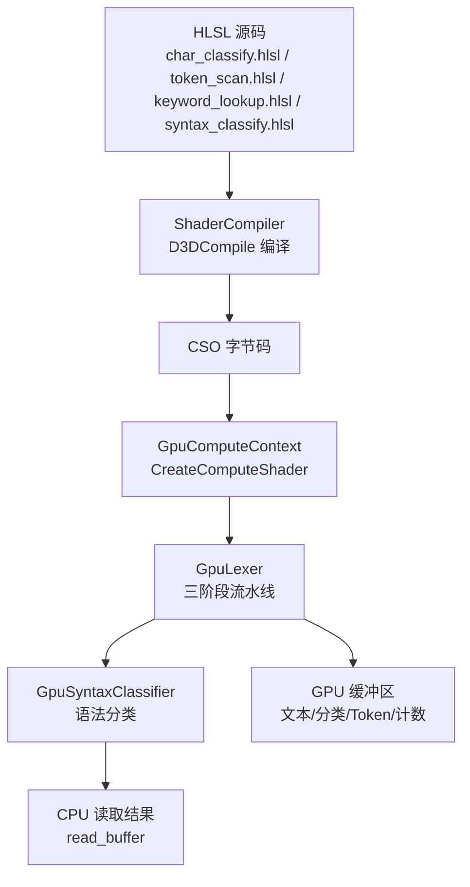
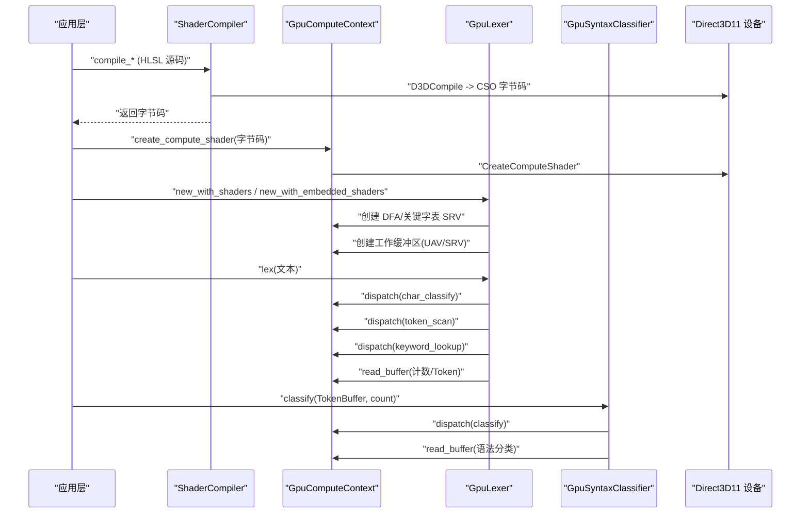
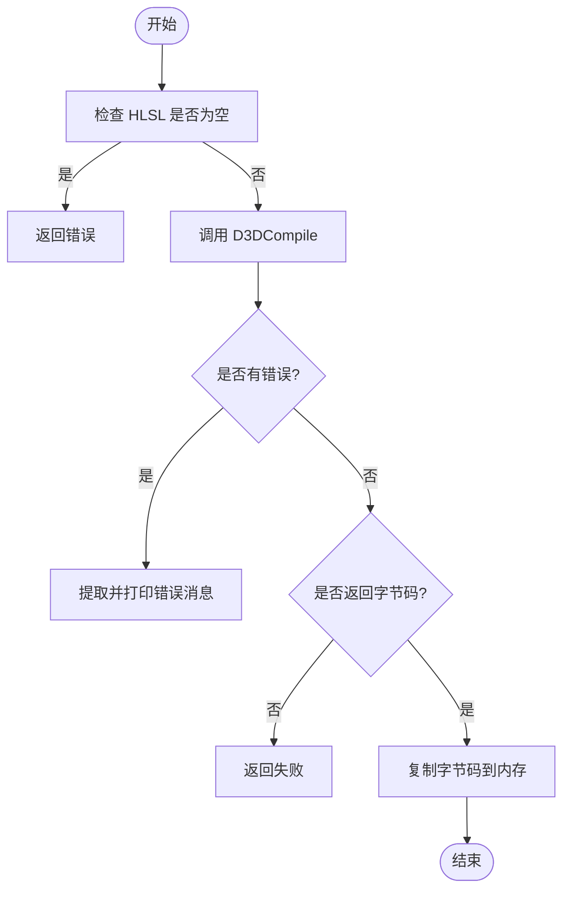
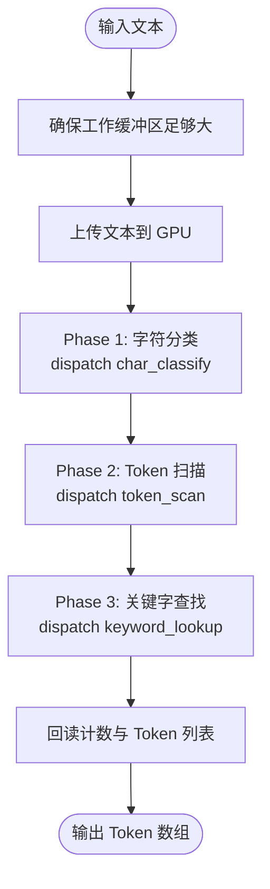
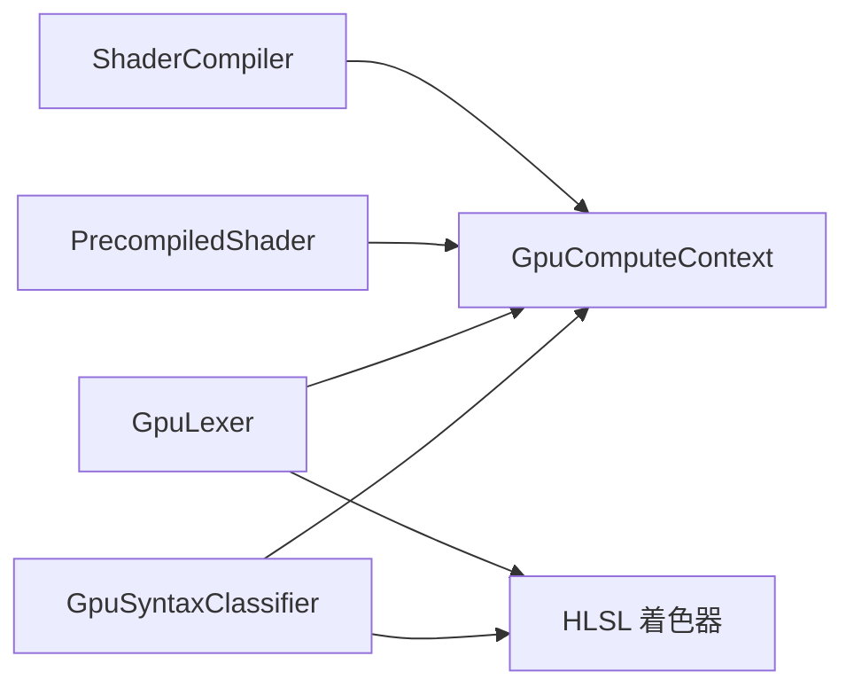

# 着色器管理

<cite>
**本文引用的文件**
- [shader.rs](file://crates/aether-render/src/gpu/shader.rs)
- [lexer.rs](file://crates/aether-render/src/gpu/lexer.rs)
- [compute_context.rs](file://crates/aether-render/src/gpu/compute_context.rs)
- [syntax.rs](file://crates/aether-render/src/gpu/syntax.rs)
- [char_classify.hlsl](file://crates/aether-render/src/gpu/shaders/char_classify.hlsl)
- [token_scan.hlsl](file://crates/aether-render/src/gpu/shaders/token_scan.hlsl)
- [keyword_lookup.hlsl](file://crates/aether-render/src/gpu/shaders/keyword_lookup.hlsl)
- [syntax_classify.hlsl](file://crates/aether-render/src/gpu/shaders/syntax_classify.hlsl)
</cite>

## 目录
1. [简介](#简介)
2. [项目结构](#项目结构)
3. [核心组件](#核心组件)
4. [架构总览](#架构总览)
5. [详细组件分析](#详细组件分析)
6. [依赖关系分析](#依赖关系分析)
7. [性能考量](#性能考量)
8. [故障排查指南](#故障排查指南)
9. [结论](#结论)
10. [附录](#附录)

## 简介
本技术文档围绕着色器管理系统，系统性说明 HLSL 着色器的编译流程（源代码解析、语法检查与二进制生成）、着色器缓存机制（哈希计算、版本管理与热重载支持）、不同类型着色器的用途与配置选项、加载与绑定常量缓冲区的示例流程、优化技术与调试方法，以及兼容性处理与错误诊断工具的使用。系统基于 Direct3D 11 Compute Shader 实现高性能的 GPU 词法分析与语法分类管线，并通过 d3dcompiler_47.dll 完成 HLSL 到字节码的编译。

## 项目结构
本项目在 aether-render 模块中实现了完整的 GPU 着色器管理与执行管线：
- 着色器编译器与预编译加载器：负责调用 D3DCompile 将 HLSL 源码编译为 CSO 字节码，或从已编译字节码创建 Compute Shader。
- GPU 计算上下文：封装 D3D11 设备与上下文，提供缓冲区创建、SRV/UAV 设置、Compute Shader 分派与数据回读等能力。
- GPU 词法分析器：实现三阶段并行词法分析（字符分类、Token 扫描、关键字查找），并维护必要的 GPU 工作缓冲区。
- GPU 语法分类器：基于 Token 流进行简单语法模式识别，输出语法分类结果。
- HLSL 着色器源文件：包含字符分类、Token 扫描、关键字查找、语法分类四个阶段的着色器实现。

图表来源
- [shader.rs:22-80](file://crates/aether-render/src/gpu/shader.rs#L22-L80)
- [compute_context.rs:96-114](file://crates/aether-render/src/gpu/compute_context.rs#L96-L114)
- [lexer.rs:187-221](file://crates/aether-render/src/gpu/lexer.rs#L187-L221)
- [syntax.rs:93-124](file://crates/aether-render/src/gpu/syntax.rs#L93-L124)

章节来源
- [shader.rs:1-150](file://crates/aether-render/src/gpu/shader.rs#L1-L150)
- [lexer.rs:1-430](file://crates/aether-render/src/gpu/lexer.rs#L1-L430)
- [compute_context.rs:1-399](file://crates/aether-render/src/gpu/compute_context.rs#L1-L399)
- [syntax.rs:1-289](file://crates/aether-render/src/gpu/syntax.rs#L1-L289)

## 核心组件
- 着色器编译器（ShaderCompiler）：使用 d3dcompiler_47.dll 的 D3DCompile API 将 HLSL 源码编译为 CSO 字节码，启用严格模式与优化等级 3，并输出错误信息以便诊断。
- 预编译着色器加载器（PrecompiledShader）：从已编译的 CSO 字节码创建 Compute Shader，便于部署时跳过运行时编译。
- GPU 计算上下文（GpuComputeContext）：封装 D3D11 设备与上下文，提供缓冲区创建、SRV/UAV 设置、Compute Shader 分派、数据上传/回读等基础能力。
- GPU 词法分析器（GpuLexer）：实现三阶段并行词法分析，包括字符分类、Token 扫描、关键字查找；维护 DFA 表、关键字完美哈希表与工作缓冲区。
- GPU 语法分类器（GpuSyntaxClassifier）：基于 Token 流与语言特定的语法模式进行并行匹配，输出语法分类结果。

章节来源
- [shader.rs:7-116](file://crates/aether-render/src/gpu/shader.rs#L7-L116)
- [compute_context.rs:17-399](file://crates/aether-render/src/gpu/compute_context.rs#L17-L399)
- [lexer.rs:48-221](file://crates/aether-render/src/gpu/lexer.rs#L48-L221)
- [syntax.rs:39-124](file://crates/aether-render/src/gpu/syntax.rs#L39-L124)

## 架构总览
下图展示了从 HLSL 源码到 GPU 执行的完整流程，包括编译、资源绑定、流水线执行与结果回读。

图表来源
- [shader.rs:22-80](file://crates/aether-render/src/gpu/shader.rs#L22-L80)
- [compute_context.rs:96-114](file://crates/aether-render/src/gpu/compute_context.rs#L96-L114)
- [lexer.rs:125-221](file://crates/aether-render/src/gpu/lexer.rs#L125-L221)
- [syntax.rs:74-124](file://crates/aether-render/src/gpu/syntax.rs#L74-L124)

## 详细组件分析

### 着色器编译流程（源代码解析、语法检查、二进制生成）
- 编译入口：ShaderCompiler::compile_compute_shader 接收 HLSL 源码、入口点与目标模型（如 cs_5_0），调用 D3DCompile 进行编译。
- 编译标志：启用严格模式与优化等级 3，确保代码质量与性能。
- 错误处理：若存在错误，则从 error_blob 提取错误消息并打印，便于调试。
- 二进制生成：成功时从 code_blob 获取指针与大小，拷贝为 Vec<u8> 返回。

图表来源
- [shader.rs:22-80](file://crates/aether-render/src/gpu/shader.rs#L22-L80)

章节来源
- [shader.rs:22-80](file://crates/aether-render/src/gpu/shader.rs#L22-L80)

### 着色器缓存机制（哈希计算、版本管理、热重载支持）
当前仓库未直接实现统一的“着色器缓存”抽象层，但提供了以下关键能力以支撑缓存与热重载：
- 运行时编译：通过 ShaderCompiler 可动态编译 HLSL 源码为字节码，适合开发期热重载。
- 预编译加载：通过 PrecompiledShader 可从已编译字节码创建 Compute Shader，适合部署期快速启动。
- 版本管理建议：可在上层根据 HLSL 源码内容计算哈希（例如 FNV-1a），结合文件修改时间戳构建缓存键；当哈希变化时触发重新编译与替换。
- 热重载流程：监听 HLSL 文件变更 -> 计算新哈希 -> 比较旧缓存 -> 命中则复用，否则重新编译并更新 Compute Shader 引用。

注意：具体哈希算法与缓存存储策略需在上层业务逻辑中实现；当前系统提供编译与加载接口以满足该需求。

章节来源
- [shader.rs:103-116](file://crates/aether-render/src/gpu/shader.rs#L103-L116)
- [lexer.rs:165-185](file://crates/aether-render/src/gpu/lexer.rs#L165-L185)

### 不同类型的着色器（用途与配置选项）
- 字符分类着色器（char_classify.hlsl）：每个线程处理一个字符，使用查找表将字符映射为词法类别，输出 CharClasses。
- Token 扫描着色器（token_scan.hlsl）：基于字符分类结果识别 Token 边界，写入 Tokens 与计数器。
- 关键字查找着色器（keyword_lookup.hlsl）：使用完美哈希表对标识符进行关键字匹配，填充 keyword_id。
- 语法分类着色器（syntax_classify.hlsl）：基于 Token 流与语法模式进行并行匹配，输出语法分类结果。

配置要点：
- 线程组大小：各着色器定义 THREAD_GROUP_SIZE = 256，用于 dispatch 分组计算。
- 常量缓冲区：LexerConstants 包含文本长度、最大 Token 数、DFA 状态数、关键字表大小等参数。
- 寄存器绑定：StructuredBuffer/RWStructuredBuffer/cbuffer 使用 register(t0/u0/b0) 等绑定槽位。

章节来源
- [char_classify.hlsl:1-89](file://crates/aether-render/src/gpu/shaders/char_classify.hlsl#L1-L89)
- [token_scan.hlsl:1-46](file://crates/aether-render/src/gpu/shaders/token_scan.hlsl#L1-L46)
- [keyword_lookup.hlsl:1-53](file://crates/aether-render/src/gpu/shaders/keyword_lookup.hlsl#L1-L53)
- [syntax_classify.hlsl:1-142](file://crates/aether-render/src/gpu/shaders/syntax_classify.hlsl#L1-L142)
- [shader.rs:118-150](file://crates/aether-render/src/gpu/shader.rs#L118-L150)

### 加载着色器、绑定常量缓冲区与执行渲染管线的示例流程
以下为典型使用步骤（不展示具体代码内容，仅给出路径引用）：
- 创建 GPU 计算上下文：使用 GpuComputeContext::create_from_d2d 或 new 初始化设备与上下文。
- 编译/加载着色器：
  - 开发期：使用 ShaderCompiler::compile_* 编译 HLSL 源码为字节码，再通过 context.create_compute_shader 创建 Compute Shader。
  - 部署期：使用 PrecompiledShader::load_compute_shader 从字节码创建 Compute Shader。
- 准备常量缓冲区：使用 create_constant_buffer 创建 LexerConstants，并通过 set_shader_resources 绑定到 b0。
- 执行三阶段流水线：
  - 字符分类：dispatch char_classify，输出 CharClasses。
  - Token 扫描：dispatch token_scan，输出 Tokens 与计数。
  - 关键字查找：dispatch keyword_lookup，填充 keyword_id。
- 结果回读：使用 read_buffer 读取计数与 Token 列表至 CPU 内存。
- 语法分类：可选地调用 GpuSyntaxClassifier::classify 进行模式匹配，再 readback_classes 获取结果。

章节来源
- [compute_context.rs:47-84](file://crates/aether-render/src/gpu/compute_context.rs#L47-L84)
- [shader.rs:22-116](file://crates/aether-render/src/gpu/shader.rs#L22-L116)
- [lexer.rs:187-221](file://crates/aether-render/src/gpu/lexer.rs#L187-L221)
- [syntax.rs:93-124](file://crates/aether-render/src/gpu/syntax.rs#L93-L124)

### 复杂逻辑流程图（词法分析流水线）

图表来源
- [lexer.rs:258-401](file://crates/aether-render/src/gpu/lexer.rs#L258-L401)

章节来源
- [lexer.rs:258-401](file://crates/aether-render/src/gpu/lexer.rs#L258-L401)

## 依赖关系分析
- 组件耦合：
  - GpuLexer 依赖 GpuComputeContext 进行资源管理与调度。
  - GpuSyntaxClassifier 同样依赖 GpuComputeContext，并与 GpuLexer 共享 Token 数据结构。
  - ShaderCompiler 与 PrecompiledShader 均依赖 D3D11 设备上下文。
- 外部依赖：
  - Windows Direct3D 11 API（ID3D11Device、ID3D11DeviceContext、ID3D11ComputeShader 等）。
  - d3dcompiler_47.dll 提供的 D3DCompile 函数。
- 潜在循环依赖：无直接循环依赖；各模块职责清晰，通过上下文对象解耦。

图表来源
- [shader.rs:7-116](file://crates/aether-render/src/gpu/shader.rs#L7-L116)
- [compute_context.rs:17-399](file://crates/aether-render/src/gpu/compute_context.rs#L17-L399)
- [lexer.rs:48-221](file://crates/aether-render/src/gpu/lexer.rs#L48-L221)
- [syntax.rs:39-124](file://crates/aether-render/src/gpu/syntax.rs#L39-L124)

章节来源
- [shader.rs:7-116](file://crates/aether-render/src/gpu/shader.rs#L7-L116)
- [compute_context.rs:17-399](file://crates/aether-render/src/gpu/compute_context.rs#L17-L399)
- [lexer.rs:48-221](file://crates/aether-render/src/gpu/lexer.rs#L48-L221)
- [syntax.rs:39-124](file://crates/aether-render/src/gpu/syntax.rs#L39-L124)

## 性能考量
- 并行粒度：各阶段使用 256 线程组，按文本长度或 Token 数量计算分组数，充分利用 GPU 并行能力。
- 缓冲区复用：GpuLexer 内部维护工作缓冲区（CharClasses、Tokens、计数器等），避免频繁分配与释放。
- 数据回读开销：read_buffer 使用暂存缓冲区与 Map/Unmap，应尽量减少回读频率与数据量。
- 优化级别：编译时启用优化等级 3，有助于提升着色器执行效率。
- 内存对齐：GpuToken、SyntaxClass、SyntaxPattern 等结构体使用 #[repr(C)] 保证与着色器侧布局一致，减少额外开销。

[本节为通用性能讨论，不直接分析具体文件]

## 故障排查指南
- 编译错误诊断：
  - 当 D3DCompile 返回错误时，会从 error_blob 提取错误消息并打印，定位 HLSL 语法或语义问题。
  - 若编译成功但未返回字节码，会返回明确错误提示。
- 空字节码保护：
  - create_compute_shader 对空字节码进行检查并返回错误，防止无效着色器被创建。
- 常见问题：
  - 缓冲区尺寸不足：ensure_buffers 会根据文本长度与最大 Token 数动态调整，确保后续阶段正常运行。
  - 寄存器冲突：确保 HLSL 中的 register 绑定与 Rust 侧设置一致（t0/u0/b0 等）。
  - 线程越界：main 函数中对 id.x >= TextLength 或 TokenCount 的检查避免越界访问。

章节来源
- [shader.rs:55-78](file://crates/aether-render/src/gpu/shader.rs#L55-L78)
- [compute_context.rs:96-114](file://crates/aether-render/src/gpu/compute_context.rs#L96-L114)
- [lexer.rs:258-314](file://crates/aether-render/src/gpu/lexer.rs#L258-L314)
- [char_classify.hlsl:81-89](file://crates/aether-render/src/gpu/shaders/char_classify.hlsl#L81-L89)
- [syntax_classify.hlsl:101-142](file://crates/aether-render/src/gpu/shaders/syntax_classify.hlsl#L101-L142)

## 结论
本着色器管理系统通过模块化设计实现了高效的 GPU 词法分析与语法分类管线。利用 D3DCompile 完成 HLSL 到字节码的编译，结合 GpuComputeContext 统一管理 GPU 资源，GpuLexer 与 GpuSyntaxClassifier 分别承担词法与语法任务。系统在错误诊断、性能优化与资源复用方面具备良好实践，同时为缓存与热重载提供了可扩展的基础能力。建议在业务层补充哈希计算与缓存策略，以实现更完善的版本管理与热重载体验。

[本节为总结性内容，不直接分析具体文件]

## 附录
- 相关数据结构与常量：
  - GpuToken：包含 start、len、token_type、keyword_id、syntax_class 等字段。
  - LexerConstants：包含 text_length、max_tokens、num_states、keyword_table_size 等常量。
  - SyntaxClass/SyntaxPattern：用于语法分类的模式与结果。
- 着色器阶段说明：
  - 字符分类：将原始字节映射为词法类别。
  - Token 扫描：识别 Token 边界并写入计数。
  - 关键字查找：基于完美哈希表匹配关键字。
  - 语法分类：基于 Token 流与模式进行并行匹配。

章节来源
- [lexer.rs:11-46](file://crates/aether-render/src/gpu/lexer.rs#L11-L46)
- [shader.rs:118-150](file://crates/aether-render/src/gpu/shader.rs#L118-L150)
- [syntax.rs:10-72](file://crates/aether-render/src/gpu/syntax.rs#L10-L72)