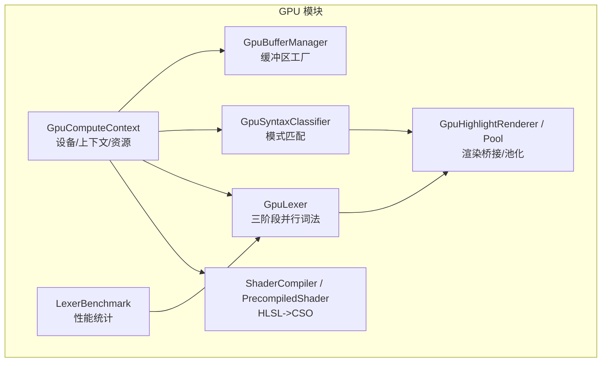
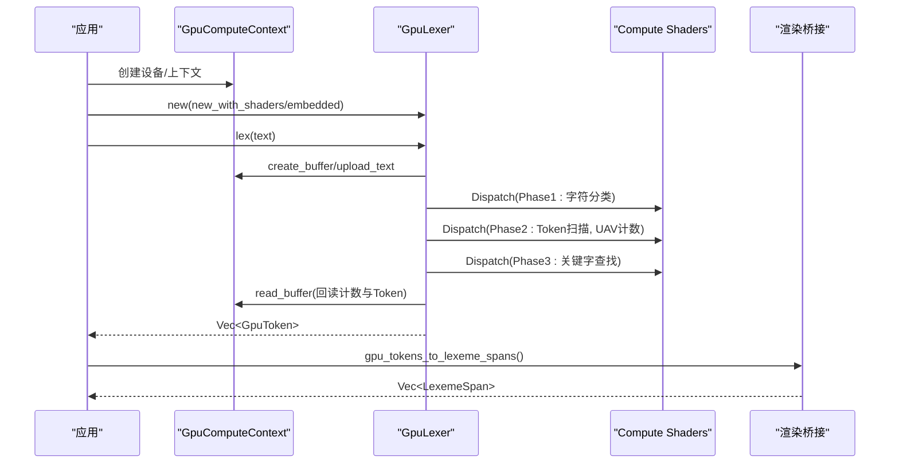
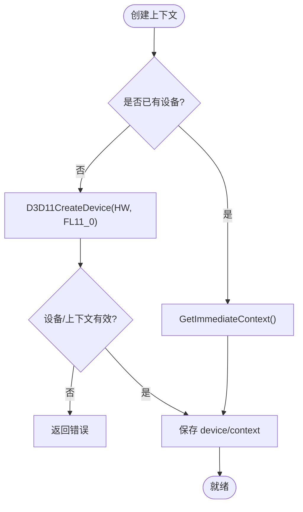
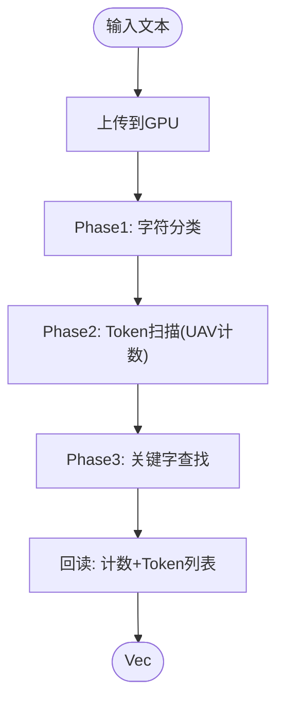
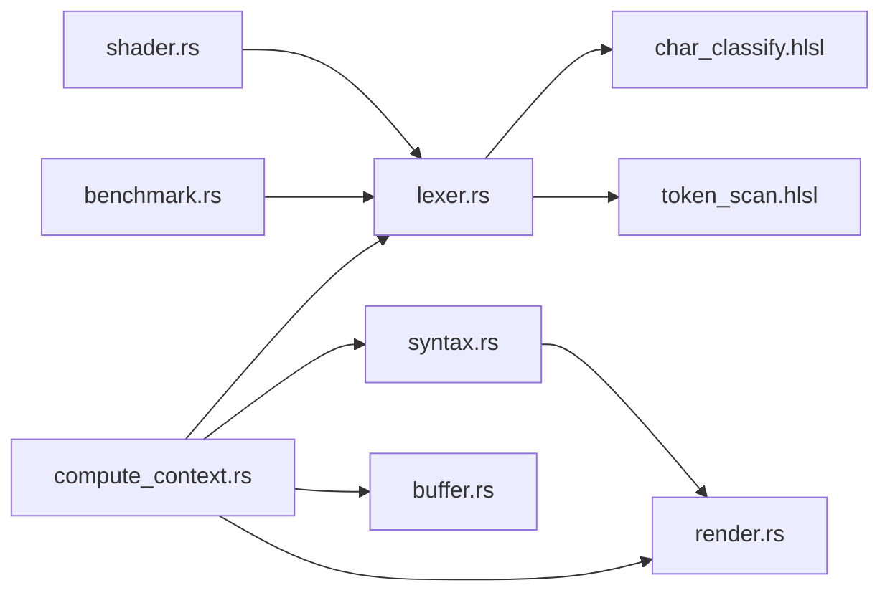

# 计算上下文管理

<cite>
**本文引用的文件**
- [compute_context.rs](file://crates/aether-render/src/gpu/compute_context.rs)
- [shader.rs](file://crates/aether-render/src/gpu/shader.rs)
- [lexer.rs](file://crates/aether-render/src/gpu/lexer.rs)
- [syntax.rs](file://crates/aether-render/src/gpu/syntax.rs)
- [buffer.rs](file://crates/aether-render/src/gpu/buffer.rs)
- [render.rs](file://crates/aether-render/src/gpu/render.rs)
- [benchmark.rs](file://crates/aether-render/src/gpu/benchmark.rs)
- [char_classify.hlsl](file://crates/aether-render/src/gpu/shaders/char_classify.hlsl)
- [token_scan.hlsl](file://crates/aether-render/src/gpu/shaders/token_scan.hlsl)
</cite>

## 目录
1. [简介](#简介)
2. [项目结构](#项目结构)
3. [核心组件](#核心组件)
4. [架构总览](#架构总览)
5. [详细组件分析](#详细组件分析)
6. [依赖关系分析](#依赖关系分析)
7. [性能考量](#性能考量)
8. [故障排查指南](#故障排查指南)
9. [结论](#结论)
10. [附录：使用示例与最佳实践](#附录使用示例与最佳实践)

## 简介
本技术文档聚焦于“计算上下文管理模块”，围绕 GPU 计算上下文的初始化、命令队列（设备上下文）与资源绑定、内存同步机制，以及计算任务的调度与管理展开。该模块基于 Direct3D 11 的 Compute Shader 实现高性能的词法分析与语法分类，并通过缓冲区池、双缓冲等策略优化吞吐与延迟。文档同时提供创建上下文、提交任务、清理资源的步骤指引，并给出性能监控与调试建议，以及驱动兼容性与限制的处理方案。

## 项目结构
GPU 相关代码位于 aether-render 的 gpu 子模块中，主要包含：
- 计算上下文与资源管理：compute_context.rs、buffer.rs
- Shader 编译与加载：shader.rs
- 词法分析管线：lexer.rs + HLSL 着色器（char_classify.hlsl、token_scan.hlsl）
- 语法分类：syntax.rs
- 渲染桥接与缓冲池：render.rs
- 基准测试工具：benchmark.rs

图表来源
- [compute_context.rs:17-94](file://crates/aether-render/src/gpu/compute_context.rs#L17-L94)
- [shader.rs:7-116](file://crates/aether-render/src/gpu/shader.rs#L7-L116)
- [lexer.rs:48-221](file://crates/aether-render/src/gpu/lexer.rs#L48-L221)
- [syntax.rs:39-124](file://crates/aether-render/src/gpu/syntax.rs#L39-L124)
- [buffer.rs:6-47](file://crates/aether-render/src/gpu/buffer.rs#L6-L47)
- [render.rs:116-219](file://crates/aether-render/src/gpu/render.rs#L116-L219)
- [benchmark.rs:3-157](file://crates/aether-render/src/gpu/benchmark.rs#L3-L157)

章节来源
- [compute_context.rs:17-94](file://crates/aether-render/src/gpu/compute_context.rs#L17-L94)
- [mod.rs:1-10](file://crates/aether-render/src/gpu/mod.rs#L1-L10)

## 核心组件
- GpuComputeContext：封装 ID3D11Device 与 ID3D11DeviceContext，提供 CreateBuffer、CreateSRV/UAV、Dispatch、读写缓冲等基础能力。
- ShaderCompiler/PrecompiledShader：将 HLSL 源码编译为 CSO 字节码，或从预编译字节码创建 Compute Shader。
- GpuLexer：三阶段并行词法分析（字符分类→Token扫描→关键字查找），负责资源准备、分派与回读。
- GpuSyntaxClassifier：基于 Token 流与语言模式的 GPU 并行语法分类。
- GpuBufferManager/GpuBufferPool：统一创建与复用 GPU 缓冲区，降低分配开销。
- GpuHighlightRenderer：将 GPU Token 转换为渲染所需的 LexemeSpan，并进行合并优化。
- LexerBenchmark：统计不同方案的吞吐、延迟与加速比。

章节来源
- [compute_context.rs:17-399](file://crates/aether-render/src/gpu/compute_context.rs#L17-L399)
- [shader.rs:7-150](file://crates/aether-render/src/gpu/shader.rs#L7-L150)
- [lexer.rs:48-430](file://crates/aether-render/src/gpu/lexer.rs#L48-L430)
- [syntax.rs:39-289](file://crates/aether-render/src/gpu/syntax.rs#L39-L289)
- [buffer.rs:6-47](file://crates/aether-render/src/gpu/buffer.rs#L6-L47)
- [render.rs:7-219](file://crates/aether-render/src/gpu/render.rs#L7-L219)
- [benchmark.rs:3-287](file://crates/aether-render/src/gpu/benchmark.rs#L3-L287)

## 架构总览
计算流程采用“CPU 编排 + GPU 并行”的分层架构：
- CPU 侧负责资源创建、数据上传、阶段调度与结果回读。
- GPU 侧通过 Compute Shader 执行高并行度的字符分类、Token 扫描与关键字查找。
- 资源以 SRV/UAV 形式在阶段间传递，使用 UAV 计数器进行原子写入以避免竞争。
- 渲染侧对 GPU 输出的 Token 进行转换与合并，减少绘制调用。

图表来源
- [compute_context.rs:38-94](file://crates/aether-render/src/gpu/compute_context.rs#L38-L94)
- [lexer.rs:187-221](file://crates/aether-render/src/gpu/lexer.rs#L187-L221)
- [render.rs:7-32](file://crates/aether-render/src/gpu/render.rs#L7-L32)

## 详细组件分析

### 计算上下文与资源管理（GpuComputeContext）
- 设备创建与上下文获取：
  - 支持从已有 D3D11 设备构造，或独立创建硬件设备（Feature Level 11_0）。
  - 立即上下文用于后续所有命令提交。
- 资源创建与绑定：
  - 通用缓冲区创建：支持常量、结构化、可读写、暂存等多种用途。
  - 结构化缓冲区与 UAV：用于 Compute Shader 输入/输出，支持原子计数器。
  - SRV/UAV 视图：供 Shader 读取或写入。
- 命令提交与同步：
  - 设置 Compute Shader、资源绑定后，Dispatch 提交线程组。
  - 通过 CopyResource + Map/Unmap 实现 CPU-GPU 数据回读/上传。
- 错误处理：
  - 空字节码返回错误；设备/上下文为空时返回错误；DXGI/D3D 调用失败通过 Result 传播。

图表来源
- [compute_context.rs:38-94](file://crates/aether-render/src/gpu/compute_context.rs#L38-L94)

章节来源
- [compute_context.rs:17-399](file://crates/aether-render/src/gpu/compute_context.rs#L17-L399)

### Shader 编译与加载（ShaderCompiler / PrecompiledShader）
- 运行时编译：
  - 使用 d3dcompiler_47.dll 的 D3DCompile 将 HLSL 源码编译为 CSO 字节码。
  - 提供便捷方法针对各阶段的入口函数与目标模型（cs_5_0）。
- 预编译加载：
  - 从已存在的字节码直接创建 Compute Shader，避免运行期编译开销。
- 常量缓冲区：
  - 提供创建常量缓冲区的辅助函数，便于向 Shader 传递配置参数。

章节来源
- [shader.rs:7-150](file://crates/aether-render/src/gpu/shader.rs#L7-L150)

### 词法分析管线（GpuLexer）
- 三阶段并行处理：
  - Phase1 字符分类：每个线程处理一个字符，查表得到类别。
  - Phase2 Token 扫描：识别 Token 边界，使用原子计数器写入全局列表。
  - Phase3 关键字查找：根据关键字表填充 keyword_id。
- 资源管理：
  - DFA 表与关键字表作为只读 SRV 长期持有。
  - 工作缓冲区按需分配与复用（ensure_buffers）。
- 数据流：
  - 文本上传 → 分类 → 扫描 → 关键字查找 → 回读计数与 Token 列表。

图表来源
- [lexer.rs:187-221](file://crates/aether-render/src/gpu/lexer.rs#L187-L221)
- [char_classify.hlsl:61-88](file://crates/aether-render/src/gpu/shaders/char_classify.hlsl#L61-L88)
- [token_scan.hlsl:56-313](file://crates/aether-render/src/gpu/shaders/token_scan.hlsl#L56-L313)

章节来源
- [lexer.rs:48-430](file://crates/aether-render/src/gpu/lexer.rs#L48-L430)
- [char_classify.hlsl:1-89](file://crates/aether-render/src/gpu/shaders/char_classify.hlsl#L1-L89)
- [token_scan.hlsl:1-313](file://crates/aether-render/src/gpu/shaders/token_scan.hlsl#L1-L313)

### 语法分类（GpuSyntaxClassifier）
- 基于 Token 序列的模式匹配，按优先级输出语法分类（如函数声明、类型名、变量声明等）。
- 模式表作为只读 SRV 传入 Shader，输出为 RWStructuredBuffer。
- 提供回读接口将 GPU 结果转回 CPU 向量。

章节来源
- [syntax.rs:39-289](file://crates/aether-render/src/gpu/syntax.rs#L39-L289)

### 缓冲区管理与池化（GpuBufferManager / GpuBufferPool）
- 管理器：集中创建文本、Token、字符分类、计数器等常用缓冲区。
- 池化：维护可用与在用缓冲区集合，减少频繁分配/释放带来的开销。
- 双缓冲：在渲染路径中交替读写，避免 CPU/GPU 等待。

章节来源
- [buffer.rs:6-47](file://crates/aether-render/src/gpu/buffer.rs#L6-L47)
- [render.rs:128-219](file://crates/aether-render/src/gpu/render.rs#L128-L219)

### 渲染桥接（GpuHighlightRenderer）
- 将 GPU Token 转换为 LexemeSpan，并根据语法分类提升语义精度。
- 合并相邻同色 Token，减少绘制调用次数。
- 颜色映射由主题决定，便于统一外观。

章节来源
- [render.rs:7-126](file://crates/aether-render/src/gpu/render.rs#L7-L126)

## 依赖关系分析
- compute_context.rs 被 lexer.rs、syntax.rs、buffer.rs、render.rs 广泛引用，作为底层资源与命令提交的核心。
- shader.rs 为 lexer.rs 提供运行时编译或预编译加载能力。
- lexer.rs 依赖 HLSL 着色器（char_classify.hlsl、token_scan.hlsl）完成并行计算。
- render.rs 依赖 lexer.rs 与 syntax.rs 的输出，完成最终渲染数据构建。
- benchmark.rs 独立于具体实现，用于对比不同方案的性能。

图表来源
- [compute_context.rs:17-399](file://crates/aether-render/src/gpu/compute_context.rs#L17-L399)
- [shader.rs:7-150](file://crates/aether-render/src/gpu/shader.rs#L7-L150)
- [lexer.rs:48-430](file://crates/aether-render/src/gpu/lexer.rs#L48-L430)
- [syntax.rs:39-289](file://crates/aether-render/src/gpu/syntax.rs#L39-L289)
- [render.rs:7-219](file://crates/aether-render/src/gpu/render.rs#L7-L219)
- [benchmark.rs:3-287](file://crates/aether-render/src/gpu/benchmark.rs#L3-L287)

章节来源
- [compute_context.rs:17-399](file://crates/aether-render/src/gpu/compute_context.rs#L17-L399)
- [shader.rs:7-150](file://crates/aether-render/src/gpu/shader.rs#L7-L150)
- [lexer.rs:48-430](file://crates/aether-render/src/gpu/lexer.rs#L48-L430)
- [syntax.rs:39-289](file://crates/aether-render/src/gpu/syntax.rs#L39-L289)
- [render.rs:7-219](file://crates/aether-render/src/gpu/render.rs#L7-L219)
- [benchmark.rs:3-287](file://crates/aether-render/src/gpu/benchmark.rs#L3-L287)

## 性能考量
- 并行粒度：
  - 每阶段按 256 线程为一组进行 Dispatch，适合大规模文本处理。
- 内存访问：
  - 使用 RWStructuredBuffer 与原子计数器避免写冲突；UAV 仅用于写入，SRV 用于只读。
- 数据搬运：
  - 上传/回读通过 Staging Buffer + CopyResource，减少 GPU/CPU 同步成本。
- 资源复用：
  - GpuBufferPool 与 ensure_buffers 减少频繁分配；DoubleBuffer 避免阻塞。
- 基准工具：
  - LexerBenchmark 统计平均/最小/最大耗时、吞吐量与每行延迟，便于回归与优化。

章节来源
- [lexer.rs:258-370](file://crates/aether-render/src/gpu/lexer.rs#L258-L370)
- [render.rs:128-219](file://crates/aether-render/src/gpu/render.rs#L128-L219)
- [benchmark.rs:3-157](file://crates/aether-render/src/gpu/benchmark.rs#L3-L157)

## 故障排查指南
- 设备/上下文创建失败：
  - 检查 Feature Level 是否满足（至少 11_0），驱动版本是否支持。
  - 若从 D2D Factory 获取设备，确保查询到有效的 D3D11 设备与上下文。
- Shader 编译失败：
  - 确认 HLSL 源码非空且入口函数与目标模型匹配（cs_5_0）。
  - 捕获并打印错误 Blob 信息定位语法或 API 问题。
- 空字节码错误：
  - 部署时应使用预编译 CSO 或正确嵌入 HLSL；空字节码会触发错误。
- 资源未释放/泄漏：
  - 使用池化管理缓冲区生命周期；确保 release/clear 被调用。
- 同步与可见性：
  - 回读前确保所有 Dispatch 已完成；必要时使用显式屏障或顺序提交。
- 驱动兼容性与限制：
  - 某些旧驱动可能不支持特定 UAV 特性或原子操作；需降级策略或回退到 CPU。
  - 大缓冲区可能导致内存不足；应分批处理或限制最大尺寸。

章节来源
- [compute_context.rs:47-84](file://crates/aether-render/src/gpu/compute_context.rs#L47-L84)
- [shader.rs:22-80](file://crates/aether-render/src/gpu/shader.rs#L22-L80)
- [lexer.rs:93-113](file://crates/aether-render/src/gpu/lexer.rs#L93-L113)
- [render.rs:161-219](file://crates/aether-render/src/gpu/render.rs#L161-L219)

## 结论
该计算上下文管理模块以 Direct3D 11 为基础，构建了高效的 GPU 并行词法与语法分析管线。通过清晰的资源抽象、阶段化的计算流程与完善的缓冲池策略，实现了高吞吐与低延迟。配合基准测试与调试工具，可在实际工程中持续优化与维护。面对驱动差异与硬件限制，提供了可扩展的回退与容错机制。

## 附录：使用示例与最佳实践
以下示例以“步骤说明 + 文件路径引用”的形式展示关键用法，不直接粘贴代码内容。

- 创建计算上下文
  - 从已有设备构造：参考 [compute_context.rs:38-45](file://crates/aether-render/src/gpu/compute_context.rs#L38-L45)
  - 独立创建设备：参考 [compute_context.rs:47-84](file://crates/aether-render/src/gpu/compute_context.rs#L47-L84)

- 编译/加载 Shader
  - 运行时编译 HLSL：参考 [shader.rs:22-80](file://crates/aether-render/src/gpu/shader.rs#L22-L80)
  - 从预编译字节码创建：参考 [shader.rs:103-116](file://crates/aether-render/src/gpu/shader.rs#L103-L116)

- 创建缓冲区与视图
  - 通用缓冲区：参考 [compute_context.rs:116-139](file://crates/aether-render/src/gpu/compute_context.rs#L116-L139)
  - 结构化缓冲区与 UAV：参考 [compute_context.rs:141-206](file://crates/aether-render/src/gpu/compute_context.rs#L141-L206)
  - SRV 视图：参考 [compute_context.rs:208-230](file://crates/aether-render/src/gpu/compute_context.rs#L208-L230)

- 提交计算任务
  - 设置 Shader 与资源：参考 [compute_context.rs:244-272](file://crates/aether-render/src/gpu/compute_context.rs#L244-L272)
  - 分派线程组：参考 [compute_context.rs:232-242](file://crates/aether-render/src/gpu/compute_context.rs#L232-L242)

- 数据回读与上传
  - 回读 GPU 结果：参考 [compute_context.rs:274-312](file://crates/aether-render/src/gpu/compute_context.rs#L274-L312)
  - 上传数据到 GPU：参考 [compute_context.rs:314-349](file://crates/aether-render/src/gpu/compute_context.rs#L314-L349)

- 完整词法分析流程
  - 创建 GpuLexer（嵌入式 HLSL）：参考 [lexer.rs:165-185](file://crates/aether-render/src/gpu/lexer.rs#L165-L185)
  - 执行 lex：参考 [lexer.rs:187-221](file://crates/aether-render/src/gpu/lexer.rs#L187-L221)
  - 回读 Token：参考 [lexer.rs:372-401](file://crates/aether-render/src/gpu/lexer.rs#L372-L401)

- 语法分类
  - 创建分类器：参考 [syntax.rs:74-91](file://crates/aether-render/src/gpu/syntax.rs#L74-L91)
  - 执行 classify：参考 [syntax.rs:93-124](file://crates/aether-render/src/gpu/syntax.rs#L93-L124)
  - 回读结果：参考 [syntax.rs:126-142](file://crates/aether-render/src/gpu/syntax.rs#L126-L142)

- 渲染桥接与缓冲池
  - Token 转 LexemeSpan：参考 [render.rs:7-32](file://crates/aether-render/src/gpu/render.rs#L7-L32)
  - 合并同色 Token：参考 [render.rs:74-106](file://crates/aether-render/src/gpu/render.rs#L74-L106)
  - 缓冲池使用：参考 [render.rs:161-219](file://crates/aether-render/src/gpu/render.rs#L161-L219)

- 性能监控
  - 基准测试框架：参考 [benchmark.rs:3-157](file://crates/aether-render/src/gpu/benchmark.rs#L3-L157)
  - 生成报告：参考 [benchmark.rs:94-157](file://crates/aether-render/src/gpu/benchmark.rs#L94-L157)

- 最佳实践
  - 尽量复用缓冲区与 Shader，避免重复创建。
  - 使用池化与双缓冲减少分配与同步开销。
  - 对大文本进行分块处理，控制单次 Dispatch 规模。
  - 在回读前确保 GPU 命令全部完成，避免数据竞争。
  - 针对驱动差异准备降级路径（如回退到 CPU 解析）。